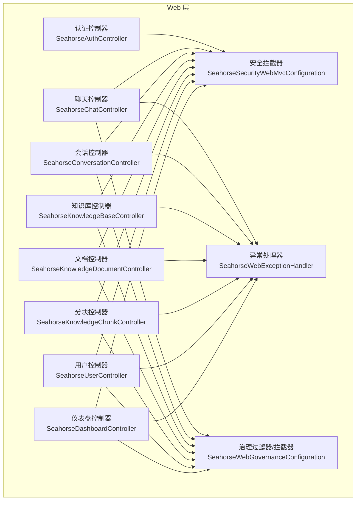
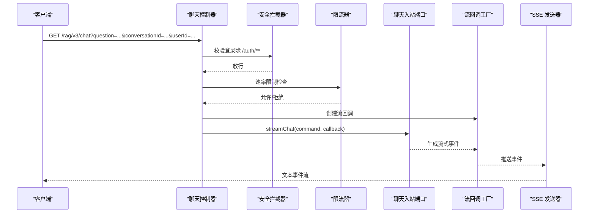
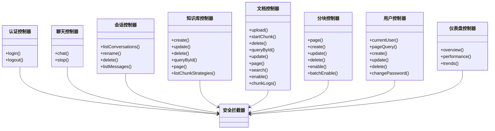

# API 接口文档

<cite>
**本文引用的文件**
- [SeahorseAuthController.java](file://seahorse-agent-adapter-web/src/main/java/com/miracle/ai/seahorse/agent/adapters/web/SeahorseAuthController.java)
- [AuthLoginRequest.java](file://seahorse-agent-adapter-web/src/main/java/com/miracle/ai/seahorse/agent/adapters/web/AuthLoginRequest.java)
- [SeahorseChatController.java](file://seahorse-agent-adapter-web/src/main/java/com/miracle/ai/seahorse/agent/adapters/web/SeahorseChatController.java)
- [SeahorseConversationController.java](file://seahorse-agent-adapter-web/src/main/java/com/miracle/ai/seahorse/agent/adapters/web/SeahorseConversationController.java)
- [SeahorseKnowledgeBaseController.java](file://seahorse-agent-adapter-web/src/main/java/com/miracle/ai/seahorse/agent/adapters/web/SeahorseKnowledgeBaseController.java)
- [KnowledgeBaseCreateRequest.java](file://seahorse-agent-adapter-web/src/main/java/com/miracle/ai/seahorse/agent/adapters/web/KnowledgeBaseCreateRequest.java)
- [SeahorseKnowledgeDocumentController.java](file://seahorse-agent-adapter-web/src/main/java/com/miracle/ai/seahorse/agent/adapters/web/SeahorseKnowledgeDocumentController.java)
- [SeahorseKnowledgeChunkController.java](file://seahorse-agent-adapter-web/src/main/java/com/miracle/ai/seahorse/agent/adapters/web/SeahorseKnowledgeChunkController.java)
- [SeahorseUserController.java](file://seahorse-agent-adapter-web/src/main/java/com/miracle/ai/seahorse/agent/adapters/web/SeahorseUserController.java)
- [UserSaveRequest.java](file://seahorse-agent-adapter-web/src/main/java/com/miracle/ai/seahorse/agent/adapters/web/UserSaveRequest.java)
- [SeahorseDashboardController.java](file://seahorse-agent-adapter-web/src/main/java/com/miracle/ai/seahorse/agent/adapters/web/SeahorseDashboardController.java)
- [SeahorseSecurityWebMvcConfiguration.java](file://seahorse-agent-adapter-web/src/main/java/com/miracle/ai/seahorse/agent/adapters/web/SeahorseSecurityWebMvcConfiguration.java)
- [SeahorseWebExceptionHandler.java](file://seahorse-agent-adapter-web/src/main/java/com/miracle/ai/seahorse/agent/adapters/web/SeahorseWebExceptionHandler.java)
- [SeahorseWebGovernanceConfiguration.java](file://seahorse-agent-adapter-web/src/main/java/com/miracle/ai/seahorse/agent/adapters/web/SeahorseWebGovernanceConfiguration.java)
</cite>

## 目录
1. [简介](#简介)
2. [项目结构](#项目结构)
3. [核心组件](#核心组件)
4. [架构总览](#架构总览)
5. [详细组件分析](#详细组件分析)
6. [依赖关系分析](#依赖关系分析)
7. [性能与运维](#性能与运维)
8. [故障排查指南](#故障排查指南)
9. [结论](#结论)
10. [附录](#附录)

## 简介
本文件为 Seahorse Agent 的完整 API 接口文档，覆盖认证、聊天、会话管理、知识库管理、用户与系统管理等模块。文档遵循 RESTful 设计规范，统一采用 JSON 响应体与状态码约定，并提供请求示例路径与错误处理指引，帮助开发者快速集成与排障。

## 项目结构
后端以 Spring MVC 控制器为中心，通过入站端口对接内核服务；Web 层提供统一的 REST 接口与安全治理、异常处理、限流与演示模式控制。

图表来源
- [SeahorseAuthController.java:30-56](file://seahorse-agent-adapter-web/src/main/java/com/miracle/ai/seahorse/agent/adapters/web/SeahorseAuthController.java#L30-L56)
- [SeahorseChatController.java:43-132](file://seahorse-agent-adapter-web/src/main/java/com/miracle/ai/seahorse/agent/adapters/web/SeahorseChatController.java#L43-L132)
- [SeahorseConversationController.java:39-104](file://seahorse-agent-adapter-web/src/main/java/com/miracle/ai/seahorse/agent/adapters/web/SeahorseConversationController.java#L39-L104)
- [SeahorseKnowledgeBaseController.java:44-107](file://seahorse-agent-adapter-web/src/main/java/com/miracle/ai/seahorse/agent/adapters/web/SeahorseKnowledgeBaseController.java#L44-L107)
- [SeahorseKnowledgeDocumentController.java:50-163](file://seahorse-agent-adapter-web/src/main/java/com/miracle/ai/seahorse/agent/adapters/web/SeahorseKnowledgeDocumentController.java#L50-L163)
- [SeahorseKnowledgeChunkController.java:43-117](file://seahorse-agent-adapter-web/src/main/java/com/miracle/ai/seahorse/agent/adapters/web/SeahorseKnowledgeChunkController.java#L43-L117)
- [SeahorseUserController.java:37-92](file://seahorse-agent-adapter-web/src/main/java/com/miracle/ai/seahorse/agent/adapters/web/SeahorseUserController.java#L37-L92)
- [SeahorseDashboardController.java:33-64](file://seahorse-agent-adapter-web/src/main/java/com/miracle/ai/seahorse/agent/adapters/web/SeahorseDashboardController.java#L33-L64)
- [SeahorseSecurityWebMvcConfiguration.java:30-50](file://seahorse-agent-adapter-web/src/main/java/com/miracle/ai/seahorse/agent/adapters/web/SeahorseSecurityWebMvcConfiguration.java#L30-L50)
- [SeahorseWebExceptionHandler.java:28-59](file://seahorse-agent-adapter-web/src/main/java/com/miracle/ai/seahorse/agent/adapters/web/SeahorseWebExceptionHandler.java#L28-L59)
- [SeahorseWebGovernanceConfiguration.java:37-92](file://seahorse-agent-adapter-web/src/main/java/com/miracle/ai/seahorse/agent/adapters/web/SeahorseWebGovernanceConfiguration.java#L37-L92)

章节来源
- [SeahorseAuthController.java:30-56](file://seahorse-agent-adapter-web/src/main/java/com/miracle/ai/seahorse/agent/adapters/web/SeahorseAuthController.java#L30-L56)
- [SeahorseChatController.java:43-132](file://seahorse-agent-adapter-web/src/main/java/com/miracle/ai/seahorse/agent/adapters/web/SeahorseChatController.java#L43-L132)
- [SeahorseConversationController.java:39-104](file://seahorse-agent-adapter-web/src/main/java/com/miracle/ai/seahorse/agent/adapters/web/SeahorseConversationController.java#L39-L104)
- [SeahorseKnowledgeBaseController.java:44-107](file://seahorse-agent-adapter-web/src/main/java/com/miracle/ai/seahorse/agent/adapters/web/SeahorseKnowledgeBaseController.java#L44-L107)
- [SeahorseKnowledgeDocumentController.java:50-163](file://seahorse-agent-adapter-web/src/main/java/com/miracle/ai/seahorse/agent/adapters/web/SeahorseKnowledgeDocumentController.java#L50-L163)
- [SeahorseKnowledgeChunkController.java:43-117](file://seahorse-agent-adapter-web/src/main/java/com/miracle/ai/seahorse/agent/adapters/web/SeahorseKnowledgeChunkController.java#L43-L117)
- [SeahorseUserController.java:37-92](file://seahorse-agent-adapter-web/src/main/java/com/miracle/ai/seahorse/agent/adapters/web/SeahorseUserController.java#L37-L92)
- [SeahorseDashboardController.java:33-64](file://seahorse-agent-adapter-web/src/main/java/com/miracle/ai/seahorse/agent/adapters/web/SeahorseDashboardController.java#L33-L64)
- [SeahorseSecurityWebMvcConfiguration.java:30-50](file://seahorse-agent-adapter-web/src/main/java/com/miracle/ai/seahorse/agent/adapters/web/SeahorseSecurityWebMvcConfiguration.java#L30-L50)
- [SeahorseWebExceptionHandler.java:28-59](file://seahorse-agent-adapter-web/src/main/java/com/miracle/ai/seahorse/agent/adapters/web/SeahorseWebExceptionHandler.java#L28-L59)
- [SeahorseWebGovernanceConfiguration.java:37-92](file://seahorse-agent-adapter-web/src/main/java/com/miracle/ai/seahorse/agent/adapters/web/SeahorseWebGovernanceConfiguration.java#L37-L92)

## 核心组件
- 统一响应结构
  - 字段：code、data、message（异常时）
  - 成功 code 固定为“0”，失败 code 固定为“1”
- 统一鉴权
  - 使用 Sa-Token 拦截器，除 /auth/** 与 /error 外全路径校验登录
- 统一异常处理
  - IllegalArgumentException → 400，IllegalStateException → 409，其他 → 500
- 演示模式
  - 读写操作在 demo 模式下默认禁止，/auth/** 允许

章节来源
- [SeahorseWebExceptionHandler.java:31-59](file://seahorse-agent-adapter-web/src/main/java/com/miracle/ai/seahorse/agent/adapters/web/SeahorseWebExceptionHandler.java#L31-L59)
- [SeahorseSecurityWebMvcConfiguration.java:33-49](file://seahorse-agent-adapter-web/src/main/java/com/miracle/ai/seahorse/agent/adapters/web/SeahorseSecurityWebMvcConfiguration.java#L33-L49)
- [SeahorseWebGovernanceConfiguration.java:47-91](file://seahorse-agent-adapter-web/src/main/java/com/miracle/ai/seahorse/agent/adapters/web/SeahorseWebGovernanceConfiguration.java#L47-L91)

## 架构总览
以下序列图展示一次典型聊天请求的端到端流程。

图表来源
- [SeahorseChatController.java:83-102](file://seahorse-agent-adapter-web/src/main/java/com/miracle/ai/seahorse/agent/adapters/web/SeahorseChatController.java#L83-L102)
- [SeahorseSecurityWebMvcConfiguration.java:33-44](file://seahorse-agent-adapter-web/src/main/java/com/miracle/ai/seahorse/agent/adapters/web/SeahorseSecurityWebMvcConfiguration.java#L33-L44)
- [SeahorseWebExceptionHandler.java:36-52](file://seahorse-agent-adapter-web/src/main/java/com/miracle/ai/seahorse/agent/adapters/web/SeahorseWebExceptionHandler.java#L36-L52)

## 详细组件分析

### 认证接口
- 登录
  - 方法与路径：POST /auth/login
  - 请求体：用户名、密码
  - 返回：code=0 时 data 为登录结果对象
  - 错误：参数缺失抛 400，认证失败由内核抛出
- 登出
  - 方法与路径：POST /auth/logout
  - 返回：code=0
- 参数与返回说明
  - 请求体字段：username、password
  - 成功响应：code、data
  - 失败响应：code=1、message

章节来源
- [SeahorseAuthController.java:44-55](file://seahorse-agent-adapter-web/src/main/java/com/miracle/ai/seahorse/agent/adapters/web/SeahorseAuthController.java#L44-L55)
- [AuthLoginRequest.java:20-40](file://seahorse-agent-adapter-web/src/main/java/com/miracle/ai/seahorse/agent/adapters/web/AuthLoginRequest.java#L20-L40)

### 聊天接口
- 流式对话
  - 方法与路径：GET /rag/v3/chat
  - 查询参数：
    - question（必填）、conversationId（可选）、userId（可选，默认 default）、deepThinking（可选，默认 false）
  - 响应：text/event-stream，事件类型为文本片段
  - 速率限制：基于 RateLimiterPort 的 permits/window 配置
  - 停止任务：POST /rag/v3/stop，参数 taskId
- 会话管理
  - 列出会话：GET /conversations
  - 重命名会话：PUT /conversations/{conversationId}
  - 删除会话：DELETE /conversations/{conversationId}
  - 查看消息：GET /conversations/{conversationId}/messages
  - 用户标识：优先 userId 参数，否则取请求头 X-User-Id，均未提供则默认 default
- 请求与响应规范
  - 成功：code=0，data 为具体数据
  - 失败：code=1，message 为错误信息
- 示例调用路径
  - 登录：[POST /auth/login:44-49](file://seahorse-agent-adapter-web/src/main/java/com/miracle/ai/seahorse/agent/adapters/web/SeahorseAuthController.java#L44-L49)
  - 流式对话：[GET /rag/v3/chat:83-102](file://seahorse-agent-adapter-web/src/main/java/com/miracle/ai/seahorse/agent/adapters/web/SeahorseChatController.java#L83-L102)
  - 停止任务：[POST /rag/v3/stop:104-109](file://seahorse-agent-adapter-web/src/main/java/com/miracle/ai/seahorse/agent/adapters/web/SeahorseChatController.java#L104-L109)
  - 会话列表：[GET /conversations:54-60](file://seahorse-agent-adapter-web/src/main/java/com/miracle/ai/seahorse/agent/adapters/web/SeahorseConversationController.java#L54-L60)
  - 重命名会话：[PUT /conversations/{conversationId}:62-71](file://seahorse-agent-adapter-web/src/main/java/com/miracle/ai/seahorse/agent/adapters/web/SeahorseConversationController.java#L62-L71)
  - 删除会话：[DELETE /conversations/{conversationId}:73-80](file://seahorse-agent-adapter-web/src/main/java/com/miracle/ai/seahorse/agent/adapters/web/SeahorseConversationController.java#L73-L80)
  - 查看消息：[GET /conversations/{conversationId}/messages:82-89](file://seahorse-agent-adapter-web/src/main/java/com/miracle/ai/seahorse/agent/adapters/web/SeahorseConversationController.java#L82-L89)

章节来源
- [SeahorseChatController.java:83-132](file://seahorse-agent-adapter-web/src/main/java/com/miracle/ai/seahorse/agent/adapters/web/SeahorseChatController.java#L83-L132)
- [SeahorseConversationController.java:54-103](file://seahorse-agent-adapter-web/src/main/java/com/miracle/ai/seahorse/agent/adapters/web/SeahorseConversationController.java#L54-L103)

### 知识库管理接口
- 知识库 CRUD
  - 创建：POST /knowledge-base（请求头 X-User-Id 可选）
  - 更新：PUT /knowledge-base/{kb-id}
  - 删除：DELETE /knowledge-base/{kb-id}
  - 查询详情：GET /knowledge-base/{kb-id}
  - 分页查询：GET /knowledge-base（current、size、name）
  - 获取分块策略：GET /knowledge-base/chunk-strategies
- 文档管理
  - 上传：POST /knowledge-base/{kb-id}/docs/upload（multipart/form-data）
  - 启用/禁用：PATCH /knowledge-base/docs/{doc-id}/enable
  - 分块：POST /knowledge-base/docs/{doc-id}/chunk
  - 删除：DELETE /knowledge-base/docs/{doc-id}
  - 查询详情：GET /knowledge-base/docs/{doc-id}
  - 更新：PUT /knowledge-base/docs/{doc-id}
  - 分页：GET /knowledge-base/{kb-id}/docs（current、size、status、keyword）
  - 搜索：GET /knowledge-base/docs/search（keyword、limit）
  - 分块日志：GET /knowledge-base/docs/{doc-id}/chunk-logs（current、size）
- 分块管理
  - 分页：GET /knowledge-base/docs/{doc-id}/chunks（current、size、enabled）
  - 新增：POST /knowledge-base/docs/{doc-id}/chunks
  - 更新：PUT /knowledge-base/docs/{doc-id}/chunks/{chunk-id}
  - 删除：DELETE /knowledge-base/docs/{doc-id}/chunks/{chunk-id}
  - 启用/禁用单个：PATCH /knowledge-base/docs/{doc-id}/chunks/{chunk-id}/enable
  - 批量启用/禁用：PATCH /knowledge-base/docs/{doc-id}/chunks/batch-enable
- 请求与响应规范
  - 成功：code=0，data 为具体数据
  - 失败：code=1，message 为错误信息
- 示例调用路径
  - 创建知识库：[POST /knowledge-base:60-67](file://seahorse-agent-adapter-web/src/main/java/com/miracle/ai/seahorse/agent/adapters/web/SeahorseKnowledgeBaseController.java#L60-L67)
  - 上传文档：[POST /knowledge-base/{kb-id}/docs/upload:66-81](file://seahorse-agent-adapter-web/src/main/java/com/miracle/ai/seahorse/agent/adapters/web/SeahorseKnowledgeDocumentController.java#L66-L81)
  - 分块管理：[PATCH /knowledge-base/docs/{doc-id}/chunks/batch-enable:104-112](file://seahorse-agent-adapter-web/src/main/java/com/miracle/ai/seahorse/agent/adapters/web/SeahorseKnowledgeChunkController.java#L104-L112)

章节来源
- [SeahorseKnowledgeBaseController.java:60-102](file://seahorse-agent-adapter-web/src/main/java/com/miracle/ai/seahorse/agent/adapters/web/SeahorseKnowledgeBaseController.java#L60-L102)
- [SeahorseKnowledgeDocumentController.java:66-163](file://seahorse-agent-adapter-web/src/main/java/com/miracle/ai/seahorse/agent/adapters/web/SeahorseKnowledgeDocumentController.java#L66-L163)
- [SeahorseKnowledgeChunkController.java:59-117](file://seahorse-agent-adapter-web/src/main/java/com/miracle/ai/seahorse/agent/adapters/web/SeahorseKnowledgeChunkController.java#L59-L117)

### 用户与系统管理接口
- 当前用户：GET /user/me
- 用户分页：GET /users（current、size、keyword）
- 创建用户：POST /users
- 更新用户：PUT /users/{id}
- 删除用户：DELETE /users/{id}
- 修改密码：PUT /user/password
- 系统管理员仪表盘
  - 总览：GET /admin/dashboard/overview
  - 性能：GET /admin/dashboard/performance
  - 趋势：GET /admin/dashboard/trends（metric、window、granularity）
- 请求与响应规范
  - 成功：code=0，data 为具体数据
  - 失败：code=1，message 为错误信息
- 示例调用路径
  - 当前用户：[GET /user/me:51-54](file://seahorse-agent-adapter-web/src/main/java/com/miracle/ai/seahorse/agent/adapters/web/SeahorseUserController.java#L51-L54)
  - 创建用户：[POST /users:63-69](file://seahorse-agent-adapter-web/src/main/java/com/miracle/ai/seahorse/agent/adapters/web/SeahorseUserController.java#L63-L69)
  - 仪表盘总览：[GET /admin/dashboard/overview:48-51](file://seahorse-agent-adapter-web/src/main/java/com/miracle/ai/seahorse/agent/adapters/web/SeahorseDashboardController.java#L48-L51)

章节来源
- [SeahorseUserController.java:51-91](file://seahorse-agent-adapter-web/src/main/java/com/miracle/ai/seahorse/agent/adapters/web/SeahorseUserController.java#L51-L91)
- [SeahorseDashboardController.java:48-63](file://seahorse-agent-adapter-web/src/main/java/com/miracle/ai/seahorse/agent/adapters/web/SeahorseDashboardController.java#L48-L63)

## 依赖关系分析
- 控制器依赖入站端口完成业务编排
- 安全层对所有接口生效，/auth/** 与 /error 例外
- 异常处理器统一捕获并返回标准错误结构
- 治理层在 demo 模式下对写操作进行限制

图表来源
- [SeahorseAuthController.java:30-56](file://seahorse-agent-adapter-web/src/main/java/com/miracle/ai/seahorse/agent/adapters/web/SeahorseAuthController.java#L30-L56)
- [SeahorseChatController.java:43-132](file://seahorse-agent-adapter-web/src/main/java/com/miracle/ai/seahorse/agent/adapters/web/SeahorseChatController.java#L43-L132)
- [SeahorseConversationController.java:39-104](file://seahorse-agent-adapter-web/src/main/java/com/miracle/ai/seahorse/agent/adapters/web/SeahorseConversationController.java#L39-L104)
- [SeahorseKnowledgeBaseController.java:44-107](file://seahorse-agent-adapter-web/src/main/java/com/miracle/ai/seahorse/agent/adapters/web/SeahorseKnowledgeBaseController.java#L44-L107)
- [SeahorseKnowledgeDocumentController.java:50-163](file://seahorse-agent-adapter-web/src/main/java/com/miracle/ai/seahorse/agent/adapters/web/SeahorseKnowledgeDocumentController.java#L50-L163)
- [SeahorseKnowledgeChunkController.java:43-117](file://seahorse-agent-adapter-web/src/main/java/com/miracle/ai/seahorse/agent/adapters/web/SeahorseKnowledgeChunkController.java#L43-L117)
- [SeahorseUserController.java:37-92](file://seahorse-agent-adapter-web/src/main/java/com/miracle/ai/seahorse/agent/adapters/web/SeahorseUserController.java#L37-L92)
- [SeahorseDashboardController.java:33-64](file://seahorse-agent-adapter-web/src/main/java/com/miracle/ai/seahorse/agent/adapters/web/SeahorseDashboardController.java#L33-L64)

## 性能与运维
- SSE 超时
  - 配置项：seahorse-agent.web.sse-timeout-ms，默认约 300 秒
- 聊天速率限制
  - 配置项：seahorse-agent.web.chat-rate-limit.permits、window-ms
  - 限流粒度：按用户维度
- 演示模式
  - 配置项：seahorse-agent.web.demo-mode.enabled
  - 行为：写操作（POST/PUT/PATCH/DELETE）在 demo 模式下默认禁止，/auth/** 例外
- 字符集
  - 响应字符集统一设置为 UTF-8

章节来源
- [SeahorseChatController.java:69-81](file://seahorse-agent-adapter-web/src/main/java/com/miracle/ai/seahorse/agent/adapters/web/SeahorseChatController.java#L69-L81)
- [SeahorseWebGovernanceConfiguration.java:47-91](file://seahorse-agent-adapter-web/src/main/java/com/miracle/ai/seahorse/agent/adapters/web/SeahorseWebGovernanceConfiguration.java#L47-L91)

## 故障排查指南
- 常见错误与处理
  - 400（参数错误）：检查请求体字段是否正确，如 /auth/login 的 username/password 是否为空
  - 401（未登录）：确认已登录且令牌有效，/auth/** 除外
  - 403（演示模式只读）：在 demo 模式下避免执行写操作
  - 409（状态冲突）：如速率超限或业务状态不允许
  - 500（服务器错误）：查看服务端日志，定位异常堆栈
- 速率限制
  - 若出现“chat rate limit exceeded”错误，降低请求频率或调整 permits/window 配置
- SSE 连接问题
  - 检查 seahorse-agent.web.sse-timeout-ms 设置，确保客户端具备持续接收能力

章节来源
- [SeahorseWebExceptionHandler.java:36-52](file://seahorse-agent-adapter-web/src/main/java/com/miracle/ai/seahorse/agent/adapters/web/SeahorseWebExceptionHandler.java#L36-L52)
- [SeahorseChatController.java:125-131](file://seahorse-agent-adapter-web/src/main/java/com/miracle/ai/seahorse/agent/adapters/web/SeahorseChatController.java#L125-L131)
- [SeahorseSecurityWebMvcConfiguration.java:33-44](file://seahorse-agent-adapter-web/src/main/java/com/miracle/ai/seahorse/agent/adapters/web/SeahorseSecurityWebMvcConfiguration.java#L33-L44)
- [SeahorseWebGovernanceConfiguration.java:76-84](file://seahorse-agent-adapter-web/src/main/java/com/miracle/ai/seahorse/agent/adapters/web/SeahorseWebGovernanceConfiguration.java#L76-L84)

## 结论
本接口文档基于实际控制器实现，统一了响应结构、鉴权与异常处理机制，并提供了聊天、会话、知识库、用户与仪表盘等模块的完整接口清单。建议在生产环境中合理配置速率限制与演示模式，确保稳定性与安全性。

## 附录
- 统一响应结构
  - 成功：{"code":"0","data":{}}
  - 失败：{"code":"1","message":"错误描述"}
- 请求示例路径参考
  - 登录：[POST /auth/login:44-49](file://seahorse-agent-adapter-web/src/main/java/com/miracle/ai/seahorse/agent/adapters/web/SeahorseAuthController.java#L44-L49)
  - 流式对话：[GET /rag/v3/chat:83-102](file://seahorse-agent-adapter-web/src/main/java/com/miracle/ai/seahorse/agent/adapters/web/SeahorseChatController.java#L83-L102)
  - 停止任务：[POST /rag/v3/stop:104-109](file://seahorse-agent-adapter-web/src/main/java/com/miracle/ai/seahorse/agent/adapters/web/SeahorseChatController.java#L104-L109)
  - 会话列表：[GET /conversations:54-60](file://seahorse-agent-adapter-web/src/main/java/com/miracle/ai/seahorse/agent/adapters/web/SeahorseConversationController.java#L54-L60)
  - 创建知识库：[POST /knowledge-base:60-67](file://seahorse-agent-adapter-web/src/main/java/com/miracle/ai/seahorse/agent/adapters/web/SeahorseKnowledgeBaseController.java#L60-L67)
  - 上传文档：[POST /knowledge-base/{kb-id}/docs/upload:66-81](file://seahorse-agent-adapter-web/src/main/java/com/miracle/ai/seahorse/agent/adapters/web/SeahorseKnowledgeDocumentController.java#L66-L81)
  - 分块批量启用：[PATCH /knowledge-base/docs/{doc-id}/chunks/batch-enable:104-112](file://seahorse-agent-adapter-web/src/main/java/com/miracle/ai/seahorse/agent/adapters/web/SeahorseKnowledgeChunkController.java#L104-L112)
  - 当前用户：[GET /user/me:51-54](file://seahorse-agent-adapter-web/src/main/java/com/miracle/ai/seahorse/agent/adapters/web/SeahorseUserController.java#L51-L54)
  - 仪表盘总览：[GET /admin/dashboard/overview:48-51](file://seahorse-agent-adapter-web/src/main/java/com/miracle/ai/seahorse/agent/adapters/web/SeahorseDashboardController.java#L48-L51)