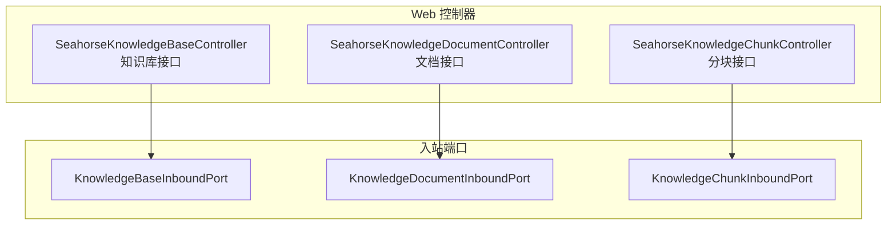
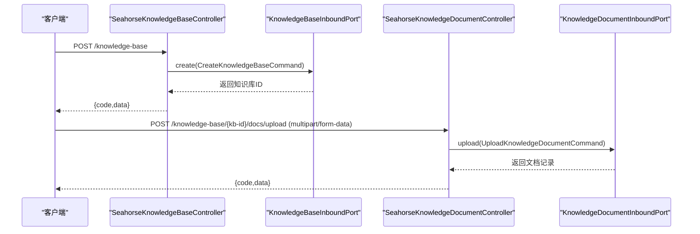
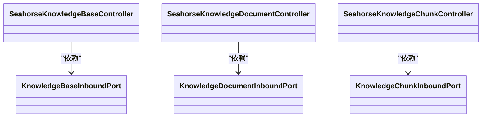

# 知识库接口

<cite>
**本文引用的文件**
- [SeahorseKnowledgeBaseController.java](file://seahorse-agent-adapter-web/src/main/java/com/miracle/ai/seahorse/agent/adapters/web/SeahorseKnowledgeBaseController.java)
- [SeahorseKnowledgeDocumentController.java](file://seahorse-agent-adapter-web/src/main/java/com/miracle/ai/seahorse/agent/adapters/web/SeahorseKnowledgeDocumentController.java)
- [SeahorseKnowledgeChunkController.java](file://seahorse-agent-adapter-web/src/main/java/com/miracle/ai/seahorse/agent/adapters/web/SeahorseKnowledgeChunkController.java)
- [KnowledgeBaseCreateRequest.java](file://seahorse-agent-adapter-web/src/main/java/com/miracle/ai/seahorse/agent/adapters/web/KnowledgeBaseCreateRequest.java)
- [KnowledgeBaseUpdateRequest.java](file://seahorse-agent-adapter-web/src/main/java/com/miracle/ai/seahorse/agent/adapters/web/KnowledgeBaseUpdateRequest.java)
- [KnowledgeDocumentUploadRequest.java](file://seahorse-agent-adapter-web/src/main/java/com/miracle/ai/seahorse/agent/adapters/web/KnowledgeDocumentUploadRequest.java)
- [KnowledgeDocumentUpdateRequest.java](file://seahorse-agent-adapter-web/src/main/java/com/miracle/ai/seahorse/agent/adapters/web/KnowledgeDocumentUpdateRequest.java)
- [KnowledgeChunkCreateRequest.java](file://seahorse-agent-adapter-web/src/main/java/com/miracle/ai/seahorse/agent/adapters/web/KnowledgeChunkCreateRequest.java)
</cite>

## 目录
1. [简介](#简介)
2. [项目结构](#项目结构)
3. [核心组件](#核心组件)
4. [架构总览](#架构总览)
5. [详细组件分析](#详细组件分析)
6. [依赖分析](#依赖分析)
7. [性能考虑](#性能考虑)
8. [故障排查指南](#故障排查指南)
9. [结论](#结论)
10. [附录](#附录)

## 简介
本文件面向知识库管理接口的使用者与维护者，系统性梳理知识库的 CRUD（创建、查询、更新、删除）接口、文档上传与分块接口、分块策略与配置、以及处理状态与进度查询机制。文档同时提供调用示例、错误处理建议与性能优化实践，帮助在不同规模与场景下稳定高效地使用知识库能力。

## 项目结构
知识库相关接口由 Web 层控制器暴露，分别对应知识库、文档与分块三类资源，均通过统一的返回体结构承载业务结果与状态码。控制器仅依赖领域入站端口，不直接访问持久层或外部服务，保证了清晰的职责边界与可替换性。

图表来源
- [SeahorseKnowledgeBaseController.java:44-107](file://seahorse-agent-adapter-web/src/main/java/com/miracle/ai/seahorse/agent/adapters/web/SeahorseKnowledgeBaseController.java#L44-L107)
- [SeahorseKnowledgeDocumentController.java:50-163](file://seahorse-agent-adapter-web/src/main/java/com/miracle/ai/seahorse/agent/adapters/web/SeahorseKnowledgeDocumentController.java#L50-L163)
- [SeahorseKnowledgeChunkController.java:43-117](file://seahorse-agent-adapter-web/src/main/java/com/miracle/ai/seahorse/agent/adapters/web/SeahorseKnowledgeChunkController.java#L43-L117)

章节来源
- [SeahorseKnowledgeBaseController.java:44-107](file://seahorse-agent-adapter-web/src/main/java/com/miracle/ai/seahorse/agent/adapters/web/SeahorseKnowledgeBaseController.java#L44-L107)
- [SeahorseKnowledgeDocumentController.java:50-163](file://seahorse-agent-adapter-web/src/main/java/com/miracle/ai/seahorse/agent/adapters/web/SeahorseKnowledgeDocumentController.java#L50-L163)
- [SeahorseKnowledgeChunkController.java:43-117](file://seahorse-agent-adapter-web/src/main/java/com/miracle/ai/seahorse/agent/adapters/web/SeahorseKnowledgeChunkController.java#L43-L117)

## 核心组件
- 统一响应结构
  - 字段：code、data
  - 成功时 code 为固定值；失败时 code 非零，data 中包含错误信息或空对象
- 用户标识
  - 请求头 X-User-Id 可选传递，用于记录操作人；未提供时以默认空串表示

章节来源
- [SeahorseKnowledgeBaseController.java:48-52](file://seahorse-agent-adapter-web/src/main/java/com/miracle/ai/seahorse/agent/adapters/web/SeahorseKnowledgeBaseController.java#L48-L52)
- [SeahorseKnowledgeDocumentController.java:54-58](file://seahorse-agent-adapter-web/src/main/java/com/miracle/ai/seahorse/agent/adapters/web/SeahorseKnowledgeDocumentController.java#L54-L58)
- [SeahorseKnowledgeChunkController.java:47-51](file://seahorse-agent-adapter-web/src/main/java/com/miracle/ai/seahorse/agent/adapters/web/SeahorseKnowledgeChunkController.java#L47-L51)

## 架构总览
以下序列图展示“知识库创建”到“文档上传”的典型调用链路，体现控制器、入站端口与下游处理流程的关系。

图表来源
- [SeahorseKnowledgeBaseController.java:60-67](file://seahorse-agent-adapter-web/src/main/java/com/miracle/ai/seahorse/agent/adapters/web/SeahorseKnowledgeBaseController.java#L60-L67)
- [SeahorseKnowledgeDocumentController.java:66-81](file://seahorse-agent-adapter-web/src/main/java/com/miracle/ai/seahorse/agent/adapters/web/SeahorseKnowledgeDocumentController.java#L66-L81)

## 详细组件分析

### 知识库接口（CRUD）
- 路径与方法
  - POST /knowledge-base
  - PUT /knowledge-base/{kb-id}
  - DELETE /knowledge-base/{kb-id}
  - GET /knowledge-base/{kb-id}
  - GET /knowledge-base
  - GET /knowledge-base/chunk-strategies
- 请求头
  - X-User-Id: 可选，用于记录操作人
- 请求体
  - 创建：name、embeddingModel、collectionName
  - 更新：name、embeddingModel
- 分页查询
  - current、size、name（可选）
- 返回
  - code=0 表示成功；data 包含具体结果（如 ID、列表、策略枚举等）

章节来源
- [SeahorseKnowledgeBaseController.java:60-97](file://seahorse-agent-adapter-web/src/main/java/com/miracle/ai/seahorse/agent/adapters/web/SeahorseKnowledgeBaseController.java#L60-L97)
- [KnowledgeBaseCreateRequest.java:23](file://seahorse-agent-adapter-web/src/main/java/com/miracle/ai/seahorse/agent/adapters/web/KnowledgeBaseCreateRequest.java#L23)
- [KnowledgeBaseUpdateRequest.java:23](file://seahorse-agent-adapter-web/src/main/java/com/miracle/ai/seahorse/agent/adapters/web/KnowledgeBaseUpdateRequest.java#L23)

### 文档接口（上传、查询、更新、删除、启用/禁用、搜索、分块日志）
- 上传
  - 方法：POST
  - 路径：/knowledge-base/{kb-id}/docs/upload
  - 内容类型：multipart/form-data
  - 文件字段：file
  - 其他参数：processMode、pipelineId（来自 KnowledgeDocumentUploadRequest）
  - 返回：文档记录
- 启用/禁用
  - 方法：PATCH
  - 路径：/knowledge-base/docs/{doc-id}/enable
  - 参数：value（布尔）
- 查询与分页
  - GET /knowledge-base/docs/{doc-id}
  - GET /knowledge-base/{kb-id}/docs
  - GET /knowledge-base/docs/search
- 更新
  - PUT /knowledge-base/docs/{doc-id}
  - 请求体字段：docName、processMode、chunkStrategy、chunkConfig、pipelineId、sourceLocation、scheduleEnabled、scheduleCron
- 删除
  - DELETE /knowledge-base/docs/{doc-id}
- 分块日志
  - GET /knowledge-base/docs/{doc-id}/chunk-logs
  - 支持分页 current、size

章节来源
- [SeahorseKnowledgeDocumentController.java:66-139](file://seahorse-agent-adapter-web/src/main/java/com/miracle/ai/seahorse/agent/adapters/web/SeahorseKnowledgeDocumentController.java#L66-L139)
- [KnowledgeDocumentUploadRequest.java:23-43](file://seahorse-agent-adapter-web/src/main/java/com/miracle/ai/seahorse/agent/adapters/web/KnowledgeDocumentUploadRequest.java#L23-L43)
- [KnowledgeDocumentUpdateRequest.java:23-97](file://seahorse-agent-adapter-web/src/main/java/com/miracle/ai/seahorse/agent/adapters/web/KnowledgeDocumentUpdateRequest.java#L23-L97)

### 分块接口（创建、更新、删除、启用/禁用、批量启用）
- 分页查询
  - GET /knowledge-base/docs/{doc-id}/chunks
  - 参数：current、size、enabled（可选）
- 创建
  - POST /knowledge-base/docs/{doc-id}/chunks
  - 请求体：chunkId、content、index
- 更新
  - PUT /knowledge-base/docs/{doc-id}/chunks/{chunk-id}
  - 请求体：content
- 删除
  - DELETE /knowledge-base/docs/{doc-id}/chunks/{chunk-id}
- 单个启用/禁用
  - PATCH /knowledge-base/docs/{doc-id}/chunks/{chunk-id}/enable
  - 参数：value（布尔）
- 批量启用/禁用
  - PATCH /knowledge-base/docs/{doc-id}/chunks/batch-enable
  - 参数：value（布尔）
  - 请求体：chunkIds（可选，缺省为空列表）

章节来源
- [SeahorseKnowledgeChunkController.java:59-112](file://seahorse-agent-adapter-web/src/main/java/com/miracle/ai/seahorse/agent/adapters/web/SeahorseKnowledgeChunkController.java#L59-L112)
- [KnowledgeChunkCreateRequest.java:23](file://seahorse-agent-adapter-web/src/main/java/com/miracle/ai/seahorse/agent/adapters/web/KnowledgeChunkCreateRequest.java#L23)

### 请求体与参数定义
- 知识库
  - 创建请求：name、embeddingModel、collectionName
  - 更新请求：name、embeddingModel
- 文档
  - 上传请求：processMode、pipelineId
  - 更新请求：docName、processMode、chunkStrategy、chunkConfig、pipelineId、sourceLocation、scheduleEnabled、scheduleCron
- 分块
  - 创建请求：chunkId、content、index

章节来源
- [KnowledgeBaseCreateRequest.java:23](file://seahorse-agent-adapter-web/src/main/java/com/miracle/ai/seahorse/agent/adapters/web/KnowledgeBaseCreateRequest.java#L23)
- [KnowledgeBaseUpdateRequest.java:23](file://seahorse-agent-adapter-web/src/main/java/com/miracle/ai/seahorse/agent/adapters/web/KnowledgeBaseUpdateRequest.java#L23)
- [KnowledgeDocumentUploadRequest.java:23-43](file://seahorse-agent-adapter-web/src/main/java/com/miracle/ai/seahorse/agent/adapters/web/KnowledgeDocumentUploadRequest.java#L23-L43)
- [KnowledgeDocumentUpdateRequest.java:23-97](file://seahorse-agent-adapter-web/src/main/java/com/miracle/ai/seahorse/agent/adapters/web/KnowledgeDocumentUpdateRequest.java#L23-L97)
- [KnowledgeChunkCreateRequest.java:23](file://seahorse-agent-adapter-web/src/main/java/com/miracle/ai/seahorse/agent/adapters/web/KnowledgeChunkCreateRequest.java#L23)

### 处理状态与进度查询
- 分块日志查询
  - GET /knowledge-base/docs/{doc-id}/chunk-logs
  - 支持分页 current、size
- 分块启动
  - POST /knowledge-base/docs/{doc-id}/chunk
  - 触发对指定文档的分块处理流程

章节来源
- [SeahorseKnowledgeDocumentController.java:133-139](file://seahorse-agent-adapter-web/src/main/java/com/miracle/ai/seahorse/agent/adapters/web/SeahorseKnowledgeDocumentController.java#L133-L139)
- [SeahorseKnowledgeDocumentController.java:83-88](file://seahorse-agent-adapter-web/src/main/java/com/miracle/ai/seahorse/agent/adapters/web/SeahorseKnowledgeDocumentController.java#L83-L88)

### API 调用示例（路径与要点）
- 创建知识库
  - 方法与路径：POST /knowledge-base
  - 请求体字段：name、embeddingModel、collectionName
  - 成功响应：code=0，data 为新知识库 ID
- 更新知识库
  - 方法与路径：PUT /knowledge-base/{kb-id}
  - 请求体字段：name、embeddingModel
  - 成功响应：code=0
- 删除知识库
  - 方法与路径：DELETE /knowledge-base/{kb-id}
  - 成功响应：code=0
- 查询知识库详情
  - 方法与路径：GET /knowledge-base/{kb-id}
  - 成功响应：code=0，data 为知识库详情
- 分页查询知识库
  - 方法与路径：GET /knowledge-base
  - 查询参数：current、size、name（可选）
  - 成功响应：code=0，data 为分页结果
- 获取分块策略
  - 方法与路径：GET /knowledge-base/chunk-strategies
  - 成功响应：code=0，data 为策略枚举
- 上传文档
  - 方法与路径：POST /knowledge-base/{kb-id}/docs/upload
  - 内容类型：multipart/form-data
  - 必填字段：file
  - 可选字段：processMode、pipelineId
  - 成功响应：code=0，data 为文档记录
- 启用/禁用文档
  - 方法与路径：PATCH /knowledge-base/docs/{doc-id}/enable
  - 查询参数：value（true/false）
  - 成功响应：code=0
- 更新文档
  - 方法与路径：PUT /knowledge-base/docs/{doc-id}
  - 请求体字段：docName、processMode、chunkStrategy、chunkConfig、pipelineId、sourceLocation、scheduleEnabled、scheduleCron
  - 成功响应：code=0
- 删除文档
  - 方法与路径：DELETE /knowledge-base/docs/{doc-id}
  - 成功响应：code=0
- 查询文档详情
  - 方法与路径：GET /knowledge-base/docs/{doc-id}
  - 成功响应：code=0，data 为文档详情
- 分页查询文档
  - 方法与路径：GET /knowledge-base/{kb-id}/docs
  - 查询参数：current、size、status（可选）、keyword（可选）
  - 成功响应：code=0，data 为分页结果
- 搜索文档
  - 方法与路径：GET /knowledge-base/docs/search
  - 查询参数：keyword（可选）、limit（默认8）
  - 成功响应：code=0，data 为匹配结果
- 查询分块日志
  - 方法与路径：GET /knowledge-base/docs/{doc-id}/chunk-logs
  - 查询参数：current、size
  - 成功响应：code=0，data 为分页日志
- 启动分块
  - 方法与路径：POST /knowledge-base/docs/{doc-id}/chunk
  - 成功响应：code=0
- 分页查询分块
  - 方法与路径：GET /knowledge-base/docs/{doc-id}/chunks
  - 查询参数：current、size、enabled（可选）
  - 成功响应：code=0，data 为分页结果
- 创建分块
  - 方法与路径：POST /knowledge-base/docs/{doc-id}/chunks
  - 请求体字段：chunkId、content、index
  - 成功响应：code=0，data 为创建后的分块 ID
- 更新分块
  - 方法与路径：PUT /knowledge-base/docs/{doc-id}/chunks/{chunk-id}
  - 请求体字段：content
  - 成功响应：code=0
- 删除分块
  - 方法与路径：DELETE /knowledge-base/docs/{doc-id}/chunks/{chunk-id}
  - 成功响应：code=0
- 启用/禁用单个分块
  - 方法与路径：PATCH /knowledge-base/docs/{doc-id}/chunks/{chunk-id}/enable
  - 查询参数：value（true/false）
  - 成功响应：code=0
- 批量启用/禁用分块
  - 方法与路径：PATCH /knowledge-base/docs/{doc-id}/chunks/batch-enable
  - 查询参数：value（true/false）
  - 请求体：chunkIds（可选）
  - 成功响应：code=0

章节来源
- [SeahorseKnowledgeBaseController.java:60-102](file://seahorse-agent-adapter-web/src/main/java/com/miracle/ai/seahorse/agent/adapters/web/SeahorseKnowledgeBaseController.java#L60-L102)
- [SeahorseKnowledgeDocumentController.java:66-139](file://seahorse-agent-adapter-web/src/main/java/com/miracle/ai/seahorse/agent/adapters/web/SeahorseKnowledgeDocumentController.java#L66-L139)
- [SeahorseKnowledgeChunkController.java:59-112](file://seahorse-agent-adapter-web/src/main/java/com/miracle/ai/seahorse/agent/adapters/web/SeahorseKnowledgeChunkController.java#L59-L112)

## 依赖分析
- 控制器与端口解耦
  - Web 控制器仅依赖对应的入站端口，不直接访问数据库或外部系统，便于替换实现与测试
- 统一返回体
  - 三类控制器均采用相同的返回结构，简化前端处理与错误识别
- 可选用户标识
  - 通过请求头 X-User-Id 传递操作人，便于审计与追踪

图表来源
- [SeahorseKnowledgeBaseController.java:20-24](file://seahorse-agent-adapter-web/src/main/java/com/miracle/ai/seahorse/agent/adapters/web/SeahorseKnowledgeBaseController.java#L20-L24)
- [SeahorseKnowledgeDocumentController.java:20-26](file://seahorse-agent-adapter-web/src/main/java/com/miracle/ai/seahorse/agent/adapters/web/SeahorseKnowledgeDocumentController.java#L20-L26)
- [SeahorseKnowledgeChunkController.java:20-24](file://seahorse-agent-adapter-web/src/main/java/com/miracle/ai/seahorse/agent/adapters/web/SeahorseKnowledgeChunkController.java#L20-L24)

章节来源
- [SeahorseKnowledgeBaseController.java:20-24](file://seahorse-agent-adapter-web/src/main/java/com/miracle/ai/seahorse/agent/adapters/web/SeahorseKnowledgeBaseController.java#L20-L24)
- [SeahorseKnowledgeDocumentController.java:20-26](file://seahorse-agent-adapter-web/src/main/java/com/miracle/ai/seahorse/agent/adapters/web/SeahorseKnowledgeDocumentController.java#L20-L26)
- [SeahorseKnowledgeChunkController.java:20-24](file://seahorse-agent-adapter-web/src/main/java/com/miracle/ai/seahorse/agent/adapters/web/SeahorseKnowledgeChunkController.java#L20-L24)

## 性能考虑
- 大文件上传
  - 使用 multipart/form-data 传输，建议在网关或应用层设置合理的文件大小上限与超时时间
  - 对于超大文件，优先采用断点续传或分片上传策略（需结合后端实现）
- 并发与批处理
  - 批量启用/禁用分块接口支持按需传入 chunkIds，避免全量扫描
  - 分页查询接口提供 current、size 参数，建议前端按需加载
- 解析与向量化
  - 选择合适的 embedding 模型与 collectionName，避免不必要的模型切换
  - 在文档更新中合理配置 chunkStrategy 与 chunkConfig，减少无效分块
- 缓存与索引
  - 利用分页与搜索接口减少重复查询
  - 结合分块日志进行增量处理，避免全量重跑

## 故障排查指南
- 常见错误码
  - code 非 0：表示请求处理失败，需检查请求参数与权限
- 参数校验
  - 上传接口必须提供文件字段；分页查询中的 current、size 应为正整数
- 用户标识
  - 若需要审计，请确保携带 X-User-Id 请求头
- 进度与日志
  - 使用分块日志接口定位处理异常；必要时重新触发分块流程

章节来源
- [SeahorseKnowledgeBaseController.java:48-52](file://seahorse-agent-adapter-web/src/main/java/com/miracle/ai/seahorse/agent/adapters/web/SeahorseKnowledgeBaseController.java#L48-L52)
- [SeahorseKnowledgeDocumentController.java:54-58](file://seahorse-agent-adapter-web/src/main/java/com/miracle/ai/seahorse/agent/adapters/web/SeahorseKnowledgeDocumentController.java#L54-L58)
- [SeahorseKnowledgeChunkController.java:47-51](file://seahorse-agent-adapter-web/src/main/java/com/miracle/ai/seahorse/agent/adapters/web/SeahorseKnowledgeChunkController.java#L47-L51)

## 结论
本文档系统化梳理了知识库管理接口的路由、参数、返回与调用方式，并提供了性能优化与故障排查建议。通过统一的控制器与入站端口设计，接口具备良好的扩展性与可维护性，适合在多场景下稳定运行。

## 附录
- 统一响应结构
  - code：字符串，0 表示成功
  - data：对象或数组，承载业务结果
- 请求头
  - X-User-Id：可选，用于记录操作人