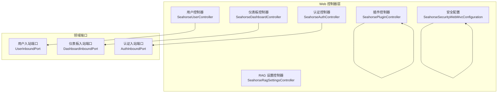
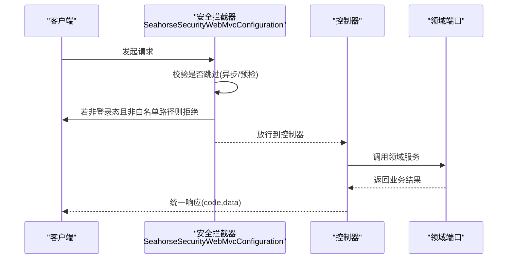
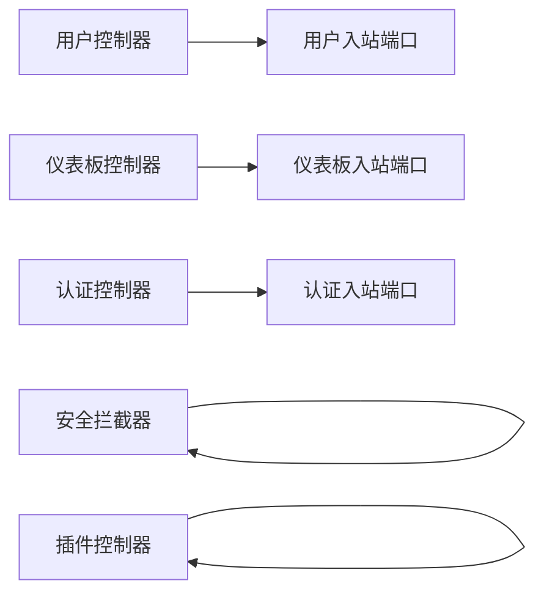

# 系统管理接口

<cite>
**本文引用的文件**
- [SeahorseUserController.java](file://seahorse-agent-adapter-web/src/main/java/com/miracle/ai/seahorse/agent/adapters/web/SeahorseUserController.java)
- [SeahorseDashboardController.java](file://seahorse-agent-adapter-web/src/main/java/com/miracle/ai/seahorse/agent/adapters/web/SeahorseDashboardController.java)
- [SeahorseRagSettingsController.java](file://seahorse-agent-adapter-web/src/main/java/com/miracle/ai/seahorse/agent/adapters/web/SeahorseRagSettingsController.java)
- [SeahorseSecurityWebMvcConfiguration.java](file://seahorse-agent-adapter-web/src/main/java/com/miracle/ai/seahorse/agent/adapters/web/SeahorseSecurityWebMvcConfiguration.java)
- [UserSaveRequest.java](file://seahorse-agent-adapter-web/src/main/java/com/miracle/ai/seahorse/agent/adapters/web/UserSaveRequest.java)
- [UserPasswordRequest.java](file://seahorse-agent-adapter-web/src/main/java/com/miracle/ai/seahorse/agent/adapters/web/UserPasswordRequest.java)
- [SeahorseAuthController.java](file://seahorse-agent-adapter-web/src/main/java/com/miracle/ai/seahorse/agent/adapters/web/SeahorseAuthController.java)
- [SeahorsePluginController.java](file://seahorse-agent-adapter-web/src/main/java/com/miracle/ai/seahorse/agent/adapters/web/SeahorsePluginController.java)
</cite>

## 目录
1. [简介](#简介)
2. [项目结构](#项目结构)
3. [核心组件](#核心组件)
4. [架构总览](#架构总览)
5. [详细组件分析](#详细组件分析)
6. [依赖分析](#依赖分析)
7. [性能考虑](#性能考虑)
8. [故障排查指南](#故障排查指南)
9. [结论](#结论)
10. [附录](#附录)

## 简介
本文件为系统管理接口的完整 API 文档，覆盖以下主题：
- 用户管理：用户 CRUD、密码变更、角色与头像字段
- 仪表板数据：系统概览、性能指标、趋势数据
- 系统配置：RAG 设置（上传限制、检索配置、限流、记忆策略）、模型配置（提供商、候选模型、流式设置）
- 管理后台专用接口与权限控制：基于 Sa-Token 的统一拦截器
- 运维监控：插件健康度、插件状态、插件注册表查询
- 统一响应格式与调用示例说明

## 项目结构
后端采用 Spring MVC 控制器层，控制器通过适配器模式对接内核领域服务端口，实现用户、仪表板、RAG 设置、认证、插件等管理能力。

图表来源
- [SeahorseUserController.java:37-93](file://seahorse-agent-adapter-web/src/main/java/com/miracle/ai/seahorse/agent/adapters/web/SeahorseUserController.java#L37-L93)
- [SeahorseDashboardController.java:33-65](file://seahorse-agent-adapter-web/src/main/java/com/miracle/ai/seahorse/agent/adapters/web/SeahorseDashboardController.java#L33-L65)
- [SeahorseRagSettingsController.java:35-374](file://seahorse-agent-adapter-web/src/main/java/com/miracle/ai/seahorse/agent/adapters/web/SeahorseRagSettingsController.java#L35-L374)
- [SeahorseAuthController.java:30-57](file://seahorse-agent-adapter-web/src/main/java/com/miracle/ai/seahorse/agent/adapters/web/SeahorseAuthController.java#L30-L57)
- [SeahorsePluginController.java:39-114](file://seahorse-agent-adapter-web/src/main/java/com/miracle/ai/seahorse/agent/adapters/web/SeahorsePluginController.java#L39-L114)
- [SeahorseSecurityWebMvcConfiguration.java:30-51](file://seahorse-agent-adapter-web/src/main/java/com/miracle/ai/seahorse/agent/adapters/web/SeahorseSecurityWebMvcConfiguration.java#L30-L51)

章节来源
- [SeahorseUserController.java:37-93](file://seahorse-agent-adapter-web/src/main/java/com/miracle/ai/seahorse/agent/adapters/web/SeahorseUserController.java#L37-L93)
- [SeahorseDashboardController.java:33-65](file://seahorse-agent-adapter-web/src/main/java/com/miracle/ai/seahorse/agent/adapters/web/SeahorseDashboardController.java#L33-L65)
- [SeahorseRagSettingsController.java:35-374](file://seahorse-agent-adapter-web/src/main/java/com/miracle/ai/seahorse/agent/adapters/web/SeahorseRagSettingsController.java#L35-L374)
- [SeahorseAuthController.java:30-57](file://seahorse-agent-adapter-web/src/main/java/com/miracle/ai/seahorse/agent/adapters/web/SeahorseAuthController.java#L30-L57)
- [SeahorsePluginController.java:39-114](file://seahorse-agent-adapter-web/src/main/java/com/miracle/ai/seahorse/agent/adapters/web/SeahorsePluginController.java#L39-L114)
- [SeahorseSecurityWebMvcConfiguration.java:30-51](file://seahorse-agent-adapter-web/src/main/java/com/miracle/ai/seahorse/agent/adapters/web/SeahorseSecurityWebMvcConfiguration.java#L30-L51)

## 核心组件
- 用户管理控制器：提供当前用户信息、分页查询、创建、更新、删除、修改密码等接口
- 仪表板控制器：提供概览、性能、趋势等数据接口
- RAG 设置控制器：以统一结构返回上传、RAG 默认配置、限流、记忆策略以及 AI 模型配置
- 认证控制器：登录、登出接口
- 插件控制器：查询插件健康度、状态、注册表；保存插件状态
- 安全配置：全局拦截器，除特定路径外强制登录校验

章节来源
- [SeahorseUserController.java:37-93](file://seahorse-agent-adapter-web/src/main/java/com/miracle/ai/seahorse/agent/adapters/web/SeahorseUserController.java#L37-L93)
- [SeahorseDashboardController.java:33-65](file://seahorse-agent-adapter-web/src/main/java/com/miracle/ai/seahorse/agent/adapters/web/SeahorseDashboardController.java#L33-L65)
- [SeahorseRagSettingsController.java:35-374](file://seahorse-agent-adapter-web/src/main/java/com/miracle/ai/seahorse/agent/adapters/web/SeahorseRagSettingsController.java#L35-L374)
- [SeahorseAuthController.java:30-57](file://seahorse-agent-adapter-web/src/main/java/com/miracle/ai/seahorse/agent/adapters/web/SeahorseAuthController.java#L30-L57)
- [SeahorsePluginController.java:39-114](file://seahorse-agent-adapter-web/src/main/java/com/miracle/ai/seahorse/agent/adapters/web/SeahorsePluginController.java#L39-L114)
- [SeahorseSecurityWebMvcConfiguration.java:30-51](file://seahorse-agent-adapter-web/src/main/java/com/miracle/ai/seahorse/agent/adapters/web/SeahorseSecurityWebMvcConfiguration.java#L30-L51)

## 架构总览
下图展示管理接口的请求流转与权限控制：

图表来源
- [SeahorseSecurityWebMvcConfiguration.java:33-50](file://seahorse-agent-adapter-web/src/main/java/com/miracle/ai/seahorse/agent/adapters/web/SeahorseSecurityWebMvcConfiguration.java#L33-L50)
- [SeahorseUserController.java:47-91](file://seahorse-agent-adapter-web/src/main/java/com/miracle/ai/seahorse/agent/adapters/web/SeahorseUserController.java#L47-L91)
- [SeahorseDashboardController.java:44-63](file://seahorse-agent-adapter-web/src/main/java/com/miracle/ai/seahorse/agent/adapters/web/SeahorseDashboardController.java#L44-L63)
- [SeahorseRagSettingsController.java:48-54](file://seahorse-agent-adapter-web/src/main/java/com/miracle/ai/seahorse/agent/adapters/web/SeahorseRagSettingsController.java#L48-L54)
- [SeahorseAuthController.java:44-55](file://seahorse-agent-adapter-web/src/main/java/com/miracle/ai/seahorse/agent/adapters/web/SeahorseAuthController.java#L44-L55)
- [SeahorsePluginController.java:58-81](file://seahorse-agent-adapter-web/src/main/java/com/miracle/ai/seahorse/agent/adapters/web/SeahorsePluginController.java#L58-L81)

## 详细组件分析

### 用户管理接口
- 当前用户信息
  - 方法与路径：GET /user/me
  - 请求体：无
  - 响应：包含当前用户对象
- 分页查询用户
  - 方法与路径：GET /users
  - 查询参数：current（默认 1）、size（默认 10）、keyword（可选）
  - 响应：分页结果对象
- 创建用户
  - 方法与路径：POST /users
  - 请求体：UserSaveRequest（username、password、role、avatar）
  - 响应：新建用户的 id
- 更新用户
  - 方法与路径：PUT /users/{id}
  - 路径参数：id
  - 请求体：UserSaveRequest（username、password、role、avatar）
  - 响应：成功标志
- 删除用户
  - 方法与路径：DELETE /users/{id}
  - 路径参数：id
  - 响应：成功标志
- 修改密码
  - 方法与路径：PUT /user/password
  - 请求体：UserPasswordRequest（currentPassword、newPassword）
  - 响应：成功标志

统一响应格式
- 字段：code（字符串），data（对象或标识符）
- 成功时 code 为 "0"

请求体模型
- UserSaveRequest
  - 字段：username、password、role、avatar
- UserPasswordRequest
  - 字段：currentPassword、newPassword

章节来源
- [SeahorseUserController.java:51-91](file://seahorse-agent-adapter-web/src/main/java/com/miracle/ai/seahorse/agent/adapters/web/SeahorseUserController.java#L51-L91)
- [UserSaveRequest.java:20-59](file://seahorse-agent-adapter-web/src/main/java/com/miracle/ai/seahorse/agent/adapters/web/UserSaveRequest.java#L20-L59)
- [UserPasswordRequest.java:20-41](file://seahorse-agent-adapter-web/src/main/java/com/miracle/ai/seahorse/agent/adapters/web/UserPasswordRequest.java#L20-L41)

### 仪表板数据接口
- 概览
  - 方法与路径：GET /admin/dashboard/overview
  - 查询参数：window（可选）
  - 响应：概览聚合指标
- 性能
  - 方法与路径：GET /admin/dashboard/performance
  - 查询参数：window（可选）
  - 响应：性能指标集合
- 趋势
  - 方法与路径：GET /admin/dashboard/trends
  - 查询参数：metric（必填）、window（可选）、granularity（可选）
  - 响应：指定指标的趋势序列

统一响应格式
- 字段：code（字符串），data（对象）
- 成功时 code 为 "0"

章节来源
- [SeahorseDashboardController.java:48-63](file://seahorse-agent-adapter-web/src/main/java/com/miracle/ai/seahorse/agent/adapters/web/SeahorseDashboardController.java#L48-L63)

### 系统配置接口（RAG 设置与模型配置）
- 获取配置
  - 方法与路径：GET /rag/settings
  - 响应：包含 upload、rag、ai 三部分的配置对象
    - upload：maxFileSize、maxRequestSize（字节）
    - rag.defaultConfig：collectionName、dimension、metricType
    - rag.queryRewrite.enabled
    - rag.rateLimit.global.*（启用、并发上限、最大等待秒、租期秒、轮询间隔毫秒）
    - rag.memory.*（历史保留轮数、摘要开关、摘要起始轮数、摘要最大字符、标题最大长度）
    - ai.providers、ai.chat、ai.embedding、ai.rerank、ai.selection、ai.stream

统一响应格式
- 字段：code（字符串），data（对象）
- 成功时 code 为 "0"

章节来源
- [SeahorseRagSettingsController.java:48-141](file://seahorse-agent-adapter-web/src/main/java/com/miracle/ai/seahorse/agent/adapters/web/SeahorseRagSettingsController.java#L48-L141)

### 管理后台专用接口与权限控制
- 全局拦截规则
  - 拦截所有路径，排除 /auth/** 与 /error
  - 异步分发类型与 OPTIONS 预检请求跳过校验
  - 其余请求必须已登录
- 登录与登出
  - 登录：POST /auth/login
  - 登出：POST /auth/logout
- 插件管理
  - 查询健康度：GET /agent/plugins/health
  - 查询状态：GET /agent/plugins/status
  - 查询注册表：GET /agent/plugins/registry
  - 保存状态：POST /agent/plugins/status（请求体为 PluginStatusRequest）

统一响应格式
- 字段：code（字符串），data（对象或列表）
- 成功时 code 为 "0"

章节来源
- [SeahorseSecurityWebMvcConfiguration.java:33-50](file://seahorse-agent-adapter-web/src/main/java/com/miracle/ai/seahorse/agent/adapters/web/SeahorseSecurityWebMvcConfiguration.java#L33-L50)
- [SeahorseAuthController.java:44-55](file://seahorse-agent-adapter-web/src/main/java/com/miracle/ai/seahorse/agent/adapters/web/SeahorseAuthController.java#L44-L55)
- [SeahorsePluginController.java:58-112](file://seahorse-agent-adapter-web/src/main/java/com/miracle/ai/seahorse/agent/adapters/web/SeahorsePluginController.java#L58-L112)

## 依赖分析
- 控制器与端口解耦：各控制器仅依赖对应的领域入站端口，便于替换实现与测试
- 权限控制集中：通过拦截器统一处理登录校验，避免在控制器中重复逻辑
- 配置读取：RAG 设置控制器直接从 Spring Environment 读取属性，支持默认值与类型转换

图表来源
- [SeahorseUserController.java:45-49](file://seahorse-agent-adapter-web/src/main/java/com/miracle/ai/seahorse/agent/adapters/web/SeahorseUserController.java#L45-L49)
- [SeahorseDashboardController.java:42-46](file://seahorse-agent-adapter-web/src/main/java/com/miracle/ai/seahorse/agent/adapters/web/SeahorseDashboardController.java#L42-L46)
- [SeahorseAuthController.java:38-42](file://seahorse-agent-adapter-web/src/main/java/com/miracle/ai/seahorse/agent/adapters/web/SeahorseAuthController.java#L38-L42)
- [SeahorseSecurityWebMvcConfiguration.java:34-44](file://seahorse-agent-adapter-web/src/main/java/com/miracle/ai/seahorse/agent/adapters/web/SeahorseSecurityWebMvcConfiguration.java#L34-L44)
- [SeahorsePluginController.java:50-56](file://seahorse-agent-adapter-web/src/main/java/com/miracle/ai/seahorse/agent/adapters/web/SeahorsePluginController.java#L50-L56)

## 性能考虑
- 限流配置：RAG 设置中的 global 限流参数可用于控制并发与等待行为，建议结合实际负载调优
- 内存策略：记忆模块的历史保留轮数与摘要策略影响上下文大小与生成成本
- 流式输出：AI 流式设置的消息块大小可平衡延迟与用户体验

## 故障排查指南
- 登录态缺失
  - 现象：访问受保护接口返回未授权
  - 处理：先调用登录接口获取会话，再携带会话访问
- 参数错误
  - 现象：创建/更新用户失败或返回错误码
  - 处理：检查 UserSaveRequest 字段完整性与格式
- 密码修改失败
  - 现象：修改密码接口报错
  - 处理：确认 UserPasswordRequest 中当前密码正确
- 插件状态异常
  - 现象：查询或保存插件状态失败
  - 处理：检查 PluginStatusRequest 字段与后端扩展注册情况

章节来源
- [SeahorseAuthController.java:44-55](file://seahorse-agent-adapter-web/src/main/java/com/miracle/ai/seahorse/agent/adapters/web/SeahorseAuthController.java#L44-L55)
- [SeahorseUserController.java:63-77](file://seahorse-agent-adapter-web/src/main/java/com/miracle/ai/seahorse/agent/adapters/web/SeahorseUserController.java#L63-L77)
- [UserPasswordRequest.java:20-41](file://seahorse-agent-adapter-web/src/main/java/com/miracle/ai/seahorse/agent/adapters/web/UserPasswordRequest.java#L20-L41)
- [SeahorsePluginController.java:76-81](file://seahorse-agent-adapter-web/src/main/java/com/miracle/ai/seahorse/agent/adapters/web/SeahorsePluginController.java#L76-L81)

## 结论
本系统管理接口以清晰的控制器分层与统一响应格式提供用户、仪表板、RAG 配置、认证与插件管理能力，并通过集中式安全拦截确保后台访问安全。建议在生产环境根据业务负载调整 RAG 限流与记忆策略，并完善日志与告警以便快速定位问题。

## 附录

### 统一响应格式
- 成功响应：{"code":"0","data":...}
- 失败响应：{"code":"非0","data":...}

章节来源
- [SeahorseUserController.java:41-44](file://seahorse-agent-adapter-web/src/main/java/com/miracle/ai/seahorse/agent/adapters/web/SeahorseUserController.java#L41-L44)
- [SeahorseDashboardController.java:38-41](file://seahorse-agent-adapter-web/src/main/java/com/miracle/ai/seahorse/agent/adapters/web/SeahorseDashboardController.java#L38-L41)
- [SeahorseRagSettingsController.java:38-41](file://seahorse-agent-adapter-web/src/main/java/com/miracle/ai/seahorse/agent/adapters/web/SeahorseRagSettingsController.java#L38-L41)
- [SeahorseAuthController.java:34-37](file://seahorse-agent-adapter-web/src/main/java/com/miracle/ai/seahorse/agent/adapters/web/SeahorseAuthController.java#L34-L37)
- [SeahorsePluginController.java:42-45](file://seahorse-agent-adapter-web/src/main/java/com/miracle/ai/seahorse/agent/adapters/web/SeahorsePluginController.java#L42-L45)