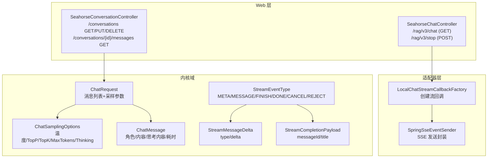
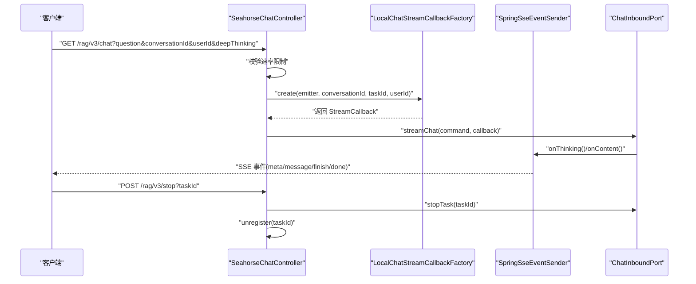
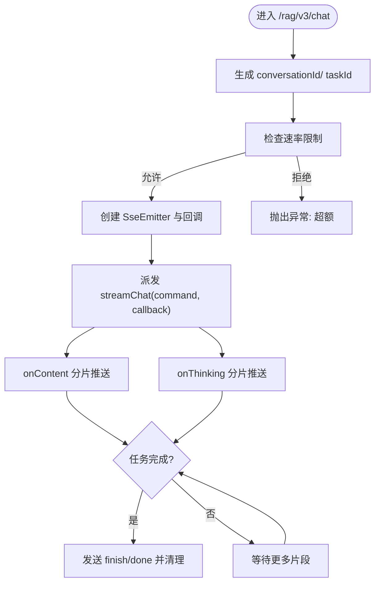
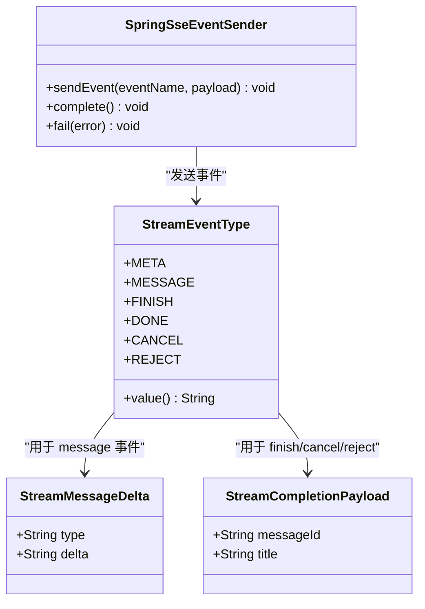
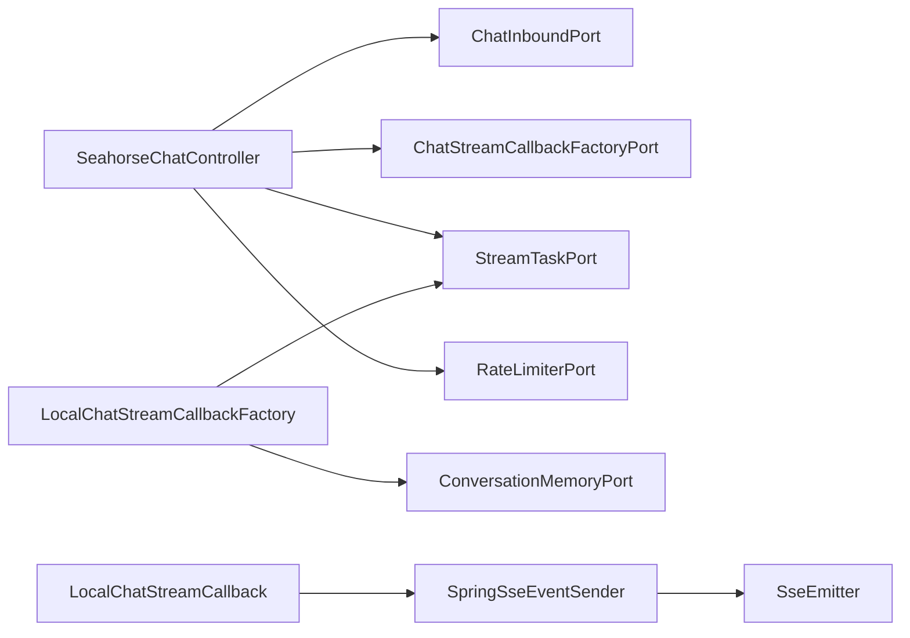

# 聊天接口

<cite>
**本文引用的文件**
- [SeahorseChatController.java](file://seahorse-agent-adapter-web/src/main/java/com/miracle/ai/seahorse/agent/adapters/web/SeahorseChatController.java)
- [SeahorseConversationController.java](file://seahorse-agent-adapter-web/src/main/java/com/miracle/ai/seahorse/agent/adapters/web/SeahorseConversationController.java)
- [LocalChatStreamCallbackFactory.java](file://seahorse-agent-adapter-web/src/main/java/com/miracle/ai/seahorse/agent/adapters/local/LocalChatStreamCallbackFactory.java)
- [SpringSseEventSender.java](file://seahorse-agent-adapter-web/src/main/java/com/miracle/ai/seahorse/agent/adapters/local/SpringSseEventSender.java)
- [ChatRequest.java](file://seahorse-agent-kernel/src/main/java/com/miracle/ai/seahorse/agent/kernel/domain/chat/ChatRequest.java)
- [ChatSamplingOptions.java](file://seahorse-agent-kernel/src/main/java/com/miracle/ai/seahorse/agent/kernel/domain/chat/ChatSamplingOptions.java)
- [ChatMessage.java](file://seahorse-agent-kernel/src/main/java/com/miracle/ai/seahorse/agent/kernel/domain/chat/ChatMessage.java)
- [StreamEventType.java](file://seahorse-agent-kernel/src/main/java/com/miracle/ai/seahorse/agent/kernel/domain/stream/StreamEventType.java)
- [StreamMessageDelta.java](file://seahorse-agent-kernel/src/main/java/com/miracle/ai/seahorse/agent/kernel/domain/stream/StreamMessageDelta.java)
- [StreamCompletionPayload.java](file://seahorse-agent-kernel/src/main/java/com/miracle/ai/seahorse/agent/kernel/domain/stream/StreamCompletionPayload.java)
- [ConversationUpdateRequest.java](file://seahorse-agent-adapter-web/src/main/java/com/miracle/ai/seahorse/agent/adapters/web/ConversationUpdateRequest.java)
</cite>

## 目录
1. [简介](#简介)
2. [项目结构](#项目结构)
3. [核心组件](#核心组件)
4. [架构总览](#架构总览)
5. [详细组件分析](#详细组件分析)
6. [依赖关系分析](#依赖关系分析)
7. [性能考量](#性能考量)
8. [故障排查指南](#故障排查指南)
9. [结论](#结论)
10. [附录](#附录)

## 简介
本文件为聊天接口的完整 API 文档，覆盖以下内容：
- 流式对话接口（SSE）：连接建立、消息推送格式、连接维护与断线恢复、速率限制与任务取消。
- 聊天请求数据结构：用户消息、上下文、采样参数与“深度思考”模式。
- 会话管理接口：创建、重命名、删除、历史查询。
- 客户端处理建议：如何解析事件、处理错误与断线重连。

## 项目结构
后端采用 Spring MVC 控制器层暴露 REST 接口，并通过内核领域对象进行业务编排。流式输出基于 Spring 的 SseEmitter 实现，事件类型与载荷在内核模块中统一定义。

图表来源
- [SeahorseChatController.java:83-102](file://seahorse-agent-adapter-web/src/main/java/com/miracle/ai/seahorse/agent/adapters/web/SeahorseChatController.java#L83-L102)
- [SeahorseConversationController.java:54-89](file://seahorse-agent-adapter-web/src/main/java/com/miracle/ai/seahorse/agent/adapters/web/SeahorseConversationController.java#L54-L89)
- [LocalChatStreamCallbackFactory.java:56-64](file://seahorse-agent-adapter-web/src/main/java/com/miracle/ai/seahorse/agent/adapters/local/LocalChatStreamCallbackFactory.java#L56-L64)
- [SpringSseEventSender.java:31-77](file://seahorse-agent-adapter-web/src/main/java/com/miracle/ai/seahorse/agent/adapters/local/SpringSseEventSender.java#L31-L77)
- [ChatRequest.java:30-66](file://seahorse-agent-kernel/src/main/java/com/miracle/ai/seahorse/agent/kernel/domain/chat/ChatRequest.java#L30-L66)
- [ChatSamplingOptions.java:26-39](file://seahorse-agent-kernel/src/main/java/com/miracle/ai/seahorse/agent/kernel/domain/chat/ChatSamplingOptions.java#L26-L39)
- [ChatMessage.java:27-67](file://seahorse-agent-kernel/src/main/java/com/miracle/ai/seahorse/agent/kernel/domain/chat/ChatMessage.java#L27-L67)
- [StreamEventType.java:23-53](file://seahorse-agent-kernel/src/main/java/com/miracle/ai/seahorse/agent/kernel/domain/stream/StreamEventType.java#L23-L53)
- [StreamMessageDelta.java:23-24](file://seahorse-agent-kernel/src/main/java/com/miracle/ai/seahorse/agent/kernel/domain/stream/StreamMessageDelta.java#L23-L24)
- [StreamCompletionPayload.java:23-24](file://seahorse-agent-kernel/src/main/java/com/miracle/ai/seahorse/agent/kernel/domain/stream/StreamCompletionPayload.java#L23-L24)

章节来源
- [SeahorseChatController.java:83-102](file://seahorse-agent-adapter-web/src/main/java/com/miracle/ai/seahorse/agent/adapters/web/SeahorseChatController.java#L83-L102)
- [SeahorseConversationController.java:54-89](file://seahorse-agent-adapter-web/src/main/java/com/miracle/ai/seahorse/agent/adapters/web/SeahorseConversationController.java#L54-L89)

## 核心组件
- 流式聊天控制器：负责接收请求、校验速率限制、创建 SSE 连接、派发流式回调。
- 会话管理控制器：提供会话列表、重命名、删除、消息历史查询。
- 流式回调工厂：封装消息分片、事件发送、任务注册与清理。
- SSE 事件发送器：对 Spring SseEmitter 的统一封装，处理完成/错误/超时状态。
- 领域模型：聊天请求、采样选项、消息体、流事件类型与载荷。

章节来源
- [SeahorseChatController.java:44-81](file://seahorse-agent-adapter-web/src/main/java/com/miracle/ai/seahorse/agent/adapters/web/SeahorseChatController.java#L44-L81)
- [SeahorseConversationController.java:40-52](file://seahorse-agent-adapter-web/src/main/java/com/miracle/ai/seahorse/agent/adapters/web/SeahorseConversationController.java#L40-L52)
- [LocalChatStreamCallbackFactory.java:37-54](file://seahorse-agent-adapter-web/src/main/java/com/miracle/ai/seahorse/agent/adapters/local/LocalChatStreamCallbackFactory.java#L37-L54)
- [SpringSseEventSender.java:31-41](file://seahorse-agent-adapter-web/src/main/java/com/miracle/ai/seahorse/agent/adapters/local/SpringSseEventSender.java#L31-L41)
- [ChatRequest.java:30-66](file://seahorse-agent-kernel/src/main/java/com/miracle/ai/seahorse/agent/kernel/domain/chat/ChatRequest.java#L30-L66)
- [ChatSamplingOptions.java:26-39](file://seahorse-agent-kernel/src/main/java/com/miracle/ai/seahorse/agent/kernel/domain/chat/ChatSamplingOptions.java#L26-L39)
- [ChatMessage.java:27-67](file://seahorse-agent-kernel/src/main/java/com/miracle/ai/seahorse/agent/kernel/domain/chat/ChatMessage.java#L27-L67)
- [StreamEventType.java:23-53](file://seahorse-agent-kernel/src/main/java/com/miracle/ai/seahorse/agent/kernel/domain/stream/StreamEventType.java#L23-L53)
- [StreamMessageDelta.java:23-24](file://seahorse-agent-kernel/src/main/java/com/miracle/ai/seahorse/agent/kernel/domain/stream/StreamMessageDelta.java#L23-L24)
- [StreamCompletionPayload.java:23-24](file://seahorse-agent-kernel/src/main/java/com/miracle/ai/seahorse/agent/kernel/domain/stream/StreamCompletionPayload.java#L23-L24)

## 架构总览
下图展示从客户端到内核的调用链路与事件流：

图表来源
- [SeahorseChatController.java:83-102](file://seahorse-agent-adapter-web/src/main/java/com/miracle/ai/seahorse/agent/adapters/web/SeahorseChatController.java#L83-L102)
- [LocalChatStreamCallbackFactory.java:56-64](file://seahorse-agent-adapter-web/src/main/java/com/miracle/ai/seahorse/agent/adapters/local/LocalChatStreamCallbackFactory.java#L56-L64)
- [SpringSseEventSender.java:44-76](file://seahorse-agent-adapter-web/src/main/java/com/miracle/ai/seahorse/agent/adapters/local/SpringSseEventSender.java#L44-L76)

## 详细组件分析

### 流式对话接口（SSE）
- 接口路径与方法
  - GET /rag/v3/chat：建立 SSE 连接，开始流式对话
  - POST /rag/v3/stop：取消指定 taskId 的任务并清理资源
- 请求参数（GET /rag/v3/chat）
  - question：必填，用户问题文本
  - conversationId：可选，会话标识；为空则自动生成
  - userId：可选，默认 default；为空则使用默认值
  - deepThinking：可选布尔值，默认 false，开启“深度思考”模式
- 响应
  - 成功：返回 SseEmitter，按事件推送消息
  - 失败：抛出异常（如速率限制超额），由全局异常处理映射为错误响应
- 速率限制
  - 使用 RateLimiterPort 对每个 userId 在窗口内进行许可检查
  - 配置项：chat-rate-limit.permits、chat-rate-limit.window-ms
- 任务生命周期
  - 生成 taskId 并注册到 StreamTaskPort
  - onContent/onThinking 分片推送
  - onComplete 发送 finish/done 并清理
  - onError 触发清理并上报错误

图表来源
- [SeahorseChatController.java:83-102](file://seahorse-agent-adapter-web/src/main/java/com/miracle/ai/seahorse/agent/adapters/web/SeahorseChatController.java#L83-L102)
- [LocalChatStreamCallbackFactory.java:92-134](file://seahorse-agent-adapter-web/src/main/java/com/miracle/ai/seahorse/agent/adapters/local/LocalChatStreamCallbackFactory.java#L92-L134)
- [SpringSseEventSender.java:44-76](file://seahorse-agent-adapter-web/src/main/java/com/miracle/ai/seahorse/agent/adapters/local/SpringSseEventSender.java#L44-L76)

章节来源
- [SeahorseChatController.java:83-102](file://seahorse-agent-adapter-web/src/main/java/com/miracle/ai/seahorse/agent/adapters/web/SeahorseChatController.java#L83-L102)
- [SeahorseChatController.java:125-131](file://seahorse-agent-adapter-web/src/main/java/com/miracle/ai/seahorse/agent/adapters/web/SeahorseChatController.java#L125-L131)
- [LocalChatStreamCallbackFactory.java:56-64](file://seahorse-agent-adapter-web/src/main/java/com/miracle/ai/seahorse/agent/adapters/local/LocalChatStreamCallbackFactory.java#L56-L64)
- [LocalChatStreamCallbackFactory.java:110-134](file://seahorse-agent-adapter-web/src/main/java/com/miracle/ai/seahorse/agent/adapters/local/LocalChatStreamCallbackFactory.java#L110-L134)
- [SpringSseEventSender.java:44-76](file://seahorse-agent-adapter-web/src/main/java/com/miracle/ai/seahorse/agent/adapters/local/SpringSseEventSender.java#L44-L76)

### SSE 事件格式与连接维护
- 事件类型（StreamEventType）
  - meta：会话与任务元信息（conversationId、taskId）
  - message：模型增量消息（含 type/response 或 type/think）
  - finish：任务完成（可携带 messageId/title）
  - done：SSE 流结束标记
  - cancel/reject：任务取消/请求被拒
- 载荷
  - StreamMetaPayload：包含 conversationId、taskId
  - StreamMessageDelta：包含 type 与 delta 字段
  - StreamCompletionPayload：完成/取消时携带 messageId/title
- 连接维护
  - 超时时间由 sse-timeout-ms 配置
  - onCompletion/onTimeout/onError 统一标记关闭状态
  - 完成/错误时自动清理资源

图表来源
- [StreamEventType.java:23-53](file://seahorse-agent-kernel/src/main/java/com/miracle/ai/seahorse/agent/kernel/domain/stream/StreamEventType.java#L23-L53)
- [StreamMessageDelta.java:23-24](file://seahorse-agent-kernel/src/main/java/com/miracle/ai/seahorse/agent/kernel/domain/stream/StreamMessageDelta.java#L23-L24)
- [StreamCompletionPayload.java:23-24](file://seahorse-agent-kernel/src/main/java/com/miracle/ai/seahorse/agent/kernel/domain/stream/StreamCompletionPayload.java#L23-L24)
- [SpringSseEventSender.java:31-77](file://seahorse-agent-adapter-web/src/main/java/com/miracle/ai/seahorse/agent/adapters/local/SpringSseEventSender.java#L31-L77)

章节来源
- [StreamEventType.java:23-53](file://seahorse-agent-kernel/src/main/java/com/miracle/ai/seahorse/agent/kernel/domain/stream/StreamEventType.java#L23-L53)
- [StreamMessageDelta.java:23-24](file://seahorse-agent-kernel/src/main/java/com/miracle/ai/seahorse/agent/kernel/domain/stream/StreamMessageDelta.java#L23-L24)
- [StreamCompletionPayload.java:23-24](file://seahorse-agent-kernel/src/main/java/com/miracle/ai/seahorse/agent/kernel/domain/stream/StreamCompletionPayload.java#L23-L24)
- [SpringSseEventSender.java:31-77](file://seahorse-agent-adapter-web/src/main/java/com/miracle/ai/seahorse/agent/adapters/local/SpringSseEventSender.java#L31-L77)

### 聊天请求数据结构
- ChatRequest
  - messages：消息列表（ChatMessage 数组）
  - samplingOptions：采样与推理控制（ChatSamplingOptions）
  - enableTools：是否启用工具
- ChatSamplingOptions
  - temperature、topP、topK、maxTokens、thinking
- ChatMessage
  - role：SYSTEM/USER/ASSISTANT
  - content：消息内容
  - thinkingContent：思考内容（可选）
  - thinkingDuration：思考耗时（可选）

章节来源
- [ChatRequest.java:30-66](file://seahorse-agent-kernel/src/main/java/com/miracle/ai/seahorse/agent/kernel/domain/chat/ChatRequest.java#L30-L66)
- [ChatSamplingOptions.java:26-39](file://seahorse-agent-kernel/src/main/java/com/miracle/ai/seahorse/agent/kernel/domain/chat/ChatSamplingOptions.java#L26-L39)
- [ChatMessage.java:27-67](file://seahorse-agent-kernel/src/main/java/com/miracle/ai/seahorse/agent/kernel/domain/chat/ChatMessage.java#L27-L67)

### 会话管理接口
- 列表与查询
  - GET /conversations：列出当前用户的所有会话
  - GET /conversations/{conversationId}/messages：查询某会话的消息历史
- 更新与删除
  - PUT /conversations/{conversationId}：重命名会话（支持 userId 或 X-User-Id）
  - DELETE /conversations/{conversationId}：删除会话
- 用户标识解析
  - 优先使用 userId 参数，否则回退到 X-User-Id 请求头，均为空则使用默认值 default

章节来源
- [SeahorseConversationController.java:54-89](file://seahorse-agent-adapter-web/src/main/java/com/miracle/ai/seahorse/agent/adapters/web/SeahorseConversationController.java#L54-L89)
- [ConversationUpdateRequest.java:23-24](file://seahorse-agent-adapter-web/src/main/java/com/miracle/ai/seahorse/agent/adapters/web/ConversationUpdateRequest.java#L23-L24)

### 深度思考模式
- 启用方式：GET /rag/v3/chat?deepThinking=true
- 行为特征：回调 onThinking 将被触发，客户端以 think 类型增量推送思考内容
- 客户端渲染：建议将 think 与 response 区分显示，例如不同颜色或前缀

章节来源
- [SeahorseChatController.java:87-99](file://seahorse-agent-adapter-web/src/main/java/com/miracle/ai/seahorse/agent/adapters/web/SeahorseChatController.java#L87-L99)
- [LocalChatStreamCallbackFactory.java:102-108](file://seahorse-agent-adapter-web/src/main/java/com/miracle/ai/seahorse/agent/adapters/local/LocalChatStreamCallbackFactory.java#L102-L108)

## 依赖关系分析
- 控制器依赖注入
  - ChatInboundPort：执行聊天命令
  - ChatStreamCallbackFactoryPort：创建流回调
  - StreamTaskPort：任务注册/取消/查询
  - RateLimiterPort：速率限制
- 回调工厂依赖
  - StreamTaskPort：任务生命周期管理
  - ConversationMemoryPort：可选，写入助手消息
- SSE 发送器
  - 包装 SseEmitter，统一处理完成/错误/超时

图表来源
- [SeahorseChatController.java:48-51](file://seahorse-agent-adapter-web/src/main/java/com/miracle/ai/seahorse/agent/adapters/web/SeahorseChatController.java#L48-L51)
- [LocalChatStreamCallbackFactory.java:44-54](file://seahorse-agent-adapter-web/src/main/java/com/miracle/ai/seahorse/agent/adapters/local/LocalChatStreamCallbackFactory.java#L44-L54)
- [SpringSseEventSender.java:31-41](file://seahorse-agent-adapter-web/src/main/java/com/miracle/ai/seahorse/agent/adapters/local/SpringSseEventSender.java#L31-L41)

章节来源
- [SeahorseChatController.java:48-51](file://seahorse-agent-adapter-web/src/main/java/com/miracle/ai/seahorse/agent/adapters/web/SeahorseChatController.java#L48-L51)
- [LocalChatStreamCallbackFactory.java:44-54](file://seahorse-agent-adapter-web/src/main/java/com/miracle/ai/seahorse/agent/adapters/local/LocalChatStreamCallbackFactory.java#L44-L54)
- [SpringSseEventSender.java:31-41](file://seahorse-agent-adapter-web/src/main/java/com/miracle/ai/seahorse/agent/adapters/local/SpringSseEventSender.java#L31-L41)

## 性能考量
- SSE 超时：可通过 sse-timeout-ms 调整，避免长连接占用资源
- 速率限制：chat-rate-limit.permits 与 window-ms 控制 QPS，防止突发流量
- 分片策略：默认按字符数分片推送，减少单次事件大小，提升客户端渲染流畅度
- 任务清理：完成/错误自动 unregister，避免内存泄漏

## 故障排查指南
- 速率限制超额
  - 现象：抛出异常，提示超额
  - 处理：降低请求频率或调整 permits/window
- 连接中断
  - 现象：onTimeout/onError 触发，连接关闭
  - 处理：客户端实现重连与断点续传（基于 conversationId/taskId）
- 任务取消
  - 现象：收到 cancel 事件或 stop 接口返回
  - 处理：清理本地状态并提示用户
- 错误事件
  - 现象：服务端抛错，客户端收到 fail
  - 处理：记录日志并引导重试

章节来源
- [SeahorseChatController.java:125-131](file://seahorse-agent-adapter-web/src/main/java/com/miracle/ai/seahorse/agent/adapters/web/SeahorseChatController.java#L125-L131)
- [SpringSseEventSender.java:63-68](file://seahorse-agent-adapter-web/src/main/java/com/miracle/ai/seahorse/agent/adapters/local/SpringSseEventSender.java#L63-L68)

## 结论
该聊天接口以 SSE 提供低延迟、可中断的流式体验，结合任务生命周期管理与速率限制，兼顾可用性与稳定性。通过统一的事件类型与载荷模型，客户端可稳定解析 think/response 流，并在需要时取消任务或重建连接。

## 附录

### API 定义与示例

- 流式对话（SSE）
  - 方法与路径：GET /rag/v3/chat
  - 查询参数：
    - question：字符串，必填
    - conversationId：字符串，可选
    - userId：字符串，可选，默认 default
    - deepThinking：布尔，可选，默认 false
  - 返回：SSE 事件流（meta/message/finish/done）
  - 示例请求：
    - curl -N "http://host/rag/v3/chat?question=你好&conversationId=xxx&userId=u1&deepThinking=true"
  - 示例事件：
    - meta：包含 conversationId、taskId
    - message：type=response 或 type=think，delta 为增量文本
    - finish：完成事件
    - done：流结束标记

- 取消任务
  - 方法与路径：POST /rag/v3/stop
  - 查询参数：
    - taskId：字符串，必填
  - 返回：{"code":"0"}

- 会话管理
  - 列出会话：GET /conversations（支持 userId 或 X-User-Id）
  - 重命名会话：PUT /conversations/{conversationId}（请求体：title）
  - 删除会话：DELETE /conversations/{conversationId}
  - 查询消息历史：GET /conversations/{conversationId}/messages（支持 userId 或 X-User-Id）

章节来源
- [SeahorseChatController.java:83-109](file://seahorse-agent-adapter-web/src/main/java/com/miracle/ai/seahorse/agent/adapters/web/SeahorseChatController.java#L83-L109)
- [SeahorseConversationController.java:54-89](file://seahorse-agent-adapter-web/src/main/java/com/miracle/ai/seahorse/agent/adapters/web/SeahorseConversationController.java#L54-L89)
- [ConversationUpdateRequest.java:23-24](file://seahorse-agent-adapter-web/src/main/java/com/miracle/ai/seahorse/agent/adapters/web/ConversationUpdateRequest.java#L23-L24)