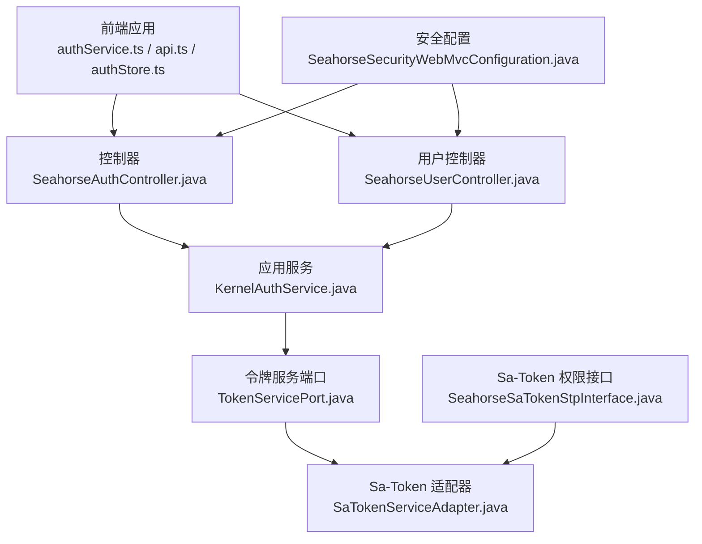
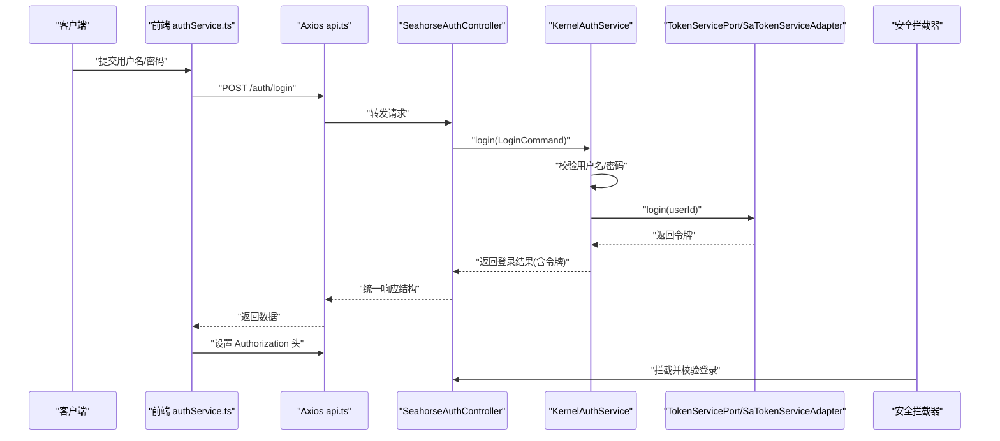
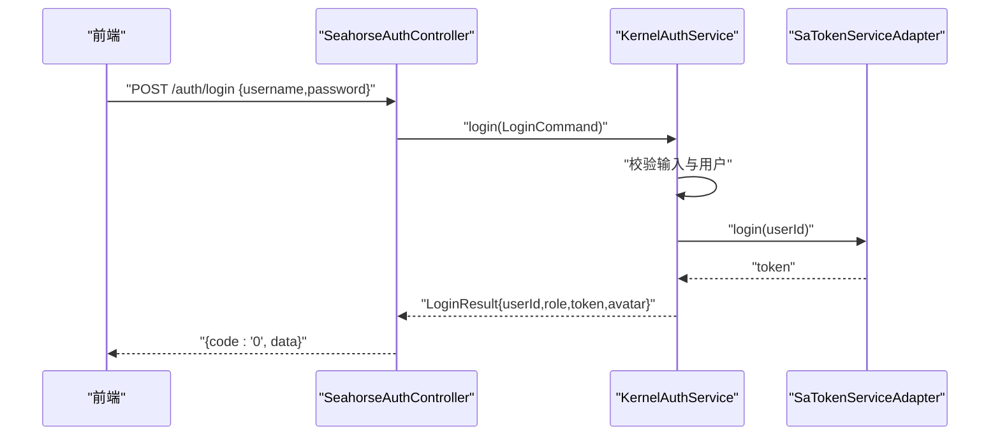
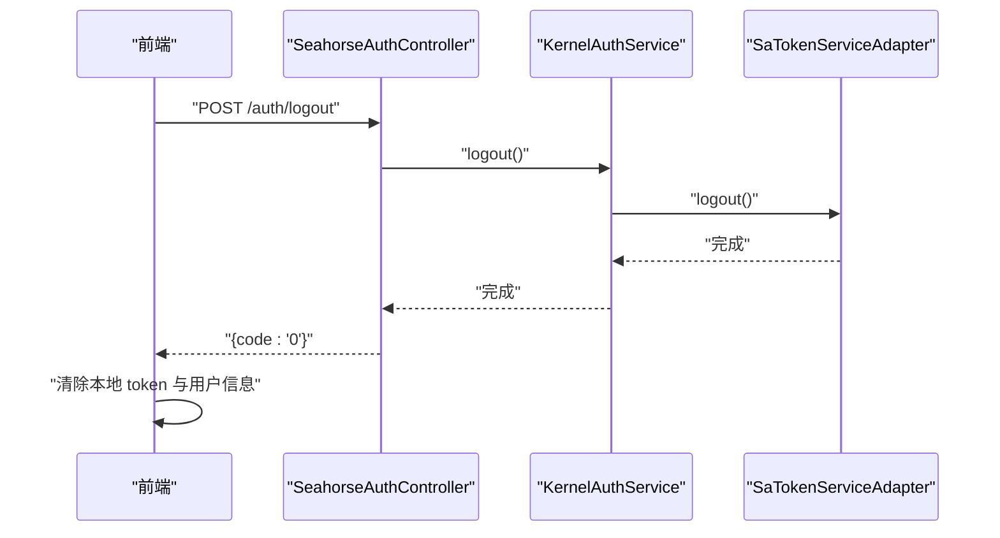
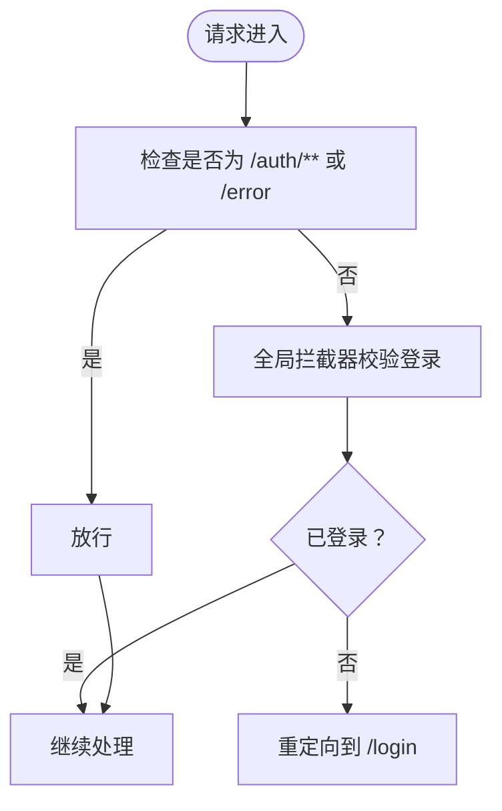
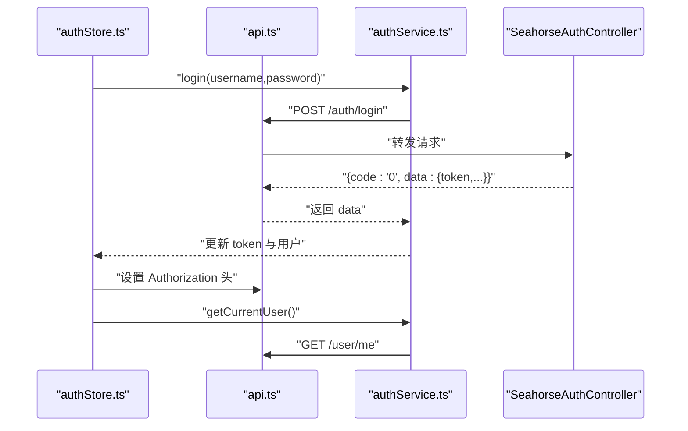
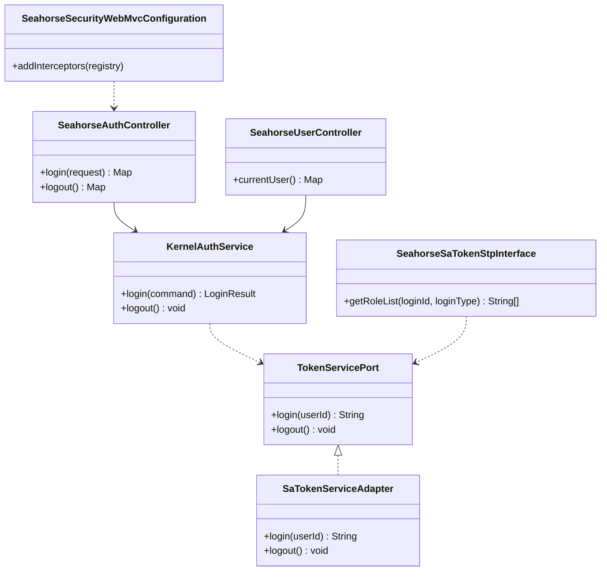

# 认证接口

<cite>
**本文引用的文件**
- [SeahorseAuthController.java](file://seahorse-agent-adapter-web/src/main/java/com/miracle/ai/seahorse/agent/adapters/web/SeahorseAuthController.java)
- [AuthLoginRequest.java](file://seahorse-agent-adapter-web/src/main/java/com/miracle/ai/seahorse/agent/adapters/web/AuthLoginRequest.java)
- [KernelAuthService.java](file://seahorse-agent-kernel/src/main/java/com/miracle/ai/seahorse/agent/kernel/application/auth/KernelAuthService.java)
- [TokenServicePort.java](file://seahorse-agent-kernel/src/main/java/com/miracle/ai/seahorse/agent/ports/outbound/auth/TokenServicePort.java)
- [SaTokenServiceAdapter.java](file://seahorse-agent-adapter-web/src/main/java/com/miracle/ai/seahorse/agent/adapters/web/SaTokenServiceAdapter.java)
- [CurrentUser.java](file://seahorse-agent-kernel/src/main/java/com/miracle/ai/seahorse/agent/ports/outbound/auth/CurrentUser.java)
- [SeahorseUserController.java](file://seahorse-agent-adapter-web/src/main/java/com/miracle/ai/seahorse/agent/adapters/web/SeahorseUserController.java)
- [SeahorseSecurityWebMvcConfiguration.java](file://seahorse-agent-adapter-web/src/main/java/com/miracle/ai/seahorse/agent/adapters/web/SeahorseSecurityWebMvcConfiguration.java)
- [SeahorseSaTokenStpInterface.java](file://seahorse-agent-adapter-web/src/main/java/com/miracle/ai/seahorse/agent/adapters/web/SeahorseSaTokenStpInterface.java)
- [authService.ts](file://frontend/src/services/authService.ts)
- [authStore.ts](file://frontend/src/stores/authStore.ts)
- [api.ts](file://frontend/src/services/api.ts)
- [SeahorseWebApiContractTests.java](file://seahorse-agent-tests/src/test/java/com/miracle/ai/seahorse/agent/adapters/web/SeahorseWebApiContractTests.java)
</cite>

## 目录
1. [简介](#简介)
2. [项目结构](#项目结构)
3. [核心组件](#核心组件)
4. [架构总览](#架构总览)
5. [详细组件分析](#详细组件分析)
6. [依赖分析](#依赖分析)
7. [性能考虑](#性能考虑)
8. [故障排除指南](#故障排除指南)
9. [结论](#结论)
10. [附录](#附录)

## 简介
本文件为认证接口的详细 API 文档，覆盖用户登录、登出、当前用户查询以及权限验证的工作原理。内容包括：
- 登录接口：请求参数、响应格式、认证令牌生成与返回
- 登出接口：处理流程与令牌失效机制
- 权限验证：基于 Sa-Token 的登录拦截与角色权限检查
- 前端集成：认证中间件（Axios）配置、状态管理与路由守卫
- 完整请求/响应示例：成功与失败场景
- 安全最佳实践与常见问题解决方案

## 项目结构
认证相关能力由后端 Web 适配层、内核应用层与前端共同协作完成：
- 后端
  - 控制器：提供 /auth/login、/auth/logout、/user/me 接口
  - 应用服务：内核认证服务负责校验凭据、生成令牌
  - 安全配置：全局拦截器强制登录校验
  - 适配器：Sa-Token 令牌服务与当前用户适配
- 前端
  - Axios 请求拦截器自动附加 Authorization 头
  - 认证状态管理与路由守卫
  - 登录/登出/获取当前用户的服务封装

图表来源
- [SeahorseAuthController.java:44-55](file://seahorse-agent-adapter-web/src/main/java/com/miracle/ai/seahorse/agent/adapters/web/SeahorseAuthController.java#L44-L55)
- [SeahorseUserController.java:51-54](file://seahorse-agent-adapter-web/src/main/java/com/miracle/ai/seahorse/agent/adapters/web/SeahorseUserController.java#L51-L54)
- [KernelAuthService.java:46-69](file://seahorse-agent-kernel/src/main/java/com/miracle/ai/seahorse/agent/kernel/application/auth/KernelAuthService.java#L46-L69)
- [TokenServicePort.java:20-25](file://seahorse-agent-kernel/src/main/java/com/miracle/ai/seahorse/agent/ports/outbound/auth/TokenServicePort.java#L20-L25)
- [SaTokenServiceAdapter.java:23-35](file://seahorse-agent-adapter-web/src/main/java/com/miracle/ai/seahorse/agent/adapters/web/SaTokenServiceAdapter.java#L23-L35)
- [SeahorseSecurityWebMvcConfiguration.java:34-44](file://seahorse-agent-adapter-web/src/main/java/com/miracle/ai/seahorse/agent/adapters/web/SeahorseSecurityWebMvcConfiguration.java#L34-L44)
- [SeahorseSaTokenStpInterface.java:27-49](file://seahorse-agent-adapter-web/src/main/java/com/miracle/ai/seahorse/agent/adapters/web/SeahorseSaTokenStpInterface.java#L27-L49)

章节来源
- [SeahorseAuthController.java:44-55](file://seahorse-agent-adapter-web/src/main/java/com/miracle/ai/seahorse/agent/adapters/web/SeahorseAuthController.java#L44-L55)
- [SeahorseUserController.java:51-54](file://seahorse-agent-adapter-web/src/main/java/com/miracle/ai/seahorse/agent/adapters/web/SeahorseUserController.java#L51-L54)
- [KernelAuthService.java:46-69](file://seahorse-agent-kernel/src/main/java/com/miracle/ai/seahorse/agent/kernel/application/auth/KernelAuthService.java#L46-L69)
- [SeahorseSecurityWebMvcConfiguration.java:34-44](file://seahorse-agent-adapter-web/src/main/java/com/miracle/ai/seahorse/agent/adapters/web/SeahorseSecurityWebMvcConfiguration.java#L34-L44)

## 核心组件
- 登录控制器：接收用户名/密码，调用应用服务执行登录，返回统一响应结构
- 用户控制器：提供获取当前用户信息接口
- 内核认证服务：校验用户名与密码、匹配哈希、生成令牌并返回登录结果
- 令牌服务端口与适配器：抽象令牌生成/注销，Sa-Token 实现
- 安全拦截器：全局拦截除 /auth/** 与 /error 外的所有路径，强制登录校验
- Sa-Token 权限接口：从用户记录中提取角色列表，用于后续权限判断

章节来源
- [SeahorseAuthController.java:44-55](file://seahorse-agent-adapter-web/src/main/java/com/miracle/ai/seahorse/agent/adapters/web/SeahorseAuthController.java#L44-L55)
- [SeahorseUserController.java:51-54](file://seahorse-agent-adapter-web/src/main/java/com/miracle/ai/seahorse/agent/adapters/web/SeahorseUserController.java#L51-L54)
- [KernelAuthService.java:46-69](file://seahorse-agent-kernel/src/main/java/com/miracle/ai/seahorse/agent/kernel/application/auth/KernelAuthService.java#L46-L69)
- [TokenServicePort.java:20-25](file://seahorse-agent-kernel/src/main/java/com/miracle/ai/seahorse/agent/ports/outbound/auth/TokenServicePort.java#L20-L25)
- [SaTokenServiceAdapter.java:23-35](file://seahorse-agent-adapter-web/src/main/java/com/miracle/ai/seahorse/agent/adapters/web/SaTokenServiceAdapter.java#L23-L35)
- [SeahorseSecurityWebMvcConfiguration.java:34-44](file://seahorse-agent-adapter-web/src/main/java/com/miracle/ai/seahorse/agent/adapters/web/SeahorseSecurityWebMvcConfiguration.java#L34-L44)
- [SeahorseSaTokenStpInterface.java:27-49](file://seahorse-agent-adapter-web/src/main/java/com/miracle/ai/seahorse/agent/adapters/web/SeahorseSaTokenStpInterface.java#L27-L49)

## 架构总览
认证流程涉及前后端协作与安全拦截：

图表来源
- [authService.ts:7-13](file://frontend/src/services/authService.ts#L7-L13)
- [api.ts:13-19](file://frontend/src/services/api.ts#L13-L19)
- [SeahorseAuthController.java:44-49](file://seahorse-agent-adapter-web/src/main/java/com/miracle/ai/seahorse/agent/adapters/web/SeahorseAuthController.java#L44-L49)
- [KernelAuthService.java:46-63](file://seahorse-agent-kernel/src/main/java/com/miracle/ai/seahorse/agent/kernel/application/auth/KernelAuthService.java#L46-L63)
- [SaTokenServiceAdapter.java:25-29](file://seahorse-agent-adapter-web/src/main/java/com/miracle/ai/seahorse/agent/adapters/web/SaTokenServiceAdapter.java#L25-L29)
- [SeahorseSecurityWebMvcConfiguration.java:34-44](file://seahorse-agent-adapter-web/src/main/java/com/miracle/ai/seahorse/agent/adapters/web/SeahorseSecurityWebMvcConfiguration.java#L34-L44)

## 详细组件分析

### 登录接口
- 接口定义
  - 方法：POST
  - 路径：/auth/login
  - 请求体：用户名与密码
  - 响应：统一结构，包含业务码与数据块
- 请求参数
  - 字段：username、password
  - 类型：字符串
  - 必填：是
- 响应格式
  - 结构：包含 code 与 data
  - data：包含 userId、role、token、avatar
- 令牌生成与返回
  - 内核服务在凭据校验通过后，委托令牌服务生成令牌并返回
- 成功与失败示例
  - 成功：code=0，data.token 返回有效令牌
  - 失败：用户名或密码错误时抛出参数异常；code 非 0，前端拦截器触发错误提示与跳转

图表来源
- [SeahorseAuthController.java:44-49](file://seahorse-agent-adapter-web/src/main/java/com/miracle/ai/seahorse/agent/adapters/web/SeahorseAuthController.java#L44-L49)
- [KernelAuthService.java:46-63](file://seahorse-agent-kernel/src/main/java/com/miracle/ai/seahorse/agent/kernel/application/auth/KernelAuthService.java#L46-L63)
- [SaTokenServiceAdapter.java:25-29](file://seahorse-agent-adapter-web/src/main/java/com/miracle/ai/seahorse/agent/adapters/web/SaTokenServiceAdapter.java#L25-L29)

章节来源
- [SeahorseAuthController.java:44-49](file://seahorse-agent-adapter-web/src/main/java/com/miracle/ai/seahorse/agent/adapters/web/SeahorseAuthController.java#L44-L49)
- [AuthLoginRequest.java:20-40](file://seahorse-agent-adapter-web/src/main/java/com/miracle/ai/seahorse/agent/adapters/web/AuthLoginRequest.java#L20-L40)
- [KernelAuthService.java:46-63](file://seahorse-agent-kernel/src/main/java/com/miracle/ai/seahorse/agent/kernel/application/auth/KernelAuthService.java#L46-L63)
- [SeahorseWebApiContractTests.java:122-127](file://seahorse-agent-tests/src/test/java/com/miracle/ai/seahorse/agent/adapters/web/SeahorseWebApiContractTests.java#L122-L127)

### 登出接口
- 接口定义
  - 方法：POST
  - 路径：/auth/logout
  - 请求体：无
  - 响应：统一结构，包含业务码
- 处理流程
  - 控制器调用应用服务执行登出
  - 应用服务委托令牌服务执行注销
  - 前端清除本地存储与 Authorization 头
- 令牌失效机制
  - Sa-Token 注销会使当前会话失效，后续请求需重新登录
  - 前端拦截器在 401 或业务提示“未登录”时重定向到登录页

图表来源
- [SeahorseAuthController.java:51-54](file://seahorse-agent-adapter-web/src/main/java/com/miracle/ai/seahorse/agent/adapters/web/SeahorseAuthController.java#L51-L54)
- [KernelAuthService.java:66-69](file://seahorse-agent-kernel/src/main/java/com/miracle/ai/seahorse/agent/kernel/application/auth/KernelAuthService.java#L66-L69)
- [SaTokenServiceAdapter.java:31-34](file://seahorse-agent-adapter-web/src/main/java/com/miracle/ai/seahorse/agent/adapters/web/SaTokenServiceAdapter.java#L31-L34)
- [api.ts:48-54](file://frontend/src/services/api.ts#L48-L54)

章节来源
- [SeahorseAuthController.java:51-54](file://seahorse-agent-adapter-web/src/main/java/com/miracle/ai/seahorse/agent/adapters/web/SeahorseAuthController.java#L51-L54)
- [KernelAuthService.java:66-69](file://seahorse-agent-kernel/src/main/java/com/miracle/ai/seahorse/agent/kernel/application/auth/KernelAuthService.java#L66-L69)
- [authService.ts:11-13](file://frontend/src/services/authService.ts#L11-L13)
- [api.ts:48-54](file://frontend/src/services/api.ts#L48-L54)

### 当前用户接口
- 接口定义
  - 方法：GET
  - 路径：/user/me
  - 响应：统一结构，包含当前用户信息
- 数据模型
  - CurrentUser：包含 userId、username、role、avatar
- 前端集成
  - 登录成功后可调用该接口刷新用户信息
  - 前端拦截器在业务码非 0 时清理本地状态并跳转登录

章节来源
- [SeahorseUserController.java:51-54](file://seahorse-agent-adapter-web/src/main/java/com/miracle/ai/seahorse/agent/adapters/web/SeahorseUserController.java#L51-L54)
- [CurrentUser.java:20-25](file://seahorse-agent-kernel/src/main/java/com/miracle/ai/seahorse/agent/ports/outbound/auth/CurrentUser.java#L20-L25)
- [api.ts:29-47](file://frontend/src/services/api.ts#L29-L47)

### 权限验证与角色检查
- 登录拦截
  - 全局拦截器对所有路径进行登录校验，排除 /auth/** 与 /error
- 角色权限
  - Sa-Token 权限接口从用户记录中读取角色，作为角色列表返回
  - 可用于后续基于注解或自定义过滤器的角色校验
- 前端路由守卫
  - 基于认证状态与角色的路由保护（例如管理员页面）

图表来源
- [SeahorseSecurityWebMvcConfiguration.java:34-44](file://seahorse-agent-adapter-web/src/main/java/com/miracle/ai/seahorse/agent/adapters/web/SeahorseSecurityWebMvcConfiguration.java#L34-L44)
- [SeahorseSaTokenStpInterface.java:35-49](file://seahorse-agent-adapter-web/src/main/java/com/miracle/ai/seahorse/agent/adapters/web/SeahorseSaTokenStpInterface.java#L35-L49)

章节来源
- [SeahorseSecurityWebMvcConfiguration.java:34-44](file://seahorse-agent-adapter-web/src/main/java/com/miracle/ai/seahorse/agent/adapters/web/SeahorseSecurityWebMvcConfiguration.java#L34-L44)
- [SeahorseSaTokenStpInterface.java:35-49](file://seahorse-agent-adapter-web/src/main/java/com/miracle/ai/seahorse/agent/adapters/web/SeahorseSaTokenStpInterface.java#L35-L49)

### 前端认证中间件与状态管理
- Axios 中间件
  - 自动从本地存储读取 token 并注入 Authorization 头
  - 统一响应拦截：当业务码非 0 或 401 时清理本地状态并跳转登录
- 认证状态管理
  - 登录：保存 token 与用户信息，设置 Authorization 头，刷新当前用户
  - 登出：调用后端登出接口，清理本地状态与聊天会话
  - 校验：启动时恢复 token 并尝试获取当前用户

图表来源
- [authStore.ts:29-67](file://frontend/src/stores/authStore.ts#L29-L67)
- [api.ts:13-19](file://frontend/src/services/api.ts#L13-L19)
- [authService.ts:7-17](file://frontend/src/services/authService.ts#L7-L17)
- [SeahorseAuthController.java:44-49](file://seahorse-agent-adapter-web/src/main/java/com/miracle/ai/seahorse/agent/adapters/web/SeahorseAuthController.java#L44-L49)

章节来源
- [api.ts:13-19](file://frontend/src/services/api.ts#L13-L19)
- [authStore.ts:29-67](file://frontend/src/stores/authStore.ts#L29-L67)
- [authService.ts:7-17](file://frontend/src/services/authService.ts#L7-L17)

## 依赖分析
认证模块的依赖关系如下：

图表来源
- [TokenServicePort.java:20-25](file://seahorse-agent-kernel/src/main/java/com/miracle/ai/seahorse/agent/ports/outbound/auth/TokenServicePort.java#L20-L25)
- [SaTokenServiceAdapter.java:23-35](file://seahorse-agent-adapter-web/src/main/java/com/miracle/ai/seahorse/agent/adapters/web/SaTokenServiceAdapter.java#L23-L35)
- [KernelAuthService.java:30-44](file://seahorse-agent-kernel/src/main/java/com/miracle/ai/seahorse/agent/kernel/application/auth/KernelAuthService.java#L30-L44)
- [SeahorseAuthController.java:38-42](file://seahorse-agent-adapter-web/src/main/java/com/miracle/ai/seahorse/agent/adapters/web/SeahorseAuthController.java#L38-L42)
- [SeahorseUserController.java:45-49](file://seahorse-agent-adapter-web/src/main/java/com/miracle/ai/seahorse/agent/adapters/web/SeahorseUserController.java#L45-L49)
- [SeahorseSecurityWebMvcConfiguration.java:34-44](file://seahorse-agent-adapter-web/src/main/java/com/miracle/ai/seahorse/agent/adapters/web/SeahorseSecurityWebMvcConfiguration.java#L34-L44)
- [SeahorseSaTokenStpInterface.java:27-49](file://seahorse-agent-adapter-web/src/main/java/com/miracle/ai/seahorse/agent/adapters/web/SeahorseSaTokenStpInterface.java#L27-L49)

章节来源
- [KernelAuthService.java:30-44](file://seahorse-agent-kernel/src/main/java/com/miracle/ai/seahorse/agent/kernel/application/auth/KernelAuthService.java#L30-L44)
- [SeahorseAuthController.java:38-42](file://seahorse-agent-adapter-web/src/main/java/com/miracle/ai/seahorse/agent/adapters/web/SeahorseAuthController.java#L38-L42)
- [SeahorseUserController.java:45-49](file://seahorse-agent-adapter-web/src/main/java/com/miracle/ai/seahorse/agent/adapters/web/SeahorseUserController.java#L45-L49)
- [SeahorseSecurityWebMvcConfiguration.java:34-44](file://seahorse-agent-adapter-web/src/main/java/com/miracle/ai/seahorse/agent/adapters/web/SeahorseSecurityWebMvcConfiguration.java#L34-L44)
- [SeahorseSaTokenStpInterface.java:27-49](file://seahorse-agent-adapter-web/src/main/java/com/miracle/ai/seahorse/agent/adapters/web/SeahorseSaTokenStpInterface.java#L27-L49)

## 性能考虑
- 令牌生成与校验
  - 使用 Sa-Token 进行登录与注销，具备高性能与低延迟特性
- 密码校验
  - 采用哈希匹配策略，避免明文存储与传输
- 前端缓存
  - 本地存储 token 与用户信息，减少重复登录与重复拉取用户信息的开销
- 拦截器开销
  - 全局拦截器仅做登录校验，不引入复杂逻辑，对性能影响较小

## 故障排除指南
- 登录失败
  - 现象：返回业务码非 0，提示用户名或密码错误
  - 处理：检查用户名/密码是否为空，确认用户是否存在且密码正确
- 未登录/401
  - 现象：响应拦截器检测到未登录或 401，清理本地状态并跳转登录页
  - 处理：确保前端正确设置 Authorization 头；后端拦截器生效
- 登出后仍可访问
  - 现象：登出后仍可访问受保护资源
  - 处理：确认前端已清除 token；后端 Sa-Token 注销成功；浏览器未缓存旧 token
- 角色权限不生效
  - 现象：用户角色未被识别
  - 处理：确认用户记录中 role 字段存在且非空；Sa-Token 权限接口正确返回角色列表

章节来源
- [api.ts:29-65](file://frontend/src/services/api.ts#L29-L65)
- [SeahorseSecurityWebMvcConfiguration.java:34-44](file://seahorse-agent-adapter-web/src/main/java/com/miracle/ai/seahorse/agent/adapters/web/SeahorseSecurityWebMvcConfiguration.java#L34-L44)
- [SeahorseSaTokenStpInterface.java:35-49](file://seahorse-agent-adapter-web/src/main/java/com/miracle/ai/seahorse/agent/adapters/web/SeahorseSaTokenStpInterface.java#L35-L49)

## 结论
本认证体系以 Sa-Token 为核心，结合内核应用服务与统一响应结构，实现了简洁可靠的登录、登出与权限校验能力。前端通过 Axios 中间件与状态管理，提供了良好的用户体验与安全性保障。建议在生产环境中配合 HTTPS、强密码策略与定期轮换密钥等最佳实践进一步提升安全强度。

## 附录

### API 定义与示例

- 登录接口
  - 方法：POST
  - 路径：/auth/login
  - 请求体字段
    - username：字符串，必填
    - password：字符串，必填
  - 成功响应示例
    - code："0"
    - data.token：字符串，令牌值
  - 失败响应示例
    - code：非 "0"
    - message：错误信息（如用户名或密码错误）
- 登出接口
  - 方法：POST
  - 路径：/auth/logout
  - 成功响应示例
    - code："0"
- 当前用户接口
  - 方法：GET
  - 路径：/user/me
  - 成功响应示例
    - code："0"
    - data.username：字符串
    - data.role：字符串
    - data.avatar：字符串

章节来源
- [SeahorseAuthController.java:44-55](file://seahorse-agent-adapter-web/src/main/java/com/miracle/ai/seahorse/agent/adapters/web/SeahorseAuthController.java#L44-L55)
- [SeahorseUserController.java:51-54](file://seahorse-agent-adapter-web/src/main/java/com/miracle/ai/seahorse/agent/adapters/web/SeahorseUserController.java#L51-L54)
- [SeahorseWebApiContractTests.java:122-135](file://seahorse-agent-tests/src/test/java/com/miracle/ai/seahorse/agent/adapters/web/SeahorseWebApiContractTests.java#L122-L135)