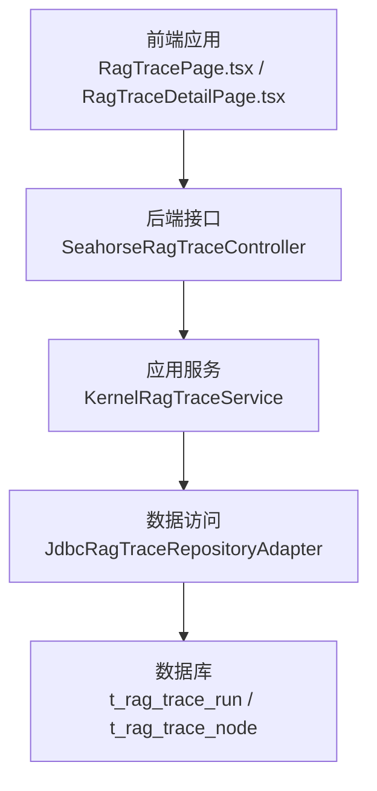
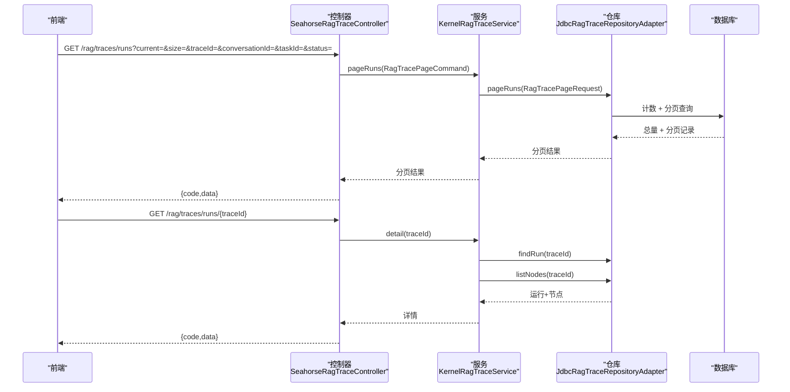
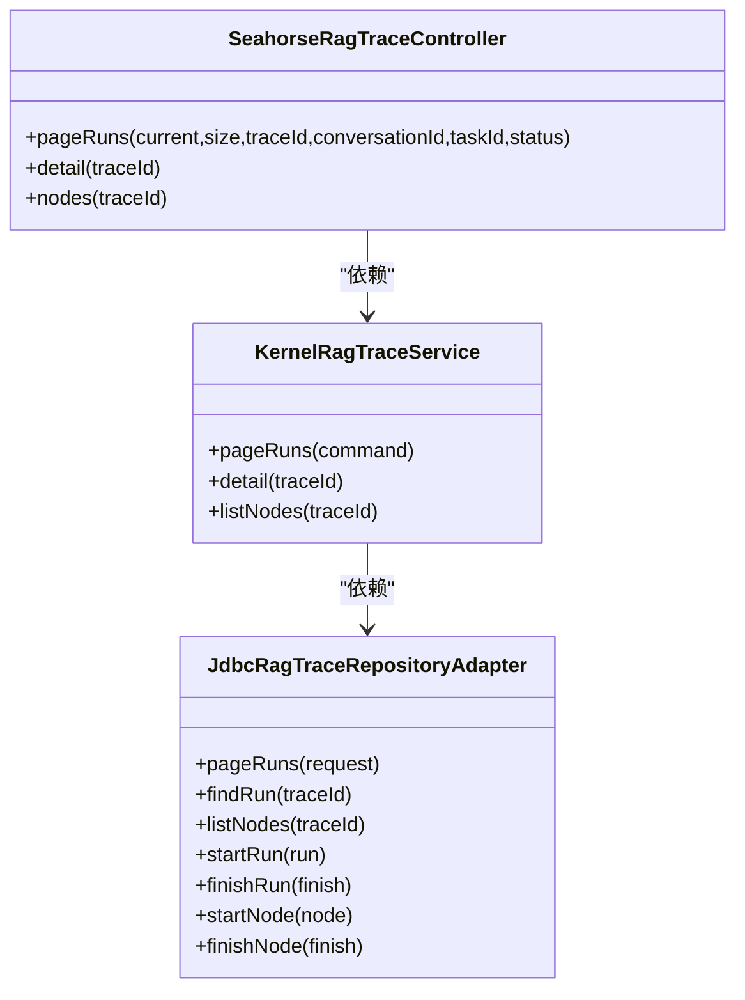
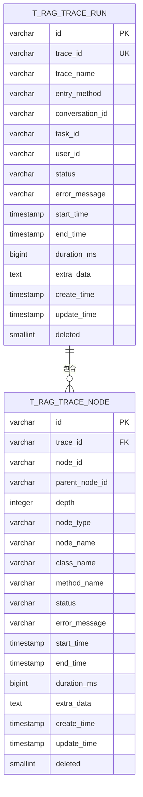

# 追踪监控接口

<cite>
**本文引用的文件**
- [SeahorseRagTraceController.java](file://seahorse-agent-adapter-web/src/main/java/com/miracle/ai/seahorse/agent/adapters/web/SeahorseRagTraceController.java)
- [KernelRagTraceService.java](file://seahorse-agent-kernel/src/main/java/com/miracle/ai/seahorse/agent/kernel/application/trace/KernelRagTraceService.java)
- [JdbcRagTraceRepositoryAdapter.java](file://seahorse-agent-adapter-repository-jdbc/src/main/java/com/miracle/ai/seahorse/agent/adapters/repository/jdbc/JdbcRagTraceRepositoryAdapter.java)
- [ragTraceService.ts](file://frontend/src/services/ragTraceService.ts)
- [RagTracePage.tsx](file://frontend/src/pages/admin/traces/RagTracePage.tsx)
- [RagTraceDetailPage.tsx](file://frontend/src/pages/admin/traces/RagTraceDetailPage.tsx)
- [traceUtils.ts](file://frontend/src/pages/admin/traces/traceUtils.ts)
- [schema_pg.sql](file://resources/database/schema_pg.sql)
</cite>

## 目录
1. [简介](#简介)
2. [项目结构](#项目结构)
3. [核心组件](#核心组件)
4. [架构总览](#架构总览)
5. [详细组件分析](#详细组件分析)
6. [依赖分析](#依赖分析)
7. [性能考虑](#性能考虑)
8. [故障排查指南](#故障排查指南)
9. [结论](#结论)
10. [附录](#附录)

## 简介
本文件面向开发者与运维人员，系统性地文档化 RAG 追踪监控接口，覆盖以下方面：
- 追踪记录查询接口：支持分页、过滤条件（traceId、conversationId、taskId、status）等
- 追踪详情接口：单条追踪记录的完整信息、节点执行详情、性能指标
- 追踪数据存储与查询机制：数据库表结构、索引策略、查询优化、软删除
- 完整 API 调用示例：复杂查询场景与性能分析场景
- 可视化与分析工具集成：前端瀑布图、统计卡片、指标计算

## 项目结构
追踪模块由三层组成：
- 适配层（Web Adapter）：暴露 REST 接口，接收请求并返回统一格式响应
- 应用层（Kernel Service）：处理业务命令、参数校验与边界值规范化
- 数据访问层（Repository Adapter）：基于 JDBC 的持久化与查询实现

图表来源
- [SeahorseRagTraceController.java:49-69](file://seahorse-agent-adapter-web/src/main/java/com/miracle/ai/seahorse/agent/adapters/web/SeahorseRagTraceController.java#L49-L69)
- [KernelRagTraceService.java:47-70](file://seahorse-agent-kernel/src/main/java/com/miracle/ai/seahorse/agent/kernel/application/trace/KernelRagTraceService.java#L47-L70)
- [JdbcRagTraceRepositoryAdapter.java:88-125](file://seahorse-agent-adapter-repository-jdbc/src/main/java/com/miracle/ai/seahorse/agent/adapters/repository/jdbc/JdbcRagTraceRepositoryAdapter.java#L88-L125)
- [schema_pg.sql:293-326](file://resources/database/schema_pg.sql#L293-L326)

章节来源
- [SeahorseRagTraceController.java:49-69](file://seahorse-agent-adapter-web/src/main/java/com/miracle/ai/seahorse/agent/adapters/web/SeahorseRagTraceController.java#L49-L69)
- [KernelRagTraceService.java:47-82](file://seahorse-agent-kernel/src/main/java/com/miracle/ai/seahorse/agent/kernel/application/trace/KernelRagTraceService.java#L47-L82)
- [JdbcRagTraceRepositoryAdapter.java:88-125](file://seahorse-agent-adapter-repository-jdbc/src/main/java/com/miracle/ai/seahorse/agent/adapters/repository/jdbc/JdbcRagTraceRepositoryAdapter.java#L88-L125)
- [schema_pg.sql:293-326](file://resources/database/schema_pg.sql#L293-L326)

## 核心组件
- Web 控制器：提供三个接口
  - GET /rag/traces/runs：分页查询追踪运行记录
  - GET /rag/traces/runs/{traceId}：获取追踪详情（运行+节点）
  - GET /rag/traces/runs/{traceId}/nodes：仅获取节点列表
- 应用服务：负责参数规范化（默认值、最大页大小）、调用仓库层
- 仓库适配器：基于 JDBC 实现分页计数、过滤、插入/更新运行与节点记录
- 前端服务：封装 API 请求，定义数据模型与分页结果结构
- 前端页面：列表页与详情页，包含瀑布图、统计卡片、指标计算

章节来源
- [SeahorseRagTraceController.java:49-69](file://seahorse-agent-adapter-web/src/main/java/com/miracle/ai/seahorse/agent/adapters/web/SeahorseRagTraceController.java#L49-L69)
- [KernelRagTraceService.java:47-82](file://seahorse-agent-kernel/src/main/java/com/miracle/ai/seahorse/agent/kernel/application/trace/KernelRagTraceService.java#L47-L82)
- [JdbcRagTraceRepositoryAdapter.java:88-125](file://seahorse-agent-adapter-repository-jdbc/src/main/java/com/miracle/ai/seahorse/agent/adapters/repository/jdbc/JdbcRagTraceRepositoryAdapter.java#L88-L125)
- [ragTraceService.ts:57-78](file://frontend/src/services/ragTraceService.ts#L57-L78)
- [RagTracePage.tsx:45-68](file://frontend/src/pages/admin/traces/RagTracePage.tsx#L45-L68)
- [RagTraceDetailPage.tsx:211-245](file://frontend/src/pages/admin/traces/RagTraceDetailPage.tsx#L211-L245)

## 架构总览
下图展示从接口到数据库的完整调用链与数据流。

图表来源
- [SeahorseRagTraceController.java:49-69](file://seahorse-agent-adapter-web/src/main/java/com/miracle/ai/seahorse/agent/adapters/web/SeahorseRagTraceController.java#L49-L69)
- [KernelRagTraceService.java:47-70](file://seahorse-agent-kernel/src/main/java/com/miracle/ai/seahorse/agent/kernel/application/trace/KernelRagTraceService.java#L47-L70)
- [JdbcRagTraceRepositoryAdapter.java:88-125](file://seahorse-agent-adapter-repository-jdbc/src/main/java/com/miracle/ai/seahorse/agent/adapters/repository/jdbc/JdbcRagTraceRepositoryAdapter.java#L88-L125)

## 详细组件分析

### Web 控制器（REST 接口）
- 接口设计
  - GET /rag/traces/runs：分页查询运行记录，支持多维过滤
  - GET /rag/traces/runs/{traceId}：获取追踪详情（运行+节点）
  - GET /rag/traces/runs/{traceId}/nodes：仅获取节点列表
- 参数与默认值
  - current 默认 1，size 默认 10，最大 200（由应用层限制）
  - 支持过滤字段：traceId、conversationId、taskId、status
- 响应格式
  - 统一返回 { code, data }，其中 code=0 表示成功

章节来源
- [SeahorseRagTraceController.java:49-69](file://seahorse-agent-adapter-web/src/main/java/com/miracle/ai/seahorse/agent/adapters/web/SeahorseRagTraceController.java#L49-L69)

### 应用服务（业务编排）
- 参数规范化
  - current ≤ 0 视为 1；size ≤ 0 视为默认 10；size 最大 200
- 查询流程
  - pageRuns：构造分页请求并委托仓库层执行
  - detail：组合运行记录与节点列表
  - listNodes：直接查询节点列表

章节来源
- [KernelRagTraceService.java:47-82](file://seahorse-agent-kernel/src/main/java/com/miracle/ai/seahorse/agent/kernel/application/trace/KernelRagTraceService.java#L47-L82)

### 仓库适配器（JDBC 实现）
- 查询逻辑
  - pageRuns：先 COUNT 再 LIMIT/OFFSET 获取分页记录
  - findRun：按 traceId 查询（软删除过滤）
  - listNodes：按 traceId 查询（软删除过滤）
- 插入与更新
  - startRun/finishRun：运行记录的插入与结束更新
  - startNode/finishNode：节点记录的插入与结束更新
- 过滤条件
  - 支持 trace_id、conversation_id、task_id、status 的等值过滤
- 索引策略
  - t_rag_trace_run 上存在 task_id、user_id 索引，有利于按任务与用户维度查询

章节来源
- [JdbcRagTraceRepositoryAdapter.java:88-125](file://seahorse-agent-adapter-repository-jdbc/src/main/java/com/miracle/ai/seahorse/agent/adapters/repository/jdbc/JdbcRagTraceRepositoryAdapter.java#L88-L125)
- [JdbcRagTraceRepositoryAdapter.java:204-231](file://seahorse-agent-adapter-repository-jdbc/src/main/java/com/miracle/ai/seahorse/agent/adapters/repository/jdbc/JdbcRagTraceRepositoryAdapter.java#L204-L231)
- [schema_pg.sql:293-326](file://resources/database/schema_pg.sql#L293-L326)

### 前端服务与页面
- 前端服务
  - 定义 RagTraceRun、RagTraceNode、RagTraceDetail、PageResult 类型
  - 提供 getRagTraceRuns、getRagTraceDetail、getRagTraceNodes 方法
- 列表页
  - 支持 traceId 搜索、分页、刷新
  - 统计卡片：成功/失败/运行中数量、成功率、平均耗时、P95 耗时
- 详情页
  - 显示运行元信息、错误提示、指标条
  - 瀑布图：按时间轴展示节点执行时序与耗时

章节来源
- [ragTraceService.ts:3-78](file://frontend/src/services/ragTraceService.ts#L3-L78)
- [RagTracePage.tsx:45-100](file://frontend/src/pages/admin/traces/RagTracePage.tsx#L45-L100)
- [RagTraceDetailPage.tsx:211-303](file://frontend/src/pages/admin/traces/RagTraceDetailPage.tsx#L211-L303)
- [traceUtils.ts:1-102](file://frontend/src/pages/admin/traces/traceUtils.ts#L1-L102)

### 数据模型与存储机制
- 运行记录表（t_rag_trace_run）
  - 主键：id；唯一约束：trace_id
  - 字段：trace_id、trace_name、entry_method、conversation_id、task_id、user_id、status、error_message、start_time、end_time、duration_ms、extra_data、deleted
  - 索引：task_id、user_id
- 节点记录表（t_rag_trace_node）
  - 主键：id；外键：trace_id
  - 字段：trace_id、node_id、parent_node_id、depth、node_type、node_name、class_name、method_name、status、error_message、start_time、end_time、duration_ms、extra_data、deleted
- 软删除
  - 通过 deleted=0 过滤未删除记录

章节来源
- [schema_pg.sql:293-326](file://resources/database/schema_pg.sql#L293-L326)
- [JdbcRagTraceRepositoryAdapter.java:104-125](file://seahorse-agent-adapter-repository-jdbc/src/main/java/com/miracle/ai/seahorse/agent/adapters/repository/jdbc/JdbcRagTraceRepositoryAdapter.java#L104-L125)

## 依赖分析
- 控制器依赖应用服务（RagTraceInboundPort）
- 应用服务依赖仓库端口（RagTraceRepositoryPort）
- 仓库适配器实现仓库端口，并依赖 JDBC 模板
- 前端依赖后端接口与类型定义

图表来源
- [SeahorseRagTraceController.java:43-47](file://seahorse-agent-adapter-web/src/main/java/com/miracle/ai/seahorse/agent/adapters/web/SeahorseRagTraceController.java#L43-L47)
- [KernelRagTraceService.java:41-45](file://seahorse-agent-kernel/src/main/java/com/miracle/ai/seahorse/agent/kernel/application/trace/KernelRagTraceService.java#L41-L45)
- [JdbcRagTraceRepositoryAdapter.java:82-86](file://seahorse-agent-adapter-repository-jdbc/src/main/java/com/miracle/ai/seahorse/agent/adapters/repository/jdbc/JdbcRagTraceRepositoryAdapter.java#L82-L86)

## 性能考虑
- 分页与上限
  - 应用层对 size 设置最大值（200），避免超大页导致数据库压力
- 查询优化
  - pageRuns 先 COUNT 再分页，避免全表扫描
  - 使用等值过滤（trace_id、conversation_id、task_id、status），结合现有索引（task_id、user_id）
- 时间序列可视化
  - 前端瀑布图按节点 start_time 与 duration_ms 计算相对位置，避免后端重复计算
- 建议
  - 对高频过滤字段可考虑增加复合索引（如 task_id+status、user_id+status）
  - 对历史数据可定期归档或清理，控制表规模

章节来源
- [KernelRagTraceService.java:37-40](file://seahorse-agent-kernel/src/main/java/com/miracle/ai/seahorse/agent/kernel/application/trace/KernelRagTraceService.java#L37-L40)
- [KernelRagTraceService.java:72-81](file://seahorse-agent-kernel/src/main/java/com/miracle/ai/seahorse/agent/kernel/application/trace/KernelRagTraceService.java#L72-L81)
- [JdbcRagTraceRepositoryAdapter.java:88-102](file://seahorse-agent-adapter-repository-jdbc/src/main/java/com/miracle/ai/seahorse/agent/adapters/repository/jdbc/JdbcRagTraceRepositoryAdapter.java#L88-L102)
- [schema_pg.sql:312-313](file://resources/database/schema_pg.sql#L312-L313)

## 故障排查指南
- 常见问题
  - Trace Id 缺失：详情页会提示“缺少 Trace Id”
  - 查询无结果：确认过滤条件是否正确，检查 traceId 是否存在
  - 列表为空：检查当前页码与每页大小，尝试刷新
- 前端调试
  - 使用浏览器网络面板查看请求与响应
  - 查看控制台错误日志与 toast 提示
- 后端调试
  - 检查控制器参数绑定与应用服务参数规范化
  - 核对仓库层 SQL 过滤条件与索引使用情况
- 数据一致性
  - 若节点状态异常，检查 startNode/finishNode 是否成对调用
  - 关注 soft delete 字段（deleted=0）

章节来源
- [RagTraceDetailPage.tsx:316-346](file://frontend/src/pages/admin/traces/RagTraceDetailPage.tsx#L316-L346)
- [SeahorseRagTraceController.java:49-69](file://seahorse-agent-adapter-web/src/main/java/com/miracle/ai/seahorse/agent/adapters/web/SeahorseRagTraceController.java#L49-L69)
- [KernelRagTraceService.java:47-70](file://seahorse-agent-kernel/src/main/java/com/miracle/ai/seahorse/agent/kernel/application/trace/KernelRagTraceService.java#L47-L70)
- [JdbcRagTraceRepositoryAdapter.java:164-202](file://seahorse-agent-adapter-repository-jdbc/src/main/java/com/miracle/ai/seahorse/agent/adapters/repository/jdbc/JdbcRagTraceRepositoryAdapter.java#L164-L202)

## 结论
该追踪监控接口以清晰的三层架构实现，具备完善的分页与过滤能力、良好的前端可视化体验以及可扩展的数据存储方案。通过合理的参数规范化与索引策略，能够在高并发场景下保持稳定性能。建议在生产环境中配合数据保留策略与索引优化，持续提升查询效率与可观测性。

## 附录

### API 定义与调用示例

- 分页查询运行记录
  - 方法与路径：GET /rag/traces/runs
  - 查询参数
    - current：页码，默认 1
    - size：每页条数，默认 10，最大 200
    - traceId：追踪 ID
    - conversationId：会话 ID
    - taskId：任务 ID
    - status：状态（RUNNING/SUCCESS/FAILED）
  - 响应结构：{ code, data: { records, total, size, current, pages } }

- 获取追踪详情
  - 方法与路径：GET /rag/traces/runs/{traceId}
  - 响应结构：{ code, data: { run, nodes } }

- 获取节点列表
  - 方法与路径：GET /rag/traces/runs/{traceId}/nodes
  - 响应结构：{ code, data: nodes[] }

- 复杂查询场景示例
  - 场景 1：按任务 ID 与状态过滤，分页获取
    - 参数：taskId=任务标识，status=RUNNING|SUCCESS|FAILED，current=1，size=50
  - 场景 2：按 traceId 精确匹配
    - 参数：traceId=追踪标识
  - 场景 3：按用户 ID 与时间窗口（由前端计算）进行筛选（需结合后端过滤与索引）

- 性能分析场景示例
  - 场景 1：计算 P95 耗时
    - 步骤：后端返回 duration_ms，前端按 traceUtils.percentile 计算
  - 场景 2：瀑布图时序分析
    - 步骤：前端按节点 start_time 与 duration_ms 计算 leftPercent 与 widthPercent

章节来源
- [SeahorseRagTraceController.java:49-69](file://seahorse-agent-adapter-web/src/main/java/com/miracle/ai/seahorse/agent/adapters/web/SeahorseRagTraceController.java#L49-L69)
- [KernelRagTraceService.java:47-70](file://seahorse-agent-kernel/src/main/java/com/miracle/ai/seahorse/agent/kernel/application/trace/KernelRagTraceService.java#L47-L70)
- [ragTraceService.ts:57-78](file://frontend/src/services/ragTraceService.ts#L57-L78)
- [RagTracePage.tsx:45-68](file://frontend/src/pages/admin/traces/RagTracePage.tsx#L45-L68)
- [RagTraceDetailPage.tsx:249-287](file://frontend/src/pages/admin/traces/RagTraceDetailPage.tsx#L249-L287)
- [traceUtils.ts:83-101](file://frontend/src/pages/admin/traces/traceUtils.ts#L83-L101)

### 数据模型图

图表来源
- [schema_pg.sql:293-326](file://resources/database/schema_pg.sql#L293-L326)