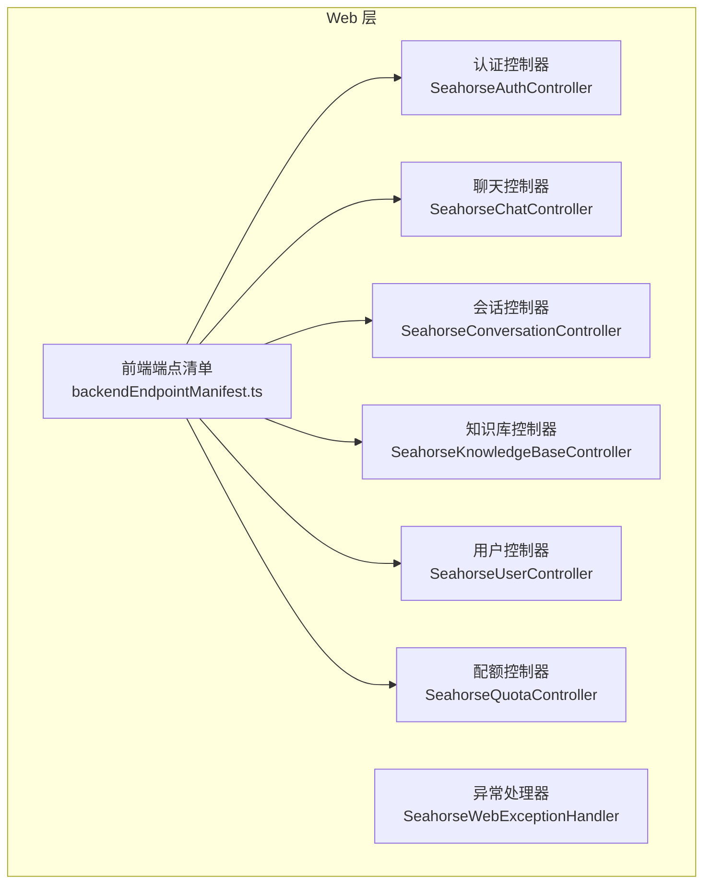
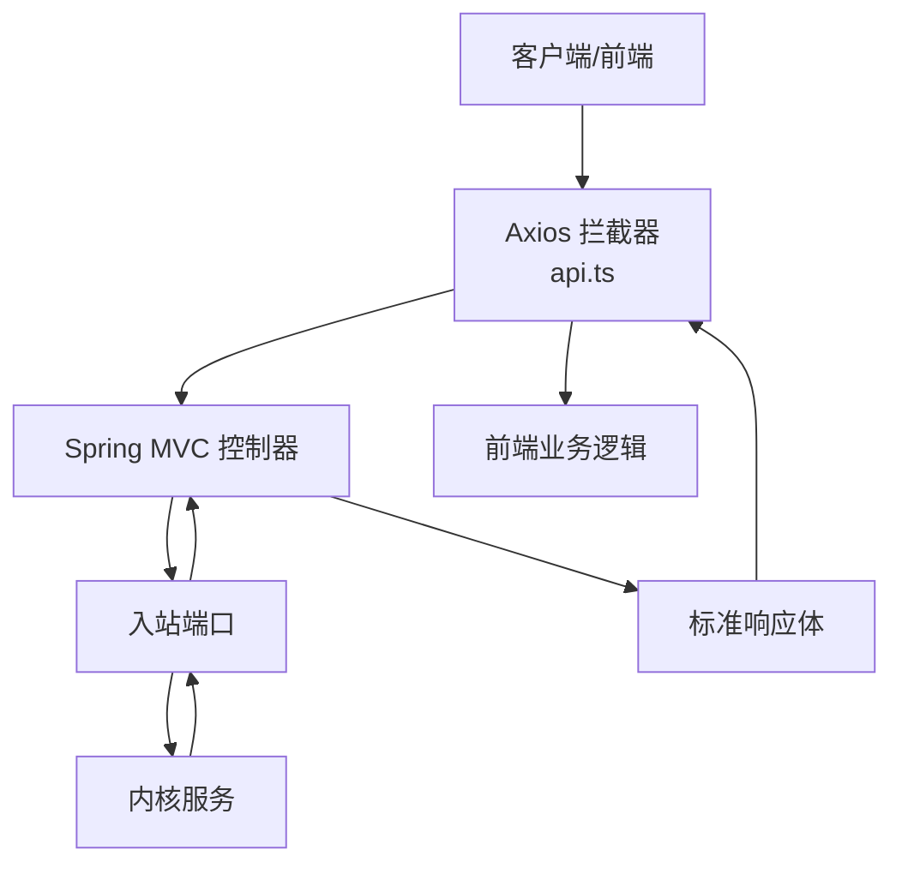
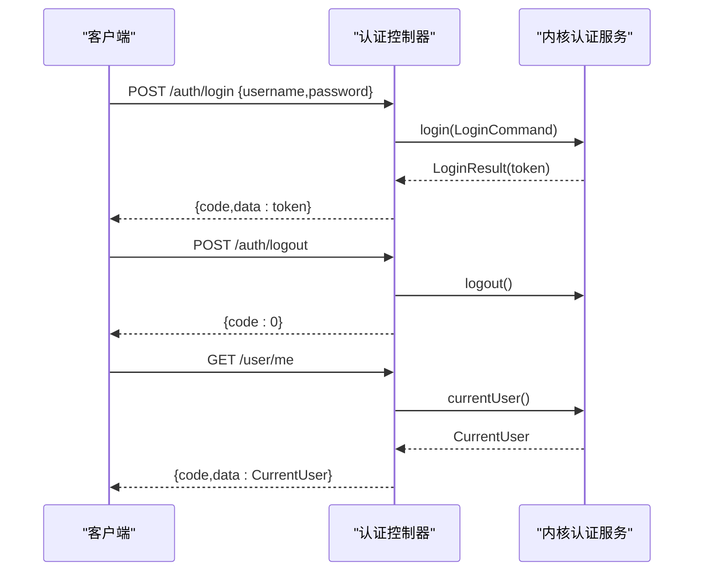
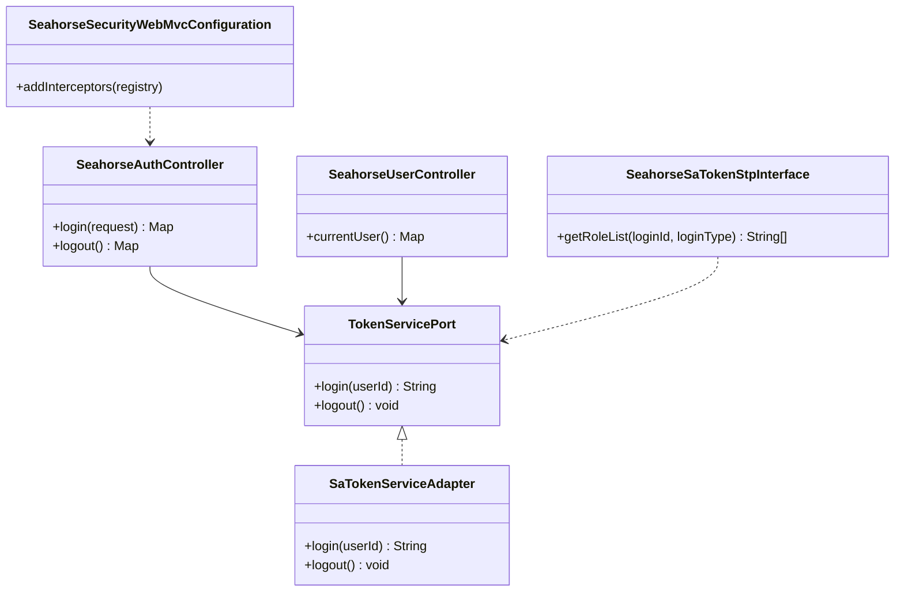
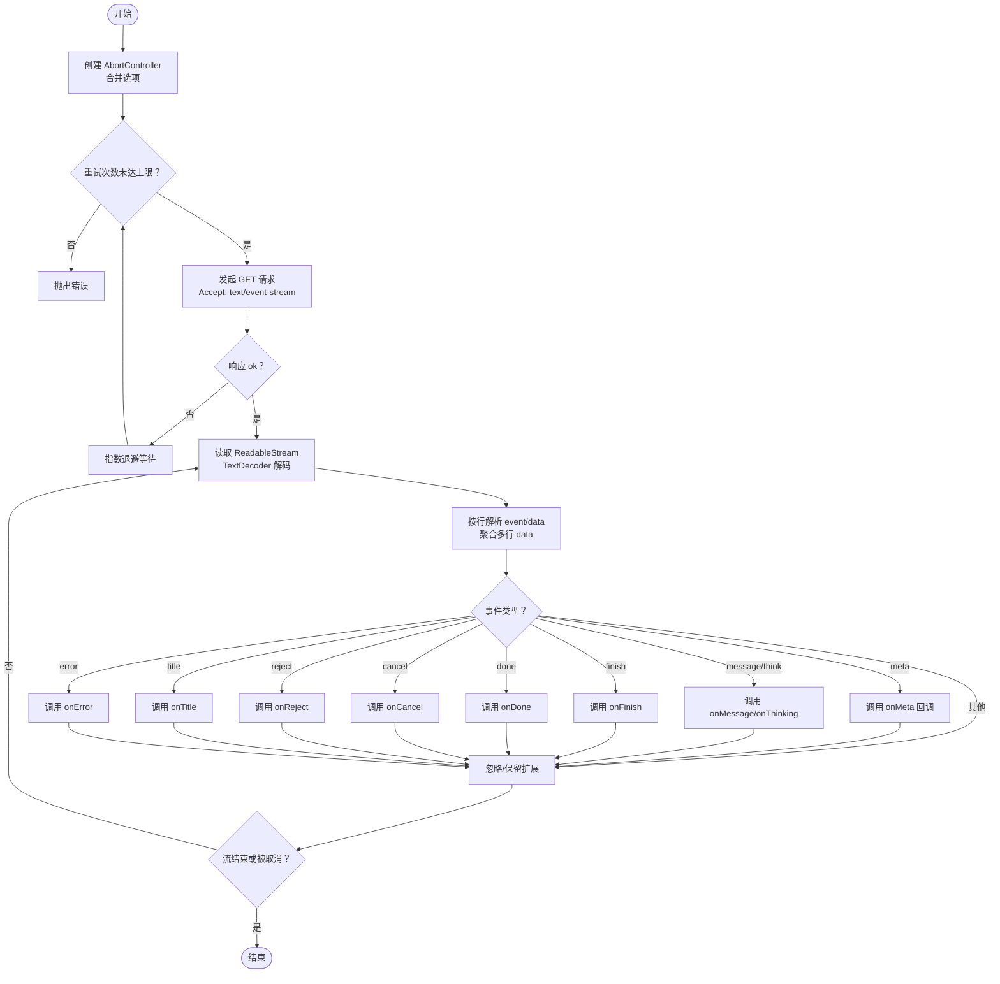

```mermaid
sequenceDiagram
participant B as "浏览器"
participant S as "聊天控制器"
participant R as "研究SSE桥接器"
B->>S : GET /rag/v3/chat?question=&conversationId=&...
S->>S : 参数校验/限流/模式选择
alt 研究模板
S->>R : dispatchResearch(runId,...)
R-->>B : SSE 事件流
else 普通聊天
S-->>B : SSE 事件流
end
B->>S : POST /rag/v3/stop?taskId=...
S-->>B : {code : 0}
```

# API接口文档

<cite>
**本文引用的文件**
- [SeahorseAuthController.java](file://seahorse-agent-adapter-web/src/main/java/com/miracle/ai/seahorse/agent/adapters/web/SeahorseAuthController.java)
- [SeahorseChatController.java](file://seahorse-agent-adapter-web/src/main/java/com/miracle/ai/seahorse/agent/adapters/web/SeahorseChatController.java)
- [SeahorseConversationController.java](file://seahorse-agent-adapter-web/src/main/java/com/miracle/ai/seahorse/agent/adapters/web/SeahorseConversationController.java)
- [SeahorseKnowledgeBaseController.java](file://seahorse-agent-adapter-web/src/main/java/com/miracle/ai/seahorse/agent/adapters/web/SeahorseKnowledgeBaseController.java)
- [SeahorseUserController.java](file://seahorse-agent-adapter-web/src/main/java/com/miracle/ai/seahorse/agent/adapters/web/SeahorseUserController.java)
- [SeahorseQuotaController.java](file://seahorse-agent-adapter-web/src/main/java/com/miracle/ai/seahorse/agent/adapters/web/SeahorseQuotaController.java)
- [ResearchSseBridge.java](file://seahorse-agent-adapter-web/src/main/java/com/miracle/ai/seahorse/agent/adapters/web/ResearchSseBridge.java)
- [SpringSseEventSender.java](file://seahorse-agent-adapter-web/src/main/java/com/miracle/ai/seahorse/agent/adapters/local/SpringSseEventSender.java)
- [SaTokenServiceAdapter.java](file://seahorse-agent-adapter-web/src/main/java/com/miracle/ai/seahorse/agent/adapters/web/SaTokenServiceAdapter.java)
- [TokenServicePort.java](file://seahorse-agent-kernel/src/main/java/com/miracle/ai/seahorse/agent/ports/outbound/auth/TokenServicePort.java)
- [backendEndpointManifest.ts](file://frontend/src/services/backendEndpointManifest.ts)
- [useStreamResponse.ts](file://frontend/src/hooks/useStreamResponse.ts)
- [authService.ts](file://frontend/src/services/authService.ts)
- [api.ts](file://frontend/src/services/api.ts)
- [SeahorseWebExceptionHandler.java](file://seahorse-agent-adapter-web/src/main/java/com/miracle/ai/seahorse/agent/adapters/web/SeahorseWebExceptionHandler.java)
- [ApiResponseContractTests.java](file://seahorse-agent-tests/src/test/java/com/miracle/ai/seahorse/agent/adapters/web/ApiResponseContractTests.java)
- [OpenApiSpecParserAdapter.java](file://seahorse-agent-adapter-openapi/src/main/java/com/miracle/ai/seahorse/agent/adapters/openapi/OpenApiSpecParserAdapter.java)
- [OpenApiSpecDocument.java](file://seahorse-agent-kernel/src/main/java/com/miracle/ai/seahorse/agent/kernel/domain/agent/connector/OpenApiSpecDocument.java)
- [openApiConnectorService.ts](file://frontend/src/services/openApiConnectorService.ts)
</cite>

## 目录
1. [简介](#简介)
2. [项目结构](#项目结构)
3. [核心组件](#核心组件)
4. [架构总览](#架构总览)
5. [详细组件分析](#详细组件分析)
6. [依赖分析](#依赖分析)
7. [性能考虑](#性能考虑)
8. [故障排除指南](#故障排除指南)
9. [结论](#结论)
10. [附录](#附录)

## 简介
本文件为Seahorse Agent的完整API接口文档，覆盖认证、知识库、聊天、会话、用户、配额与OpenAPI连接器等核心能力。文档包含：
- RESTful端点清单：HTTP方法、URL模式、请求参数、响应格式与状态码
- WebSocket与SSE接口：连接处理、事件模型与实时交互
- SDK与前端集成：Axios拦截器、状态管理与SSE解析流程
- 错误处理、安全与速率限制策略
- 版本管理与迁移指南

## 项目结构
后端以Spring MVC控制器为中心，通过入站端口对接内核服务；Web层提供统一的REST接口与安全治理、异常处理、限流与演示模式控制。

**图表来源**
- [SeahorseAuthController.java:30-55](file://seahorse-agent-adapter-web/src/main/java/com/miracle/ai/seahorse/agent/adapters/web/SeahorseAuthController.java#L30-L55)
- [SeahorseChatController.java:57-337](file://seahorse-agent-adapter-web/src/main/java/com/miracle/ai/seahorse/agent/adapters/web/SeahorseChatController.java#L57-L337)
- [SeahorseConversationController.java:40-92](file://seahorse-agent-adapter-web/src/main/java/com/miracle/ai/seahorse/agent/adapters/web/SeahorseConversationController.java#L40-L92)
- [SeahorseKnowledgeBaseController.java:44-106](file://seahorse-agent-adapter-web/src/main/java/com/miracle/ai/seahorse/agent/adapters/web/SeahorseKnowledgeBaseController.java#L44-L106)
- [SeahorseUserController.java:37-91](file://seahorse-agent-adapter-web/src/main/java/com/miracle/ai/seahorse/agent/adapters/web/SeahorseUserController.java#L37-L91)
- [SeahorseQuotaController.java:37-102](file://seahorse-agent-adapter-web/src/main/java/com/miracle/ai/seahorse/agent/adapters/web/SeahorseQuotaController.java#L37-L102)
- [backendEndpointManifest.ts:1-75](file://frontend/src/services/backendEndpointManifest.ts#L1-L75)

**章节来源**
- [SeahorseAuthController.java:30-55](file://seahorse-agent-adapter-web/src/main/java/com/miracle/ai/seahorse/agent/adapters/web/SeahorseAuthController.java#L30-L55)
- [SeahorseChatController.java:57-337](file://seahorse-agent-adapter-web/src/main/java/com/miracle/ai/seahorse/agent/adapters/web/SeahorseChatController.java#L57-L337)
- [SeahorseConversationController.java:40-92](file://seahorse-agent-adapter-web/src/main/java/com/miracle/ai/seahorse/agent/adapters/web/SeahorseConversationController.java#L40-L92)
- [SeahorseKnowledgeBaseController.java:44-106](file://seahorse-agent-adapter-web/src/main/java/com/miracle/ai/seahorse/agent/adapters/web/SeahorseKnowledgeBaseController.java#L44-L106)
- [SeahorseUserController.java:37-91](file://seahorse-agent-adapter-web/src/main/java/com/miracle/ai/seahorse/agent/adapters/web/SeahorseUserController.java#L37-L91)
- [SeahorseQuotaController.java:37-102](file://seahorse-agent-adapter-web/src/main/java/com/miracle/ai/seahorse/agent/adapters/web/SeahorseQuotaController.java#L37-L102)
- [backendEndpointManifest.ts:1-75](file://frontend/src/services/backendEndpointManifest.ts#L1-L75)

## 核心组件
- 认证控制器：提供登录、登出与当前用户查询接口
- 聊天控制器：提供流式SSE聊天、研究型任务与断点续聊
- 会话控制器：提供会话创建、列表、重命名与删除
- 知识库控制器：提供知识库的增删改查与分页
- 用户控制器：提供用户管理与密码修改
- 配额控制器：提供配额策略的增删改查与决策评估
- 异常处理器：统一错误响应格式
- SSE桥接器：研究型任务的事件推送与节流

**章节来源**
- [SeahorseAuthController.java:30-55](file://seahorse-agent-adapter-web/src/main/java/com/miracle/ai/seahorse/agent/adapters/web/SeahorseAuthController.java#L30-L55)
- [SeahorseChatController.java:57-337](file://seahorse-agent-adapter-web/src/main/java/com/miracle/ai/seahorse/agent/adapters/web/SeahorseChatController.java#L57-L337)
- [SeahorseConversationController.java:40-92](file://seahorse-agent-adapter-web/src/main/java/com/miracle/ai/seahorse/agent/adapters/web/SeahorseConversationController.java#L40-L92)
- [SeahorseKnowledgeBaseController.java:44-106](file://seahorse-agent-adapter-web/src/main/java/com/miracle/ai/seahorse/agent/adapters/web/SeahorseKnowledgeBaseController.java#L44-L106)
- [SeahorseUserController.java:37-91](file://seahorse-agent-adapter-web/src/main/java/com/miracle/ai/seahorse/agent/adapters/web/SeahorseUserController.java#L37-L91)
- [SeahorseQuotaController.java:37-102](file://seahorse-agent-adapter-web/src/main/java/com/miracle/ai/seahorse/agent/adapters/web/SeahorseQuotaController.java#L37-L102)
- [SeahorseWebExceptionHandler.java:63-92](file://seahorse-agent-adapter-web/src/main/java/com/miracle/ai/seahorse/agent/adapters/web/SeahorseWebExceptionHandler.java#L63-L92)

## 架构总览
后端控制器通过入站端口调用内核服务，统一返回标准响应体；前端通过Axios拦截器自动附加认证头与错误处理，SSE流解析器负责事件分发与看门狗超时控制。

**图表来源**
- [api.ts:13-19](file://frontend/src/services/api.ts#L13-L19)
- [SeahorseChatController.java:178-228](file://seahorse-agent-adapter-web/src/main/java/com/miracle/ai/seahorse/agent/adapters/web/SeahorseChatController.java#L178-L228)
- [SeahorseWebExceptionHandler.java:63-92](file://seahorse-agent-adapter-web/src/main/java/com/miracle/ai/seahorse/agent/adapters/web/SeahorseWebExceptionHandler.java#L63-L92)

## 详细组件分析

### 认证接口
- 登录
  - 方法与路径：POST /auth/login
  - 请求体字段：username, password
  - 成功响应：code=0，data为令牌字符串
  - 失败响应：统一错误格式
- 登出
  - 方法与路径：POST /auth/logout
  - 成功响应：code=0
- 当前用户
  - 方法与路径：GET /user/me
  - 成功响应：code=0，data为当前用户信息

**图表来源**
- [SeahorseAuthController.java:43-54](file://seahorse-agent-adapter-web/src/main/java/com/miracle/ai/seahorse/agent/adapters/web/SeahorseAuthController.java#L43-L54)
- [authService.ts:7-17](file://frontend/src/services/authService.ts#L7-L17)

**章节来源**
- [SeahorseAuthController.java:43-54](file://seahorse-agent-adapter-web/src/main/java/com/miracle/ai/seahorse/agent/adapters/web/SeahorseAuthController.java#L43-L54)
- [authService.ts:7-17](file://frontend/src/services/authService.ts#L7-L17)

### 聊天接口
- 流式聊天（SSE）
  - 方法与路径：GET /rag/v3/chat
  - 查询参数：question, conversationId, userId, deepThinking, chatMode, agentId, versionId, taskTemplateId, attachmentIds, resumeRunId, lastEventSeq
  - 成功响应：text/event-stream，事件类型包括meta、message、think、finish、done、cancel、reject、title、error等
  - 断点续聊：当resumeRunId存在时，优先恢复事件流
- 停止任务
  - 方法与路径：POST /rag/v3/stop
  - 查询参数：taskId
  - 成功响应：code=0

**图表来源**
- [SeahorseChatController.java:178-228](file://seahorse-agent-adapter-web/src/main/java/com/miracle/ai/seahorse/agent/adapters/web/SeahorseChatController.java#L178-L228)
- [ResearchSseBridge.java:110-180](file://seahorse-agent-adapter-web/src/main/java/com/miracle/ai/seahorse/agent/adapters/web/ResearchSseBridge.java#L110-L180)

**章节来源**
- [SeahorseChatController.java:178-228](file://seahorse-agent-adapter-web/src/main/java/com/miracle/ai/seahorse/agent/adapters/web/SeahorseChatController.java#L178-L228)
- [ResearchSseBridge.java:110-180](file://seahorse-agent-adapter-web/src/main/java/com/miracle/ai/seahorse/agent/adapters/web/ResearchSseBridge.java#L110-L180)

### 会话接口
- 创建会话
  - 方法与路径：POST /conversations 或 /api/conversations
  - 成功响应：code=0，data为会话ID
- 列出会话
  - 方法与路径：GET /conversations 或 /api/conversations
  - 成功响应：code=0，data为会话列表
- 重命名会话
  - 方法与路径：PUT /conversations/{conversationId} 或 /api/conversations/{conversationId}
  - 请求体：title
  - 成功响应：code=0
- 删除会话
  - 方法与路径：DELETE /conversations/{conversationId} 或 /api/conversations/{conversationId}
  - 成功响应：code=0
- 获取消息列表
  - 方法与路径：GET /conversations/{conversationId}/messages 或 /api/conversations/{conversationId}/messages
  - 成功响应：code=0，data为消息列表

**章节来源**
- [SeahorseConversationController.java:53-92](file://seahorse-agent-adapter-web/src/main/java/com/miracle/ai/seahorse/agent/adapters/web/SeahorseConversationController.java#L53-L92)

### 知识库接口
- 创建知识库
  - 方法与路径：POST /knowledge-base
  - 请求头：X-User-Id（可选）
  - 请求体：name, embeddingModel, collectionName
  - 成功响应：code=0，data为知识库ID
- 更新知识库
  - 方法与路径：PUT /knowledge-base/{kb-id}
  - 请求头：X-User-Id（可选）
  - 请求体：name, embeddingModel
  - 成功响应：code=0
- 删除知识库
  - 方法与路径：DELETE /knowledge-base/{kb-id}
  - 请求头：X-User-Id（可选）
  - 成功响应：code=0
- 查询知识库详情
  - 方法与路径：GET /knowledge-base/{kb-id}
  - 成功响应：code=0，data为知识库对象
- 分页查询知识库
  - 方法与路径：GET /knowledge-base
  - 查询参数：current, size, name
  - 成功响应：code=0，data为分页结果
- 查询分块策略
  - 方法与路径：GET /knowledge-base/chunk-strategies
  - 成功响应：code=0，data为策略列表

**章节来源**
- [SeahorseKnowledgeBaseController.java:59-101](file://seahorse-agent-adapter-web/src/main/java/com/miracle/ai/seahorse/agent/adapters/web/SeahorseKnowledgeBaseController.java#L59-L101)

### 用户接口
- 查询当前用户
  - 方法与路径：GET /user/me
  - 成功响应：code=0，data为当前用户
- 分页查询用户
  - 方法与路径：GET /users
  - 查询参数：current, size, keyword
  - 成功响应：code=0，data为分页结果
- 创建用户
  - 方法与路径：POST /users
  - 请求体：username, password, role, avatar
  - 成功响应：code=0，data为用户ID
- 更新用户
  - 方法与路径：PUT /users/{id}
  - 请求体：username, password, role, avatar
  - 成功响应：code=0
- 删除用户
  - 方法与路径：DELETE /users/{id}
  - 成功响应：code=0
- 修改密码
  - 方法与路径：PUT /user/password
  - 请求体：currentPassword, newPassword
  - 成功响应：code=0

**章节来源**
- [SeahorseUserController.java:50-90](file://seahorse-agent-adapter-web/src/main/java/com/miracle/ai/seahorse/agent/adapters/web/SeahorseUserController.java#L50-L90)

### 配额与OpenAPI连接器接口
- 配额策略
  - 新增/更新策略：POST /api/quotas/policies
  - 禁用策略：POST /api/quotas/policies/{policyId}/disable
  - 评估决策：POST /api/quotas/decisions:evaluate
- OpenAPI连接器
  - 导入规范：POST /api/connectors/openapi
  - 列表：GET /api/connectors
  - 获取操作：GET /api/connectors/{connectorId}/operations

**章节来源**
- [SeahorseQuotaController.java:62-102](file://seahorse-agent-adapter-web/src/main/java/com/miracle/ai/seahorse/agent/adapters/web/SeahorseQuotaController.java#L62-L102)
- [openApiConnectorService.ts:42-51](file://frontend/src/services/openApiConnectorService.ts#L42-L51)
- [OpenApiSpecParserAdapter.java:48-84](file://seahorse-agent-adapter-openapi/src/main/java/com/miracle/ai/seahorse/agent/adapters/openapi/OpenApiSpecParserAdapter.java#L48-L84)
- [OpenApiSpecDocument.java:22-31](file://seahorse-agent-kernel/src/main/java/com/miracle/ai/seahorse/agent/kernel/domain/agent/connector/OpenApiSpecDocument.java#L22-L31)

## 依赖分析
认证模块的依赖关系如下：

**图表来源**
- [TokenServicePort.java:20-25](file://seahorse-agent-kernel/src/main/java/com/miracle/ai/seahorse/agent/ports/outbound/auth/TokenServicePort.java#L20-L25)
- [SaTokenServiceAdapter.java:23-35](file://seahorse-agent-adapter-web/src/main/java/com/miracle/ai/seahorse/agent/adapters/web/SaTokenServiceAdapter.java#L23-L35)

**章节来源**
- [TokenServicePort.java:20-25](file://seahorse-agent-kernel/src/main/java/com/miracle/ai/seahorse/agent/ports/outbound/auth/TokenServicePort.java#L20-L25)
- [SaTokenServiceAdapter.java:23-35](file://seahorse-agent-adapter-web/src/main/java/com/miracle/ai/seahorse/agent/adapters/web/SaTokenServiceAdapter.java#L23-L35)

## 性能考虑
- SSE超时与节流
  - 服务端默认SSE超时时间可通过配置项设置；研究型任务SSE桥接器内置轮询与节流，避免过载
  - 前端SSE解析器内置看门狗定时器，超时自动取消读取
- 速率限制
  - 聊天接口对用户与模板维度进行限流，防止资源滥用
- 事件缓冲
  - 支持事件缓冲与断点续聊，提升会话连续性

**章节来源**
- [SeahorseChatController.java:131-147](file://seahorse-agent-adapter-web/src/main/java/com/miracle/ai/seahorse/agent/adapters/web/SeahorseChatController.java#L131-L147)
- [ResearchSseBridge.java:110-180](file://seahorse-agent-adapter-web/src/main/java/com/miracle/ai/seahorse/agent/adapters/web/ResearchSseBridge.java#L110-L180)
- [useStreamResponse.ts:77-117](file://frontend/src/hooks/useStreamResponse.ts#L77-L117)

## 故障排除指南
- 登录后仍提示未登录
  - 检查本地Token是否正确写入与读取；确认拦截器是否注入Authorization
- 401跳转登录但无提示
  - 确认响应拦截器是否正确识别401；检查后端返回结构与message内容
- SSE流中断
  - 检查AbortController是否提前取消；确认服务端事件格式（event/data行）；适当增加重试次数与延迟
- 网络错误提示频繁
  - 检查ERR_NETWORK场景与网络环境；在弱网下启用指数退避与提示抑制
- 代理无效
  - 确认Vite代理配置与后端实际端口一致；浏览器Network面板查看/api前缀是否被转发

**章节来源**
- [useStreamResponse.ts:77-237](file://frontend/src/hooks/useStreamResponse.ts#L77-L237)
- [api.ts:13-19](file://frontend/src/services/api.ts#L13-L19)

## 结论
本文档提供了Seahorse Agent的完整API接口说明，涵盖认证、聊天、会话、知识库、用户、配额与OpenAPI连接器等模块。通过标准响应体与SSE事件模型，系统实现了可靠的实时交互与良好的可维护性。建议在生产环境中补充缓存、并发控制与网络质量感知策略，并持续完善测试与可观测性。

## 附录

### 响应体约定与错误处理
- 统一响应体
  - 成功：{code:"0", data:任意}
  - 失败：{code:"非0", message:"错误描述"}
- 异常映射
  - 403/401/500等状态映射到统一错误响应
- 单元测试契约
  - 测试覆盖了错误码、缺失服务与空提供者等边界情况

**章节来源**
- [SeahorseWebExceptionHandler.java:63-92](file://seahorse-agent-adapter-web/src/main/java/com/miracle/ai/seahorse/agent/adapters/web/SeahorseWebExceptionHandler.java#L63-L92)
- [ApiResponseContractTests.java:59-122](file://seahorse-agent-tests/src/test/java/com/miracle/ai/seahorse/agent/adapters/web/ApiResponseContractTests.java#L59-L122)

### SSE事件模型与前端解析流程
- 事件类型
  - meta、message、think、finish、done、cancel、reject、title、error等
- 前端解析
  - 使用ReadableStream与TextDecoder解码；按行解析event/data；聚合多行data；看门狗超时与终止事件检测

**图表来源**
- [useStreamResponse.ts:77-237](file://frontend/src/hooks/useStreamResponse.ts#L77-L237)

**章节来源**
- [useStreamResponse.ts:77-237](file://frontend/src/hooks/useStreamResponse.ts#L77-L237)

### WebSocket与SSE接口说明
- SSE（Server-Sent Events）
  - 用于流式聊天与研究任务事件推送
  - 事件名称与负载格式由后端统一发出，前端按事件类型分发
- WebSocket
  - 本项目未提供WebSocket端点；如需双向实时通信，可在现有SSE基础上扩展或另行实现

**章节来源**
- [SeahorseChatController.java:178-228](file://seahorse-agent-adapter-web/src/main/java/com/miracle/ai/seahorse/agent/adapters/web/SeahorseChatController.java#L178-L228)
- [SpringSseEventSender.java:76-95](file://seahorse-agent-adapter-web/src/main/java/com/miracle/ai/seahorse/agent/adapters/local/SpringSseEventSender.java#L76-L95)

### SDK与前端集成指南
- Axios拦截器
  - 自动附加Authorization头；统一错误处理与401跳转
- 认证状态管理
  - 登录成功后持久化Token；登出清理状态
- 服务层封装
  - 将各领域接口封装为独立服务模块，便于复用与测试

**章节来源**
- [api.ts:13-19](file://frontend/src/services/api.ts#L13-L19)
- [authService.ts:7-17](file://frontend/src/services/authService.ts#L7-L17)

### API版本管理与迁移指南
- 版本策略
  - 路径中包含版本号（如/rag/v3），便于平滑演进
- 迁移建议
  - 旧版本端点停止维护后，提供迁移指引与兼容期
  - 前端端点清单可作为迁移对照表

**章节来源**
- [backendEndpointManifest.ts:1-75](file://frontend/src/services/backendEndpointManifest.ts#L1-75)