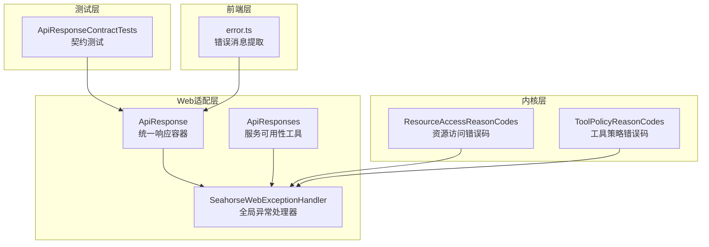
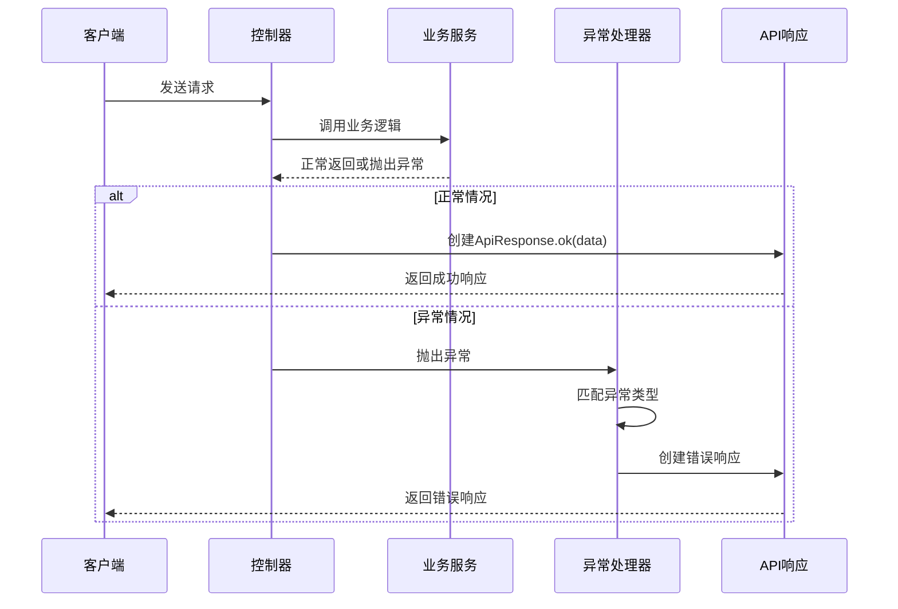
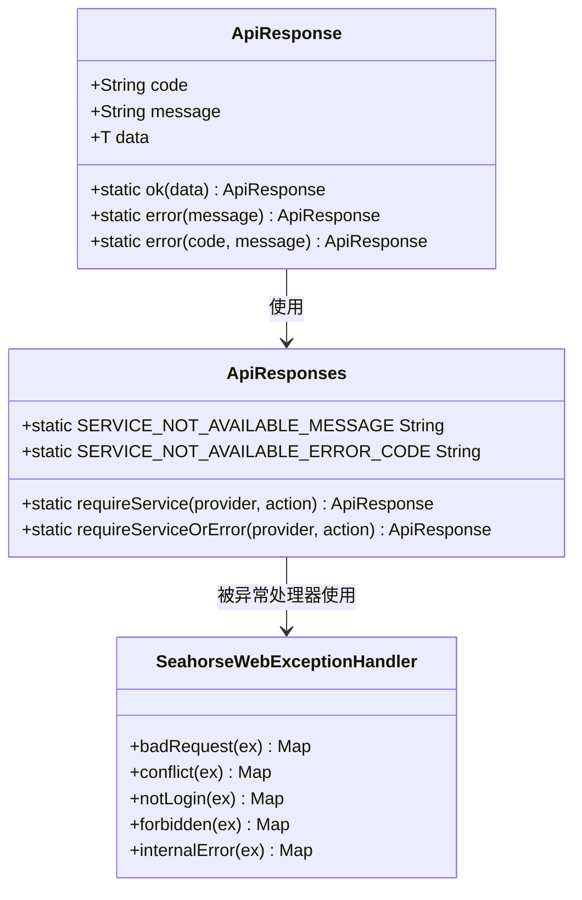
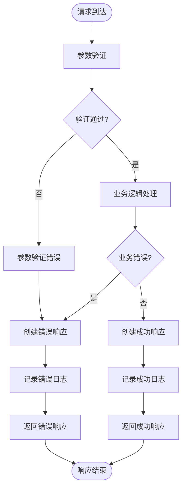
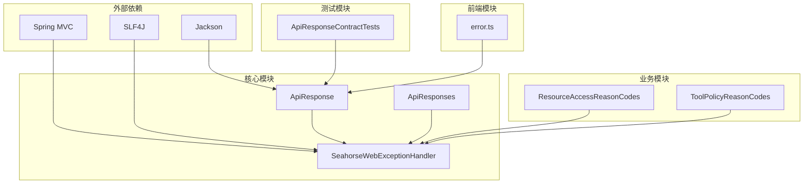

# API错误处理

<cite>
**本文档引用的文件**
- [ApiResponse.java](file://seahorse-agent-adapter-web/src/main/java/com/miracle/ai/seahorse/agent/adapters/web/ApiResponse.java)
- [ApiResponses.java](file://seahorse-agent-adapter-web/src/main/java/com/miracle/ai/seahorse/agent/adapters/web/ApiResponses.java)
- [SeahorseWebExceptionHandler.java](file://seahorse-agent-adapter-web/src/main/java/com/miracle/ai/seahorse/agent/adapters/web/SeahorseWebExceptionHandler.java)
- [ApiResponseContractTests.java](file://seahorse-agent-tests/src/test/java/com/miracle/ai/seahorse/agent/adapters/web/ApiResponseContractTests.java)
- [error.ts](file://frontend/src/utils/error.ts)
- [ResourceAccessReasonCodes.java](file://seahorse-agent-kernel/src/main/java/com/miracle/ai/seahorse/agent/kernel/domain/agent/context/ResourceAccessReasonCodes.java)
- [ToolPolicyReasonCodes.java](file://seahorse-agent-kernel/src/main/java/com/miracle/ai/seahorse/agent/kernel/domain/agent/policy/ToolPolicyReasonCodes.java)
</cite>

## 目录
1. [简介](#简介)
2. [项目结构](#项目结构)
3. [核心组件](#核心组件)
4. [架构概览](#架构概览)
5. [详细组件分析](#详细组件分析)
6. [依赖关系分析](#依赖关系分析)
7. [性能考虑](#性能考虑)
8. [故障排查指南](#故障排查指南)
9. [结论](#结论)

## 简介

Seahorse Agent API错误处理机制是一个经过精心设计的统一错误处理框架，旨在为整个系统的API调用提供一致、可预测且用户友好的错误响应。该机制通过标准化的错误响应格式、明确的错误分类和完善的异常处理策略，确保了系统的可靠性和可维护性。

该错误处理体系的核心特点包括：
- 统一的API响应格式，确保前后端交互的一致性
- 完善的异常分类和映射机制
- 国际化支持的错误消息处理
- 详细的日志记录和调试信息
- 客户端错误处理的最佳实践
- 版本兼容性和向后兼容的错误处理策略

## 项目结构

Seahorse Agent的错误处理机制主要分布在以下模块中：

**图表来源**
- [ApiResponse.java:1-51](file://seahorse-agent-adapter-web/src/main/java/com/miracle/ai/seahorse/agent/adapters/web/ApiResponse.java#L1-L51)
- [ApiResponses.java:1-78](file://seahorse-agent-adapter-web/src/main/java/com/miracle/ai/seahorse/agent/adapters/web/ApiResponses.java#L1-L78)
- [SeahorseWebExceptionHandler.java:1-93](file://seahorse-agent-adapter-web/src/main/java/com/miracle/ai/seahorse/agent/adapters/web/SeahorseWebExceptionHandler.java#L1-L93)

**章节来源**
- [ApiResponse.java:1-51](file://seahorse-agent-adapter-web/src/main/java/com/miracle/ai/seahorse/agent/adapters/web/ApiResponse.java#L1-L51)
- [ApiResponses.java:1-78](file://seahorse-agent-adapter-web/src/main/java/com/miracle/ai/seahorse/agent/adapters/web/ApiResponses.java#L1-L78)
- [SeahorseWebExceptionHandler.java:1-93](file://seahorse-agent-adapter-web/src/main/java/com/miracle/ai/seahorse/agent/adapters/web/SeahorseWebExceptionHandler.java#L1-L93)

## 核心组件

### ApiResponse统一响应容器

`ApiResponse`是整个错误处理机制的核心数据结构，它提供了一个标准化的响应格式，确保所有API调用都遵循相同的JSON结构。

**响应格式规范**：
- 成功响应：包含`code`和`data`字段，`message`字段被抑制
- 错误响应：包含`code`和`message`字段，`data`字段被抑制
- 支持泛型类型，允许返回任意类型的业务数据

**成功代码和错误代码**：
- 成功代码：`"0"`
- 错误代码：`"ERROR"` 或特定业务错误码
- 服务不可用错误码：`"1"`

**章节来源**
- [ApiResponse.java:22-51](file://seahorse-agent-adapter-web/src/main/java/com/miracle/ai/seahorse/agent/adapters/web/ApiResponse.java#L22-L51)

### ApiResponses服务可用性工具

`ApiResponses`类提供了两个核心方法来处理服务可用性检查：

**requireService方法**：
- 抛出异常形式的服务检查
- 当服务不可用时抛出`IllegalStateException`
- 保持与全局异常处理器的兼容性

**requireServiceOrError方法**：
- 返回错误响应形式的服务检查
- 当服务不可用时返回标准错误格式
- 保持历史API行为的一致性

**章节来源**
- [ApiResponses.java:24-78](file://seahorse-agent-adapter-web/src/main/java/com/miracle/ai/seahorse/agent/adapters/web/ApiResponses.java#L24-L78)

### SeahorseWebExceptionHandler全局异常处理器

`SeahorseWebExceptionHandler`是Spring MVC的全局异常处理器，负责将各种异常转换为标准的API响应格式。

**异常映射策略**：
- `IllegalArgumentException` → HTTP 400 Bad Request
- `IllegalStateException` → HTTP 409 Conflict  
- `NotLoginException` → HTTP 401 Unauthorized（特殊处理）
- `SecurityException` → HTTP 403 Forbidden
- `AdvancedFeatureDisabledException` → HTTP 403 Forbidden
- `ResponseStatusException` → 保持原始状态码
- 其他未捕获异常 → HTTP 500 Internal Server Error

**章节来源**
- [SeahorseWebExceptionHandler.java:35-93](file://seahorse-agent-adapter-web/src/main/java/com/miracle/ai/seahorse/agent/adapters/web/SeahorseWebExceptionHandler.java#L35-L93)

## 架构概览

Seahorse Agent的错误处理架构采用分层设计，从底层的异常捕获到上层的响应格式化，形成了一个完整的错误处理链路。

**图表来源**
- [SeahorseWebExceptionHandler.java:41-85](file://seahorse-agent-adapter-web/src/main/java/com/miracle/ai/seahorse/agent/adapters/web/SeahorseWebExceptionHandler.java#L41-L85)
- [ApiResponse.java:39-49](file://seahorse-agent-adapter-web/src/main/java/com/miracle/ai/seahorse/agent/adapters/web/ApiResponse.java#L39-L49)

## 详细组件分析

### 错误响应格式详解

API响应采用统一的JSON格式，确保前后端交互的一致性和可预测性。

**图表来源**
- [ApiResponse.java:34-49](file://seahorse-agent-adapter-web/src/main/java/com/miracle/ai/seahorse/agent/adapters/web/ApiResponse.java#L34-L49)
- [ApiResponses.java:44-77](file://seahorse-agent-adapter-web/src/main/java/com/miracle/ai/seahorse/agent/adapters/web/ApiResponses.java#L44-L77)
- [SeahorseWebExceptionHandler.java:36-92](file://seahorse-agent-adapter-web/src/main/java/com/miracle/ai/seahorse/agent/adapters/web/SeahorseWebExceptionHandler.java#L36-L92)

### 错误代码分类体系

系统采用分层的错误代码分类体系，确保错误的可识别性和可处理性。

**HTTP状态码映射**：
- 2xx系列：成功响应（业务逻辑层面的成功）
- 4xx系列：客户端错误（参数验证、权限不足等）
- 5xx系列：服务器内部错误（系统异常、服务不可用等）

**业务错误码前缀**：
- `"1"`：服务不可用错误
- `"AUTH_"`：认证相关错误
- `"PERMISSION_"`：权限相关错误
- `"VALIDATION_"`：参数验证错误
- `"RESOURCE_"`：资源访问错误

**章节来源**
- [SeahorseWebExceptionHandler.java:41-85](file://seahorse-agent-adapter-web/src/main/java/com/miracle/ai/seahorse/agent/adapters/web/SeahorseWebExceptionHandler.java#L41-L85)
- [ApiResponses.java:46-47](file://seahorse-agent-adapter-web/src/main/java/com/miracle/ai/seahorse/agent/adapters/web/ApiResponses.java#L46-L47)

### 异常处理流程

系统实现了完整的异常处理流程，从异常捕获到响应生成的全过程控制。

**图表来源**
- [SeahorseWebExceptionHandler.java:74-78](file://seahorse-agent-adapter-web/src/main/java/com/miracle/ai/seahorse/agent/adapters/web/SeahorseWebExceptionHandler.java#L74-L78)
- [ApiResponse.java:43-49](file://seahorse-agent-adapter-web/src/main/java/com/miracle/ai/seahorse/agent/adapters/web/ApiResponse.java#L43-L49)

### 常见错误场景处理

系统针对常见的错误场景提供了专门的处理策略：

**认证失败处理**：
- 捕获`NotLoginException`异常
- 返回HTTP 401状态码
- 提供统一的"登录已过期，请重新登录"提示

**权限不足处理**：
- 捕获`SecurityException`和`AdvancedFeatureDisabledException`
- 返回HTTP 403状态码
- 使用统一的错误响应格式

**参数验证错误处理**：
- 捕获`IllegalArgumentException`
- 返回HTTP 400状态码
- 保持原始异常消息

**章节来源**
- [SeahorseWebExceptionHandler.java:54-72](file://seahorse-agent-adapter-web/src/main/java/com/miracle/ai/seahorse/agent/adapters/web/SeahorseWebExceptionHandler.java#L54-L72)

## 依赖关系分析

Seahorse Agent错误处理机制的依赖关系体现了清晰的分层架构设计。

**图表来源**
- [SeahorseWebExceptionHandler.java:20-31](file://seahorse-agent-adapter-web/src/main/java/com/miracle/ai/seahorse/agent/adapters/web/SeahorseWebExceptionHandler.java#L20-L31)
- [ApiResponse.java:20-34](file://seahorse-agent-adapter-web/src/main/java/com/miracle/ai/seahorse/agent/adapters/web/ApiResponse.java#L20-L34)

**章节来源**
- [SeahorseWebExceptionHandler.java:1-93](file://seahorse-agent-adapter-web/src/main/java/com/miracle/ai/seahorse/agent/adapters/web/SeahorseWebExceptionHandler.java#L1-L93)
- [ApiResponse.java:1-51](file://seahorse-agent-adapter-web/src/main/java/com/miracle/ai/seahorse/agent/adapters/web/ApiResponse.java#L1-L51)

## 性能考虑

错误处理机制在保证功能完整性的同时，也充分考虑了性能影响：

**序列化优化**：
- 使用`@JsonInclude.Include.NON_NULL`避免不必要的字段序列化
- 成功响应不包含`message`字段，减少响应体积
- 错误响应不包含`data`字段，保持响应简洁

**异常处理开销**：
- 全局异常处理器避免了控制器中的重复错误处理代码
- 减少了异常传播的栈跟踪开销
- 统一的日志记录策略提高了调试效率

**内存管理**：
- 错误响应对象生命周期短，便于垃圾回收
- 避免了大对象的频繁创建和销毁

## 故障排查指南

### 常见问题诊断

**问题1：API响应格式不符合预期**
- 检查是否正确使用了`ApiResponse.ok()`和`ApiResponse.error()`
- 验证`@JsonInclude.Include.NON_NULL`注解是否生效
- 确认测试用例是否覆盖了响应格式契约

**问题2：异常未被捕获或处理不当**
- 检查异常处理器是否正确配置
- 验证异常类型映射是否完整
- 确认日志记录是否正常工作

**问题3：错误消息显示不正确**
- 检查国际化配置是否正确
- 验证前端错误消息提取逻辑
- 确认异常消息是否被正确传递

### 调试技巧

**启用详细日志**：
- 在开发环境中启用DEBUG级别日志
- 关注异常处理器的日志输出
- 检查请求ID和上下文信息

**使用测试工具**：
- 利用契约测试验证响应格式
- 通过单元测试覆盖各种异常场景
- 使用集成测试验证端到端流程

**章节来源**
- [ApiResponseContractTests.java:30-92](file://seahorse-agent-tests/src/test/java/com/miracle/ai/seahorse/agent/adapters/web/ApiResponseContractTests.java#L30-L92)
- [error.ts:1-12](file://frontend/src/utils/error.ts#L1-L12)

## 结论

Seahorse Agent的API错误处理机制通过标准化的响应格式、完善的异常分类和高效的异常处理流程，为整个系统的API调用提供了可靠的错误处理保障。该机制不仅确保了前后端交互的一致性和可预测性，还为系统的可维护性和可扩展性奠定了坚实的基础。

通过分层的设计架构和清晰的依赖关系，该错误处理体系能够有效应对各种异常情况，同时保持较低的性能开销。配合完善的测试策略和故障排查指南，开发者可以快速定位和解决API调用中的各种问题。

未来可以在现有基础上进一步增强国际化支持、完善监控指标和优化性能表现，以适应更复杂的业务场景和更高的性能要求。