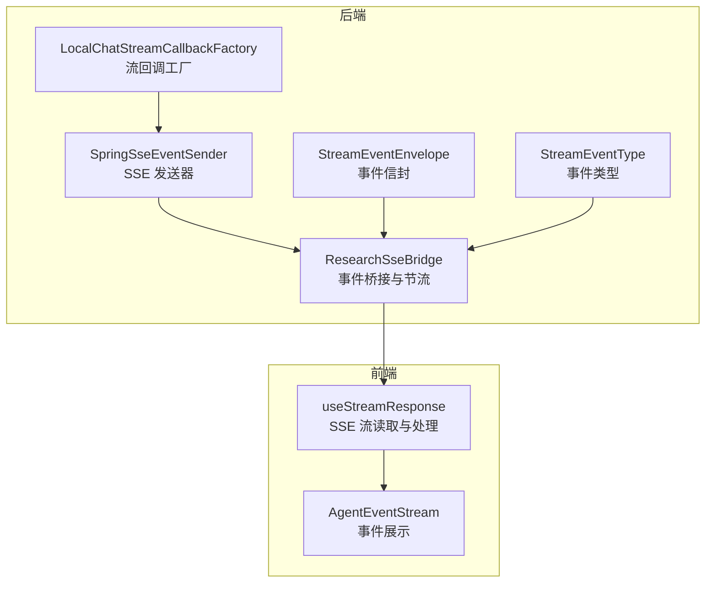
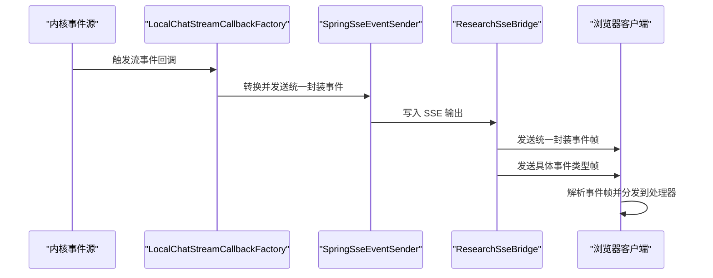
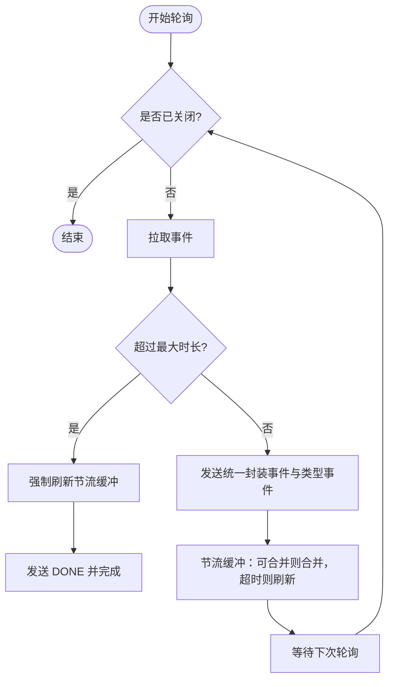
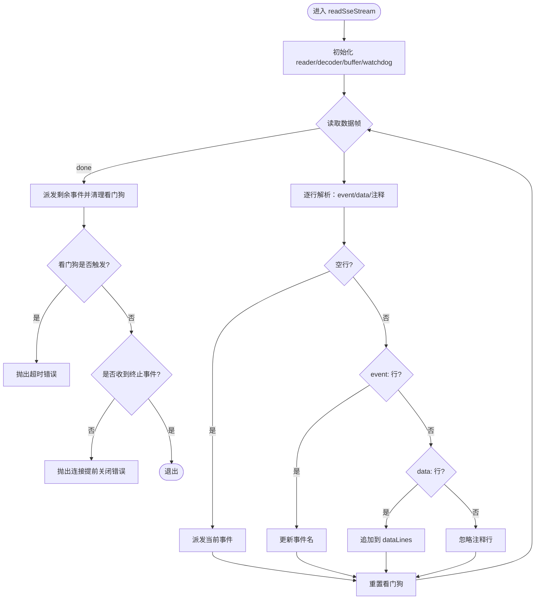
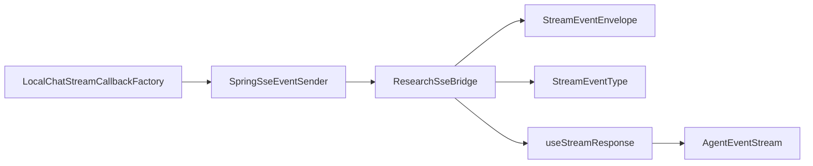

# WebSocket/SSE接口

<cite>
**本文引用的文件**
- [ResearchSseBridge.java](file://seahorse-agent-adapter-web/src/main/java/com/miracle/ai/seahorse/agent/adapters/web/ResearchSseBridge.java)
- [SpringSseEventSender.java](file://seahorse-agent-adapter-web/src/main/java/com/miracle/ai/seahorse/agent/adapters/local/SpringSseEventSender.java)
- [LocalChatStreamCallbackFactory.java](file://seahorse-agent-adapter-web/src/main/java/com/miracle/ai/seahorse/agent/adapters/local/LocalChatStreamCallbackFactory.java)
- [StreamEventEnvelope.java](file://seahorse-agent-kernel/src/main/java/com/miracle/ai/seahorse/agent/kernel/domain/stream/StreamEventEnvelope.java)
- [StreamEventType.java](file://seahorse-agent-kernel/src/main/java/com/miracle/ai/seahorse/agent/kernel/domain/stream/StreamEventType.java)
- [useStreamResponse.ts](file://frontend/src/hooks/useStreamResponse.ts)
- [AgentEventStream.tsx](file://frontend/src/pages/admin/agent-inspector/components/AgentEventStream.tsx)
- [ResearchSseBridgeThrottlingTests.java](file://seahorse-agent-adapter-web/src/test/java/com/miracle/ai/seahorse/agent/adapters/web/ResearchSseBridgeThrottlingTests.java)
</cite>

## 目录
1. [简介](#简介)
2. [项目结构](#项目结构)
3. [核心组件](#核心组件)
4. [架构总览](#架构总览)
5. [详细组件分析](#详细组件分析)
6. [依赖关系分析](#依赖关系分析)
7. [性能考量](#性能考量)
8. [故障排查指南](#故障排查指南)
9. [结论](#结论)
10. [附录](#附录)

## 简介
本文件为 Seahorse Agent 的实时通信协议文档，聚焦于基于 Spring Web MVC 的服务器推送事件（Server-Sent Events, SSE）与 WebSocket 的实现与使用。内容涵盖：
- 连接建立与生命周期管理
- 消息格式与事件类型
- 流式响应的数据帧格式与事件分发机制
- 客户端处理流程与去重策略
- 心跳检测、断线重连与错误恢复策略
- SSE 服务器推送事件的实现与客户端订阅管理
- 实时数据传输的安全考虑与性能优化建议

## 项目结构
围绕实时通信的关键模块分布如下：
- 后端适配层（SSE桥接与事件发送）
  - ResearchSseBridge：负责将内部流事件桥接到 SseEmitter，并进行节流合并与生命周期控制
  - SpringSseEventSender：封装 SseEmitter 的发送逻辑，支持错误与完成事件
  - LocalChatStreamCallbackFactory：将内部流回调转换为 SSE 事件并发送
- 核心领域模型（事件载体与类型）
  - StreamEventEnvelope：事件信封，承载事件序列、类型、运行标识等元信息
  - StreamEventType：事件类型枚举，定义所有可用事件名
- 前端钩子与组件
  - useStreamResponse：SSE 流读取、看门狗超时、事件分发与去重
  - AgentEventStream：事件展示组件，用于调试与可观测性

**图表来源**
- [ResearchSseBridge.java:110-216](file://seahorse-agent-adapter-web/src/main/java/com/miracle/ai/seahorse/agent/adapters/web/ResearchSseBridge.java#L110-L216)
- [SpringSseEventSender.java:70-95](file://seahorse-agent-adapter-web/src/main/java/com/miracle/ai/seahorse/agent/adapters/local/SpringSseEventSender.java#L70-L95)
- [LocalChatStreamCallbackFactory.java:251-271](file://seahorse-agent-adapter-web/src/main/java/com/miracle/ai/seahorse/agent/adapters/local/LocalChatStreamCallbackFactory.java#L251-L271)
- [StreamEventEnvelope.java:35-50](file://seahorse-agent-kernel/src/main/java/com/miracle/ai/seahorse/agent/kernel/domain/stream/StreamEventEnvelope.java#L35-L50)
- [StreamEventType.java](file://seahorse-agent-kernel/src/main/java/com/miracle/ai/seahorse/agent/kernel/domain/stream/StreamEventType.java)
- [useStreamResponse.ts:77-237](file://frontend/src/hooks/useStreamResponse.ts#L77-L237)
- [AgentEventStream.tsx:1-44](file://frontend/src/pages/admin/agent-inspector/components/AgentEventStream.tsx#L1-L44)

**章节来源**
- [ResearchSseBridge.java:110-216](file://seahorse-agent-adapter-web/src/main/java/com/miracle/ai/seahorse/agent/adapters/web/ResearchSseBridge.java#L110-L216)
- [SpringSseEventSender.java:70-95](file://seahorse-agent-adapter-web/src/main/java/com/miracle/ai/seahorse/agent/adapters/local/SpringSseEventSender.java#L70-L95)
- [LocalChatStreamCallbackFactory.java:251-271](file://seahorse-agent-adapter-web/src/main/java/com/miracle/ai/seahorse/agent/adapters/local/LocalChatStreamCallbackFactory.java#L251-L271)
- [StreamEventEnvelope.java:35-50](file://seahorse-agent-kernel/src/main/java/com/miracle/ai/seahorse/agent/kernel/domain/stream/StreamEventEnvelope.java#L35-L50)
- [StreamEventType.java](file://seahorse-agent-kernel/src/main/java/com/miracle/ai/seahorse/agent/kernel/domain/stream/StreamEventType.java)
- [useStreamResponse.ts:77-237](file://frontend/src/hooks/useStreamResponse.ts#L77-L237)
- [AgentEventStream.tsx:1-44](file://frontend/src/pages/admin/agent-inspector/components/AgentEventStream.tsx#L1-L44)

## 核心组件
- 事件信封（StreamEventEnvelope）
  - 字段：事件ID、事件序号、事件类型、运行ID、步骤ID、时间戳、负载
  - 用途：统一承载所有实时事件，便于前端按类型消费与去重
- 事件类型（StreamEventType）
  - 包含消息、工具调用、源发现、制品、审批、配额、内存等事件类型
  - 通过 value() 返回标准化事件名，确保前后端一致
- SSE 桥接器（ResearchSseBridge）
  - 将内部事件轮询到 SseEmitter，发送双事件：统一封装事件与具体类型事件
  - 支持节流合并（ThrottledEventSender），优先合并内容类事件，保证吞吐与体验
  - 生命周期：启动、轮询、超时、完成、取消
- SSE 发送器（SpringSseEventSender）
  - 统一封装 SseEmitter 的发送与错误处理，支持自定义事件名与负载
- 流回调工厂（LocalChatStreamCallbackFactory）
  - 将内部流回调转换为 SSE 事件，包括统一封装事件与内容事件
- 前端钩子（useStreamResponse）
  - 解析 SSE 文本帧，按行解析 event/data，组装 typed 事件
  - 提供看门狗超时、终止事件检测、重复事件去重、错误构建

**章节来源**
- [StreamEventEnvelope.java:35-50](file://seahorse-agent-kernel/src/main/java/com/miracle/ai/seahorse/agent/kernel/domain/stream/StreamEventEnvelope.java#L35-L50)
- [StreamEventType.java](file://seahorse-agent-kernel/src/main/java/com/miracle/ai/seahorse/agent/kernel/domain/stream/StreamEventType.java)
- [ResearchSseBridge.java:145-162](file://seahorse-agent-adapter-web/src/main/java/com/miracle/ai/seahorse/agent/adapters/web/ResearchSseBridge.java#L145-L162)
- [SpringSseEventSender.java:76-94](file://seahorse-agent-adapter-web/src/main/java/com/miracle/ai/seahorse/agent/adapters/local/SpringSseEventSender.java#L76-L94)
- [LocalChatStreamCallbackFactory.java:251-271](file://seahorse-agent-adapter-web/src/main/java/com/miracle/ai/seahorse/agent/adapters/local/LocalChatStreamCallbackFactory.java#L251-L271)
- [useStreamResponse.ts:77-237](file://frontend/src/hooks/useStreamResponse.ts#L77-L237)

## 架构总览
下图展示了从内核事件到前端可视化的完整链路，以及 SSE 的发送与接收流程。

**图表来源**
- [LocalChatStreamCallbackFactory.java:251-271](file://seahorse-agent-adapter-web/src/main/java/com/miracle/ai/seahorse/agent/adapters/local/LocalChatStreamCallbackFactory.java#L251-L271)
- [SpringSseEventSender.java:76-94](file://seahorse-agent-adapter-web/src/main/java/com/miracle/ai/seahorse/agent/adapters/local/SpringSseEventSender.java#L76-L94)
- [ResearchSseBridge.java:145-148](file://seahorse-agent-adapter-web/src/main/java/com/miracle/ai/seahorse/agent/adapters/web/ResearchSseBridge.java#L145-L148)
- [useStreamResponse.ts:77-237](file://frontend/src/hooks/useStreamResponse.ts#L77-L237)

## 详细组件分析

### SSE 事件桥接与节流（ResearchSseBridge）
- 双事件发送：先发送统一封装事件（STREAM_EVENT_NAME），再发送具体事件类型事件，便于前端同时获得“信封+负载”的完整信息与“类型化负载”
- 节流合并：ThrottledEventSender 对内容类事件进行合并与延迟刷新，避免高频小包导致的带宽浪费与前端渲染压力
- 生命周期控制：onCompletion/onTimeout/onError 注册清理逻辑；定时轮询检查最大时长与异常，确保资源释放
- 完成与错误：发送 DONE 事件后完成 SSE 连接；异常时发送 error 事件与 DONE

**图表来源**
- [ResearchSseBridge.java:110-131](file://seahorse-agent-adapter-web/src/main/java/com/miracle/ai/seahorse/agent/adapters/web/ResearchSseBridge.java#L110-L131)
- [ResearchSseBridge.java:145-162](file://seahorse-agent-adapter-web/src/main/java/com/miracle/ai/seahorse/agent/adapters/web/ResearchSseBridge.java#L145-L162)
- [ResearchSseBridge.java:194-250](file://seahorse-agent-adapter-web/src/main/java/com/miracle/ai/seahorse/agent/adapters/web/ResearchSseBridge.java#L194-L250)

**章节来源**
- [ResearchSseBridge.java:110-216](file://seahorse-agent-adapter-web/src/main/java/com/miracle/ai/seahorse/agent/adapters/web/ResearchSseBridge.java#L110-L216)
- [ResearchSseBridge.java:194-250](file://seahorse-agent-adapter-web/src/main/java/com/miracle/ai/seahorse/agent/adapters/web/ResearchSseBridge.java#L194-L250)

### SSE 发送器（SpringSseEventSender）
- 支持按事件名发送数据，若事件名为 null 则直接发送原始负载
- 错误处理：发送 error 事件与 DONE，确保客户端能感知异常并终止

**章节来源**
- [SpringSseEventSender.java:76-94](file://seahorse-agent-adapter-web/src/main/java/com/miracle/ai/seahorse/agent/adapters/local/SpringSseEventSender.java#L76-L94)

### 流回调工厂（LocalChatStreamCallbackFactory）
- 将统一封装事件与内容事件分别发送，便于前端区分处理
- 事件名解析：根据事件名映射到 StreamEventType，确保类型一致性

**章节来源**
- [LocalChatStreamCallbackFactory.java:251-271](file://seahorse-agent-adapter-web/src/main/java/com/miracle/ai/seahorse/agent/adapters/local/LocalChatStreamCallbackFactory.java#L251-L271)

### 事件信封与类型（StreamEventEnvelope / StreamEventType）
- 事件信封：包含事件ID、序号、类型、运行ID、步骤ID、时间戳与负载
- 事件类型：标准化事件名，前端与后端一致

**章节来源**
- [StreamEventEnvelope.java:35-50](file://seahorse-agent-kernel/src/main/java/com/miracle/ai/seahorse/agent/kernel/domain/stream/StreamEventEnvelope.java#L35-L50)
- [StreamEventType.java](file://seahorse-agent-kernel/src/main/java/com/miracle/ai/seahorse/agent/kernel/domain/stream/StreamEventType.java)

### 前端 SSE 处理（useStreamResponse）
- 文本帧解析：按行解析 event/data，忽略注释行（以冒号开头）
- 事件分发：将统一封装事件与类型事件分别派发给处理器
- 去重机制：当收到统一封装事件时，记录当前事件名与负载键，后续同名同负载事件将被去重
- 看门狗超时：每收到一次数据重置计时器，超时则取消读取并抛出错误
- 终止事件：检测 DONE 事件，确保流正常结束

**图表来源**
- [useStreamResponse.ts:77-237](file://frontend/src/hooks/useStreamResponse.ts#L77-L237)

**章节来源**
- [useStreamResponse.ts:77-237](file://frontend/src/hooks/useStreamResponse.ts#L77-L237)

### 事件展示组件（AgentEventStream）
- 展示事件列表，包含事件序号、类型、时间戳与负载复制功能
- 用于调试与可观测性，便于定位事件流转问题

**章节来源**
- [AgentEventStream.tsx:1-44](file://frontend/src/pages/admin/agent-inspector/components/AgentEventStream.tsx#L1-L44)

## 依赖关系分析
- 后端耦合关系
  - LocalChatStreamCallbackFactory 依赖 SpringSseEventSender 进行实际发送
  - ResearchSseBridge 依赖 StreamEventEnvelope 与 StreamEventType 进行事件封装与命名
  - SSE 生命周期由 SseEmitter 的回调驱动，桥接器负责轮询与清理
- 前端依赖关系
  - useStreamResponse 依赖 SSE 文本帧规范解析事件
  - AgentEventStream 依赖 StreamEventEnvelope 结构进行展示

**图表来源**
- [LocalChatStreamCallbackFactory.java:251-271](file://seahorse-agent-adapter-web/src/main/java/com/miracle/ai/seahorse/agent/adapters/local/LocalChatStreamCallbackFactory.java#L251-L271)
- [SpringSseEventSender.java:76-94](file://seahorse-agent-adapter-web/src/main/java/com/miracle/ai/seahorse/agent/adapters/local/SpringSseEventSender.java#L76-L94)
- [ResearchSseBridge.java:145-162](file://seahorse-agent-adapter-web/src/main/java/com/miracle/ai/seahorse/agent/adapters/web/ResearchSseBridge.java#L145-L162)
- [StreamEventEnvelope.java:35-50](file://seahorse-agent-kernel/src/main/java/com/miracle/ai/seahorse/agent/kernel/domain/stream/StreamEventEnvelope.java#L35-L50)
- [StreamEventType.java](file://seahorse-agent-kernel/src/main/java/com/miracle/ai/seahorse/agent/kernel/domain/stream/StreamEventType.java)
- [useStreamResponse.ts:77-237](file://frontend/src/hooks/useStreamResponse.ts#L77-L237)
- [AgentEventStream.tsx:1-44](file://frontend/src/pages/admin/agent-inspector/components/AgentEventStream.tsx#L1-L44)

**章节来源**
- [ResearchSseBridge.java:110-216](file://seahorse-agent-adapter-web/src/main/java/com/miracle/ai/seahorse/agent/adapters/web/ResearchSseBridge.java#L110-L216)
- [SpringSseEventSender.java:76-94](file://seahorse-agent-adapter-web/src/main/java/com/miracle/ai/seahorse/agent/adapters/local/SpringSseEventSender.java#L76-L94)
- [LocalChatStreamCallbackFactory.java:251-271](file://seahorse-agent-adapter-web/src/main/java/com/miracle/ai/seahorse/agent/adapters/local/LocalChatStreamCallbackFactory.java#L251-L271)
- [StreamEventEnvelope.java:35-50](file://seahorse-agent-kernel/src/main/java/com/miracle/ai/seahorse/agent/kernel/domain/stream/StreamEventEnvelope.java#L35-L50)
- [StreamEventType.java](file://seahorse-agent-kernel/src/main/java/com/miracle/ai/seahorse/agent/kernel/domain/stream/StreamEventType.java)
- [useStreamResponse.ts:77-237](file://frontend/src/hooks/useStreamResponse.ts#L77-L237)
- [AgentEventStream.tsx:1-44](file://frontend/src/pages/admin/agent-inspector/components/AgentEventStream.tsx#L1-L44)

## 性能考量
- 节流与合并
  - 内容类事件（如消息、制品内容）采用节流合并，减少帧数量与前端渲染开销
  - 超时刷新策略确保即使低频内容也能及时送达
- 轮询间隔与最大时长
  - 合理设置轮询间隔与最大时长，平衡实时性与资源占用
- 前端看门狗
  - 通过看门狗超时避免长时间无响应的无效连接
- 带宽与压缩
  - 在网关或代理层启用压缩（如 gzip）可显著降低传输体积
- 连接池与并发
  - 控制 SSE 连接数与后台线程池大小，避免过载

**章节来源**
- [ResearchSseBridge.java:194-250](file://seahorse-agent-adapter-web/src/main/java/com/miracle/ai/seahorse/agent/adapters/web/ResearchSseBridge.java#L194-L250)
- [useStreamResponse.ts:90-111](file://frontend/src/hooks/useStreamResponse.ts#L90-L111)

## 故障排查指南
- 常见错误与恢复
  - SSE 请求失败：前端构建 HTTP 错误信息，后端发送 error 事件与 DONE，前端检测 DONE 后停止重试
  - 连接超时：前端看门狗触发，抛出超时错误；后端桥接器检测到异常或超时后取消轮询并完成连接
  - 连接提前关闭：在未收到终止事件的情况下连接关闭，前端抛出错误
  - 重复事件：前端对统一封装事件与类型事件进行去重，避免重复渲染
- 断线重连策略
  - 前端在检测到 DONE 或错误后，可根据业务需要进行指数退避重连
  - 后端在异常时主动发送 error 与 DONE，确保客户端能感知并停止等待
- 调试与可观测性
  - 使用 AgentEventStream 查看事件序列、类型与时间戳，辅助定位问题
  - 关注 ThrottledEventSender 的合并行为，确认是否存在过度延迟

**章节来源**
- [useStreamResponse.ts:232-237](file://frontend/src/hooks/useStreamResponse.ts#L232-L237)
- [ResearchSseBridge.java:150-173](file://seahorse-agent-adapter-web/src/main/java/com/miracle/ai/seahorse/agent/adapters/web/ResearchSseBridge.java#L150-L173)
- [AgentEventStream.tsx:1-44](file://frontend/src/pages/admin/agent-inspector/components/AgentEventStream.tsx#L1-L44)

## 结论
本文档梳理了 Seahorse Agent 的 SSE 实时通信协议，明确了事件信封与类型、桥接与发送机制、前端解析与去重策略，以及生命周期与错误恢复流程。通过节流合并与看门狗超时等机制，系统在保证实时性的同时兼顾性能与稳定性。建议在生产环境中结合带宽与并发策略进行调优，并配合前端可视化组件进行持续观测。

## 附录
- 事件类型清单（节选）
  - 消息、工具调用、源发现、制品、审批、配额、内存等
- 前端事件处理要点
  - 严格遵循 SSE 文本帧规范，正确解析 event/data
  - 使用看门狗与 DONE 事件保障连接健康
  - 通过统一封装事件与类型事件实现解耦与去重

**章节来源**
- [StreamEventType.java](file://seahorse-agent-kernel/src/main/java/com/miracle/ai/seahorse/agent/kernel/domain/stream/StreamEventType.java)
- [ResearchSseBridgeThrottlingTests.java:1-34](file://seahorse-agent-adapter-web/src/test/java/com/miracle/ai/seahorse/agent/adapters/web/ResearchSseBridgeThrottlingTests.java#L1-L34)