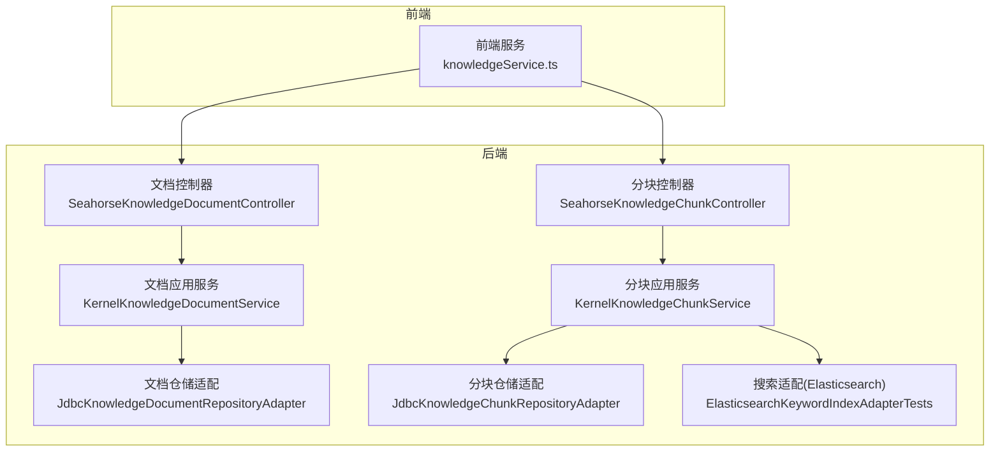
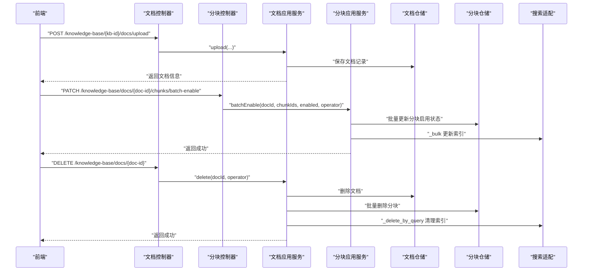
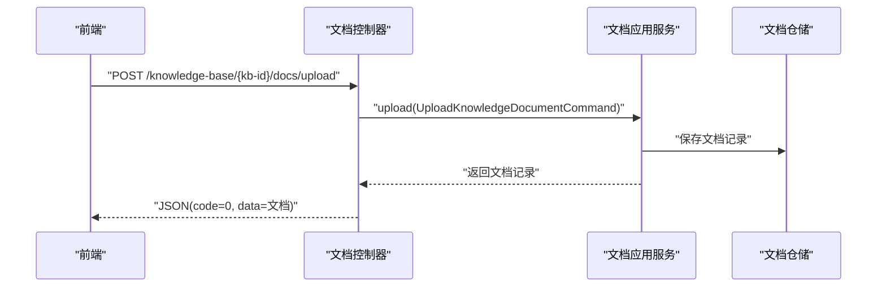
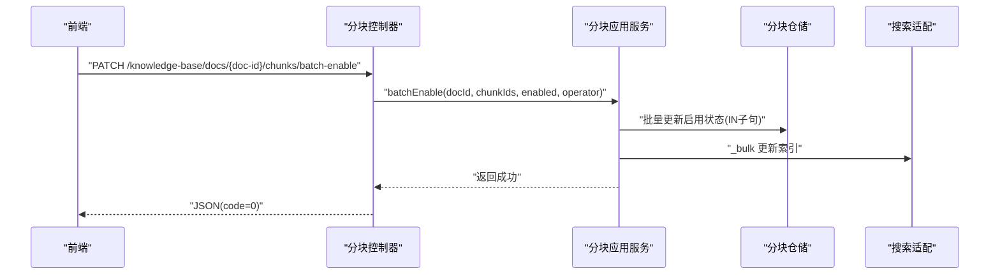
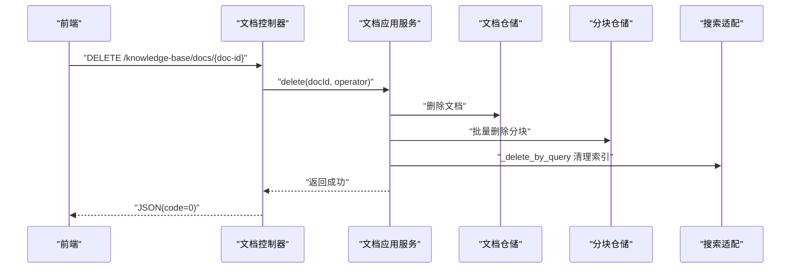
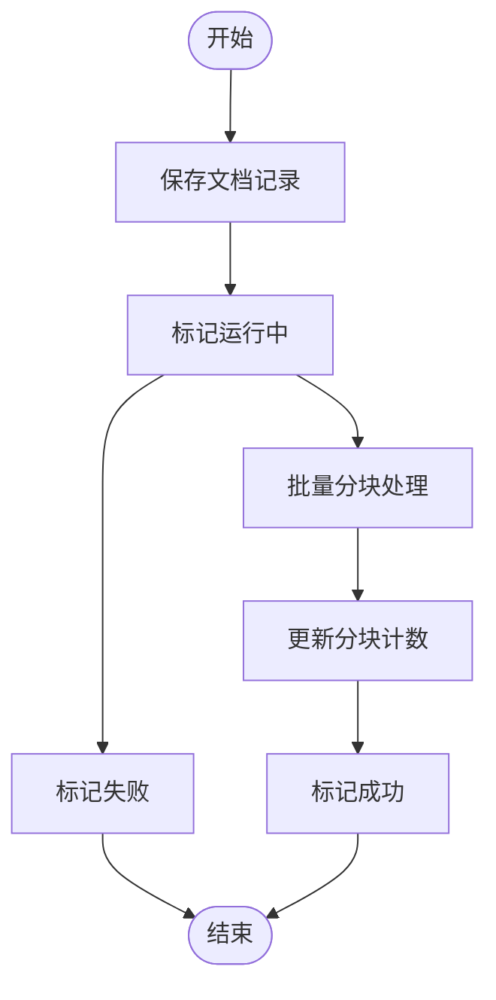
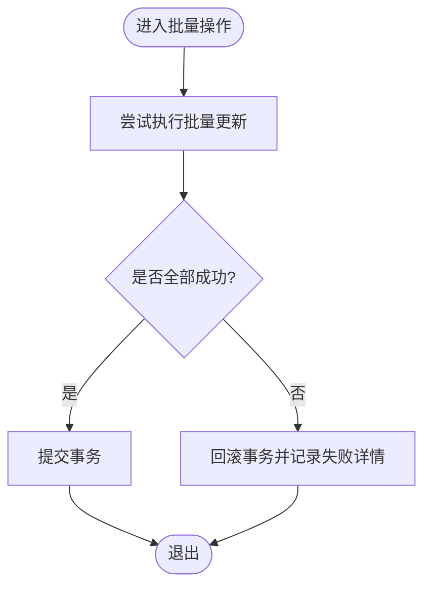
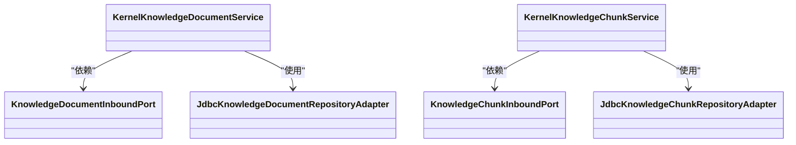

# 批量操作

<cite>
**本文引用的文件**
- [SeahorseKnowledgeDocumentController.java](file://seahorse-agent-adapter-web/src/main/java/com/miracle/ai/seahorse/agent/adapters/web/SeahorseKnowledgeDocumentController.java)
- [SeahorseKnowledgeChunkController.java](file://seahorse-agent-adapter-web/src/main/java/com/miracle/ai/seahorse/agent/adapters/web/SeahorseKnowledgeChunkController.java)
- [KernelKnowledgeDocumentService.java](file://seahorse-agent-kernel/src/main/java/com/miracle/ai/seahorse/agent/kernel/application/knowledge/KernelKnowledgeDocumentService.java)
- [KernelKnowledgeChunkService.java](file://seahorse-agent-kernel/src/main/java/com/miracle/ai/seahorse/agent/kernel/application/knowledge/KernelKnowledgeChunkService.java)
- [KnowledgeDocumentInboundPort.java](file://seahorse-agent-kernel/src/main/java/com/miracle/ai/seahorse/agent/ports/inbound/knowledge/KnowledgeDocumentInboundPort.java)
- [KnowledgeChunkInboundPort.java](file://seahorse-agent-kernel/src/main/java/com/miracle/ai/seahorse/agent/ports/inbound/knowledge/KnowledgeChunkInboundPort.java)
- [JdbcKnowledgeDocumentRepositoryAdapter.java](file://seahorse-agent-adapter-repository-jdbc/src/main/java/com/miracle/ai/seahorse/agent/adapters/repository/jdbc/JdbcKnowledgeDocumentRepositoryAdapter.java)
- [JdbcKnowledgeChunkRepositoryAdapter.java](file://seahorse-agent-adapter-repository-jdbc/src/main/java/com/miracle/ai/seahorse/agent/adapters/repository/jdbc/JdbcKnowledgeChunkRepositoryAdapter.java)
- [ElasticsearchKeywordIndexAdapterTests.java](file://seahorse-agent-adapter-search-elasticsearch/src/test/java/com/miracle/ai/seahorse/agent/adapters/search/elasticsearch/ElasticsearchKeywordIndexAdapterTests.java)
- [SeahorseKnowledgeChunkControllerTests.java](file://seahorse-agent-adapter-web/src/test/java/com/miracle/ai/seahorse/agent/adapters/web/SeahorseKnowledgeChunkControllerTests.java)
- [MemoryOutboxRelayService.java](file://seahorse-agent-kernel/src/main/java/com/miracle/ai/seahorse/agent/kernel/application/memory/MemoryOutboxRelayService.java)
- [KernelMetadataBackfillService.java](file://seahorse-agent-kernel/src/main/java/com/miracle\ai\seahorse\agent/kernel\application\metadata\KernelMetadataBackfillService.java)
- [JdbcMetadataBackfillSupport.java](file://seahorse-agent-adapter-repository-jdbc/src/main/java/com/miracle\ai\seahorse\agent/adapters/repository\jdbc\JdbcMetadataBackfillSupport.java)
- [knowledgeService.ts](file://frontend/src/services/knowledgeService.ts)
</cite>

## 目录
1. [简介](#简介)
2. [项目结构](#项目结构)
3. [核心组件](#核心组件)
4. [架构总览](#架构总览)
5. [详细组件分析](#详细组件分析)
6. [依赖关系分析](#依赖关系分析)
7. [性能考量](#性能考量)
8. [故障排查指南](#故障排查指南)
9. [结论](#结论)
10. [附录](#附录)

## 简介
本章节面向知识库批量操作能力，系统化梳理批量文档上传、批量分块启用/禁用、批量删除等接口的定义、调用流程、事务性保证、错误处理与进度跟踪机制，并给出性能优化、资源限制与并发控制建议，以及最佳实践、错误恢复策略与监控告警要点。同时对比批量操作与单个操作的差异与注意事项，帮助读者在生产环境中安全、高效地使用批量能力。

## 项目结构
围绕知识库的批量操作，主要涉及以下层次：
- 控制器层：对外暴露REST接口，解析请求参数并调用应用服务
- 应用服务层：编排业务逻辑，协调仓储与下游组件
- 仓储适配层：持久化与批量写入（如SQL批量更新）
- 搜索适配层：索引层面的批量写入/删除（如Elasticsearch _bulk）
- 前端服务：封装HTTP调用，支持多部分表单上传

**图表来源**
- [SeahorseKnowledgeDocumentController.java:65-98](file://seahorse-agent-adapter-web/src/main/java/com/miracle/ai/seahorse/agent/adapters/web/SeahorseKnowledgeDocumentController.java#L65-L98)
- [SeahorseKnowledgeChunkController.java:102-166](file://seahorse-agent-adapter-web/src/main/java/com/miracle/ai/seahorse/agent/adapters/web/SeahorseKnowledgeChunkController.java#L102-L166)
- [KernelKnowledgeDocumentService.java](file://seahorse-agent-kernel/src/main/java/com/miracle/ai/seahorse/agent/kernel/application/knowledge/KernelKnowledgeDocumentService.java)
- [KernelKnowledgeChunkService.java](file://seahorse-agent-kernel/src/main/java/com/miracle/ai/seahorse/agent/kernel/application/knowledge/KernelKnowledgeChunkService.java)
- [JdbcKnowledgeDocumentRepositoryAdapter.java:141-176](file://seahorse-agent-adapter-repository-jdbc/src/main/java/com/miracle/ai/seahorse/agent/adapters/repository/jdbc/JdbcKnowledgeDocumentRepositoryAdapter.java#L141-L176)
- [JdbcKnowledgeChunkRepositoryAdapter.java:119-123](file://seahorse-agent-adapter-repository-jdbc/src/main/java/com/miracle/ai/seahorse/agent/adapters/repository/jdbc/JdbcKnowledgeChunkRepositoryAdapter.java#L119-L123)
- [ElasticsearchKeywordIndexAdapterTests.java:60-78](file://seahorse-agent-adapter-search-elasticsearch/src/test/java/com/miracle/ai/seahorse/agent/adapters/search/elasticsearch/ElasticsearchKeywordIndexAdapterTests.java#L60-L78)

**章节来源**
- [SeahorseKnowledgeDocumentController.java:65-98](file://seahorse-agent-adapter-web/src/main/java/com/miracle/ai/seahorse/agent/adapters/web/SeahorseKnowledgeDocumentController.java#L65-L98)
- [SeahorseKnowledgeChunkController.java:102-166](file://seahorse-agent-adapter-web/src/main/java/com/miracle/ai/seahorse/agent/adapters/web/SeahorseKnowledgeChunkController.java#L102-L166)

## 核心组件
- 文档批量上传：通过控制器接收多部分表单，转发到应用服务进行入库与异步处理
- 分块批量启用/禁用：控制器接收分块ID列表与目标状态，应用服务批量更新数据库
- 文档批量删除：控制器接收文档ID，应用服务删除文档及其分块，并同步清理索引
- 进度与状态：通过文档状态字段与分块计数字段反映处理进度；搜索层通过批量写入确认一致性
- 错误处理：控制器统一返回标准响应码；应用服务捕获异常并回滚或标记失败

**章节来源**
- [SeahorseKnowledgeDocumentController.java:65-98](file://seahorse-agent-adapter-web/src/main/java/com/miracle/ai/seahorse/agent/adapters/web/SeahorseKnowledgeDocumentController.java#L65-L98)
- [SeahorseKnowledgeChunkController.java:102-166](file://seahorse-agent-adapter-web/src/main/java/com/miracle/ai/seahorse/agent/adapters/web/SeahorseKnowledgeChunkController.java#L102-L166)
- [KernelKnowledgeDocumentService.java](file://seahorse-agent-kernel/src/main/java/com/miracle/ai/seahorse/agent/kernel/application/knowledge/KernelKnowledgeDocumentService.java)
- [KernelKnowledgeChunkService.java](file://seahorse-agent-kernel/src/main/java/com/miracle/ai/seahorse/agent/kernel/application/knowledge/KernelKnowledgeChunkService.java)
- [JdbcKnowledgeDocumentRepositoryAdapter.java:141-176](file://seahorse-agent-adapter-repository-jdbc/src/main/java/com/miracle/ai/seahorse/agent/adapters/repository/jdbc/JdbcKnowledgeDocumentRepositoryAdapter.java#L141-L176)
- [JdbcKnowledgeChunkRepositoryAdapter.java:119-123](file://seahorse-agent-adapter-repository-jdbc/src/main/java/com/miracle/ai/seahorse/agent/adapters/repository/jdbc/JdbcKnowledgeChunkRepositoryAdapter.java#L119-L123)

## 架构总览
下图展示从前端到后端的关键调用链路，包括批量分块启用/禁用与文档删除的典型序列：

**图表来源**
- [SeahorseKnowledgeDocumentController.java:65-98](file://seahorse-agent-adapter-web/src/main/java/com/miracle/ai/seahorse/agent/adapters/web/SeahorseKnowledgeDocumentController.java#L65-L98)
- [SeahorseKnowledgeChunkController.java:102-166](file://seahorse-agent-adapter-web/src/main/java/com/miracle/ai/seahorse/agent/adapters/web/SeahorseKnowledgeChunkController.java#L102-L166)
- [KernelKnowledgeDocumentService.java](file://seahorse-agent-kernel/src/main/java/com/miracle/ai/seahorse/agent/kernel/application/knowledge/KernelKnowledgeDocumentService.java)
- [KernelKnowledgeChunkService.java](file://seahorse-agent-kernel/src/main/java/com/miracle/ai/seahorse/agent/kernel/application/knowledge/KernelKnowledgeChunkService.java)
- [JdbcKnowledgeDocumentRepositoryAdapter.java:141-176](file://seahorse-agent-adapter-repository-jdbc/src/main/java/com/miracle/ai/seahorse/agent/adapters/repository/jdbc/JdbcKnowledgeDocumentRepositoryAdapter.java#L141-L176)
- [JdbcKnowledgeChunkRepositoryAdapter.java:119-123](file://seahorse-agent-adapter-repository-jdbc/src/main/java/com/miracle/ai/seahorse/agent/adapters/repository/jdbc/JdbcKnowledgeChunkRepositoryAdapter.java#L119-L123)
- [ElasticsearchKeywordIndexAdapterTests.java:60-78](file://seahorse-agent-adapter-search-elasticsearch/src/test/java/com/miracle/ai/seahorse/agent/adapters/search/elasticsearch/ElasticsearchKeywordIndexAdapterTests.java#L60-L78)

## 详细组件分析

### 批量文档上传
- 接口定义：控制器提供多部分表单上传接口，接收文件与处理选项，调用应用服务完成入库与后续处理
- 处理流程：控制器解析请求 → 应用服务执行上传命令 → 仓储保存文档记录 → 返回标准响应
- 并发与限流：建议在网关或控制器层设置速率限制与并发上限，避免大文件上传导致资源耗尽
- 前端集成：前端以multipart/form-data提交，包含文件与可选的分块策略、流水线ID等参数

**图表来源**
- [SeahorseKnowledgeDocumentController.java:65-98](file://seahorse-agent-adapter-web/src/main/java/com/miracle/ai/seahorse/agent/adapters/web/SeahorseKnowledgeDocumentController.java#L65-L98)
- [knowledgeService.ts:221-236](file://frontend/src/services/knowledgeService.ts#L221-L236)

**章节来源**
- [SeahorseKnowledgeDocumentController.java:65-98](file://seahorse-agent-adapter-web/src/main/java/com/miracle/ai/seahorse/agent/adapters/web/SeahorseKnowledgeDocumentController.java#L65-L98)
- [knowledgeService.ts:221-236](file://frontend/src/services/knowledgeService.ts#L221-L236)

### 批量分块启用/禁用
- 接口定义：控制器提供PATCH接口，接收文档ID与分块ID列表及目标启用状态，调用应用服务批量更新
- 实现细节：应用服务将分块ID列表转交仓储，仓储使用IN子句批量更新启用状态；同时触发索引批量更新
- 事务性保证：批量更新在单个事务中执行，确保数据库与索引的一致性
- 错误处理：若任一分块更新失败，事务回滚并返回错误码；前端应提示用户重试或检查分块ID有效性

**图表来源**
- [SeahorseKnowledgeChunkController.java:102-166](file://seahorse-agent-adapter-web/src/main/java/com/miracle/ai/seahorse/agent/adapters/web/SeahorseKnowledgeChunkController.java#L102-L166)
- [KernelKnowledgeChunkService.java](file://seahorse-agent-kernel/src/main/java/com/miracle/ai/seahorse/agent/kernel/application/knowledge/KernelKnowledgeChunkService.java)
- [JdbcKnowledgeChunkRepositoryAdapter.java:119-123](file://seahorse-agent-adapter-repository-jdbc/src/main/java/com/miracle/ai/seahorse/agent/adapters/repository/jdbc/JdbcKnowledgeChunkRepositoryAdapter.java#L119-L123)
- [ElasticsearchKeywordIndexAdapterTests.java:60-78](file://seahorse-agent-adapter-search-elasticsearch/src/test/java/com/miracle/ai/seahorse/agent/adapters/search/elasticsearch/ElasticsearchKeywordIndexAdapterTests.java#L60-L78)

**章节来源**
- [SeahorseKnowledgeChunkController.java:102-166](file://seahorse-agent-adapter-web/src/main/java/com/miracle/ai/seahorse/agent/adapters/web/SeahorseKnowledgeChunkController.java#L102-L166)
- [KernelKnowledgeChunkService.java](file://seahorse-agent-kernel/src/main/java/com/miracle/ai/seahorse/agent/kernel/application/knowledge/KernelKnowledgeChunkService.java)
- [JdbcKnowledgeChunkRepositoryAdapter.java:119-123](file://seahorse-agent-adapter-repository-jdbc/src/main/java/com/miracle/ai/seahorse/agent/adapters/repository/jdbc/JdbcKnowledgeChunkRepositoryAdapter.java#L119-L123)
- [ElasticsearchKeywordIndexAdapterTests.java:60-78](file://seahorse-agent-adapter-search-elasticsearch/src/test/java/com/miracle/ai/seahorse/agent/adapters/search/elasticsearch/ElasticsearchKeywordIndexAdapterTests.java#L60-L78)

### 批量删除（文档与分块）
- 接口定义：控制器提供DELETE接口删除指定文档，应用服务负责删除文档记录、其所有分块，并清理索引
- 实现细节：应用服务调用仓储删除文档与分块；同时调用搜索适配执行批量删除或按条件查询删除
- 事务性保证：删除操作在事务内执行，确保数据库一致性；索引删除作为副作用同步执行
- 错误处理：若删除过程中出现异常，事务回滚并返回错误码；前端应提示用户重试或检查权限

**图表来源**
- [SeahorseKnowledgeDocumentController.java:93-98](file://seahorse-agent-adapter-web/src/main/java/com/miracle/ai/seahorse/agent/adapters/web/SeahorseKnowledgeDocumentController.java#L93-L98)
- [KernelKnowledgeDocumentService.java](file://seahorse-agent-kernel/src/main/java/com/miracle/ai/seahorse/agent/kernel/application/knowledge/KernelKnowledgeDocumentService.java)
- [JdbcKnowledgeDocumentRepositoryAdapter.java:141-176](file://seahorse-agent-adapter-repository-jdbc/src/main/java/com/miracle/ai/seahorse/agent/adapters/repository/jdbc/JdbcKnowledgeDocumentRepositoryAdapter.java#L141-L176)
- [JdbcKnowledgeChunkRepositoryAdapter.java:119-123](file://seahorse-agent-adapter-repository-jdbc/src/main/java/com/miracle/ai/seahorse/agent/adapters/repository/jdbc/JdbcKnowledgeChunkRepositoryAdapter.java#L119-L123)
- [ElasticsearchKeywordIndexAdapterTests.java:74-77](file://seahorse-agent-adapter-search-elasticsearch/src/test/java/com/miracle/ai/seahorse/agent/adapters/search/elasticsearch/ElasticsearchKeywordIndexAdapterTests.java#L74-L77)

**章节来源**
- [SeahorseKnowledgeDocumentController.java:93-98](file://seahorse-agent-adapter-web/src/main/java/com/miracle/ai/seahorse/agent/adapters/web/SeahorseKnowledgeDocumentController.java#L93-L98)
- [KernelKnowledgeDocumentService.java](file://seahorse-agent-kernel/src/main/java/com/miracle/ai/seahorse/agent/kernel/application/knowledge/KernelKnowledgeDocumentService.java)
- [JdbcKnowledgeDocumentRepositoryAdapter.java:141-176](file://seahorse-agent-adapter-repository-jdbc/src/main/java/com/miracle/ai/seahorse/agent/adapters/repository/jdbc/JdbcKnowledgeDocumentRepositoryAdapter.java#L141-L176)
- [JdbcKnowledgeChunkRepositoryAdapter.java:119-123](file://seahorse-agent-adapter-repository-jdbc/src/main/java/com/miracle/ai/seahorse/agent/adapters/repository/jdbc/JdbcKnowledgeChunkRepositoryAdapter.java#L119-L123)
- [ElasticsearchKeywordIndexAdapterTests.java:74-77](file://seahorse-agent-adapter-search-elasticsearch/src/test/java/com/miracle/ai/seahorse/agent/adapters/search/elasticsearch/ElasticsearchKeywordIndexAdapterTests.java#L74-L77)

### 进度跟踪与状态管理
- 文档状态：应用服务在处理过程中维护文档状态（如pending/running/success/failed），前端轮询或订阅事件以获知进度
- 分块计数：仓储在插入/删除分块时同步更新文档的分块计数字段，用于快速统计
- 索引进度：批量更新索引时，控制器层返回成功即表示索引已按批提交；可在搜索层校验一致性

**图表来源**
- [KernelKnowledgeDocumentService.java](file://seahorse-agent-kernel/src/main/java/com/miracle/ai/seahorse/agent/kernel/application/knowledge/KernelKnowledgeDocumentService.java)
- [JdbcKnowledgeDocumentRepositoryAdapter.java:141-176](file://seahorse-agent-adapter-repository-jdbc/src/main/java/com/miracle/ai/seahorse/agent/adapters/repository/jdbc/JdbcKnowledgeDocumentRepositoryAdapter.java#L141-L176)

**章节来源**
- [KernelKnowledgeDocumentService.java](file://seahorse-agent-kernel/src/main/java/com/miracle/ai/seahorse/agent/kernel/application/knowledge/KernelKnowledgeDocumentService.java)
- [JdbcKnowledgeDocumentRepositoryAdapter.java:141-176](file://seahorse-agent-adapter-repository-jdbc/src/main/java/com/miracle/ai/seahorse/agent/adapters/repository/jdbc/JdbcKnowledgeDocumentRepositoryAdapter.java#L141-L176)

### 事务性保证与错误处理
- 事务边界：批量更新在单个事务中执行，确保数据库一致性；异常发生时回滚并返回错误码
- 错误传播：控制器统一返回标准响应码；应用服务捕获异常并记录日志，必要时标记文档/分块失败
- 恢复策略：对于批次级异常，服务会终止当前任务并保留checkpoint，便于人工排查后重建任务

**图表来源**
- [KernelKnowledgeChunkService.java](file://seahorse-agent-kernel/src/main/java/com/miracle/ai/seahorse/agent/kernel/application/knowledge/KernelKnowledgeChunkService.java)
- [KernelKnowledgeDocumentService.java](file://seahorse-agent-kernel/src/main/java/com/miracle/ai/seahorse/agent/kernel/application/knowledge/KernelKnowledgeDocumentService.java)

**章节来源**
- [KernelKnowledgeChunkService.java](file://seahorse-agent-kernel/src/main/java/com/miracle/ai/seahorse/agent/kernel/application/knowledge/KernelKnowledgeChunkService.java)
- [KernelKnowledgeDocumentService.java](file://seahorse-agent-kernel/src/main/java/com/miracle/ai/seahorse/agent/kernel/application/knowledge/KernelKnowledgeDocumentService.java)

### 与单个操作的差异与注意事项
- 差异点：
  - 单个操作适合交互式场景，批量操作适合后台作业与大规模变更
  - 批量操作具备更强的事务性与一致性保障，但对资源占用更高
- 注意事项：
  - 批量大小需受控，避免一次性更新过多记录导致锁竞争与内存压力
  - 对外暴露的批量接口应配合速率限制与并发控制
  - 建议在前端提供进度反馈与取消/重试机制

**章节来源**
- [SeahorseKnowledgeChunkController.java:102-166](file://seahorse-agent-adapter-web/src/main/java/com/miracle/ai/seahorse/agent/adapters/web/SeahorseKnowledgeChunkController.java#L102-L166)
- [SeahorseKnowledgeDocumentController.java:65-98](file://seahorse-agent-adapter-web/src/main/java/com/miracle/ai/seahorse/agent/adapters/web/SeahorseKnowledgeDocumentController.java#L65-L98)

## 依赖关系分析
- 控制器依赖应用服务端口接口，实现解耦
- 应用服务依赖仓储适配与搜索适配，完成持久化与索引同步
- 前端通过服务封装HTTP调用，简化集成

**图表来源**
- [KnowledgeDocumentInboundPort.java](file://seahorse-agent-kernel/src/main/java/com/miracle/ai/seahorse/agent/ports/inbound/knowledge/KnowledgeDocumentInboundPort.java)
- [KnowledgeChunkInboundPort.java](file://seahorse-agent-kernel/src/main/java/com/miracle/ai/seahorse/agent/ports/inbound/knowledge/KnowledgeChunkInboundPort.java)
- [KernelKnowledgeDocumentService.java](file://seahorse-agent-kernel/src/main/java/com/miracle/ai/seahorse/agent/kernel/application/knowledge/KernelKnowledgeDocumentService.java)
- [KernelKnowledgeChunkService.java](file://seahorse-agent-kernel/src/main/java/com/miracle/ai/seahorse/agent/kernel/application/knowledge/KernelKnowledgeChunkService.java)
- [JdbcKnowledgeDocumentRepositoryAdapter.java:141-176](file://seahorse-agent-adapter-repository-jdbc/src/main/java/com/miracle/ai/seahorse/agent/adapters/repository/jdbc/JdbcKnowledgeDocumentRepositoryAdapter.java#L141-L176)
- [JdbcKnowledgeChunkRepositoryAdapter.java:119-123](file://seahorse-agent-adapter-repository-jdbc/src/main/java/com/miracle/ai/seahorse/agent/adapters/repository/jdbc/JdbcKnowledgeChunkRepositoryAdapter.java#L119-L123)

**章节来源**
- [KnowledgeDocumentInboundPort.java](file://seahorse-agent-kernel/src/main/java/com/miracle/ai/seahorse/agent/ports/inbound/knowledge/KnowledgeDocumentInboundPort.java)
- [KnowledgeChunkInboundPort.java](file://seahorse-agent-kernel/src/main/java/com/miracle/ai/seahorse/agent/ports/inbound/knowledge/KnowledgeChunkInboundPort.java)
- [KernelKnowledgeDocumentService.java](file://seahorse-agent-kernel/src/main/java/com/miracle/ai/seahorse/agent/kernel/application/knowledge/KernelKnowledgeDocumentService.java)
- [KernelKnowledgeChunkService.java](file://seahorse-agent-kernel/src/main/java/com/miracle/ai/seahorse/agent/kernel/application/knowledge/KernelKnowledgeChunkService.java)
- [JdbcKnowledgeDocumentRepositoryAdapter.java:141-176](file://seahorse-agent-adapter-repository-jdbc/src/main/java/com/miracle/ai/seahorse/agent/adapters/repository/jdbc/JdbcKnowledgeDocumentRepositoryAdapter.java#L141-L176)
- [JdbcKnowledgeChunkRepositoryAdapter.java:119-123](file://seahorse-agent-adapter-repository-jdbc/src/main/java/com/miracle/ai/seahorse/agent/adapters/repository/jdbc/JdbcKnowledgeChunkRepositoryAdapter.java#L119-L123)

## 性能考量
- 批量大小与并发控制
  - 批量更新采用IN子句，建议分批执行（如每批100~500条），避免长事务与锁竞争
  - 在控制器层设置最大批量大小与并发上限，防止资源耗尽
- 索引批量写入
  - 搜索适配使用批量写入接口，减少网络往返；建议根据集群容量调整批大小
- 数据库优化
  - 使用批量更新语句与合适的索引，避免全表扫描
  - 对频繁更新的字段（如enabled）建立合适索引
- 资源限制
  - 设置请求体大小限制、超时时间与重试策略
  - 对上传文件大小与数量进行限制，避免内存溢出

**章节来源**
- [JdbcKnowledgeChunkRepositoryAdapter.java:119-123](file://seahorse-agent-adapter-repository-jdbc/src/main/java/com/miracle/ai/seahorse/agent/adapters/repository/jdbc/JdbcKnowledgeChunkRepositoryAdapter.java#L119-L123)
- [ElasticsearchKeywordIndexAdapterTests.java:60-78](file://seahorse-agent-adapter-search-elasticsearch/src/test/java/com/miracle/ai/seahorse/agent/adapters/search/elasticsearch/ElasticsearchKeywordIndexAdapterTests.java#L60-L78)

## 故障排查指南
- 常见问题
  - 批量更新失败：检查分块ID是否有效、文档是否存在、权限是否足够
  - 索引不一致：确认批量写入是否成功，必要时重新触发索引重建
  - 删除异常：确认文档与分块是否已被正确删除，索引是否清理干净
- 日志与观测
  - 应用服务记录批次级异常与checkpoint信息，便于人工排查
  - 建议在控制器层记录请求头中的用户标识与操作上下文
- 恢复策略
  - 对于批次级异常，服务会终止任务并保留checkpoint，可基于checkpoint重建任务
  - 对于索引异常，可单独触发索引修复流程

**章节来源**
- [KernelKnowledgeChunkService.java](file://seahorse-agent-kernel/src/main/java/com/miracle/ai/seahorse/agent/kernel/application/knowledge/KernelKnowledgeChunkService.java)
- [KernelKnowledgeDocumentService.java](file://seahorse-agent-kernel/src/main/java/com/miracle/ai/seahorse/agent/kernel/application/knowledge/KernelKnowledgeDocumentService.java)
- [KernelMetadataBackfillService.java:522-538](file://seahorse-agent-kernel/src/main/java/com/miracle\ai\seahorse\agent/kernel/application/metadata/KernelMetadataBackfillService.java#L522-L538)
- [JdbcMetadataBackfillSupport.java:57-157](file://seahorse-agent-adapter-repository-jdbc/src/main/java/com/miracle\ai\seahorse\agent/adapters/repository\jdbc\JdbcMetadataBackfillSupport.java#L57-L157)

## 结论
批量操作在知识库场景中提供了高吞吐、强一致性的能力，适用于大规模文档与分块的统一管理。通过合理的事务边界、批量大小控制、索引批量写入与完善的错误处理机制，可以在保证稳定性的同时提升性能。建议结合监控告警与人工干预流程，持续优化批量作业的可靠性与可观测性。

## 附录
- 最佳实践
  - 明确批量大小与并发上限，避免一次性处理过多数据
  - 提供进度反馈与重试机制，增强用户体验
  - 对异常进行分类处理，区分文档级与批次级异常
- 监控告警
  - 关键指标：批量成功率、平均耗时、失败率、索引延迟
  - 告警阈值：失败率超过阈值、索引延迟过高、批量耗时异常
- 与单个操作的差异
  - 单个操作适合交互式场景；批量操作适合后台作业与大规模变更
  - 批量操作具备更强的事务性与一致性保障，但对资源占用更高