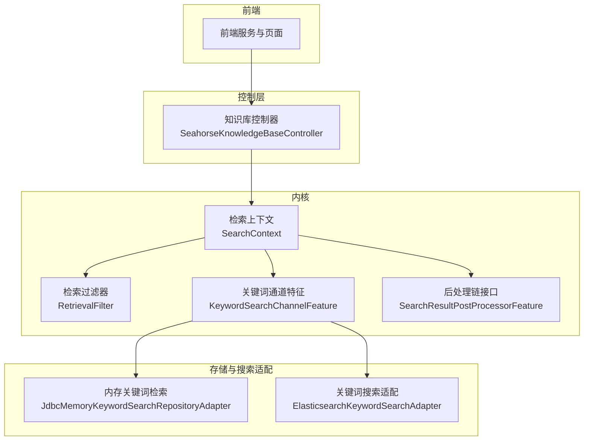
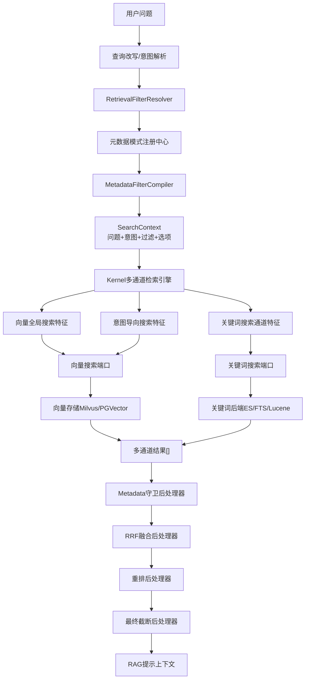
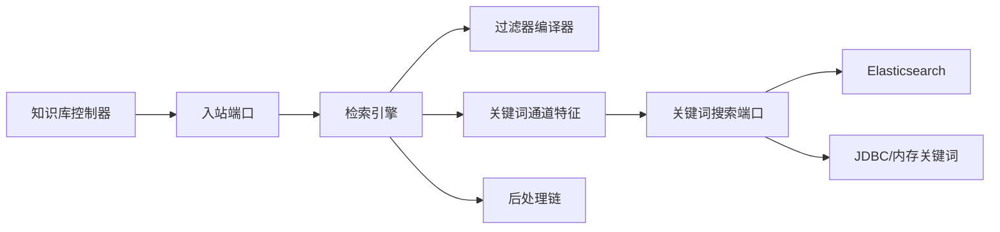

# 搜索查询

<cite>
**本文引用的文件**
- [SeahorseKnowledgeBaseController.java](file://seahorse-agent-adapter-web/src/main/java/com/miracle/ai/seahorse/agent/adapters/web/SeahorseKnowledgeBaseController.java)
- [knowledgeService.ts](file://frontend/src/services/knowledgeService.ts)
- [KernelRetrievalStrategyTemplateServiceTests.java](file://seahorse-agent-tests/src/test/java/com/miracle/ai/seahorse/agent/kernel/application/retrieval/KernelRetrievalStrategyTemplateServiceTests.java)
- [JdbcMemoryKeywordSearchRepositoryAdapter.java](file://seahorse-agent-adapter-repository-jdbc/src/main/java/com/miracle/ai/seahorse/agent/adapters/repository/jdbc/JdbcMemoryKeywordSearchRepositoryAdapter.java)
- [KeywordSearchChannelFeature.java](file://seahorse-agent-kernel/src/main/java/com/miracle/ai/seahorse/agent/kernel/feature/retrieval/KeywordSearchChannelFeature.java)
- [RetrievalFilter.java](file://seahorse-agent-kernel/src/main/java/com/miracle/ai/seahorse/agent/kernel/domain/retrieval/RetrievalFilter.java)
- [ElasticsearchKeywordSearchAdapter.java](file://seahorse-agent-adapter-search-elasticsearch/src/main/java/com/miracle/ai/seahorse/agent/adapters/search/elasticsearch/ElasticsearchKeywordSearchAdapter.java)
- [JdbcKeywordSearchAdapterTests.java](file://seahorse-agent-adapter-repository-jdbc/src/test/java/com/miracle/ai/seahorse/agent/adapters/repository/jdbc/JdbcKeywordSearchAdapterTests.java)
- [混合检索与重排完善设计方案.md](file://docs/zh/content/架构设计/混合检索与重排完善设计方案.md)
- [SearchResultPostProcessorFeature.java](file://seahorse-agent-kernel/src/main/java/com/miracle/ai/seahorse/agent/kernel/feature/retrieval/SearchResultPostProcessorFeature.java)
- [WebSearchToolPortAdapter.java](file://seahorse-agent-kernel/src/main/java/com/miracle/ai/seahorse/agent/kernel/application/agent/tool/WebSearchToolPortAdapter.java)
- [WebSearchRequest.java](file://seahorse-agent-kernel/src/main/java/com/miracle/ai/seahorse/agent/ports/outbound/web/WebSearchRequest.java)
- [JdbcDashboardRepositoryAdapter.java](file://seahorse-agent-adapter-repository-jdbc/src/main/java/com/miracle/ai/seahorse/agent/adapters/repository/jdbc/JdbcDashboardRepositoryAdapter.java)
- [性能测试.md](file://docs/zh/content/测试策略/性能测试.md)
- [KernelQueryTermMappingService.java](file://seahorse-agent-kernel/src/main/java/com/miracle/ai/seahorse/agent/kernel/application/mapping/KernelQueryTermMappingService.java)
- [KernelSampleQuestionService.java](file://seahorse-agent-kernel/src/main/java/com/miracle/ai/seahorse/agent/kernel/application/sample/KernelSampleQuestionService.java)
- [QueryTermMappingPage.tsx](file://frontend/src/pages/admin/query-term-mapping/QueryTermMappingPage.tsx)
- [KernelRetrievalEngineTests.java](file://seahorse-agent-tests/src/test/java/com/miracle/ai/seahorse/agent/kernel/feature/retrieval/KernelRetrievalEngineTests.java)
- [KernelRetrievalEngineTests.java](file://seahorse-agent-tests/src/test/java/com/miracle/ai/seahorse/agent/kernel/feature/retrieval/MetadataRetrievalFilterTests.java)
</cite>

## 目录
1. [简介](#简介)
2. [项目结构](#项目结构)
3. [核心组件](#核心组件)
4. [架构总览](#架构总览)
5. [详细组件分析](#详细组件分析)
6. [依赖分析](#依赖分析)
7. [性能考虑](#性能考虑)
8. [故障排查指南](#故障排查指南)
9. [结论](#结论)
10. [附录](#附录)

## 简介
本文件面向知识库搜索查询能力，提供基于关键词、语义相似度、混合检索（RRF、重排）等多通道融合的查询接口与实现说明。内容覆盖查询参数配置、结果排序与分页、过滤条件、高亮显示、查询优化、缓存策略、性能监控、查询统计与热门搜索、搜索建议等增强功能。

## 项目结构
围绕“知识库搜索查询”的关键模块分布如下：
- 控制层（Web Adapter）：对外暴露知识库管理与检索相关接口，如知识库创建、更新、删除、分页查询等。
- 内核层（Kernel）：定义检索上下文、过滤器、通道特征（关键词、向量、意图导向）、后处理链（RRF、重排、截断）等。
- 存储与搜索适配层（Repository/Search Adapter）：关键词检索（Elasticsearch/PostgreSQL全文/FTS/Lucene）、向量检索（Milvus/PGVector）、内存关键词检索（JDBC）。
- 前端服务与页面：知识库与检索相关数据模型、查询映射与样例问题管理界面。
- 监控与性能：仪表盘指标采集与可视化，Micrometer观测集成。

图表来源
- [SeahorseKnowledgeBaseController.java:1-106](file://seahorse-agent-adapter-web/src/main/java/com/miracle/ai/seahorse/agent/adapters/web/SeahorseKnowledgeBaseController.java#L1-L106)
- [KeywordSearchChannelFeature.java:29-73](file://seahorse-agent-kernel/src/main/java/com/miracle/ai/seahorse/agent/kernel/feature/retrieval/KeywordSearchChannelFeature.java#L29-L73)
- [RetrievalFilter.java:1-31](file://seahorse-agent-kernel/src/main/java/com/miracle/ai/seahorse/agent/kernel/domain/retrieval/RetrievalFilter.java#L1-L31)
- [JdbcMemoryKeywordSearchRepositoryAdapter.java:59-88](file://seahorse-agent-adapter-repository-jdbc/src/main/java/com/miracle/ai/seahorse/agent/adapters/repository/jdbc/JdbcMemoryKeywordSearchRepositoryAdapter.java#L59-L88)
- [ElasticsearchKeywordSearchAdapter.java:103-138](file://seahorse-agent-adapter-search-elasticsearch/src/main/java/com/miracle/ai/seahorse/agent/adapters/search/elasticsearch/ElasticsearchKeywordSearchAdapter.java#L103-L138)
- [SearchResultPostProcessorFeature.java:28-64](file://seahorse-agent-kernel/src/main/java/com/miracle/ai/seahorse/agent/kernel/feature/retrieval/SearchResultPostProcessorFeature.java#L28-L64)

章节来源
- [SeahorseKnowledgeBaseController.java:1-106](file://seahorse-agent-adapter-web/src/main/java/com/miracle/ai/seahorse/agent/adapters/web/SeahorseKnowledgeBaseController.java#L1-L106)
- [混合检索与重排完善设计方案.md:36-72](file://docs/zh/content/架构设计/混合检索与重排完善设计方案.md#L36-L72)

## 核心组件
- 知识库控制器：提供知识库的增删改查与分页查询接口，便于前端进行知识库维度的检索入口管理。
- 关键词检索通道特征：封装关键词（BM25）检索的调用、参数透传与延迟统计。
- 检索过滤器：统一的过滤请求领域对象，支持系统级过滤与元数据条件编译。
- 关键词搜索适配：支持高亮、系统过滤下推、字段Boost剥离等。
- 内存关键词检索适配：支持关键词索引、短期/长期记忆、语义记忆的多层召回与重排。
- 后处理链接口：定义检索结果后处理的插件化规范，包括Metadata守卫、RRF融合、重排、截断等。

章节来源
- [SeahorseKnowledgeBaseController.java:59-96](file://seahorse-agent-adapter-web/src/main/java/com/miracle/ai/seahorse/agent/adapters/web/SeahorseKnowledgeBaseController.java#L59-L96)
- [KeywordSearchChannelFeature.java:54-72](file://seahorse-agent-kernel/src/main/java/com/miracle/ai/seahorse/agent/kernel/feature/retrieval/KeywordSearchChannelFeature.java#L54-L72)
- [RetrievalFilter.java:14-31](file://seahorse-agent-kernel/src/main/java/com/miracle/ai/seahorse/agent/kernel/domain/retrieval/RetrievalFilter.java#L14-L31)
- [ElasticsearchKeywordSearchAdapter.java:103-138](file://seahorse-agent-adapter-search-elasticsearch/src/main/java/com/miracle/ai/seahorse/agent/adapters/search/elasticsearch/ElasticsearchKeywordSearchAdapter.java#L103-L138)
- [JdbcMemoryKeywordSearchRepositoryAdapter.java:59-88](file://seahorse-agent-adapter-repository-jdbc/src/main/java/com/miracle/ai/seahorse/agent/adapters/repository/jdbc/JdbcMemoryKeywordSearchRepositoryAdapter.java#L59-L88)
- [SearchResultPostProcessorFeature.java:34-64](file://seahorse-agent-kernel/src/main/java/com/miracle/ai/seahorse/agent/kernel/feature/retrieval/SearchResultPostProcessorFeature.java#L34-L64)

## 架构总览
整体架构遵循“过滤器编译—多通道召回—后处理融合—上下文拼接”的流程，确保过滤条件在进入后端前完成Schema校验与AST编译，多通道结果统一映射并进行RRF融合、重排与截断，最终形成RAG提示上下文。

图表来源
- [混合检索与重排完善设计方案.md:36-72](file://docs/zh/content/架构设计/混合检索与重排完善设计方案.md#L36-L72)

## 详细组件分析

### 知识库管理与检索入口
- 提供知识库的创建、更新、删除、按ID查询、分页查询与分词策略列表查询。
- 分页参数：current 默认1，size 默认10；接口返回统一结构，包含状态码与数据载体。

章节来源
- [SeahorseKnowledgeBaseController.java:59-101](file://seahorse-agent-adapter-web/src/main/java/com/miracle/ai/seahorse/agent/adapters/web/SeahorseKnowledgeBaseController.java#L59-L101)

### 关键词检索通道特征
- 功能：封装关键词（BM25）检索调用，透传过滤条件与TopK，记录通道延迟。
- 参数：主问题、TopK、过滤器、编译后的过滤器、检索选项。
- 输出：包含通道类型、名称、命中块列表、延迟与元数据（如TopK）。

章节来源
- [KeywordSearchChannelFeature.java:54-72](file://seahorse-agent-kernel/src/main/java/com/miracle/ai/seahorse/agent/kernel/feature/retrieval/KeywordSearchChannelFeature.java#L54-L72)

### 检索过滤器与系统过滤下推
- 领域对象：包含系统过滤与元数据条件列表，空值安全与不可变集合。
- 系统过滤下推：支持启用状态、租户ID、知识库ID、文档ID、集合名、ACL主体、文件类型、来源类型、时间范围等条件的SQL/DSL下推。
- 元数据条件编译：由编译器将用户输入转换为可执行的过滤AST，避免直接信任用户原始字段与值。

章节来源
- [RetrievalFilter.java:14-31](file://seahorse-agent-kernel/src/main/java/com/miracle/ai/seahorse/agent/kernel/domain/retrieval/RetrievalFilter.java#L14-L31)
- [ElasticsearchKeywordSearchAdapter.java:144-164](file://seahorse-agent-adapter-search-elasticsearch/src/main/java/com/miracle/ai/seahorse/agent/adapters/search/elasticsearch/ElasticsearchKeywordSearchAdapter.java#L144-L164)

### 关键词搜索适配（高亮与字段处理）
- 高亮：根据可搜索字段生成高亮片段，配置片段大小与数量，并使用前后标签包裹匹配词。
- Boost剥离：去除字段Boost标记，保证字段名一致性。
- 字段选择：限定返回字段，减少网络与序列化开销。

章节来源
- [ElasticsearchKeywordSearchAdapter.java:103-138](file://seahorse-agent-adapter-search-elasticsearch/src/main/java/com/miracle/ai/seahorse/agent/adapters/search/elasticsearch/ElasticsearchKeywordSearchAdapter.java#L103-L138)
- [ElasticsearchKeywordSearchAdapter.java:138-142](file://seahorse-agent-adapter-search-elasticsearch/src/main/java/com/miracle/ai/seahorse/agent/adapters/search/elasticsearch/ElasticsearchKeywordSearchAdapter.java#L138-L142)

### 内存关键词检索（短期/长期/语义）
- 多层召回：优先关键词索引，若无命中则回退至短期记忆、长期记忆与语义记忆。
- 候选集缩放：根据TopK动态扩大候选集，限制最小/最大候选数。
- 排序：对召回文档进行评分与重排，输出TopK结果。

章节来源
- [JdbcMemoryKeywordSearchRepositoryAdapter.java:59-88](file://seahorse-agent-adapter-repository-jdbc/src/main/java/com/miracle/ai/seahorse/agent/adapters/repository/jdbc/JdbcMemoryKeywordSearchRepositoryAdapter.java#L59-L88)
- [JdbcMemoryKeywordSearchRepositoryAdapter.java:167-182](file://seahorse-agent-adapter-repository-jdbc/src/main/java/com/miracle/ai/seahorse/agent/adapters/repository/jdbc/JdbcMemoryKeywordSearchRepositoryAdapter.java#L167-L182)

### 检索策略模板与混合检索
- 默认模板：向量仅、RRF混合、重排混合等模板键，支持开启关键词、通道权重、重排模型等选项。
- 定制化：可通过模板键覆盖默认策略，满足不同业务场景。

章节来源
- [KernelRetrievalStrategyTemplateServiceTests.java:36-50](file://seahorse-agent-tests/src/test/java/com/miracle/ai/seahorse/agent/kernel/application/retrieval/KernelRetrievalStrategyTemplateServiceTests.java#L36-L50)

### 结果后处理链（Metadata守卫、RRF、重排、截断）
- 插件化：后处理链以Feature形式组织，统一启用判断与处理协议。
- 流程：先Metadata守卫过滤无效或低质量结果，再进行RRF融合平衡多通道差异，随后重排提升相关性，最后截断保留TopK。

章节来源
- [SearchResultPostProcessorFeature.java:34-64](file://seahorse-agent-kernel/src/main/java/com/miracle/ai/seahorse/agent/kernel/feature/retrieval/SearchResultPostProcessorFeature.java#L34-L64)

### 查询映射与样例问题（增强功能）
- 查询映射：将口语化词汇归一化为标准术语，提升检索准确率；支持优先级与精确匹配配置。
- 样例问题：展示推荐问法，降低用户思考成本；建议结合用户行为数据更新。

章节来源
- [KernelQueryTermMappingService.java:106-115](file://seahorse-agent-kernel/src/main/java/com/miracle/ai/seahorse/agent/kernel/application/mapping/KernelQueryTermMappingService.java#L106-L115)
- [KernelSampleQuestionService.java:101-110](file://seahorse-agent-kernel/src/main/java/com/miracle/ai/seahorse/agent/kernel/application/sample/KernelSampleQuestionService.java#L101-L110)
- [QueryTermMappingPage.tsx:46-51](file://frontend/src/pages/admin/query-term-mapping/QueryTermMappingPage.tsx#L46-L51)

### Web搜索工具（扩展能力）
- 工具描述：提供Web搜索能力，支持语言区域、时间范围与最大结果数配置。
- 观测输出：记录查询、最大结果数、命中数与来源信息，便于审计与优化。

章节来源
- [WebSearchToolPortAdapter.java:58-98](file://seahorse-agent-kernel/src/main/java/com/miracle/ai/seahorse/agent/kernel/application/agent/tool/WebSearchToolPortAdapter.java#L58-L98)
- [WebSearchRequest.java:22-41](file://seahorse-agent-kernel/src/main/java/com/miracle/ai/seahorse/agent/ports/outbound/web/WebSearchRequest.java#L22-L41)

## 依赖分析
- 控制层依赖内核的入站端口，负责参数校验与命令构造。
- 关键词通道特征依赖关键词搜索端口，后者对接多种后端（Elasticsearch/FTS/Lucene）。
- 过滤器编译器在进入后端前完成Schema校验与AST构建，降低后端负担。
- 后处理链对多通道结果进行统一治理，避免单通道失败影响整体体验。

图表来源
- [SeahorseKnowledgeBaseController.java:59-96](file://seahorse-agent-adapter-web/src/main/java/com/miracle/ai/seahorse/agent/adapters/web/SeahorseKnowledgeBaseController.java#L59-L96)
- [KeywordSearchChannelFeature.java:54-72](file://seahorse-agent-kernel/src/main/java/com/miracle/ai/seahorse/agent/kernel/feature/retrieval/KeywordSearchChannelFeature.java#L54-L72)
- [ElasticsearchKeywordSearchAdapter.java:103-138](file://seahorse-agent-adapter-search-elasticsearch/src/main/java/com/miracle/ai/seahorse/agent/adapters/search/elasticsearch/ElasticsearchKeywordSearchAdapter.java#L103-L138)
- [JdbcMemoryKeywordSearchRepositoryAdapter.java:59-88](file://seahorse-agent-adapter-repository-jdbc/src/main/java/com/miracle/ai/seahorse/agent/adapters/repository/jdbc/JdbcMemoryKeywordSearchRepositoryAdapter.java#L59-L88)
- [SearchResultPostProcessorFeature.java:34-64](file://seahorse-agent-kernel/src/main/java/com/miracle/ai/seahorse/agent/kernel/feature/retrieval/SearchResultPostProcessorFeature.java#L34-L64)

## 性能考虑
- 指标采集：通过Micrometer收集JVM、数据库与系统资源指标，统一上报Prometheus并可视化。
- 延迟与吞吐：通道特征记录延迟，后处理链支持慢通道降权与失败保护。
- 候选集与TopK：候选集按TopK动态缩放，避免过小导致召回不足，过大导致排序开销上升。
- 高亮与字段裁剪：仅返回必要字段并按需高亮，降低网络与序列化成本。

章节来源
- [性能测试.md:311-337](file://docs/zh/content/测试策略/性能测试.md#L311-L337)
- [KernelRetrievalEngineTests.java:230-263](file://seahorse-agent-tests/src/test/java/com/miracle/ai/seahorse/agent/kernel/feature/retrieval/KernelRetrievalEngineTests.java#L230-L263)
- [JdbcMemoryKeywordSearchRepositoryAdapter.java:78-81](file://seahorse-agent-adapter-repository-jdbc/src/main/java/com/miracle/ai/seahorse/agent/adapters/repository/jdbc/JdbcMemoryKeywordSearchRepositoryAdapter.java#L78-L81)

## 故障排查指南
- 关键词后端不可用：通道特征抛出异常时，后处理链应具备失败保护与降级策略，避免整体检索失败。
- 过滤条件异常：系统过滤下推失败或字段不合法时，编译器应给出明确错误信息；前端应提示用户修正。
- 高亮与字段：若高亮不生效，检查可搜索字段与Boost剥离逻辑；确认高亮片段大小与数量配置合理。
- 性能瓶颈：关注通道延迟、候选集规模与后处理耗时；必要时调整TopK、候选集倍数与后处理顺序。

章节来源
- [KernelRetrievalEngineTests.java:545-567](file://seahorse-agent-tests/src/test/java/com/miracle/ai/seahorse/agent/kernel/feature/retrieval/MetadataRetrievalFilterTests.java#L545-L567)
- [ElasticsearchKeywordSearchAdapter.java:138-142](file://seahorse-agent-adapter-search-elasticsearch/src/main/java/com/miracle/ai/seahorse/agent/adapters/search/elasticsearch/ElasticsearchKeywordSearchAdapter.java#L138-L142)
- [JdbcKeywordSearchAdapterTests.java:52-79](file://seahorse-agent-adapter-repository-jdbc/src/test/java/com/miracle/ai/seahorse/agent/adapters/repository/jdbc/JdbcKeywordSearchAdapterTests.java#L52-L79)

## 结论
本方案通过“过滤器编译—多通道召回—后处理融合”的架构，实现了关键词、语义与混合检索的统一接入与治理。配合高亮、系统过滤下推、候选集缩放与后处理链，既保证了召回质量，也兼顾了性能与可观测性。查询映射与样例问题进一步提升了用户体验与检索准确率。

## 附录

### API定义与参数说明
- 知识库管理接口
  - 创建知识库：POST /knowledge-base
  - 更新知识库：PUT /knowledge-base/{kb-id}
  - 删除知识库：DELETE /knowledge-base/{kb-id}
  - 按ID查询：GET /knowledge-base/{kb-id}
  - 分页查询：GET /knowledge-base?current=&size=&name=
  - 分词策略：GET /knowledge-base/chunk-strategies
- 请求头
  - X-User-Id：操作者标识（可选）

章节来源
- [SeahorseKnowledgeBaseController.java:59-101](file://seahorse-agent-adapter-web/src/main/java/com/miracle/ai/seahorse/agent/adapters/web/SeahorseKnowledgeBaseController.java#L59-L101)

### 查询参数与过滤条件
- TopK与候选集：TopK决定最终输出，候选集按比例放大以提升召回稳定性。
- 系统过滤：启用状态、租户ID、知识库ID、文档ID、集合名、ACL主体、文件类型、来源类型、时间范围等。
- 元数据过滤：由编译器将用户输入转换为AST，确保字段合法性与执行效率。
- 高亮：按可搜索字段生成高亮片段，支持片段大小与数量配置。

章节来源
- [JdbcMemoryKeywordSearchRepositoryAdapter.java:78-81](file://seahorse-agent-adapter-repository-jdbc/src/main/java/com/miracle/ai/seahorse/agent/adapters/repository/jdbc/JdbcMemoryKeywordSearchRepositoryAdapter.java#L78-L81)
- [ElasticsearchKeywordSearchAdapter.java:144-164](file://seahorse-agent-adapter-search-elasticsearch/src/main/java/com/miracle/ai/seahorse/agent/adapters/search/elasticsearch/ElasticsearchKeywordSearchAdapter.java#L144-L164)
- [RetrievalFilter.java:14-31](file://seahorse-agent-kernel/src/main/java/com/miracle/ai/seahorse/agent/kernel/domain/retrieval/RetrievalFilter.java#L14-L31)

### 结果排序、分页与后处理
- 排序：关键词采用相关性分数排序；语义与向量采用各自相似度分数；后处理链统一融合与重排。
- 分页：前端分页参数 current、size；后端按需扩大候选集以保证分页质量。
- 截断：最终输出TopK，避免超长上下文。

章节来源
- [JdbcMemoryKeywordSearchRepositoryAdapter.java:83-88](file://seahorse-agent-adapter-repository-jdbc/src/main/java/com/miracle/ai/seahorse/agent/adapters/repository/jdbc/JdbcMemoryKeywordSearchRepositoryAdapter.java#L83-L88)
- [SearchResultPostProcessorFeature.java:53-64](file://seahorse-agent-kernel/src/main/java/com/miracle/ai/seahorse/agent/kernel/feature/retrieval/SearchResultPostProcessorFeature.java#L53-L64)

### 查询优化与缓存策略
- 查询优化：系统过滤下推、字段裁剪、高亮按需开启、候选集动态缩放。
- 缓存策略：本地/Redis缓存适配器可用于热点查询与限流，需结合业务场景评估失效策略与一致性。

章节来源
- [ElasticsearchKeywordSearchAdapter.java:103-138](file://seahorse-agent-adapter-search-elasticsearch/src/main/java/com/miracle/ai/seahorse/agent/adapters/search/elasticsearch/ElasticsearchKeywordSearchAdapter.java#L103-L138)
- [性能测试.md:311-337](file://docs/zh/content/测试策略/性能测试.md#L311-L337)

### 性能监控与可观测性
- 指标采集：JVM、数据库、系统资源统一通过Micrometer上报Prometheus，Grafana可视化。
- 检索延迟：通道特征记录延迟，后处理链可识别慢通道并进行降权或跳过。
- 仪表盘：提供成功率、平均/95分位延迟、错误率、无文档率、慢查询率等关键指标。

章节来源
- [性能测试.md:311-337](file://docs/zh/content/测试策略/性能测试.md#L311-L337)
- [JdbcDashboardRepositoryAdapter.java:98-118](file://seahorse-agent-adapter-repository-jdbc/src/main/java/com/miracle/ai/seahorse/agent/adapters/repository/jdbc/JdbcDashboardRepositoryAdapter.java#L98-L118)

### 高级功能：查询语法、过滤条件、高亮显示
- 查询语法：支持精确匹配、前缀匹配、正则匹配、整词匹配等，按业务需求选择。
- 过滤条件：系统过滤与元数据条件组合，编译后下推到后端。
- 高亮显示：对命中字段生成高亮片段，前后标签包裹，便于前端渲染。

章节来源
- [ElasticsearchKeywordSearchAdapter.java:115-136](file://seahorse-agent-adapter-search-elasticsearch/src/main/java/com/miracle/ai/seahorse/agent/adapters/search/elasticsearch/ElasticsearchKeywordSearchAdapter.java#L115-L136)
- [JdbcKeywordSearchAdapterTests.java:52-79](file://seahorse-agent-adapter-repository-jdbc/src/test/java/com/miracle/ai/seahorse/agent/adapters/repository/jdbc/JdbcKeywordSearchAdapterTests.java#L52-L79)

### 增强功能：查询统计、热门搜索、搜索建议
- 查询统计：仪表盘提供趋势分析、会话趋势、活跃用户趋势、响应时间趋势等。
- 热门搜索：结合查询映射与样例问题，持续优化推荐问法与业务词优先级。
- 搜索建议：基于样例问题与用户行为数据，动态调整推荐策略。

章节来源
- [JdbcDashboardRepositoryAdapter.java:112-118](file://seahorse-agent-adapter-repository-jdbc/src/main/java/com/miracle/ai/seahorse/agent/adapters/repository/jdbc/JdbcDashboardRepositoryAdapter.java#L112-L118)
- [KernelQueryTermMappingService.java:106-115](file://seahorse-agent-kernel/src/main/java/com/miracle/ai/seahorse/agent/kernel/application/mapping/KernelQueryTermMappingService.java#L106-L115)
- [KernelSampleQuestionService.java:101-110](file://seahorse-agent-kernel/src/main/java/com/miracle/ai/seahorse/agent/kernel/application/sample/KernelSampleQuestionService.java#L101-L110)
- [QueryTermMappingPage.tsx:46-51](file://frontend/src/pages/admin/query-term-mapping/QueryTermMappingPage.tsx#L46-L51)