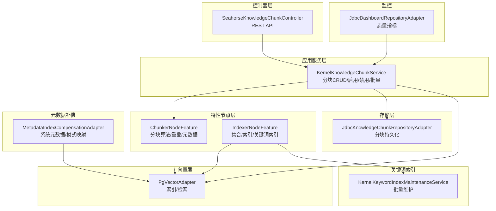
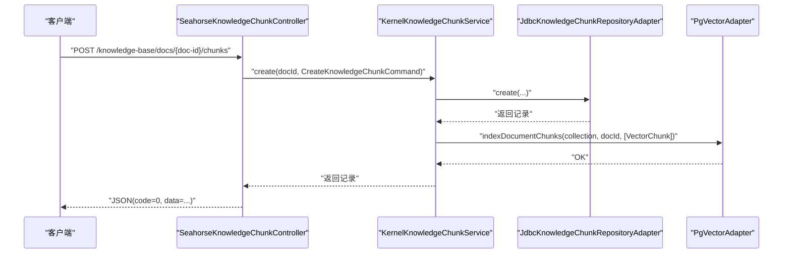
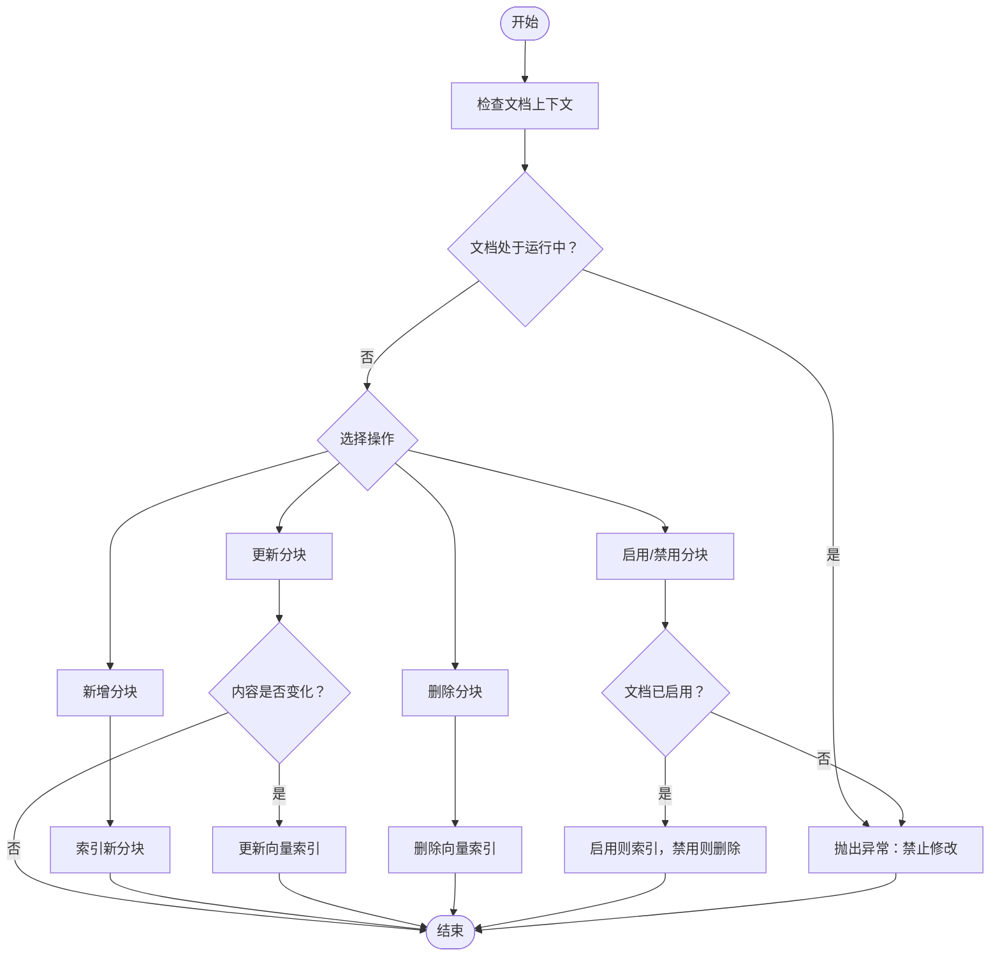
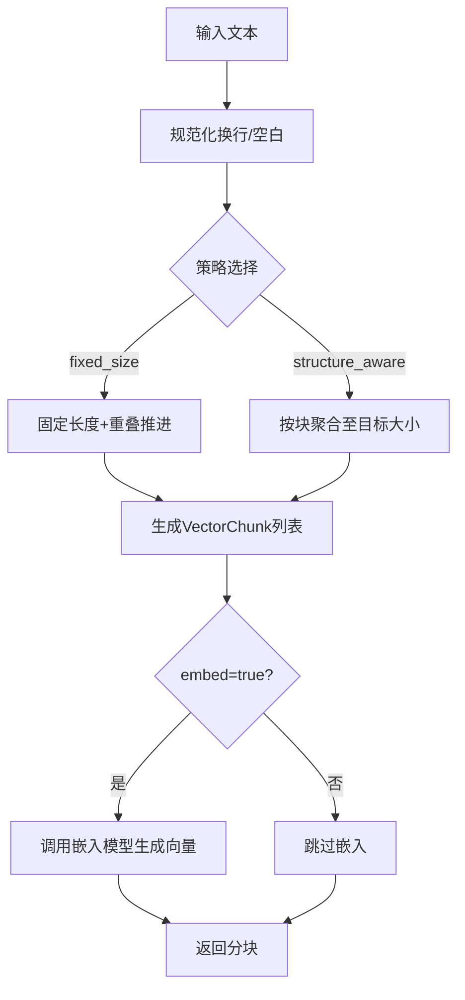
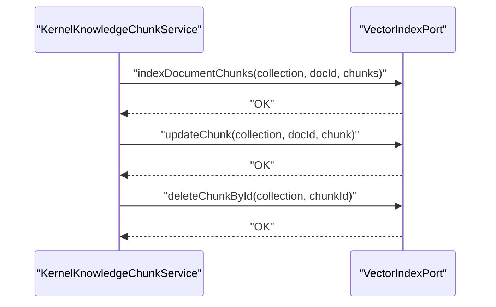
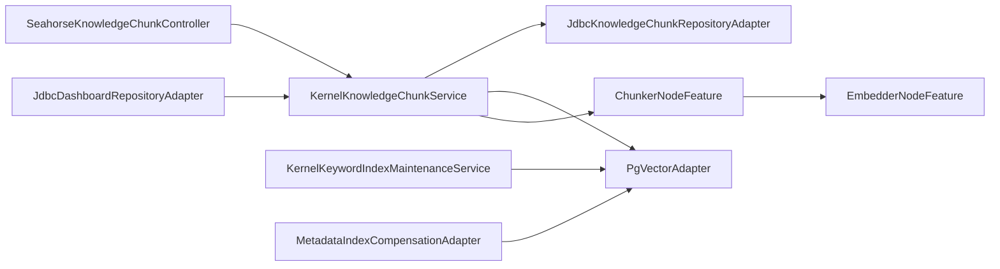

# 文档块管理

<cite>
**本文引用的文件**
- [SeahorseKnowledgeChunkController.java](file://seahorse-agent-adapter-web/src/main/java/com/miracle/ai/seahorse/agent/adapters/web/SeahorseKnowledgeChunkController.java)
- [KernelKnowledgeChunkService.java](file://seahorse-agent-kernel/src/main/java/com/miracle/ai/seahorse/agent/kernel/application/knowledge/KernelKnowledgeChunkService.java)
- [ChunkerNodeFeature.java](file://seahorse-agent-kernel/src/main/java/com/miracle/ai/seahorse/agent/kernel/feature/ingestion/ChunkerNodeFeature.java)
- [PgVectorAdapter.java](file://seahorse-agent-adapter-vector-pgvector/src/main/java/com/miracle/ai/seahorse/agent/adapters/vector/pgvector/PgVectorAdapter.java)
- [IndexerNodeFeature.java](file://seahorse-agent-kernel/src/main/java/com/miracle/ai/seahorse/agent/kernel/feature/ingestion/IndexerNodeFeature.java)
- [KernelKeywordIndexMaintenanceService.java](file://seahorse-agent-kernel/src/main/java/com/miracle/ai/seahorse/agent/kernel/application/keyword/KernelKeywordIndexMaintenanceService.java)
- [MetadataIndexCompensationAdapter.java](file://seahorse-agent-spring-boot-starter/src/main/java/com/miracle/ai/seahorse/agent/adapters/spring/metadata/MetadataIndexCompensationAdapter.java)
- [JdbcKnowledgeChunkRepositoryAdapter.java](file://seahorse-agent-adapter-repository-jdbc/src/main/java/com/miracle/ai/seahorse/agent/adapters/repository/jdbc/JdbcKnowledgeChunkRepositoryAdapter.java)
- [KnowledgeChunkCreateRequest.java](file://seahorse-agent-adapter-web/src/main/java/com/miracle/ai/seahorse/agent/adapters/web/KnowledgeChunkCreateRequest.java)
- [KnowledgeChunkUpdateRequest.java](file://seahorse-agent-adapter-web/src/main/java/com/miracle/ai/seahorse/agent/adapters/web/KnowledgeChunkUpdateRequest.java)
- [KnowledgeChunkBatchRequest.java](file://seahorse-agent-adapter-web/src/main/java/com/miracle/ai/seahorse/agent/adapters/web/KnowledgeChunkBatchRequest.java)
- [CreateKnowledgeChunkCommand.java](file://seahorse-agent-kernel/src/main/java/com/miracle/ai/seahorse/agent/ports/inbound/knowledge/CreateKnowledgeChunkCommand.java)
- [UpdateKnowledgeChunkCommand.java](file://seahorse-agent-kernel/src/main/java/com/miracle/ai/seahorse/agent/ports/inbound/knowledge/UpdateKnowledgeChunkCommand.java)
- [KnowledgeChunkPageCommand.java](file://seahorse-agent-kernel/src/main/java/com/miracle/ai/seahorse/agent/ports/inbound/knowledge/KnowledgeChunkPageCommand.java)
- [VectorChunk.java](file://seahorse-agent-kernel/src/main/java/com/miracle/ai/seahorse/agent/kernel/domain/vector/VectorChunk.java)
- [RetrievedChunk.java](file://seahorse-agent-kernel/src/main/java/com/miracle/ai/seahorse/agent/kernel/domain/retrieval/RetrievedChunk.java)
- [VectorIndexPort.java](file://seahorse-agent-kernel/src/main/java/com/miracle/ai/seahorse/agent/ports/outbound/vector/VectorIndexPort.java)
- [VectorSearchPort.java](file://seahorse-agent-kernel/src/main/java/com/miracle/ai/seahorse/agent/ports/outbound/vector/VectorSearchPort.java)
- [JdbcDashboardRepositoryAdapter.java](file://seahorse-agent-adapter-repository-jdbc/src/main/java/com/miracle/ai/seahorse/agent/adapters/repository/jdbc/JdbcDashboardRepositoryAdapter.java)
</cite>

## 目录
1. [简介](#简介)
2. [项目结构](#项目结构)
3. [核心组件](#核心组件)
4. [架构总览](#架构总览)
5. [详细组件分析](#详细组件分析)
6. [依赖关系分析](#依赖关系分析)
7. [性能考量](#性能考量)
8. [故障排查指南](#故障排查指南)
9. [结论](#结论)
10. [附录](#附录)

## 简介
本文件面向“文档块管理”能力，系统化梳理分块的创建、查询、更新、删除接口，以及分块算法配置、策略选择、质量评估、向量化与索引、检索优化、统计与监控等全链路能力。文档同时给出分块大小优化、重叠策略、语义分块等最佳实践建议，帮助开发者与运维人员高效落地与优化 RAG 知识管理。

## 项目结构
围绕“文档块管理”的核心路径与模块如下：
- 控制器层：对外暴露 REST API，负责请求解析与响应封装
- 应用服务层：实现业务规则与流程编排（分块 CRUD、启用/禁用、批量操作）
- 特性节点层：负责分块算法（固定长度、结构感知）、嵌入生成、元数据注入
- 存储适配层：数据库持久化分块记录
- 向量适配层：向量索引与检索
- 关键词索引维护：关键词索引的批量维护
- 元数据补偿：向量索引元数据的系统字段与模式映射
- 监控与仪表盘：质量指标与趋势

图示来源
- [SeahorseKnowledgeChunkController.java:43-116](file://seahorse-agent-adapter-web/src/main/java/com/miracle/ai/seahorse/agent/adapters/web/SeahorseKnowledgeChunkController.java#L43-L116)
- [KernelKnowledgeChunkService.java:40-217](file://seahorse-agent-kernel/src/main/java/com/miracle/ai/seahorse/agent/kernel/application/knowledge/KernelKnowledgeChunkService.java#L40-L217)
- [ChunkerNodeFeature.java:41-295](file://seahorse-agent-kernel/src/main/java/com/miracle/ai/seahorse/agent/kernel/feature/ingestion/ChunkerNodeFeature.java#L41-L295)
- [IndexerNodeFeature.java:52-74](file://seahorse-agent-kernel/src/main/java/com/miracle/ai/seahorse/agent/kernel/feature/ingestion/IndexerNodeFeature.java#L52-L74)
- [JdbcKnowledgeChunkRepositoryAdapter.java](file://seahorse-agent-adapter-repository-jdbc/src/main/java/com/miracle/ai/seahorse/agent/adapters/repository/jdbc/JdbcKnowledgeChunkRepositoryAdapter.java)
- [PgVectorAdapter.java:191-219](file://seahorse-agent-adapter-vector-pgvector/src/main/java/com/miracle/ai/seahorse/agent/adapters/vector/pgvector/PgVectorAdapter.java#L191-L219)
- [KernelKeywordIndexMaintenanceService.java:126-154](file://seahorse-agent-kernel/src/main/java/com/miracle/ai/seahorse/agent/kernel/application/keyword/KernelKeywordIndexMaintenanceService.java#L126-L154)
- [MetadataIndexCompensationAdapter.java:141-208](file://seahorse-agent-spring-boot-starter/src/main/java/com/miracle/ai/seahorse/agent/adapters/spring/metadata/MetadataIndexCompensationAdapter.java#L141-L208)
- [JdbcDashboardRepositoryAdapter.java:140-162](file://seahorse-agent-adapter-repository-jdbc/src/main/java/com/miracle/ai/seahorse/agent/adapters/repository/jdbc/JdbcDashboardRepositoryAdapter.java#L140-L162)

章节来源
- [SeahorseKnowledgeChunkController.java:43-116](file://seahorse-agent-adapter-web/src/main/java/com/miracle/ai/seahorse/agent/adapters/web/SeahorseKnowledgeChunkController.java#L43-L116)
- [KernelKnowledgeChunkService.java:40-217](file://seahorse-agent-kernel/src/main/java/com/miracle/ai/seahorse/agent/kernel/application/knowledge/KernelKnowledgeChunkService.java#L40-L217)

## 核心组件
- 控制器：提供分页查询、创建、更新、删除、启用/禁用、批量启用/禁用等接口
- 应用服务：实现业务约束（文档状态、启用状态、批大小限制）、调用向量索引与存储
- 分块算法：固定长度分块与结构感知分块，支持重叠策略与嵌入开关
- 向量适配：索引写入、更新、删除、检索
- 关键词索引：按文档批量维护关键词索引
- 元数据补偿：系统元数据与模式字段映射到向量索引
- 监控：质量指标（错误率、无文档率、慢查询率）与趋势

章节来源
- [KernelKnowledgeChunkService.java:40-217](file://seahorse-agent-kernel/src/main/java/com/miracle/ai/seahorse/agent/kernel/application/knowledge/KernelKnowledgeChunkService.java#L40-L217)
- [ChunkerNodeFeature.java:41-295](file://seahorse-agent-kernel/src/main/java/com/miracle/ai/seahorse/agent/kernel/feature/ingestion/ChunkerNodeFeature.java#L41-L295)
- [PgVectorAdapter.java:191-219](file://seahorse-agent-adapter-vector-pgvector/src/main/java/com/miracle/ai/seahorse/agent/adapters/vector/pgvector/PgVectorAdapter.java#L191-L219)
- [KernelKeywordIndexMaintenanceService.java:126-154](file://seahorse-agent-kernel/src/main/java/com/miracle/ai/seahorse/agent/kernel/application/keyword/KernelKeywordIndexMaintenanceService.java#L126-L154)
- [MetadataIndexCompensationAdapter.java:141-208](file://seahorse-agent-spring-boot-starter/src/main/java/com/miracle/ai/seahorse/agent/adapters/spring/metadata/MetadataIndexCompensationAdapter.java#L141-L208)
- [JdbcDashboardRepositoryAdapter.java:140-162](file://seahorse-agent-adapter-repository-jdbc/src/main/java/com/miracle/ai/seahorse/agent/adapters/repository/jdbc/JdbcDashboardRepositoryAdapter.java#L140-L162)

## 架构总览
从请求到落库与向量索引的整体流程如下：

图示来源
- [SeahorseKnowledgeChunkController.java:67-75](file://seahorse-agent-adapter-web/src/main/java/com/miracle/ai/seahorse/agent/adapters/web/SeahorseKnowledgeChunkController.java#L67-L75)
- [KernelKnowledgeChunkService.java:66-77](file://seahorse-agent-kernel/src/main/java/com/miracle/ai/seahorse/agent/kernel/application/knowledge/KernelKnowledgeChunkService.java#L66-L77)
- [JdbcKnowledgeChunkRepositoryAdapter.java](file://seahorse-agent-adapter-repository-jdbc/src/main/java/com/miracle/ai/seahorse/agent/adapters/repository/jdbc/JdbcKnowledgeChunkRepositoryAdapter.java)
- [PgVectorAdapter.java:191-219](file://seahorse-agent-adapter-vector-pgvector/src/main/java/com/miracle/ai/seahorse/agent/adapters/vector/pgvector/PgVectorAdapter.java#L191-L219)

## 详细组件分析

### API 定义与行为
- 分页查询
  - 方法：GET
  - 路径：/knowledge-base/docs/{doc-id}/chunks
  - 查询参数：current（默认1）、size（默认10）、enabled（可选）
  - 返回：分页结果对象
  - 章节来源
    - [SeahorseKnowledgeChunkController.java:58-65](file://seahorse-agent-adapter-web/src/main/java/com/miracle/ai/seahorse/agent/adapters/web/SeahorseKnowledgeChunkController.java#L58-L65)
    - [KernelKnowledgeChunkService.java:58-63](file://seahorse-agent-kernel/src/main/java/com/miracle/ai/seahorse/agent/kernel/application/knowledge/KernelKnowledgeChunkService.java#L58-L63)

- 创建分块
  - 方法：POST
  - 路径：/knowledge-base/docs/{doc-id}/chunks
  - 请求体：KnowledgeChunkCreateRequest（含 chunkId 可选、content、index、operator）
  - 行为：仅当文档启用且非运行中时允许创建；创建后立即向量索引
  - 章节来源
    - [SeahorseKnowledgeChunkController.java:67-75](file://seahorse-agent-adapter-web/src/main/java/com/miracle/ai/seahorse/agent/adapters/web/SeahorseKnowledgeChunkController.java#L67-L75)
    - [KernelKnowledgeChunkService.java:66-77](file://seahorse-agent-kernel/src/main/java/com/miracle/ai/seahorse/agent/kernel/application/knowledge/KernelKnowledgeChunkService.java#L66-L77)

- 更新分块
  - 方法：PUT
  - 路径：/knowledge-base/docs/{doc-id}/chunks/{chunk-id}
  - 请求体：KnowledgeChunkUpdateRequest（含 content）
  - 行为：内容不变则跳过；否则更新并同步更新向量索引
  - 章节来源
    - [SeahorseKnowledgeChunkController.java:77-90](file://seahorse-agent-adapter-web/src/main/java/com/miracle/ai/seahorse/agent/adapters/web/SeahorseKnowledgeChunkController.java#L77-L90)
    - [KernelKnowledgeChunkService.java:79-93](file://seahorse-agent-kernel/src/main/java/com/miracle/ai/seahorse/agent/kernel/application/knowledge/KernelKnowledgeChunkService.java#L79-L93)

- 删除分块
  - 方法：DELETE
  - 路径：/knowledge-base/docs/{doc-id}/chunks/{chunk-id}
  - 行为：删除分块并同步删除向量
  - 章节来源
    - [SeahorseKnowledgeChunkController.java:92-100](file://seahorse-agent-adapter-web/src/main/java/com/miracle/ai/seahorse/agent/adapters/web/SeahorseKnowledgeChunkController.java#L92-L100)
    - [KernelKnowledgeChunkService.java:95-103](file://seahorse-agent-kernel/src/main/java/com/miracle/ai/seahorse/agent/kernel/application/knowledge/KernelKnowledgeChunkService.java#L95-L103)

- 启用/禁用分块
  - 方法：PUT（通过业务服务触发）
  - 行为：仅当文档启用时允许启用；启用时索引，禁用时删除向量
  - 章节来源
    - [KernelKnowledgeChunkService.java:105-119](file://seahorse-agent-kernel/src/main/java/com/miracle/ai/seahorse/agent/kernel/application/knowledge/KernelKnowledgeChunkService.java#L105-L119)

- 批量启用/禁用分块
  - 方法：PUT（通过业务服务触发）
  - 行为：限制最大批次大小，校验ID有效性，按需批量索引或删除
  - 章节来源
    - [KernelKnowledgeChunkService.java:122-154](file://seahorse-agent-kernel/src/main/java/com/miracle/ai/seahorse/agent/kernel/application/knowledge/KernelKnowledgeChunkService.java#L122-L154)

图示来源
- [KernelKnowledgeChunkService.java:58-154](file://seahorse-agent-kernel/src/main/java/com/miracle/ai/seahorse/agent/kernel/application/knowledge/KernelKnowledgeChunkService.java#L58-L154)

### 分块算法与策略
- 策略类型
  - 固定长度分块（fixed_size）
  - 结构感知分块（structure_aware）
- 关键配置
  - chunkSize：分块大小（字符数）
  - overlapSize：重叠长度（字符数）
  - embed：是否进行嵌入
  - modelId/embeddingModelId：嵌入模型标识
- 算法要点
  - 固定长度：支持重叠推进，避免切分破坏语义边界
  - 结构感知：按段落/块聚合，达到目标大小再 flush，保留块间空行
  - 单块模式：当 chunkSize 指定为特殊值时输出单个整块
- 元数据注入：将接受的元数据合并到每个分块
- 章节来源
  - [ChunkerNodeFeature.java:41-295](file://seahorse-agent-kernel/src/main/java/com/miracle/ai/seahorse/agent/kernel/feature/ingestion/ChunkerNodeFeature.java#L41-L295)

图示来源
- [ChunkerNodeFeature.java:70-88](file://seahorse-agent-kernel/src/main/java/com/miracle/ai/seahorse/agent/kernel/feature/ingestion/ChunkerNodeFeature.java#L70-L88)
- [ChunkerNodeFeature.java:97-129](file://seahorse-agent-kernel/src/main/java/com/miracle/ai/seahorse/agent/kernel/feature/ingestion/ChunkerNodeFeature.java#L97-L129)
- [ChunkerNodeFeature.java:142-180](file://seahorse-agent-kernel/src/main/java/com/miracle/ai/seahorse/agent/kernel/feature/ingestion/ChunkerNodeFeature.java#L142-L180)

### 向量化与索引
- 写入索引
  - 应用服务在创建/启用/批量启用时调用向量索引接口写入
  - 章节来源
    - [KernelKnowledgeChunkService.java:189-192](file://seahorse-agent-kernel/src/main/java/com/miracle/ai/seahorse/agent/kernel/application/knowledge/KernelKnowledgeChunkService.java#L189-L192)
    - [KernelKnowledgeChunkService.java:147-150](file://seahorse-agent-kernel/src/main/java/com/miracle/ai/seahorse/agent/kernel/application/knowledge/KernelKnowledgeChunkService.java#L147-L150)

- 更新索引
  - 内容变更后更新对应向量
  - 章节来源
    - [KernelKnowledgeChunkService.java:91-92](file://seahorse-agent-kernel/src/main/java/com/miracle/ai/seahorse/agent/kernel/application/knowledge/KernelKnowledgeChunkService.java#L91-L92)

- 删除索引
  - 删除分块或禁用分块时删除对应向量
  - 章节来源
    - [KernelKnowledgeChunkService.java:102-118](file://seahorse-agent-kernel/src/main/java/com/miracle/ai/seahorse/agent/kernel/application/knowledge/KernelKnowledgeChunkService.java#L102-L118)

- 检索接口
  - 通过向量检索端口执行相似度检索，返回带元数据的命中
  - 章节来源
    - [PgVectorAdapter.java:191-219](file://seahorse-agent-adapter-vector-pgvector/src/main/java/com/miracle/ai/seahorse/agent/adapters/vector/pgvector/PgVectorAdapter.java#L191-L219)
    - [VectorSearchPort.java](file://seahorse-agent-kernel/src/main/java/com/miracle/ai/seahorse/agent/ports/outbound/vector/VectorSearchPort.java)

图示来源
- [KernelKnowledgeChunkService.java:189-201](file://seahorse-agent-kernel/src/main/java/com/miracle/ai/seahorse/agent/kernel/application/knowledge/KernelKnowledgeChunkService.java#L189-L201)
- [VectorIndexPort.java](file://seahorse-agent-kernel/src/main/java/com/miracle/ai/seahorse/agent/ports/outbound/vector/VectorIndexPort.java)

### 关键词索引与集合管理
- 关键词索引维护
  - 按文档批量索引关键词，用于检索优化
  - 章节来源
    - [KernelKeywordIndexMaintenanceService.java:126-140](file://seahorse-agent-kernel/src/main/java/com/miracle/ai/seahorse/agent/kernel/application/keyword/KernelKeywordIndexMaintenanceService.java#L126-L140)

- 集合与索引管理
  - 管理向量集合、索引生命周期与安全元数据
  - 章节来源
    - [IndexerNodeFeature.java:52-74](file://seahorse-agent-kernel/src/main/java/com/miracle/ai/seahorse/agent/kernel/feature/ingestion/IndexerNodeFeature.java#L52-L74)

### 元数据与系统字段
- 系统元数据键集（向量索引）
  - 包括租户、知识库、文档、分块、集合名、启用状态、ACL、安全级别、文件类型、来源类型、时间戳等
  - 章节来源
    - [IndexerNodeFeature.java:52-58](file://seahorse-agent-kernel/src/main/java/com/miracle/ai/seahorse/agent/kernel/feature/ingestion/IndexerNodeFeature.java#L52-L58)

- 元数据补偿
  - 将系统字段与模式字段映射到向量元数据
  - 章节来源
    - [MetadataIndexCompensationAdapter.java:167-205](file://seahorse-agent-spring-boot-starter/src/main/java/com/miracle/ai/seahorse/agent/adapters/spring/metadata/MetadataIndexCompensationAdapter.java#L167-L205)

### 数据模型与命令
- 请求与命令对象
  - KnowledgeChunkCreateRequest / KnowledgeChunkUpdateRequest / KnowledgeChunkBatchRequest
  - CreateKnowledgeChunkCommand / UpdateKnowledgeChunkCommand / KnowledgeChunkPageCommand
  - 章节来源
    - [KnowledgeChunkCreateRequest.java](file://seahorse-agent-adapter-web/src/main/java/com/miracle/ai/seahorse/agent/adapters/web/KnowledgeChunkCreateRequest.java)
    - [KnowledgeChunkUpdateRequest.java](file://seahorse-agent-adapter-web/src/main/java/com/miracle/ai/seahorse/agent/adapters/web/KnowledgeChunkUpdateRequest.java)
    - [KnowledgeChunkBatchRequest.java](file://seahorse-agent-adapter-web/src/main/java/com/miracle/ai/seahorse/agent/adapters/web/KnowledgeChunkBatchRequest.java)
    - [CreateKnowledgeChunkCommand.java](file://seahorse-agent-kernel/src/main/java/com/miracle/ai/seahorse/agent/ports/inbound/knowledge/CreateKnowledgeChunkCommand.java)
    - [UpdateKnowledgeChunkCommand.java](file://seahorse-agent-kernel/src/main/java/com/miracle/ai/seahorse/agent/ports/inbound/knowledge/UpdateKnowledgeChunkCommand.java)
    - [KnowledgeChunkPageCommand.java](file://seahorse-agent-kernel/src/main/java/com/miracle/ai/seahorse/agent/ports/inbound/knowledge/KnowledgeChunkPageCommand.java)

- 向量与检索实体
  - VectorChunk：分块内容、索引、嵌入向量、元数据
  - RetrievedChunk：检索返回的文本、分数、元数据
  - 章节来源
    - [VectorChunk.java](file://seahorse-agent-kernel/src/main/java/com/miracle/ai/seahorse/agent/kernel/domain/vector/VectorChunk.java)
    - [RetrievedChunk.java](file://seahorse-agent-kernel/src/main/java/com/miracle/ai/seahorse/agent/kernel/domain/retrieval/RetrievedChunk.java)

## 依赖关系分析
- 控制器依赖应用服务端口（KnowledgeChunkInboundPort），应用服务依赖存储端口与向量端口
- 分块算法节点依赖嵌入节点，负责将文本转换为向量
- 关键词索引维护依赖文档与分块仓库，批量索引向量分块
- 元数据补偿依赖模式注册表与系统元数据键集
- 监控依赖仪表盘仓库计算质量指标

图示来源
- [SeahorseKnowledgeChunkController.java:43-116](file://seahorse-agent-adapter-web/src/main/java/com/miracle/ai/seahorse/agent/adapters/web/SeahorseKnowledgeChunkController.java#L43-L116)
- [KernelKnowledgeChunkService.java:40-217](file://seahorse-agent-kernel/src/main/java/com/miracle/ai/seahorse/agent/kernel/application/knowledge/KernelKnowledgeChunkService.java#L40-L217)
- [ChunkerNodeFeature.java:41-295](file://seahorse-agent-kernel/src/main/java/com/miracle/ai/seahorse/agent/kernel/feature/ingestion/ChunkerNodeFeature.java#L41-L295)
- [KernelKeywordIndexMaintenanceService.java:126-154](file://seahorse-agent-kernel/src/main/java/com/miracle/ai/seahorse/agent/kernel/application/keyword/KernelKeywordIndexMaintenanceService.java#L126-L154)
- [MetadataIndexCompensationAdapter.java:141-208](file://seahorse-agent-spring-boot-starter/src/main/java/com/miracle/ai/seahorse/agent/adapters/spring/metadata/MetadataIndexCompensationAdapter.java#L141-L208)
- [JdbcDashboardRepositoryAdapter.java:140-162](file://seahorse-agent-adapter-repository-jdbc/src/main/java/com/miracle/ai/seahorse/agent/adapters/repository/jdbc/JdbcDashboardRepositoryAdapter.java#L140-L162)

## 性能考量
- 分块大小与重叠
  - 较小分块提升召回但增加索引与检索成本；较大分块降低开销但可能丢失细粒度语义
  - 重叠策略在固定长度分块中可缓解跨边界语义断裂
- 嵌入与索引
  - 建议在创建/启用时异步或批量进行向量索引，避免阻塞主流程
  - 对于大批量更新，优先使用批量索引/删除接口
- 检索优化
  - 使用关键词索引作为预过滤，再进行向量检索
  - 合理设置 topK 与过滤条件，减少返回集规模
- 监控与告警
  - 关注错误率、无文档率、慢查询率等指标，及时发现分块/索引异常

## 故障排查指南
- 常见错误与定位
  - 文档未启用或处于运行中：禁止新增/修改分块
    - 章节来源
      - [KernelKnowledgeChunkService.java:68-70](file://seahorse-agent-kernel/src/main/java/com/miracle/ai/seahorse/agent/kernel/application/knowledge/KernelKnowledgeChunkService.java#L68-L70)
      - [KernelKnowledgeChunkService.java:156-162](file://seahorse-agent-kernel/src/main/java/com/miracle/ai/seahorse/agent/kernel/application/knowledge/KernelKnowledgeChunkService.java#L156-L162)
  - Chunk 不存在：更新/删除前需校验
    - 章节来源
      - [KernelKnowledgeChunkService.java:89-90](file://seahorse-agent-kernel/src/main/java/com/miracle/ai/seahorse/agent/kernel/application/knowledge/KernelKnowledgeChunkService.java#L89-L90)
      - [KernelKnowledgeChunkService.java:99-101](file://seahorse-agent-kernel/src/main/java/com/miracle/ai/seahorse/agent/kernel/application/knowledge/KernelKnowledgeChunkService.java#L99-L101)
  - 批量操作超限：单次最多 N 条（服务端限制）
    - 章节来源
      - [KernelKnowledgeChunkService.java:132-134](file://seahorse-agent-kernel/src/main/java/com/miracle/ai/seahorse/agent/kernel/application/knowledge/KernelKnowledgeChunkService.java#L132-L134)
  - 向量检索异常：检查集合名、模型配置、索引状态
    - 章节来源
      - [PgVectorAdapter.java:191-219](file://seahorse-agent-adapter-vector-pgvector/src/main/java/com/miracle/ai/seahorse/agent/adapters/vector/pgvector/PgVectorAdapter.java#L191-L219)

- 质量监控
  - 错误率、无文档率、慢查询率等指标可用于评估分块与检索质量
  - 章节来源
    - [JdbcDashboardRepositoryAdapter.java:148-162](file://seahorse-agent-adapter-repository-jdbc/src/main/java/com/miracle/ai/seahorse/agent/adapters/repository/jdbc/JdbcDashboardRepositoryAdapter.java#L148-L162)

## 结论
文档块管理通过清晰的 API 与稳健的应用服务实现了从创建、更新、删除到启用/禁用与批量操作的全生命周期管理，并结合分块算法、向量索引与关键词索引，形成高效的检索基础。配合质量监控与元数据补偿机制，可在保证性能的同时提升召回与准确性。

## 附录

### 最佳实践建议
- 分块大小优化
  - 以 512~1024 字符为起点，结合业务文档长度与检索效果微调
  - 对长文档采用固定长度+重叠策略，重叠比例控制在 10%~20%
- 重叠策略
  - 在固定长度分块中启用重叠，避免跨边界语义断裂
- 语义分块
  - 对结构化文档优先使用结构感知分块，按段落/标题聚合
- 向量化与索引
  - 异步批量索引，避免阻塞主线程；对频繁更新场景使用增量更新
- 元数据治理
  - 明确系统元数据键集，确保检索与权限控制所需字段完整
- 质量评估
  - 建立错误率、无文档率、慢查询率等指标，定期回看与优化