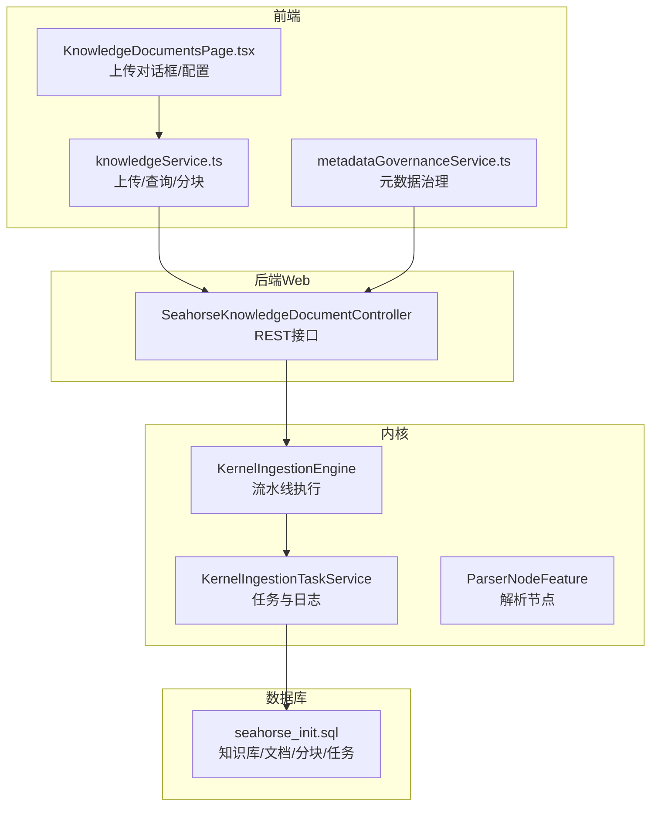
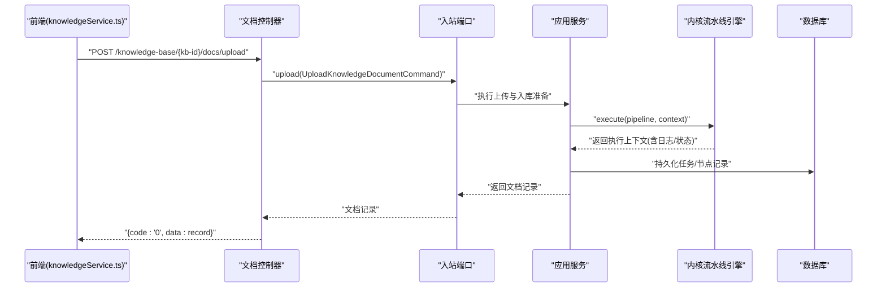
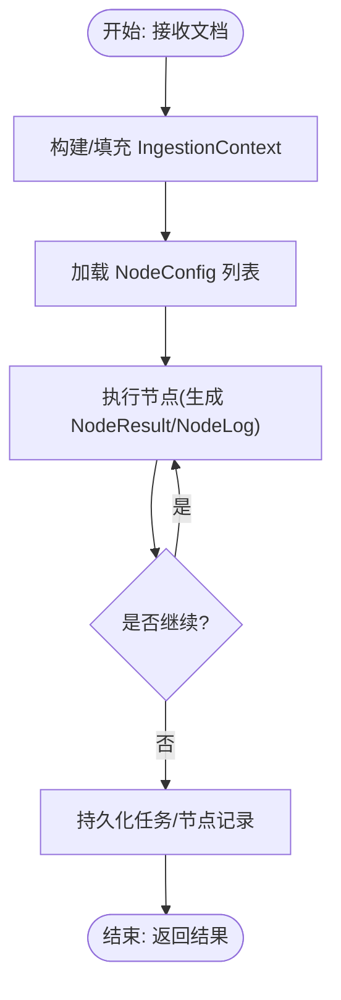
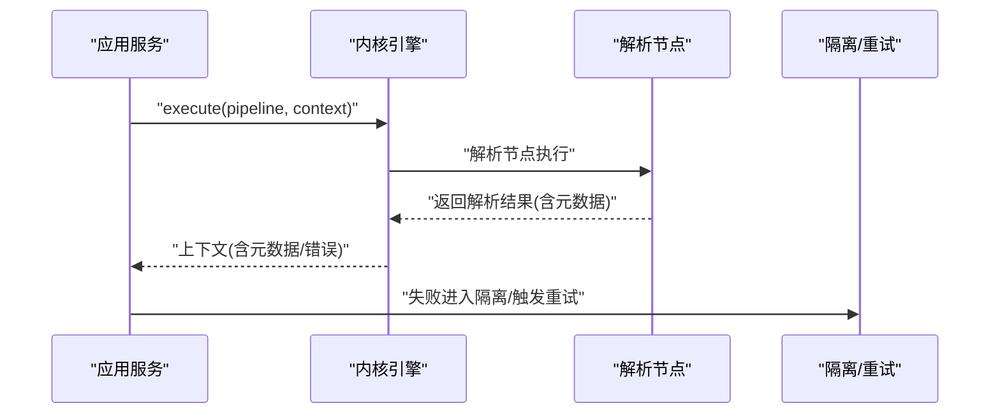
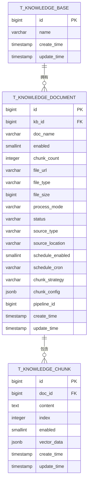
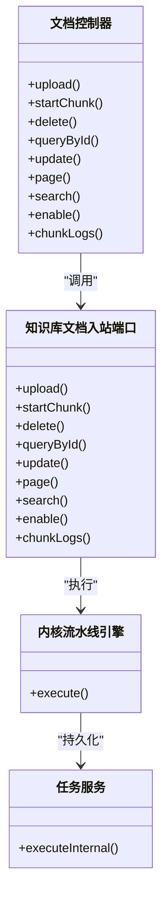

# 文档管理

<cite>
**本文引用的文件**   
- [SeahorseKnowledgeDocumentController.java](file://seahorse-agent-adapter-web/src/main/java/com/miracle/ai/seahorse/agent/adapters/web/SeahorseKnowledgeDocumentController.java)
- [SeahorseKnowledgeDocumentControllerTests.java](file://seahorse-agent-adapter-web/src/test/java/com/miracle/ai/seahorse/agent/adapters/web/SeahorseKnowledgeDocumentControllerTests.java)
- [SeahorseWebApiContractTests.java](file://seahorse-agent-tests/src/test/java/com/miracle/ai/seahorse/agent/adapters/web/SeahorseWebApiContractTests.java)
- [knowledgeService.ts](file://frontend/src/services/knowledgeService.ts)
- [KnowledgeDocumentsPage.tsx](file://frontend/src/pages/admin/knowledge/KnowledgeDocumentsPage.tsx)
- [metadataGovernanceService.ts](file://frontend/src/services/metadataGovernanceService.ts)
- [KernelIngestionEngine.java](file://seahorse-agent-kernel/src/main/java/com/miracle/ai/seahorse/agent/kernel/application/ingestion/KernelIngestionEngine.java)
- [KernelIngestionTaskService.java](file://seahorse-agent-kernel/src/main/java/com/miracle/ai/seahorse/agent/kernel/application/ingestion/KernelIngestionTaskService.java)
- [ParserNodeFeature.java](file://seahorse-agent-kernel/src/main/java/com/miracle/ai/seahorse/agent/kernel/feature/ingestion/ParserNodeFeature.java)
- [DocumentParseResult.java](file://seahorse-agent-kernel/src/main/java/com/miracle/ai/seahorse/agent/ports/outbound/ingestion/DocumentParseResult.java)
- [KernelMetadataBackfillService.java](file://seahorse-agent-kernel/src/main/java/com/miracle/ai/seahorse/agent/kernel/application/metadata/KernelMetadataBackfillService.java)
- [KernelMetadataReviewService.java](file://seahorse-agent-kernel/src/main/java/com/miracle/ai/seahorse/agent/kernel/application/metadata/KernelMetadataReviewService.java)
- [MetadataReviewInboundPort.java](file://seahorse-agent-kernel/src/main/java/com/miracle/ai/seahorse/agent/ports/inbound/metadata/MetadataReviewInboundPort.java)
- [JdbcIngestionTaskRepositoryAdapterTests.java](file://seahorse-agent-adapter-repository-jdbc/src/test/java/com/miracle/ai/seahorse/agent/adapters/repository/jdbc/JdbcIngestionTaskRepositoryAdapterTests.java)
- [seahorse_init.sql](file://resources/database/seahorse_init.sql)
- [API 接口文档.md](file://docs/zh/content/API 接口文档/API 接口文档.md)
- [文档处理领域模型.md](file://docs/zh/content/后端系统/核心内核/领域模型/文档处理领域模型.md)
- [文档处理应用服务.md](file://docs/zh/content/后端系统/核心内核/应用服务层/文档处理应用服务.md)
- [存储出站端口.md](file://docs/zh/content/后端系统/核心内核/端口接口/出站端口/存储出站端口.md)
</cite>

## 目录
1. [引言](#引言)
2. [项目结构](#项目结构)
3. [核心组件](#核心组件)
4. [架构总览](#架构总览)
5. [详细组件分析](#详细组件分析)
6. [依赖分析](#依赖分析)
7. [性能考虑](#性能考虑)
8. [故障排查指南](#故障排查指南)
9. [结论](#结论)
10. [附录](#附录)

## 引言
本文件为“文档管理”功能的全面API文档，覆盖文档上传、下载、删除、分页查询、搜索、启用/禁用、分块启动与日志查询等接口；同时涵盖文档元数据管理、状态跟踪、版本控制、解析进度与处理状态监控、错误重试机制等能力。文档还提供文件格式支持、大小限制、并发上传等配置说明，并总结文档处理流程的最佳实践与故障排除指南。

## 项目结构
- 后端Web控制器：提供REST API入口，封装业务调用与响应格式。
- 前端服务：封装HTTP请求，对接后端API，支持多文件上传、分块策略与管道选择。
- 内核应用服务：实现文档处理流水线、任务执行、节点日志与状态管理。
- 元数据治理：提供元数据抽取、审核、隔离与质量报告等能力。
- 数据库：定义知识库、文档、分块、任务与日志等核心表结构。

**图表来源**
- [SeahorseKnowledgeDocumentController.java:65-162](file://seahorse-agent-adapter-web/src/main/java/com/miracle/ai/seahorse/agent/adapters/web/SeahorseKnowledgeDocumentController.java#L65-L162)
- [knowledgeService.ts:221-264](file://frontend/src/services/knowledgeService.ts#L221-L264)
- [KernelIngestionEngine.java:79-90](file://seahorse-agent-kernel/src/main/java/com/miracle/ai/seahorse/agent/kernel/application/ingestion/KernelIngestionEngine.java#L79-L90)
- [KernelIngestionTaskService.java:128-149](file://seahorse-agent-kernel/src/main/java/com/miracle/ai/seahorse/agent/kernel/application/ingestion/KernelIngestionTaskService.java#L128-L149)
- [ParserNodeFeature.java:165-198](file://seahorse-agent-kernel/src/main/java/com/miracle/ai/seahorse/agent/kernel/feature/ingestion/ParserNodeFeature.java#L165-L198)
- [seahorse_init.sql:130-157](file://resources/database/seahorse_init.sql#L130-L157)

**章节来源**
- [API 接口文档.md:260-330](file://docs/zh/content/API 接口文档/API 接口文档.md#L260-L330)

## 核心组件
- 文档控制器：提供上传、分块、删除、查询、分页、搜索、启用/禁用、分块日志等接口。
- 前端服务：封装multipart上传、分块策略与管道参数传递。
- 内核流水线：解析、分块、向量化、索引等节点按拓扑顺序执行，支持条件与日志。
- 元数据治理：抽取结果、审核、隔离与重试，支持质量报告。
- 数据库模型：知识库、文档、分块、任务与节点日志表。

**章节来源**
- [SeahorseKnowledgeDocumentController.java:65-162](file://seahorse-agent-adapter-web/src/main/java/com/miracle/ai/seahorse/agent/adapters/web/SeahorseKnowledgeDocumentController.java#L65-L162)
- [knowledgeService.ts:221-264](file://frontend/src/services/knowledgeService.ts#L221-L264)
- [KernelIngestionEngine.java:79-90](file://seahorse-agent-kernel/src/main/java/com/miracle/ai/seahorse/agent/kernel/application/ingestion/KernelIngestionEngine.java#L79-L90)
- [KernelMetadataBackfillService.java:385-408](file://seahorse-agent-kernel/src/main/java/com/miracle/ai/seahorse/agent/kernel/application/metadata/KernelMetadataBackfillService.java#L385-L408)
- [seahorse_init.sql:130-157](file://resources/database/seahorse_init.sql#L130-L157)

## 架构总览
文档管理API采用“控制器-应用服务-内核流水线-存储/索引”的分层架构。前端通过multipart上传文件，后端控制器接收并调用入站端口，应用服务组织内核引擎执行流水线，节点特征负责具体处理（如解析），最终持久化任务与日志，支持状态查询与分块日志回溯。

**图表来源**
- [SeahorseKnowledgeDocumentController.java:65-81](file://seahorse-agent-adapter-web/src/main/java/com/miracle/ai/seahorse/agent/adapters/web/SeahorseKnowledgeDocumentController.java#L65-L81)
- [KernelIngestionEngine.java:79-90](file://seahorse-agent-kernel/src/main/java/com/miracle/ai/seahorse/agent/kernel/application/ingestion/KernelIngestionEngine.java#L79-L90)
- [KernelIngestionTaskService.java:128-149](file://seahorse-agent-kernel/src/main/java/com/miracle/ai/seahorse/agent/kernel/application/ingestion/KernelIngestionTaskService.java#L128-L149)

## 详细组件分析

### API 接口清单与说明
- 上传文档
  - 方法与路径：POST /knowledge-base/{kb-id}/docs/upload
  - 请求体：multipart/form-data，包含file字段与processMode/pipelineId等参数
  - 响应：code=0时data为文档记录
  - 前端调用：knowledgeService.ts 的上传方法
  - 单元测试覆盖：Web API契约测试与控制器测试
- 查询单个文档
  - 方法与路径：GET /knowledge-base/docs/{doc-id}
  - 响应：code=0时data为文档详情
- 更新文档
  - 方法与路径：PUT /knowledge-base/docs/{doc-id}
  - 请求体：JSON，支持docName/processMode/chunkStrategy/chunkConfig/pipelineId/sourceLocation/scheduleEnabled/scheduleCron等
- 分页查询文档
  - 方法与路径：GET /knowledge-base/{kb-id}/docs
  - 查询参数：current、size、status、keyword
- 搜索文档
  - 方法与路径：GET /knowledge-base/docs/search
  - 查询参数：keyword、limit
- 删除文档
  - 方法与路径：DELETE /knowledge-base/docs/{doc-id}
- 启用/禁用文档
  - 方法与路径：PATCH /knowledge-base/docs/{doc-id}/enable
  - 查询参数：value=true/false
- 启动分块
  - 方法与路径：POST /knowledge-base/docs/{doc-id}/chunk
- 查看分块日志
  - 方法与路径：GET /knowledge-base/docs/{doc-id}/chunk-logs
  - 查询参数：current、size

**章节来源**
- [SeahorseKnowledgeDocumentController.java:65-162](file://seahorse-agent-adapter-web/src/main/java/com/miracle/ai/seahorse/agent/adapters/web/SeahorseKnowledgeDocumentController.java#L65-L162)
- [knowledgeService.ts:221-264](file://frontend/src/services/knowledgeService.ts#L221-L264)
- [SeahorseKnowledgeDocumentControllerTests.java:48-153](file://seahorse-agent-adapter-web/src/test/java/com/miracle/ai/seahorse/agent/adapters/web/SeahorseKnowledgeDocumentControllerTests.java#L48-L153)
- [SeahorseWebApiContractTests.java:729-805](file://seahorse-agent-tests/src/test/java/com/miracle/ai/seahorse/agent/adapters/web/SeahorseWebApiContractTests.java#L729-L805)

### 前端上传与配置
- 上传对话框支持拖拽、文件选择、分块策略与管道选择
- 上传时将文件与策略参数打包为multipart/form-data
- 默认最大文件大小在页面中定义，便于前端约束

**章节来源**
- [KnowledgeDocumentsPage.tsx:1164-1741](file://frontend/src/pages/admin/knowledge/KnowledgeDocumentsPage.tsx#L1164-L1741)
- [knowledgeService.ts:221-236](file://frontend/src/services/knowledgeService.ts#L221-L236)

### 文档处理流程与状态
- 流水线执行：内核引擎按节点拓扑顺序执行，记录节点日志，失败时终止并标记失败
- 任务持久化：任务与节点日志写入数据库，支持分页查询
- 状态枚举：pending/running/completed/failed等
- 节点类型：解析(parser)、分块(chunker)、向量化(vectorizer)、索引(indexer)等

**图表来源**
- [文档处理领域模型.md:352-361](file://docs/zh/content/后端系统/核心内核/领域模型/文档处理领域模型.md#L352-L361)
- [KernelIngestionEngine.java:79-90](file://seahorse-agent-kernel/src/main/java/com/miracle/ai/seahorse/agent/kernel/application/ingestion/KernelIngestionEngine.java#L79-L90)
- [KernelIngestionTaskService.java:128-149](file://seahorse-agent-kernel/src/main/java/com/miracle/ai/seahorse/agent/kernel/application/ingestion/KernelIngestionTaskService.java#L128-L149)

**章节来源**
- [KernelIngestionEngine.java:79-108](file://seahorse-agent-kernel/src/main/java/com/miracle/ai/seahorse/agent/kernel/application/ingestion/KernelIngestionEngine.java#L79-L108)
- [KernelIngestionTaskService.java:128-149](file://seahorse-agent-kernel/src/main/java/com/miracle/ai/seahorse/agent/kernel/application/ingestion/KernelIngestionTaskService.java#L128-L149)
- [文档处理领域模型.md:352-361](file://docs/zh/content/后端系统/核心内核/领域模型/文档处理领域模型.md#L352-L361)

### 元数据管理与质量控制
- 元数据抽取：解析完成后将元数据写入上下文，用于后续索引与检索
- 审核与隔离：支持审查、纠正、忽略字段、重新提取、隔离与重试
- 质量报告：统计覆盖率、通过率、低置信度数量等指标
- 回填与重试：失败文档进入隔离队列，支持人工干预与定时重试

**图表来源**
- [KernelMetadataBackfillService.java:385-408](file://seahorse-agent-kernel/src/main/java/com/miracle/ai/seahorse/agent/kernel/application/metadata/KernelMetadataBackfillService.java#L385-L408)
- [ParserNodeFeature.java:165-198](file://seahorse-agent-kernel/src/main/java/com/miracle/ai/seahorse/agent/kernel/feature/ingestion/ParserNodeFeature.java#L165-L198)
- [DocumentParseResult.java:29-39](file://seahorse-agent-kernel/src/main/java/com/miracle/ai/seahorse/agent/ports/outbound/ingestion/DocumentParseResult.java#L29-L39)

**章节来源**
- [KernelMetadataBackfillService.java:385-408](file://seahorse-agent-kernel/src/main/java/com/miracle/ai/seahorse/agent/kernel/application/metadata/KernelMetadataBackfillService.java#L385-L408)
- [KernelMetadataReviewService.java:63-83](file://seahorse-agent-kernel/src/main/java/com/miracle/ai/seahorse/agent/kernel/application/metadata/KernelMetadataReviewService.java#L63-L83)
- [MetadataReviewInboundPort.java:27-44](file://seahorse-agent-kernel/src/main/java/com/miracle/ai/seahorse/agent/ports/inbound/metadata/MetadataReviewInboundPort.java#L27-L44)

### 数据模型与表结构
- 知识库(t_knowledge_base)：主键、名称、时间戳
- 文档(t_knowledge_document)：知识库ID、文档名、启用状态、分块数、文件URL/类型/大小、处理模式、状态、来源类型/位置、分块策略/配置、管道ID、时间戳
- 分块(t_knowledge_chunk)：主键、所属文档、内容、索引、启用状态、向量维度、时间戳
- 任务与节点日志：任务ID、节点ID、状态、耗时、消息、输出、时间戳

**图表来源**
- [seahorse_init.sql:124-157](file://resources/database/seahorse_init.sql#L124-L157)

**章节来源**
- [seahorse_init.sql:124-157](file://resources/database/seahorse_init.sql#L124-L157)

## 依赖分析
- 控制器依赖入站端口完成业务编排，统一安全拦截与异常处理
- 内核应用服务依赖对象存储、消息队列与解析/向量化适配器
- 任务持久化依赖JDBC仓库适配器，支持节点日志替换与分页

**图表来源**
- [SeahorseKnowledgeDocumentController.java:65-162](file://seahorse-agent-adapter-web/src/main/java/com/miracle/ai/seahorse/agent/adapters/web/SeahorseKnowledgeDocumentController.java#L65-L162)
- [KernelIngestionEngine.java:79-90](file://seahorse-agent-kernel/src/main/java/com/miracle/ai/seahorse/agent/kernel/application/ingestion/KernelIngestionEngine.java#L79-L90)
- [KernelIngestionTaskService.java:128-149](file://seahorse-agent-kernel/src/main/java/com/miracle/ai/seahorse/agent/kernel/application/ingestion/KernelIngestionTaskService.java#L128-L149)

**章节来源**
- [API 接口文档.md:260-330](file://docs/zh/content/API 接口文档/API 接口文档.md#L260-L330)

## 性能考虑
- 并发上传：前端可并行发起多个上传请求，后端按任务队列顺序执行，避免资源争用
- 分块策略：合理设置分块大小与重叠，平衡召回与检索性能
- 管道选择：针对不同文件类型选择最优解析与向量化配置
- 限流与背压：结合消息队列与限流策略，确保高吞吐下的稳定性
- 索引参数：向量化维度与索引类型需与硬件资源匹配

## 故障排查指南
- 上传失败
  - 检查文件大小与格式限制，确认前端multipart参数正确
  - 查看任务日志与节点日志，定位失败节点
- 解析不支持
  - 确认文件MIME类型与解析规则匹配，必要时调整管道配置
- 分块失败
  - 检查分块策略参数，确认分块日志与向量化适配器状态
- 元数据问题
  - 进入元数据审核界面，查看审查项与隔离原因，执行纠正或重试
- 重试机制
  - 隔离项支持人工解决后重试，或按计划时间自动重试

**章节来源**
- [SeahorseKnowledgeDocumentControllerTests.java:48-153](file://seahorse-agent-adapter-web/src/test/java/com/miracle/ai/seahorse/agent/adapters/web/SeahorseKnowledgeDocumentControllerTests.java#L48-L153)
- [JdbcIngestionTaskRepositoryAdapterTests.java:58-87](file://seahorse-agent-adapter-repository-jdbc/src/test/java/com/miracle/ai/seahorse/agent/adapters/repository/jdbc/JdbcIngestionTaskRepositoryAdapterTests.java#L58-L87)
- [KernelMetadataBackfillService.java:385-408](file://seahorse-agent-kernel/src/main/java/com/miracle/ai/seahorse/agent/kernel/application/metadata/KernelMetadataBackfillService.java#L385-L408)

## 结论
本文档系统化梳理了文档管理API与内核处理流程，明确了上传、分块、查询、启用/禁用、分页与搜索等接口，以及元数据治理、状态跟踪与错误重试机制。通过规范的流水线拓扑、可观测性记录与前端配置，系统能够稳定支撑文档摄取与检索场景。建议在生产环境结合消息队列与限流策略实现高吞吐与高可用，并持续优化分块与向量参数以获得最佳检索效果。

## 附录

### 文件格式支持与大小限制
- 文件格式：支持常见文档类型（如PDF、Word、Excel、PowerPoint、Markdown、纯文本等），具体识别与解析由解析节点特征与规则决定
- 大小限制：前端页面定义默认最大文件大小，后端控制器接收multipart请求，实际限制以后端与存储适配器配置为准

**章节来源**
- [ParserNodeFeature.java:165-198](file://seahorse-agent-kernel/src/main/java/com/miracle/ai/seahorse/agent/kernel/feature/ingestion/ParserNodeFeature.java#L165-L198)
- [KnowledgeDocumentsPage.tsx:1164-1741](file://frontend/src/pages/admin/knowledge/KnowledgeDocumentsPage.tsx#L1164-L1741)

### 并发上传与任务执行
- 前端可并行上传多个文件，后端按任务队列顺序执行
- 任务执行包含节点日志与错误记录，支持分页查询与回溯

**章节来源**
- [KernelIngestionTaskService.java:128-149](file://seahorse-agent-kernel/src/main/java/com/miracle/ai/seahorse/agent/kernel/application/ingestion/KernelIngestionTaskService.java#L128-L149)
- [JdbcIngestionTaskRepositoryAdapterTests.java:58-87](file://seahorse-agent-adapter-repository-jdbc/src/test/java/com/miracle/ai/seahorse/agent/adapters/repository/jdbc/JdbcIngestionTaskRepositoryAdapterTests.java#L58-L87)

### 最佳实践
- 上传前预估文件大小与分块策略，避免过大文件导致内存压力
- 为不同业务场景配置专用管道，提升解析与向量化准确性
- 定期检查元数据质量报告，及时处理低置信度与隔离项
- 使用分块日志与任务日志进行问题定位与性能优化

**章节来源**
- [文档处理应用服务.md:327-339](file://docs/zh/content/后端系统/核心内核/应用服务层/文档处理应用服务.md#L327-L339)
- [KernelMetadataQualityService.java:1-27](file://seahorse-agent-kernel/src/main/java/com/miracle/ai/seahorse/agent/kernel/application/metadata/KernelMetadataQualityService.java#L1-L27)