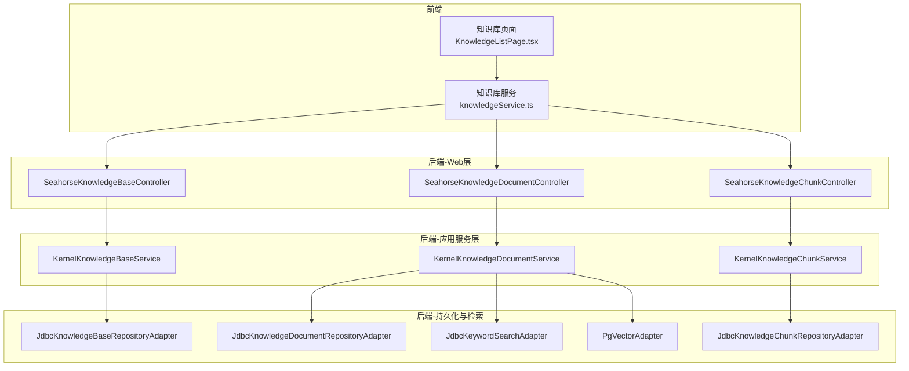
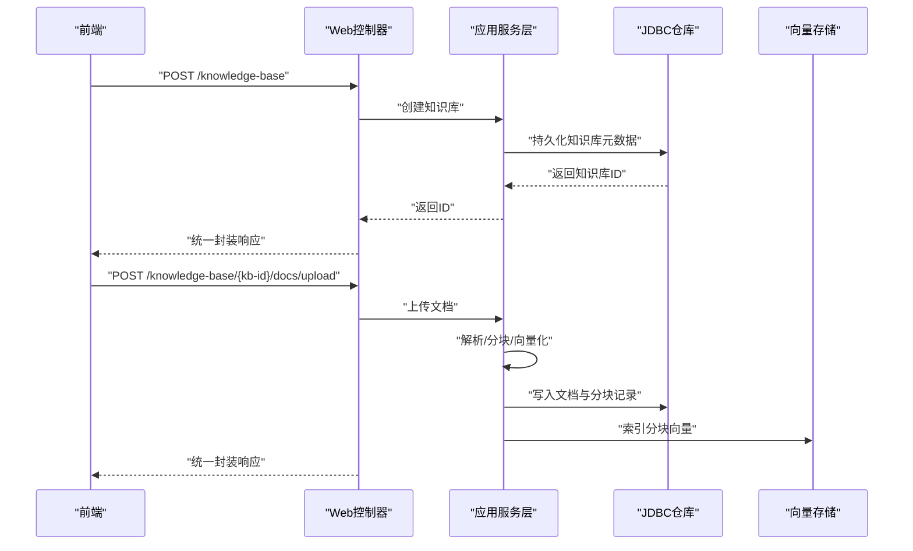
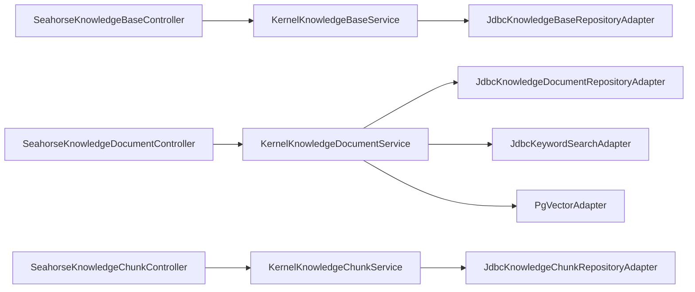
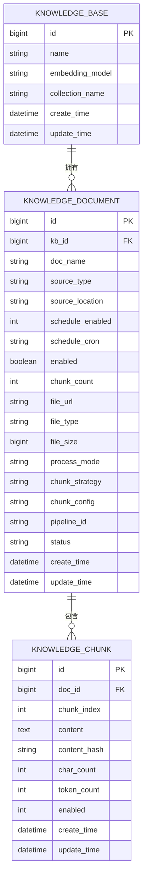

# 知识库接口

<cite>
**本文引用的文件**
- [SeahorseKnowledgeBaseController.java](file://seahorse-agent-adapter-web/src/main/java/com/miracle/ai/seahorse/agent/adapters/web/SeahorseKnowledgeBaseController.java)
- [SeahorseKnowledgeDocumentController.java](file://seahorse-agent-adapter-web/src/main/java/com/miracle/ai/seahorse/agent/adapters/web/SeahorseKnowledgeDocumentController.java)
- [SeahorseKnowledgeChunkController.java](file://seahorse-agent-adapter-web/src/main/java/com/miracle/ai/seahorse/agent/adapters/web/SeahorseKnowledgeChunkController.java)
- [KernelKnowledgeChunkService.java](file://seahorse-agent-kernel/src/main/java/com/miracle/ai/seahorse/agent/kernel/application/knowledge/KernelKnowledgeChunkService.java)
- [IndexerNodeFeature.java](file://seahorse-agent-kernel/src/main/java/com/miracle/ai/seahorse/agent/kernel/feature/ingestion/IndexerNodeFeature.java)
- [VectorGlobalSearchFeature.java](file://seahorse-agent-kernel/src/main/java/com/miracle/ai/seahorse/agent/kernel/feature/retrieval/VectorGlobalSearchFeature.java)
- [JdbcKeywordSearchAdapter.java](file://seahorse-agent-adapter-repository-jdbc/src/main/java/com/miracle/ai/seahorse/agent/adapters/repository/jdbc/JdbcKeywordSearchAdapter.java)
- [PgVectorAdapter.java](file://seahorse-agent-adapter-vector-pgvector/src/main/java/com/miracle/ai/seahorse/agent/adapters/vector/pgvector/PgVectorAdapter.java)
- [knowledgeService.ts](file://frontend/src/services/knowledgeService.ts)
- [KnowledgeListPage.tsx](file://frontend/src/pages/admin/knowledge/KnowledgeListPage.tsx)
- [ApiResponseContractTests.java](file://seahorse-agent-tests/src/test/java/com/miracle/ai/seahorse/agent/adapters/web/ApiResponseContractTests.java)
</cite>

## 目录
1. [简介](#简介)
2. [项目结构](#项目结构)
3. [核心组件](#核心组件)
4. [架构总览](#架构总览)
5. [详细组件分析](#详细组件分析)
6. [依赖关系分析](#依赖关系分析)
7. [性能考量](#性能考量)
8. [故障排查指南](#故障排查指南)
9. [结论](#结论)
10. [附录](#附录)

## 简介
本文件为 Seahorse Agent 知识库接口的权威 API 文档，覆盖知识库的创建、查询、更新、删除；文档上传、分块处理、向量化存储的完整流程；以及知识库统计信息、文档列表查询、文档内容获取等接口。文档同时给出请求参数、响应格式、文件上传规范、批量操作接口建议、最佳实践、性能优化建议、错误处理与权限控制、数据一致性保障等。

## 项目结构
知识库相关接口主要由后端 Web 控制器层暴露，经应用服务层处理，最终通过 JDBC 适配器持久化到数据库，并结合向量存储（如 PGVector/Milvus）完成检索与索引。前端通过服务层接口对接后端 API。

图表来源
- [SeahorseKnowledgeBaseController.java:58-106](file://seahorse-agent-adapter-web/src/main/java/com/miracle/ai/seahorse/agent/adapters/web/SeahorseKnowledgeBaseController.java#L58-L106)
- [SeahorseKnowledgeDocumentController.java:64-144](file://seahorse-agent-adapter-web/src/main/java/com/miracle/ai/seahorse/agent/adapters/web/SeahorseKnowledgeDocumentController.java#L64-L144)
- [SeahorseKnowledgeChunkController.java:57-93](file://seahorse-agent-adapter-web/src/main/java/com/miracle/ai/seahorse/agent/adapters/web/SeahorseKnowledgeChunkController.java#L57-L93)
- [KernelKnowledgeChunkService.java:189-226](file://seahorse-agent-kernel/src/main/java/com/miracle/ai/seahorse/agent/kernel/application/knowledge/KernelKnowledgeChunkService.java#L189-L226)
- [JdbcKeywordSearchAdapter.java:78-105](file://seahorse-agent-adapter-repository-jdbc/src/main/java/com/miracle/ai/seahorse/agent/adapters/repository/jdbc/JdbcKeywordSearchAdapter.java#L78-L105)
- [PgVectorAdapter.java:191-219](file://seahorse-agent-adapter-vector-pgvector/src/main/java/com/miracle/ai/seahorse/agent/adapters/vector/pgvector/PgVectorAdapter.java#L191-L219)

章节来源
- [SeahorseKnowledgeBaseController.java:58-106](file://seahorse-agent-adapter-web/src/main/java/com/miracle/ai/seahorse/agent/adapters/web/SeahorseKnowledgeBaseController.java#L58-L106)
- [SeahorseKnowledgeDocumentController.java:64-144](file://seahorse-agent-adapter-web/src/main/java/com/miracle/ai/seahorse/agent/adapters/web/SeahorseKnowledgeDocumentController.java#L64-L144)
- [SeahorseKnowledgeChunkController.java:57-93](file://seahorse-agent-adapter-web/src/main/java/com/miracle/ai/seahorse/agent/adapters/web/SeahorseKnowledgeChunkController.java#L57-L93)

## 核心组件
- Web 控制器层：提供 REST API 入口，负责参数校验、鉴权头解析、调用应用服务层并返回统一封装的响应体。
- 应用服务层：封装业务逻辑，协调持久化与外部能力（解析器、对象存储、向量索引）。
- 持久化层：基于 JDBC 的知识库、文档、分块表的读写。
- 检索层：关键词检索与向量检索（PGVector 等）。

章节来源
- [KernelKnowledgeChunkService.java:189-226](file://seahorse-agent-kernel/src/main/java/com/miracle/ai/seahorse/agent/kernel/application/knowledge/KernelKnowledgeChunkService.java#L189-L226)
- [JdbcKeywordSearchAdapter.java:78-105](file://seahorse-agent-adapter-repository-jdbc/src/main/java/com/miracle/ai/seahorse/agent/adapters/repository/jdbc/JdbcKeywordSearchAdapter.java#L78-L105)
- [PgVectorAdapter.java:191-219](file://seahorse-agent-adapter-vector-pgvector/src/main/java/com/miracle/ai/seahorse/agent/adapters/vector/pgvector/PgVectorAdapter.java#L191-L219)

## 架构总览
下图展示知识库从创建到检索的关键交互路径，包括文档上传、分块、向量化与入库、关键词与向量检索。

图表来源
- [SeahorseKnowledgeBaseController.java:58-106](file://seahorse-agent-adapter-web/src/main/java/com/miracle/ai/seahorse/agent/adapters/web/SeahorseKnowledgeBaseController.java#L58-L106)
- [SeahorseKnowledgeDocumentController.java:64-144](file://seahorse-agent-adapter-web/src/main/java/com/miracle/ai/seahorse/agent/adapters/web/SeahorseKnowledgeDocumentController.java#L64-L144)
- [KernelKnowledgeChunkService.java:189-226](file://seahorse-agent-kernel/src/main/java/com/miracle/ai/seahorse/agent/kernel/application/knowledge/KernelKnowledgeChunkService.java#L189-L226)
- [PgVectorAdapter.java:191-219](file://seahorse-agent-adapter-vector-pgvector/src/main/java/com/miracle/ai/seahorse/agent/adapters/vector/pgvector/PgVectorAdapter.java#L191-L219)

## 详细组件分析

### 知识库管理接口
- 创建知识库
  - 方法与路径：POST /knowledge-base
  - 请求头：可选用户标识头（用于记录操作人）
  - 请求体字段：名称、嵌入模型、集合名
  - 响应：统一封装，包含状态码与数据（知识库ID）
- 更新知识库
  - 方法与路径：PUT /knowledge-base/{kb-id}
  - 路径参数：知识库ID
  - 请求体字段：名称、嵌入模型
  - 响应：统一封装
- 删除知识库
  - 方法与路径：DELETE /knowledge-base/{kb-id}
  - 响应：统一封装
- 查询知识库详情
  - 方法与路径：GET /knowledge-base/{kb-id}
  - 响应：统一封装 + 数据（知识库详情）
- 分页查询知识库
  - 方法与路径：GET /knowledge-base
  - 查询参数：当前页、每页大小、名称关键字
  - 响应：统一封装 + 数据（分页结果）
- 获取分块策略
  - 方法与路径：GET /knowledge-base/chunk-strategies
  - 响应：统一封装 + 数据（可用分块策略列表）

章节来源
- [SeahorseKnowledgeBaseController.java:58-106](file://seahorse-agent-adapter-web/src/main/java/com/miracle/ai/seahorse/agent/adapters/web/SeahorseKnowledgeBaseController.java#L58-L106)

### 文档管理接口
- 上传文档
  - 方法与路径：POST /knowledge-base/{kb-id}/docs/upload（multipart/form-data）
  - 表单字段：文件、处理模式、流水线ID（可选）
  - 响应：统一封装 + 数据（文档记录）
- 触发分块
  - 方法与路径：POST /knowledge-base/docs/{doc-id}/chunk
  - 响应：统一封装
- 删除文档
  - 方法与路径：DELETE /knowledge-base/docs/{doc-id}
  - 响应：统一封装
- 查询文档详情
  - 方法与路径：GET /knowledge-base/docs/{doc-id}
  - 响应：统一封装 + 数据
- 更新文档
  - 方法与路径：PUT /knowledge-base/docs/{doc-id}
  - 请求体字段：启用状态、分块策略、分块配置、处理模式、流水线ID等
  - 响应：统一封装
- 分页查询知识库下的文档
  - 方法与路径：GET /knowledge-base/{kb-id}/docs
  - 查询参数：当前页、每页大小、状态、关键词
  - 响应：统一封装 + 数据
- 全局文档搜索
  - 方法与路径：GET /knowledge-base/docs/search
  - 查询参数：关键词、限制条数
  - 响应：统一封装 + 数据
- 切换文档启用状态
  - 方法与路径：PATCH /knowledge-base/docs/{doc-id}/enable
  - 查询参数：value（布尔）
  - 响应：统一封装
- 查看文档分块日志
  - 方法与路径：GET /knowledge-base/docs/{doc-id}/chunk-logs
  - 响应：统一封装 + 数据

章节来源
- [SeahorseKnowledgeDocumentController.java:64-144](file://seahorse-agent-adapter-web/src/main/java/com/miracle/ai/seahorse/agent/adapters/web/SeahorseKnowledgeDocumentController.java#L64-L144)

### 分块管理接口
- 新增分块
  - 方法与路径：POST /knowledge-base/docs/{doc-id}/chunks
  - 请求体字段：分块ID（可选）、内容、索引
  - 响应：统一封装
- 更新分块
  - 方法与路径：PUT /knowledge-base/docs/{doc-id}/chunks/{chunk-id}
  - 请求体字段：内容
  - 响应：统一封装
- 删除分块
  - 方法与路径：DELETE /knowledge-base/docs/{doc-id}/chunks/{chunk-id}
  - 响应：统一封装
- 分页查询分块
  - 方法与路径：GET /knowledge-base/docs/{doc-id}/chunks
  - 响应：统一封装 + 数据

章节来源
- [SeahorseKnowledgeChunkController.java:57-93](file://seahorse-agent-adapter-web/src/main/java/com/miracle/ai/seahorse/agent/adapters/web/SeahorseKnowledgeChunkController.java#L57-L93)

### 文件上传规范
- Content-Type：multipart/form-data
- 字段：
  - file：必填，待上传文件
  - processMode：可选，处理模式（如 pipeline）
  - pipelineId：可选，流水线ID
- 建议：
  - 前端在上传前进行文件类型与大小校验
  - 服务端根据策略选择解析器（如 Tika）与分块策略
  - 大文件建议分片上传或后台异步任务推进

章节来源
- [SeahorseKnowledgeDocumentController.java:64-81](file://seahorse-agent-adapter-web/src/main/java/com/miracle/ai/seahorse/agent/adapters/web/SeahorseKnowledgeDocumentController.java#L64-L81)

### 检索与统计
- 关键词检索：基于 JDBC 的关键词匹配与排序
- 向量检索：基于嵌入模型生成查询向量，在向量集合中检索 TopK
- 统计信息：前端聚合知识库总数、文档总数、活跃知识库数、创建者去重数

章节来源
- [JdbcKeywordSearchAdapter.java:78-105](file://seahorse-agent-adapter-repository-jdbc/src/main/java/com/miracle/ai/seahorse/agent/adapters/repository/jdbc/JdbcKeywordSearchAdapter.java#L78-L105)
- [VectorGlobalSearchFeature.java:117-151](file://seahorse-agent-kernel/src/main/java/com/miracle/ai/seahorse/agent/kernel/feature/retrieval/VectorGlobalSearchFeature.java#L117-L151)
- [KnowledgeListPage.tsx:79-136](file://frontend/src/pages/admin/knowledge/KnowledgeListPage.tsx#L79-L136)

## 依赖关系分析

图表来源
- [SeahorseKnowledgeBaseController.java:58-106](file://seahorse-agent-adapter-web/src/main/java/com/miracle/ai/seahorse/agent/adapters/web/SeahorseKnowledgeBaseController.java#L58-L106)
- [SeahorseKnowledgeDocumentController.java:64-144](file://seahorse-agent-adapter-web/src/main/java/com/miracle/ai/seahorse/agent/adapters/web/SeahorseKnowledgeDocumentController.java#L64-L144)
- [SeahorseKnowledgeChunkController.java:57-93](file://seahorse-agent-adapter-web/src/main/java/com/miracle/ai/seahorse/agent/adapters/web/SeahorseKnowledgeChunkController.java#L57-L93)

## 性能考量
- 分块策略与向量化
  - 合理设置分块大小与重叠，平衡召回与上下文长度
  - 对长文档采用流式分块与并行向量化
- 向量检索
  - 使用合适的 TopK 与过滤条件，避免全集合扫描
  - 结合关键词检索先粗排，再向量精排
- 存储与索引
  - 向量维度与索引类型需与硬件匹配
  - 定期维护向量索引，保持检索精度与性能
- 并发与限流
  - 上传与分块任务并发度受队列与锁保护
  - 对高频查询增加缓存与预热

## 故障排查指南
- 统一响应格式
  - 成功响应仅包含 code 与 data，不包含空 message 字段
  - 错误响应仅包含 code 与 message，不包含空 data 字段
- 常见问题定位
  - 404/405：检查路径参数与方法是否正确
  - 400：检查请求体字段是否缺失或类型不符
  - 500：查看后端日志与向量/存储适配器异常
- 前端辅助
  - 使用知识库统计页面观察总量与活跃度趋势
  - 通过分块日志接口定位分块与向量化异常

章节来源
- [ApiResponseContractTests.java:44-61](file://seahorse-agent-tests/src/test/java/com/miracle/ai/seahorse/agent/adapters/web/ApiResponseContractTests.java#L44-L61)
- [KnowledgeListPage.tsx:79-136](file://frontend/src/pages/admin/knowledge/KnowledgeListPage.tsx#L79-L136)

## 结论
本文档系统梳理了知识库的全生命周期接口与数据流，明确了上传、分块、向量化、检索与统计的实现要点。建议在生产环境中结合分块策略、向量索引与缓存策略进行性能优化，并通过统一响应与日志体系完善可观测性与可维护性。

## 附录

### 请求与响应约定
- 统一响应体字段
  - code：字符串，成功通常为“0”，错误为“ERROR”
  - data：对象或数组，按接口定义返回
  - message：仅在错误时出现
- 用户标识
  - 可通过请求头传入用户ID，用于记录操作人

章节来源
- [SeahorseKnowledgeBaseController.java:103-105](file://seahorse-agent-adapter-web/src/main/java/com/miracle/ai/seahorse/agent/adapters/web/SeahorseKnowledgeBaseController.java#L103-L105)
- [ApiResponseContractTests.java:44-61](file://seahorse-agent-tests/src/test/java/com/miracle/ai/seahorse/agent/adapters/web/ApiResponseContractTests.java#L44-L61)

### 数据模型与流程示意

图表来源
- [knowledgeService.ts:3-50](file://frontend/src/services/knowledgeService.ts#L3-L50)