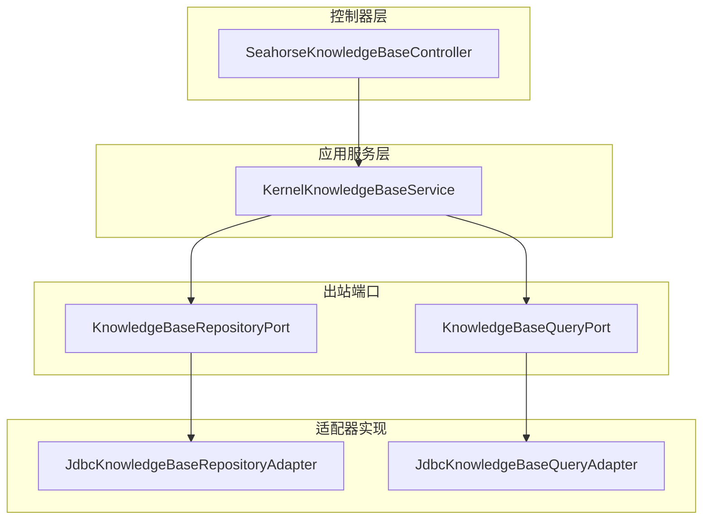
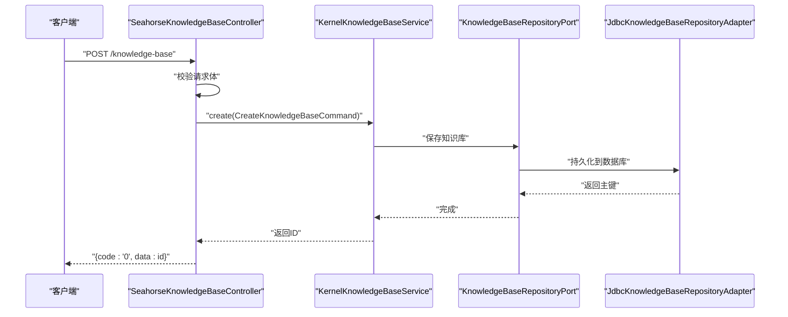
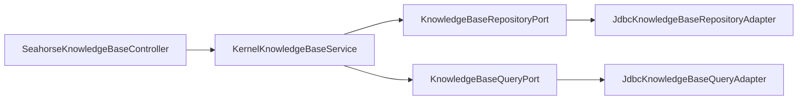

# 知识库管理

<cite>
**本文引用的文件**
- [SeahorseKnowledgeBaseController.java](file://seahorse-agent-adapter-web/src/main/java/com/miracle/ai/seahorse/agent/adapters/web/SeahorseKnowledgeBaseController.java)
- [KnowledgeBaseCreateRequest.java](file://seahorse-agent-adapter-web/src/main/java/com/miracle/ai/seahorse/agent/adapters/web/KnowledgeBaseCreateRequest.java)
- [KnowledgeBaseUpdateRequest.java](file://seahorse-agent-adapter-web/src/main/java/com/miracle/ai/seahorse/agent/adapters/web/KnowledgeBaseUpdateRequest.java)
- [KernelKnowledgeBaseService.java](file://seahorse-agent-kernel/src/main/java/com/miracle/ai/seahorse/agent/kernel/application/knowledge/KernelKnowledgeBaseService.java)
- [KnowledgeBaseInboundPort.java](file://seahorse-agent-kernel/src/main/java/com/miracle/ai/seahorse/agent/ports/inbound/knowledge/KnowledgeBaseInboundPort.java)
- [KnowledgeBaseRepositoryPort.java](file://seahorse-agent-kernel/src/main/java/com/miracle/ai/seahorse/agent/ports/outbound/knowledge/KnowledgeBaseRepositoryPort.java)
- [KnowledgeBaseQueryPort.java](file://seahorse-agent-kernel/src/main/java/com/miracle/ai/seahorse/agent/ports/outbound/knowledge/KnowledgeBaseQueryPort.java)
- [JdbcKnowledgeBaseRepositoryAdapter.java](file://seahorse-agent-adapter-repository-jdbc/src/main/java/com/miracle/ai/seahorse/agent/adapters/repository/jdbc/JdbcKnowledgeBaseRepositoryAdapter.java)
- [JdbcKnowledgeBaseQueryAdapter.java](file://seahorse-agent-adapter-repository-jdbc/src/main/java/com/miracle/ai/seahorse/agent/adapters/repository/jdbc/JdbcKnowledgeBaseQueryAdapter.java)
- [knowledgeService.ts](file://frontend/src/services/knowledgeService.ts)
- [知识库接口.md](file://docs/zh/content/API 接口文档/知识库接口.md)
- [知识库出站端口.md](file://docs/zh/content/后端系统/核心内核/端口接口/出站端口/知识库出站端口.md)
</cite>

## 目录
1. [简介](#简介)
2. [项目结构](#项目结构)
3. [核心组件](#核心组件)
4. [架构总览](#架构总览)
5. [详细组件分析](#详细组件分析)
6. [依赖关系分析](#依赖关系分析)
7. [性能考虑](#性能考虑)
8. [故障排查指南](#故障排查指南)
9. [结论](#结论)
10. [附录](#附录)

## 简介
本文件为知识库管理功能的完整API文档，覆盖知识库的创建、查询、更新、删除等核心操作，以及基本信息管理、权限控制、统计信息查询、分类与标签管理、状态控制等扩展能力。文档同时提供统一响应结构、请求参数说明、响应格式定义、错误码说明、最佳实践与性能优化建议。

## 项目结构
知识库管理采用“控制器-应用服务-出站端口-适配器”的分层架构：
- 控制器层：对外暴露REST接口，负责参数校验、构造命令并调用应用服务。
- 应用服务层：封装业务流程，协调多个出站端口完成持久化、检索与外部集成。
- 出站端口层：定义知识库、文档、向量存储、对象存储等抽象接口。
- 适配器层：具体实现数据库、向量库、解析器、存储等外部系统对接。

图表来源
- [SeahorseKnowledgeBaseController.java:59-101](file://seahorse-agent-adapter-web/src/main/java/com/miracle/ai/seahorse/agent/adapters/web/SeahorseKnowledgeBaseController.java#L59-L101)
- [KernelKnowledgeBaseService.java](file://seahorse-agent-kernel/src/main/java/com/miracle/ai/seahorse/agent/kernel/application/knowledge/KernelKnowledgeBaseService.java)
- [KnowledgeBaseRepositoryPort.java](file://seahorse-agent-kernel/src/main/java/com/miracle/ai/seahorse/agent/ports/outbound/knowledge/KnowledgeBaseRepositoryPort.java)
- [KnowledgeBaseQueryPort.java](file://seahorse-agent-kernel/src/main/java/com/miracle/ai/seahorse/agent/ports/outbound/knowledge/KnowledgeBaseQueryPort.java)
- [JdbcKnowledgeBaseRepositoryAdapter.java](file://seahorse-agent-adapter-repository-jdbc/src/main/java/com/miracle/ai/seahorse/agent/adapters/repository/jdbc/JdbcKnowledgeBaseRepositoryAdapter.java)
- [JdbcKnowledgeBaseQueryAdapter.java](file://seahorse-agent-adapter-repository-jdbc/src/main/java/com/miracle/ai/seahorse/agent/adapters/repository/jdbc/JdbcKnowledgeBaseQueryAdapter.java)

章节来源
- [SeahorseKnowledgeBaseController.java:59-101](file://seahorse-agent-adapter-web/src/main/java/com/miracle/ai/seahorse/agent/adapters/web/SeahorseKnowledgeBaseController.java#L59-L101)
- [KernelKnowledgeBaseService.java](file://seahorse-agent-kernel/src/main/java/com/miracle/ai/seahorse/agent/kernel/application/knowledge/KernelKnowledgeBaseService.java)
- [知识库出站端口.md:53-100](file://docs/zh/content/后端系统/核心内核/端口接口/出站端口/知识库出站端口.md#L53-L100)

## 核心组件
- 控制器：提供知识库的创建、更新、删除、按ID查询、分页查询、分片策略枚举等接口。
- 应用服务：封装知识库生命周期管理、权限记录、数据一致性保障等业务逻辑。
- 出站端口：定义知识库的增删改查、分页查询、统计汇总等抽象能力。
- 适配器：基于JDBC实现知识库的持久化与查询；支持向量库、对象存储等扩展。

章节来源
- [SeahorseKnowledgeBaseController.java:59-101](file://seahorse-agent-adapter-web/src/main/java/com/miracle/ai/seahorse/agent/adapters/web/SeahorseKnowledgeBaseController.java#L59-L101)
- [KernelKnowledgeBaseService.java](file://seahorse-agent-kernel/src/main/java/com/miracle/ai/seahorse/agent/kernel/application/knowledge/KernelKnowledgeBaseService.java)
- [KnowledgeBaseRepositoryPort.java](file://seahorse-agent-kernel/src/main/java/com/miracle/ai/seahorse/agent/ports/outbound/knowledge/KnowledgeBaseRepositoryPort.java)
- [KnowledgeBaseQueryPort.java](file://seahorse-agent-kernel/src/main/java/com/miracle/ai/seahorse/agent/ports/outbound/knowledge/KnowledgeBaseQueryPort.java)

## 架构总览
知识库管理遵循整洁架构，控制器仅负责HTTP协议与参数编排，业务逻辑集中在应用服务中，数据访问通过出站端口解耦，便于替换实现与测试。

图表来源
- [SeahorseKnowledgeBaseController.java:59-66](file://seahorse-agent-adapter-web/src/main/java/com/miracle/ai/seahorse/agent/adapters/web/SeahorseKnowledgeBaseController.java#L59-L66)
- [KernelKnowledgeBaseService.java](file://seahorse-agent-kernel/src/main/java/com/miracle/ai/seahorse/agent/kernel/application/knowledge/KernelKnowledgeBaseService.java)
- [KnowledgeBaseRepositoryPort.java](file://seahorse-agent-kernel/src/main/java/com/miracle/ai/seahorse/agent/ports/outbound/knowledge/KnowledgeBaseRepositoryPort.java)
- [JdbcKnowledgeBaseRepositoryAdapter.java](file://seahorse-agent-adapter-repository-jdbc/src/main/java/com/miracle/ai/seahorse/agent/adapters/repository/jdbc/JdbcKnowledgeBaseRepositoryAdapter.java)

## 详细组件分析

### 控制器层：知识库管理接口
- 创建知识库
  - 方法与路径：POST /knowledge-base
  - 请求头：X-User-Id（可选，用于记录操作人）
  - 请求体字段：name、embeddingModel、collectionName
  - 成功响应：code=0，data=id
- 更新知识库
  - 方法与路径：PUT /knowledge-base/{kb-id}
  - 路径参数：kb-id（知识库ID）
  - 请求体字段：name、embeddingModel
  - 成功响应：code=0
- 删除知识库
  - 方法与路径：DELETE /knowledge-base/{kb-id}
  - 路径参数：kb-id（知识库ID）
  - 成功响应：code=0
- 查询知识库详情
  - 方法与路径：GET /knowledge-base/{kb-id}
  - 路径参数：kb-id（知识库ID）
  - 成功响应：code=0，data=知识库对象
- 分页查询知识库
  - 方法与路径：GET /knowledge-base
  - 查询参数：current（默认1）、size（默认10）、name（可选）
  - 成功响应：code=0，data=分页结果
- 获取分片策略
  - 方法与路径：GET /knowledge-base/chunk-strategies
  - 成功响应：code=0，data=策略列表

章节来源
- [SeahorseKnowledgeBaseController.java:59-101](file://seahorse-agent-adapter-web/src/main/java/com/miracle/ai/seahorse/agent/adapters/web/SeahorseKnowledgeBaseController.java#L59-L101)
- [KnowledgeBaseCreateRequest.java](file://seahorse-agent-adapter-web/src/main/java/com/miracle/ai/seahorse/agent/adapters/web/KnowledgeBaseCreateRequest.java)
- [KnowledgeBaseUpdateRequest.java](file://seahorse-agent-adapter-web/src/main/java/com/miracle/ai/seahorse/agent/adapters/web/KnowledgeBaseUpdateRequest.java)
- [知识库接口.md:351-359](file://docs/zh/content/API 接口文档/知识库接口.md#L351-L359)

### 应用服务层：业务编排
- KernelKnowledgeBaseService负责：
  - 参数校验与命令构建
  - 权限与操作人记录
  - 调用出站端口完成持久化与查询
  - 返回标准化响应

章节来源
- [KernelKnowledgeBaseService.java](file://seahorse-agent-kernel/src/main/java/com/miracle/ai/seahorse/agent/kernel/application/knowledge/KernelKnowledgeBaseService.java)

### 出站端口层：抽象接口
- KnowledgeBaseRepositoryPort：知识库的增删改查、统计等持久化能力
- KnowledgeBaseQueryPort：知识库的分页、聚合查询等查询能力

章节来源
- [KnowledgeBaseRepositoryPort.java](file://seahorse-agent-kernel/src/main/java/com/miracle/ai/seahorse/agent/ports/outbound/knowledge/KnowledgeBaseRepositoryPort.java)
- [KnowledgeBaseQueryPort.java](file://seahorse-agent-kernel/src/main/java/com/miracle/ai/seahorse/agent/ports/outbound/knowledge/KnowledgeBaseQueryPort.java)

### 适配器层：JDBC实现
- JdbcKnowledgeBaseRepositoryAdapter：实现知识库的插入、更新、删除、按ID查询、分页查询等
- JdbcKnowledgeBaseQueryAdapter：实现分页、统计等查询能力

章节来源
- [JdbcKnowledgeBaseRepositoryAdapter.java](file://seahorse-agent-adapter-repository-jdbc/src/main/java/com/miracle/ai/seahorse/agent/adapters/repository/jdbc/JdbcKnowledgeBaseRepositoryAdapter.java)
- [JdbcKnowledgeBaseQueryAdapter.java](file://seahorse-agent-adapter-repository-jdbc/src/main/java/com/miracle/ai/seahorse/agent/adapters/repository/jdbc/JdbcKnowledgeBaseQueryAdapter.java)

### 前端类型定义与调用
- 知识库实体类型：id、name、embeddingModel、collectionName、createdBy、documentCount、createTime、updateTime
- 文档实体类型：id、kbId、docName、sourceType、sourceLocation、scheduleEnabled、scheduleCron、enabled、chunkCount、fileUrl、fileType、fileSize、processMode、chunkStrategy、chunkConfig、pipelineId、status、createdBy、updatedBy、createTime、updateTime
- 块实体类型：id、kbId、docId、chunkIndex、content、contentHash、charCount、tokenCount、enabled、createTime、updateTime
- 搜索项类型：id、kbId、docName

章节来源
- [knowledgeService.ts:3-50](file://frontend/src/services/knowledgeService.ts#L3-L50)

## 依赖关系分析
控制器通过应用服务调用出站端口，出站端口由JDBC适配器实现，形成清晰的依赖方向，降低耦合度，便于替换实现与扩展。

图表来源
- [SeahorseKnowledgeBaseController.java:59-101](file://seahorse-agent-adapter-web/src/main/java/com/miracle/ai/seahorse/agent/adapters/web/SeahorseKnowledgeBaseController.java#L59-L101)
- [KernelKnowledgeBaseService.java](file://seahorse-agent-kernel/src/main/java/com/miracle/ai/seahorse/agent/kernel/application/knowledge/KernelKnowledgeBaseService.java)
- [KnowledgeBaseRepositoryPort.java](file://seahorse-agent-kernel/src/main/java/com/miracle/ai/seahorse/agent/ports/outbound/knowledge/KnowledgeBaseRepositoryPort.java)
- [KnowledgeBaseQueryPort.java](file://seahorse-agent-kernel/src/main/java/com/miracle/ai/seahorse/agent/ports/outbound/knowledge/KnowledgeBaseQueryPort.java)
- [JdbcKnowledgeBaseRepositoryAdapter.java](file://seahorse-agent-adapter-repository-jdbc/src/main/java/com/miracle/ai/seahorse/agent/adapters/repository/jdbc/JdbcKnowledgeBaseRepositoryAdapter.java)
- [JdbcKnowledgeBaseQueryAdapter.java](file://seahorse-agent-adapter-repository-jdbc/src/main/java/com/miracle/ai/seahorse/agent/adapters/repository/jdbc/JdbcKnowledgeBaseQueryAdapter.java)

章节来源
- [知识库出站端口.md:53-100](file://docs/zh/content/后端系统/核心内核/端口接口/出站端口/知识库出站端口.md#L53-L100)

## 性能考虑
- 批处理与分页：分页查询时合理设置current与size，避免一次性加载过多数据。
- 索引与查询：确保数据库表t_knowledge_base的关键字段建立索引，提升分页与过滤效率。
- 连接池与事务：使用连接池减少连接开销，必要时将批量写入置于单个事务中以保证一致性。
- 缓存策略：对热点查询结果进行缓存，降低数据库压力。
- 异步刷新：文档刷新与关键词重建建议异步执行，避免阻塞主线程。
- 监控与告警：对慢查询、高延迟接口进行监控，及时发现性能瓶颈。

## 故障排查指南
- 统一响应结构
  - code：字符串，"0"表示成功，其他值为错误码
  - data：对象或数组，承载业务结果
- 常见问题定位
  - 参数缺失或格式错误：检查请求体字段是否完整，路径参数是否正确
  - 权限不足：确认请求头X-User-Id是否正确传递
  - 数据库异常：查看JDBC适配器日志，确认SQL执行与索引情况
  - 依赖服务不可用：检查向量库、对象存储等外部依赖状态
- 建议的日志与追踪
  - 记录请求ID、用户ID、操作时间、耗时
  - 对关键业务路径增加埋点，便于性能分析

章节来源
- [知识库接口.md:351-359](file://docs/zh/content/API 接口文档/知识库接口.md#L351-L359)

## 结论
知识库管理接口通过清晰的分层架构与标准化的出站端口，实现了稳定的增删改查与扩展能力。结合合理的性能优化与监控告警机制，可在多场景下安全、高效地支撑RAG与智能检索需求。

## 附录

### API 定义与参数说明

- 创建知识库
  - 方法与路径：POST /knowledge-base
  - 请求头：X-User-Id（可选）
  - 请求体字段
    - name：字符串，必填
    - embeddingModel：字符串，必填
    - collectionName：字符串，必填
  - 成功响应：code=0，data=id
- 更新知识库
  - 方法与路径：PUT /knowledge-base/{kb-id}
  - 路径参数：kb-id（数字）
  - 请求体字段
    - name：字符串，可选
    - embeddingModel：字符串，可选
  - 成功响应：code=0
- 删除知识库
  - 方法与路径：DELETE /knowledge-base/{kb-id}
  - 路径参数：kb-id（数字）
  - 成功响应：code=0
- 查询知识库详情
  - 方法与路径：GET /knowledge-base/{kb-id}
  - 路径参数：kb-id（数字）
  - 成功响应：code=0，data=知识库对象
- 分页查询知识库
  - 方法与路径：GET /knowledge-base
  - 查询参数
    - current：数字，可选，默认1
    - size：数字，可选，默认10
    - name：字符串，可选
  - 成功响应：code=0，data=分页结果
- 获取分片策略
  - 方法与路径：GET /knowledge-base/chunk-strategies
  - 成功响应：code=0，data=策略列表

章节来源
- [SeahorseKnowledgeBaseController.java:59-101](file://seahorse-agent-adapter-web/src/main/java/com/miracle/ai/seahorse/agent/adapters/web/SeahorseKnowledgeBaseController.java#L59-L101)
- [知识库接口.md:351-359](file://docs/zh/content/API 接口文档/知识库接口.md#L351-L359)

### 统一响应与错误码
- 统一响应结构
  - code：字符串，"0"表示成功
  - data：对象或数组，承载业务结果
- 请求头
  - X-User-Id：可选，用于记录操作人
- 错误码
  - "0"：成功
  - 其他：根据具体异常定义的错误码（如参数校验失败、数据库异常、权限不足等）

章节来源
- [知识库接口.md:351-359](file://docs/zh/content/API 接口文档/知识库接口.md#L351-L359)

### 生命周期管理最佳实践
- 创建：校验名称唯一性与模型可用性，初始化集合名，记录创建人
- 更新：仅允许更新允许变更的字段，记录变更历史
- 删除：软删除或级联清理，确保向量库与对象存储同步清理
- 查询：分页与过滤结合，避免全表扫描
- 刷新与重建：异步执行，支持重试与回滚

### 扩展功能接口建议
- 分类与标签管理：新增分类/标签实体与关联表，提供增删改查与过滤接口
- 状态控制：支持启用/禁用、审核状态、发布状态等字段与流转
- 统计信息：提供文档数量、块数量、存储用量、处理耗时等指标查询
- 权限控制：基于资源ACL与RBAC，限制知识库的可见范围与操作权限