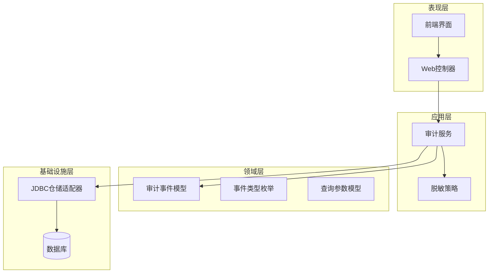
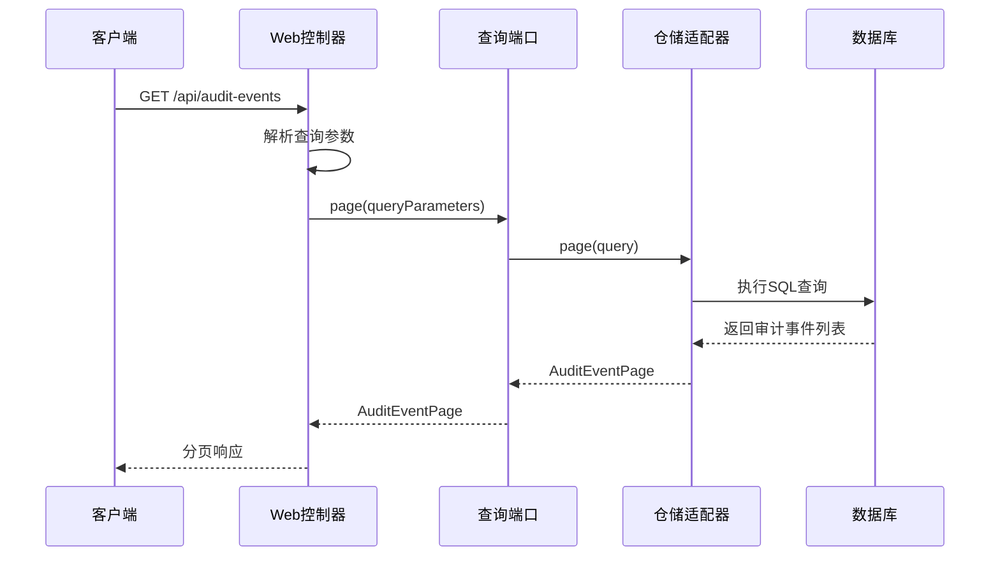
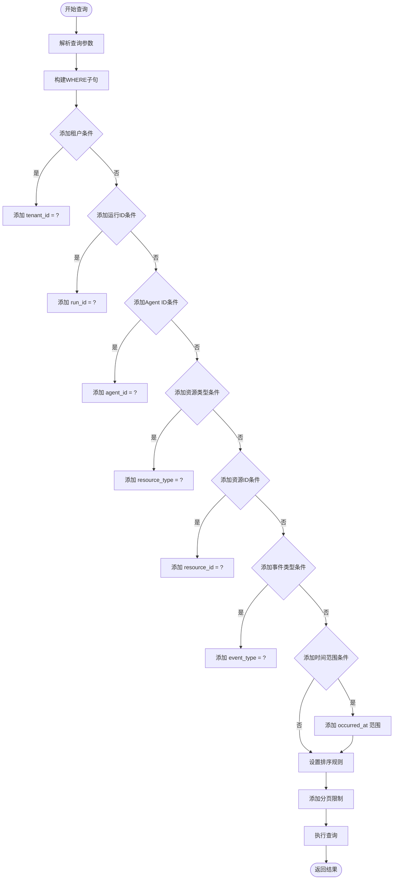
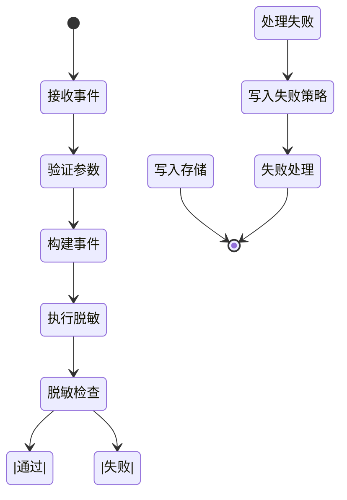
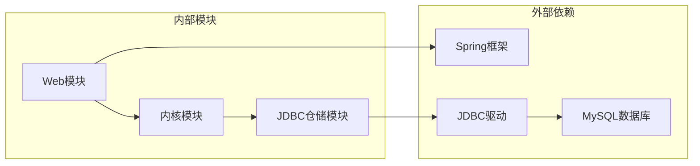

# 审计日志接口

<cite>
**本文档引用的文件**
- [SeahorseAuditEventController.java](file://seahorse-agent-adapter-web/src/main/java/com/miracle/ai/seahorse/agent/adapters/web/SeahorseAuditEventController.java)
- [AuditQueryInboundPort.java](file://seahorse-agent-kernel/src/main/java/com/miracle/ai/seahorse/agent/ports/inbound/agent/AuditQueryInboundPort.java)
- [AuditEventQuery.java](file://seahorse-agent-kernel/src/main/java/com/miracle/ai/seahorse/agent/ports/outbound/agent/AuditEventQuery.java)
- [AuditEventPage.java](file://seahorse-agent-kernel/src/main/java/com/miracle/ai/seahorse/agent/ports/outbound/agent/AuditEventPage.java)
- [AuditEventType.java](file://seahorse-agent-kernel/src/main/java/com/miracle/ai/seahorse/agent/kernel/domain/agent/audit/AuditEventType.java)
- [JdbcAuditEventRepositoryAdapter.java](file://seahorse-agent-adapter-repository-jdbc/src/main/java/com/miracle/ai/seahorse/agent/adapters/repository/jdbc/JdbcAuditEventRepositoryAdapter.java)
- [AuditWriteFailurePolicy.java](file://seahorse-agent-kernel/src/main/java/com/miracle/ai/seahorse/agent/kernel/domain/agent/audit/AuditWriteFailurePolicy.java)
- [KernelResourceAclManagementService.java](file://seahorse-agent-kernel/src/main/java/com/miracle/ai/seahorse/agent/kernel/application/agent/context/KernelResourceAclManagementService.java)
- [09-unfinished-phase-design-development-plans.md](file://docs/company-agent/ai-infra-phases/09-unfinished-phase-design-development-plans.md)
- [OA系统数据安全规范文档.md](file://resources/docs/knowledge/biz/biz-oa/OA系统数据安全规范文档.md)
- [AuditEventPage.tsx](file://frontend/src/pages/admin/audit/AuditEventPage.tsx)
- [auditCostService.ts](file://frontend/src/services/auditCostService.ts)
</cite>

## 目录
1. [简介](#简介)
2. [项目结构](#项目结构)
3. [核心组件](#核心组件)
4. [架构概览](#架构概览)
5. [详细组件分析](#详细组件分析)
6. [依赖关系分析](#依赖关系分析)
7. [性能考虑](#性能考虑)
8. [故障排除指南](#故障排除指南)
9. [结论](#结论)
10. [附录](#附录)

## 简介
本文档详细描述了系统操作审计接口，包括用户行为追踪、系统事件记录和异常日志收集功能。该审计系统提供了完整的审计事件查询接口，支持按时间范围、用户、操作类型等多种条件进行筛选查询。同时，系统还具备审计报表统计、数据导出、策略配置和清理规则等功能。

审计系统采用分层架构设计，通过领域模型定义审计事件类型和属性，应用服务负责事件的脱敏处理和持久化，仓储适配器实现具体的数据库操作，Web控制器提供RESTful API接口。

## 项目结构
审计日志系统的整体架构遵循Clean Architecture原则，分为表现层、应用层、领域层和基础设施层：



**图表来源**
- [SeahorseAuditEventController.java:31-75](file://seahorse-agent-adapter-web/src/main/java/com/miracle/ai/seahorse/agent/adapters/web/SeahorseAuditEventController.java#L31-L75)
- [KernelResourceAclManagementService.java:302-360](file://seahorse-agent-kernel/src/main/java/com/miracle/ai/seahorse/agent/kernel/application/agent/context/KernelResourceAclManagementService.java#L302-L360)

**章节来源**
- [SeahorseAuditEventController.java:1-75](file://seahorse-agent-adapter-web/src/main/java/com/miracle/ai/seahorse/agent/adapters/web/SeahorseAuditEventController.java#L1-L75)
- [09-unfinished-phase-design-development-plans.md:1362-1383](file://docs/company-agent/ai-infra-phases/09-unfinished-phase-design-development-plans.md#L1362-L1383)

## 核心组件
审计系统的核心组件包括：

### 审计事件模型
审计事件是系统审计功能的基础数据结构，包含以下关键属性：
- 审计ID：唯一标识符
- 租户ID：标识所属租户
- 事件类型：操作类型枚举
- 执行者信息：执行者类型和ID
- 资源信息：资源类型和ID
- 时间戳：事件发生时间
- 负载数据：事件详细信息

### 事件类型枚举
系统定义了丰富的事件类型，涵盖Agent生命周期、工具调用、审批决策、资源访问等关键操作场景。

### 查询参数模型
提供灵活的查询参数，支持多维度过滤和分页查询。

**章节来源**
- [AuditEvent.java](file://seahorse-agent-kernel/src/main/java/com/miracle/ai/seahorse/agent/kernel/domain/agent/audit/AuditEvent.java)
- [AuditEventType.java:20-40](file://seahorse-agent-kernel/src/main/java/com/miracle/ai/seahorse/agent/kernel/domain/agent/audit/AuditEventType.java#L20-L40)
- [AuditEventQuery.java:30-54](file://seahorse-agent-kernel/src/main/java/com/miracle/ai/seahorse/agent/ports/outbound/agent/AuditEventQuery.java#L30-L54)

## 架构概览
审计系统的整体架构采用分层设计，确保关注点分离和职责明确：

```mermaid
classDiagram
class AuditEvent {
+String auditId
+String tenantId
+AuditEventType eventType
+AuditActorType actorType
+String actorId
+AuditResourceRef resourceRef
+Instant occurredAt
+String eventJson
}
class AuditEventType {
<<enumeration>>
AGENT_PUBLISHED
RUN_STARTED
RUN_FINISHED
TOOL_INVOKED
APPROVAL_DECIDED
CONTEXT_ACCESSED
SECRET_USED
}
class AuditQueryInboundPort {
+page(tenantId, runId, agentId, resourceType,
resourceId, eventType, occurredFrom,
occurredTo, current, size) AuditEventPage
+findById(auditId) Optional~AuditEvent~
}
class JdbcAuditEventRepositoryAdapter {
+save(event) void
+page(query) AuditEventPage
+findById(auditId) Optional~AuditEvent~
-where(query) QueryParts
}
class SeahorseAuditEventController {
+page(tenantId, runId, agentId, resourceType,
resourceId, eventType, occurredFrom,
occurredTo, current, size) ApiResponse
+findById(auditId) ApiResponse
}
AuditQueryInboundPort --> JdbcAuditEventRepositoryAdapter : "使用"
SeahorseAuditEventController --> AuditQueryInboundPort : "依赖"
JdbcAuditEventRepositoryAdapter --> AuditEvent : "持久化"
```

**图表来源**
- [AuditEvent.java](file://seahorse-agent-kernel/src/main/java/com/miracle/ai/seahorse/agent/kernel/domain/agent/audit/AuditEvent.java)
- [AuditEventType.java:20-40](file://seahorse-agent-kernel/src/main/java/com/miracle/ai/seahorse/agent/kernel/domain/agent/audit/AuditEventType.java#L20-L40)
- [AuditQueryInboundPort.java:30-41](file://seahorse-agent-kernel/src/main/java/com/miracle/ai/seahorse/agent/ports/inbound/agent/AuditQueryInboundPort.java#L30-L41)
- [JdbcAuditEventRepositoryAdapter.java:91-146](file://seahorse-agent-adapter-repository-jdbc/src/main/java/com/miracle/ai/seahorse/agent/adapters/repository/jdbc/JdbcAuditEventRepositoryAdapter.java#L91-L146)
- [SeahorseAuditEventController.java:31-75](file://seahorse-agent-adapter-web/src/main/java/com/miracle/ai/seahorse/agent/adapters/web/SeahorseAuditEventController.java#L31-L75)

## 详细组件分析

### Web控制器组件
Web控制器提供RESTful API接口，负责接收客户端请求并返回响应。

#### 审计事件查询接口
提供分页查询功能，支持多种过滤条件：

**HTTP方法**: GET  
**路径**: `/api/audit-events`  
**查询参数**:
- `tenantId`: 租户ID
- `runId`: 运行ID  
- `agentId`: Agent ID
- `resourceType`: 资源类型
- `resourceId`: 资源ID
- `eventType`: 事件类型
- `occurredFrom`: 开始时间
- `occurredTo`: 结束时间
- `current`: 页码，默认1
- `size`: 页面大小，默认10

**响应**: 分页的审计事件列表

#### 单个审计事件查询接口
**HTTP方法**: GET  
**路径**: `/api/audit-events/{auditId}`  
**路径参数**:
- `auditId`: 审计事件ID

**响应**: 单个审计事件详情



**图表来源**
- [SeahorseAuditEventController.java:43-68](file://seahorse-agent-adapter-web/src/main/java/com/miracle/ai/seahorse/agent/adapters/web/SeahorseAuditEventController.java#L43-L68)
- [AuditQueryInboundPort.java:31-40](file://seahorse-agent-kernel/src/main/java/com/miracle/ai/seahorse/agent/ports/inbound/agent/AuditQueryInboundPort.java#L31-L40)

**章节来源**
- [SeahorseAuditEventController.java:31-75](file://seahorse-agent-adapter-web/src/main/java/com/miracle/ai/seahorse/agent/adapters/web/SeahorseAuditEventController.java#L31-L75)

### 仓储适配器组件
JDBC仓储适配器负责审计事件的持久化和查询操作。

#### 数据库查询实现
仓储适配器实现了灵活的WHERE子句构建机制，支持动态条件组合：



**图表来源**
- [JdbcAuditEventRepositoryAdapter.java:112-133](file://seahorse-agent-adapter-repository-jdbc/src/main/java/com/miracle/ai/seahorse/agent/adapters/repository/jdbc/JdbcAuditEventRepositoryAdapter.java#L112-L133)

#### 分页查询算法
仓储适配器实现了高效的分页查询机制：

**章节来源**
- [JdbcAuditEventRepositoryAdapter.java:91-146](file://seahorse-agent-adapter-repository-jdbc/src/main/java/com/miracle/ai/seahorse/agent/adapters/repository/jdbc/JdbcAuditEventRepositoryAdapter.java#L91-L146)

### 应用服务组件
应用服务负责审计事件的业务逻辑处理，包括数据脱敏和事件追加。

#### 审计事件追加流程
应用服务在事件写入前执行数据脱敏处理，确保敏感信息得到保护：



**图表来源**
- [KernelResourceAclManagementService.java:349-360](file://seahorse-agent-kernel/src/main/java/com/miracle/ai/seahorse/agent/kernel/application/agent/context/KernelResourceAclManagementService.java#L349-L360)

**章节来源**
- [KernelResourceAclManagementService.java:302-360](file://seahorse-agent-kernel/src/main/java/com/miracle/ai/seahorse/agent/kernel/application/agent/context/KernelResourceAclManagementService.java#L302-L360)

## 依赖关系分析



**图表来源**
- [09-unfinished-phase-design-development-plans.md:1371-1383](file://docs/company-agent/ai-infra-phases/09-unfinished-phase-design-development-plans.md#L1371-L1383)

### 组件耦合度分析
审计系统的组件具有良好的内聚性和低耦合性：

- **Web控制器**仅依赖于查询端口接口，不直接依赖具体实现
- **应用服务**专注于业务逻辑，与数据访问层分离
- **仓储适配器**实现具体的持久化逻辑，遵循接口隔离原则

**章节来源**
- [09-unfinished-phase-design-development-plans.md:1371-1383](file://docs/company-agent/ai-infra-phases/09-unfinished-phase-design-development-plans.md#L1371-L1383)

## 性能考虑
审计系统在设计时充分考虑了性能优化：

### 查询性能优化
- **索引策略**: 在常用查询字段上建立适当的数据库索引
- **分页限制**: 默认页面大小限制，防止大数据量查询
- **排序优化**: 按时间倒序排列，利用数据库索引优势

### 存储性能优化
- **批量写入**: 支持批量审计事件写入
- **异步处理**: 可选的异步审计事件处理机制
- **连接池管理**: 合理的数据库连接池配置

### 缓存策略
- **查询结果缓存**: 对频繁查询的结果进行缓存
- **配置缓存**: 审计配置信息的缓存机制

## 故障排除指南

### 常见问题及解决方案

#### 审计事件查询超时
**症状**: 审计事件查询响应时间过长  
**可能原因**:
- 缺少必要的数据库索引
- 查询条件过于宽泛
- 数据库连接池耗尽

**解决步骤**:
1. 检查数据库索引配置
2. 优化查询条件
3. 调整数据库连接池参数

#### 审计事件丢失
**症状**: 审计事件无法查询到  
**可能原因**:
- 审计事件写入失败
- 数据库事务回滚
- 审计策略配置错误

**解决步骤**:
1. 检查审计写入失败策略配置
2. 查看数据库事务状态
3. 验证审计策略设置

#### 前端界面显示异常
**症状**: 审计日志界面无法正常显示  
**可能原因**:
- API接口调用失败
- 权限不足
- 网络连接问题

**解决步骤**:
1. 检查API接口可用性
2. 验证用户权限
3. 网络连通性测试

**章节来源**
- [AuditWriteFailurePolicy.java:20-24](file://seahorse-agent-kernel/src/main/java/com/miracle/ai/seahorse/agent/kernel/domain/agent/audit/AuditWriteFailurePolicy.java#L20-L24)

## 结论
审计日志接口系统提供了完整的操作审计解决方案，具有以下特点：

1. **全面的审计覆盖**: 支持Agent生命周期、工具调用、审批决策等关键操作的审计
2. **灵活的查询能力**: 提供多维度的过滤和分页查询功能
3. **高性能设计**: 采用分层架构和优化的数据库查询策略
4. **安全可靠**: 实施数据脱敏和写入失败处理机制
5. **易于扩展**: 清晰的接口设计便于功能扩展和维护

该系统能够满足企业级应用对审计日志的需求，为合规性检查、安全分析和故障排查提供有力支持。

## 附录

### API接口规范

#### 审计事件查询接口
- **方法**: GET
- **路径**: `/api/audit-events`
- **参数**: 支持多维度过滤和分页
- **响应**: 分页的审计事件列表

#### 单个审计事件查询接口
- **方法**: GET  
- **路径**: `/api/audit-events/{auditId}`
- **参数**: 审计事件ID
- **响应**: 单个审计事件详情

### 事件类型参考
系统支持的事件类型包括：
- Agent发布和验证
- 运行启动和完成
- 工具策略决策和调用
- 审批决策
- 资源访问
- 密钥使用
- 远程Agent调用

### 前端集成
前端提供了完整的审计日志管理界面，支持：
- 审计事件列表展示
- 多条件搜索过滤
- 事件详情查看
- 分页导航

**章节来源**
- [AuditEventPage.tsx:20-168](file://frontend/src/pages/admin/audit/AuditEventPage.tsx#L20-L168)
- [auditCostService.ts:6-17](file://frontend/src/services/auditCostService.ts#L6-L17)