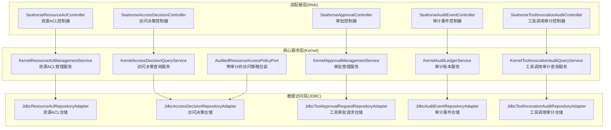
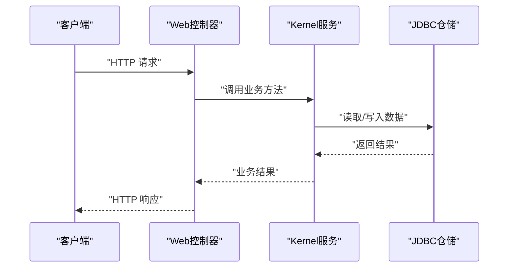
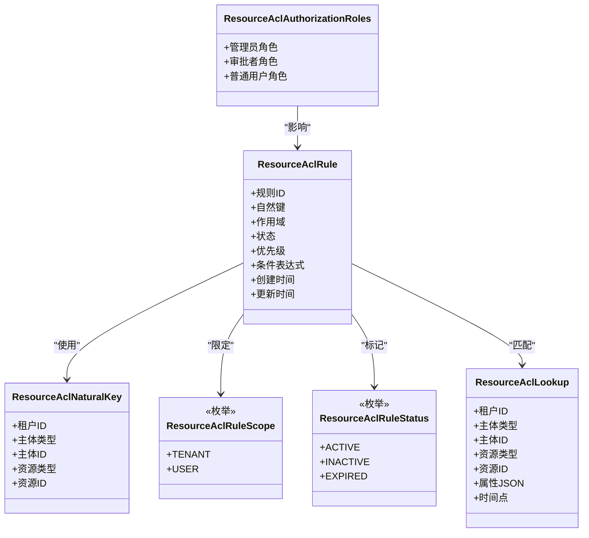
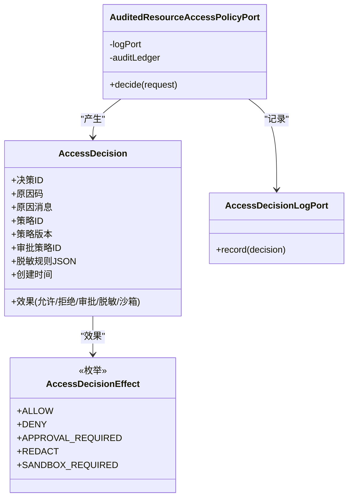
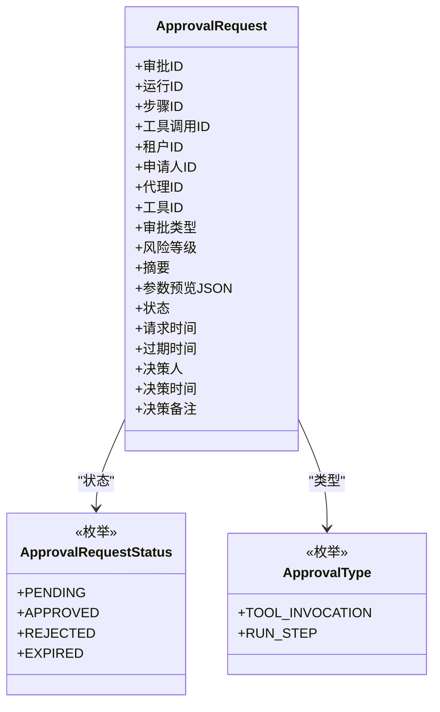
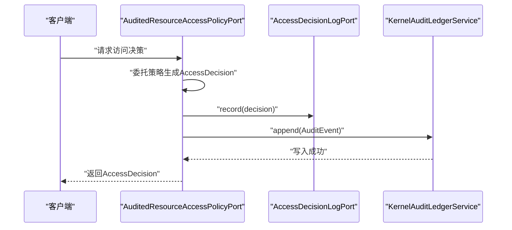
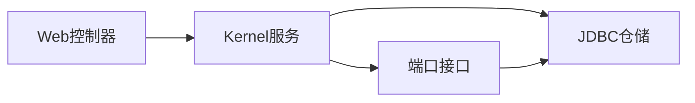

# 权限控制接口

<cite>
**本文档引用的文件**
- [SeahorseResourceAclController.java](file://seahorse-agent-adapter-web/src/main/java/com/miracle/ai/seahorse/agent/adapters/web/SeahorseResourceAclController.java)
- [KernelResourceAclManagementService.java](file://seahorse-agent-kernel/src/main/java/com/miracle/ai/seahorse/agent/kernel/application/agent/context/KernelResourceAclManagementService.java)
- [JdbcResourceAclRepositoryAdapter.java](file://seahorse-agent-adapter-repository-jdbc/src/main/java/com/miracle/ai/seahorse/agent/adapters/repository/jdbc/JdbcResourceAclRepositoryAdapter.java)
- [ResourceAclRule.java](file://seahorse-agent-kernel/src/main/java/com/miracle/ai/seahorse/agent/kernel/domain/agent/context/ResourceAclRule.java)
- [ResourceAclLookup.java](file://seahorse-agent-kernel/src/main/java/com/miracle/ai/seahorse/agent/kernel/domain/agent/context/ResourceAclLookup.java)
- [ResourceAclRuleScope.java](file://seahorse-agent-kernel/src/main/java/com/miracle/ai/seahorse/agent/kernel/domain/agent/context/ResourceAclRuleScope.java)
- [ResourceAclRuleStatus.java](file://seahorse-agent-kernel/src/main/java/com/miracle/ai/seahorse/agent/kernel/domain/agent/context/ResourceAclRuleStatus.java)
- [ResourceAclImportCommand.java](file://seahorse-agent-kernel/src/main/java/com/miracle/ai/seahorse/agent/kernel/ports/inbound/agent/ResourceAclImportCommand.java)
- [ResourceAclCreateCommand.java](file://seahorse-agent-kernel/src/main/java/com/miracle/ai/seahorse/agent/kernel/ports/inbound/agent/ResourceAclCreateCommand.java)
- [ResourceAclRulePage.java](file://seahorse-agent-kernel/src/main/java/com/miracle/ai/seahorse/agent/kernel/ports/outbound/agent/ResourceAclRulePage.java)
- [ResourceAclQuery.java](file://seahorse-agent-kernel/src/main/java/com/miracle/ai/seahorse/agent/kernel/ports/outbound/agent/ResourceAclQuery.java)
- [ResourceAclNaturalKey.java](file://seahorse-agent-kernel/src/main/java/com/miracle/ai/seahorse/agent/kernel/domain/agent/context/ResourceAclNaturalKey.java)
- [ResourceAclImportItem.java](file://seahorse-agent-kernel/src/main/java/com/miracle/ai/seahorse/agent/kernel/domain/agent/context/ResourceAclImportItem.java)
- [ResourceAclImportDryRunItem.java](file://seahorse-agent-kernel/src/main/java/com/miracle/ai/seahorse/agent/kernel/domain/agent/context/ResourceAclImportDryRunItem.java)
- [ResourceAclImportDryRunReport.java](file://seahorse-agent-kernel/src/main/java/com/miracle/ai/seahorse/agent/kernel/domain/agent/context/ResourceAclImportDryRunReport.java)
- [ResourceAclImportResult.java](file://seahorse-agent-kernel/src/main/java/com/miracle/ai/seahorse/agent/kernel/domain/agent/context/ResourceAclImportResult.java)
- [ResourceAclAuthorizationRoles.java](file://seahorse-agent-kernel/src/main/java/com/miracle/ai/seahorse/agent/kernel/domain/agent/context/ResourceAclAuthorizationRoles.java)
- [SeahorseAccessDecisionController.java](file://seahorse-agent-adapter-web/src/main/java/com/miracle/ai/seahorse/agent/adapters/web/SeahorseAccessDecisionController.java)
- [KernelAccessDecisionQueryService.java](file://seahorse-agent-kernel/src/main/java/com/miracle/ai/seahorse/agent/kernel/application/agent/context/KernelAccessDecisionQueryService.java)
- [AccessDecision.java](file://seahorse-agent-kernel/src/main/java/com/miracle/ai/seahorse/agent/kernel/domain/agent/context/AccessDecision.java)
- [AccessDecisionEffect.java](file://seahorse-agent-kernel/src/main/java/com/miracle/ai/seahorse/agent/kernel/domain/agent/context/AccessDecisionEffect.java)
- [AccessDecisionQuery.java](file://seahorse-agent-kernel/src/main/java/com/miracle/ai/seahorse/agent/kernel/ports/outbound/agent/AccessDecisionQuery.java)
- [AccessDecisionPage.java](file://seahorse-agent-kernel/src/main/java/com/miracle/ai/seahorse/agent/kernel/ports/outbound/agent/AccessDecisionPage.java)
- [AccessDecisionLogPort.java](file://seahorse-agent-kernel/src/main/java/com/miracle/ai/seahorse/agent/kernel/ports/outbound/agent/AccessDecisionLogPort.java)
- [AuditedResourceAccessPolicyPort.java](file://seahorse-agent-kernel/src/main/java/com/miracle/ai/seahorse/agent/kernel/application/agent/context/AuditedResourceAccessPolicyPort.java)
- [JdbcAccessDecisionRepositoryAdapter.java](file://seahorse-agent-adapter-repository-jdbc/src/main/java/com/miracle/ai/seahorse/agent/adapters/repository/jdbc/JdbcAccessDecisionRepositoryAdapter.java)
- [SeahorseApprovalController.java](file://seahorse-agent-adapter-web/src/main/java/com/miracle/ai/seahorse/agent/adapters/web/SeahorseApprovalController.java)
- [KernelApprovalManagementService.java](file://seahorse-agent-kernel/src/main/java/com/miracle/ai/seahorse/agent/kernel/application/agent/approval/KernelApprovalManagementService.java)
- [ApprovalRequest.java](file://seahorse-agent-kernel/src/main/java/com/miracle/ai/seahorse/agent/kernel/domain/agent/approval/ApprovalRequest.java)
- [ApprovalRequestStatus.java](file://seahorse-agent-kernel/src/main/java/com/miracle/ai/seahorse/agent/kernel/domain/agent/approval/ApprovalRequestStatus.java)
- [ApprovalType.java](file://seahorse-agent-kernel/src/main/java/com/miracle/ai/seahorse/agent/kernel/domain/agent/approval/ApprovalType.java)
- [ApprovalDecisionCommand.java](file://seahorse-agent-kernel/src/main/java/com/miracle/ai/seahorse/agent/kernel/ports/inbound/agent/ApprovalDecisionCommand.java)
- [ApprovalRequestQuery.java](file://seahorse-agent-kernel/src/main/java/com/miracle/ai/seahorse/agent/kernel/ports/outbound/agent/ApprovalRequestQuery.java)
- [ApprovalRequestPage.java](file://seahorse-agent-kernel/src/main/java/com/miracle/ai/seahorse/agent/kernel/ports/outbound/agent/ApprovalRequestPage.java)
- [JdbcToolApprovalRequestRepositoryAdapter.java](file://seahorse-agent-adapter-repository-jdbc/src/main/java/com/miracle/ai/seahorse/agent/adapters/repository/jdbc/JdbcToolApprovalRequestRepositoryAdapter.java)
- [KernelAuditLedgerService.java](file://seahorse-agent-kernel/src/main/java/com/miracle/ai/seahorse/agent/kernel/application/agent/audit/KernelAuditLedgerService.java)
- [AuditEvent.java](file://seahorse-agent-kernel/src/main/java/com/miracle/ai/seahorse/agent/kernel/domain/agent/audit/AuditEvent.java)
- [AuditEventType.java](file://seahorse-agent-kernel/src/main/java/com/miracle/ai/seahorse/agent/kernel/domain/agent/audit/AuditEventType.java)
- [AuditActorType.java](file://seahorse-agent-kernel/src/main/java/com/miracle/ai/seahorse/agent/kernel/domain/agent/audit/AuditActorType.java)
- [SeahorseAuditEventController.java](file://seahorse-agent-adapter-web/src/main/java/com/miracle/ai/seahorse/agent/adapters/web/SeahorseAuditEventController.java)
- [JdbcAuditEventRepositoryAdapter.java](file://seahorse-agent-adapter-repository-jdbc/src/main/java/com/miracle/ai/seahorse/agent/adapters/repository/jdbc/JdbcAuditEventRepositoryAdapter.java)
- [KernelToolInvocationAuditQueryService.java](file://seahorse-agent-kernel/src/main/java/com/miracle/ai/seahorse/agent/kernel/application/agent/tool/KernelToolInvocationAuditQueryService.java)
- [ToolInvocationAuditEntry.java](file://seahorse-agent-kernel/src/main/java/com/miracle/ai/seahorse/agent/kernel/domain/agent/tool/ToolInvocationAuditEntry.java)
- [ToolInvocationAuditRecord.java](file://seahorse-agent-kernel/src/main/java/com/miracle/ai/seahorse/agent/kernel/domain/agent/tool/ToolInvocationAuditRecord.java)
- [SeahorseToolInvocationAuditController.java](file://seahorse-agent-adapter-web/src/main/java/com/miracle/ai/seahorse/agent/adapters/web/SeahorseToolInvocationAuditController.java)
- [JdbcToolInvocationAuditRepositoryAdapter.java](file://seahorse-agent-adapter-repository-jdbc/src/main/java/com/miracle/ai/seahorse/agent/adapters/repository/jdbc/JdbcToolInvocationAuditRepositoryAdapter.java)
- [task-intent-draft.json](file://docs/aegis/work/2026-05-25-ai-infra-resource-acl-management/task-intent-draft.json)
- [20-checkpoint.md](file://docs/aegis/work/2026-05-25-ai-infra-access-decision-audit/20-checkpoint.md)
</cite>

## 目录
1. [简介](#简介)
2. [项目结构](#项目结构)
3. [核心组件](#核心组件)
4. [架构总览](#架构总览)
5. [详细组件分析](#详细组件分析)
6. [依赖关系分析](#依赖关系分析)
7. [性能考虑](#性能考虑)
8. [故障排查指南](#故障排查指南)
9. [结论](#结论)
10. [附录](#附录)

## 简介
本文件面向权限控制接口的使用者与维护者，系统性梳理资源访问控制（ACL）、审批管理、权限审计与查询等能力的API定义与实现要点。内容覆盖：
- 资源访问控制：ACL规则配置、权限分配、访问决策与审计
- 审批管理：审批请求创建、审批状态更新、审批历史查询
- 角色权限与用户组：授权角色定义与继承规则
- 权限验证、权限缓存与权限审计日志
- 权限策略配置、批量权限操作与权限报表查询

## 项目结构
权限控制相关代码主要分布在以下层次：
- 适配器层（Web）：对外暴露REST API控制器
- 核心服务层（Kernel）：业务逻辑与领域模型
- 数据访问层（JDBC Adapter）：持久化与查询实现
- 文档与工作项：设计目标与阶段性验证

图表来源
- [SeahorseResourceAclController.java](file://seahorse-agent-adapter-web/src/main/java/com/miracle/ai/seahorse/agent/adapters/web/SeahorseResourceAclController.java)
- [KernelResourceAclManagementService.java](file://seahorse-agent-kernel/src/main/java/com/miracle/ai/seahorse/agent/kernel/application/agent/context/KernelResourceAclManagementService.java)
- [JdbcResourceAclRepositoryAdapter.java](file://seahorse-agent-adapter-repository-jdbc/src/main/java/com/miracle/ai/seahorse/agent/adapters/repository/jdbc/JdbcResourceAclRepositoryAdapter.java)
- [SeahorseAccessDecisionController.java](file://seahorse-agent-adapter-web/src/main/java/com/miracle/ai/seahorse/agent/adapters/web/SeahorseAccessDecisionController.java)
- [KernelAccessDecisionQueryService.java](file://seahorse-agent-kernel/src/main/java/com/miracle/ai/seahorse/agent/kernel/application/agent/context/KernelAccessDecisionQueryService.java)
- [JdbcAccessDecisionRepositoryAdapter.java](file://seahorse-agent-adapter-repository-jdbc/src/main/java/com/miracle/ai/seahorse/agent/adapters/repository/jdbc/JdbcAccessDecisionRepositoryAdapter.java)
- [SeahorseApprovalController.java](file://seahorse-agent-adapter-web/src/main/java/com/miracle/ai/seahorse/agent/adapters/web/SeahorseApprovalController.java)
- [KernelApprovalManagementService.java](file://seahorse-agent-kernel/src/main/java/com/miracle/ai/seahorse/agent/kernel/application/agent/approval/KernelApprovalManagementService.java)
- [JdbcToolApprovalRequestRepositoryAdapter.java](file://seahorse-agent-adapter-repository-jdbc/src/main/java/com/miracle/ai/seahorse/agent/adapters/repository/jdbc/JdbcToolApprovalRequestRepositoryAdapter.java)
- [SeahorseAuditEventController.java](file://seahorse-agent-adapter-web/src/main/java/com/miracle/ai/seahorse/agent/adapters/web/SeahorseAuditEventController.java)
- [KernelAuditLedgerService.java](file://seahorse-agent-kernel/src/main/java/com/miracle/ai/seahorse/agent/kernel/application/agent/audit/KernelAuditLedgerService.java)
- [JdbcAuditEventRepositoryAdapter.java](file://seahorse-agent-adapter-repository-jdbc/src/main/java/com/miracle/ai/seahorse/agent/adapters/repository/jdbc/JdbcAuditEventRepositoryAdapter.java)
- [SeahorseToolInvocationAuditController.java](file://seahorse-agent-adapter-web/src/main/java/com/miracle/ai/seahorse/agent/adapters/web/SeahorseToolInvocationAuditController.java)
- [KernelToolInvocationAuditQueryService.java](file://seahorse-agent-kernel/src/main/java/com/miracle/ai/seahorse/agent/kernel/application/agent/tool/KernelToolInvocationAuditQueryService.java)
- [JdbcToolInvocationAuditRepositoryAdapter.java](file://seahorse-agent-adapter-repository-jdbc/src/main/java/com/miracle/ai/seahorse/agent/adapters/repository/jdbc/JdbcToolInvocationAuditRepositoryAdapter.java)

章节来源
- [SeahorseResourceAclController.java](file://seahorse-agent-adapter-web/src/main/java/com/miracle/ai/seahorse/agent/adapters/web/SeahorseResourceAclController.java)
- [KernelResourceAclManagementService.java](file://seahorse-agent-kernel/src/main/java/com/miracle/ai/seahorse/agent/kernel/application/agent/context/KernelResourceAclManagementService.java)
- [JdbcResourceAclRepositoryAdapter.java](file://seahorse-agent-adapter-repository-jdbc/src/main/java/com/miracle/ai/seahorse/agent/adapters/repository/jdbc/JdbcResourceAclRepositoryAdapter.java)
- [SeahorseAccessDecisionController.java](file://seahorse-agent-adapter-web/src/main/java/com/miracle/ai/seahorse/agent/adapters/web/SeahorseAccessDecisionController.java)
- [KernelAccessDecisionQueryService.java](file://seahorse-agent-kernel/src/main/java/com/miracle/ai/seahorse/agent/kernel/application/agent/context/KernelAccessDecisionQueryService.java)
- [JdbcAccessDecisionRepositoryAdapter.java](file://seahorse-agent-adapter-repository-jdbc/src/main/java/com/miracle/ai/seahorse/agent/adapters/repository/jdbc/JdbcAccessDecisionRepositoryAdapter.java)
- [SeahorseApprovalController.java](file://seahorse-agent-adapter-web/src/main/java/com/miracle/ai/seahorse/agent/adapters/web/SeahorseApprovalController.java)
- [KernelApprovalManagementService.java](file://seahorse-agent-kernel/src/main/java/com/miracle/ai/seahorse/agent/kernel/application/agent/approval/KernelApprovalManagementService.java)
- [JdbcToolApprovalRequestRepositoryAdapter.java](file://seahorse-agent-adapter-repository-jdbc/src/main/java/com/miracle/ai/seahorse/agent/adapters/repository/jdbc/JdbcToolApprovalRequestRepositoryAdapter.java)
- [SeahorseAuditEventController.java](file://seahorse-agent-adapter-web/src/main/java/com/miracle/ai/seahorse/agent/adapters/web/SeahorseAuditEventController.java)
- [KernelAuditLedgerService.java](file://seahorse-agent-kernel/src/main/java/com/miracle/ai/seahorse/agent/kernel/application/agent/audit/KernelAuditLedgerService.java)
- [JdbcAuditEventRepositoryAdapter.java](file://seahorse-agent-adapter-repository-jdbc/src/main/java/com/miracle/ai/seahorse/agent/adapters/repository/jdbc/JdbcAuditEventRepositoryAdapter.java)
- [SeahorseToolInvocationAuditController.java](file://seahorse-agent-adapter-web/src/main/java/com/miracle/ai/seahorse/agent/adapters/web/SeahorseToolInvocationAuditController.java)
- [KernelToolInvocationAuditQueryService.java](file://seahorse-agent-kernel/src/main/java/com/miracle/ai/seahorse/agent/kernel/application/agent/tool/KernelToolInvocationAuditQueryService.java)
- [JdbcToolInvocationAuditRepositoryAdapter.java](file://seahorse-agent-adapter-repository-jdbc/src/main/java/com/miracle/ai/seahorse/agent/adapters/repository/jdbc/JdbcToolInvocationAuditRepositoryAdapter.java)

## 核心组件
- 资源ACL管理
  - 控制器：SeahorseResourceAclController
  - 服务：KernelResourceAclManagementService
  - 仓储：JdbcResourceAclRepositoryAdapter
  - 关键实体：ResourceAclRule、ResourceAclLookup、ResourceAclRuleScope、ResourceAclRuleStatus、ResourceAclNaturalKey
  - 批量导入：ResourceAclImportCommand、ResourceAclImportItem、ResourceAclImportDryRunItem、ResourceAclImportDryRunReport、ResourceAclImportResult
  - 授权角色：ResourceAclAuthorizationRoles
- 访问决策与审计
  - 控制器：SeahorseAccessDecisionController
  - 查询服务：KernelAccessDecisionQueryService
  - 仓储：JdbcAccessDecisionRepositoryAdapter
  - 决策实体：AccessDecision、AccessDecisionEffect
  - 日志端口：AccessDecisionLogPort
  - 包装策略：AuditedResourceAccessPolicyPort
- 审批管理
  - 控制器：SeahorseApprovalController
  - 服务：KernelApprovalManagementService
  - 仓储：JdbcToolApprovalRequestRepositoryAdapter
  - 实体：ApprovalRequest、ApprovalRequestStatus、ApprovalType
  - 查询与分页：ApprovalRequestQuery、ApprovalRequestPage
- 审计与日志
  - 控制器：SeahorseAuditEventController、SeahorseToolInvocationAuditController
  - 服务：KernelAuditLedgerService、KernelToolInvocationAuditQueryService
  - 仓储：JdbcAuditEventRepositoryAdapter、JdbcToolInvocationAuditRepositoryAdapter
  - 实体：AuditEvent、AuditEventType、AuditActorType
  - 工具调用审计：ToolInvocationAuditEntry、ToolInvocationAuditRecord

章节来源
- [SeahorseResourceAclController.java](file://seahorse-agent-adapter-web/src/main/java/com/miracle/ai/seahorse/agent/adapters/web/SeahorseResourceAclController.java)
- [KernelResourceAclManagementService.java](file://seahorse-agent-kernel/src/main/java/com/miracle/ai/seahorse/agent/kernel/application/agent/context/KernelResourceAclManagementService.java)
- [JdbcResourceAclRepositoryAdapter.java](file://seahorse-agent-adapter-repository-jdbc/src/main/java/com/miracle/ai/seahorse/agent/adapters/repository/jdbc/JdbcResourceAclRepositoryAdapter.java)
- [ResourceAclRule.java](file://seahorse-agent-kernel/src/main/java/com/miracle/ai/seahorse/agent/kernel/domain/agent/context/ResourceAclRule.java)
- [ResourceAclLookup.java](file://seahorse-agent-kernel/src/main/java/com/miracle/ai/seahorse/agent/kernel/domain/agent/context/ResourceAclLookup.java)
- [ResourceAclRuleScope.java](file://seahorse-agent-kernel/src/main/java/com/miracle/ai/seahorse/agent/kernel/domain/agent/context/ResourceAclRuleScope.java)
- [ResourceAclRuleStatus.java](file://seahorse-agent-kernel/src/main/java/com/miracle/ai/seahorse/agent/kernel/domain/agent/context/ResourceAclRuleStatus.java)
- [ResourceAclNaturalKey.java](file://seahorse-agent-kernel/src/main/java/com/miracle/ai/seahorse/agent/kernel/domain/agent/context/ResourceAclNaturalKey.java)
- [ResourceAclImportCommand.java](file://seahorse-agent-kernel/src/main/java/com/miracle/ai/seahorse/agent/kernel/ports/inbound/agent/ResourceAclImportCommand.java)
- [ResourceAclImportItem.java](file://seahorse-agent-kernel/src/main/java/com/miracle/ai/seahorse/agent/kernel/domain/agent/context/ResourceAclImportItem.java)
- [ResourceAclImportDryRunItem.java](file://seahorse-agent-kernel/src/main/java/com/miracle/ai/seahorse/agent/kernel/domain/agent/context/ResourceAclImportDryRunItem.java)
- [ResourceAclImportDryRunReport.java](file://seahorse-agent-kernel/src/main/java/com/miracle/ai/seahorse/agent/kernel/domain/agent/context/ResourceAclImportDryRunReport.java)
- [ResourceAclImportResult.java](file://seahorse-agent-kernel/src/main/java/com/miracle/ai/seahorse/agent/kernel/domain/agent/context/ResourceAclImportResult.java)
- [ResourceAclAuthorizationRoles.java](file://seahorse-agent-kernel/src/main/java/com/miracle/ai/seahorse/agent/kernel/domain/agent/context/ResourceAclAuthorizationRoles.java)
- [SeahorseAccessDecisionController.java](file://seahorse-agent-adapter-web/src/main/java/com/miracle/ai/seahorse/agent/adapters/web/SeahorseAccessDecisionController.java)
- [KernelAccessDecisionQueryService.java](file://seahorse-agent-kernel/src/main/java/com/miracle/ai/seahorse/agent/kernel/application/agent/context/KernelAccessDecisionQueryService.java)
- [AccessDecision.java](file://seahorse-agent-kernel/src/main/java/com/miracle/ai/seahorse/agent/kernel/domain/agent/context/AccessDecision.java)
- [AccessDecisionEffect.java](file://seahorse-agent-kernel/src/main/java/com/miracle/ai/seahorse/agent/kernel/domain/agent/context/AccessDecisionEffect.java)
- [AccessDecisionLogPort.java](file://seahorse-agent-kernel/src/main/java/com/miracle/ai/seahorse/agent/kernel/ports/outbound/agent/AccessDecisionLogPort.java)
- [AuditedResourceAccessPolicyPort.java](file://seahorse-agent-kernel/src/main/java/com/miracle/ai/seahorse/agent/kernel/application/agent/context/AuditedResourceAccessPolicyPort.java)
- [JdbcAccessDecisionRepositoryAdapter.java](file://seahorse-agent-adapter-repository-jdbc/src/main/java/com/miracle/ai/seahorse/agent/adapters/repository/jdbc/JdbcAccessDecisionRepositoryAdapter.java)
- [SeahorseApprovalController.java](file://seahorse-agent-adapter-web/src/main/java/com/miracle/ai/seahorse/agent/adapters/web/SeahorseApprovalController.java)
- [KernelApprovalManagementService.java](file://seahorse-agent-kernel/src/main/java/com/miracle/ai/seahorse/agent/kernel/application/agent/approval/KernelApprovalManagementService.java)
- [ApprovalRequest.java](file://seahorse-agent-kernel/src/main/java/com/miracle/ai/seahorse/agent/kernel/domain/agent/approval/ApprovalRequest.java)
- [ApprovalRequestStatus.java](file://seahorse-agent-kernel/src/main/java/com/miracle/ai/seahorse/agent/kernel/domain/agent/approval/ApprovalRequestStatus.java)
- [ApprovalType.java](file://seahorse-agent-kernel/src/main/java/com/miracle/ai/seahorse/agent/kernel/domain/agent/approval/ApprovalType.java)
- [ApprovalRequestQuery.java](file://seahorse-agent-kernel/src/main/java/com/miracle/ai/seahorse/agent/kernel/ports/outbound/agent/ApprovalRequestQuery.java)
- [ApprovalRequestPage.java](file://seahorse-agent-kernel/src/main/java/com/miracle/ai/seahorse/agent/kernel/ports/outbound/agent/ApprovalRequestPage.java)
- [JdbcToolApprovalRequestRepositoryAdapter.java](file://seahorse-agent-adapter-repository-jdbc/src/main/java/com/miracle/ai/seahorse/agent/adapters/repository/jdbc/JdbcToolApprovalRequestRepositoryAdapter.java)
- [SeahorseAuditEventController.java](file://seahorse-agent-adapter-web/src/main/java/com/miracle/ai/seahorse/agent/adapters/web/SeahorseAuditEventController.java)
- [KernelAuditLedgerService.java](file://seahorse-agent-kernel/src/main/java/com/miracle/ai/seahorse/agent/kernel/application/agent/audit/KernelAuditLedgerService.java)
- [AuditEvent.java](file://seahorse-agent-kernel/src/main/java/com/miracle/ai/seahorse/agent/kernel/domain/agent/audit/AuditEvent.java)
- [AuditEventType.java](file://seahorse-agent-kernel/src/main/java/com/miracle/ai/seahorse/agent/kernel/domain/agent/audit/AuditEventType.java)
- [AuditActorType.java](file://seahorse-agent-kernel/src/main/java/com/miracle/ai/seahorse/agent/kernel/domain/agent/audit/AuditActorType.java)
- [JdbcAuditEventRepositoryAdapter.java](file://seahorse-agent-adapter-repository-jdbc/src/main/java/com/miracle/ai/seahorse/agent/adapters/repository/jdbc/JdbcAuditEventRepositoryAdapter.java)
- [SeahorseToolInvocationAuditController.java](file://seahorse-agent-adapter-web/src/main/java/com/miracle/ai/seahorse/agent/adapters/web/SeahorseToolInvocationAuditController.java)
- [KernelToolInvocationAuditQueryService.java](file://seahorse-agent-kernel/src/main/java/com/miracle/ai/seahorse/agent/kernel/application/agent/tool/KernelToolInvocationAuditQueryService.java)
- [ToolInvocationAuditEntry.java](file://seahorse-agent-kernel/src/main/java/com/miracle/ai/seahorse/agent/kernel/domain/agent/tool/ToolInvocationAuditEntry.java)
- [ToolInvocationAuditRecord.java](file://seahorse-agent-kernel/src/main/java/com/miracle/ai/seahorse/agent/kernel/domain/agent/tool/ToolInvocationAuditRecord.java)
- [JdbcToolInvocationAuditRepositoryAdapter.java](file://seahorse-agent-adapter-repository-jdbc/src/main/java/com/miracle/ai/seahorse/agent/adapters/repository/jdbc/JdbcToolInvocationAuditRepositoryAdapter.java)

## 架构总览
权限控制采用“控制器-服务-仓储”的分层架构，Web控制器负责HTTP请求映射，Kernel服务封装业务规则，JDBC适配器完成持久化与查询。

图表来源
- [SeahorseResourceAclController.java](file://seahorse-agent-adapter-web/src/main/java/com/miracle/ai/seahorse/agent/adapters/web/SeahorseResourceAclController.java)
- [KernelResourceAclManagementService.java](file://seahorse-agent-kernel/src/main/java/com/miracle/ai/seahorse/agent/kernel/application/agent/context/KernelResourceAclManagementService.java)
- [JdbcResourceAclRepositoryAdapter.java](file://seahorse-agent-adapter-repository-jdbc/src/main/java/com/miracle/ai/seahorse/agent/adapters/repository/jdbc/JdbcResourceAclRepositoryAdapter.java)

## 详细组件分析

### 资源访问控制接口（ACL）
- 功能范围
  - ACL规则的创建、查询、分页与生效匹配
  - 自然键去重与冲突策略
  - 批量导入与干运行（Dry Run）
  - 授权角色与继承规则
- 关键实体与关系

图表来源
- [ResourceAclRule.java](file://seahorse-agent-kernel/src/main/java/com/miracle/ai/seahorse/agent/kernel/domain/agent/context/ResourceAclRule.java)
- [ResourceAclLookup.java](file://seahorse-agent-kernel/src/main/java/com/miracle/ai/seahorse/agent/kernel/domain/agent/context/ResourceAclLookup.java)
- [ResourceAclNaturalKey.java](file://seahorse-agent-kernel/src/main/java/com/miracle/ai/seahorse/agent/kernel/domain/agent/context/ResourceAclNaturalKey.java)
- [ResourceAclRuleScope.java](file://seahorse-agent-kernel/src/main/java/com/miracle/ai/seahorse/agent/kernel/domain/agent/context/ResourceAclRuleScope.java)
- [ResourceAclRuleStatus.java](file://seahorse-agent-kernel/src/main/java/com/miracle/ai/seahorse/agent/kernel/domain/agent/context/ResourceAclRuleStatus.java)
- [ResourceAclAuthorizationRoles.java](file://seahorse-agent-kernel/src/main/java/com/miracle/ai/seahorse/agent/kernel/domain/agent/context/ResourceAclAuthorizationRoles.java)

- API概览（示例）
  - 创建ACL规则
    - 方法：POST
    - 路径：/api/resource-acls
    - 请求体：ResourceAclCreateCommand
    - 响应：ResourceAclRule
  - 查询ACL规则
    - 方法：GET
    - 路径：/api/resource-acls
    - 查询参数：ResourceAclQuery（支持分页、过滤）
    - 响应：ResourceAclRulePage
  - 导入ACL规则（批量/干运行）
    - 方法：POST
    - 路径：/api/resource-acls/import
    - 请求体：ResourceAclImportCommand
    - 响应：ResourceAclImportResult 或 ResourceAclImportDryRunReport
  - 获取有效规则
    - 方法：POST
    - 路径：/api/resource-acls/effective
    - 请求体：ResourceAclLookup
    - 响应：List<ResourceAclRule>

章节来源
- [SeahorseResourceAclController.java](file://seahorse-agent-adapter-web/src/main/java/com/miracle/ai/seahorse/agent/adapters/web/SeahorseResourceAclController.java)
- [KernelResourceAclManagementService.java](file://seahorse-agent-kernel/src/main/java/com/miracle/ai/seahorse/agent/kernel/application/agent/context/KernelResourceAclManagementService.java)
- [JdbcResourceAclRepositoryAdapter.java](file://seahorse-agent-adapter-repository-jdbc/src/main/java/com/miracle/ai/seahorse/agent/adapters/repository/jdbc/JdbcResourceAclRepositoryAdapter.java)
- [ResourceAclCreateCommand.java](file://seahorse-agent-kernel/src/main/java/com/miracle/ai/seahorse/agent/kernel/ports/inbound/agent/ResourceAclCreateCommand.java)
- [ResourceAclQuery.java](file://seahorse-agent-kernel/src/main/java/com/miracle/ai/seahorse/agent/kernel/ports/outbound/agent/ResourceAclQuery.java)
- [ResourceAclRulePage.java](file://seahorse-agent-kernel/src/main/java/com/miracle/ai/seahorse/agent/kernel/ports/outbound/agent/ResourceAclRulePage.java)
- [ResourceAclImportCommand.java](file://seahorse-agent-kernel/src/main/java/com/miracle/ai/seahorse/agent/kernel/ports/inbound/agent/ResourceAclImportCommand.java)
- [ResourceAclImportItem.java](file://seahorse-agent-kernel/src/main/java/com/miracle/ai/seahorse/agent/kernel/domain/agent/context/ResourceAclImportItem.java)
- [ResourceAclImportDryRunItem.java](file://seahorse-agent-kernel/src/main/java/com/miracle/ai/seahorse/agent/kernel/domain/agent/context/ResourceAclImportDryRunItem.java)
- [ResourceAclImportDryRunReport.java](file://seahorse-agent-kernel/src/main/java/com/miracle/ai/seahorse/agent/kernel/domain/agent/context/ResourceAclImportDryRunReport.java)
- [ResourceAclImportResult.java](file://seahorse-agent-kernel/src/main/java/com/miracle/ai/seahorse/agent/kernel/domain/agent/context/ResourceAclImportResult.java)
- [ResourceAclAuthorizationRoles.java](file://seahorse-agent-kernel/src/main/java/com/miracle/ai/seahorse/agent/kernel/domain/agent/context/ResourceAclAuthorizationRoles.java)

### 访问决策与审计接口
- 功能范围
  - 访问决策生成与记录
  - 决策日志与审计账本
  - 决策查询与分页
- 关键实体与关系

图表来源
- [AccessDecision.java](file://seahorse-agent-kernel/src/main/java/com/miracle/ai/seahorse/agent/kernel/domain/agent/context/AccessDecision.java)
- [AccessDecisionEffect.java](file://seahorse-agent-kernel/src/main/java/com/miracle/ai/seahorse/agent/kernel/domain/agent/context/AccessDecisionEffect.java)
- [AccessDecisionLogPort.java](file://seahorse-agent-kernel/src/main/java/com/miracle/ai/seahorse/agent/kernel/ports/outbound/agent/AccessDecisionLogPort.java)
- [AuditedResourceAccessPolicyPort.java](file://seahorse-agent-kernel/src/main/java/com/miracle/ai/seahorse/agent/kernel/application/agent/context/AuditedResourceAccessPolicyPort.java)

- API概览（示例）
  - 访问决策查询
    - 方法：GET
    - 路径：/api/access-decisions
    - 查询参数：AccessDecisionQuery（支持分页、过滤）
    - 响应：AccessDecisionPage
  - 访问决策审计
    - 方法：POST
    - 路径：/api/access-decisions/audit
    - 请求体：AccessDecision（触发审计写入）
    - 响应：AuditEvent

章节来源
- [SeahorseAccessDecisionController.java](file://seahorse-agent-adapter-web/src/main/java/com/miracle/ai/seahorse/agent/adapters/web/SeahorseAccessDecisionController.java)
- [KernelAccessDecisionQueryService.java](file://seahorse-agent-kernel/src/main/java/com/miracle/ai/seahorse/agent/kernel/application/agent/context/KernelAccessDecisionQueryService.java)
- [AccessDecisionQuery.java](file://seahorse-agent-kernel/src/main/java/com/miracle/ai/seahorse/agent/kernel/ports/outbound/agent/AccessDecisionQuery.java)
- [AccessDecisionPage.java](file://seahorse-agent-kernel/src/main/java/com/miracle/ai/seahorse/agent/kernel/ports/outbound/agent/AccessDecisionPage.java)
- [JdbcAccessDecisionRepositoryAdapter.java](file://seahorse-agent-adapter-repository-jdbc/src/main/java/com/miracle/ai/seahorse/agent/adapters/repository/jdbc/JdbcAccessDecisionRepositoryAdapter.java)
- [AuditedResourceAccessPolicyPort.java](file://seahorse-agent-kernel/src/main/java/com/miracle/ai/seahorse/agent/kernel/application/agent/context/AuditedResourceAccessPolicyPort.java)

### 审批管理接口
- 功能范围
  - 审批请求创建（基于工具调用或运行步骤）
  - 审批状态更新（同意/拒绝）
  - 审批历史查询（分页、过滤）
- 关键实体与关系

图表来源
- [ApprovalRequest.java](file://seahorse-agent-kernel/src/main/java/com/miracle/ai/seahorse/agent/kernel/domain/agent/approval/ApprovalRequest.java)
- [ApprovalRequestStatus.java](file://seahorse-agent-kernel/src/main/java/com/miracle/ai/seahorse/agent/kernel/domain/agent/approval/ApprovalRequestStatus.java)
- [ApprovalType.java](file://seahorse-agent-kernel/src/main/java/com/miracle/ai/seahorse/agent/kernel/domain/agent/approval/ApprovalType.java)

- API概览（示例）
  - 创建审批请求
    - 方法：POST
    - 路径：/api/approvals
    - 请求体：ApprovalRequest（含运行ID、工具调用ID、风险等级等）
    - 响应：ApprovalRequest
  - 更新审批状态
    - 方法：PATCH
    - 路径：/api/approvals/{id}/decision
    - 请求体：ApprovalDecisionCommand（含toStatus、决策人、备注）
    - 响应：ApprovalRequest
  - 查询审批历史
    - 方法：GET
    - 路径：/api/approvals
    - 查询参数：ApprovalRequestQuery（支持分页、状态过滤）
    - 响应：ApprovalRequestPage

章节来源
- [SeahorseApprovalController.java](file://seahorse-agent-adapter-web/src/main/java/com/miracle/ai/seahorse/agent/adapters/web/SeahorseApprovalController.java)
- [KernelApprovalManagementService.java](file://seahorse-agent-kernel/src/main/java/com/miracle/ai/seahorse/agent/kernel/application/agent/approval/KernelApprovalManagementService.java)
- [ApprovalRequestQuery.java](file://seahorse-agent-kernel/src/main/java/com/miracle/ai/seahorse/agent/kernel/ports/outbound/agent/ApprovalRequestQuery.java)
- [ApprovalRequestPage.java](file://seahorse-agent-kernel/src/main/java/com/miracle/ai/seahorse/agent/kernel/ports/outbound/agent/ApprovalRequestPage.java)
- [JdbcToolApprovalRequestRepositoryAdapter.java](file://seahorse-agent-adapter-repository-jdbc/src/main/java/com/miracle/ai/seahorse/agent/adapters/repository/jdbc/JdbcToolApprovalRequestRepositoryAdapter.java)

### 权限验证、权限缓存与权限审计日志
- 权限验证
  - 通过AuditedResourceAccessPolicyPort在决策后统一记录日志并写入审计账本
- 权限缓存
  - 通过AccessDecisionLogPort与审计账本实现决策结果的可追溯与复核
- 权限审计日志
  - AuditEvent记录访问上下文、决策效果与原因码，支持查询与报表

图表来源
- [AuditedResourceAccessPolicyPort.java](file://seahorse-agent-kernel/src/main/java/com/miracle/ai/seahorse/agent/kernel/application/agent/context/AuditedResourceAccessPolicyPort.java)
- [AccessDecisionLogPort.java](file://seahorse-agent-kernel/src/main/java/com/miracle/ai/seahorse/agent/kernel/ports/outbound/agent/AccessDecisionLogPort.java)
- [KernelAuditLedgerService.java](file://seahorse-agent-kernel/src/main/java/com/miracle/ai/seahorse/agent/kernel/application/agent/audit/KernelAuditLedgerService.java)
- [AuditEvent.java](file://seahorse-agent-kernel/src/main/java/com/miracle/ai/seahorse/agent/kernel/domain/agent/audit/AuditEvent.java)

章节来源
- [AuditedResourceAccessPolicyPort.java](file://seahorse-agent-kernel/src/main/java/com/miracle/ai/seahorse/agent/kernel/application/agent/context/AuditedResourceAccessPolicyPort.java)
- [AccessDecisionLogPort.java](file://seahorse-agent-kernel/src/main/java/com/miracle/ai/seahorse/agent/kernel/ports/outbound/agent/AccessDecisionLogPort.java)
- [KernelAuditLedgerService.java](file://seahorse-agent-kernel/src/main/java/com/miracle/ai/seahorse/agent/kernel/application/agent/audit/KernelAuditLedgerService.java)
- [AuditEvent.java](file://seahorse-agent-kernel/src/main/java/com/miracle/ai/seahorse/agent/kernel/domain/agent/audit/AuditEvent.java)

### 权限策略配置、批量权限操作与权限报表查询
- 权限策略配置
  - 通过ResourceAclRule配置作用域、状态、优先级与条件表达式
- 批量权限操作
  - 使用ResourceAclImportCommand进行批量导入与干运行（Dry Run）校验
- 权限报表查询
  - 通过AccessDecisionQuery与ApprovalRequestQuery进行统计与报表导出

章节来源
- [ResourceAclImportCommand.java](file://seahorse-agent-kernel/src/main/java/com/miracle/ai/seahorse/agent/kernel/ports/inbound/agent/ResourceAclImportCommand.java)
- [ResourceAclImportDryRunReport.java](file://seahorse-agent-kernel/src/main/java/com/miracle/ai/seahorse/agent/kernel/domain/agent/context/ResourceAclImportDryRunReport.java)
- [AccessDecisionQuery.java](file://seahorse-agent-kernel/src/main/java/com/miracle/ai/seahorse/agent/kernel/ports/outbound/agent/AccessDecisionQuery.java)
- [ApprovalRequestQuery.java](file://seahorse-agent-kernel/src/main/java/com/miracle/ai/seahorse/agent/kernel/ports/outbound/agent/ApprovalRequestQuery.java)

## 依赖关系分析
- 组件耦合
  - Web控制器仅依赖Kernel服务接口，降低与具体实现的耦合
  - Kernel服务依赖JDBC仓储接口，便于替换存储实现
- 外部依赖
  - JDBC仓储依赖数据库表结构与索引设计
  - 审计模块依赖审计账本与事件写入策略

图表来源
- [SeahorseResourceAclController.java](file://seahorse-agent-adapter-web/src/main/java/com/miracle/ai/seahorse/agent/adapters/web/SeahorseResourceAclController.java)
- [KernelResourceAclManagementService.java](file://seahorse-agent-kernel/src/main/java/com/miracle/ai/seahorse/agent/kernel/application/agent/context/KernelResourceAclManagementService.java)
- [JdbcResourceAclRepositoryAdapter.java](file://seahorse-agent-adapter-repository-jdbc/src/main/java/com/miracle/ai/seahorse/agent/adapters/repository/jdbc/JdbcResourceAclRepositoryAdapter.java)

章节来源
- [SeahorseResourceAclController.java](file://seahorse-agent-adapter-web/src/main/java/com/miracle/ai/seahorse/agent/adapters/web/SeahorseResourceAclController.java)
- [KernelResourceAclManagementService.java](file://seahorse-agent-kernel/src/main/java/com/miracle/ai/seahorse/agent/kernel/application/agent/context/KernelResourceAclManagementService.java)
- [JdbcResourceAclRepositoryAdapter.java](file://seahorse-agent-adapter-repository-jdbc/src/main/java/com/miracle/ai/seahorse/agent/adapters/repository/jdbc/JdbcResourceAclRepositoryAdapter.java)

## 性能考虑
- 查询优化
  - 对ACL规则与审批请求建立合适的索引，支持按租户、主体、资源、状态、时间范围快速过滤
- 写入优化
  - 审计事件采用异步写入或批量提交，避免阻塞主业务路径
- 缓存策略
  - 对热点决策结果进行短期缓存，结合审计日志保证一致性与可追溯性

## 故障排查指南
- ACL规则不生效
  - 检查ResourceAclRule的状态与有效期
  - 确认ResourceAclLookup的时间点与属性JSON是否匹配
- 审批状态异常
  - 确认审批请求当前状态与期望状态一致
  - 检查审批人权限与审批类型
- 审计缺失
  - 确认AccessDecisionLogPort已正确注入与启用
  - 检查KernelAuditLedgerService写入策略与失败处理

章节来源
- [ResourceAclRuleStatus.java](file://seahorse-agent-kernel/src/main/java/com/miracle/ai/seahorse/agent/kernel/domain/agent/context/ResourceAclRuleStatus.java)
- [ResourceAclLookup.java](file://seahorse-agent-kernel/src/main/java/com/miracle/ai/seahorse/agent/kernel/domain/agent/context/ResourceAclLookup.java)
- [ApprovalRequestStatus.java](file://seahorse-agent-kernel/src/main/java/com/miracle/ai/seahorse/agent/kernel/domain/agent/approval/ApprovalRequestStatus.java)
- [AccessDecisionLogPort.java](file://seahorse-agent-kernel/src/main/java/com/miracle/ai/seahorse/agent/kernel/ports/outbound/agent/AccessDecisionLogPort.java)
- [KernelAuditLedgerService.java](file://seahorse-agent-kernel/src/main/java/com/miracle/ai/seahorse/agent/kernel/application/agent/audit/KernelAuditLedgerService.java)

## 结论
本文档系统梳理了权限控制接口的资源ACL、访问决策、审批管理、审计与查询等能力，并给出了API概览与依赖关系图。建议在生产环境中：
- 明确ACL规则的生命周期与冲突处理策略
- 强化审批流程的权限校验与审计留痕
- 建立完善的查询与报表体系，支撑合规与运营需求

## 附录
- 设计目标与阶段性验证
  - 资源ACL管理：实现持久化与管理API闭环
  - 访问决策审计：实现审计日志与查询API切片
  - 参考文档：task-intent-draft.json、20-checkpoint.md

章节来源
- [task-intent-draft.json](file://docs/aegis/work/2026-05-25-ai-infra-resource-acl-management/task-intent-draft.json)
- [20-checkpoint.md](file://docs/aegis/work/2026-05-25-ai-infra-access-decision-audit/20-checkpoint.md)