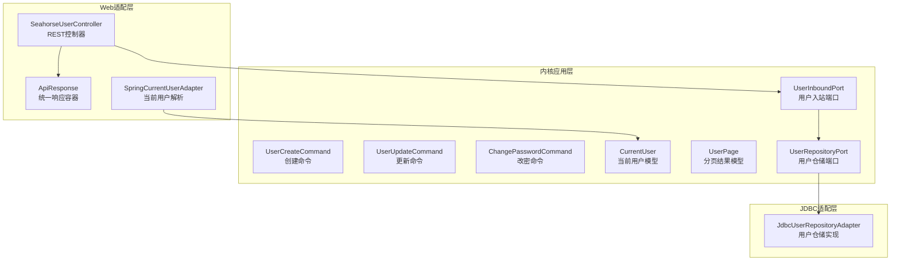
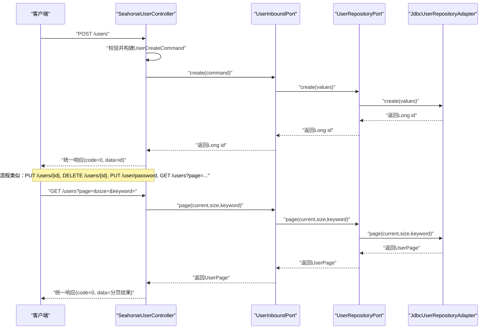
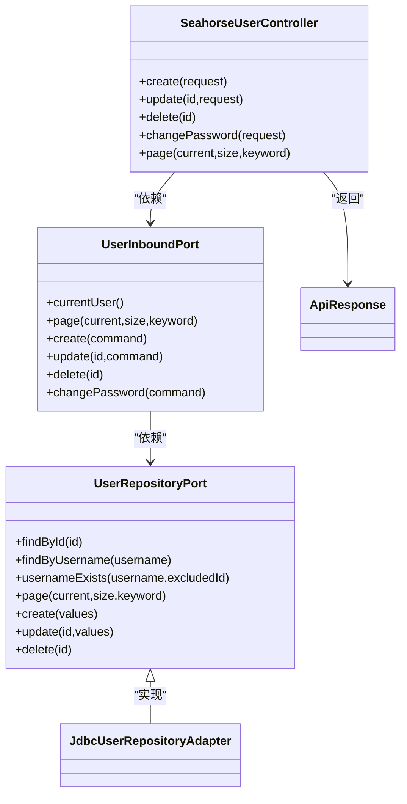

# 用户管理接口

<cite>
**本文引用的文件**
- [SeahorseUserController.java](file://seahorse-agent-adapter-web/src/main/java/com/miracle/ai/seahorse/agent/adapters/web/SeahorseUserController.java)
- [UserInboundPort.java](file://seahorse-agent-kernel/src/main/java/com/miracle/ai/seahorse/agent/ports/inbound/user/UserInboundPort.java)
- [UserCreateCommand.java](file://seahorse-agent-kernel/src/main/java/com/miracle/ai/seahorse/agent/ports/inbound/user/UserCreateCommand.java)
- [UserUpdateCommand.java](file://seahorse-agent-kernel/src/main/java/com/miracle/ai/seahorse/agent/ports/inbound/user/UserUpdateCommand.java)
- [ChangePasswordCommand.java](file://seahorse-agent-kernel/src/main/java/com/miracle/ai/seahorse/agent/ports/inbound/user/ChangePasswordCommand.java)
- [UserPasswordRequest.java](file://seahorse-agent-adapter-web/src/main/java/com/miracle/ai/seahorse/agent/adapters/web/UserPasswordRequest.java)
- [UserSaveRequest.java](file://seahorse-agent-adapter-web/src/main/java/com/miracle/ai/seahorse/agent/adapters/web/UserSaveRequest.java)
- [CurrentUser.java](file://seahorse-agent-kernel/src/main/java/com/miracle/ai/seahorse/agent/ports/outbound/auth/CurrentUser.java)
- [UserPage.java](file://seahorse-agent-kernel/src/main/java/com/miracle/ai/seahorse/agent/ports/outbound/auth/UserPage.java)
- [UserRepositoryPort.java](file://seahorse-agent-kernel/src/main/java/com/miracle/ai/seahorse/agent/ports/outbound/auth/UserRepositoryPort.java)
- [JdbcUserRepositoryAdapter.java](file://seahorse-agent-adapter-repository-jdbc/src/main/java/com/miracle/ai/seahorse/agent/adapters/repository/jdbc/JdbcUserRepositoryAdapter.java)
- [SpringCurrentUserAdapter.java](file://seahorse-agent-adapter-web/src/main/java/com/miracle/ai/seahorse/agent/adapters/web/SpringCurrentUserAdapter.java)
- [ApiResponse.java](file://seahorse-agent-adapter-web/src/main/java/com/miracle/ai/seahorse/agent/adapters/web/ApiResponse.java)
- [SeahorseUserControllerTests.java](file://seahorse-agent-adapter-web/src/test/java/com/miracle/ai/seahorse/agent/adapters/web/SeahorseUserControllerTests.java)
</cite>

## 目录
1. [简介](#简介)
2. [项目结构](#项目结构)
3. [核心组件](#核心组件)
4. [架构总览](#架构总览)
5. [详细组件分析](#详细组件分析)
6. [依赖关系分析](#依赖关系分析)
7. [性能考虑](#性能考虑)
8. [故障排查指南](#故障排查指南)
9. [结论](#结论)

## 简介
本文件为用户管理接口的完整API文档，覆盖用户CRUD操作、认证与密码修改、当前用户信息获取、分页查询、头像字段说明以及批量操作、导入导出与统计分析的扩展能力说明。所有接口均采用统一响应容器，成功返回包含业务码与数据体，错误返回包含业务码与消息体。

## 项目结构
用户管理相关代码分布在Web适配层、内核应用层与JDBC持久化适配层：
- Web适配层：提供REST接口与统一响应封装
- 内核应用层：定义用户领域命令与端口契约
- JDBC适配层：实现用户数据访问与分页查询

**图表来源**
- [SeahorseUserController.java:1-91](file://seahorse-agent-adapter-web/src/main/java/com/miracle/ai/seahorse/agent/adapters/web/SeahorseUserController.java#L1-L91)
- [UserInboundPort.java:1-36](file://seahorse-agent-kernel/src/main/java/com/miracle/ai/seahorse/agent/ports/inbound/user/UserInboundPort.java#L1-L36)
- [UserCreateCommand.java:1-21](file://seahorse-agent-kernel/src/main/java/com/miracle/ai/seahorse/agent/ports/inbound/user/UserCreateCommand.java#L1-L21)
- [UserUpdateCommand.java:1-21](file://seahorse-agent-kernel/src/main/java/com/miracle/ai/seahorse/agent/ports/inbound/user/UserUpdateCommand.java#L1-L21)
- [ChangePasswordCommand.java:1-21](file://seahorse-agent-kernel/src/main/java/com/miracle/ai/seahorse/agent/ports/inbound/user/ChangePasswordCommand.java#L1-L21)
- [CurrentUser.java:1-25](file://seahorse-agent-kernel/src/main/java/com/miracle/ai/seahorse/agent/ports/outbound/auth/CurrentUser.java#L1-L25)
- [UserPage.java:1-23](file://seahorse-agent-kernel/src/main/java/com/miracle/ai/seahorse/agent/ports/outbound/auth/UserPage.java#L1-L23)
- [UserRepositoryPort.java:1-37](file://seahorse-agent-kernel/src/main/java/com/miracle/ai/seahorse/agent/ports/outbound/auth/UserRepositoryPort.java#L1-L37)
- [JdbcUserRepositoryAdapter.java:1-29](file://seahorse-agent-adapter-repository-jdbc/src/main/java/com/miracle/ai/seahorse/agent/adapters/repository/jdbc/JdbcUserRepositoryAdapter.java#L1-L29)
- [SpringCurrentUserAdapter.java:26-73](file://seahorse-agent-adapter-web/src/main/java/com/miracle/ai/seahorse/agent/adapters/web/SpringCurrentUserAdapter.java#L26-L73)
- [ApiResponse.java:1-29](file://seahorse-agent-adapter-web/src/main/java/com/miracle/ai/seahorse/agent/adapters/web/ApiResponse.java#L1-L29)

**章节来源**
- [SeahorseUserController.java:1-91](file://seahorse-agent-adapter-web/src/main/java/com/miracle/ai/seahorse/agent/adapters/web/SeahorseUserController.java#L1-L91)
- [UserInboundPort.java:1-36](file://seahorse-agent-kernel/src/main/java/com/miracle/ai/seahorse/agent/ports/inbound/user/UserInboundPort.java#L1-L36)
- [UserRepositoryPort.java:1-37](file://seahorse-agent-kernel/src/main/java/com/miracle/ai/seahorse/agent/ports/outbound/auth/UserRepositoryPort.java#L1-L37)
- [JdbcUserRepositoryAdapter.java:1-29](file://seahorse-agent-adapter-repository-jdbc/src/main/java/com/miracle/ai/seahorse/agent/adapters/repository/jdbc/JdbcUserRepositoryAdapter.java#L1-L29)

## 核心组件
- REST控制器：提供用户CRUD、密码修改、分页查询等HTTP接口，并统一返回响应容器
- 入站端口：定义用户域操作契约，屏蔽Web与持久化细节
- 命令对象：承载请求参数，确保类型安全与可测试性
- 当前用户模型：封装登录态用户信息，支持角色判断
- 分页模型：封装列表查询结果与分页元信息
- 仓储端口与实现：抽象用户数据访问，JDBC实现负责SQL执行

**章节来源**
- [SeahorseUserController.java:1-91](file://seahorse-agent-adapter-web/src/main/java/com/miracle/ai/seahorse/agent/adapters/web/SeahorseUserController.java#L1-L91)
- [UserInboundPort.java:1-36](file://seahorse-agent-kernel/src/main/java/com/miracle/ai/seahorse/agent/ports/inbound/user/UserInboundPort.java#L1-L36)
- [UserCreateCommand.java:1-21](file://seahorse-agent-kernel/src/main/java/com/miracle/ai/seahorse/agent/ports/inbound/user/UserCreateCommand.java#L1-L21)
- [UserUpdateCommand.java:1-21](file://seahorse-agent-kernel/src/main/java/com/miracle/ai/seahorse/agent/ports/inbound/user/UserUpdateCommand.java#L1-L21)
- [ChangePasswordCommand.java:1-21](file://seahorse-agent-kernel/src/main/java/com/miracle/ai/seahorse/agent/ports/inbound/user/ChangePasswordCommand.java#L1-L21)
- [CurrentUser.java:1-25](file://seahorse-agent-kernel/src/main/java/com/miracle/ai/seahorse/agent/ports/outbound/auth/CurrentUser.java#L1-L25)
- [UserPage.java:1-23](file://seahorse-agent-kernel/src/main/java/com/miracle/ai/seahorse/agent/ports/outbound/auth/UserPage.java#L1-L23)
- [UserRepositoryPort.java:1-37](file://seahorse-agent-kernel/src/main/java/com/miracle/ai/seahorse/agent/ports/outbound/auth/UserRepositoryPort.java#L1-L37)
- [JdbcUserRepositoryAdapter.java:1-29](file://seahorse-agent-adapter-repository-jdbc/src/main/java/com/miracle/ai/seahorse/agent/adapters/repository/jdbc/JdbcUserRepositoryAdapter.java#L1-L29)

## 架构总览
用户管理接口遵循Clean Architecture分层，Web层仅处理HTTP与响应封装，业务逻辑由内核应用层的入站端口承接，持久化通过仓储端口与JDBC实现解耦。

**图表来源**
- [SeahorseUserController.java:57-90](file://seahorse-agent-adapter-web/src/main/java/com/miracle/ai/seahorse/agent/adapters/web/SeahorseUserController.java#L57-L90)
- [UserInboundPort.java:23-36](file://seahorse-agent-kernel/src/main/java/com/miracle/ai/seahorse/agent/ports/inbound/user/UserInboundPort.java#L23-L36)
- [UserRepositoryPort.java:22-37](file://seahorse-agent-kernel/src/main/java/com/miracle/ai/seahorse/agent/ports/outbound/auth/UserRepositoryPort.java#L22-L37)
- [JdbcUserRepositoryAdapter.java:1-29](file://seahorse-agent-adapter-repository-jdbc/src/main/java/com/miracle/ai/seahorse/agent/adapters/repository/jdbc/JdbcUserRepositoryAdapter.java#L1-L29)

## 详细组件分析

### REST接口清单与规范

- 创建用户
  - 方法与路径：POST /users
  - 请求体：UserSaveRequest（见“请求参数”）
  - 成功响应：统一响应，data为新用户ID（Long）
  - 错误响应：统一响应，code为错误码，message为错误描述
  - 示例：参见单元测试用例路径
    - [SeahorseUserControllerTests.java:82-99](file://seahorse-agent-adapter-web/src/test/java/com/miracle/ai/seahorse/agent/adapters/web/SeahorseUserControllerTests.java#L82-L99)

- 更新用户
  - 方法与路径：PUT /users/{id}
  - 路径参数：id（String，需可解析为Long）
  - 请求体：UserSaveRequest（见“请求参数”）
  - 成功响应：统一响应，无data或data为空
  - 错误响应：统一响应，code为错误码
  - 示例：参见单元测试用例路径
    - [SeahorseUserControllerTests.java:101-121](file://seahorse-agent-adapter-web/src/test/java/com/miracle/ai/seahorse/agent/adapters/web/SeahorseUserControllerTests.java#L101-L121)

- 删除用户
  - 方法与路径：DELETE /users/{id}
  - 路径参数：id（String，需可解析为Long）
  - 成功响应：统一响应，无data或data为空
  - 错误响应：统一响应，code为错误码
  - 示例：参见单元测试用例路径
    - [SeahorseUserControllerTests.java:123-134](file://seahorse-agent-adapter-web/src/test/java/com/miracle/ai/seahorse/agent/adapters/web/SeahorseUserControllerTests.java#L123-L134)

- 修改密码
  - 方法与路径：PUT /user/password
  - 请求体：UserPasswordRequest（见“请求参数”）
  - 成功响应：统一响应，无data或data为空
  - 错误响应：统一响应，code为错误码
  - 示例：参见单元测试用例路径
    - [SeahorseUserControllerTests.java:136-146](file://seahorse-agent-adapter-web/src/test/java/com/miracle/ai/seahorse/agent/adapters/web/SeahorseUserControllerTests.java#L136-L146)

- 分页查询用户
  - 方法与路径：GET /users
  - 查询参数：page（current，默认1）、size（默认10）、keyword（可选）
  - 成功响应：统一响应，data为UserPage（见“响应格式”）
  - 错误响应：统一响应，code为错误码
  - 示例：参见单元测试用例路径
    - [SeahorseUserControllerTests.java:66-81](file://seahorse-agent-adapter-web/src/test/java/com/miracle/ai/seahorse/agent/adapters/web/SeahorseUserControllerTests.java#L66-L81)

- 获取当前用户信息
  - 方法与路径：GET /user/current
  - 认证要求：需在请求头携带用户标识（X-User-Id）
  - 成功响应：统一响应，data为CurrentUser（见“响应格式”）
  - 错误响应：统一响应，code为错误码
  - 实现参考：SpringCurrentUserAdapter基于X-User-Id解析当前用户
    - [SpringCurrentUserAdapter.java:26-73](file://seahorse-agent-adapter-web/src/main/java/com/miracle/ai/seahorse/agent/adapters/web/SpringCurrentUserAdapter.java#L26-L73)

**章节来源**
- [SeahorseUserController.java:57-90](file://seahorse-agent-adapter-web/src/main/java/com/miracle/ai/seahorse/agent/adapters/web/SeahorseUserController.java#L57-L90)
- [SeahorseUserControllerTests.java:66-146](file://seahorse-agent-adapter-web/src/test/java/com/miracle/ai/seahorse/agent/adapters/web/SeahorseUserControllerTests.java#L66-L146)
- [SpringCurrentUserAdapter.java:26-73](file://seahorse-agent-adapter-web/src/main/java/com/miracle/ai/seahorse/agent/adapters/web/SpringCurrentUserAdapter.java#L26-L73)

### 请求参数

- UserSaveRequest
  - 字段：username（字符串，必填）、password（字符串，必填）、role（字符串，必填）、avatar（字符串，可选）
  - 用途：创建与更新用户时的请求载荷
  - 参考：
    - [UserSaveRequest.java](file://seahorse-agent-adapter-web/src/main/java/com/miracle/ai/seahorse/agent/adapters/web/UserSaveRequest.java)

- UserPasswordRequest
  - 字段：currentPassword（字符串，必填）、newPassword（字符串，必填）
  - 用途：修改密码时的请求载荷
  - 参考：
    - [UserPasswordRequest.java](file://seahorse-agent-adapter-web/src/main/java/com/miracle/ai/seahorse/agent/adapters/web/UserPasswordRequest.java)

- UserCreateCommand
  - 字段：username（字符串）、password（字符串）、role（字符串）、avatar（字符串）
  - 用途：内核应用层创建用户的命令对象
  - 参考：
    - [UserCreateCommand.java:1-21](file://seahorse-agent-kernel/src/main/java/com/miracle/ai/seahorse/agent/ports/inbound/user/UserCreateCommand.java#L1-L21)

- UserUpdateCommand
  - 字段：username（字符串）、password（字符串）、role（字符串）、avatar（字符串）
  - 用途：内核应用层更新用户的命令对象
  - 参考：
    - [UserUpdateCommand.java:1-21](file://seahorse-agent-kernel/src/main/java/com/miracle/ai/seahorse/agent/ports/inbound/user/UserUpdateCommand.java#L1-L21)

- ChangePasswordCommand
  - 字段：currentPassword（字符串）、newPassword（字符串）
  - 用途：内核应用层修改密码的命令对象
  - 参考：
    - [ChangePasswordCommand.java:1-21](file://seahorse-agent-kernel/src/main/java/com/miracle/ai/seahorse/agent/ports/inbound/user/ChangePasswordCommand.java#L1-L21)

**章节来源**
- [UserSaveRequest.java](file://seahorse-agent-adapter-web/src/main/java/com/miracle/ai/seahorse/agent/adapters/web/UserSaveRequest.java)
- [UserPasswordRequest.java](file://seahorse-agent-adapter-web/src/main/java/com/miracle/ai/seahorse/agent/adapters/web/UserPasswordRequest.java)
- [UserCreateCommand.java:1-21](file://seahorse-agent-kernel/src/main/java/com/miracle/ai/seahorse/agent/ports/inbound/user/UserCreateCommand.java#L1-L21)
- [UserUpdateCommand.java:1-21](file://seahorse-agent-kernel/src/main/java/com/miracle/ai/seahorse/agent/ports/inbound/user/UserUpdateCommand.java#L1-L21)
- [ChangePasswordCommand.java:1-21](file://seahorse-agent-kernel/src/main/java/com/miracle/ai/seahorse/agent/ports/inbound/user/ChangePasswordCommand.java#L1-L21)

### 响应格式

- 统一响应容器
  - 字段：code（字符串，成功为"0"）、message（字符串，错误时存在）、data（任意，成功时存在）
  - 规则：成功响应不包含null字段，错误响应不包含null字段
  - 参考：
    - [ApiResponse.java:1-29](file://seahorse-agent-adapter-web/src/main/java/com/miracle/ai/seahorse/agent/adapters/web/ApiResponse.java#L1-L29)

- 当前用户 CurrentUser
  - 字段：userId（Long）、username（字符串）、role（字符串）、avatar（字符串）
  - 方法：hasRole(expectedRole)（布尔）
  - 参考：
    - [CurrentUser.java:1-25](file://seahorse-agent-kernel/src/main/java/com/miracle/ai/seahorse/agent/ports/outbound/auth/CurrentUser.java#L1-L25)

- 分页结果 UserPage
  - 字段：records（列表，元素为UserRecord）、total（总数）、size（每页大小）、current（当前页）、pages（总页数）
  - 参考：
    - [UserPage.java:1-23](file://seahorse-agent-kernel/src/main/java/com/miracle/ai/seahorse/agent/ports/outbound/auth/UserPage.java#L1-L23)

- 用户仓储端口 UserRepositoryPort
  - 方法：findById、findByUsername、usernameExists、page、create、update、delete
  - 参考：
    - [UserRepositoryPort.java:1-37](file://seahorse-agent-kernel/src/main/java/com/miracle/ai/seahorse/agent/ports/outbound/auth/UserRepositoryPort.java#L1-L37)

- JDBC用户仓储实现 JdbcUserRepositoryAdapter
  - 功能：基于JDBC实现用户数据访问与分页查询
  - 参考：
    - [JdbcUserRepositoryAdapter.java:1-29](file://seahorse-agent-adapter-repository-jdbc/src/main/java/com/miracle/ai/seahorse/agent/adapters/repository/jdbc/JdbcUserRepositoryAdapter.java#L1-L29)

**章节来源**
- [ApiResponse.java:1-29](file://seahorse-agent-adapter-web/src/main/java/com/miracle/ai/seahorse/agent/adapters/web/ApiResponse.java#L1-L29)
- [CurrentUser.java:1-25](file://seahorse-agent-kernel/src/main/java/com/miracle/ai/seahorse/agent/ports/outbound/auth/CurrentUser.java#L1-L25)
- [UserPage.java:1-23](file://seahorse-agent-kernel/src/main/java/com/miracle/ai/seahorse/agent/ports/outbound/auth/UserPage.java#L1-L23)
- [UserRepositoryPort.java:1-37](file://seahorse-agent-kernel/src/main/java/com/miracle/ai/seahorse/agent/ports/outbound/auth/UserRepositoryPort.java#L1-L37)
- [JdbcUserRepositoryAdapter.java:1-29](file://seahorse-agent-adapter-repository-jdbc/src/main/java/com/miracle/ai/seahorse/agent/adapters/repository/jdbc/JdbcUserRepositoryAdapter.java#L1-L29)

### 错误码与处理
- 成功码：统一为"0"
- 错误码：当发生错误时，统一响应的code为错误码字符串，message为错误描述
- 处理机制：Web层通过统一响应容器输出，避免重复样板代码

**章节来源**
- [ApiResponse.java:1-29](file://seahorse-agent-adapter-web/src/main/java/com/miracle/ai/seahorse/agent/adapters/web/ApiResponse.java#L1-L29)
- [SeahorseUserController.java:57-90](file://seahorse-agent-adapter-web/src/main/java/com/miracle/ai/seahorse/agent/adapters/web/SeahorseUserController.java#L57-L90)

### 使用示例
以下为典型调用流程与期望响应结构（以JSON形式示意）：

- 创建用户
  - 请求：POST /users
  - 请求体：{"username":"admin","password":"secret","role":"ADMIN","avatar":"avatar.png"}
  - 响应：{"code":"0","data":1}

- 更新用户
  - 请求：PUT /users/1
  - 请求体：{"username":"admin-updated","password":"newpass","role":"USER","avatar":"new-avatar.png"}
  - 响应：{"code":"0"}

- 删除用户
  - 请求：DELETE /users/1
  - 响应：{"code":"0"}

- 修改密码
  - 请求：PUT /user/password
  - 请求体：{"currentPassword":"old-pass","newPassword":"new-pass"}
  - 响应：{"code":"0"}

- 分页查询用户
  - 请求：GET /users?page=1&size=10&keyword=ali
  - 响应：{"code":"0","data":{"records":[],"total":0,"size":10,"current":1,"pages":0}}

- 获取当前用户
  - 请求：GET /user/current（需设置请求头 X-User-Id: 用户ID）
  - 响应：{"code":"0","data":{"userId":1,"username":"admin","role":"ADMIN","avatar":"..."}}

**章节来源**
- [SeahorseUserControllerTests.java:82-146](file://seahorse-agent-adapter-web/src/test/java/com/miracle/ai/seahorse/agent/adapters/web/SeahorseUserControllerTests.java#L82-L146)
- [SpringCurrentUserAdapter.java:26-73](file://seahorse-agent-adapter-web/src/main/java/com/miracle/ai/seahorse/agent/adapters/web/SpringCurrentUserAdapter.java#L26-L73)

### 批量操作、导入导出与统计分析
- 批量操作：当前未提供批量创建/更新/删除的专用接口，建议通过循环调用单条接口实现批量效果
- 导入导出：当前未提供专门的导入导出接口，可通过分页查询配合前端工具实现数据迁移
- 统计分析：当前未提供专门的统计接口，可在分页查询基础上按条件聚合实现

[本节为通用建议，不直接分析具体文件]

## 依赖关系分析

**图表来源**
- [SeahorseUserController.java:1-91](file://seahorse-agent-adapter-web/src/main/java/com/miracle/ai/seahorse/agent/adapters/web/SeahorseUserController.java#L1-L91)
- [UserInboundPort.java:1-36](file://seahorse-agent-kernel/src/main/java/com/miracle/ai/seahorse/agent/ports/inbound/user/UserInboundPort.java#L1-L36)
- [UserRepositoryPort.java:1-37](file://seahorse-agent-kernel/src/main/java/com/miracle/ai/seahorse/agent/ports/outbound/auth/UserRepositoryPort.java#L1-L37)
- [JdbcUserRepositoryAdapter.java:1-29](file://seahorse-agent-adapter-repository-jdbc/src/main/java/com/miracle/ai/seahorse/agent/adapters/repository/jdbc/JdbcUserRepositoryAdapter.java#L1-L29)
- [ApiResponse.java:1-29](file://seahorse-agent-adapter-web/src/main/java/com/miracle/ai/seahorse/agent/adapters/web/ApiResponse.java#L1-L29)

**章节来源**
- [SeahorseUserController.java:1-91](file://seahorse-agent-adapter-web/src/main/java/com/miracle/ai/seahorse/agent/adapters/web/SeahorseUserController.java#L1-L91)
- [UserInboundPort.java:1-36](file://seahorse-agent-kernel/src/main/java/com/miracle/ai/seahorse/agent/ports/inbound/user/UserInboundPort.java#L1-L36)
- [UserRepositoryPort.java:1-37](file://seahorse-agent-kernel/src/main/java/com/miracle/ai/seahorse/agent/ports/outbound/auth/UserRepositoryPort.java#L1-L37)
- [JdbcUserRepositoryAdapter.java:1-29](file://seahorse-agent-adapter-repository-jdbc/src/main/java/com/miracle/ai/seahorse/agent/adapters/repository/jdbc/JdbcUserRepositoryAdapter.java#L1-L29)
- [ApiResponse.java:1-29](file://seahorse-agent-adapter-web/src/main/java/com/miracle/ai/seahorse/agent/adapters/web/ApiResponse.java#L1-L29)

## 性能考虑
- 分页查询：合理设置page与size，避免一次性加载过多数据
- 并发控制：密码修改等敏感操作建议结合服务端幂等与锁机制
- 缓存策略：可结合本地或Redis缓存优化高频查询（如当前用户信息）

[本节为通用建议，不直接分析具体文件]

## 故障排查指南
- 统一响应格式：确认响应中code字段是否为"0"，错误时检查message内容
- 参数校验：确保请求体字段完整且类型正确
- 认证头：获取当前用户时需正确设置X-User-Id请求头
- 单元测试参考：可对照控制器测试用例验证行为一致性

**章节来源**
- [ApiResponse.java:1-29](file://seahorse-agent-adapter-web/src/main/java/com/miracle/ai/seahorse/agent/adapters/web/ApiResponse.java#L1-L29)
- [SeahorseUserControllerTests.java:82-146](file://seahorse-agent-adapter-web/src/test/java/com/miracle/ai/seahorse/agent/adapters/web/SeahorseUserControllerTests.java#L82-L146)
- [SpringCurrentUserAdapter.java:26-73](file://seahorse-agent-adapter-web/src/main/java/com/miracle/ai/seahorse/agent/adapters/web/SpringCurrentUserAdapter.java#L26-L73)

## 结论
用户管理接口采用清晰的分层架构与统一响应容器，具备良好的可维护性与可测试性。当前已覆盖用户CRUD、密码修改与分页查询等核心能力，当前用户信息获取与头像字段亦得到完整支持。对于批量操作、导入导出与统计分析，建议通过现有接口组合实现或在未来版本中扩展专用接口。