# 监控指标接口

<cite>
**本文档引用的文件**
- [SeahorseSreHealthController.java](file://seahorse-agent-adapter-web/src/main/java/com/miracle/ai/seahorse/agent/adapters/web/SeahorseSreHealthController.java)
- [JdbcDashboardRepositoryAdapter.java](file://seahorse-agent-adapter-repository-jdbc/src/main/java/com/miracle/ai/seahorse/agent/adapters/repository/jdbc/JdbcDashboardRepositoryAdapter.java)
- [MicrometerObservationAdapter.java](file://seahorse-agent-adapter-observation-micrometer/src/main/java/com/miracle/ai/seahorse/agent/adapters/observation/micrometer/MicrometerObservationAdapter.java)
- [KernelQuotaSummaryService.java](file://seahorse-agent-kernel/src/main/java/com/miracle/ai/seahorse/agent/kernel/application/agent/quota/KernelQuotaSummaryService.java)
- [UserQuotaSummary.java](file://seahorse-agent-kernel/src/main/java/com/miracle/ai/seahorse/agent/kernel/domain/agent/quota/UserQuotaSummary.java)
- [QuotaPolicy.java](file://seahorse-agent-kernel/src/main/java/com/miracle/ai/seahorse/agent/kernel/domain/agent/quota/QuotaPolicy.java)
- [DashboardPage.tsx](file://frontend/src/pages/admin/dashboard/DashboardPage.tsx)
- [SreHealthPanel.tsx](file://frontend/src/pages/admin/dashboard/SreHealthPanel.tsx)
- [Monitoring.md](file://docs/zh/content/监控运维/监控运维.md)
</cite>

## 目录
1. [简介](#简介)
2. [项目结构](#项目结构)
3. [核心组件](#核心组件)
4. [架构概览](#架构概览)
5. [详细组件分析](#详细组件分析)
6. [依赖关系分析](#依赖关系分析)
7. [性能考虑](#性能考虑)
8. [故障排除指南](#故障排除指南)
9. [结论](#结论)

## 简介
本文件为监控指标接口的详细API文档，涵盖系统健康检查、资源使用率统计、性能指标采集、成本用量统计、系统负载监控、数据库连接池状态、消息队列积压监控、告警配置管理以及监控数据可视化等核心功能。文档基于实际代码实现，提供接口规范、数据模型、调用流程和最佳实践指导。

## 项目结构
监控相关功能分布在以下模块中：
- 后端Web适配层：提供REST API接口，负责接收请求并调用内核服务
- 内核服务层：实现业务逻辑，包括配额统计、健康检查、观测性指标收集
- JDBC仓库层：提供数据持久化支持，包括仪表盘趋势数据、成本用量统计等
- 前端仪表盘：提供监控数据可视化界面，展示健康状态、趋势分析等

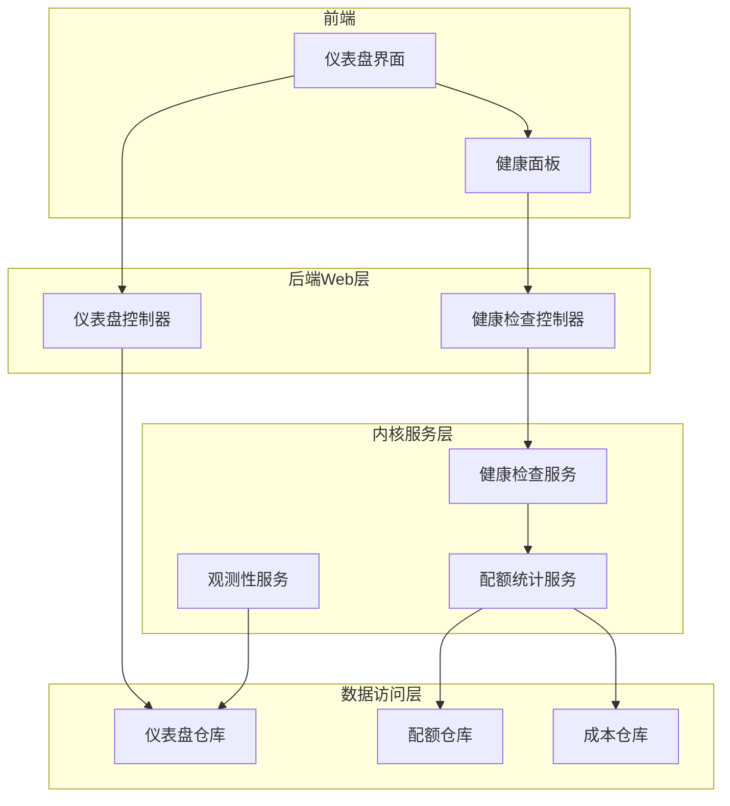

**图表来源**
- [SeahorseSreHealthController.java:34-37](file://seahorse-agent-adapter-web/src/main/java/com/miracle/ai/seahorse/agent/adapters/web/SeahorseSreHealthController.java#L34-L37)
- [JdbcDashboardRepositoryAdapter.java:140-146](file://seahorse-agent-adapter-repository-jdbc/src/main/java/com/miracle/ai/seahorse/agent/adapters/repository/jdbc/JdbcDashboardRepositoryAdapter.java#L140-L146)

**章节来源**
- [SeahorseSreHealthController.java:1-38](file://seahorse-agent-adapter-web/src/main/java/com/miracle/ai/seahorse/agent/adapters/web/SeahorseSreHealthController.java#L1-L38)
- [JdbcDashboardRepositoryAdapter.java:1-162](file://seahorse-agent-adapter-repository-jdbc/src/main/java/com/miracle/ai/seahorse/agent/adapters/repository/jdbc/JdbcDashboardRepositoryAdapter.java#L1-L162)

## 核心组件
监控系统由以下核心组件构成：

### 健康检查组件
- **健康检查控制器**：提供REST API接口，统一处理健康状态查询
- **健康检查服务**：聚合各组件健康状态，生成综合健康报告
- **健康状态模型**：定义Feature健康状态和Adapter健康状态的数据结构

### 仪表盘组件
- **仪表盘仓库**：提供趋势数据查询、性能指标统计等功能
- **性能指标计算**：计算成功率、错误率、无文档率等关键指标
- **时间序列聚合**：按小时/天粒度聚合监控数据

### 成本用量组件
- **配额统计服务**：计算用户配额使用情况，包括调用次数、费用等
- **配额策略模型**：定义配额限制、警告阈值等策略参数
- **成本聚合统计**：统计总成本、剩余成本等关键指标

**章节来源**
- [KernelQuotaSummaryService.java:56-105](file://seahorse-agent-kernel/src/main/java/com/miracle/ai/seahorse/agent/kernel/application/agent/quota/KernelQuotaSummaryService.java#L56-L105)
- [QuotaPolicy.java:52-90](file://seahorse-agent-kernel/src/main/java/com/miracle/ai/seahorse/agent/kernel/domain/agent/quota/QuotaPolicy.java#L52-L90)

## 架构概览
监控系统采用分层架构设计，通过Web控制器接收请求，调用内核服务处理业务逻辑，最终通过仓库层访问数据库获取监控数据。

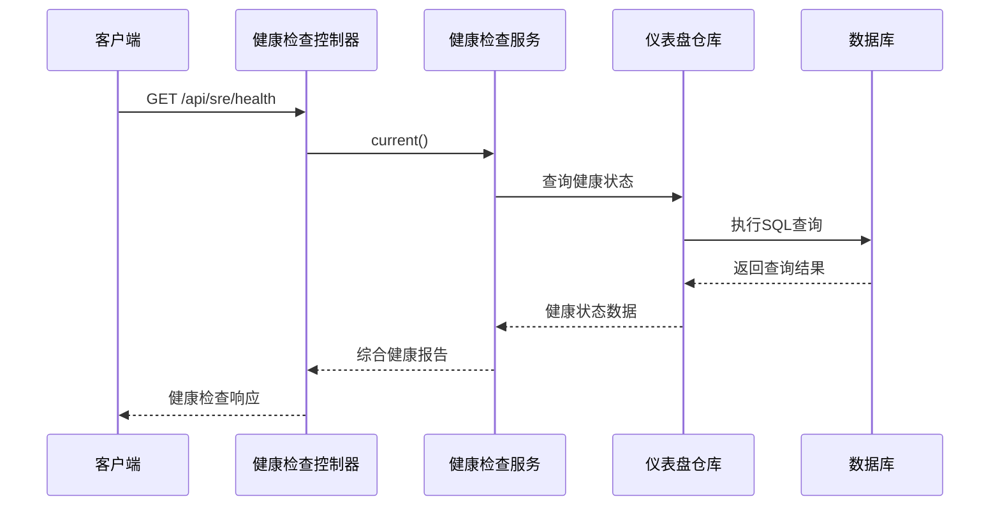

**图表来源**
- [SeahorseSreHealthController.java:34-37](file://seahorse-agent-adapter-web/src/main/java/com/miracle/ai/seahorse/agent/adapters/web/SeahorseSreHealthController.java#L34-L37)

## 详细组件分析

### 健康检查接口
健康检查接口提供系统整体健康状态查询功能，支持多维度健康状态聚合。

#### 接口规范
- **HTTP方法**：GET
- **路径**：`/api/sre/health`
- **功能**：返回系统健康状态综合报告

#### 响应数据结构
健康检查返回综合健康状态，包含各组件的健康详情：

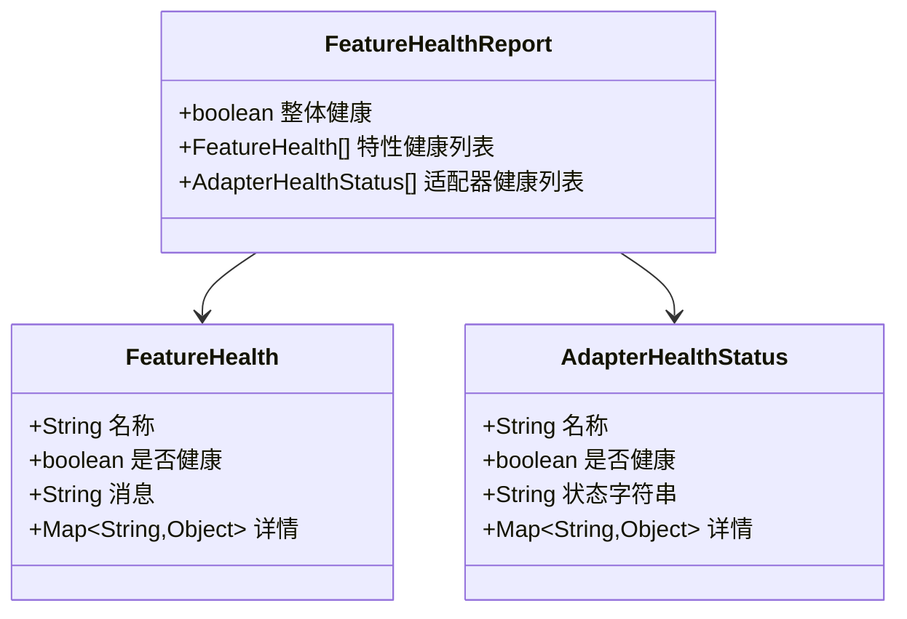

**图表来源**
- [Monitoring.md:267-306](file://docs/zh/content/监控运维/监控运维.md#L267-L306)

#### 健康状态判定规则
- **成功状态**：所有组件健康且无异常
- **关注状态**：部分组件异常但不影响整体功能
- **危险状态**：关键组件异常或服务不可用
- **未知状态**：无法获取健康状态信息

**章节来源**
- [SeahorseSreHealthController.java:34-37](file://seahorse-agent-adapter-web/src/main/java/com/miracle/ai/seahorse/agent/adapters/web/SeahorseSreHealthController.java#L34-L37)

### 仪表盘监控接口
仪表盘监控接口提供多维度的性能指标查询和趋势分析功能。

#### 性能指标接口
- **成功率**：计算公式 = 成功请求数 / (成功请求数 + 错误请求数)
- **错误率**：计算公式 = 错误请求数 / (成功请求数 + 错误请求数)
- **无文档率**：计算公式 = 无文档响应数 / 总响应数
- **平均响应时间**：计算各请求的平均耗时

#### 趋势分析接口
支持按不同时间窗口查询历史数据：
- **24小时滚动窗口**：按小时粒度聚合
- **7天窗口**：按天粒度聚合  
- **30天窗口**：按天粒度聚合

#### 时间序列聚合算法
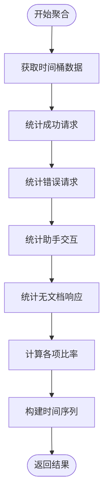

**图表来源**
- [JdbcDashboardRepositoryAdapter.java:148-162](file://seahorse-agent-adapter-repository-jdbc/src/main/java/com/miracle/ai/seahorse/agent/adapters/repository/jdbc/JdbcDashboardRepositoryAdapter.java#L148-L162)

**章节来源**
- [JdbcDashboardRepositoryAdapter.java:140-162](file://seahorse-agent-adapter-repository-jdbc/src/main/java/com/miracle/ai/seahorse/agent/adapters/repository/jdbc/JdbcDashboardRepositoryAdapter.java#L140-L162)

### 成本用量统计接口
成本用量统计接口提供用户配额使用情况和费用分析功能。

#### 配额统计数据模型
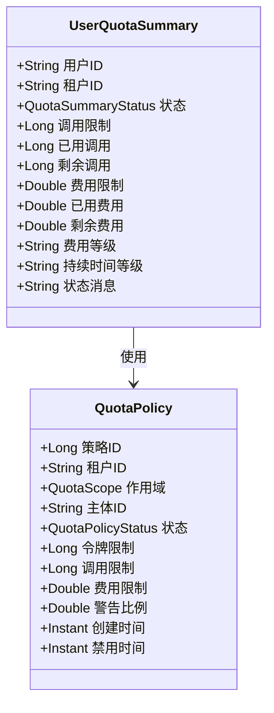

**图表来源**
- [UserQuotaSummary.java:22-30](file://seahorse-agent-kernel/src/main/java/com/miracle/ai/seahorse/agent/kernel/domain/agent/quota/UserQuotaSummary.java#L22-L30)

#### 配额使用计算逻辑
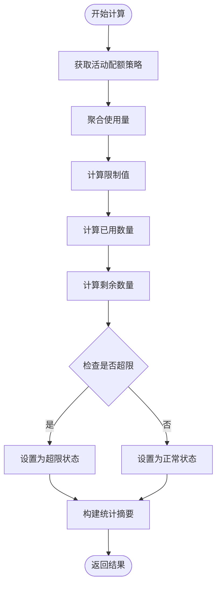

**图表来源**
- [KernelQuotaSummaryService.java:56-105](file://seahorse-agent-kernel/src/main/java/com/miracle/ai/seahorse/agent/kernel/application/agent/quota/KernelQuotaSummaryService.java#L56-L105)

**章节来源**
- [KernelQuotaSummaryService.java:56-105](file://seahorse-agent-kernel/src/main/java/com/miracle/ai/seahorse/agent/kernel/application/agent/quota/KernelQuotaSummaryService.java#L56-L105)
- [QuotaPolicy.java:52-90](file://seahorse-agent-kernel/src/main/java/com/miracle/ai/seahorse/agent/kernel/domain/agent/quota/QuotaPolicy.java#L52-L90)

### 观测性指标接口
观测性指标接口基于Micrometer实现，提供性能指标的实时收集和上报功能。

#### 指标收集流程
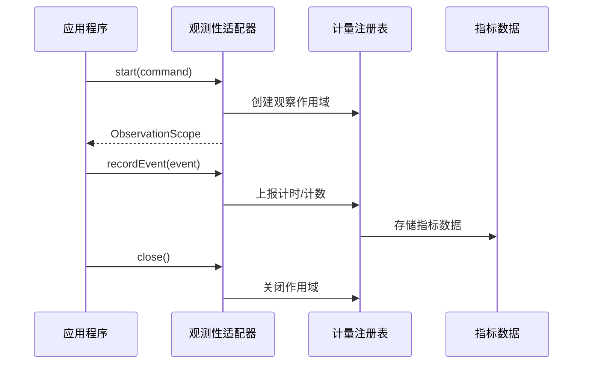

**图表来源**
- [MicrometerObservationAdapter.java:42-137](file://seahorse-agent-adapter-observation-micrometer/src/main/java/com/miracle/ai/seahorse/agent/adapters/observation/micrometer/MicrometerObservationAdapter.java#L42-L137)

**章节来源**
- [MicrometerObservationAdapter.java:42-137](file://seahorse-agent-adapter-observation-micrometer/src/main/java/com/miracle/ai/seahorse/agent/adapters/observation/micrometer/MicrometerObservationAdapter.java#L42-L137)

### 前端监控展示组件
前端提供完整的监控数据可视化界面，包括健康面板、趋势图表和KPI指标。

#### 健康面板组件
健康面板组件负责展示系统各组件的健康状态，支持颜色标识和状态显示：

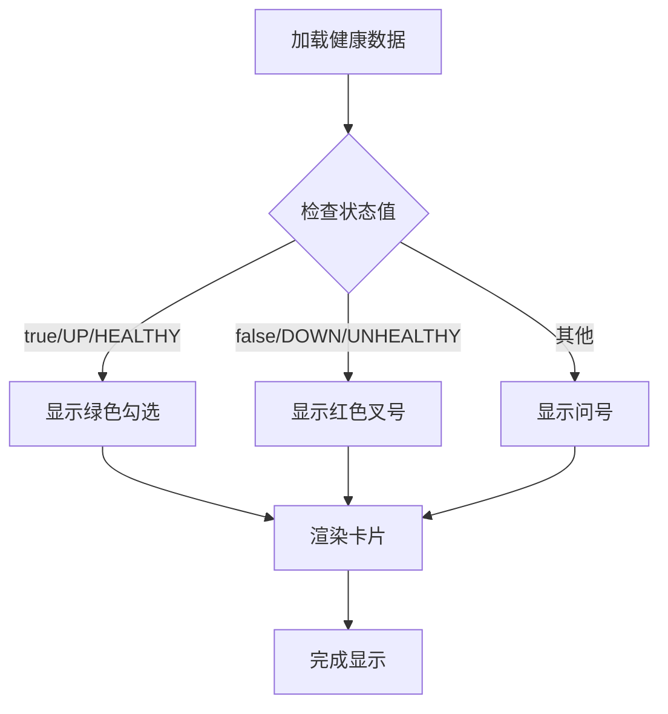

**图表来源**
- [SreHealthPanel.tsx:42-72](file://frontend/src/pages/admin/dashboard/SreHealthPanel.tsx#L42-L72)

#### 仪表盘数据流
前端仪表盘组件负责协调多个API请求，确保数据的一致性和完整性：

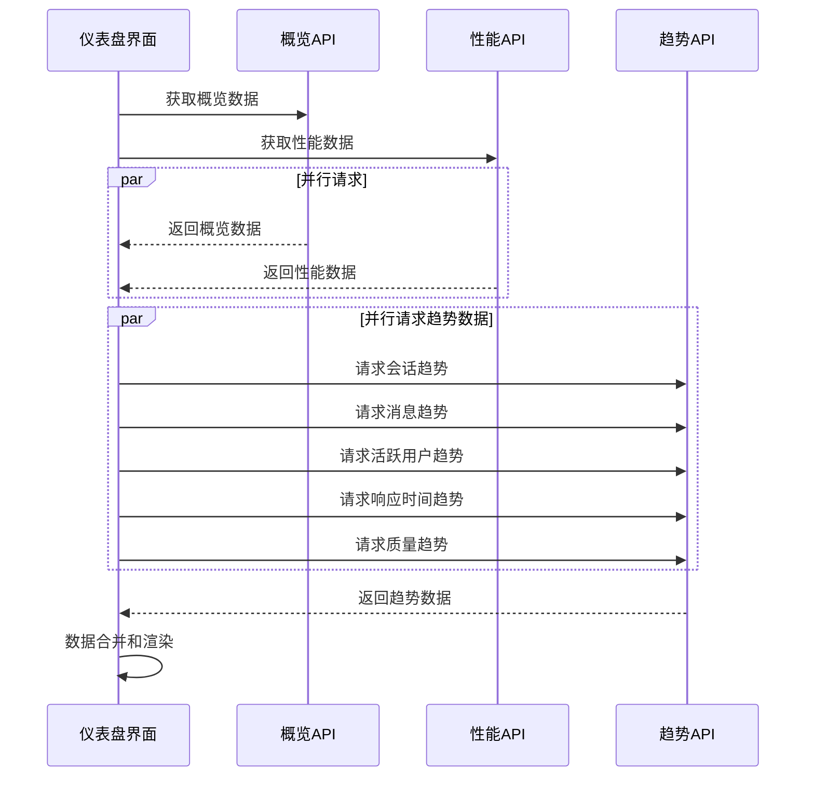

**图表来源**
- [DashboardPage.tsx:247-280](file://frontend/src/pages/admin/dashboard/DashboardPage.tsx#L247-L280)

**章节来源**
- [SreHealthPanel.tsx:39-72](file://frontend/src/pages/admin/dashboard/SreHealthPanel.tsx#L39-L72)
- [DashboardPage.tsx:229-301](file://frontend/src/pages/admin/dashboard/DashboardPage.tsx#L229-L301)

## 依赖关系分析

### 组件依赖图
监控系统的组件间存在清晰的依赖关系，遵循分层架构原则：

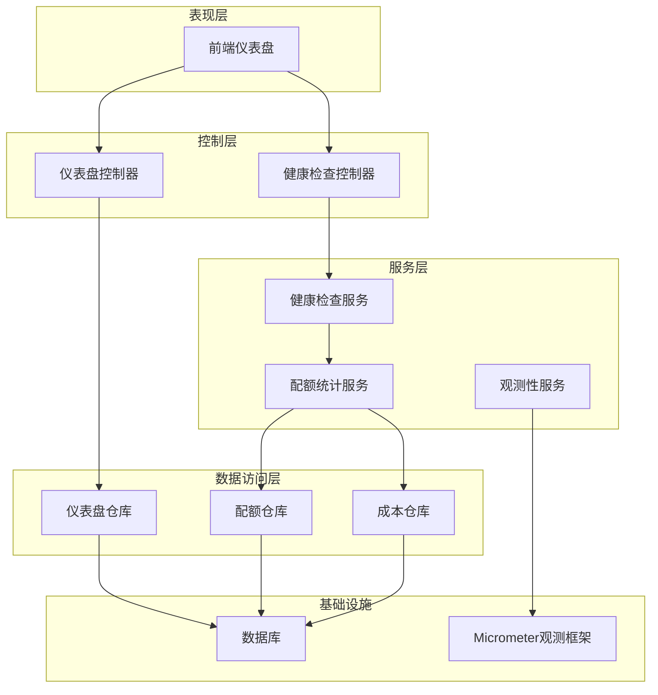

**图表来源**
- [SeahorseSreHealthController.java:25-37](file://seahorse-agent-adapter-web/src/main/java/com/miracle/ai/seahorse/agent/adapters/web/SeahorseSreHealthController.java#L25-L37)

### 数据流依赖
监控数据在系统内的流转过程：

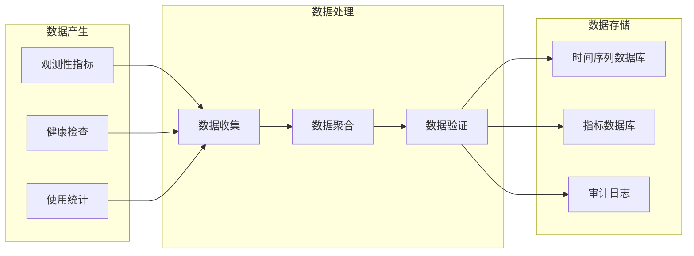

**图表来源**
- [MicrometerObservationAdapter.java:42-137](file://seahorse-agent-adapter-observation-micrometer/src/main/java/com/miracle/ai/seahorse/agent/adapters/observation/micrometer/MicrometerObservationAdapter.java#L42-L137)

**章节来源**
- [Monitoring.md:159-189](file://docs/zh/content/监控运维/监控运维.md#L159-L189)

## 性能考虑
监控系统在设计时充分考虑了性能优化：

### 查询性能优化
- **索引优化**：仪表盘查询使用时间戳和租户ID复合索引
- **分页查询**：大数据量场景下采用分页机制
- **缓存策略**：热点数据采用内存缓存减少数据库压力

### 内存管理
- **对象池化**：复用JDBC模板和连接对象
- **流式处理**：大结果集采用流式处理避免内存溢出
- **及时释放**：确保数据库连接和资源及时释放

### 并发处理
- **异步查询**：多个指标查询采用并行执行
- **连接池管理**：合理配置数据库连接池大小
- **超时控制**：设置合理的查询超时时间

## 故障排除指南
监控系统提供了完善的故障诊断和恢复机制：

### 常见问题诊断
1. **健康检查失败**
   - 检查数据库连接状态
   - 验证各组件依赖服务可用性
   - 查看系统日志中的异常信息

2. **指标数据缺失**
   - 确认观测性适配器正常运行
   - 检查Micrometer配置是否正确
   - 验证指标上报管道是否畅通

3. **性能指标异常**
   - 分析数据库查询执行计划
   - 检查索引使用情况
   - 监控系统资源使用情况

### 故障恢复步骤
1. **临时恢复**：重启相关服务组件
2. **数据修复**：重新计算缺失的历史数据
3. **配置调整**：优化系统配置参数
4. **容量扩展**：增加系统资源或优化查询

**章节来源**
- [Monitoring.md:181-189](file://docs/zh/content/监控运维/监控运维.md#L181-L189)

## 结论
监控指标接口提供了完整的系统可观测性解决方案，涵盖了健康检查、性能监控、成本统计、趋势分析等核心功能。通过分层架构设计和优化的查询机制，系统能够高效地收集和展示各类监控指标，为系统运维和容量规划提供有力支撑。建议在生产环境中结合具体的业务需求，合理配置监控参数和告警阈值，确保监控系统的有效性和可靠性。