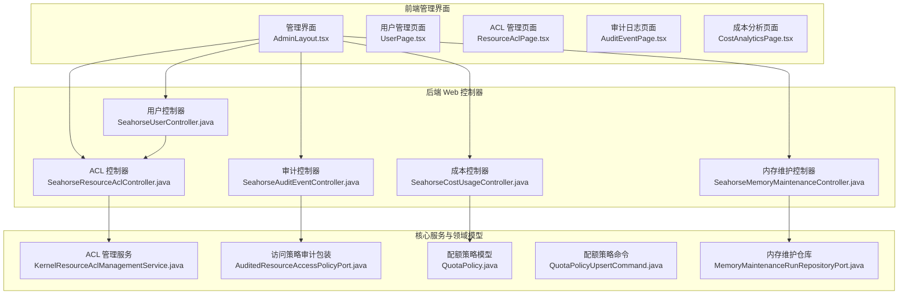
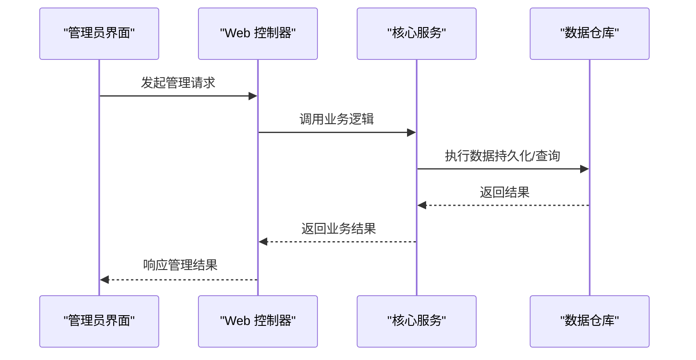
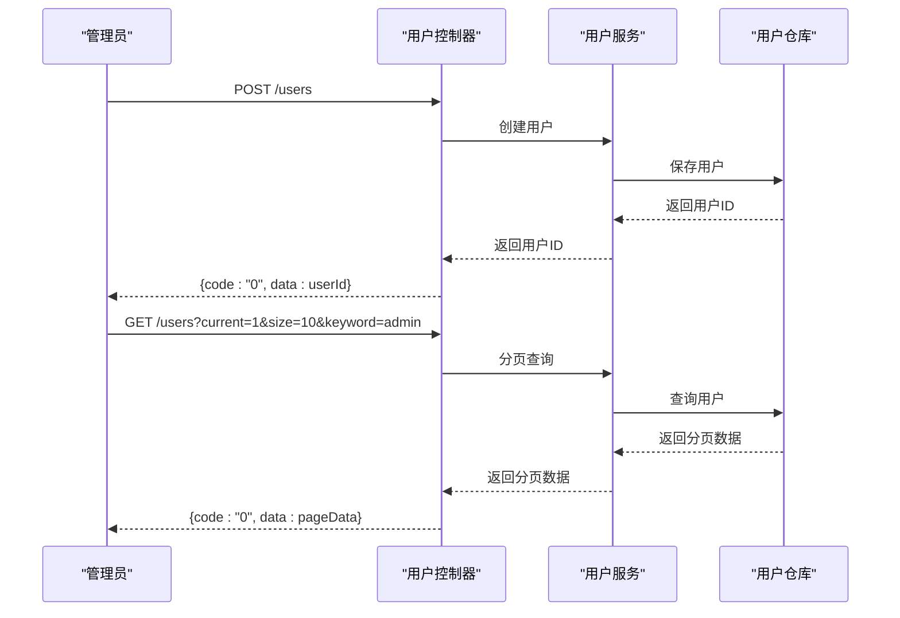
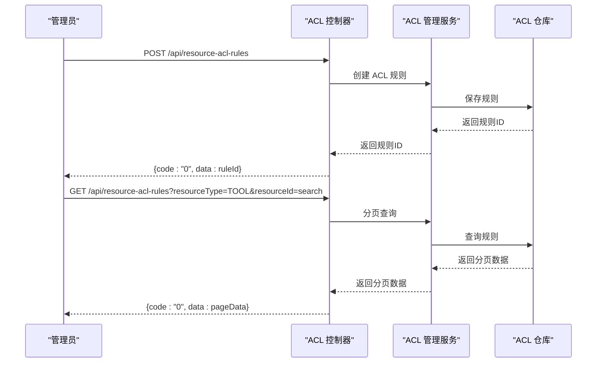
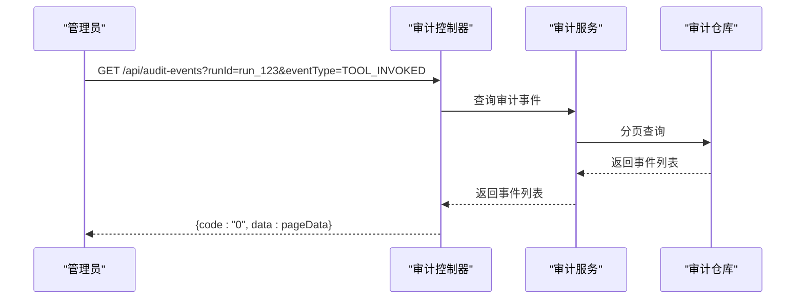
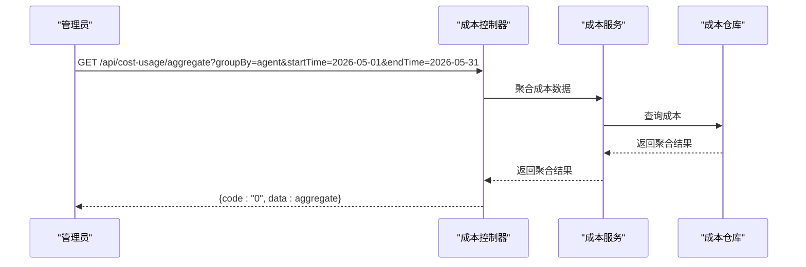
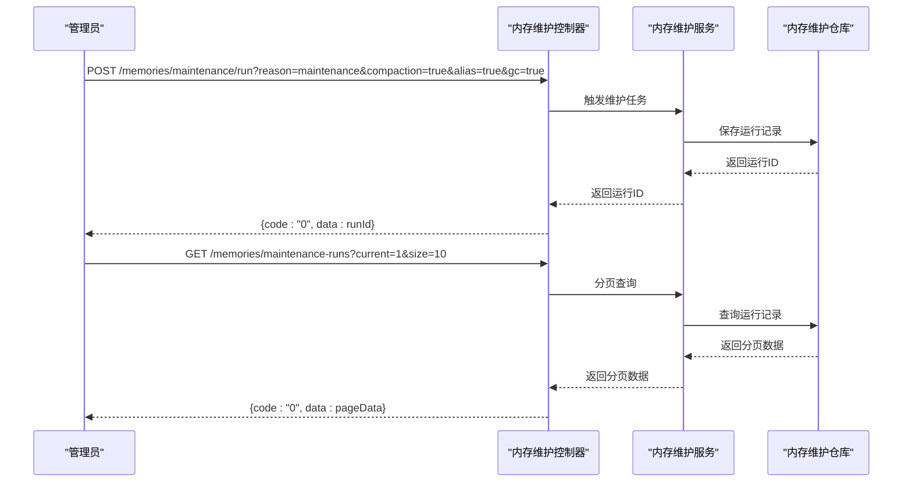
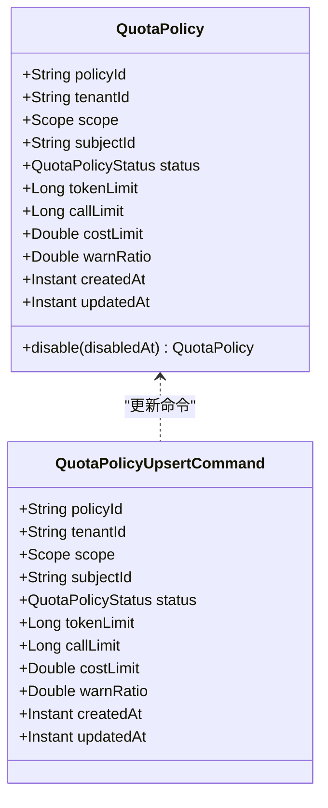
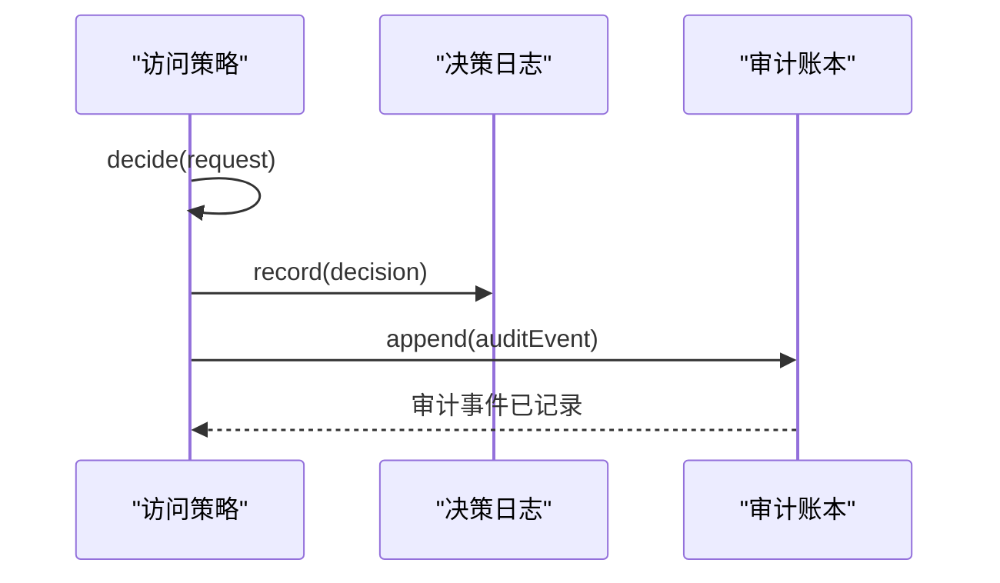
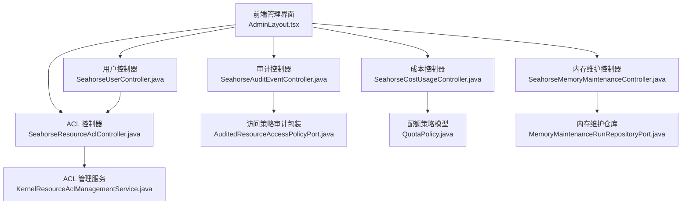

# 系统管理接口

<cite>
**本文档引用的文件**
- [SeahorseUserController.java](file://seahorse-agent-adapter-web/src/main/java/com/miracle/ai/seahorse/agent/adapters/web/SeahorseUserController.java)
- [SeahorseResourceAclController.java](file://seahorse-agent-adapter-web/src/main/java/com/miracle/ai/seahorse/agent/adapters/web/SeahorseResourceAclController.java)
- [SeahorseAuditEventController.java](file://seahorse-agent-adapter-web/src/main/java/com/miracle/ai/seahorse/agent/adapters/web/SeahorseAuditEventController.java)
- [SeahorseCostUsageController.java](file://seahorse-agent-adapter-web/src/main/java/com/miracle/ai/seahorse/agent/adapters/web/SeahorseCostUsageController.java)
- [SeahorseMemoryMaintenanceController.java](file://seahorse-agent-adapter-web/src/main/java/com/miracle/ai/seahorse/agent/adapters/web/SeahorseMemoryMaintenanceController.java)
- [KernelResourceAclManagementService.java](file://seahorse-agent-kernel/src/main/java/com/miracle/ai/seahorse/agent/kernel/application/agent/context/KernelResourceAclManagementService.java)
- [AuditedResourceAccessPolicyPort.java](file://seahorse-agent-kernel/src/main/java/com/miracle/ai/seahorse/agent/kernel/application/agent/context/AuditedResourceAccessPolicyPort.java)
- [QuotaPolicy.java](file://seahorse-agent-kernel/src/main/java/com/miracle/ai/seahorse/agent/kernel/domain/agent/quota/QuotaPolicy.java)
- [QuotaPolicyUpsertCommand.java](file://seahorse-agent-kernel/src/main/java/com/miracle/ai/seahorse/agent/ports/inbound/agent/QuotaPolicyUpsertCommand.java)
- [JdbcMemoryMaintenanceRunRepositoryAdapter.java](file://seahorse-agent-adapter-repository-jdbc/src/main/java/com/miracle/ai/seahorse/agent/adapters/repository/jdbc/JdbcMemoryMaintenanceRunRepositoryAdapter.java)
- [MemoryMaintenanceRunRepositoryPort.java](file://seahorse-agent-kernel/src/main/java/com/miracle/ai/seahorse/agent/ports/outbound/memory/MemoryMaintenanceRunRepositoryPort.java)
- [AdminLayout.tsx](file://frontend/src/pages/admin/AdminLayout.tsx)
- [ResourceAclPage.tsx](file://frontend/src/pages/admin/security/ResourceAclPage.tsx)
- [AuditEventPage.tsx](file://frontend/src/pages/admin/audit/AuditEventPage.tsx)
- [CostAnalyticsPage.tsx](file://frontend/src/pages/admin/cost/CostAnalyticsPage.tsx)
- [BackupRecovery.md](file://docs/zh/content/监控运维/备份恢复.md)
</cite>

## 目录
1. [简介](#简介)
2. [项目结构](#项目结构)
3. [核心组件](#核心组件)
4. [架构总览](#架构总览)
5. [详细组件分析](#详细组件分析)
6. [依赖关系分析](#依赖关系分析)
7. [性能考量](#性能考量)
8. [故障排查指南](#故障排查指南)
9. [结论](#结论)
10. [附录](#附录)

## 简介
本文件为 Seahorse Agent 系统管理接口的完整 API 文档，覆盖用户管理、权限控制、系统配置、监控指标与告警、批量操作、数据导出以及系统维护工具等管理功能。文档基于代码库中的实际实现进行梳理，确保接口描述与真实实现一致。

## 项目结构
系统管理接口主要分布在后端 Web 适配层与前端管理页面中：
- 后端 Web 控制器：提供 REST API 接口，负责用户、ACL、审计、成本、内存维护等功能的对外暴露
- 前端管理页面：提供管理界面，调用后端 API 实现用户管理、ACL 规则管理、审计日志查询、成本分析、内存维护等操作
- 核心服务与领域模型：负责业务逻辑处理、权限校验、审计事件记录、配额策略管理等

**图表来源**
- [AdminLayout.tsx:219-277](file://frontend/src/pages/admin/AdminLayout.tsx#L219-L277)
- [SeahorseUserController.java:1-79](file://seahorse-agent-adapter-web/src/main/java/com/miracle/ai/seahorse/agent/adapters/web/SeahorseUserController.java#L1-L79)
- [SeahorseResourceAclController.java:121-143](file://seahorse-agent-adapter-web/src/main/java/com/miracle/ai/seahorse/agent/adapters/web/SeahorseResourceAclController.java#L121-L143)
- [KernelResourceAclManagementService.java:64-90](file://seahorse-agent-kernel/src/main/java/com/miracle/ai/seahorse/agent/kernel/application/agent/context/KernelResourceAclManagementService.java#L64-L90)

**章节来源**
- [AdminLayout.tsx:219-277](file://frontend/src/pages/admin/AdminLayout.tsx#L219-L277)
- [SeahorseUserController.java:1-79](file://seahorse-agent-adapter-web/src/main/java/com/miracle/ai/seahorse/agent/adapters/web/SeahorseUserController.java#L1-L79)
- [SeahorseResourceAclController.java:121-143](file://seahorse-agent-adapter-web/src/main/java/com/miracle/ai/seahorse/agent/adapters/web/SeahorseResourceAclController.java#L121-L143)

## 核心组件
本节概述系统管理接口的核心组件及其职责：
- 用户管理控制器：提供用户创建、更新、删除、分页查询等接口
- 资源 ACL 控制器：提供 ACL 规则的创建、禁用、分页查询等接口
- 审计事件控制器：提供审计事件的分页查询接口
- 成本分析控制器：提供成本聚合查询接口
- 内存维护控制器：提供内存维护任务的触发与查询接口
- ACL 管理服务：负责 ACL 规则的创建、禁用、导入等业务逻辑
- 访问策略审计包装：在访问决策时记录审计事件
- 配额策略模型与命令：定义配额策略的数据结构与更新命令
- 内存维护仓库：负责内存维护运行记录的持久化与查询

**章节来源**
- [SeahorseUserController.java:1-79](file://seahorse-agent-adapter-web/src/main/java/com/miracle/ai/seahorse/agent/adapters/web/SeahorseUserController.java#L1-L79)
- [SeahorseResourceAclController.java:121-143](file://seahorse-agent-adapter-web/src/main/java/com/miracle/ai/seahorse/agent/adapters/web/SeahorseResourceAclController.java#L121-L143)
- [SeahorseAuditEventController.java](file://seahorse-agent-adapter-web/src/main/java/com/miracle/ai/seahorse/agent/adapters/web/SeahorseAuditEventController.java)
- [SeahorseCostUsageController.java](file://seahorse-agent-adapter-web/src/main/java/com/miracle/ai/seahorse/agent/adapters/web/SeahorseCostUsageController.java)
- [SeahorseMemoryMaintenanceController.java:25-52](file://seahorse-agent-adapter-web/src/main/java/com/miracle/ai/seahorse/agent/adapters/web/SeahorseMemoryMaintenanceController.java#L25-L52)
- [KernelResourceAclManagementService.java:64-90](file://seahorse-agent-kernel/src/main/java/com/miracle/ai/seahorse/agent/kernel/application/agent/context/KernelResourceAclManagementService.java#L64-L90)
- [AuditedResourceAccessPolicyPort.java:50-86](file://seahorse-agent-kernel/src/main/java/com/miracle/ai/seahorse/agent/kernel/application/agent/context/AuditedResourceAccessPolicyPort.java#L50-L86)
- [QuotaPolicy.java:30-55](file://seahorse-agent-kernel/src/main/java/com/miracle/ai/seahorse/agent/kernel/domain/agent/quota/QuotaPolicy.java#L30-L55)
- [QuotaPolicyUpsertCommand.java:29-36](file://seahorse-agent-kernel/src/main/java/com/miracle/ai/seahorse/agent/ports/inbound/agent/QuotaPolicyUpsertCommand.java#L29-L36)
- [MemoryMaintenanceRunRepositoryPort.java:1-29](file://seahorse-agent-kernel/src/main/java/com/miracle/ai/seahorse/agent/ports/outbound/memory/MemoryMaintenanceRunRepositoryPort.java#L1-L29)

## 架构总览
系统管理接口采用前后端分离架构，前端通过 REST API 与后端交互。后端控制器负责请求处理与业务编排，核心服务与领域模型负责具体的业务逻辑与数据持久化。

**图表来源**
- [SeahorseUserController.java:1-79](file://seahorse-agent-adapter-web/src/main/java/com/miracle/ai/seahorse/agent/adapters/web/SeahorseUserController.java#L1-L79)
- [KernelResourceAclManagementService.java:64-90](file://seahorse-agent-kernel/src/main/java/com/miracle/ai/seahorse/agent/kernel/application/agent/context/KernelResourceAclManagementService.java#L64-L90)
- [MemoryMaintenanceRunRepositoryPort.java:1-29](file://seahorse-agent-kernel/src/main/java/com/miracle/ai/seahorse/agent/ports/outbound/memory/MemoryMaintenanceRunRepositoryPort.java#L1-L29)

## 详细组件分析

### 用户管理接口
用户管理接口支持用户的基本 CRUD 操作与分页查询，适用于系统管理员对用户账户的日常管理。

- 用户创建
  - 方法：POST
  - 路径：/users
  - 请求体：包含用户名、密码、角色、头像等字段
  - 响应：返回新创建用户的 ID
- 用户更新
  - 方法：PUT
  - 路径：/users/{id}
  - 路径参数：id（用户 ID）
  - 请求体：包含用户名、密码、角色、头像等字段
  - 响应：返回成功状态
- 用户删除
  - 方法：DELETE
  - 路径：/users/{id}
  - 路径参数：id（用户 ID）
  - 响应：返回成功状态
- 用户分页查询
  - 方法：GET
  - 路径：/users
  - 查询参数：current（当前页，默认 1）、size（每页大小，默认 10）、keyword（关键词筛选）
  - 响应：返回分页结果，包含用户列表与分页信息

**图表来源**
- [SeahorseUserController.java:57-79](file://seahorse-agent-adapter-web/src/main/java/com/miracle/ai/seahorse/agent/adapters/web/SeahorseUserController.java#L57-L79)

**章节来源**
- [SeahorseUserController.java:57-79](file://seahorse-agent-adapter-web/src/main/java/com/miracle/ai/seahorse/agent/adapters/web/SeahorseUserController.java#L57-L79)

### 权限控制接口
权限控制接口包括资源 ACL 规则的创建、禁用、分页查询等，支持细粒度的资源访问控制与审计。

- ACL 规则创建
  - 方法：POST
  - 路径：/api/resource-acl-rules
  - 请求体：包含作用域、资源、主体、效果、优先级、原因、过期时间等字段
  - 响应：返回创建结果
- ACL 规则禁用
  - 方法：POST
  - 路径：/api/resource-acl-rules/{ruleId}/disable
  - 路径参数：ruleId（规则 ID）
  - 响应：返回禁用结果
- ACL 规则分页查询
  - 方法：GET
  - 路径：/api/resource-acl-rules
  - 查询参数：tenantId（租户 ID）、resourceType（资源类型）、resourceId（资源 ID）、subjectType（主体类型）、subjectId（主体 ID）、status（状态）、current（当前页）、size（每页大小）
  - 响应：返回分页结果，包含 ACL 规则列表与分页信息
- ACL 规则导入（批量）
  - 方法：POST
  - 路径：/api/resource-acl-rules/import
  - 请求体：包含批量导入的 JSON 数据
  - 响应：返回导入结果与预演结果

**图表来源**
- [SeahorseResourceAclController.java:121-143](file://seahorse-agent-adapter-web/src/main/java/com/miracle/ai/seahorse/agent/adapters/web/SeahorseResourceAclController.java#L121-L143)
- [KernelResourceAclManagementService.java:64-90](file://seahorse-agent-kernel/src/main/java/com/miracle/ai/seahorse/agent/kernel/application/agent/context/KernelResourceAclManagementService.java#L64-L90)

**章节来源**
- [SeahorseResourceAclController.java:121-143](file://seahorse-agent-adapter-web/src/main/java/com/miracle/ai/seahorse/agent/adapters/web/SeahorseResourceAclController.java#L121-L143)
- [KernelResourceAclManagementService.java:64-90](file://seahorse-agent-kernel/src/main/java/com/miracle/ai/seahorse/agent/kernel/application/agent/context/KernelResourceAclManagementService.java#L64-L90)

### 审计日志接口
审计日志接口提供审计事件的分页查询，支持按租户、运行 ID、事件类型、资源等条件过滤，便于合规审计与问题追踪。

- 审计事件分页查询
  - 方法：GET
  - 路径：/api/audit-events
  - 查询参数：tenantId（租户 ID）、runId（运行 ID）、eventType（事件类型）、resourceType（资源类型）、resourceId（资源 ID）、current（当前页）、size（每页大小）
  - 响应：返回分页结果，包含审计事件列表与分页信息

**图表来源**
- [SeahorseAuditEventController.java](file://seahorse-agent-adapter-web/src/main/java/com/miracle/ai/seahorse/agent/adapters/web/SeahorseAuditEventController.java)

**章节来源**
- [SeahorseAuditEventController.java](file://seahorse-agent-adapter-web/src/main/java/com/miracle/ai/seahorse/agent/adapters/web/SeahorseAuditEventController.java)

### 成本分析接口
成本分析接口提供成本聚合查询，支持按 Agent、租户、时间范围等维度进行统计分析。

- 成本聚合查询
  - 方法：GET
  - 路径：/api/cost-usage/aggregate
  - 查询参数：tenantId（租户 ID）、startTime（开始时间）、endTime（结束时间）、groupBy（分组维度，如 agent）
  - 响应：返回成本聚合结果，包含统计数据

**图表来源**
- [SeahorseCostUsageController.java](file://seahorse-agent-adapter-web/src/main/java/com/miracle/ai/seahorse/agent/adapters/web/SeahorseCostUsageController.java)

**章节来源**
- [SeahorseCostUsageController.java](file://seahorse-agent-adapter-web/src/main/java/com/miracle/ai/seahorse/agent/adapters/web/SeahorseCostUsageController.java)

### 内存维护接口
内存维护接口提供内存维护任务的触发与查询，支持压缩、别名规范化、垃圾回收等操作。

- 触发内存维护
  - 方法：POST
  - 路径：/memories/maintenance/run
  - 查询参数：reason（维护原因，默认值）、compaction（是否执行压缩，默认 false）、alias（是否执行别名处理，默认 false）、gc（是否执行垃圾回收，默认 true）
  - 响应：返回维护结果
- 内存维护运行记录分页查询
  - 方法：GET
  - 路径：/memories/maintenance-runs
  - 查询参数：current（当前页）、size（每页大小）
  - 响应：返回分页结果，包含维护运行记录列表与分页信息

**图表来源**
- [SeahorseMemoryMaintenanceController.java:25-52](file://seahorse-agent-adapter-web/src/main/java/com/miracle/ai/seahorse/agent/adapters/web/SeahorseMemoryMaintenanceController.java#L25-L52)
- [MemoryMaintenanceRunRepositoryPort.java:1-29](file://seahorse-agent-kernel/src/main/java/com/miracle/ai/seahorse/agent/ports/outbound/memory/MemoryMaintenanceRunRepositoryPort.java#L1-L29)

**章节来源**
- [SeahorseMemoryMaintenanceController.java:25-52](file://seahorse-agent-adapter-web/src/main/java/com/miracle/ai/seahorse/agent/adapters/web/SeahorseMemoryMaintenanceController.java#L25-L52)
- [MemoryMaintenanceRunRepositoryPort.java:1-29](file://seahorse-agent-kernel/src/main/java/com/miracle/ai/seahorse/agent/ports/outbound/memory/MemoryMaintenanceRunRepositoryPort.java#L1-L29)

### 配额策略接口
配额策略接口用于管理租户或用户的配额限制，包括令牌数、调用次数、成本等维度的限制与预警比例设置。

- 配额策略模型
  - 字段：policyId（策略 ID）、tenantId（租户 ID）、scope（作用域）、subjectId（主体 ID）、status（状态）、tokenLimit（令牌限制）、callLimit（调用限制）、costLimit（成本限制）、warnRatio（预警比例）、createdAt（创建时间）、updatedAt（更新时间）
  - 约束：至少一个限制值不能为空，预警比例需在有效范围内
- 配额策略更新命令
  - 字段：与模型一致，用于更新操作

**图表来源**
- [QuotaPolicy.java:30-55](file://seahorse-agent-kernel/src/main/java/com/miracle/ai/seahorse/agent/kernel/domain/agent/quota/QuotaPolicy.java#L30-L55)
- [QuotaPolicyUpsertCommand.java:29-36](file://seahorse-agent-kernel/src/main/java/com/miracle/ai/seahorse/agent/ports/inbound/agent/QuotaPolicyUpsertCommand.java#L29-L36)

**章节来源**
- [QuotaPolicy.java:30-55](file://seahorse-agent-kernel/src/main/java/com/miracle/ai/seahorse/agent/kernel/domain/agent/quota/QuotaPolicy.java#L30-L55)
- [QuotaPolicyUpsertCommand.java:29-36](file://seahorse-agent-kernel/src/main/java/com/miracle/ai/seahorse/agent/ports/inbound/agent/QuotaPolicyUpsertCommand.java#L29-L36)

### 访问决策审计接口
访问决策审计接口在每次资源访问决策时自动记录审计事件，确保访问行为可追溯。

**图表来源**
- [AuditedResourceAccessPolicyPort.java:50-86](file://seahorse-agent-kernel/src/main/java/com/miracle/ai/seahorse/agent/kernel/application/agent/context/AuditedResourceAccessPolicyPort.java#L50-L86)

**章节来源**
- [AuditedResourceAccessPolicyPort.java:50-86](file://seahorse-agent-kernel/src/main/java/com/miracle/ai/seahorse/agent/kernel/application/agent/context/AuditedResourceAccessPolicyPort.java#L50-L86)

## 依赖关系分析
系统管理接口的依赖关系体现了清晰的分层架构：前端管理界面依赖后端 Web 控制器，控制器依赖核心服务，核心服务依赖数据仓库与领域模型。

**图表来源**
- [AdminLayout.tsx:219-277](file://frontend/src/pages/admin/AdminLayout.tsx#L219-L277)
- [SeahorseUserController.java:1-79](file://seahorse-agent-adapter-web/src/main/java/com/miracle/ai/seahorse/agent/adapters/web/SeahorseUserController.java#L1-L79)
- [SeahorseResourceAclController.java:121-143](file://seahorse-agent-adapter-web/src/main/java/com/miracle/ai/seahorse/agent/adapters/web/SeahorseResourceAclController.java#L121-L143)
- [KernelResourceAclManagementService.java:64-90](file://seahorse-agent-kernel/src/main/java/com/miracle/ai/seahorse/agent/kernel/application/agent/context/KernelResourceAclManagementService.java#L64-L90)
- [AuditedResourceAccessPolicyPort.java:50-86](file://seahorse-agent-kernel/src/main/java/com/miracle/ai/seahorse/agent/kernel/application/agent/context/AuditedResourceAccessPolicyPort.java#L50-L86)
- [QuotaPolicy.java:30-55](file://seahorse-agent-kernel/src/main/java/com/miracle/ai/seahorse/agent/kernel/domain/agent/quota/QuotaPolicy.java#L30-L55)
- [MemoryMaintenanceRunRepositoryPort.java:1-29](file://seahorse-agent-kernel/src/main/java/com/miracle/ai/seahorse/agent/ports/outbound/memory/MemoryMaintenanceRunRepositoryPort.java#L1-L29)

**章节来源**
- [AdminLayout.tsx:219-277](file://frontend/src/pages/admin/AdminLayout.tsx#L219-L277)
- [SeahorseUserController.java:1-79](file://seahorse-agent-adapter-web/src/main/java/com/miracle/ai/seahorse/agent/adapters/web/SeahorseUserController.java#L1-L79)
- [SeahorseResourceAclController.java:121-143](file://seahorse-agent-adapter-web/src/main/java/com/miracle/ai/seahorse/agent/adapters/web/SeahorseResourceAclController.java#L121-L143)
- [KernelResourceAclManagementService.java:64-90](file://seahorse-agent-kernel/src/main/java/com/miracle/ai/seahorse/agent/kernel/application/agent/context/KernelResourceAclManagementService.java#L64-L90)
- [AuditedResourceAccessPolicyPort.java:50-86](file://seahorse-agent-kernel/src/main/java/com/miracle/ai/seahorse/agent/kernel/application/agent/context/AuditedResourceAccessPolicyPort.java#L50-L86)
- [QuotaPolicy.java:30-55](file://seahorse-agent-kernel/src/main/java/com/miracle/ai/seahorse/agent/kernel/domain/agent/quota/QuotaPolicy.java#L30-L55)
- [MemoryMaintenanceRunRepositoryPort.java:1-29](file://seahorse-agent-kernel/src/main/java/com/miracle/ai/seahorse/agent/ports/outbound/memory/MemoryMaintenanceRunRepositoryPort.java#L1-L29)

## 性能考量
- 分页查询：用户、ACL 规则、审计事件、内存维护运行记录等接口均支持分页查询，避免一次性加载大量数据导致性能问题
- 缓存与索引：建议在数据库层面为常用查询字段建立索引，如审计事件的时间戳、资源标识等，提升查询性能
- 并发控制：ACL 规则创建与禁用操作需要考虑并发一致性，建议使用分布式锁或数据库事务保证原子性
- 监控与告警：成本分析接口可用于识别异常使用模式，结合配额策略实现自动告警与限流

## 故障排查指南
- 用户管理
  - 症状：用户创建失败或分页查询无数据
  - 排查：检查请求参数完整性、数据库连接状态、用户仓库是否正常工作
- ACL 管理
  - 症状：ACL 规则创建或禁用失败
  - 排查：确认 ACL 管理服务的权限校验、审计事件记录是否正常、数据库事务是否提交
- 审计日志
  - 症状：审计事件查询为空或数据不完整
  - 排查：检查审计控制器的查询参数、审计仓库的索引与数据一致性
- 成本分析
  - 症状：成本聚合结果异常
  - 排查：验证成本控制器的查询范围与分组维度、成本仓库的数据准确性
- 内存维护
  - 症状：维护任务未执行或运行记录缺失
  - 排查：检查内存维护控制器的任务触发参数、内存维护仓库的持久化逻辑

**章节来源**
- [SeahorseUserController.java:57-79](file://seahorse-agent-adapter-web/src/main/java/com/miracle/ai/seahorse/agent/adapters/web/SeahorseUserController.java#L57-L79)
- [SeahorseResourceAclController.java:121-143](file://seahorse-agent-adapter-web/src/main/java/com/miracle/ai/seahorse/agent/adapters/web/SeahorseResourceAclController.java#L121-L143)
- [SeahorseAuditEventController.java](file://seahorse-agent-adapter-web/src/main/java/com/miracle/ai/seahorse/agent/adapters/web/SeahorseAuditEventController.java)
- [SeahorseCostUsageController.java](file://seahorse-agent-adapter-web/src/main/java/com/miracle/ai/seahorse/agent/adapters/web/SeahorseCostUsageController.java)
- [SeahorseMemoryMaintenanceController.java:25-52](file://seahorse-agent-adapter-web/src/main/java/com/miracle/ai/seahorse/agent/adapters/web/SeahorseMemoryMaintenanceController.java#L25-L52)

## 结论
本文档系统性地梳理了 Seahorse Agent 的系统管理接口，覆盖用户管理、权限控制、审计日志、成本分析、内存维护等关键功能。通过前后端分离架构与清晰的分层设计，这些接口为系统管理员提供了完善的管理手段。建议在生产环境中结合配额策略与监控告警机制，确保系统的安全性与稳定性。

## 附录
- 备份与恢复策略：结合数据库模式、对象存储适配器与定时调度能力，制定企业级备份与恢复方案，确保数据安全与业务连续性
- 安全管理：通过 ACL 规则与审计事件实现细粒度的资源访问控制与行为追踪，配合配额策略防止资源滥用
- 系统维护：利用内存维护接口定期清理无效数据，保持系统性能与稳定性

**章节来源**
- [BackupRecovery.md:21-302](file://docs/zh/content/监控运维/备份恢复.md#L21-L302)