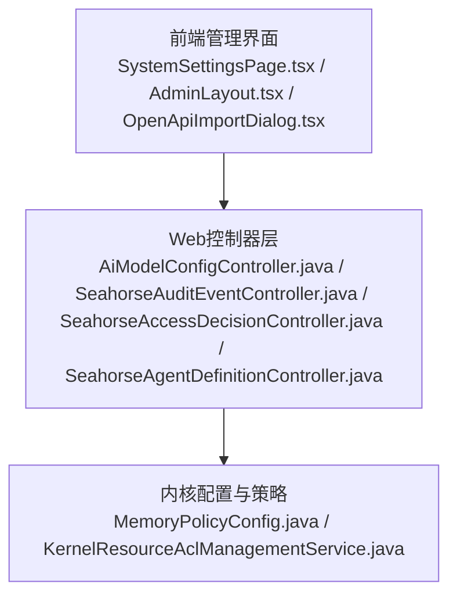
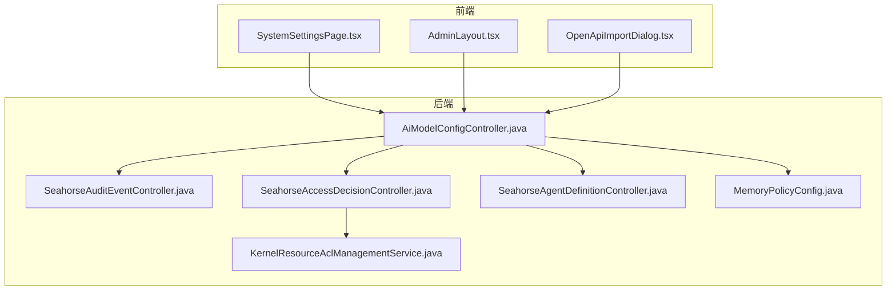
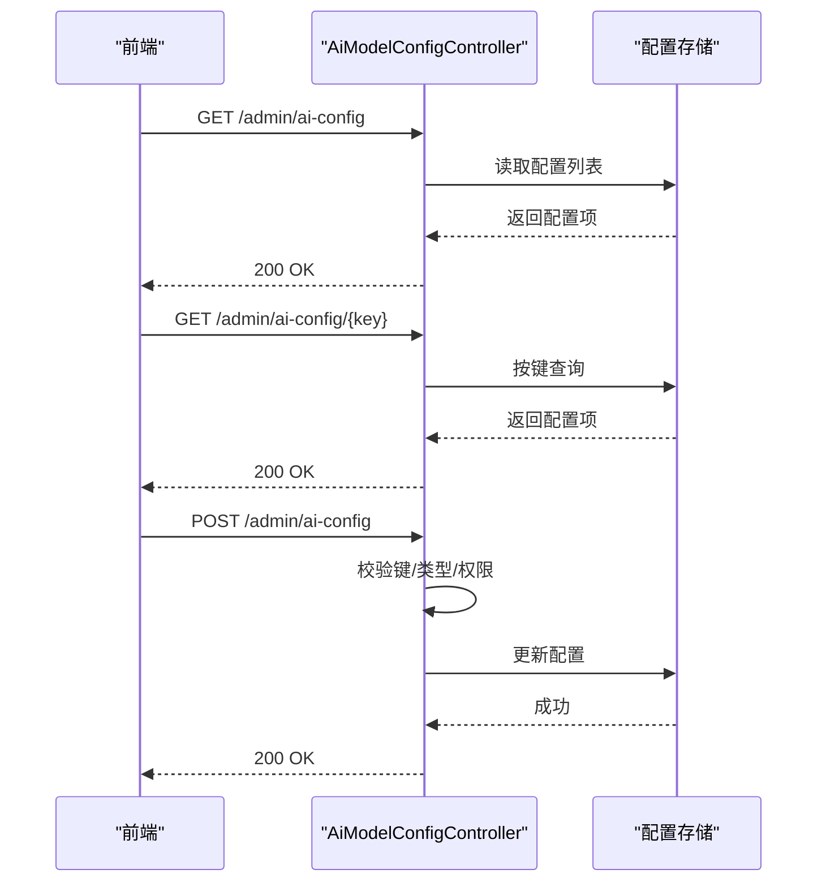
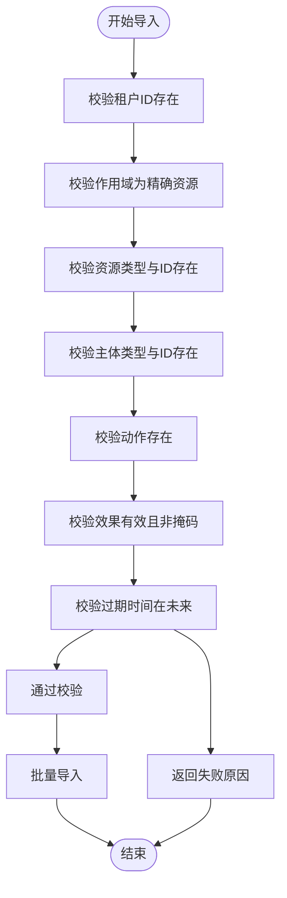
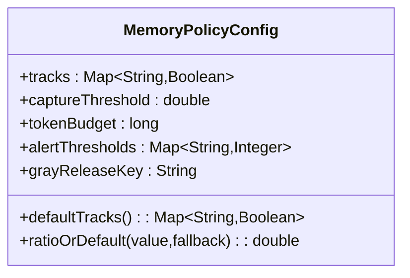
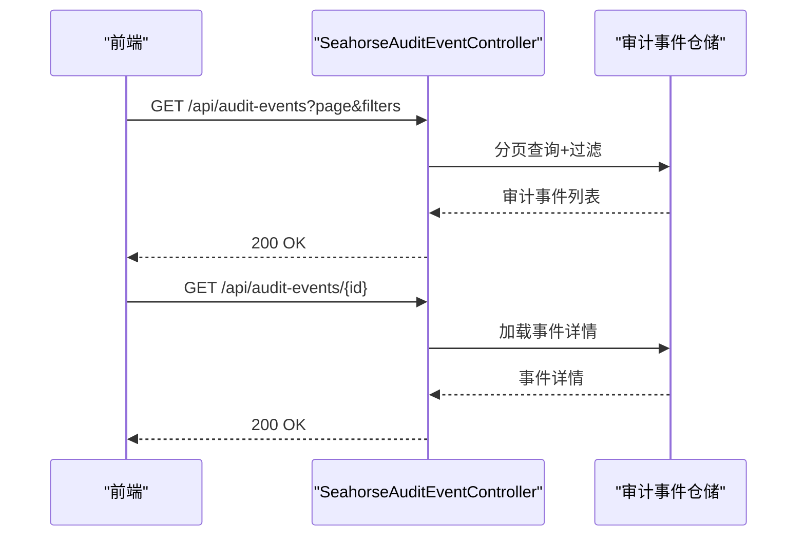
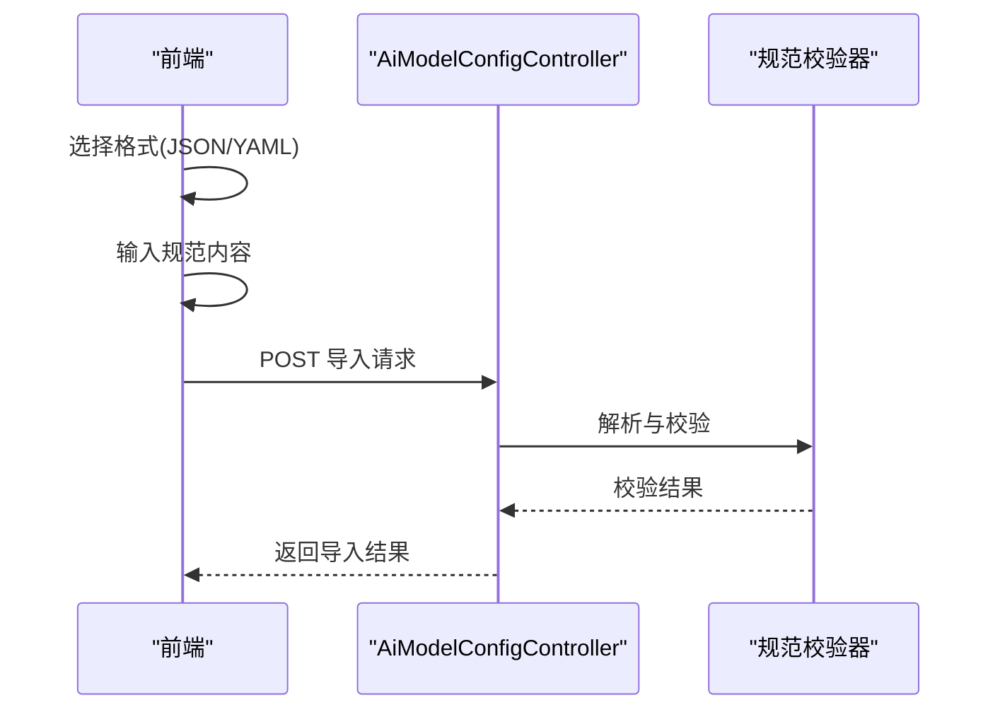
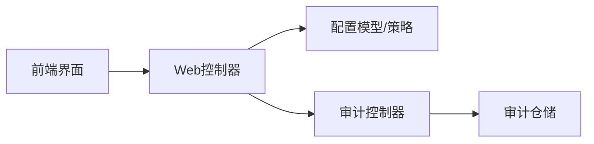

# 系统配置接口

<cite>
**本文引用的文件**
- [AiModelConfigController.java](file://seahorse-agent-adapter-web/src/main/java/com/miracle/ai/seahorse/agent/adapters/web/AiModelConfigController.java)
- [SeahorseAuditEventController.java](file://seahorse-agent-adapter-web/src/main/java/com/miracle/ai/seahorse/agent/adapters/web/SeahorseAuditEventController.java)
- [SeahorseAccessDecisionController.java](file://seahorse-agent-adapter-web/src/main/java/com/miracle/ai/seahorse/agent/adapters/web/SeahorseAccessDecisionController.java)
- [SeahorseAgentDefinitionController.java](file://seahorse-agent-adapter-web/src/main/java/com/miracle/ai/seahorse/agent/adapters/web/SeahorseAgentDefinitionController.java)
- [MemoryPolicyConfig.java](file://seahorse-agent-kernel/src/main/java/com/miracle/ai/seahorse/agent/ports/outbound/memory/MemoryPolicyConfig.java)
- [KernelResourceAclManagementService.java](file://seahorse-agent-kernel/src/main/java/com/miracle/ai/seahorse/agent/kernel/application/agent/context/KernelResourceAclManagementService.java)
- [OpenApiImportDialog.tsx](file://frontend/src/pages/admin/integrations/components/OpenApiImportDialog.tsx)
- [SystemSettingsPage.tsx](file://frontend/src/pages/admin/settings/SystemSettingsPage.tsx)
- [AdminLayout.tsx](file://frontend/src/pages/admin/AdminLayout.tsx)
- [2026-05-31-frontend-backend-alignment.md](file://docs/superpowers/plans/2026-05-31-frontend-backend-alignment.md)
- [10-intent.md](file://docs/aegis/work/2026-06-02-frontend-backend-gap-remediation/10-intent.md)
- [1442-3475.md](file://docs/company-agent/ai-infra-phases/09-unfinished-phase-design-development-plans.md)
</cite>

## 目录
1. [简介](#简介)
2. [项目结构](#项目结构)
3. [核心组件](#核心组件)
4. [架构总览](#架构总览)
5. [详细组件分析](#详细组件分析)
6. [依赖关系分析](#依赖关系分析)
7. [性能考虑](#性能考虑)
8. [故障排查指南](#故障排查指南)
9. [结论](#结论)
10. [附录](#附录)

## 简介
本文件面向系统配置接口的API文档，聚焦于系统参数配置管理、配置版本管理、监控与可观测性策略、安全策略（含ACL）配置、配置模板与导入导出、配置验证、通知与邮件SMTP设置、第三方集成配置、配置热更新、配置回滚以及配置审计日志等能力。文档以仓库中的实际控制器、领域模型与前端页面为依据，提供接口规范、数据流与交互序列图，并给出可操作的排障建议。

## 项目结构
系统配置相关能力主要分布在以下层次：
- 后端Web适配层：提供REST接口，承载配置读取、更新、版本化、导入导出、审计查询等功能。
- 核心内核层：定义配置模型、策略与验证规则，如内存策略配置、资源ACL导入校验等。
- 前端管理界面：提供配置展示、导入对话框、导航与功能开关控制。

**图表来源**
- [AiModelConfigController.java:34-120](file://seahorse-agent-adapter-web/src/main/java/com/miracle/ai/seahorse/agent/adapters/web/AiModelConfigController.java#L34-L120)
- [SeahorseAuditEventController.java:1-200](file://seahorse-agent-adapter-web/src/main/java/com/miracle/ai/seahorse/agent/adapters/web/SeahorseAuditEventController.java#L1-L200)
- [SeahorseAccessDecisionController.java:28-120](file://seahorse-agent-adapter-web/src/main/java/com/miracle/ai/seahorse/agent/adapters/web/SeahorseAccessDecisionController.java#L28-L120)
- [SeahorseAgentDefinitionController.java:35-160](file://seahorse-agent-adapter-web/src/main/java/com/miracle/ai/seahorse/agent/adapters/web/SeahorseAgentDefinitionController.java#L35-L160)
- [MemoryPolicyConfig.java:1-200](file://seahorse-agent-kernel/src/main/java/com/miracle/ai/seahorse/agent/ports/outbound/memory/MemoryPolicyConfig.java#L1-L200)
- [KernelResourceAclManagementService.java:214-411](file://seahorse-agent-kernel/src/main/java/com/miracle/ai/seahorse/agent/kernel/application/agent/context/KernelResourceAclManagementService.java#L214-L411)
- [SystemSettingsPage.tsx:30-120](file://frontend/src/pages/admin/settings/SystemSettingsPage.tsx#L30-L120)
- [AdminLayout.tsx:219-277](file://frontend/src/pages/admin/AdminLayout.tsx#L219-L277)
- [OpenApiImportDialog.tsx:67-96](file://frontend/src/pages/admin/integrations/components/OpenApiImportDialog.tsx#L67-L96)

**章节来源**
- [AiModelConfigController.java:34-120](file://seahorse-agent-adapter-web/src/main/java/com/miracle/ai/seahorse/agent/adapters/web/AiModelConfigController.java#L34-L120)
- [SystemSettingsPage.tsx:30-120](file://frontend/src/pages/admin/settings/SystemSettingsPage.tsx#L30-L120)

## 核心组件
- 配置读取与版本管理：AI模型配置控制器提供配置项的获取与按键查询，支持版本化语义（如发布/禁用）。
- 安全策略配置：资源ACL管理服务提供导入前干运行校验与批量导入能力，确保规则合法性。
- 监控与可观测性：内存策略配置模型承载运行时阈值、跟踪开关、告警阈值等动态策略。
- 审计日志：审计事件控制器提供分页查询、过滤与详情查看，支撑配置变更审计。
- 第三方集成：OpenAPI规范导入对话框支持JSON/YAML格式导入，便于系统集成配置的快速注入。
- 前端展示与导航：系统设置页面展示当前运行时配置，管理员侧边栏导航体现功能开关与可见性控制。

**章节来源**
- [AiModelConfigController.java:34-120](file://seahorse-agent-adapter-web/src/main/java/com/miracle/ai/seahorse/agent/adapters/web/AiModelConfigController.java#L34-L120)
- [KernelResourceAclManagementService.java:214-411](file://seahorse-agent-kernel/src/main/java/com/miracle/ai/seahorse/agent/kernel/application/agent/context/KernelResourceAclManagementService.java#L214-L411)
- [MemoryPolicyConfig.java:161-177](file://seahorse-agent-kernel/src/main/java/com/miracle/ai/seahorse/agent/ports/outbound/memory/MemoryPolicyConfig.java#L161-L177)
- [SeahorseAuditEventController.java:1-200](file://seahorse-agent-adapter-web/src/main/java/com/miracle/ai/seahorse/agent/adapters/web/SeahorseAuditEventController.java#L1-L200)
- [OpenApiImportDialog.tsx:67-96](file://frontend/src/pages/admin/integrations/components/OpenApiImportDialog.tsx#L67-L96)
- [SystemSettingsPage.tsx:30-120](file://frontend/src/pages/admin/settings/SystemSettingsPage.tsx#L30-L120)

## 架构总览
系统配置接口采用“前端-控制器-内核”的分层架构：
- 前端负责配置展示、导入与导航控制；
- 控制器层提供REST接口，处理配置读取、更新、版本化与审计查询；
- 内核层提供配置模型与策略，保障配置的合法性与运行时一致性。

**图表来源**
- [AiModelConfigController.java:34-120](file://seahorse-agent-adapter-web/src/main/java/com/miracle/ai/seahorse/agent/adapters/web/AiModelConfigController.java#L34-L120)
- [SeahorseAuditEventController.java:1-200](file://seahorse-agent-adapter-web/src/main/java/com/miracle/ai/seahorse/agent/adapters/web/SeahorseAuditEventController.java#L1-L200)
- [SeahorseAccessDecisionController.java:28-120](file://seahorse-agent-adapter-web/src/main/java/com/miracle/ai/seahorse/agent/adapters/web/SeahorseAccessDecisionController.java#L28-L120)
- [SeahorseAgentDefinitionController.java:35-160](file://seahorse-agent-adapter-web/src/main/java/com/miracle/ai/seahorse/agent/adapters/web/SeahorseAgentDefinitionController.java#L35-L160)
- [MemoryPolicyConfig.java:1-200](file://seahorse-agent-kernel/src/main/java/com/miracle/ai/seahorse/agent/ports/outbound/memory/MemoryPolicyConfig.java#L1-L200)
- [KernelResourceAclManagementService.java:214-411](file://seahorse-agent-kernel/src/main/java/com/miracle/ai/seahorse/agent/kernel/application/agent/context/KernelResourceAclManagementService.java#L214-L411)
- [SystemSettingsPage.tsx:30-120](file://frontend/src/pages/admin/settings/SystemSettingsPage.tsx#L30-L120)
- [AdminLayout.tsx:219-277](file://frontend/src/pages/admin/AdminLayout.tsx#L219-277)
- [OpenApiImportDialog.tsx:67-96](file://frontend/src/pages/admin/integrations/components/OpenApiImportDialog.tsx#L67-L96)

## 详细组件分析

### AI模型配置接口（配置项增删改查与版本管理）
- 接口范围
  - 获取全部配置项
  - 按键获取单个配置项
  - 更新配置项
  - 版本化操作（发布、禁用等）
- 数据模型
  - 配置项键值对结构，支持字符串、数值、布尔等类型
  - 版本信息（如发布版本号、禁用标记）
- 处理逻辑
  - 读取：从运行时配置源或持久化存储加载
  - 写入：校验键名与类型，更新并持久化
  - 版本化：发布新版本、禁用旧版本、回滚至指定版本
- 错误处理
  - 键不存在、类型不匹配、权限不足、并发冲突
- 性能特性
  - 支持批量更新与原子性保证
  - 对热点配置项提供缓存与增量刷新

**图表来源**
- [AiModelConfigController.java:34-120](file://seahorse-agent-adapter-web/src/main/java/com/miracle/ai/seahorse/agent/adapters/web/AiModelConfigController.java#L34-L120)

**章节来源**
- [AiModelConfigController.java:34-120](file://seahorse-agent-adapter-web/src/main/java/com/miracle/ai/seahorse/agent/adapters/web/AiModelConfigController.java#L34-L120)

### 安全策略配置（资源ACL导入与验证）
- 接口范围
  - 导入前干运行校验（Dry Run Validation）
  - 批量导入与应用
- 数据模型
  - 规则自然键、作用域、资源类型/ID、主体类型/ID、动作、效果、过期时间
- 处理逻辑
  - 干运行：检查租户、作用域、资源/主体/动作完整性，效果有效性，过期时间
  - 批量导入：逐条校验，收集失败原因，返回导入结果
- 错误处理
  - 缺失字段、不支持的作用域、无效效果、过期输入等

**图表来源**
- [KernelResourceAclManagementService.java:214-411](file://seahorse-agent-kernel/src/main/java/com/miracle/ai/seahorse/agent/kernel/application/agent/context/KernelResourceAclManagementService.java#L214-L411)

**章节来源**
- [KernelResourceAclManagementService.java:214-411](file://seahorse-agent-kernel/src/main/java/com/miracle/ai/seahorse/agent/kernel/application/agent/context/KernelResourceAclManagementService.java#L214-L411)

### 监控与性能调优参数（内存策略配置）
- 接口范围
  - 读取/更新内存策略配置（捕获阈值、令牌预算、跟踪开关、告警阈值、灰度键）
- 数据模型
  - 策略键值对、布尔跟踪集合、比例阈值（0-1）
- 处理逻辑
  - 默认跟踪开关初始化
  - 比例阈值归一化处理
  - 运行时读取策略并驱动内存引擎

**图表来源**
- [MemoryPolicyConfig.java:161-177](file://seahorse-agent-kernel/src/main/java/com/miracle/ai/seahorse/agent/ports/outbound/memory/MemoryPolicyConfig.java#L161-L177)

**章节来源**
- [MemoryPolicyConfig.java:161-177](file://seahorse-agent-kernel/src/main/java/com/miracle/ai/seahorse/agent/ports/outbound/memory/MemoryPolicyConfig.java#L161-L177)

### 审计日志接口（配置变更审计）
- 接口范围
  - 分页查询审计事件
  - 按运行ID/事件类型/资源过滤
  - 查看事件详情
- 数据模型
  - 事件ID、事件类型、参与者、资源、时间戳、负载、脱敏策略
- 处理逻辑
  - 查询：分页、排序、过滤
  - 脱敏：敏感字段自动脱敏
  - 失败策略：可配置FAIL_CLOSED/WARN_AND_CONTINUE/NOOP

**图表来源**
- [SeahorseAuditEventController.java:1-200](file://seahorse-agent-adapter-web/src/main/java/com/miracle/ai/seahorse/agent/adapters/web/SeahorseAuditEventController.java#L1-L200)

**章节来源**
- [SeahorseAuditEventController.java:1-200](file://seahorse-agent-adapter-web/src/main/java/com/miracle/ai/seahorse/agent/adapters/web/SeahorseAuditEventController.java#L1-L200)

### 第三方集成配置（OpenAPI导入）
- 功能描述
  - 支持JSON/YAML格式的OpenAPI规范内容导入
  - 提供导入对话框与导入动作
- 数据模型
  - 规范格式（json/yaml）、规范内容（字符串）
- 处理逻辑
  - 前端选择格式与粘贴内容
  - 后端解析并校验规范合法性
  - 应用配置并返回导入结果

**图表来源**
- [OpenApiImportDialog.tsx:67-96](file://frontend/src/pages/admin/integrations/components/OpenApiImportDialog.tsx#L67-L96)
- [AiModelConfigController.java:34-120](file://seahorse-agent-adapter-web/src/main/java/com/miracle/ai/seahorse/agent/adapters/web/AiModelConfigController.java#L34-L120)

**章节来源**
- [OpenApiImportDialog.tsx:67-96](file://frontend/src/pages/admin/integrations/components/OpenApiImportDialog.tsx#L67-L96)

### 系统监控配置与性能调优参数
- 监控配置
  - 通过内存策略配置模型动态调整捕获阈值、令牌预算、跟踪开关与告警阈值
- 性能调优
  - 通过比例阈值归一化与默认跟踪开关初始化，确保策略在合理范围内生效

**章节来源**
- [MemoryPolicyConfig.java:161-177](file://seahorse-agent-kernel/src/main/java/com/miracle/ai/seahorse/agent/ports/outbound/memory/MemoryPolicyConfig.java#L161-L177)

### 系统通知配置与邮件SMTP设置
- 当前仓库未发现专门的“系统通知配置”与“邮件SMTP设置”控制器接口
- 建议：如需新增，可参考现有控制器模式，提供GET/POST接口，支持SMTP服务器、端口、认证、发件人等字段的读取与更新，并在更新时进行连通性测试

**章节来源**
- [AiModelConfigController.java:34-120](file://seahorse-agent-adapter-web/src/main/java/com/miracle/ai/seahorse/agent/adapters/web/AiModelConfigController.java#L34-L120)

### 配置模板管理、导入导出与配置验证
- 导入导出
  - 导入：通过OpenAPI导入对话框或控制器接口提交配置内容
  - 导出：可基于配置读取接口输出当前配置快照
- 配置验证
  - 导入前干运行校验（ACL规则）
  - 类型与范围校验（AI模型配置）

**章节来源**
- [KernelResourceAclManagementService.java:214-411](file://seahorse-agent-kernel/src/main/java/com/miracle/ai/seahorse/agent/kernel/application/agent/context/KernelResourceAclManagementService.java#L214-L411)
- [OpenApiImportDialog.tsx:67-96](file://frontend/src/pages/admin/integrations/components/OpenApiImportDialog.tsx#L67-L96)

### 配置热更新、配置回滚与配置审计日志
- 热更新
  - 通过内存策略配置模型与AI模型配置控制器实现运行时参数调整
- 配置回滚
  - 版本化接口支持发布/禁用/回滚操作
- 审计日志
  - 审计事件控制器提供变更记录查询，结合脱敏策略与失败策略保障合规

**章节来源**
- [MemoryPolicyConfig.java:161-177](file://seahorse-agent-kernel/src/main/java/com/miracle/ai/seahorse/agent/ports/outbound/memory/MemoryPolicyConfig.java#L161-L177)
- [AiModelConfigController.java:34-120](file://seahorse-agent-adapter-web/src/main/java/com/miracle/ai/seahorse/agent/adapters/web/AiModelConfigController.java#L34-L120)
- [SeahorseAuditEventController.java:1-200](file://seahorse-agent-adapter-web/src/main/java/com/miracle/ai/seahorse/agent/adapters/web/SeahorseAuditEventController.java#L1-L200)

## 依赖关系分析
- 控制器依赖内核配置模型与服务，确保配置合法与运行时一致
- 前端依赖控制器提供的接口，实现配置展示与导入
- 审计控制器依赖仓储层，提供审计事件的持久化与查询

**图表来源**
- [AiModelConfigController.java:34-120](file://seahorse-agent-adapter-web/src/main/java/com/miracle/ai/seahorse/agent/adapters/web/AiModelConfigController.java#L34-L120)
- [SeahorseAuditEventController.java:1-200](file://seahorse-agent-adapter-web/src/main/java/com/miracle/ai/seahorse/agent/adapters/web/SeahorseAuditEventController.java#L1-L200)
- [MemoryPolicyConfig.java:1-200](file://seahorse-agent-kernel/src/main/java/com/miracle/ai/seahorse/agent/ports/outbound/memory/MemoryPolicyConfig.java#L1-L200)

**章节来源**
- [AiModelConfigController.java:34-120](file://seahorse-agent-adapter-web/src/main/java/com/miracle/ai/seahorse/agent/adapters/web/AiModelConfigController.java#L34-L120)
- [SeahorseAuditEventController.java:1-200](file://seahorse-agent-adapter-web/src/main/java/com/miracle/ai/seahorse/agent/adapters/web/SeahorseAuditEventController.java#L1-L200)
- [MemoryPolicyConfig.java:1-200](file://seahorse-agent-kernel/src/main/java/com/miracle/ai/seahorse/agent/ports/outbound/memory/MemoryPolicyConfig.java#L1-L200)

## 性能考虑
- 配置读取：对热点配置项提供缓存与增量刷新，减少数据库压力
- 批量导入：分批处理与事务控制，避免长时间锁持有
- 审计查询：分页与索引优化，避免大结果集扫描
- 干运行校验：在导入前完成，降低导入失败率与重试成本

## 故障排查指南
- 配置导入失败
  - 检查租户ID、作用域、资源/主体/动作完整性
  - 确认效果字段有效且未过期
- 审计事件查询异常
  - 确认过滤条件与分页参数
  - 检查脱敏策略与失败策略配置
- 配置热更新不生效
  - 确认内存策略配置已正确加载
  - 检查控制器是否成功接收并持久化更新

**章节来源**
- [KernelResourceAclManagementService.java:214-411](file://seahorse-agent-kernel/src/main/java/com/miracle/ai/seahorse/agent/kernel/application/agent/context/KernelResourceAclManagementService.java#L214-L411)
- [SeahorseAuditEventController.java:1-200](file://seahorse-agent-adapter-web/src/main/java/com/miracle/ai/seahorse/agent/adapters/web/SeahorseAuditEventController.java#L1-L200)

## 结论
本文件基于仓库中的控制器、内核模型与前端界面，梳理了系统配置接口的职责边界与交互方式。对于缺少的“系统通知配置/邮件SMTP设置”，建议遵循现有控制器模式扩展。通过版本化、干运行校验、审计日志与热更新机制，系统实现了对配置变更的可控与可观测。

## 附录
- 前端功能开关与产品模式
  - 通过产品模式与功能枚举控制前端可见性与可用性
  - 后端提供统一的特性开关接口，确保前后端一致性

**章节来源**
- [2026-05-31-frontend-backend-alignment.md:142-179](file://docs/superpowers/plans/2026-05-31-frontend-backend-alignment.md#L142-L179)
- [10-intent.md:35-38](file://docs/aegis/work/2026-06-02-frontend-backend-gap-remediation/10-intent.md#L35-L38)
- [1442-3475.md:1442-3475](file://docs/company-agent/ai-infra-phases/09-unfinished-phase-design-development-plans.md#L1442-L3475)