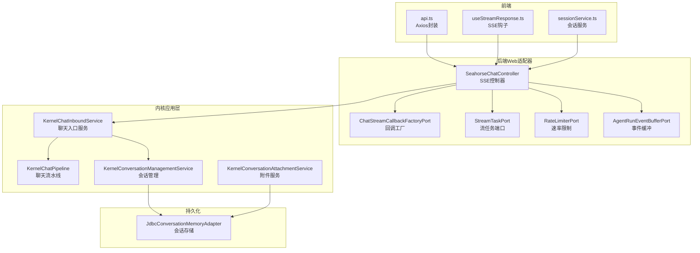
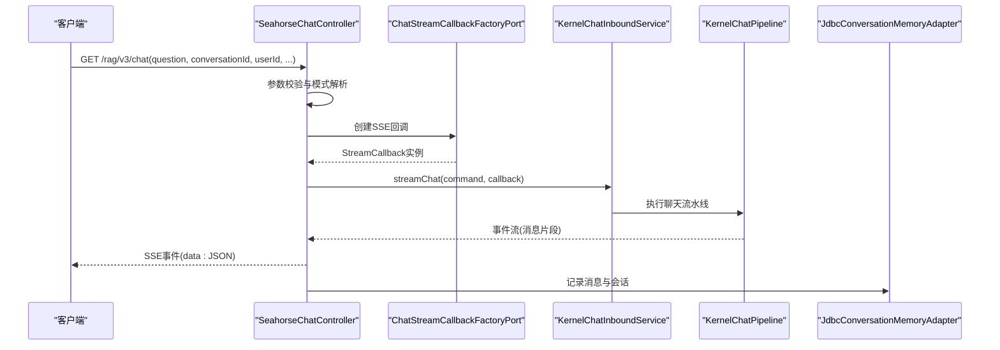
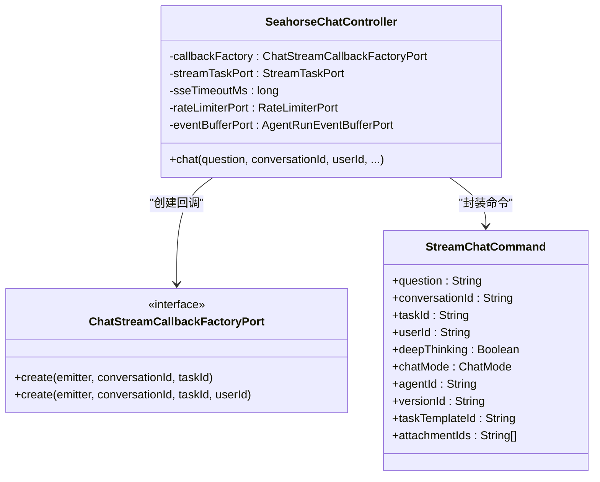
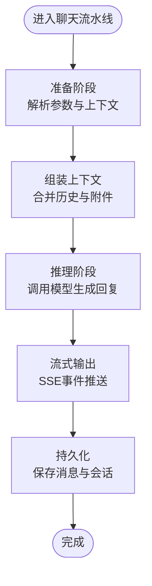
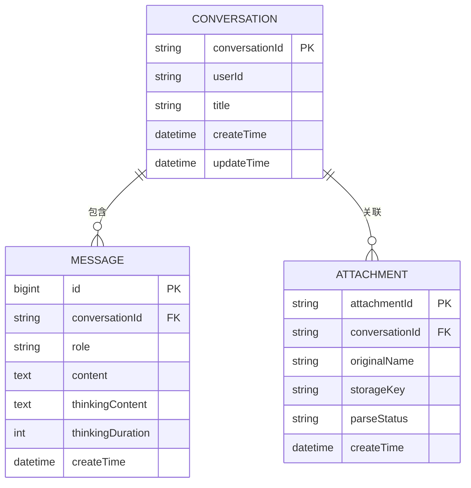
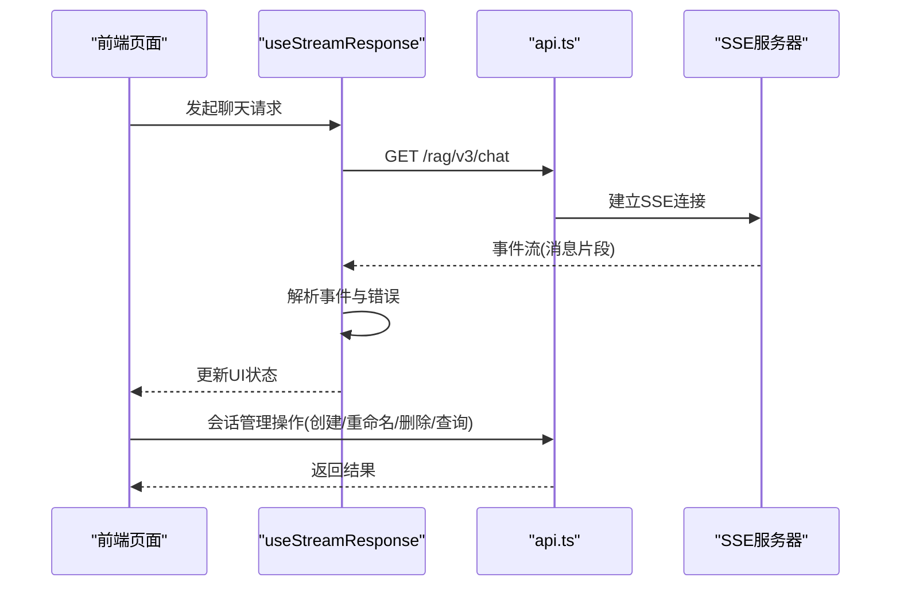
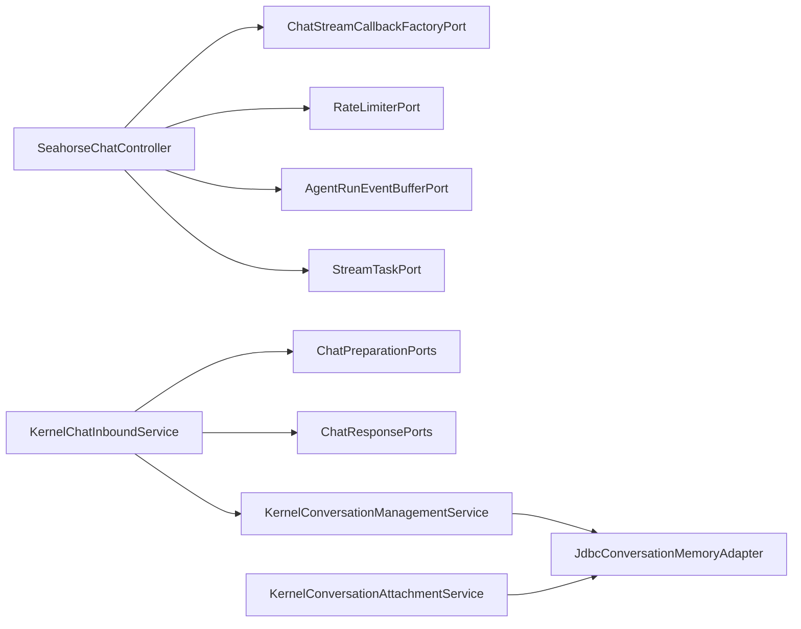

# 聊天接口

<cite>
**本文引用的文件**
- [SeahorseChatController.java](file://seahorse-agent-adapter-web/src/main/java/com/miracle/ai/seahorse/agent/adapters/web/SeahorseChatController.java)
- [ChatStreamCallbackFactoryPort.java](file://seahorse-agent-adapter-web/src/main/java/com/miracle/ai/seahorse/agent/adapters/web/ChatStreamCallbackFactoryPort.java)
- [KernelChatInboundService.java](file://seahorse-agent-kernel/src/main/java/com/miracle/ai/seahorse/agent/kernel/application/chat/KernelChatInboundService.java)
- [KernelChatPipeline.java](file://seahorse-agent-kernel/src/main/java/com/miracle/ai/seahorse/agent/kernel/application/chat/KernelChatPipeline.java)
- [ChatMessage.java](file://seahorse-agent-kernel/src/main/java/com/miracle/ai/seahorse/agent/kernel/domain/chat/ChatMessage.java)
- [ChatRole.java](file://seahorse-agent-kernel/src/main/java/com/miracle/ai/seahorse/agent/kernel/domain/chat/ChatRole.java)
- [ChatRequest.java](file://seahorse-agent-kernel/src/main/java/com/miracle/ai/seahorse/agent/kernel/domain/chat/ChatRequest.java)
- [ChatMode.java](file://seahorse-agent-kernel/src/main/java/com/miracle/ai/seahorse/agent/kernel/domain/chat/ChatMode.java)
- [JdbcConversationMemoryAdapter.java](file://seahorse-agent-adapter-repository-jdbc/src/main/java/com/miracle/ai/seahorse/agent/adapter/repository/jdbc/JdbcConversationMemoryAdapter.java)
- [sessionService.ts](file://frontend/src/services/sessionService.ts)
- [useStreamResponse.ts](file://frontend/src/hooks/useStreamResponse.ts)
- [api.ts](file://frontend/src/services/api.ts)
- [vite.config.ts](file://frontend/vite.config.ts)
- [SeahorseWebApiContractTests.java](file://seahorse-agent-tests/src/test/java/com/miracle/ai/seahorse/agent/adapters/web/SeahorseWebApiContractTests.java)
- [ChatPreparationPorts.java](file://seahorse-agent-kernel/src/main/java/com/miracle/ai/seahorse/agent/kernel/application/chat/ChatPreparationPorts.java)
- [ChatResponsePorts.java](file://seahorse-agent-kernel/src/main/java/com/miracle/ai/seahorse/agent/kernel/application/chat/ChatResponsePorts.java)
- [KernelConversationManagementService.java](file://seahorse-agent-kernel/src/main/java/com/miracle/ai/seahorse/agent/kernel/application/conversation/KernelConversationManagementService.java)
- [ConversationAttachmentParserService.java](file://seahorse-agent-kernel/src/main/java/com/miracle/ai/seahorse/agent/kernel/application/conversation/ConversationAttachmentParserService.java)
- [KernelConversationAttachmentService.java](file://seahorse-agent-kernel/src/main/java/com/miracle/ai/seahorse/agent/kernel/application/conversation/KernelConversationAttachmentService.java)
- [ConversationAttachment.java](file://seahorse-agent-kernel/src/main/java/com/miracle/ai/seahorse/agent/kernel/domain/conversation/ConversationAttachment.java)
- [ConversationAttachmentParseStatus.java](file://seahorse-agent-kernel/src/main/java/com/miracle/ai/seahorse/agent/kernel/domain/conversation/ConversationAttachmentParseStatus.java)
- [ConversationAttachmentInboundPort.java](file://seahorse-agent-kernel/src/main/java/com/miracle/ai/seahorse/agent/ports/inbound/conversation/ConversationAttachmentInboundPort.java)
- [ConversationManagementInboundPort.java](file://seahorse-agent-kernel/src/main/java/com/miracle/ai/seahorse/agent/ports/inbound/conversation/ConversationManagementInboundPort.java)
- [UploadConversationAttachmentCommand.java](file://seahorse-agent-kernel/src/main/java/com/miracle/ai/seahorse/agent/ports/inbound/conversation/UploadConversationAttachmentCommand.java)
- [ConversationAttachmentRepositoryPort.java](file://seahorse-agent-kernel/src/main/java/com/miracle/ai/seahorse/agent/ports/outbound/conversation/ConversationAttachmentRepositoryPort.java)
- [ConversationRepositoryPort.java](file://seahorse-agent-kernel/src/main/java/com/miracle/ai/seahorse/agent/ports/outbound/conversation/ConversationRepositoryPort.java)
- [ConversationMessageRecord.java](file://seahorse-agent-kernel/src/main/java/com/miracle/ai/seahorse/agent/ports/outbound/conversation/ConversationMessageRecord.java)
- [ConversationRecord.java](file://seahorse-agent-kernel/src/main/java/com/miracle/ai/seahorse/agent/ports/outbound/conversation/ConversationRecord.java)
- [AdvancedFeatureGate.java](file://seahorse-agent-adapter-web/src/main/java/com/miracle/ai/seahorse/agent/adapters/web/AdvancedFeatureGate.java)
- [RateLimiterPort.java](file://seahorse-agent-adapter-web/src/main/java/com/miracle/ai/seahorse/agent/adapters/web/RateLimiterPort.java)
- [AgentRunEventBufferPort.java](file://seahorse-agent-adapter-web/src/main/java/com/miracle/ai/seahorse/agent/adapters/web/AgentRunEventBufferPort.java)
- [AgentRunSnapshotInboundPort.java](file://seahorse-agent-adapter-web/src/main/java/com/miracle/ai/seahorse/agent/adapters/web/AgentRunSnapshotInboundPort.java)
- [ResearchInboundPort.java](file://seahorse-agent-adapter-web/src/main/java/com/miracle/ai/seahorse/agent/adapters/web/ResearchInboundPort.java)
- [ResearchSseBridgeProvider.java](file://seahorse-agent-adapter-web/src/main/java/com/miracle/ai/seahorse/agent/adapters/web/ResearchSseBridgeProvider.java)
- [StreamTaskPort.java](file://seahorse-agent-adapter-web/src/main/java/com/miracle/ai/seahorse/agent/adapters/web/StreamTaskPort.java)
- [ChatInboundPort.java](file://seahorse-agent-adapter-web/src/main/java/com/miracle/ai/seahorse/agent/adapters/web/ChatInboundPort.java)
- [ChatStreamCallback.java](file://seahorse-agent-adapter-web/src/main/java/com/miracle/ai/seahorse/agent/adapters/web/ChatStreamCallback.java)
- [StreamChatCommand.java](file://seahorse-agent-adapter-web/src/main/java/com/miracle/ai/seahorse/agent/adapters/web/StreamChatCommand.java)
- [SseEmitter.java](file://seahorse-agent-adapter-web/src/main/java/com/miracle/ai/seahorse/agent/adapters/web/SseEmitter.java)
</cite>

## 目录
1. [简介](#简介)
2. [项目结构](#项目结构)
3. [核心组件](#核心组件)
4. [架构总览](#架构总览)
5. [详细组件分析](#详细组件分析)
6. [依赖关系分析](#依赖关系分析)
7. [性能考量](#性能考量)
8. [故障排查指南](#故障排查指南)
9. [结论](#结论)
10. [附录](#附录)

## 简介
本文件为Seahorse Agent聊天接口的完整API文档，覆盖以下内容：
- 流式对话接口（SSE）：连接建立、消息推送格式、连接维护与断线恢复、速率限制与任务取消。
- 聊天请求数据结构：用户消息、上下文、采样参数与"深度思考"模式。
- 会话管理接口：创建、重命名、删除、历史查询。
- 客户端处理建议：如何解析事件、处理错误与断线重连。
- WebSocket连接与SSE实现对比说明。
- 聊天机器人集成指南与自定义扩展方法。
- 消息加密、会话持久化与性能优化策略。

## 项目结构
聊天功能由后端Web适配器、内核应用层与前端服务三部分组成：
- 后端Web适配器：提供HTTP接口与SSE流式响应。
- 内核应用层：封装聊天业务逻辑、上下文组装与消息处理。
- 前端服务：会话管理与SSE事件处理。

**图表来源**
- [SeahorseChatController.java:178-228](file://seahorse-agent-adapter-web/src/main/java/com/miracle/ai/seahorse/agent/adapters/web/SeahorseChatController.java#L178-L228)
- [KernelChatInboundService.java:1-200](file://seahorse-agent-kernel/src/main/java/com/miracle/ai/seahorse/agent/kernel/application/chat/KernelChatInboundService.java#L1-L200)
- [JdbcConversationMemoryAdapter.java:120-147](file://seahorse-agent-adapter-repository-jdbc/src/main/java/com/miracle/ai/seahorse/agent/adapter/repository/jdbc/JdbcConversationMemoryAdapter.java#L120-L147)

**章节来源**
- [SeahorseChatController.java:178-228](file://seahorse-agent-adapter-web/src/main/java/com/miracle/ai/seahorse/agent/adapters/web/SeahorseChatController.java#L178-L228)
- [KernelChatInboundService.java:1-200](file://seahorse-agent-kernel/src/main/java/com/miracle/ai/seahorse/agent/kernel/application/chat/KernelChatInboundService.java#L1-L200)
- [JdbcConversationMemoryAdapter.java:120-147](file://seahorse-agent-adapter-repository-jdbc/src/main/java/com/miracle/ai/seahorse/agent/adapter/repository/jdbc/JdbcConversationMemoryAdapter.java#L120-L147)

## 核心组件
- SSE控制器：负责接收聊天请求、建立SSE连接、派发流式回调。
- 回调工厂：生成针对SSE的流式回调实例。
- 聊天入口服务：协调内核聊天流水线与会话管理。
- 会话存储：基于JDBC的会话与消息持久化。
- 前端服务：封装Axios请求、SSE事件处理与会话操作。

**章节来源**
- [SeahorseChatController.java:102-176](file://seahorse-agent-adapter-web/src/main/java/com/miracle/ai/seahorse/agent/adapters/web/SeahorseChatController.java#L102-L176)
- [ChatStreamCallbackFactoryPort.java:26-33](file://seahorse-agent-adapter-web/src/main/java/com/miracle/ai/seahorse/agent/adapters/web/ChatStreamCallbackFactoryPort.java#L26-L33)
- [KernelChatInboundService.java:1-200](file://seahorse-agent-kernel/src/main/java/com/miracle/ai/seahorse/agent/kernel/application/chat/KernelChatInboundService.java#L1-L200)
- [JdbcConversationMemoryAdapter.java:120-147](file://seahorse-agent-adapter-repository-jdbc/src/main/java/com/miracle/ai/seahorse/agent/adapter/repository/jdbc/JdbcConversationMemoryAdapter.java#L120-L147)

## 架构总览
聊天请求从HTTP接口进入，经由SSE控制器转换为流式回调，交由内核聊天入口服务处理，最终落库到会话存储中。

**图表来源**
- [SeahorseChatController.java:178-228](file://seahorse-agent-adapter-web/src/main/java/com/miracle/ai/seahorse/agent/adapters/web/SeahorseChatController.java#L178-L228)
- [KernelChatInboundService.java:1-200](file://seahorse-agent-kernel/src/main/java/com/miracle/ai/seahorse/agent/kernel/application/chat/KernelChatInboundService.java#L1-L200)
- [JdbcConversationMemoryAdapter.java:120-147](file://seahorse-agent-adapter-repository-jdbc/src/main/java/com/miracle/ai/seahorse/agent/adapter/repository/jdbc/JdbcConversationMemoryAdapter.java#L120-L147)

## 详细组件分析

### SSE控制器与流式回调
- 控制器提供GET /rag/v3/chat接口，支持SSE流式响应。
- 支持参数：question、conversationId、userId、chatMode、agentId、versionId、taskTemplateId、attachmentIds、deepThinking等。
- 建立SseEmitter连接，超时时间可配置。
- 将请求参数封装为StreamChatCommand，交由ChatInboundPort执行流式聊天。

**图表来源**
- [SeahorseChatController.java:178-228](file://seahorse-agent-adapter-web/src/main/java/com/miracle/ai/seahorse/agent/adapters/web/SeahorseChatController.java#L178-L228)
- [ChatStreamCallbackFactoryPort.java:26-33](file://seahorse-agent-adapter-web/src/main/java/com/miracle/ai/seahorse/agent/adapters/web/ChatStreamCallbackFactoryPort.java#L26-L33)
- [StreamChatCommand.java:1-200](file://seahorse-agent-adapter-web/src/main/java/com/miracle/ai/seahorse/agent/adapters/web/StreamChatCommand.java#L1-L200)

**章节来源**
- [SeahorseChatController.java:178-228](file://seahorse-agent-adapter-web/src/main/java/com/miracle/ai/seahorse/agent/adapters/web/SeahorseChatController.java#L178-L228)
- [ChatStreamCallbackFactoryPort.java:26-33](file://seahorse-agent-adapter-web/src/main/java/com/miracle/ai/seahorse/agent/adapters/web/ChatStreamCallbackFactoryPort.java#L26-L33)

### 内核聊天流水线
- KernelChatInboundService协调聊天准备与响应生成。
- KernelChatPipeline执行消息预处理、上下文组装、模型推理与结果回传。
- 支持不同ChatMode（如agent模式），并可选"深度思考"模式。

**图表来源**
- [KernelChatInboundService.java:1-200](file://seahorse-agent-kernel/src/main/java/com/miracle/ai/seahorse/agent/kernel/application/chat/KernelChatInboundService.java#L1-L200)
- [KernelChatPipeline.java:1-200](file://seahorse-agent-kernel/src/main/java/com/miracle/ai/seahorse/agent/kernel/application/chat/KernelChatPipeline.java#L1-L200)

**章节来源**
- [KernelChatInboundService.java:1-200](file://seahorse-agent-kernel/src/main/java/com/miracle/ai/seahorse/agent/kernel/application/chat/KernelChatInboundService.java#L1-L200)
- [KernelChatPipeline.java:1-200](file://seahorse-agent-kernel/src/main/java/com/miracle/ai/seahorse/agent/kernel/application/chat/KernelChatPipeline.java#L1-L200)

### 会话管理与消息持久化
- 会话管理：创建、重命名、删除、列出历史。
- 消息持久化：历史消息加载、去前导助手消息、记录思考内容与耗时。
- 附件解析与上传：支持会话附件的解析与存储。

**图表来源**
- [JdbcConversationMemoryAdapter.java:120-147](file://seahorse-agent-adapter-repository-jdbc/src/main/java/com/miracle/ai/seahorse/agent/adapter/repository/jdbc/JdbcConversationMemoryAdapter.java#L120-L147)
- [ConversationRecord.java:1-200](file://seahorse-agent-kernel/src/main/java/com/miracle/ai/seahorse/agent/ports/outbound/conversation/ConversationRecord.java#L1-L200)
- [ConversationMessageRecord.java:1-200](file://seahorse-agent-kernel/src/main/java/com/miracle/ai/seahorse/agent/ports/outbound/conversation/ConversationMessageRecord.java#L1-L200)
- [ConversationAttachment.java:1-200](file://seahorse-agent-kernel/src/main/java/com/miracle/ai/seahorse/agent/kernel/domain/conversation/ConversationAttachment.java#L1-L200)

**章节来源**
- [sessionService.ts:22-41](file://frontend/src/services/sessionService.ts#L22-L41)
- [JdbcConversationMemoryAdapter.java:120-147](file://seahorse-agent-adapter-repository-jdbc/src/main/java/com/miracle/ai/seahorse/agent/adapter/repository/jdbc/JdbcConversationMemoryAdapter.java#L120-L147)

### 前端SSE处理与会话服务
- useStreamResponse.ts：封装SSE事件解析、错误处理与断线重连。
- sessionService.ts：提供会话创建、重命名、删除与历史查询接口。
- api.ts：Axios封装，统一拦截器与错误处理。

**图表来源**
- [useStreamResponse.ts:1-176](file://frontend/src/hooks/useStreamResponse.ts#L1-L176)
- [sessionService.ts:22-41](file://frontend/src/services/sessionService.ts#L22-L41)
- [api.ts:1-66](file://frontend/src/services/api.ts#L1-L66)

**章节来源**
- [useStreamResponse.ts:1-176](file://frontend/src/hooks/useStreamResponse.ts#L1-L176)
- [sessionService.ts:22-41](file://frontend/src/services/sessionService.ts#L22-L41)
- [api.ts:1-66](file://frontend/src/services/api.ts#L1-L66)

## 依赖关系分析
- 控制器依赖回调工厂、流任务端口、速率限制与事件缓冲端口。
- 内核服务依赖聊天准备与响应端口，以及会话管理与附件服务。
- 存储适配器依赖JDBC模板与数据库表结构。

**图表来源**
- [SeahorseChatController.java:102-176](file://seahorse-agent-adapter-web/src/main/java/com/miracle/ai/seahorse/agent/adapters/web/SeahorseChatController.java#L102-L176)
- [KernelChatInboundService.java:1-200](file://seahorse-agent-kernel/src/main/java/com/miracle/ai/seahorse/agent/kernel/application/chat/KernelChatInboundService.java#L1-L200)
- [JdbcConversationMemoryAdapter.java:120-147](file://seahorse-agent-adapter-repository-jdbc/src/main/java/com/miracle/ai/seahorse/agent/adapter/repository/jdbc/JdbcConversationMemoryAdapter.java#L120-L147)

**章节来源**
- [SeahorseChatController.java:102-176](file://seahorse-agent-adapter-web/src/main/java/com/miracle/ai/seahorse/agent/adapters/web/SeahorseChatController.java#L102-L176)
- [KernelChatInboundService.java:1-200](file://seahorse-agent-kernel/src/main/java/com/miracle/ai/seahorse/agent/kernel/application/chat/KernelChatInboundService.java#L1-L200)

## 性能考量
- SSE超时与连接管理：合理设置超时时间，避免长时间占用连接。
- 速率限制：通过RateLimiterPort限制请求频率，防止过载。
- 事件缓冲：AgentRunEventBufferPort用于平滑事件流，减少抖动。
- 数据库访问：JdbcConversationMemoryAdapter限制历史消息数量，避免过大载荷。
- 前端渲染：useStreamResponse.ts按事件增量更新UI，降低重绘成本。

**章节来源**
- [SeahorseChatController.java:99-119](file://seahorse-agent-adapter-web/src/main/java/com/miracle/ai/seahorse/agent/adapters/web/SeahorseChatController.java#L99-L119)
- [RateLimiterPort.java:1-200](file://seahorse-agent-adapter-web/src/main/java/com/miracle/ai/seahorse/agent/adapters/web/RateLimiterPort.java#L1-L200)
- [AgentRunEventBufferPort.java:1-200](file://seahorse-agent-adapter-web/src/main/java/com/miracle/ai/seahorse/agent/adapters/web/AgentRunEventBufferPort.java#L1-L200)
- [JdbcConversationMemoryAdapter.java:120-147](file://seahorse-agent-adapter-repository-jdbc/src/main/java/com/miracle/ai/seahorse/agent/adapter/repository/jdbc/JdbcConversationMemoryAdapter.java#L120-L147)

## 故障排查指南
- SSE流中断：检查AbortController是否提前取消；确认服务端事件格式（event/data行）；适当增加重试次数与延迟。
- 401跳转登录但无提示：确认响应拦截器是否正确识别401；检查后端返回结构与message内容。
- 网络错误频繁：检查ERR_NETWORK场景与网络环境；在弱网下启用指数退避与提示抑制。
- 代理无效：确认Vite代理配置与后端实际端口一致；浏览器Network面板查看/api前缀是否被转发。
- 登录后仍提示未登录：检查本地Token是否正确写入与读取；确认拦截器是否注入Authorization。

**章节来源**
- [useStreamResponse.ts:1-176](file://frontend/src/hooks/useStreamResponse.ts#L1-L176)
- [api.ts:1-66](file://frontend/src/services/api.ts#L1-L66)
- [vite.config.ts:1-23](file://frontend/vite.config.ts#L1-L23)

## 结论
本聊天接口以Spring MVC + SSE为核心，结合内核聊天流水线与JDBC会话存储，提供了完整的流式对话能力。前端通过Axios与SSE钩子实现事件解析与状态管理，具备良好的可维护性与扩展性。建议在生产环境中补充缓存、并发控制与网络质量感知策略，并持续完善测试与可观测性。

## 附录

### API规范概览
- 流式对话接口：GET /rag/v3/chat
  - 请求参数：question、conversationId、userId、chatMode、agentId、versionId、taskTemplateId、attachmentIds、deepThinking
  - 响应：TEXT_EVENT_STREAM，事件类型包括data、error、done等
- 会话管理接口：/conversations
  - POST：创建会话，返回conversationId
  - GET：列出会话列表
  - PUT：重命名会话
  - DELETE：删除会话
- 历史查询接口：/conversations/{conversationId}/messages
  - GET：获取指定会话的历史消息

**章节来源**
- [SeahorseChatController.java:178-228](file://seahorse-agent-adapter-web/src/main/java/com/miracle/ai/seahorse/agent/adapters/web/SeahorseChatController.java#L178-L228)
- [sessionService.ts:22-41](file://frontend/src/services/sessionService.ts#L22-L41)

### WebSocket与SSE对比
- SSE优势：单向服务器推送、自动重连、事件分发简单、浏览器兼容性好。
- WebSocket适用：双向通信、复杂交互、低延迟实时互动。
- 选择建议：聊天场景优先SSE；需要双向交互或复杂协议时考虑WebSocket。

### 聊天机器人集成指南
- 基础集成步骤：
  1) 在前端页面引入api.ts与useStreamResponse.ts。
  2) 调用GET /rag/v3/chat发起聊天，监听SSE事件。
  3) 使用sessionService.ts进行会话管理。
- 自定义扩展：
  - 新增ChatMode：在ChatMode枚举中添加新模式，扩展KernelChatPipeline处理逻辑。
  - 自定义回调：实现ChatStreamCallback接口，定制事件处理与错误恢复。
  - 速率限制：通过RateLimiterPort实现自定义限流策略。
  - 事件缓冲：扩展AgentRunEventBufferPort实现事件聚合与去抖。

**章节来源**
- [ChatMode.java:1-200](file://seahorse-agent-kernel/src/main/java/com/miracle/ai/seahorse/agent/kernel/domain/chat/ChatMode.java#L1-L200)
- [KernelChatPipeline.java:1-200](file://seahorse-agent-kernel/src/main/java/com/miracle/ai/seahorse/agent/kernel/application/chat/KernelChatPipeline.java#L1-L200)
- [ChatStreamCallback.java:1-200](file://seahorse-agent-adapter-web/src/main/java/com/miracle/ai/seahorse/agent/adapters/web/ChatStreamCallback.java#L1-L200)
- [RateLimiterPort.java:1-200](file://seahorse-agent-adapter-web/src/main/java/com/miracle/ai/seahorse/agent/adapters/web/RateLimiterPort.java#L1-L200)
- [AgentRunEventBufferPort.java:1-200](file://seahorse-agent-adapter-web/src/main/java/com/miracle/ai/seahorse/agent/adapters/web/AgentRunEventBufferPort.java#L1-L200)

### 消息加密与会话持久化
- 消息加密：建议在传输层启用HTTPS，在应用层对敏感字段进行加密存储。
- 会话持久化：JdbcConversationMemoryAdapter已实现消息与会话的持久化，支持历史消息截断与去前导助手消息。
- 性能优化：合理设置历史消息上限、启用数据库索引、使用连接池与异步I/O。

**章节来源**
- [JdbcConversationMemoryAdapter.java:120-147](file://seahorse-agent-adapter-repository-jdbc/src/main/java/com/miracle/ai/seahorse/agent/adapter/repository/jdbc/JdbcConversationMemoryAdapter.java#L120-L147)