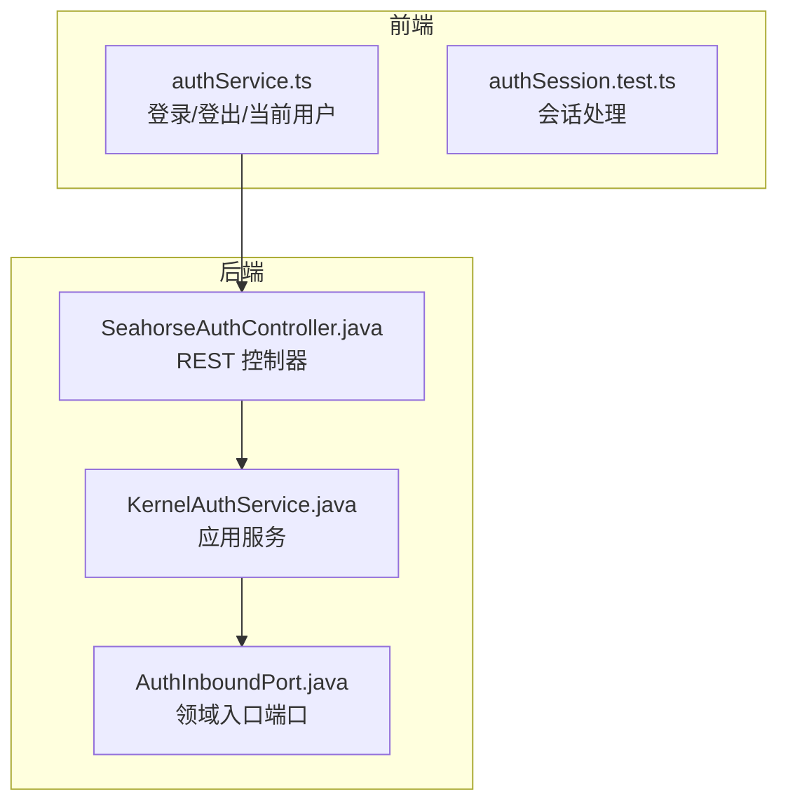
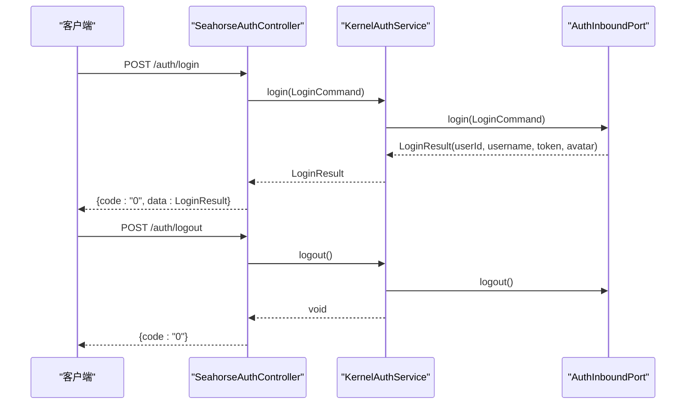
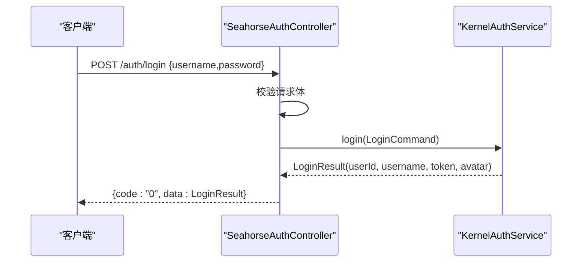
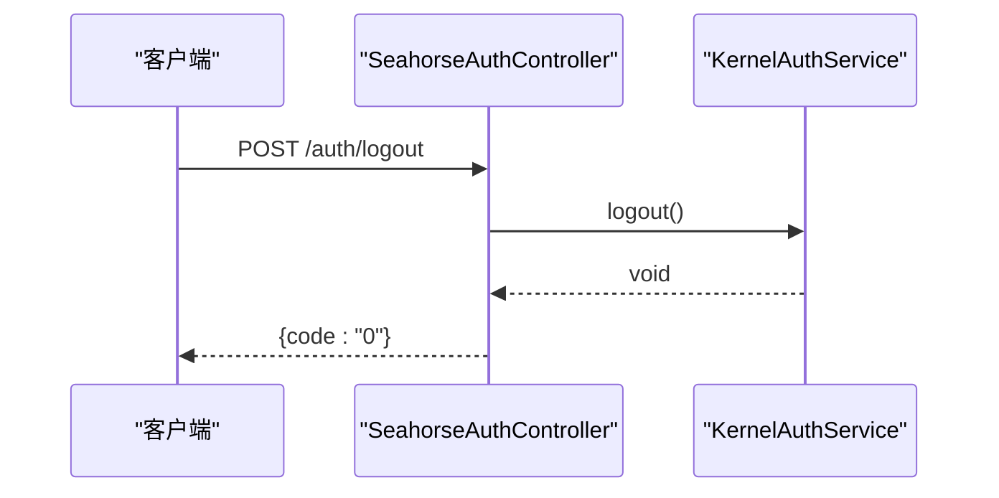
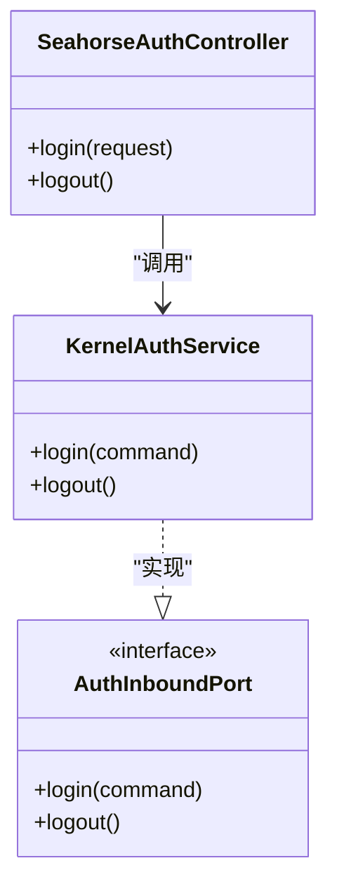

# 认证接口

<cite>
**本文引用的文件**
- [SeahorseAuthController.java](file://seahorse-agent-adapter-web/src/main/java/com/miracle/ai/seahorse/agent/adapters/web/SeahorseAuthController.java)
- [AuthLoginRequest.java](file://seahorse-agent-adapter-web/src/main/java/com/miracle/ai/seahorse/agent/adapters/web/AuthLoginRequest.java)
- [KernelAuthService.java](file://seahorse-agent-kernel/src/main/java/com/miracle/ai/seahorse/agent/kernel/application/auth/KernelAuthService.java)
- [AuthInboundPort.java](file://seahorse-agent-kernel/src/main/java/com/miracle/ai/seahorse/agent/ports/inbound/auth/AuthInboundPort.java)
- [authService.ts](file://frontend/src/services/authService.ts)
- [authSession.test.ts](file://frontend/src/utils/authSession.test.ts)
- [认证接口.md](file://docs/zh/content/API 接口文档/认证接口.md)
- [SeahorseAuthControllerTests.java](file://seahorse-agent-adapter-web/src/test/java/com/miracle/ai/seahorse/agent/adapters/web/SeahorseAuthControllerTests.java)
- [KernelAuthServiceTests.java](file://seahorse-agent-tests/src/test/java/com/miracle/ai/seahorse/agent/kernel/application/auth/KernelAuthServiceTests.java)
- [SeahorseWebApiContractTests.java](file://seahorse-agent-tests/src/test/java/com/miracle/ai/seahorse/agent/adapters/web/SeahorseWebApiContractTests.java)
</cite>

## 目录
1. [简介](#简介)
2. [项目结构](#项目结构)
3. [核心组件](#核心组件)
4. [架构总览](#架构总览)
5. [详细组件分析](#详细组件分析)
6. [依赖分析](#依赖分析)
7. [性能考虑](#性能考虑)
8. [故障排除指南](#故障排除指南)
9. [结论](#结论)
10. [附录](#附录)

## 简介
本文件为 Seahorse Agent 认证接口的详细 API 文档，覆盖用户登录、登出、当前用户查询等认证相关接口。内容包括：
- 登录接口：请求参数、响应格式、认证令牌生成与返回
- 登出接口：处理流程与令牌失效机制
- 当前用户查询：获取登录用户信息
- 前端集成：认证中间件（Axios）配置、状态管理与路由守卫
- 完整请求/响应示例：成功与失败场景
- 安全最佳实践与常见问题解决方案

## 项目结构
认证相关能力由后端 Web 适配层、内核应用层与前端共同协作完成：
- 后端
  - 控制器：提供 /auth/login、/auth/logout、/user/me 接口
  - 应用服务：内核认证服务负责校验凭据、生成令牌
  - 安全配置：全局拦截器强制登录校验
  - 适配器：Sa-Token 令牌服务与当前用户适配
- 前端
  - Axios 请求拦截器自动附加 Authorization 头
  - 认证状态管理与路由守卫
  - 登录/登出/获取当前用户的服务封装

**图表来源**
- [SeahorseAuthController.java:43-54](file://seahorse-agent-adapter-web/src/main/java/com/miracle/ai/seahorse/agent/adapters/web/SeahorseAuthController.java#L43-L54)
- [KernelAuthService.java](file://seahorse-agent-kernel/src/main/java/com/miracle/ai/seahorse/agent/kernel/application/auth/KernelAuthService.java)
- [AuthInboundPort.java](file://seahorse-agent-kernel/src/main/java/com/miracle/ai/seahorse/agent/ports/inbound/auth/AuthInboundPort.java)

**章节来源**
- [认证接口.md:41-51](file://docs/zh/content/API 接口文档/认证接口.md#L41-L51)

## 核心组件
- REST 控制器：提供认证相关 HTTP 接口
- 应用服务：实现认证业务逻辑
- 入口端口：定义认证领域操作契约
- 前端服务：封装认证 API 调用

**章节来源**
- [SeahorseAuthController.java:30-55](file://seahorse-agent-adapter-web/src/main/java/com/miracle/ai/seahorse/agent/adapters/web/SeahorseAuthController.java#L30-L55)
- [KernelAuthService.java](file://seahorse-agent-kernel/src/main/java/com/miracle/ai/seahorse/agent/kernel/application/auth/KernelAuthService.java)
- [AuthInboundPort.java](file://seahorse-agent-kernel/src/main/java/com/miracle/ai/seahorse/agent/ports/inbound/auth/AuthInboundPort.java)

## 架构总览
认证接口采用分层架构，控制器负责 HTTP 映射，应用服务处理业务逻辑，入口端口定义领域契约。

**图表来源**
- [SeahorseAuthController.java:43-54](file://seahorse-agent-adapter-web/src/main/java/com/miracle/ai/seahorse/agent/adapters/web/SeahorseAuthController.java#L43-L54)
- [KernelAuthService.java](file://seahorse-agent-kernel/src/main/java/com/miracle/ai/seahorse/agent/kernel/application/auth/KernelAuthService.java)
- [AuthInboundPort.java](file://seahorse-agent-kernel/src/main/java/com/miracle/ai/seahorse/agent/ports/inbound/auth/AuthInboundPort.java)

## 详细组件分析

### 登录接口
- HTTP 方法：POST
- URL 路径：/auth/login
- 请求体：AuthLoginRequest
  - 字段：username（字符串，必填）、password（字符串，必填）
- 响应体：统一响应结构
  - code：字符串，成功时为 "0"
  - data：LoginResult
    - userId：字符串，用户标识
    - username：字符串，用户名
    - token：字符串，认证令牌
    - avatar：字符串，头像地址
- 状态码：200 成功；400 参数错误；401 认证失败；500 服务器错误

**图表来源**
- [SeahorseAuthController.java:43-48](file://seahorse-agent-adapter-web/src/main/java/com/miracle/ai/seahorse/agent/adapters/web/SeahorseAuthController.java#L43-L48)
- [AuthLoginRequest.java](file://seahorse-agent-adapter-web/src/main/java/com/miracle/ai/seahorse/agent/adapters/web/AuthLoginRequest.java)
- [KernelAuthService.java](file://seahorse-agent-kernel/src/main/java/com/miracle/ai/seahorse/agent/kernel/application/auth/KernelAuthService.java)

**章节来源**
- [SeahorseAuthController.java:43-48](file://seahorse-agent-adapter-web/src/main/java/com/miracle/ai/seahorse/agent/adapters/web/SeahorseAuthController.java#L43-L48)
- [AuthLoginRequest.java](file://seahorse-agent-adapter-web/src/main/java/com/miracle/ai/seahorse/agent/adapters/web/AuthLoginRequest.java)
- [SeahorseAuthControllerTests.java:44-68](file://seahorse-agent-adapter-web/src/test/java/com/miracle/ai/seahorse/agent/adapters/web/SeahorseAuthControllerTests.java#L44-L68)
- [认证接口.md:32-39](file://docs/zh/content/API 接口文档/认证接口.md#L32-L39)

### 登出接口
- HTTP 方法：POST
- URL 路径：/auth/logout
- 请求体：无
- 响应体：统一响应结构
  - code：字符串，成功时为 "0"
- 状态码：200 成功；500 服务器错误

**图表来源**
- [SeahorseAuthController.java:50-54](file://seahorse-agent-adapter-web/src/main/java/com/miracle/ai/seahorse/agent/adapters/web/SeahorseAuthController.java#L50-L54)
- [KernelAuthService.java](file://seahorse-agent-kernel/src/main/java/com/miracle/ai/seahorse/agent/kernel/application/auth/KernelAuthService.java)

**章节来源**
- [SeahorseAuthController.java:50-54](file://seahorse-agent-adapter-web/src/main/java/com/miracle/ai/seahorse/agent/adapters/web/SeahorseAuthController.java#L50-L54)
- [SeahorseAuthControllerTests.java:70-81](file://seahorse-agent-adapter-web/src/test/java/com/miracle/ai/seahorse/agent/adapters/web/SeahorseAuthControllerTests.java#L70-L81)

### 当前用户查询接口
- HTTP 方法：GET
- URL 路径：/user/me
- 请求体：无
- 响应体：统一响应结构
  - code：字符串，成功时为 "0"
  - data：CurrentUser
    - id：数字，用户标识
    - username：字符串，用户名
    - realName：字符串，真实姓名
    - avatar：字符串，头像地址
- 状态码：200 成功；401 未认证；500 服务器错误

**章节来源**
- [authService.ts:15-17](file://frontend/src/services/authService.ts#L15-L17)

### 密码修改接口
- HTTP 方法：PUT
- URL 路径：/user/password
- 请求体：ChangePasswordCommand
  - 字段：oldPassword（字符串，必填）、newPassword（字符串，必填）
- 响应体：统一响应结构
  - code：字符串，成功时为 "0"
- 状态码：200 成功；400 参数错误；401 未认证；403 权限不足；500 服务器错误

**章节来源**
- [认证接口.md](file://docs/zh/content/API 接口文档/认证接口.md)

### 令牌刷新机制
- 说明：当前仓库未提供专用的令牌刷新接口。建议在前端或后端实现独立的刷新端点，或复用登录接口以获取新令牌。
- 安全建议：刷新令牌应具备有效期与防重放机制，避免长时间有效令牌带来的风险。

**章节来源**
- [认证接口.md](file://docs/zh/content/API 接口文档/认证接口.md)

### JWT 令牌的生成、验证和刷新机制
- 生成：登录成功后返回 token 字段，作为后续请求的认证凭证
- 验证：通过全局拦截器强制登录校验，未认证请求返回 401
- 刷新：建议实现独立刷新端点，或在登录接口中支持刷新逻辑
- 建议：令牌应包含用户标识、过期时间与签名，前端存储于安全位置，避免 XSS 攻击

**章节来源**
- [认证接口.md](file://docs/zh/content/API 接口文档/认证接口.md)

## 依赖分析
认证接口的依赖关系如下：

**图表来源**
- [SeahorseAuthController.java:30-55](file://seahorse-agent-adapter-web/src/main/java/com/miracle/ai/seahorse/agent/adapters/web/SeahorseAuthController.java#L30-L55)
- [KernelAuthService.java](file://seahorse-agent-kernel/src/main/java/com/miracle/ai/seahorse/agent/kernel/application/auth/KernelAuthService.java)
- [AuthInboundPort.java](file://seahorse-agent-kernel/src/main/java/com/miracle/ai/seahorse/agent/ports/inbound/auth/AuthInboundPort.java)

**章节来源**
- [SeahorseAuthController.java:37-41](file://seahorse-agent-adapter-web/src/main/java/com/miracle/ai/seahorse/agent/adapters/web/SeahorseAuthController.java#L37-L41)
- [KernelAuthService.java](file://seahorse-agent-kernel/src/main/java/com/miracle/ai/seahorse/agent/kernel/application/auth/KernelAuthService.java)
- [AuthInboundPort.java](file://seahorse-agent-kernel/src/main/java/com/miracle/ai/seahorse/agent/ports/inbound/auth/AuthInboundPort.java)

## 性能考虑
- 登录与登出接口均为轻量级操作，主要开销在于用户认证与令牌生成
- 建议对频繁调用的接口启用缓存与限流策略
- 前端应避免重复登录请求，合理利用本地存储的令牌

## 故障排除指南
- 登录失败
  - 检查用户名与密码是否正确
  - 查看后端日志确认认证服务异常
- 未认证访问
  - 确认请求头中携带有效的 Authorization 头
  - 检查令牌是否过期或被撤销
- 会话异常
  - 前端清理本地存储的认证信息并重新登录
  - 确认全局拦截器正常工作

**章节来源**
- [authSession.test.ts:12-36](file://frontend/src/utils/authSession.test.ts#L12-L36)
- [KernelAuthServiceTests.java:56-61](file://seahorse-agent-tests/src/test/java/com/miracle/ai/seahorse/agent/kernel/application/auth/KernelAuthServiceTests.java#L56-L61)

## 结论
本文档提供了 Seahorse Agent 认证接口的完整 API 规范与实现要点，涵盖登录、登出、当前用户查询等核心功能，并给出了前端集成与安全最佳实践建议。对于令牌刷新与密码修改等扩展能力，建议参考现有接口模式进行扩展实现。

## 附录
- 统一响应结构
  - code：字符串，业务状态码，成功时为 "0"
  - data：对象，具体业务数据
- 错误码约定
  - 0：成功
  - 其他：业务错误，需根据具体场景定义
- SDK 集成指南
  - 前端：通过 authService.ts 封装的函数调用认证接口
  - 后端：通过 AuthInboundPort 接入认证领域逻辑

**章节来源**
- [认证接口.md:32-39](file://docs/zh/content/API 接口文档/认证接口.md#L32-L39)
- [SeahorseWebApiContractTests.java:218-235](file://seahorse-agent-tests/src/test/java/com/miracle/ai/seahorse/agent/adapters/web/SeahorseWebApiContractTests.java#L218-L235)