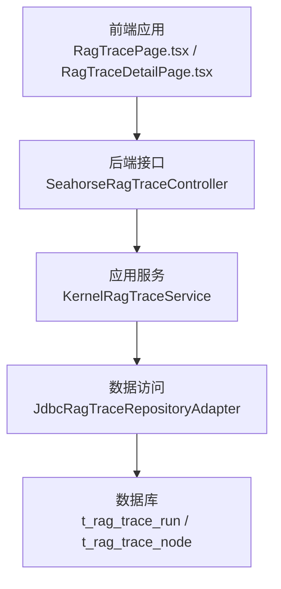
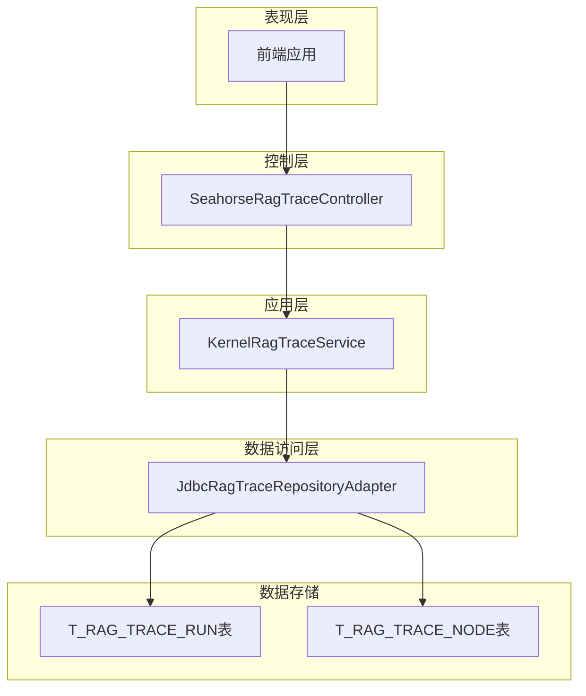
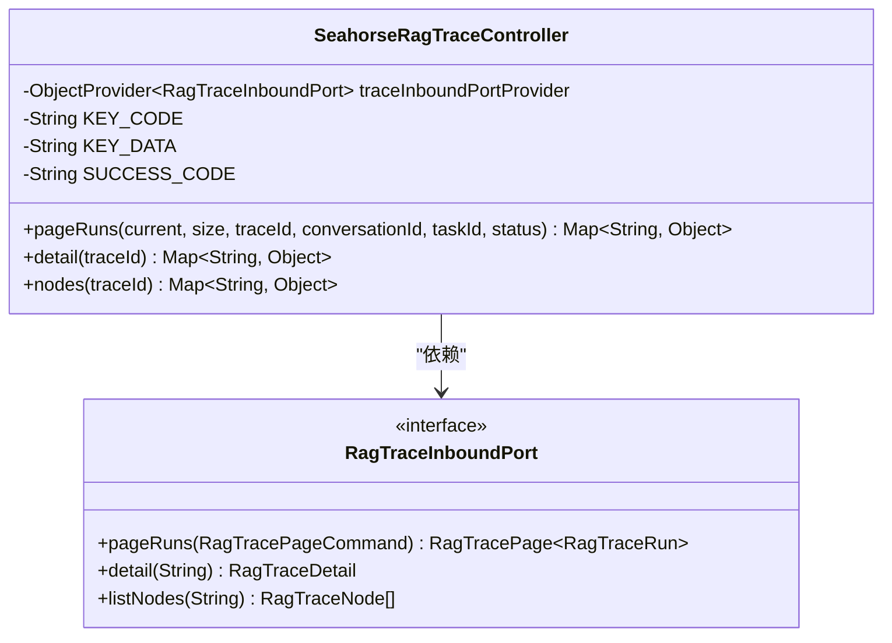
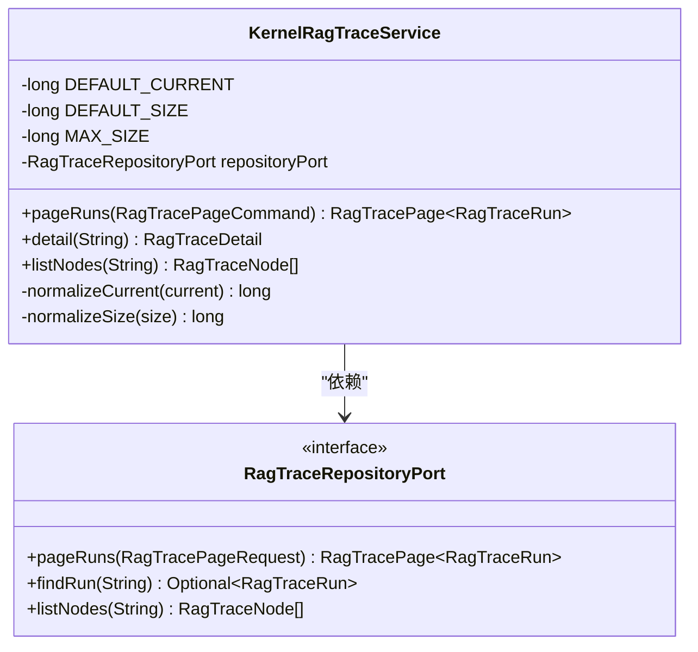
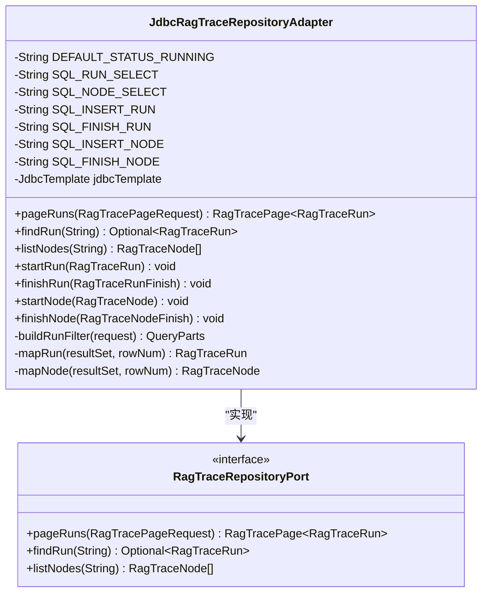
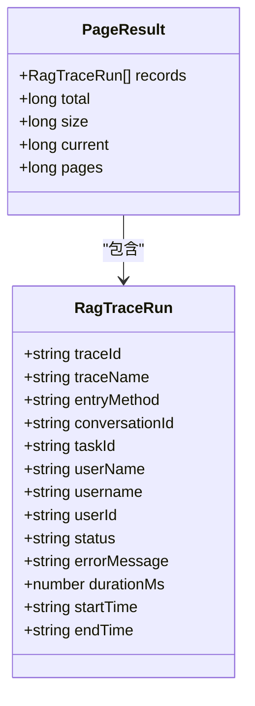
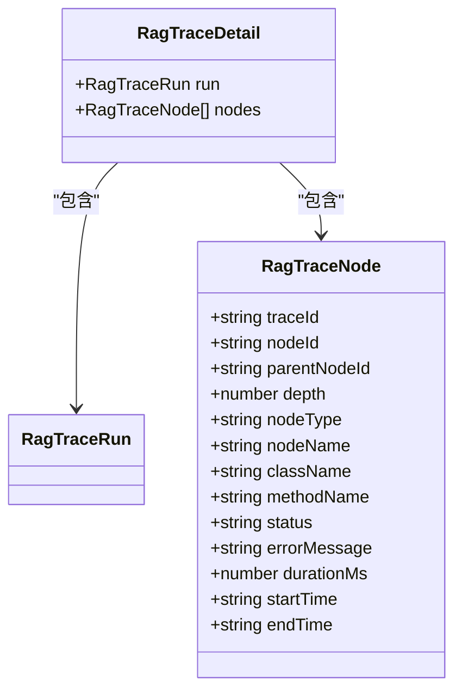
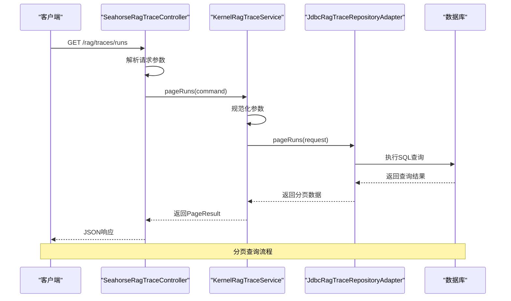
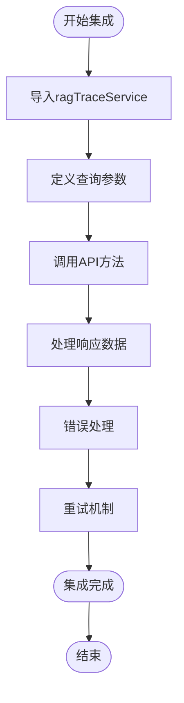
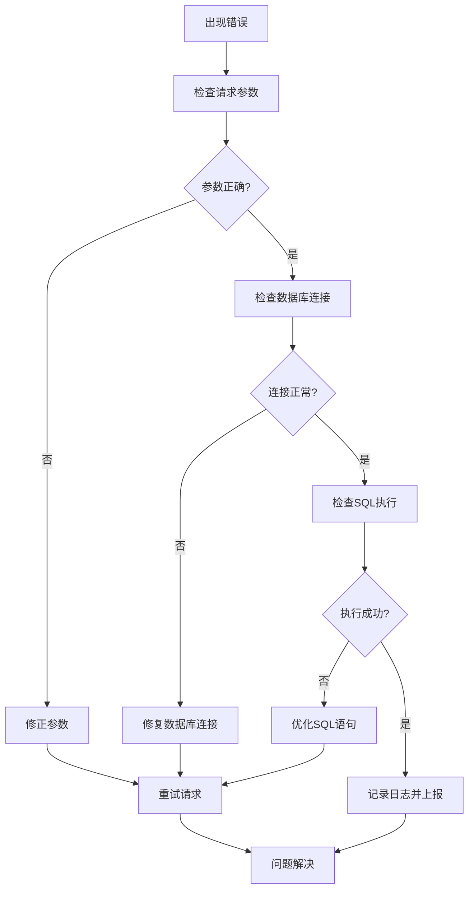

# RAG追踪查询接口

<cite>
**本文档引用的文件**
- [SeahorseRagTraceController.java](file://seahorse-agent-adapter-web/src/main/java/com/miracle/ai/seahorse/agent/adapters/web/SeahorseRagTraceController.java)
- [KernelRagTraceService.java](file://seahorse-agent-kernel/src/main/java/com/miracle/ai/seahorse/agent/kernel/application/trace/KernelRagTraceService.java)
- [JdbcRagTraceRepositoryAdapter.java](file://seahorse-agent-adapter-repository-jdbc/src/main/java/com/miracle/ai/seahorse/agent/adapters/repository/jdbc/JdbcRagTraceRepositoryAdapter.java)
- [RagTraceInboundPort.java](file://seahorse-agent-kernel/src/main/java/com/miracle/ai/seahorse/agent/ports/inbound/trace/RagTraceInboundPort.java)
- [ragTraceService.ts](file://frontend/src/services/ragTraceService.ts)
- [追踪监控接口.md](file://docs/zh/content/API 接口文档/追踪监控接口.md)
</cite>

## 目录
1. [简介](#简介)
2. [项目结构](#项目结构)
3. [核心组件](#核心组件)
4. [架构概览](#架构概览)
5. [详细组件分析](#详细组件分析)
6. [API规范](#api规范)
7. [数据模型](#数据模型)
8. [前端集成指南](#前端集成指南)
9. [性能考虑](#性能考虑)
10. [故障排除指南](#故障排除指南)
11. [结论](#结论)

## 简介

本文档详细记录了RAG追踪查询接口的完整API规范，包括运行轨迹查询、节点详情查询等功能。该接口体系采用分层架构设计，支持分页查询、条件过滤和排序功能，为RAG运行过程的监控和分析提供了全面的技术支撑。

系统主要面向开发者与运维人员，提供从接口调用到前端集成的完整解决方案，涵盖追踪记录查询、详情展示、节点执行流程分析等核心功能。

## 项目结构

RAG追踪模块采用三层架构设计，确保职责分离和可维护性：



**图表来源**
- [追踪监控接口.md:35-47](file://docs/zh/content/API 接口文档/追踪监控接口.md#L35-L47)

**章节来源**
- [SeahorseRagTraceController.java:30-68](file://seahorse-agent-adapter-web/src/main/java/com/miracle/ai/seahorse/agent/adapters/web/SeahorseRagTraceController.java#L30-L68)
- [KernelRagTraceService.java:32-82](file://seahorse-agent-kernel/src/main/java/com/miracle/ai/seahorse/agent/kernel/application/trace/KernelRagTraceService.java#L32-L82)
- [JdbcRagTraceRepositoryAdapter.java:43-108](file://seahorse-agent-adapter-repository-jdbc/src/main/java/com/miracle/ai/seahorse/agent/adapters/repository/jdbc/JdbcRagTraceRepositoryAdapter.java#L43-L108)

## 核心组件

系统由四个核心组件构成，每个组件承担特定的职责：

### Web适配层
负责HTTP请求处理和响应封装，提供RESTful API接口。

### 应用服务层
实现业务逻辑处理，包括参数验证、边界值规范化和查询协调。

### 数据访问层
基于JDBC实现数据持久化和查询操作，支持复杂的SQL查询和事务管理。

### 端口接口层
定义清晰的接口契约，确保各层之间的松耦合和可测试性。

**章节来源**
- [RagTraceInboundPort.java:27-37](file://seahorse-agent-kernel/src/main/java/com/miracle/ai/seahorse/agent/ports/inbound/trace/RagTraceInboundPort.java#L27-L37)

## 架构概览

系统采用经典的分层架构模式，实现了关注点分离和职责明确划分：



**图表来源**
- [SeahorseRagTraceController.java:34-68](file://seahorse-agent-adapter-web/src/main/java/com/miracle/ai/seahorse/agent/adapters/web/SeahorseRagTraceController.java#L34-L68)
- [KernelRagTraceService.java:35-82](file://seahorse-agent-kernel/src/main/java/com/miracle/ai/seahorse/agent/kernel/application/trace/KernelRagTraceService.java#L35-L82)
- [JdbcRagTraceRepositoryAdapter.java:46-108](file://seahorse-agent-adapter-repository-jdbc/src/main/java/com/miracle/ai/seahorse/agent/adapters/repository/jdbc/JdbcRagTraceRepositoryAdapter.java#L46-L108)

## 详细组件分析

### 控制器组件分析

控制器层作为系统的入口点，负责处理HTTP请求并返回标准化响应格式。



**图表来源**
- [SeahorseRagTraceController.java:34-68](file://seahorse-agent-adapter-web/src/main/java/com/miracle/ai/seahorse/agent/adapters/web/SeahorseRagTraceController.java#L34-L68)
- [RagTraceInboundPort.java:30-37](file://seahorse-agent-kernel/src/main/java/com/miracle/ai/seahorse/agent/ports/inbound/trace/RagTraceInboundPort.java#L30-L37)

**章节来源**
- [SeahorseRagTraceController.java:47-67](file://seahorse-agent-adapter-web/src/main/java/com/miracle/ai/seahorse/agent/adapters/web/SeahorseRagTraceController.java#L47-L67)

### 应用服务组件分析

应用服务层实现核心业务逻辑，包括参数规范化和查询协调。



**图表来源**
- [KernelRagTraceService.java:35-82](file://seahorse-agent-kernel/src/main/java/com/miracle/ai/seahorse/agent/kernel/application/trace/KernelRagTraceService.java#L35-L82)

**章节来源**
- [KernelRagTraceService.java:47-81](file://seahorse-agent-kernel/src/main/java/com/miracle/ai/seahorse/agent/kernel/application/trace/KernelRagTraceService.java#L47-L81)

### 数据访问组件分析

数据访问层基于JDBC实现，提供高效的数据持久化和查询功能。



**图表来源**
- [JdbcRagTraceRepositoryAdapter.java:46-356](file://seahorse-agent-adapter-repository-jdbc/src/main/java/com/miracle/ai/seahorse/agent/adapters/repository/jdbc/JdbcRagTraceRepositoryAdapter.java#L46-L356)

**章节来源**
- [JdbcRagTraceRepositoryAdapter.java:110-147](file://seahorse-agent-adapter-repository-jdbc/src/main/java/com/miracle/ai/seahorse/agent/adapters/repository/jdbc/JdbcRagTraceRepositoryAdapter.java#L110-L147)

## API规范

### 运行记录查询接口

#### 接口定义
- **URL**: `/rag/traces/runs`
- **方法**: `GET`
- **描述**: 分页查询RAG运行轨迹记录

#### 请求参数

| 参数名 | 类型 | 是否必需 | 默认值 | 描述 |
|--------|------|----------|--------|------|
| current | long | 否 | 1 | 当前页码，必须大于0 |
| size | long | 否 | 10 | 每页记录数，必须大于0且不超过200 |
| traceId | string | 否 | 无 | 追踪ID精确匹配 |
| conversationId | string | 否 | 无 | 会话ID精确匹配 |
| taskId | string | 否 | 无 | 任务ID精确匹配 |
| status | string | 否 | 无 | 状态精确匹配 |

#### 响应数据结构



**图表来源**
- [ragTraceService.ts:40-46](file://frontend/src/services/ragTraceService.ts#L40-L46)
- [ragTraceService.ts:3-17](file://frontend/src/services/ragTraceService.ts#L3-L17)

**章节来源**
- [SeahorseRagTraceController.java:47-57](file://seahorse-agent-adapter-web/src/main/java/com/miracle/ai/seahorse/agent/adapters/web/SeahorseRagTraceController.java#L47-L57)
- [KernelRagTraceService.java:47-59](file://seahorse-agent-kernel/src/main/java/com/miracle/ai/seahorse/agent/kernel/application/trace/KernelRagTraceService.java#L47-L59)

### 追踪详情查询接口

#### 接口定义
- **URL**: `/rag/traces/runs/{traceId}`
- **方法**: `GET`
- **描述**: 获取指定追踪的完整详情信息

#### 路径参数

| 参数名 | 类型 | 是否必需 | 描述 |
|--------|------|----------|------|
| traceId | string | 是 | 追踪ID |

#### 响应数据结构



**图表来源**
- [ragTraceService.ts:35-38](file://frontend/src/services/ragTraceService.ts#L35-L38)
- [ragTraceService.ts:19-33](file://frontend/src/services/ragTraceService.ts#L19-L33)

**章节来源**
- [SeahorseRagTraceController.java:59-62](file://seahorse-agent-adapter-web/src/main/java/com/miracle/ai/seahorse/agent/adapters/web/SeahorseRagTraceController.java#L59-L62)

### 节点列表查询接口

#### 接口定义
- **URL**: `/rag/traces/runs/{traceId}/nodes`
- **方法**: `GET`
- **描述**: 获取指定追踪的所有节点详情

#### 响应数据结构

**章节来源**
- [SeahorseRagTraceController.java:64-67](file://seahorse-agent-adapter-web/src/main/java/com/miracle/ai/seahorse/agent/adapters/web/SeahorseRagTraceController.java#L64-L67)

### API调用序列



**图表来源**
- [SeahorseRagTraceController.java:47-57](file://seahorse-agent-adapter-web/src/main/java/com/miracle/ai/seahorse/agent/adapters/web/SeahorseRagTraceController.java#L47-L57)
- [KernelRagTraceService.java:47-59](file://seahorse-agent-kernel/src/main/java/com/miracle/ai/seahorse/agent/kernel/application/trace/KernelRagTraceService.java#L47-L59)
- [JdbcRagTraceRepositoryAdapter.java:110-124](file://seahorse-agent-adapter-repository-jdbc/src/main/java/com/miracle/ai/seahorse/agent/adapters/repository/jdbc/JdbcRagTraceRepositoryAdapter.java#L110-L124)

## 数据模型

### 追踪运行记录数据结构

追踪运行记录包含完整的RAG执行信息，支持多维度的查询和分析。

| 字段名 | 类型 | 描述 | 示例 |
|--------|------|------|------|
| traceId | string | 追踪唯一标识符 | "123456789" |
| traceName | string | 追踪名称 | "RAG执行记录" |
| entryMethod | string | 入口方法 | "chat.process" |
| conversationId | string | 会话ID | "987654321" |
| taskId | string | 任务ID | "456789123" |
| userName | string | 用户显示名称 | "张三" |
| username | string | 用户登录名 | "zhangsan" |
| userId | string | 用户ID | "321654987" |
| status | string | 执行状态 | "SUCCESS" |
| errorMessage | string | 错误信息 | "执行成功" |
| durationMs | number | 执行时长(毫秒) | 1500 |
| startTime | string | 开始时间 | "2024-01-01T12:00:00Z" |
| endTime | string | 结束时间 | "2024-01-01T12:01:30Z" |

### 追踪节点数据结构

节点记录描述RAG执行过程中的具体步骤和状态。

| 字段名 | 类型 | 描述 | 示例 |
|--------|------|------|------|
| traceId | string | 关联追踪ID | "123456789" |
| nodeId | string | 节点唯一标识符 | "987654321" |
| parentNodeId | string | 父节点ID | "456789123" |
| depth | number | 节点深度 | 2 |
| nodeType | string | 节点类型 | "retrieval" |
| nodeName | string | 节点名称 | "文档检索" |
| className | string | 类名 | "DocumentRetriever" |
| methodName | string | 方法名 | "retrieve" |
| status | string | 执行状态 | "SUCCESS" |
| errorMessage | string | 错误信息 | "无" |
| durationMs | number | 执行时长(毫秒) | 800 |
| startTime | string | 开始时间 | "2024-01-01T12:00:15Z" |
| endTime | string | 结束时间 | "2024-01-01T12:00:23Z" |

### 分页响应数据结构

分页查询返回标准的分页数据格式，便于前端展示和导航。

| 字段名 | 类型 | 描述 |
|--------|------|------|
| records | List | 当前页的数据记录 |
| total | number | 总记录数 |
| size | number | 每页大小 |
| current | number | 当前页码 |
| pages | number | 总页数 |

**章节来源**
- [ragTraceService.ts:3-38](file://frontend/src/services/ragTraceService.ts#L3-L38)

## 前端集成指南

### TypeScript服务封装

前端通过专门的服务模块封装API调用，提供类型安全的接口。



**图表来源**
- [ragTraceService.ts:57-78](file://frontend/src/services/ragTraceService.ts#L57-L78)

### 常见集成场景

#### 基础分页查询
```typescript
// 基础分页查询
const query = {
  current: 1,
  size: 10
};
const result = await getRagTraceRuns(query);
```

#### 条件过滤查询
```typescript
// 带条件的查询
const query = {
  current: 1,
  size: 20,
  status: 'SUCCESS',
  conversationId: '12345'
};
const result = await getRagTraceRuns(query);
```

#### 详情页面加载
```typescript
// 加载追踪详情
const detail = await getRagTraceDetail('123456789');
const nodes = await getRagTraceNodes('123456789');
```

**章节来源**
- [ragTraceService.ts:57-78](file://frontend/src/services/ragTraceService.ts#L57-L78)

## 性能考虑

### 查询优化策略

系统在多个层面实现了性能优化：

1. **数据库索引优化**: 对常用查询字段建立合适的索引
2. **分页限制**: 默认每页10条，最大200条，防止大数据量查询
3. **参数规范化**: 自动处理边界值和默认参数
4. **SQL优化**: 使用高效的SQL查询和连接策略

### 缓存策略

- **查询结果缓存**: 对热点查询结果进行缓存
- **配置缓存**: 缓存常用的查询配置
- **连接池管理**: 优化数据库连接池配置

### 监控指标

系统提供以下关键性能指标：
- 查询响应时间
- 数据库连接使用率
- 缓存命中率
- 错误率统计

## 故障排除指南

### 常见错误码

| 错误码 | 描述 | 处理建议 |
|--------|------|----------|
| 0 | 成功 | 正常响应，无需处理 |
| 1001 | 参数错误 | 检查请求参数格式和范围 |
| 1002 | 数据库连接失败 | 检查数据库连接配置 |
| 1003 | 查询超时 | 优化查询条件或增加超时时间 |
| 1004 | 记录不存在 | 检查traceId是否正确 |

### 排错流程



### 日志记录

系统提供详细的日志记录功能：
- 请求参数日志
- SQL执行日志
- 性能指标日志
- 错误堆栈日志

**章节来源**
- [KernelRagTraceService.java:37-40](file://seahorse-agent-kernel/src/main/java/com/miracle/ai/seahorse/agent/kernel/application/trace/KernelRagTraceService.java#L37-L40)

## 结论

RAG追踪查询接口提供了完整、高效、易用的监控解决方案。通过分层架构设计、完善的API规范和丰富的前端集成功能，系统能够满足各种复杂的查询需求。

主要优势包括：
- **完整的功能覆盖**: 支持分页、过滤、排序等所有查询需求
- **高性能设计**: 多层次优化确保查询效率
- **易于集成**: 清晰的API规范和前端服务封装
- **可扩展性**: 模块化设计便于功能扩展和维护

该接口体系为RAG系统的监控和分析提供了坚实的技术基础，有助于提升系统的可观测性和运维效率。