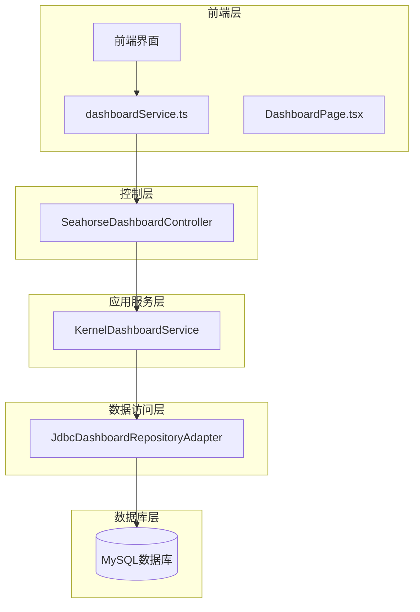
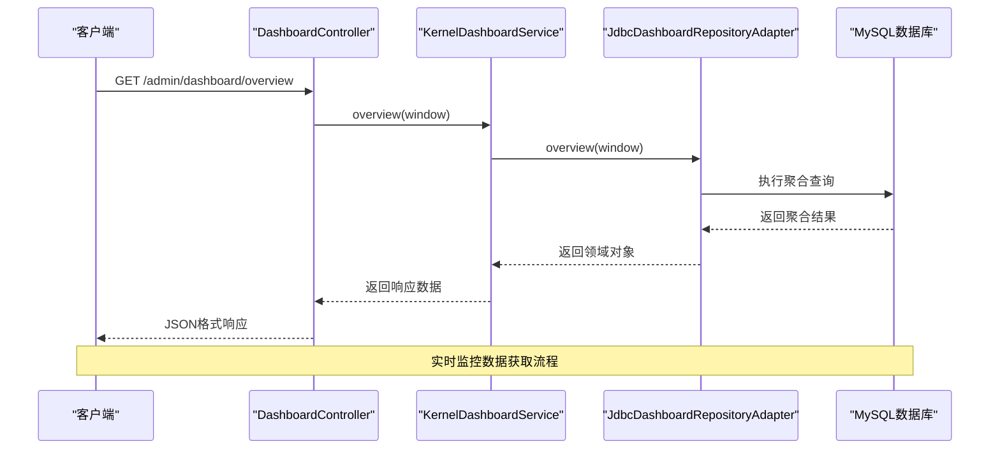
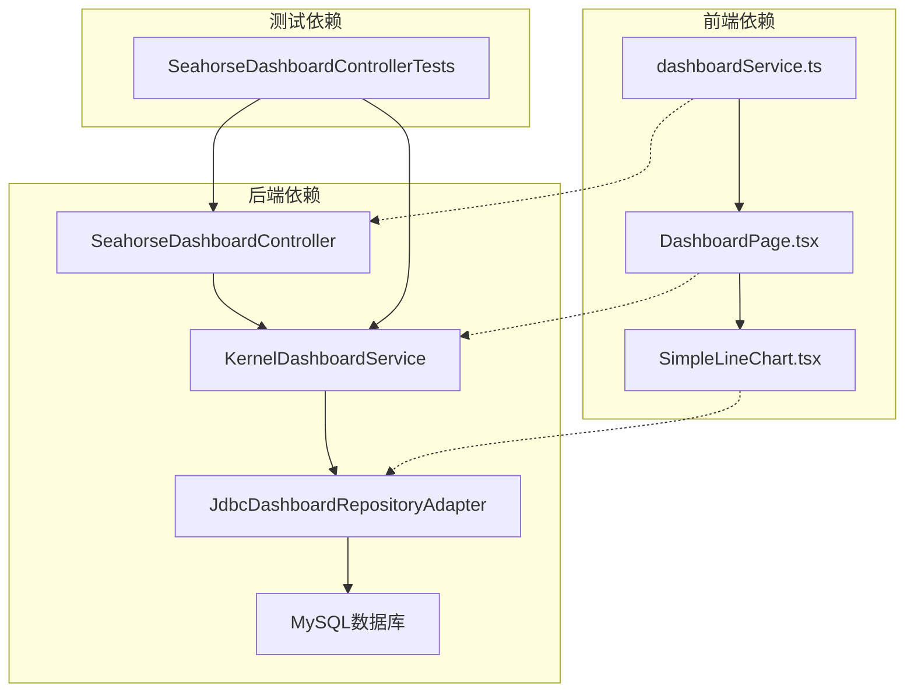

# 仪表板监控接口

<cite>
**本文档引用的文件**
- [dashboardService.ts](file://frontend/src/services/dashboardService.ts)
- [DashboardPage.tsx](file://frontend/src/pages/admin/dashboard/DashboardPage.tsx)
- [KernelDashboardService.java](file://seahorse-agent-kernel/src/main/java/com/miracle/ai/seahorse/agent/kernel/application/dashboard/KernelDashboardService.java)
- [JdbcDashboardRepositoryAdapter.java](file://seahorse-agent-adapter-repository-jdbc/src/main/java/com/miracle/ai/seahorse/agent/adapters/repository/jdbc/JdbcDashboardRepositoryAdapter.java)
- [SeahorseDashboardController.java](file://seahorse-agent-adapter-web/src/main/java/com/miracle/ai/seahorse/agent/adapters/web/SeahorseDashboardController.java)
- [SeahorseDashboardControllerTests.java](file://seahorse-agent-adapter-web/src/test/java/com/miracle/ai/seahorse/agent/adapters/web/SeahorseDashboardControllerTests.java)
- [用户、仪表板和反馈服务.md](file://docs/zh/content/后端系统/核心内核/应用服务层/用户、仪表板和反馈服务.md)
</cite>

## 目录
1. [简介](#简介)
2. [项目结构](#项目结构)
3. [核心组件](#核心组件)
4. [架构概览](#架构概览)
5. [详细组件分析](#详细组件分析)
6. [依赖关系分析](#依赖关系分析)
7. [性能考虑](#性能考虑)
8. [故障排除指南](#故障排除指南)
9. [结论](#结论)

## 简介

本文件为 SeaHorse Agent 项目的仪表板监控接口专业API文档。该系统提供了完整的监控仪表板功能，包括用户活跃度、知识库使用情况、RAG性能指标等关键数据的查询接口。文档详细说明了各类统计图表的数据接口，涵盖折线图、柱状图、饼图等可视化组件的数据源，并提供了实时监控数据获取接口和历史趋势查询功能。

系统支持监控面板的配置接口和个性化定制选项，包含性能基准数据、资源使用情况和系统负载的查询接口。通过前后端分离的设计，实现了高效的数据展示和交互体验。

## 项目结构

SeaHorse Agent 仪表板监控系统采用分层架构设计，主要包含以下层次：

**图表来源**
- [dashboardService.ts:1-70](file://frontend/src/services/dashboardService.ts#L1-L70)
- [SeahorseDashboardController.java:1-33](file://seahorse-agent-adapter-web/src/main/java/com/miracle/ai/seahorse/agent/adapters/web/SeahorseDashboardController.java#L1-L33)
- [KernelDashboardService.java:31-53](file://seahorse-agent-kernel/src/main/java/com/miracle/ai/seahorse/agent/kernel/application/dashboard/KernelDashboardService.java#L31-L53)

**章节来源**
- [dashboardService.ts:1-70](file://frontend/src/services/dashboardService.ts#L1-L70)
- [DashboardPage.tsx:249-972](file://frontend/src/pages/admin/dashboard/DashboardPage.tsx#L249-L972)

## 核心组件

### 前端数据模型

系统定义了完整的前端数据模型来描述仪表板的各种指标：

#### KPI指标模型
- **totalUsers**: 总用户数
- **activeUsers**: 活跃用户数（按窗口期计算）
- **totalSessions**: 总会话数
- **sessions24h**: 24小时会话数
- **totalMessages**: 总消息数
- **messages24h**: 24小时消息数

#### 性能指标模型
- **avgLatencyMs**: 平均响应延迟（毫秒）
- **p95LatencyMs**: 95分位响应延迟（毫秒）
- **successRate**: 成功率（百分比）
- **errorRate**: 错误率（百分比）
- **noDocRate**: 无知识率（百分比）
- **slowRate**: 慢请求率（百分比）

#### 趋势数据模型
- **ts**: 时间戳
- **value**: 数值
- **name**: 系列名称

**章节来源**
- [dashboardService.ts:3-48](file://frontend/src/services/dashboardService.ts#L3-L48)

### 后端服务接口

#### KernelDashboardService 应用服务
负责协调各种监控数据的聚合和计算，提供统一的业务逻辑处理。

#### JdbcDashboardRepositoryAdapter 数据访问
实现具体的数据库查询逻辑，支持多种指标的聚合计算。

**章节来源**
- [KernelDashboardService.java:31-53](file://seahorse-agent-kernel/src/main/java/com/miracle/ai/seahorse/agent/kernel/application/dashboard/KernelDashboardService.java#L31-L53)
- [JdbcDashboardRepositoryAdapter.java:118-162](file://seahorse-agent-adapter-repository-jdbc/src/main/java/com/miracle/ai/seahorse/agent/adapters/repository/jdbc/JdbcDashboardRepositoryAdapter.java#L118-L162)

## 架构概览

系统采用经典的三层架构模式，实现了清晰的职责分离：

**图表来源**
- [SeahorseDashboardController.java:1-33](file://seahorse-agent-adapter-web/src/main/java/com/miracle/ai/seahorse/agent/adapters/web/SeahorseDashboardController.java#L1-L33)
- [KernelDashboardService.java:39-52](file://seahorse-agent-kernel/src/main/java/com/miracle/ai/seahorse/agent/kernel/application/dashboard/KernelDashboardService.java#L39-L52)
- [JdbcDashboardRepositoryAdapter.java:118-121](file://seahorse-agent-adapter-repository-jdbc/src/main/java/com/miracle/ai/seahorse/agent/adapters/repository/jdbc/JdbcDashboardRepositoryAdapter.java#L118-L121)

**章节来源**
- [用户、仪表板和反馈服务.md:183-195](file://docs/zh/content/后端系统/核心内核/应用服务层/用户、仪表板和反馈服务.md#L183-L195)

## 详细组件分析

### API接口定义

#### 概览数据接口
- **URL**: `/admin/dashboard/overview`
- **方法**: GET
- **参数**:
  - `window`: 时间窗口（可选，默认"24h"）
- **用途**: 获取系统总体运行指标

#### 性能指标接口
- **URL**: `/admin/dashboard/performance`
- **方法**: GET
- **参数**:
  - `window`: 时间窗口（可选，默认"24h"）
- **用途**: 获取系统性能相关指标

#### 趋势数据接口
- **URL**: `/admin/dashboard/trends`
- **方法**: GET
- **参数**:
  - `metric`: 指标类型（必填）
  - `window`: 时间窗口（可选，默认"7d"）
  - `granularity`: 时间粒度（可选，默认"day"）
- **用途**: 获取历史趋势数据

**章节来源**
- [dashboardService.ts:50-70](file://frontend/src/services/dashboardService.ts#L50-L70)

### 指标类型详解

#### 用户活跃度指标
- **活跃用户数**: 在指定时间窗口内产生消息的不同用户数量
- **总用户数**: 系统注册用户的总数
- **会话数**: 用户发起的对话会话总数
- **消息数**: 系统处理的消息总数

#### RAG性能指标
- **平均响应时间**: 系统处理请求的平均耗时
- **P95响应时间**: 95分位数的响应时间
- **成功率**: 请求成功处理的比例
- **错误率**: 请求失败或异常的比例
- **无知识率**: 无法检索到相关文档的请求比例
- **慢请求率**: 响应时间超过阈值的请求比例

#### 知识库使用情况
- **文档检索命中率**: 成功检索到相关文档的查询比例
- **知识库更新频率**: 新增或更新文档的频率
- **检索覆盖率**: 能够回答的问题占总问题的比例

**章节来源**
- [JdbcDashboardRepositoryAdapter.java:183-189](file://seahorse-agent-adapter-repository-jdbc/src/main/java/com/miracle/ai/seahorse/agent/adapters/repository/jdbc/JdbcDashboardRepositoryAdapter.java#L183-L189)
- [JdbcDashboardRepositoryAdapter.java:148-168](file://seahorse-agent-adapter-repository-jdbc/src/main/java/com/miracle/ai/seahorse/agent/adapters/repository/jdbc/JdbcDashboardRepositoryAdapter.java#L148-L168)

### 数据聚合算法

#### 时间窗口聚合
系统支持多种时间窗口的聚合计算：
- **24小时滚动窗口**: 实时监控最近24小时的数据
- **7天窗口**: 近期趋势分析
- **30天窗口**: 长期趋势观察

#### 时间粒度选择
- **小时粒度**: 适用于24小时滚动窗口的细粒度监控
- **天粒度**: 适用于7天和30天窗口的宏观趋势

#### 质量指标计算
质量指标采用加权计算方式：
- **错误率** = 错误请求数 / 总请求数 × 100%
- **无知识率** = 无相关文档请求数 / 助手消息总数 × 100%

**章节来源**
- [JdbcDashboardRepositoryAdapter.java:148-168](file://seahorse-agent-adapter-repository-jdbc/src/main/java/com/miracle/ai/seahorse/agent/adapters/repository/jdbc/JdbcDashboardRepositoryAdapter.java#L148-L168)

### 可视化组件集成

#### 折线图组件
前端实现了高度可定制的折线图组件，支持：
- 自适应坐标轴刻度
- 悬停交互效果
- 阈值线显示
- 多系列数据叠加

#### 柱状图组件
用于展示离散数据的分布情况：
- 支持正负值显示
- 自动数值格式化
- 颜色状态指示

#### 饼图组件
用于展示比例关系的数据：
- 百分比自动计算
- 图例自动生成
- 颜色编码区分

**章节来源**
- [DashboardPage.tsx:596-637](file://frontend/src/pages/admin/dashboard/DashboardPage.tsx#L596-L637)
- [DashboardPage.tsx:277-301](file://frontend/src/pages/admin/dashboard/DashboardPage.tsx#L277-L301)

## 依赖关系分析

系统各层之间的依赖关系清晰明确：

**图表来源**
- [dashboardService.ts:1-70](file://frontend/src/services/dashboardService.ts#L1-L70)
- [SeahorseDashboardController.java:20-25](file://seahorse-agent-adapter-web/src/main/java/com/miracle/ai/seahorse/agent/adapters/web/SeahorseDashboardController.java#L20-L25)
- [KernelDashboardService.java:33-37](file://seahorse-agent-kernel/src/main/java/com/miracle/ai/seahorse/agent/kernel/application/dashboard/KernelDashboardService.java#L33-L37)

**章节来源**
- [SeahorseDashboardControllerTests.java:43-56](file://seahorse-agent-adapter-web/src/test/java/com/miracle/ai/seahorse/agent/adapters/web/SeahorseDashboardControllerTests.java#L43-L56)

## 性能考虑

### 查询优化策略

#### 数据库索引优化
- 对时间字段建立复合索引以支持快速范围查询
- 对用户ID建立索引以支持活跃用户统计
- 对状态字段建立索引以支持质量指标计算

#### 缓存策略
- 热点数据缓存机制
- 查询结果缓存
- 配置参数缓存

#### 分页查询
- 大数据量场景下的分页处理
- 渐进式数据加载
- 内存使用优化

### 前端性能优化

#### 组件懒加载
- 图表组件按需加载
- 大数据集的虚拟滚动
- 图片和资源的延迟加载

#### 内存管理
- 组件生命周期管理
- 事件监听器清理
- 定时器资源释放

## 故障排除指南

### 常见问题诊断

#### 数据查询失败
**症状**: API返回空数据或错误信息
**可能原因**:
- 数据库连接异常
- 查询超时
- 权限不足

**解决方案**:
1. 检查数据库连接状态
2. 验证查询权限
3. 查看系统日志

#### 性能指标异常
**症状**: 性能指标显示异常波动
**可能原因**:
- 数据计算错误
- 时间窗口设置不当
- 数据源不一致

**解决方案**:
1. 验证数据计算逻辑
2. 检查时间窗口配置
3. 对比多个数据源

#### 前端渲染问题
**症状**: 图表显示异常或页面卡顿
**可能原因**:
- 内存泄漏
- 组件更新异常
- 数据格式错误

**解决方案**:
1. 使用浏览器开发者工具检查内存
2. 验证数据格式一致性
3. 检查组件生命周期

**章节来源**
- [SeahorseDashboardControllerTests.java:83-95](file://seahorse-agent-adapter-web/src/test/java/com/miracle/ai/seahorse/agent/adapters/web/SeahorseDashboardControllerTests.java#L83-L95)

### 监控阈值配置

系统提供了灵活的阈值配置机制：

| 指标类型 | 良好阈值 | 警告阈值 | 状态判断 |
|---------|---------|---------|---------|
| 响应时间(ms) | ≤10,000 | ≤15,000 | 越小越好 |
| 成功率(%) | ≥99 | ≥95 | 越大越好 |
| 错误率(%) | ≤1 | ≤5 | 越小越好 |
| 无知识率(%) | ≤10 | ≤30 | 越小越好 |

**章节来源**
- [DashboardPage.tsx:101-106](file://frontend/src/pages/admin/dashboard/DashboardPage.tsx#L101-L106)

## 结论

SeaHorse Agent 仪表板监控系统提供了完整的企业级监控解决方案。通过清晰的分层架构设计、完善的API接口定义和高效的性能优化策略，系统能够满足各种监控场景的需求。

系统的主要优势包括：
- **全面的监控覆盖**: 涵盖用户活跃度、RAG性能、知识库使用等多个维度
- **灵活的查询接口**: 支持多种时间窗口和粒度的组合查询
- **丰富的可视化**: 提供多种图表类型的直观展示
- **高性能设计**: 通过合理的架构分层和优化策略确保系统稳定性
- **易于扩展**: 模块化的架构便于功能扩展和维护

未来可以考虑的改进方向：
- 增加更多自定义指标类型
- 优化大数据量场景下的查询性能
- 增强告警和通知功能
- 提供更丰富的配置选项