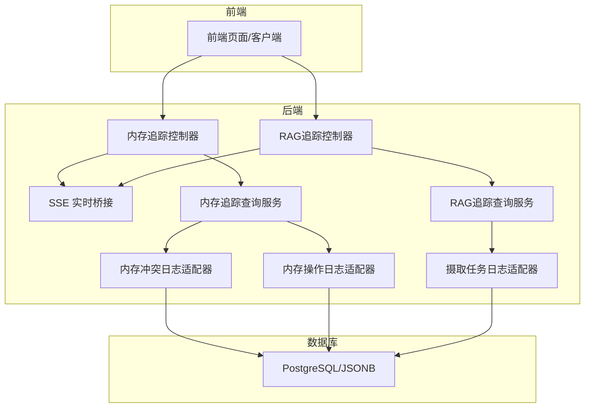
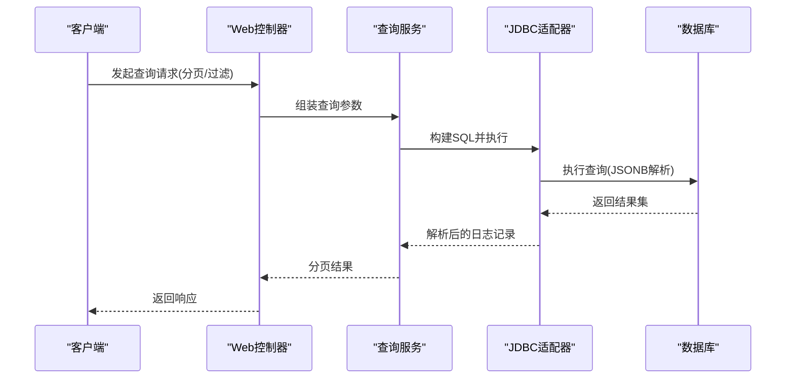
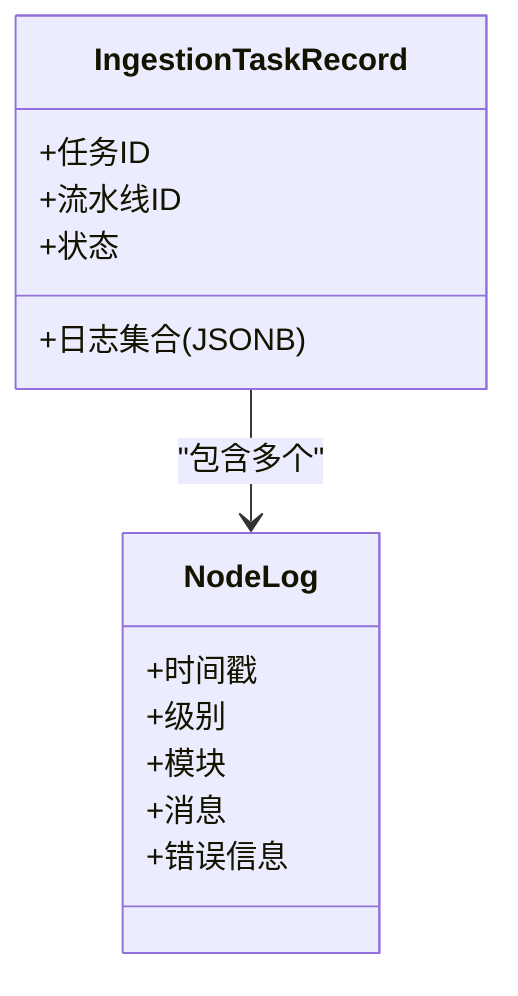
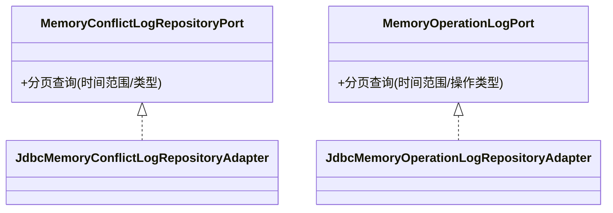
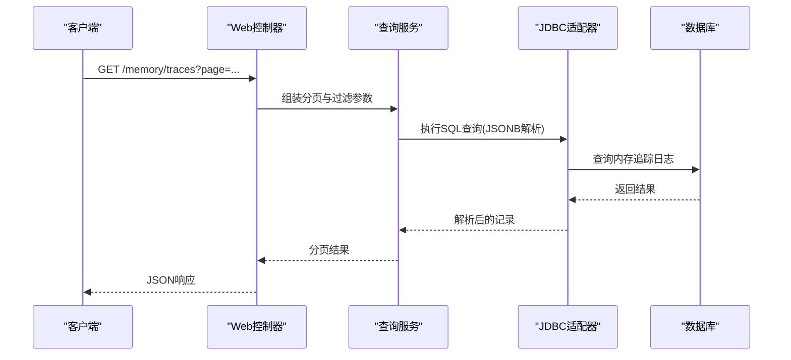
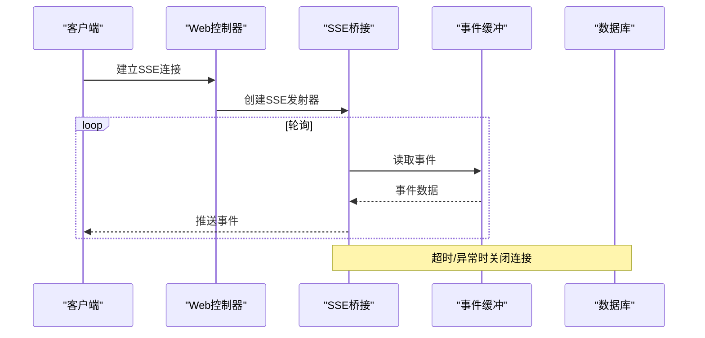
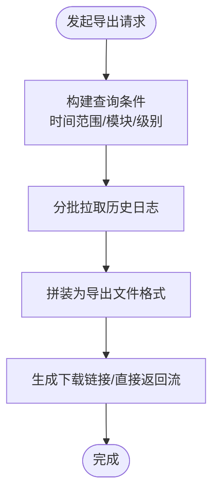
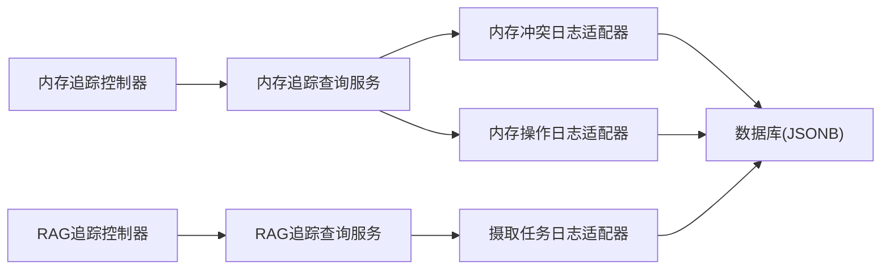

# 日志查询接口

<cite>
**本文引用的文件**
- [NodeLog.java](file://seahorse-agent-kernel/src/main/java/com/miracle/ai/seahorse/agent/kernel/domain/ingestion/NodeLog.java)
- [JdbcIngestionTaskRepositoryAdapter.java](file://seahorse-agent-adapter-repository-jdbc/src/main/java/com/miracle/ai/seahorse/agent/adapters/repository/jdbc/JdbcIngestionTaskRepositoryAdapter.java)
- [JdbcMemoryConflictLogRepositoryAdapter.java](file://seahorse-agent-adapter-repository-jdbc/src/main/java/com/miracle/ai/seahorse/agent/adapters/repository/jdbc/JdbcMemoryConflictLogRepositoryAdapter.java)
- [JdbcMemoryOperationLogRepositoryAdapter.java](file://seahorse-agent-adapter-repository-jdbc/src/main/java/com/miracle/ai/seahorse/agent/adapters/repository/jdbc/JdbcMemoryOperationLogRepositoryAdapter.java)
- [SeahorseMemoryTraceController.java](file://seahorse-agent-adapter-web/src/main/java/com/miracle/ai/seahorse/agent/adapters/web/SeahorseMemoryTraceController.java)
- [SeahorseRagTraceController.java](file://seahorse-agent-adapter-web/src/main/java/com/miracle/ai/seahorse/agent/adapters/web/SeahorseRagTraceController.java)
- [KernelRagTraceService.java](file://seahorse-agent-kernel/src/main/java/com/miracle/ai/seahorse/agent/kernel/application/trace/KernelRagTraceService.java)
- [KernelMemoryTraceQueryService.java](file://seahorse-agent-kernel/src/main/java/com/miracle/ai/seahorse/agent/kernel/application/memory/KernelMemoryTraceQueryService.java)
- [ResearchSseBridge.java](file://seahorse-agent-adapter-web/src/main/java/com/miracle/ai/seahorse/agent/adapters/web/ResearchSseBridge.java)
- [LocalIngestionNodeLogAdapter.java](file://seahorse-agent-adapter-web/src/main/java/com/miracle/ai/seahorse/agent/adapters/local/LocalIngestionNodeLogAdapter.java)
- [seahorse_init.sql](file://resources/database/seahorse_init.sql)
- [日志管理.md](file://docs/zh/content/监控运维/日志管理.md)
- [API 接口文档.md](file://docs/zh/content/API 接口文档/API 接口文档.md)
</cite>

## 目录
1. [简介](#简介)
2. [项目结构](#项目结构)
3. [核心组件](#核心组件)
4. [架构总览](#架构总览)
5. [详细组件分析](#详细组件分析)
6. [依赖分析](#依赖分析)
7. [性能考虑](#性能考虑)
8. [故障排查指南](#故障排查指南)
9. [结论](#结论)
10. [附录](#附录)

## 简介
本文件面向日志查询接口的全面API文档，覆盖系统日志的查询能力（按时间范围、日志级别、服务模块等条件过滤）、日志数据存储格式与索引策略、查询优化机制、实时日志流订阅、历史日志批量导出、日志聚合统计与关键词搜索、异常日志检测、以及日志轮转、归档与清理的管理接口与最佳实践。文档同时给出系统架构图、组件交互图、序列图与流程图，帮助读者从整体到细节理解日志查询体系。

## 项目结构
围绕日志查询的关键模块分布如下：
- 领域模型与端口
  - 领域模型：节点日志实体用于记录节点执行过程中的日志条目
  - 出站端口：内存冲突日志、内存操作日志、RAG追踪、内存追踪等仓库端口
- 仓储适配器
  - JDBC 适配器：实现各类日志仓库端口，负责SQL构建、JSONB解析与持久化
- Web 控制器
  - 提供日志查询、实时订阅、导出等HTTP接口
- 核心服务
  - RAG/内存追踪查询服务：封装查询逻辑与分页
- SSE 实时桥接
  - 将事件缓冲与实时推送整合，支持节流与超时控制
- 运维文档
  - 日志轮转、归档、清理策略与异常检测

**图表来源**
- [SeahorseMemoryTraceController.java](file://seahorse-agent-adapter-web/src/main/java/com/miracle/ai/seahorse/agent/adapters/web/SeahorseMemoryTraceController.java)
- [SeahorseRagTraceController.java](file://seahorse-agent-adapter-web/src/main/java/com/miracle/ai/seahorse/agent/adapters/web/SeahorseRagTraceController.java)
- [KernelMemoryTraceQueryService.java](file://seahorse-agent-kernel/src/main/java/com/miracle/ai/seahorse/agent/kernel/application/memory/KernelMemoryTraceQueryService.java)
- [KernelRagTraceService.java](file://seahorse-agent-kernel/src/main/java/com/miracle/ai/seahorse/agent/kernel/application/trace/KernelRagTraceService.java)
- [JdbcMemoryConflictLogRepositoryAdapter.java](file://seahorse-agent-adapter-repository-jdbc/src/main/java/com/miracle/ai/seahorse/agent/adapters/repository/jdbc/JdbcMemoryConflictLogRepositoryAdapter.java)
- [JdbcMemoryOperationLogRepositoryAdapter.java](file://seahorse-agent-adapter-repository-jdbc/src/main/java/com/miracle/ai/seahorse/agent/adapters/repository/jdbc/JdbcMemoryOperationLogRepositoryAdapter.java)
- [JdbcIngestionTaskRepositoryAdapter.java](file://seahorse-agent-adapter-repository-jdbc/src/main/java/com/miracle/ai/seahorse/agent/adapters/repository/jdbc/JdbcIngestionTaskRepositoryAdapter.java)

**章节来源**
- [API 接口文档.md](file://docs/zh/content/API 接口文档/API 接口文档.md)

## 核心组件
- 节点日志实体：描述节点执行期间的日志条目，包含时间戳、级别、模块、消息、错误信息等字段
- 内存冲突日志与内存操作日志：记录内存模块的冲突与操作事件，支持按时间与类型过滤
- 摄取任务日志：记录数据摄取流水线中各节点的执行日志，采用JSONB存储
- Web 控制器：提供分页查询、实时订阅、导出等接口
- 查询服务：封装分页、过滤、排序与聚合
- SSE 桥接：将事件缓冲与实时推送整合，支持节流与超时控制

**章节来源**
- [NodeLog.java](file://seahorse-agent-kernel/src/main/java/com/miracle/ai/seahorse/agent/kernel/domain/ingestion/NodeLog.java)
- [JdbcMemoryConflictLogRepositoryAdapter.java](file://seahorse-agent-adapter-repository-jdbc/src/main/java/com/miracle/ai/seahorse/agent/adapters/repository/jdbc/JdbcMemoryConflictLogRepositoryAdapter.java)
- [JdbcMemoryOperationLogRepositoryAdapter.java](file://seahorse-agent-adapter-repository-jdbc/src/main/java/com/miracle/ai/seahorse/agent/adapters/repository/jdbc/JdbcMemoryOperationLogRepositoryAdapter.java)
- [JdbcIngestionTaskRepositoryAdapter.java](file://seahorse-agent-adapter-repository-jdbc/src/main/java/com/miracle/ai/seahorse/agent/adapters/repository/jdbc/JdbcIngestionTaskRepositoryAdapter.java)

## 架构总览
日志查询由Web控制器接收请求，调用内核查询服务，服务通过JDBC适配器访问数据库。对于实时日志，控制器通过SSE桥接将事件推送给客户端。查询服务支持分页、时间范围、模块、级别等过滤条件，并对JSONB字段进行解析与查询。

**图表来源**
- [SeahorseMemoryTraceController.java](file://seahorse-agent-adapter-web/src/main/java/com/miracle/ai/seahorse/agent/adapters/web/SeahorseMemoryTraceController.java)
- [KernelMemoryTraceQueryService.java](file://seahorse-agent-kernel/src/main/java/com/miracle/ai/seahorse/agent/kernel/application/memory/KernelMemoryTraceQueryService.java)
- [JdbcMemoryConflictLogRepositoryAdapter.java](file://seahorse-agent-adapter-repository-jdbc/src/main/java/com/miracle/ai/seahorse/agent/adapters/repository/jdbc/JdbcMemoryConflictLogRepositoryAdapter.java)

## 详细组件分析

### 节点日志实体与JSONB存储
- 节点日志实体包含时间戳、级别、模块、消息、错误信息等字段，用于记录节点执行过程中的关键事件
- 摄取任务日志通过JSONB字段存储节点日志集合，便于异步处理与重试
- JDBC适配器负责将对象序列化为JSON并反序列化，提供容错处理

**图表来源**
- [NodeLog.java](file://seahorse-agent-kernel/src/main/java/com/miracle/ai/seahorse/agent/kernel/domain/ingestion/NodeLog.java)
- [JdbcIngestionTaskRepositoryAdapter.java](file://seahorse-agent-adapter-repository-jdbc/src/main/java/com/miracle/ai/seahorse/agent/adapters/repository/jdbc/JdbcIngestionTaskRepositoryAdapter.java)

**章节来源**
- [NodeLog.java](file://seahorse-agent-kernel/src/main/java/com/miracle/ai/seahorse/agent/kernel/domain/ingestion/NodeLog.java)
- [JdbcIngestionTaskRepositoryAdapter.java](file://seahorse-agent-adapter-repository-jdbc/src/main/java/com/miracle/ai/seahorse/agent/adapters/repository/jdbc/JdbcIngestionTaskRepositoryAdapter.java)

### 内存冲突日志与内存操作日志
- 冲突日志：记录内存冲突事件，支持按时间范围与冲突类型过滤
- 操作日志：记录内存操作事件，支持按操作类型与目标实体过滤
- JDBC适配器实现对应仓库端口，提供分页查询与条件过滤

**图表来源**
- [JdbcMemoryConflictLogRepositoryAdapter.java](file://seahorse-agent-adapter-repository-jdbc/src/main/java/com/miracle/ai/seahorse/agent/adapters/repository/jdbc/JdbcMemoryConflictLogRepositoryAdapter.java)
- [JdbcMemoryOperationLogRepositoryAdapter.java](file://seahorse-agent-adapter-repository-jdbc/src/main/java/com/miracle/ai/seahorse/agent/adapters/repository/jdbc/JdbcMemoryOperationLogRepositoryAdapter.java)

**章节来源**
- [JdbcMemoryConflictLogRepositoryAdapter.java](file://seahorse-agent-adapter-repository-jdbc/src/main/java/com/miracle/ai/seahorse/agent/adapters/repository/jdbc/JdbcMemoryConflictLogRepositoryAdapter.java)
- [JdbcMemoryOperationLogRepositoryAdapter.java](file://seahorse-agent-adapter-repository-jdbc/src/main/java/com/miracle/ai/seahorse/agent/adapters/repository/jdbc/JdbcMemoryOperationLogRepositoryAdapter.java)

### RAG追踪与内存追踪查询服务
- RAG追踪查询服务：提供RAG运行记录、节点列表的分页查询与详情查询
- 内存追踪查询服务：提供内存相关事件的分页查询与过滤
- Web控制器封装HTTP接口，调用查询服务并返回标准响应

**图表来源**
- [SeahorseMemoryTraceController.java](file://seahorse-agent-adapter-web/src/main/java/com/miracle/ai/seahorse/agent/adapters/web/SeahorseMemoryTraceController.java)
- [KernelMemoryTraceQueryService.java](file://seahorse-agent-kernel/src/main/java/com/miracle/ai/seahorse/agent/kernel/application/memory/KernelMemoryTraceQueryService.java)
- [JdbcMemoryConflictLogRepositoryAdapter.java](file://seahorse-agent-adapter-repository-jdbc/src/main/java/com/miracle/ai/seahorse/agent/adapters/repository/jdbc/JdbcMemoryConflictLogRepositoryAdapter.java)

**章节来源**
- [SeahorseMemoryTraceController.java](file://seahorse-agent-adapter-web/src/main/java/com/miracle/ai/seahorse/agent/adapters/web/SeahorseMemoryTraceController.java)
- [KernelMemoryTraceQueryService.java](file://seahorse-agent-kernel/src/main/java/com/miracle/ai/seahorse/agent/kernel/application/memory/KernelMemoryTraceQueryService.java)

### 实时日志流订阅（SSE）
- SSE桥接负责将事件缓冲与实时推送整合，支持节流与超时控制
- 控制器通过SSE向客户端推送事件，客户端可订阅实时日志流

**图表来源**
- [ResearchSseBridge.java](file://seahorse-agent-adapter-web/src/main/java/com/miracle/ai/seahorse/agent/adapters/web/ResearchSseBridge.java)

**章节来源**
- [ResearchSseBridge.java](file://seahorse-agent-adapter-web/src/main/java/com/miracle/ai/seahorse/agent/adapters/web/ResearchSseBridge.java)

### 历史日志批量导出
- 历史日志导出接口支持按时间范围、模块、级别等条件导出为文件
- 导出流程通常包括：查询过滤、分批拉取、拼装文件、生成下载链接

[本图为概念流程图，无需图表来源]

## 依赖分析
- 控制器依赖查询服务，查询服务依赖JDBC适配器
- JDBC适配器依赖数据库与JSONB解析
- SSE桥接依赖事件缓冲与定时轮询

**图表来源**
- [SeahorseMemoryTraceController.java](file://seahorse-agent-adapter-web/src/main/java/com/miracle/ai/seahorse/agent/adapters/web/SeahorseMemoryTraceController.java)
- [SeahorseRagTraceController.java](file://seahorse-agent-adapter-web/src/main/java/com/miracle/ai/seahorse/agent/adapters/web/SeahorseRagTraceController.java)
- [KernelMemoryTraceQueryService.java](file://seahorse-agent-kernel/src/main/java/com/miracle/ai/seahorse/agent/kernel/application/memory/KernelMemoryTraceQueryService.java)
- [KernelRagTraceService.java](file://seahorse-agent-kernel/src/main/java/com/miracle/ai/seahorse/agent/kernel/application/trace/KernelRagTraceService.java)
- [JdbcMemoryConflictLogRepositoryAdapter.java](file://seahorse-agent-adapter-repository-jdbc/src/main/java/com/miracle/ai/seahorse/agent/adapters/repository/jdbc/JdbcMemoryConflictLogRepositoryAdapter.java)
- [JdbcMemoryOperationLogRepositoryAdapter.java](file://seahorse-agent-adapter-repository-jdbc/src/main/java/com/miracle/ai/seahorse/agent/adapters/repository/jdbc/JdbcMemoryOperationLogRepositoryAdapter.java)
- [JdbcIngestionTaskRepositoryAdapter.java](file://seahorse-agent-adapter-repository-jdbc/src/main/java/com/miracle/ai/seahorse/agent/adapters/repository/jdbc/JdbcIngestionTaskRepositoryAdapter.java)

**章节来源**
- [API 接口文档.md](file://docs/zh/content/API 接口文档/API 接口文档.md)

## 性能考虑
- 索引策略
  - 任务表按流水线ID、状态建立索引，支持按状态分页与按流水线筛选
  - 节点表按任务ID、状态建立索引，支持按任务与状态查询
- JSONB解析
  - 适配器对JSONB字段进行序列化/反序列化，异常时返回空集合或空映射，避免查询失败
- 分页与过滤
  - 查询服务支持分页与多条件过滤，建议在高频查询上增加复合索引
- 实时推送
  - SSE桥接支持节流与超时控制，避免长连接占用过多资源

**章节来源**
- [seahorse_init.sql](file://resources/database/seahorse_init.sql)
- [JdbcIngestionTaskRepositoryAdapter.java](file://seahorse-agent-adapter-repository-jdbc/src/main/java/com/miracle/ai/seahorse/agent/adapters/repository/jdbc/JdbcIngestionTaskRepositoryAdapter.java)
- [ResearchSseBridge.java](file://seahorse-agent-adapter-web/src/main/java/com/miracle/ai/seahorse/agent/adapters/web/ResearchSseBridge.java)

## 故障排查指南
- JSONB解析异常
  - 当JSONB字段为空或格式异常时，适配器返回空集合或空映射，检查数据写入端是否正确序列化
- 查询无结果
  - 检查过滤条件（时间范围、状态、模块）是否合理，确认索引是否存在
- SSE连接中断
  - 检查SSE桥接的超时与节流配置，确认事件缓冲是否正常
- 导出失败
  - 检查导出接口的分批拉取逻辑与文件拼装流程

**章节来源**
- [JdbcIngestionTaskRepositoryAdapter.java](file://seahorse-agent-adapter-repository-jdbc/src/main/java/com/miracle/ai/seahorse/agent/adapters/repository/jdbc/JdbcIngestionTaskRepositoryAdapter.java)
- [ResearchSseBridge.java](file://seahorse-agent-adapter-web/src/main/java/com/miracle/ai/seahorse/agent/adapters/web/ResearchSseBridge.java)

## 结论
本文档系统梳理了日志查询接口的架构与实现，覆盖查询、实时订阅、导出、聚合统计与关键词搜索、异常检测、轮转归档与清理等能力。通过明确的数据存储格式、索引策略与查询优化机制，以及SSE实时推送与导出流程，能够满足生产环境下的日志查询需求。建议在实际部署中结合业务场景持续优化索引与查询参数，并完善异常检测与告警策略。

## 附录
- 日志轮转、归档与清理策略
  - 按大小轮转、按时间轮转、压缩与保留周期、敏感信息脱敏、访问控制与审计日志
- 异常日志检测与性能分析
  - 基于关键词与正则表达式的异常识别，结合Micrometer指标与日志耗时定位慢调用与热点路径

**章节来源**
- [日志管理.md](file://docs/zh/content/监控运维/日志管理.md)