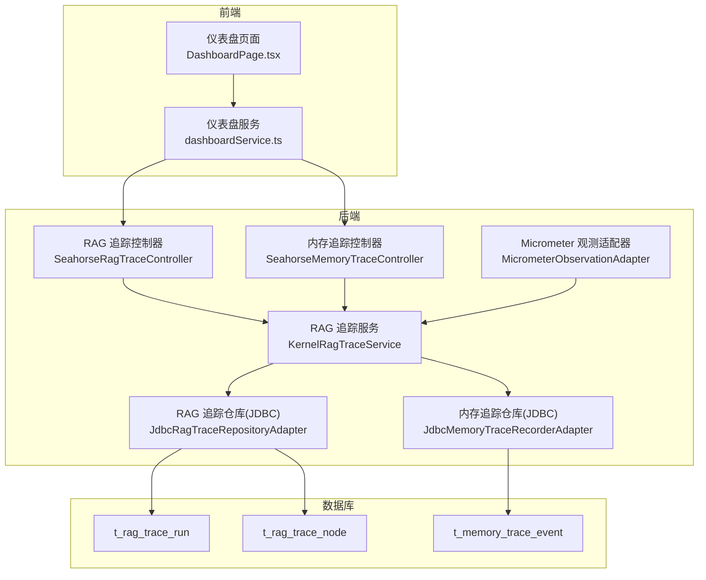
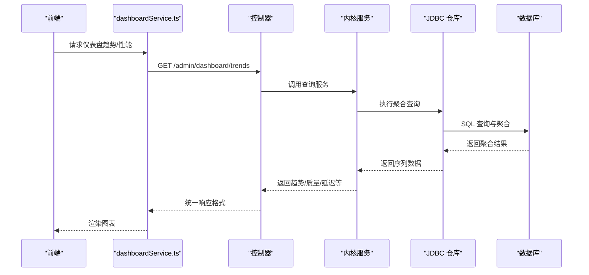
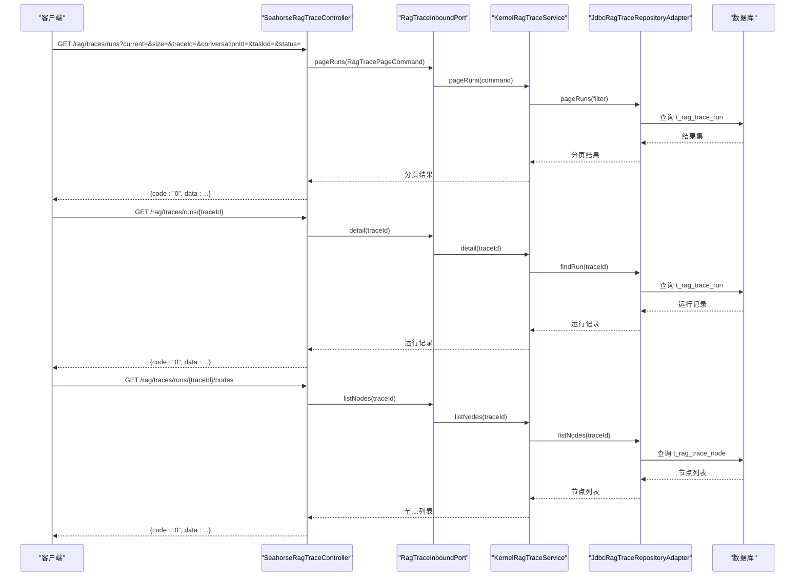
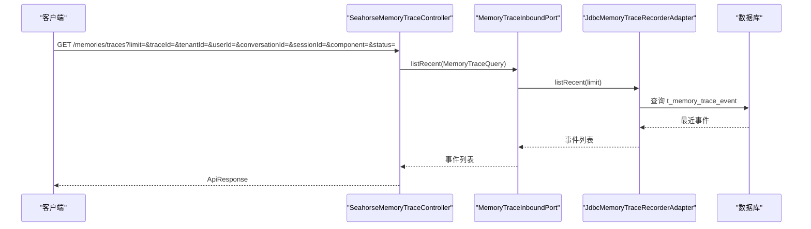
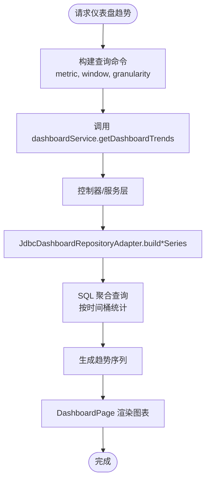
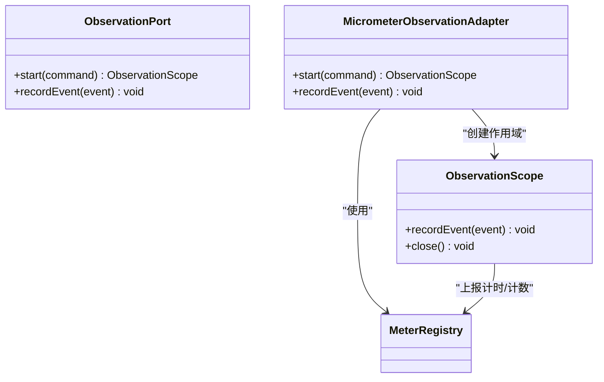
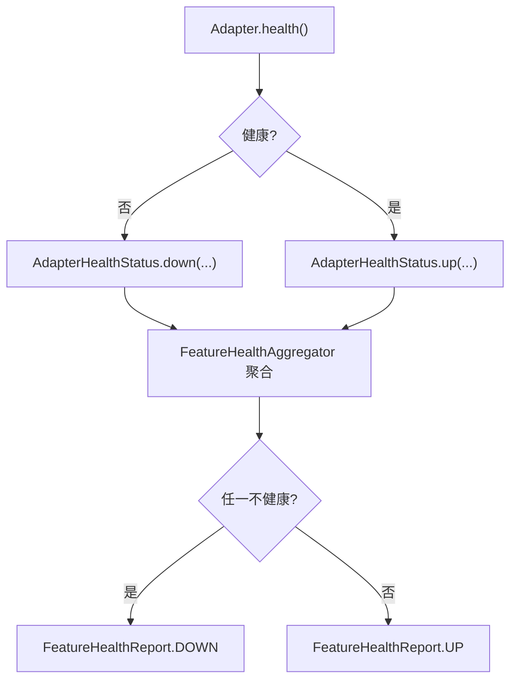
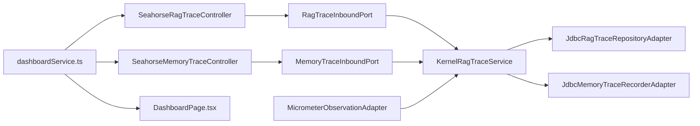

# 追踪监控接口

<cite>
**本文引用的文件**
- [SeahorseRagTraceController.java](file://seahorse-agent-adapter-web/src/main/java/com/miracle/ai/seahorse/agent/adapters/web/SeahorseRagTraceController.java)
- [SeahorseMemoryTraceController.java](file://seahorse-agent-adapter-web/src/main/java/com/miracle/ai/seahorse/agent/adapters/web/SeahorseMemoryTraceController.java)
- [JdbcRagTraceRepositoryAdapter.java](file://seahorse-agent-adapter-repository-jdbc/src/main/java/com/miracle/ai/seahorse/agent/adapters/repository/jdbc/JdbcRagTraceRepositoryAdapter.java)
- [JdbcMemoryTraceRecorderAdapter.java](file://seahorse-agent-adapter-repository-jdbc/src/main/java/com/miracle/ai/seahorse/agent/adapters/repository/jdbc/JdbcMemoryTraceRecorderAdapter.java)
- [seahorse_init.sql](file://resources/database/seahorse_init.sql)
- [JdbcDashboardRepositoryAdapter.java](file://seahorse-agent-adapter-repository-jdbc/src/main/java/com/miracle/ai/seahorse/agent/adapters/repository/jdbc/JdbcDashboardRepositoryAdapter.java)
- [KernelRagTraceService.java](file://seahorse-agent-kernel/src/main/java/com/miracle/ai/seahorse/agent/kernel/application/trace/KernelRagTraceService.java)
- [KernelRagTraceRecorder.java](file://seahorse-agent-kernel/src/main/java/com/miracle/ai/seahorse/agent/kernel/application/trace/KernelRagTraceRecorder.java)
- [RagTraceInboundPort.java](file://seahorse-agent-kernel/src/main/java/com/miracle/ai/seahorse/agent/ports/inbound/trace/RagTraceInboundPort.java)
- [RagTracePageCommand.java](file://seahorse-agent-kernel/src/main/java/com/miracle/ai/seahorse/agent/ports/inbound/trace/RagTracePageCommand.java)
- [MemoryTraceInboundPort.java](file://seahorse-agent-kernel/src/main/java/com/miracle/ai/seahorse/agent/ports/inbound/memory/MemoryTraceInboundPort.java)
- [MemoryTraceQuery.java](file://seahorse-agent-kernel/src/main/java/com/miracle/ai/seahorse/agent/ports/inbound/memory/MemoryTraceQuery.java)
- [MicrometerObservationAdapter.java](file://seahorse-agent-adapter-observation-micrometer/src/main/java/com/miracle/ai/seahorse/agent/adapters/observation/micrometer/MicrometerObservationAdapter.java)
- [ObservationPort.java](file://seahorse-agent-kernel/src/main/java/com/miracle/ai/seahorse/agent/ports/outbound/observation/ObservationPort.java)
- [ObservationScope.java](file://seahorse-agent-kernel/src/main/java/com/miracle/ai/seahorse/agent/ports/outbound/observation/ObservationScope.java)
- [ObservationCommand.java](file://seahorse-agent-kernel/src/main/java/com/miracle/ai/seahorse/agent/ports/outbound/observation/ObservationCommand.java)
- [ObservationEvent.java](file://seahorse-agent-kernel/src/main/java/com/miracle/ai/seahorse/agent/ports/outbound/observation/ObservationEvent.java)
- [dashboardService.ts](file://frontend/src/services/dashboardService.ts)
- [DashboardPage.tsx](file://frontend/src/pages/admin/dashboard/DashboardPage.tsx)
- [监控运维.md](file://docs/zh/content/监控运维/监控运维.md)
- [健康检查.md](file://docs/zh/content/监控运维/健康检查.md)
- [应用监控.md](file://docs/zh/content/监控运维/应用监控.md)
</cite>

## 目录
1. [简介](#简介)
2. [项目结构](#项目结构)
3. [核心组件](#核心组件)
4. [架构总览](#架构总览)
5. [详细组件分析](#详细组件分析)
6. [依赖分析](#依赖分析)
7. [性能考虑](#性能考虑)
8. [故障排查指南](#故障排查指南)
9. [结论](#结论)
10. [附录](#附录)

## 简介
本文件面向 Seahorse Agent 的追踪监控接口，系统性梳理 RAG 追踪查询、性能监控、系统健康检查、日志与错误追踪、性能分析、告警与异常检测、容量规划等监控相关能力。重点覆盖：
- 追踪事件的查询、过滤与聚合接口
- 系统指标采集、可视化图表与报表生成接口
- 日志查询、错误追踪与性能分析 API
- 监控告警、异常检测与容量规划相关接口说明
- 监控数据的存储策略、查询优化与缓存机制

## 项目结构
监控与追踪能力由「Web 控制器」、「内核服务」、「JDBC 仓库适配器」、「Micrometer 观测适配器」以及「前端仪表盘」协同实现，形成「采集 → 存储 → 查询 → 可视化」的闭环。

**图表来源**
- [SeahorseRagTraceController.java:47-67](file://seahorse-agent-adapter-web/src/main/java/com/miracle/ai/seahorse/agent/adapters/web/SeahorseRagTraceController.java#L47-L67)
- [SeahorseMemoryTraceController.java:36-55](file://seahorse-agent-adapter-web/src/main/java/com/miracle/ai/seahorse/agent/adapters/web/SeahorseMemoryTraceController.java#L36-L55)
- [JdbcRagTraceRepositoryAdapter.java:46-124](file://seahorse-agent-adapter-repository-jdbc/src/main/java/com/miracle/ai/seahorse/agent/adapters/repository/jdbc/JdbcRagTraceRepositoryAdapter.java#L46-L124)
- [JdbcMemoryTraceRecorderAdapter.java:33-88](file://seahorse-agent-adapter-repository-jdbc/src/main/java/com/miracle/ai/seahorse/agent/adapters/repository/jdbc/JdbcMemoryTraceRecorderAdapter.java#L33-L88)
- [MicrometerObservationAdapter.java:42-137](file://seahorse-agent-adapter-observation-micrometer/src/main/java/com/miracle/ai/seahorse/agent/adapters/observation/micrometer/MicrometerObservationAdapter.java#L42-L137)
- [seahorse_init.sql:286-317](file://resources/database/seahorse_init.sql#L286-L317)

**章节来源**
- [SeahorseRagTraceController.java:30-67](file://seahorse-agent-adapter-web/src/main/java/com/miracle/ai/seahorse/agent/adapters/web/SeahorseRagTraceController.java#L30-L67)
- [SeahorseMemoryTraceController.java:27-55](file://seahorse-agent-adapter-web/src/main/java/com/miracle/ai/seahorse/agent/adapters/web/SeahorseMemoryTraceController.java#L27-L55)
- [JdbcRagTraceRepositoryAdapter.java:43-124](file://seahorse-agent-adapter-repository-jdbc/src/main/java/com/miracle/ai/seahorse/agent/adapters/repository/jdbc/JdbcRagTraceRepositoryAdapter.java#L43-L124)
- [JdbcMemoryTraceRecorderAdapter.java:33-88](file://seahorse-agent-adapter-repository-jdbc/src/main/java/com/miracle/ai/seahorse/agent/adapters/repository/jdbc/JdbcMemoryTraceRecorderAdapter.java#L33-L88)
- [MicrometerObservationAdapter.java:42-137](file://seahorse-agent-adapter-observation-micrometer/src/main/java/com/miracle/ai/seahorse/agent/adapters/observation/micrometer/MicrometerObservationAdapter.java#L42-L137)
- [seahorse_init.sql:286-317](file://resources/database/seahorse_init.sql#L286-L317)

## 核心组件
- Web 控制器
  - RAG 追踪控制器：提供分页查询运行记录、运行详情、节点列表等接口
  - 内存追踪控制器：提供最近事件列表查询接口
- 内核服务
  - RAG 追踪服务：封装查询命令、调用仓库适配器并返回结果
  - 观测适配器：统一指标采集与上报，支持 Micrometer 与 Noop 实现
- 仓库适配器
  - JDBC RAG 追踪仓库：实现运行与节点的增删改查、分页与过滤
  - JDBC 内存追踪仓库：记录与查询内存相关事件
- 数据库表
  - t_rag_trace_run、t_rag_trace_node、t_memory_trace_event

**章节来源**
- [SeahorseRagTraceController.java:30-67](file://seahorse-agent-adapter-web/src/main/java/com/miracle/ai/seahorse/agent/adapters/web/SeahorseRagTraceController.java#L30-L67)
- [SeahorseMemoryTraceController.java:27-55](file://seahorse-agent-adapter-web/src/main/java/com/miracle/ai/seahorse/agent/adapters/web/SeahorseMemoryTraceController.java#L27-L55)
- [KernelRagTraceService.java](file://seahorse-agent-kernel/src/main/java/com/miracle/ai/seahorse/agent/kernel/application/trace/KernelRagTraceService.java)
- [KernelRagTraceRecorder.java](file://seahorse-agent-kernel/src/main/java/com/miracle/ai/seahorse/agent/kernel/application/trace/KernelRagTraceRecorder.java)
- [JdbcRagTraceRepositoryAdapter.java:46-243](file://seahorse-agent-adapter-repository-jdbc/src/main/java/com/miracle/ai/seahorse/agent/adapters/repository/jdbc/JdbcRagTraceRepositoryAdapter.java#L46-L243)
- [JdbcMemoryTraceRecorderAdapter.java:33-106](file://seahorse-agent-adapter-repository-jdbc/src/main/java/com/miracle/ai/seahorse/agent/adapters/repository/jdbc/JdbcMemoryTraceRecorderAdapter.java#L33-L106)
- [MicrometerObservationAdapter.java:42-137](file://seahorse-agent-adapter-observation-micrometer/src/main/java/com/miracle/ai/seahorse/agent/adapters/observation/micrometer/MicrometerObservationAdapter.java#L42-L137)

## 架构总览
下图展示监控与追踪的端到端流程：前端通过服务调用后端控制器，控制器委派内核服务，内核服务访问 JDBC 仓库，Micrometer 观测适配器负责指标采集与上报。

**图表来源**
- [dashboardService.ts:56-70](file://frontend/src/services/dashboardService.ts#L56-L70)
- [DashboardPage.tsx:918-938](file://frontend/src/pages/admin/dashboard/DashboardPage.tsx#L918-L938)
- [JdbcDashboardRepositoryAdapter.java:140-162](file://seahorse-agent-adapter-repository-jdbc/src/main/java/com/miracle/ai/seahorse/agent/adapters/repository/jdbc/JdbcDashboardRepositoryAdapter.java#L140-L162)

## 详细组件分析

### RAG 追踪查询接口
- 接口概览
  - 分页查询运行记录：GET /rag/traces/runs
  - 获取运行详情：GET /rag/traces/runs/{traceId}
  - 获取节点列表：GET /rag/traces/runs/{traceId}/nodes
- 查询参数
  - 分页：current、size
  - 过滤：traceId、conversationId、taskId、status
- 返回结构
  - 统一响应码与 data 字段，data 为分页对象或列表
- 数据模型
  - t_rag_trace_run：运行记录（trace_id、status、start_time、end_time、duration_ms 等）
  - t_rag_trace_node：节点记录（node_id、node_type、node_name、duration_ms 等）

**图表来源**
- [SeahorseRagTraceController.java:47-67](file://seahorse-agent-adapter-web/src/main/java/com/miracle/ai/seahorse/agent/adapters/web/SeahorseRagTraceController.java#L47-L67)
- [RagTraceInboundPort.java](file://seahorse-agent-kernel/src/main/java/com/miracle/ai/seahorse/agent/ports/inbound/trace/RagTraceInboundPort.java)
- [RagTracePageCommand.java](file://seahorse-agent-kernel/src/main/java/com/miracle/ai/seahorse/agent/ports/inbound/trace/RagTracePageCommand.java)
- [KernelRagTraceService.java](file://seahorse-agent-kernel/src/main/java/com/miracle/ai/seahorse/agent/kernel/application/trace/KernelRagTraceService.java)
- [JdbcRagTraceRepositoryAdapter.java:110-147](file://seahorse-agent-adapter-repository-jdbc/src/main/java/com/miracle/ai/seahorse/agent/adapters/repository/jdbc/JdbcRagTraceRepositoryAdapter.java#L110-L147)
- [seahorse_init.sql:286-317](file://resources/database/seahorse_init.sql#L286-L317)

**章节来源**
- [SeahorseRagTraceController.java:47-67](file://seahorse-agent-adapter-web/src/main/java/com/miracle/ai/seahorse/agent/adapters/web/SeahorseRagTraceController.java#L47-L67)
- [JdbcRagTraceRepositoryAdapter.java:110-147](file://seahorse-agent-adapter-repository-jdbc/src/main/java/com/miracle/ai/seahorse/agent/adapters/repository/jdbc/JdbcRagTraceRepositoryAdapter.java#L110-L147)
- [seahorse_init.sql:286-317](file://resources/database/seahorse_init.sql#L286-L317)

### 内存追踪查询接口
- 接口概览
  - 最近事件列表：GET /memories/traces
- 查询参数
  - limit、traceId、tenantId、userId、conversationId、sessionId、component、status
- 返回结构
  - 统一 ApiResponse 包裹

**图表来源**
- [SeahorseMemoryTraceController.java:36-55](file://seahorse-agent-adapter-web/src/main/java/com/miracle/ai/seahorse/agent/adapters/web/SeahorseMemoryTraceController.java#L36-L55)
- [MemoryTraceInboundPort.java](file://seahorse-agent-kernel/src/main/java/com/miracle/ai/seahorse/agent/ports/inbound/memory/MemoryTraceInboundPort.java)
- [MemoryTraceQuery.java](file://seahorse-agent-kernel/src/main/java/com/miracle/ai/seahorse/agent/ports/inbound/memory/MemoryTraceQuery.java)
- [JdbcMemoryTraceRecorderAdapter.java:78-88](file://seahorse-agent-adapter-repository-jdbc/src/main/java/com/miracle/ai/seahorse/agent/adapters/repository/jdbc/JdbcMemoryTraceRecorderAdapter.java#L78-L88)
- [seahorse_init.sql:318-340](file://resources/database/seahorse_init.sql#L318-L340)

**章节来源**
- [SeahorseMemoryTraceController.java:36-55](file://seahorse-agent-adapter-web/src/main/java/com/miracle/ai/seahorse/agent/adapters/web/SeahorseMemoryTraceController.java#L36-L55)
- [JdbcMemoryTraceRecorderAdapter.java:78-88](file://seahorse-agent-adapter-repository-jdbc/src/main/java/com/miracle/ai/seahorse/agent/adapters/repository/jdbc/JdbcMemoryTraceRecorderAdapter.java#L78-L88)
- [seahorse_init.sql:318-340](file://resources/database/seahorse_init.sql#L318-L340)

### 性能监控与可视化接口
- 仪表盘趋势接口
  - GET /admin/dashboard/trends?metric=&window=&granularity=
  - 支持指标：latency、quality 等
  - 时间窗口与粒度：24h、7d、30d 与 day/hour 等
- 仪表盘性能接口
  - GET /admin/dashboard/performance?window=
- 前端渲染
  - DashboardPage.tsx 将后端返回的趋势序列映射为折线图，设置阈值与状态色

**图表来源**
- [dashboardService.ts:62-70](file://frontend/src/services/dashboardService.ts#L62-L70)
- [DashboardPage.tsx:918-938](file://frontend/src/pages/admin/dashboard/DashboardPage.tsx#L918-L938)
- [JdbcDashboardRepositoryAdapter.java:140-162](file://seahorse-agent-adapter-repository-jdbc/src/main/java/com/miracle/ai/seahorse/agent/adapters/repository/jdbc/JdbcDashboardRepositoryAdapter.java#L140-L162)

**章节来源**
- [dashboardService.ts:56-70](file://frontend/src/services/dashboardService.ts#L56-L70)
- [DashboardPage.tsx:918-938](file://frontend/src/pages/admin/dashboard/DashboardPage.tsx#L918-L938)
- [JdbcDashboardRepositoryAdapter.java:140-162](file://seahorse-agent-adapter-repository-jdbc/src/main/java/com/miracle/ai/seahorse/agent/adapters/repository/jdbc/JdbcDashboardRepositoryAdapter.java#L140-L162)

### 观测性与指标采集
- 观测端口抽象
  - ObservationPort、ObservationScope、ObservationCommand、ObservationEvent
- Micrometer 适配器
  - start(command) 创建作用域
  - recordEvent(event) 上报事件
  - 与 MeterRegistry 对接，支持 Prometheus/InfluxDB/CloudWatch 等导出
- 应用实践
  - 在问答主链路与检索引擎中统一接入观测端口
  - 建议遵循指标命名规范与标签体系，控制标签基数

**图表来源**
- [MicrometerObservationAdapter.java:42-137](file://seahorse-agent-adapter-observation-micrometer/src/main/java/com/miracle/ai/seahorse/agent/adapters/observation/micrometer/MicrometerObservationAdapter.java#L42-L137)
- [ObservationPort.java](file://seahorse-agent-kernel/src/main/java/com/miracle/ai/seahorse/agent/ports/outbound/observation/ObservationPort.java)
- [ObservationScope.java](file://seahorse-agent-kernel/src/main/java/com/miracle/ai/seahorse/agent/ports/outbound/observation/ObservationScope.java)
- [ObservationCommand.java](file://seahorse-agent-kernel/src/main/java/com/miracle/ai/seahorse/agent/ports/outbound/observation/ObservationCommand.java)
- [ObservationEvent.java](file://seahorse-agent-kernel/src/main/java/com/miracle/ai/seahorse/agent/ports/outbound/observation/ObservationEvent.java)

**章节来源**
- [MicrometerObservationAdapter.java:42-137](file://seahorse-agent-adapter-observation-micrometer/src/main/java/com/miracle/ai/seahorse/agent/adapters/observation/micrometer/MicrometerObservationAdapter.java#L42-L137)
- [ObservationPort.java](file://seahorse-agent-kernel/src/main/java/com/miracle/ai/seahorse/agent/ports/outbound/observation/ObservationPort.java)
- [ObservationScope.java](file://seahorse-agent-kernel/src/main/java/com/miracle/ai/seahorse/agent/ports/outbound/observation/ObservationScope.java)
- [ObservationCommand.java](file://seahorse-agent-kernel/src/main/java/com/miracle/ai/seahorse/agent/ports/outbound/observation/ObservationCommand.java)
- [ObservationEvent.java](file://seahorse-agent-kernel/src/main/java/com/miracle/ai/seahorse/agent/ports/outbound/observation/ObservationEvent.java)

### 健康检查机制
- 状态模型
  - Feature 健康状态：名称、是否健康、消息与详情
  - Adapter 健康状态：名称、是否健康、状态字符串与详情
- 聚合逻辑
  - 聚合器对 Feature 与 Adapter 的健康状态进行汇总，任一不健康则整体不健康
  - Feature 健康方法抛出异常会被转换为 DOWN 状态
- 报告输出
  - 输出整体健康布尔值与明细列表，便于前端与运维系统消费

**图表来源**
- [健康检查.md:181-189](file://docs/zh/content/监控运维/健康检查.md#L181-L189)

**章节来源**
- [健康检查.md:181-189](file://docs/zh/content/监控运维/健康检查.md#L181-L189)

## 依赖分析
- 控制器依赖内核端口（RagTraceInboundPort、MemoryTraceInboundPort），通过 ObjectProvider 获取实现
- 内核服务依赖 JDBC 仓库适配器进行数据持久化与查询
- Micrometer 观测适配器与内核观测端口配合，实现指标采集与上报
- 前端通过 dashboardService.ts 调用后端仪表盘接口，渲染 DashboardPage.tsx

**图表来源**
- [SeahorseRagTraceController.java:41-45](file://seahorse-agent-adapter-web/src/main/java/com/miracle/ai/seahorse/agent/adapters/web/SeahorseRagTraceController.java#L41-L45)
- [SeahorseMemoryTraceController.java:30-34](file://seahorse-agent-adapter-web/src/main/java/com/miracle/ai/seahorse/agent/adapters/web/SeahorseMemoryTraceController.java#L30-L34)
- [RagTraceInboundPort.java](file://seahorse-agent-kernel/src/main/java/com/miracle/ai/seahorse/agent/ports/inbound/trace/RagTraceInboundPort.java)
- [MemoryTraceInboundPort.java](file://seahorse-agent-kernel/src/main/java/com/miracle/ai/seahorse/agent/ports/inbound/memory/MemoryTraceInboundPort.java)
- [KernelRagTraceService.java](file://seahorse-agent-kernel/src/main/java/com/miracle/ai/seahorse/agent/kernel/application/trace/KernelRagTraceService.java)
- [JdbcRagTraceRepositoryAdapter.java:46-124](file://seahorse-agent-adapter-repository-jdbc/src/main/java/com/miracle/ai/seahorse/agent/adapters/repository/jdbc/JdbcRagTraceRepositoryAdapter.java#L46-L124)
- [JdbcMemoryTraceRecorderAdapter.java:33-88](file://seahorse-agent-adapter-repository-jdbc/src/main/java/com/miracle/ai/seahorse/agent/adapters/repository/jdbc/JdbcMemoryTraceRecorderAdapter.java#L33-L88)
- [MicrometerObservationAdapter.java:42-137](file://seahorse-agent-adapter-observation-micrometer/src/main/java/com/miracle/ai/seahorse/agent/adapters/observation/micrometer/MicrometerObservationAdapter.java#L42-L137)
- [dashboardService.ts:56-70](file://frontend/src/services/dashboardService.ts#L56-L70)
- [DashboardPage.tsx:918-938](file://frontend/src/pages/admin/dashboard/DashboardPage.tsx#L918-L938)

**章节来源**
- [SeahorseRagTraceController.java:41-45](file://seahorse-agent-adapter-web/src/main/java/com/miracle/ai/seahorse/agent/adapters/web/SeahorseRagTraceController.java#L41-L45)
- [SeahorseMemoryTraceController.java:30-34](file://seahorse-agent-adapter-web/src/main/java/com/miracle/ai/seahorse/agent/adapters/web/SeahorseMemoryTraceController.java#L30-L34)
- [KernelRagTraceService.java](file://seahorse-agent-kernel/src/main/java/com/miracle/ai/seahorse/agent/kernel/application/trace/KernelRagTraceService.java)
- [JdbcRagTraceRepositoryAdapter.java:46-124](file://seahorse-agent-adapter-repository-jdbc/src/main/java/com/miracle/ai/seahorse/agent/adapters/repository/jdbc/JdbcRagTraceRepositoryAdapter.java#L46-L124)
- [JdbcMemoryTraceRecorderAdapter.java:33-88](file://seahorse-agent-adapter-repository-jdbc/src/main/java/com/miracle/ai/seahorse/agent/adapters/repository/jdbc/JdbcMemoryTraceRecorderAdapter.java#L33-L88)
- [MicrometerObservationAdapter.java:42-137](file://seahorse-agent-adapter-observation-micrometer/src/main/java/com/miracle/ai/seahorse/agent/adapters/observation/micrometer/MicrometerObservationAdapter.java#L42-L137)
- [dashboardService.ts:56-70](file://frontend/src/services/dashboardService.ts#L56-L70)
- [DashboardPage.tsx:918-938](file://frontend/src/pages/admin/dashboard/DashboardPage.tsx#L918-L938)

## 性能考虑
- 查询优化
  - 追踪查询使用分页与索引（如 t_rag_trace_run 的 task_id、user_id 等）
  - 仪表盘聚合通过 SQL 时间桶统计，减少前端计算压力
- 指标基数控制
  - 观测标签与事件命名遵循规范，避免高基数动态键
- 缓存机制
  - 前端 DashboardPage.tsx 对趋势序列进行 useMemo 缓存，降低重复渲染成本
- 存储策略
  - 过期运行记录清理：JdbcRagTraceRepositoryAdapter.deleteRunsBefore 支持按时间清理运行与节点记录

**章节来源**
- [JdbcRagTraceRepositoryAdapter.java:226-243](file://seahorse-agent-adapter-repository-jdbc/src/main/java/com/miracle/ai/seahorse/agent/adapters/repository/jdbc/JdbcRagTraceRepositoryAdapter.java#L226-L243)
- [DashboardPage.tsx:918-938](file://frontend/src/pages/admin/dashboard/DashboardPage.tsx#L918-L938)
- [应用监控.md:346-368](file://docs/zh/content/监控运维/应用监控.md#L346-L368)

## 故障排查指南
- 追踪查询无结果
  - 检查过滤参数（traceId、conversationId、taskId、status）是否正确
  - 确认数据库中 t_rag_trace_run 与 t_rag_trace_node 是否存在对应记录
- 仪表盘趋势为空
  - 核对时间窗口与粒度参数，确认 SQL 聚合逻辑是否覆盖目标时间段
  - 检查数据库中是否存在成功运行记录（status=SUCCESS）
- 观测指标未上报
  - 确认 MicrometerObservationAdapter 正常注入与 MeterRegistry 配置
  - 检查指标命名与标签是否符合规范
- 健康检查异常
  - 查看 FeatureHealthAggregator 聚合结果，定位具体 Adapter 健康状态
  - 对异常 Adapter 的 health() 方法进行单测验证

**章节来源**
- [JdbcRagTraceRepositoryAdapter.java:110-147](file://seahorse-agent-adapter-repository-jdbc/src/main/java/com/miracle/ai/seahorse/agent/adapters/repository/jdbc/JdbcRagTraceRepositoryAdapter.java#L110-L147)
- [JdbcDashboardRepositoryAdapter.java:140-162](file://seahorse-agent-adapter-repository-jdbc/src/main/java/com/miracle/ai/seahorse/agent/adapters/repository/jdbc/JdbcDashboardRepositoryAdapter.java#L140-L162)
- [MicrometerObservationAdapter.java:42-137](file://seahorse-agent-adapter-observation-micrometer/src/main/java/com/miracle/ai/seahorse/agent/adapters/observation/micrometer/MicrometerObservationAdapter.java#L42-L137)
- [健康检查.md:181-189](file://docs/zh/content/监控运维/健康检查.md#L181-L189)

## 结论
本监控体系以「控制器 → 内核服务 → 仓库适配器 → 数据库」为核心路径，结合 Micrometer 观测适配器与前端仪表盘，实现了 RAG 追踪查询、性能监控、健康检查与可视化的一体化能力。通过规范化的指标命名与标签体系、SQL 聚合与前端缓存，兼顾了可观测性与性能。建议在核心业务模块统一接入观测端口，并持续优化指标基数与查询策略。

## 附录

### API 定义与参数说明
- RAG 追踪查询
  - GET /rag/traces/runs
    - 参数：current（默认 1）、size（默认 10）、traceId、conversationId、taskId、status
    - 返回：分页对象，包含 runs 列表
  - GET /rag/traces/runs/{traceId}
    - 返回：运行详情
  - GET /rag/traces/runs/{traceId}/nodes
    - 返回：节点列表
- 内存追踪查询
  - GET /memories/traces
    - 参数：limit（默认 50）、traceId、tenantId、userId、conversationId、sessionId、component、status
    - 返回：事件列表
- 仪表盘接口
  - GET /admin/dashboard/trends
    - 参数：metric（latency、quality 等）、window（24h、7d、30d）、granularity（day、hour 等）
    - 返回：趋势序列
  - GET /admin/dashboard/performance
    - 参数：window（默认 24h）
    - 返回：性能指标集合

**章节来源**
- [SeahorseRagTraceController.java:47-67](file://seahorse-agent-adapter-web/src/main/java/com/miracle/ai/seahorse/agent/adapters/web/SeahorseRagTraceController.java#L47-L67)
- [SeahorseMemoryTraceController.java:36-55](file://seahorse-agent-adapter-web/src/main/java/com/miracle/ai/seahorse/agent/adapters/web/SeahorseMemoryTraceController.java#L36-L55)
- [dashboardService.ts:56-70](file://frontend/src/services/dashboardService.ts#L56-L70)

### 数据模型与索引
- t_rag_trace_run
  - 关键字段：trace_id、status、start_time、end_time、duration_ms、task_id、user_id
  - 索引：idx_task_id、idx_user_id_trace
- t_rag_trace_node
  - 关键字段：trace_id、node_id、node_type、node_name、duration_ms、start_time、end_time
- t_memory_trace_event
  - 关键字段：trace_id、tenant_id、user_id、conversation_id、session_id、component、event_type、status、details_json、occurred_at

**章节来源**
- [seahorse_init.sql:286-340](file://resources/database/seahorse_init.sql#L286-L340)

### 观测性最佳实践
- 指标命名与标签
  - 前缀：seahorse.agent.observation
  - 持续时间：duration；事件计数：events
  - 标签：observation、tenant、event、属性标签从 attributes 提取
- 外部系统集成
  - Prometheus、InfluxDB、CloudWatch 等通过 Micrometer Registry 集成

**章节来源**
- [应用监控.md:346-368](file://docs/zh/content/监控运维/应用监控.md#L346-L368)