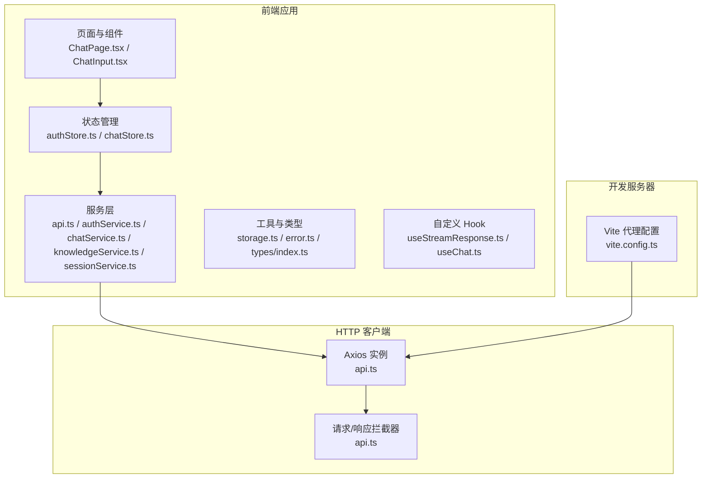
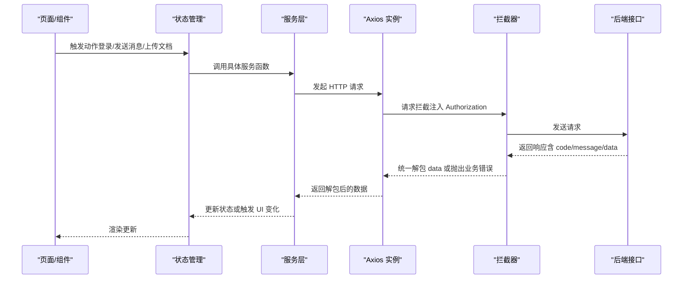
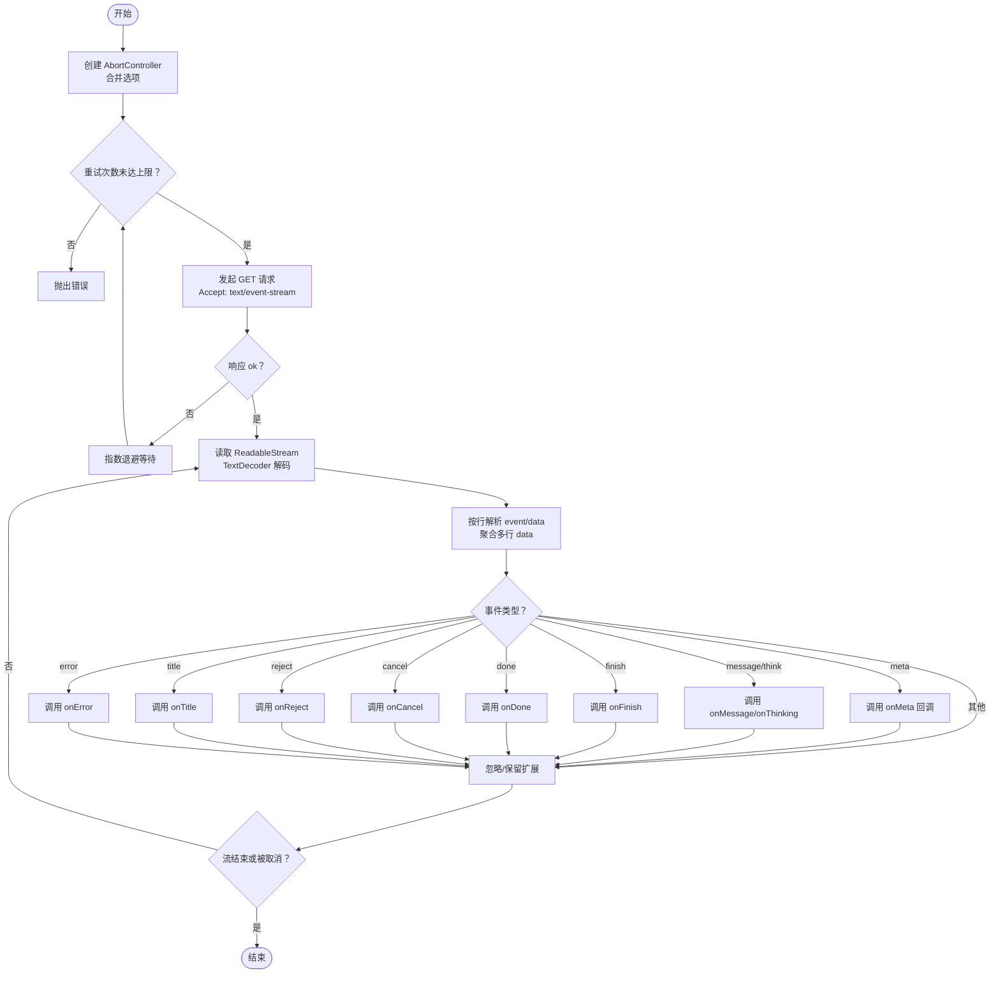
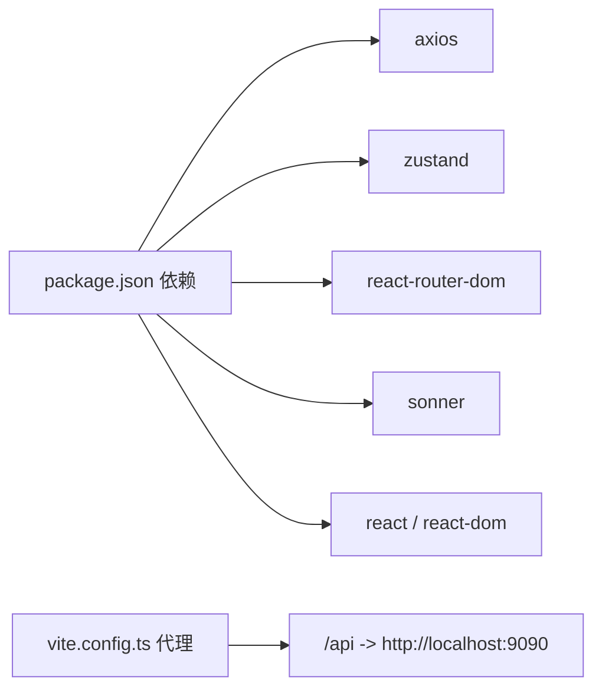

# API 集成

<cite>
**本文引用的文件**
- [frontend/src/services/api.ts](file://frontend/src/services/api.ts)
- [frontend/src/services/authService.ts](file://frontend/src/services/authService.ts)
- [frontend/src/services/chatService.ts](file://frontend/src/services/chatService.ts)
- [frontend/src/services/knowledgeService.ts](file://frontend/src/services/knowledgeService.ts)
- [frontend/src/services/sessionService.ts](file://frontend/src/services/sessionService.ts)
- [frontend/src/types/index.ts](file://frontend/src/types/index.ts)
- [frontend/src/utils/error.ts](file://frontend/src/utils/error.ts)
- [frontend/src/utils/storage.ts](file://frontend/src/utils/storage.ts)
- [frontend/src/hooks/useStreamResponse.ts](file://frontend/src/hooks/useStreamResponse.ts)
- [frontend/src/stores/authStore.ts](file://frontend/src/stores/authStore.ts)
- [frontend/src/pages/ChatPage.tsx](file://frontend/src/pages/ChatPage.tsx)
- [frontend/src/components/chat/ChatInput.tsx](file://frontend/src/components/chat/ChatInput.tsx)
- [frontend/package.json](file://frontend/package.json)
- [frontend/vite.config.ts](file://frontend/vite.config.ts)
</cite>

## 目录
1. [简介](#简介)
2. [项目结构](#项目结构)
3. [核心组件](#核心组件)
4. [架构总览](#架构总览)
5. [详细组件分析](#详细组件分析)
6. [依赖分析](#依赖分析)
7. [性能考虑](#性能考虑)
8. [故障排查指南](#故障排查指南)
9. [结论](#结论)
10. [附录](#附录)

## 简介
本文件面向前端工程师与全栈开发者，系统化梳理 Seahorse Agent 前端与后端 API 的集成方案。内容涵盖 Axios 配置与拦截器、请求/响应处理、认证与会话管理、知识库与聊天相关服务封装、类型系统设计、实时通信（SSE）实现、错误处理策略、最佳实践（请求优化、缓存、并发控制），以及测试与调试建议。目标是帮助读者快速理解并高效扩展 API 集成能力。

## 项目结构
前端采用 Vite + React + TypeScript 构建，Axios 作为 HTTP 客户端，Zustand 管理全局状态，React Router 负责路由，TailwindCSS 提供样式基础。API 层以服务模块形式组织，按功能域划分（认证、聊天、知识库、会话等），统一通过一个 Axios 实例与拦截器体系完成鉴权、错误提示与统一响应解包。

图表来源
- [frontend/src/services/api.ts:1-66](file://frontend/src/services/api.ts#L1-L66)
- [frontend/src/services/authService.ts:1-18](file://frontend/src/services/authService.ts#L1-L18)
- [frontend/src/services/chatService.ts:1-12](file://frontend/src/services/chatService.ts#L1-L12)
- [frontend/src/services/knowledgeService.ts:1-347](file://frontend/src/services/knowledgeService.ts#L1-L347)
- [frontend/src/services/sessionService.ts:1-35](file://frontend/src/services/sessionService.ts#L1-L35)
- [frontend/src/hooks/useStreamResponse.ts:1-176](file://frontend/src/hooks/useStreamResponse.ts#L1-L176)
- [frontend/src/stores/authStore.ts:1-116](file://frontend/src/stores/authStore.ts#L1-L116)
- [frontend/src/pages/ChatPage.tsx:1-103](file://frontend/src/pages/ChatPage.tsx#L1-L103)
- [frontend/src/components/chat/ChatInput.tsx:1-161](file://frontend/src/components/chat/ChatInput.tsx#L1-L161)
- [frontend/vite.config.ts:1-23](file://frontend/vite.config.ts#L1-L23)

章节来源
- [frontend/src/services/api.ts:1-66](file://frontend/src/services/api.ts#L1-L66)
- [frontend/vite.config.ts:1-23](file://frontend/vite.config.ts#L1-L23)

## 核心组件
- Axios 实例与拦截器：统一设置 baseURL、超时、请求头注入 Authorization；在响应层统一解包后端“code/message/data”结构，处理 401 与业务错误码，触发登出与提示。
- 认证服务：登录、登出、获取当前用户，配合存储与状态管理。
- 会话与聊天服务：会话列表、消息查询、反馈提交、任务取消等。
- 知识库服务：知识库 CRUD、文档上传/分页/启用/删除、文档块分页/增删改/批量启用、分块日志分页。
- 实时通信：基于 Fetch + ReadableStream 的 SSE 解析器，支持事件分发、重试、取消。
- 类型系统：统一定义角色、消息、会话、流式事件载荷等类型，确保前后端契约一致。
- 存储与错误工具：本地存储封装、通用错误消息提取。

章节来源
- [frontend/src/services/api.ts:1-66](file://frontend/src/services/api.ts#L1-L66)
- [frontend/src/services/authService.ts:1-18](file://frontend/src/services/authService.ts#L1-L18)
- [frontend/src/services/sessionService.ts:1-35](file://frontend/src/services/sessionService.ts#L1-L35)
- [frontend/src/services/chatService.ts:1-12](file://frontend/src/services/chatService.ts#L1-L12)
- [frontend/src/services/knowledgeService.ts:1-347](file://frontend/src/services/knowledgeService.ts#L1-L347)
- [frontend/src/hooks/useStreamResponse.ts:1-176](file://frontend/src/hooks/useStreamResponse.ts#L1-L176)
- [frontend/src/types/index.ts:1-50](file://frontend/src/types/index.ts#L1-L50)
- [frontend/src/utils/storage.ts:1-67](file://frontend/src/utils/storage.ts#L1-L67)
- [frontend/src/utils/error.ts:1-13](file://frontend/src/utils/error.ts#L1-L13)

## 架构总览
下图展示从前端页面到服务层、Axios 拦截器、后端接口的整体调用链路与职责边界。

图表来源
- [frontend/src/services/api.ts:1-66](file://frontend/src/services/api.ts#L1-L66)
- [frontend/src/services/authService.ts:1-18](file://frontend/src/services/authService.ts#L1-L18)
- [frontend/src/services/sessionService.ts:1-35](file://frontend/src/services/sessionService.ts#L1-L35)
- [frontend/src/services/chatService.ts:1-12](file://frontend/src/services/chatService.ts#L1-L12)
- [frontend/src/services/knowledgeService.ts:1-347](file://frontend/src/services/knowledgeService.ts#L1-L347)
- [frontend/src/stores/authStore.ts:1-116](file://frontend/src/stores/authStore.ts#L1-L116)

## 详细组件分析

### Axios 配置与拦截器
- 基础配置：baseURL 来自环境变量，超时 60 秒。
- 请求拦截：从本地存储读取 Token 并注入 Authorization 头。
- 响应拦截：
  - 若后端返回包含 code 字段且非“0”，则根据 message 判断是否为未登录，若是则清空本地认证并跳转登录；同时向 UI 抛错并提示。
  - 若为 401，则同样清空认证并跳转登录。
  - 成功时返回 data 字段，便于各服务直接消费。
- 全局 Token 切换：通过 setAuthToken 动态设置/移除 Authorization 头，用于登录成功后同步到 Axios 默认头。

章节来源
- [frontend/src/services/api.ts:1-66](file://frontend/src/services/api.ts#L1-L66)
- [frontend/src/utils/storage.ts:1-67](file://frontend/src/utils/storage.ts#L1-L67)

### 认证服务（authService）
- 登录：POST /auth/login，返回用户信息与 token。
- 登出：POST /auth/logout。
- 获取当前用户：GET /user/me。
- 类型：LoginResponse/CurrentUserResponse 映射后端返回结构。

章节来源
- [frontend/src/services/authService.ts:1-18](file://frontend/src/services/authService.ts#L1-L18)
- [frontend/src/types/index.ts:1-50](file://frontend/src/types/index.ts#L1-L50)

### 会话与聊天服务（sessionService / chatService）
- 会话管理：
  - 列表：GET /conversations
  - 删除：DELETE /conversations/{id}
  - 重命名：PUT /conversations/{id}
  - 消息列表：GET /conversations/{id}/messages
- 聊天辅助：
  - 停止任务：POST /rag/v3/stop?taskId=...
  - 反馈：POST /conversations/messages/{id}/feedback

章节来源
- [frontend/src/services/sessionService.ts:1-35](file://frontend/src/services/sessionService.ts#L1-L35)
- [frontend/src/services/chatService.ts:1-12](file://frontend/src/services/chatService.ts#L1-L12)

### 知识库服务（knowledgeService）
- 知识库：
  - 分页/详情/创建/更新/重命名/删除
  - 策略项：获取分块策略列表
- 文档：
  - 分页/搜索/上传（支持文件与 URL，多参数拼装到 FormData）
  - 启用/禁用、更新元信息、启动分块、删除
- 文档块：
  - 分页/新增/更新/删除/启用切换/批量启用
- 分块日志：
  - 分页查询

章节来源
- [frontend/src/services/knowledgeService.ts:1-347](file://frontend/src/services/knowledgeService.ts#L1-L347)

### 实时通信（SSE）
- 设计要点：
  - 使用原生 fetch + ReadableStream 读取服务端事件流。
  - 自定义解析器按行拆分 event/data，支持多行 data 聚合与事件名切换。
  - 支持 meta/message/thinking/finish/done/cancel/reject/title/error 等事件分发。
  - 支持可选的 AbortSignal 与指数退避重试。
- 使用方式：
  - 通过 createStreamResponse 创建可取消的流处理器，传入 URL、头部、信号量与重试参数，回调中处理不同事件。

图表来源
- [frontend/src/hooks/useStreamResponse.ts:1-176](file://frontend/src/hooks/useStreamResponse.ts#L1-L176)

章节来源
- [frontend/src/hooks/useStreamResponse.ts:1-176](file://frontend/src/hooks/useStreamResponse.ts#L1-L176)

### 类型定义（TypeScript）
- 角色与反馈值：Role、FeedbackValue
- 会话与消息：Session、Message
- 流式事件载荷：StreamMetaPayload、MessageDeltaPayload、CompletionPayload
- 用户：User、CurrentUser
- 以上类型在服务层与组件间形成强类型契约，避免运行期字段不一致。

章节来源
- [frontend/src/types/index.ts:1-50](file://frontend/src/types/index.ts#L1-L50)

### 错误处理策略
- 网络错误：捕获 ERR_NETWORK，提示“网络错误，请检查网络连接”。
- 业务错误：后端返回 code 非“0”时，读取 message 并 toast 提示；若提示包含“未登录”，自动清空本地认证并跳转登录。
- 401：统一清空认证并跳转登录。
- 通用错误提取：提供 getErrorMessage 工具，优先取字符串或对象.message，兜底为 fallback。

章节来源
- [frontend/src/services/api.ts:1-66](file://frontend/src/services/api.ts#L1-L66)
- [frontend/src/utils/error.ts:1-13](file://frontend/src/utils/error.ts#L1-L13)

### 状态与存储
- 本地存储：封装 Token、用户、主题键值，异常兜底。
- 认证状态：Zustand store 管理用户、token、认证状态与加载态；登录成功写入 localStorage 并同步到 Axios 默认头；登出清理并重置聊天状态。

章节来源
- [frontend/src/utils/storage.ts:1-67](file://frontend/src/utils/storage.ts#L1-L67)
- [frontend/src/stores/authStore.ts:1-116](file://frontend/src/stores/authStore.ts#L1-L116)

### 页面与组件集成示例
- ChatPage：负责会话列表拉取、会话选择与创建、路由同步。
- ChatInput：负责输入框高度自适应、组合事件处理、发送/取消逻辑，并与聊天状态联动。

章节来源
- [frontend/src/pages/ChatPage.tsx:1-103](file://frontend/src/pages/ChatPage.tsx#L1-L103)
- [frontend/src/components/chat/ChatInput.tsx:1-161](file://frontend/src/components/chat/ChatInput.tsx#L1-L161)

## 依赖分析
- Axios：作为统一 HTTP 客户端，承载拦截器与全局配置。
- Zustand：集中管理认证与聊天状态，降低组件间耦合。
- React Router：路由驱动页面行为，如会话路由参数变化时的自动选择/创建。
- Vite：开发代理将 /api 前缀转发至后端服务地址，便于本地联调。

图表来源
- [frontend/package.json:1-70](file://frontend/package.json#L1-L70)
- [frontend/vite.config.ts:1-23](file://frontend/vite.config.ts#L1-L23)

章节来源
- [frontend/package.json:1-70](file://frontend/package.json#L1-L70)
- [frontend/vite.config.ts:1-23](file://frontend/vite.config.ts#L1-L23)

## 性能考虑
- 请求去抖与节流：对高频输入（如搜索、分页）使用防抖/节流，减少不必要的请求。
- 并发控制：限制同一资源的并发请求数，避免雪崩效应；对可并行的独立请求使用 Promise.all。
- 缓存策略：
  - 对只读列表/字典类数据（如知识库分页、分块策略）采用内存缓存，结合失效时间或版本号。
  - 对大文档上传采用分片/断点续传（需后端支持）。
- 超时与重试：Axios 超时与 SSE 指数退避重试已内置；可根据场景调整重试次数与延迟。
- UI 渲染优化：虚拟滚动（如 react-virtuoso）用于长列表；细粒度状态切分，避免无关重渲染。
- 网络质量感知：在弱网环境下降低并发、增大重试间隔，必要时降级为静态占位。

## 故障排查指南
- 登录后仍提示未登录
  - 检查本地 Token 是否正确写入与读取；确认拦截器是否注入 Authorization。
  - 章节来源: [frontend/src/utils/storage.ts:1-67](file://frontend/src/utils/storage.ts#L1-L67), [frontend/src/services/api.ts:1-66](file://frontend/src/services/api.ts#L1-L66)
- 401 跳转登录但无提示
  - 确认响应拦截器是否正确识别 401；检查后端返回结构与 message 内容。
  - 章节来源: [frontend/src/services/api.ts:1-66](file://frontend/src/services/api.ts#L1-L66)
- SSE 流中断
  - 检查 AbortController 是否提前取消；确认服务端事件格式（event/data 行）；适当增加重试次数与延迟。
  - 章节来源: [frontend/src/hooks/useStreamResponse.ts:1-176](file://frontend/src/hooks/useStreamResponse.ts#L1-L176)
- 网络错误提示频繁
  - 检查 ERR_NETWORK 场景与网络环境；在弱网下启用指数退避与提示抑制。
  - 章节来源: [frontend/src/services/api.ts:1-66](file://frontend/src/services/api.ts#L1-L66)
- 代理无效
  - 确认 Vite 代理配置与后端实际端口一致；浏览器 Network 面板查看 /api 前缀是否被转发。
  - 章节来源: [frontend/vite.config.ts:1-23](file://frontend/vite.config.ts#L1-L23)

## 结论
该 API 集成方案以 Axios 为核心，通过拦截器实现统一鉴权与错误处理，结合 Zustand 管理认证与聊天状态，服务层按领域拆分职责清晰。SSE 实现支持丰富的事件类型与重试机制，满足实时交互需求。类型系统与工具函数进一步提升了可维护性与健壮性。建议在生产环境中补充缓存、并发控制与网络质量感知策略，并持续完善测试与可观测性。

## 附录
- 环境变量
  - VITE_API_BASE_URL：后端基础地址，用于 Axios baseURL 注入。
  - 章节来源: [frontend/src/services/api.ts:1-66](file://frontend/src/services/api.ts#L1-L66), [frontend/vite.config.ts:1-23](file://frontend/vite.config.ts#L1-L23)
- 代理配置
  - 将 /api 前缀代理到后端服务地址，便于本地联调。
  - 章节来源: [frontend/vite.config.ts:1-23](file://frontend/vite.config.ts#L1-L23)
- 依赖清单
  - 关键依赖：axios、zustand、react-router-dom、sonner、@vitejs/plugin-react 等。
  - 章节来源: [frontend/package.json:1-70](file://frontend/package.json#L1-L70)