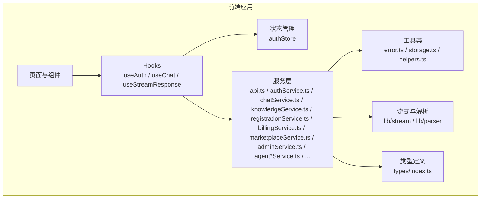
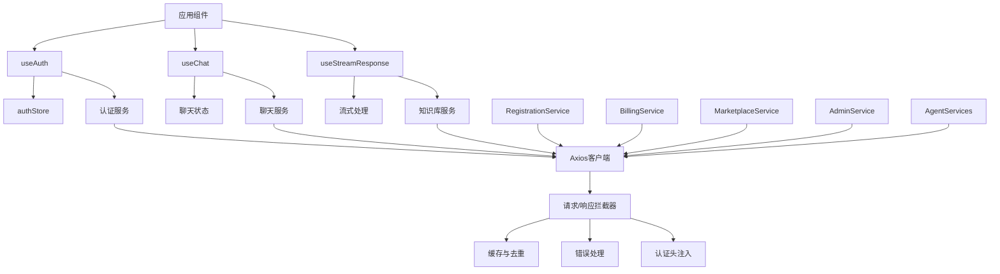
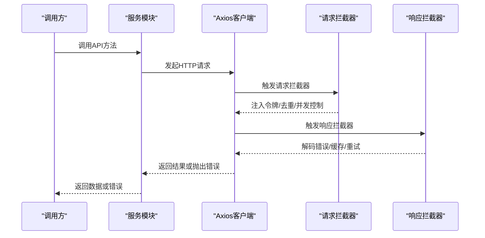
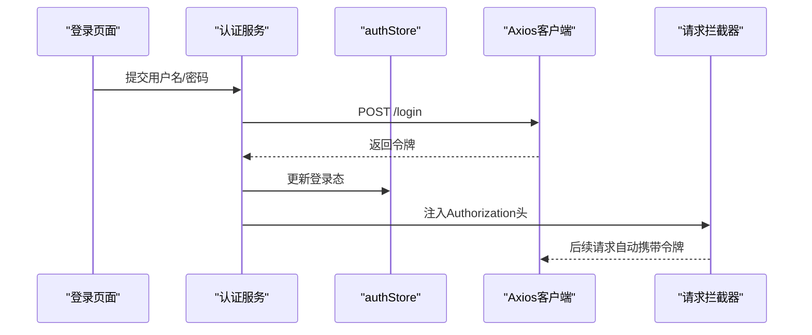
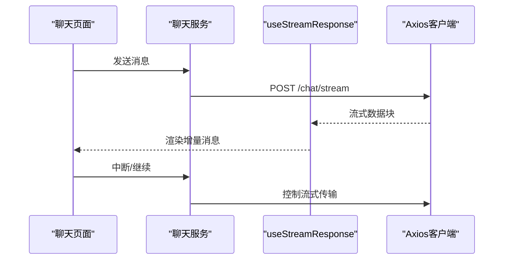
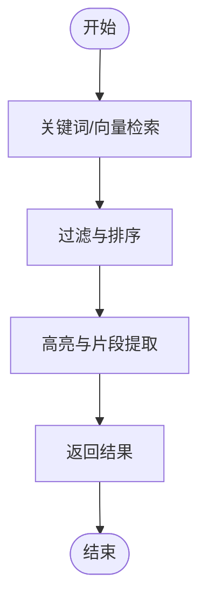
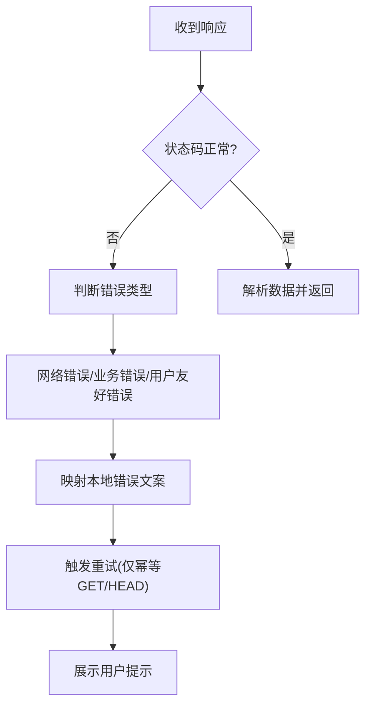
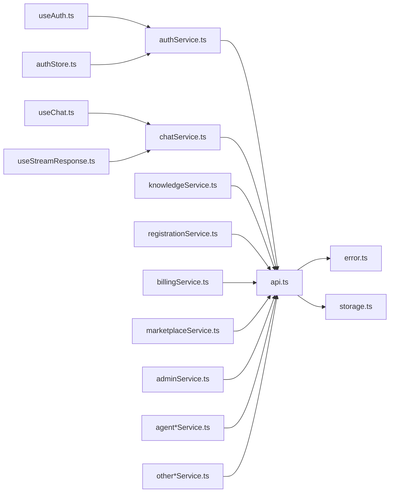

# API集成层

<cite>
**本文引用的文件**
- [frontend/package.json](file://frontend/package.json)
- [frontend/vite.config.js](file://frontend/vite.config.js)
- [frontend/src/services/api.ts](file://frontend/src/services/api.ts)
- [frontend/src/services/authService.ts](file://frontend/src/services/authService.ts)
- [frontend/src/services/chatService.ts](file://frontend/src/services/chatService.ts)
- [frontend/src/services/knowledgeService.ts](file://frontend/src/services/knowledgeService.ts)
- [frontend/src/services/userService.ts](file://frontend/src/services/userService.ts)
- [frontend/src/services/sessionService.ts](file://frontend/src/services/sessionService.ts)
- [frontend/src/services/registrationService.ts](file://frontend/src/services/registrationService.ts)
- [frontend/src/services/billingService.ts](file://frontend/src/services/billingService.ts)
- [frontend/src/services/marketplaceService.ts](file://frontend/src/services/marketplaceService.ts)
- [frontend/src/services/adminService.ts](file://frontend/src/services/adminService.ts)
- [frontend/src/services/agentArtifactService.ts](file://frontend/src/services/agentArtifactService.ts)
- [frontend/src/services/agentDefinitionService.ts](file://frontend/src/services/agentDefinitionService.ts)
- [frontend/src/services/agentEvalService.ts](file://frontend/src/services/agentEvalService.ts)
- [frontend/src/services/agentFactoryService.ts](file://frontend/src/services/agentFactoryService.ts)
- [frontend/src/services/agentRolloutService.ts](file://frontend/src/services/agentRolloutService.ts)
- [frontend/src/services/agentRunService.ts](file://frontend/src/services/agentRunService.ts)
- [frontend/src/services/aiConfigService.ts](file://frontend/src/services/aiConfigService.ts)
- [frontend/src/services/aiInfraService.ts](file://frontend/src/services/aiInfraService.ts)
- [frontend/src/services/approvalService.ts](file://frontend/src/services/approvalService.ts)
- [frontend/src/services/auditCostService.ts](file://frontend/src/services/auditCostService.ts)
- [frontend/src/services/contextPackService.ts](file://frontend/src/services/contextPackService.ts)
- [frontend/src/services/conversationAttachmentService.ts](file://frontend/src/services/conversationAttachmentService.ts)
- [frontend/src/services/dashboardService.ts](file://frontend/src/services/dashboardService.ts)
- [frontend/src/services/featureService.ts](file://frontend/src/services/featureService.ts)
- [frontend/src/services/ingestionService.ts](file://frontend/src/services/ingestionService.ts)
- [frontend/src/services/intentTreeService.ts](file://frontend/src/services/intentTreeService.ts)
- [frontend/src/services/memoryGovernanceService.ts](file://frontend/src/services/memoryGovernanceService.ts)
- [frontend/src/services/metadataGovernanceService.ts](file://frontend/src/services/metadataGovernanceService.ts)
- [frontend/src/services/openApiConnectorService.ts](file://frontend/src/services/openApiConnectorService.ts)
- [frontend/src/services/pilotReadinessService.ts](file://frontend/src/services/pilotReadinessService.ts)
- [frontend/src/services/pluginService.ts](file://frontend/src/services/pluginService.ts)
- [frontend/src/services/productionGateService.ts](file://frontend/src/services/productionGateService.ts)
- [frontend/src/services/queryTermMappingService.ts](file://frontend/src/services/queryTermMappingService.ts)
- [frontend/src/services/quotaSummaryService.ts](file://frontend/src/services/quotaSummaryService.ts)
- [frontend/src/services/ragEvaluationService.ts](file://frontend/src/services/ragEvaluationService.ts)
- [frontend/src/services/ragTraceService.ts](file://frontend/src/services/ragTraceService.ts)
- [frontend/src/services/sampleQuestionService.ts](file://frontend/src/services/sampleQuestionService.ts)
- [frontend/src/services/sandboxService.ts](file://frontend/src/services/sandboxService.ts)
- [frontend/src/services/securityGovernanceService.ts](file://frontend/src/services/securityGovernanceService.ts)
- [frontend/src/services/settingsService.ts](file://frontend/src/services/settingsService.ts)
- [frontend/src/services/skillService.ts](file://frontend/src/services/skillService.ts)
- [frontend/src/services/taskTemplateService.ts](file://frontend/src/services/taskTemplateService.ts)
- [frontend/src/services/toolCatalogService.ts](file://frontend/src/services/toolCatalogService.ts)
- [frontend/src/services/userMemoryService.ts](file://frontend/src/services/userMemoryService.ts)
- [frontend/src/stores/authStore.ts](file://frontend/src/stores/authStore.ts)
- [frontend/src/utils/error.ts](file://frontend/src/utils/error.ts)
- [frontend/src/utils/storage.ts](file://frontend/src/utils/storage.ts)
- [frontend/src/hooks/useAuth.ts](file://frontend/src/hooks/useAuth.ts)
- [frontend/src/hooks/useChat.ts](file://frontend/src/hooks/useChat.ts)
- [frontend/src/hooks/useStreamResponse.ts](file://frontend/src/hooks/useStreamResponse.ts)
- [frontend/src/lib/stream/stream.ts](file://frontend/src/lib/stream/stream.ts)
- [frontend/src/lib/parser/index.ts](file://frontend/src/lib/parser/index.ts)
- [frontend/src/utils/helpers.ts](file://frontend/src/utils/helpers.ts)
- [frontend/src/types/index.ts](file://frontend/src/types/index.ts)
</cite>

## 目录
1. [简介](#简介)
2. [项目结构](#项目结构)
3. [核心组件](#核心组件)
4. [架构总览](#架构总览)
5. [详细组件分析](#详细组件分析)
6. [依赖关系分析](#依赖关系分析)
7. [性能考虑](#性能考虑)
8. [故障排除指南](#故障排除指南)
9. [结论](#结论)
10. [附录](#附录)

## 简介
本文件面向Seahorse Agent前端API集成层，系统性阐述基于Axios的服务封装架构设计与最佳实践。内容覆盖API服务组织（聊天服务、知识库服务、认证服务、注册服务、计费服务、市场服务、管理员服务等）、HTTP客户端配置、请求/响应拦截器、错误处理机制、数据缓存与请求去重、并发与超时管理、重试策略、认证令牌管理与权限控制，以及面向API集成开发者的完整开发指南。

## 项目结构
前端采用Vite构建，服务层位于src/services，状态管理在src/stores，工具类在src/utils，Hook在src/hooks，流式处理与解析在src/lib，类型定义在src/types。API集成层以服务模块化组织，每个领域服务独立封装，统一通过Axios实例进行HTTP通信，并通过拦截器实现横切能力（认证、日志、错误处理、缓存）。

**图表来源**
- [frontend/src/services/api.ts](file://frontend/src/services/api.ts)
- [frontend/src/services/authService.ts](file://frontend/src/services/authService.ts)
- [frontend/src/services/chatService.ts](file://frontend/src/services/chatService.ts)
- [frontend/src/services/knowledgeService.ts](file://frontend/src/services/knowledgeService.ts)
- [frontend/src/services/registrationService.ts](file://frontend/src/services/registrationService.ts)
- [frontend/src/services/billingService.ts](file://frontend/src/services/billingService.ts)
- [frontend/src/services/marketplaceService.ts](file://frontend/src/services/marketplaceService.ts)
- [frontend/src/services/adminService.ts](file://frontend/src/services/adminService.ts)
- [frontend/src/services/agentArtifactService.ts](file://frontend/src/services/agentArtifactService.ts)
- [frontend/src/services/agentDefinitionService.ts](file://frontend/src/services/agentDefinitionService.ts)
- [frontend/src/services/agentEvalService.ts](file://frontend/src/services/agentEvalService.ts)
- [frontend/src/services/agentFactoryService.ts](file://frontend/src/services/agentFactoryService.ts)
- [frontend/src/services/agentRolloutService.ts](file://frontend/src/services/agentRolloutService.ts)
- [frontend/src/services/agentRunService.ts](file://frontend/src/services/agentRunService.ts)
- [frontend/src/services/aiConfigService.ts](file://frontend/src/services/aiConfigService.ts)
- [frontend/src/services/aiInfraService.ts](file://frontend/src/services/aiInfraService.ts)
- [frontend/src/services/stores/authStore.ts](file://frontend/src/stores/authStore.ts)
- [frontend/src/hooks/useAuth.ts](file://frontend/src/hooks/useAuth.ts)
- [frontend/src/hooks/useChat.ts](file://frontend/src/hooks/useChat.ts)
- [frontend/src/hooks/useStreamResponse.ts](file://frontend/src/hooks/useStreamResponse.ts)
- [frontend/src/lib/stream/stream.ts](file://frontend/src/lib/stream/stream.ts)
- [frontend/src/lib/parser/index.ts](file://frontend/src/lib/parser/index.ts)
- [frontend/src/utils/helpers.ts](file://frontend/src/utils/helpers.ts)
- [frontend/src/types/index.ts](file://frontend/src/types/index.ts)

**章节来源**
- [frontend/package.json](file://frontend/package.json)
- [frontend/vite.config.js](file://frontend/vite.config.js)

## 核心组件
- Axios HTTP客户端：统一的HTTP客户端实例，集中配置基础URL、超时、请求/响应拦截器、错误处理等。
- 服务模块：按领域划分的服务封装，如认证服务、聊天服务、知识库服务、注册服务、计费服务、市场服务、管理员服务、智能体相关服务等。
- 拦截器体系：请求拦截器负责注入认证令牌、请求去重、日志记录；响应拦截器负责业务错误解码、网络错误分类、缓存更新。
- 错误处理：统一的错误类型与消息映射，支持网络错误、业务错误与用户友好提示。
- 缓存与去重：基于请求参数与URL的去重策略，结合内存缓存提升性能。
- 并发与超时：并发队列与超时控制，避免资源争用与长时间阻塞。
- 认证与权限：令牌存储与刷新、权限校验、路由守卫与Hook集成。
- Hook与状态：useAuth/useChat/useStreamResponse等Hook简化业务接入，authStore集中管理登录态。

**章节来源**
- [frontend/src/services/api.ts](file://frontend/src/services/api.ts)
- [frontend/src/services/authService.ts](file://frontend/src/services/authService.ts)
- [frontend/src/services/chatService.ts](file://frontend/src/services/chatService.ts)
- [frontend/src/services/knowledgeService.ts](file://frontend/src/services/knowledgeService.ts)
- [frontend/src/services/registrationService.ts](file://frontend/src/services/registrationService.ts)
- [frontend/src/services/billingService.ts](file://frontend/src/services/billingService.ts)
- [frontend/src/services/marketplaceService.ts](file://frontend/src/services/marketplaceService.ts)
- [frontend/src/services/adminService.ts](file://frontend/src/services/adminService.ts)
- [frontend/src/services/agentArtifactService.ts](file://frontend/src/services/agentArtifactService.ts)
- [frontend/src/services/agentDefinitionService.ts](file://frontend/src/services/agentDefinitionService.ts)
- [frontend/src/services/agentEvalService.ts](file://frontend/src/services/agentEvalService.ts)
- [frontend/src/services/agentFactoryService.ts](file://frontend/src/services/agentFactoryService.ts)
- [frontend/src/services/agentRolloutService.ts](file://frontend/src/services/agentRolloutService.ts)
- [frontend/src/services/agentRunService.ts](file://frontend/src/services/agentRunService.ts)
- [frontend/src/services/aiConfigService.ts](file://frontend/src/services/aiConfigService.ts)
- [frontend/src/services/aiInfraService.ts](file://frontend/src/services/aiInfraService.ts)
- [frontend/src/stores/authStore.ts](file://frontend/src/stores/authStore.ts)
- [frontend/src/utils/error.ts](file://frontend/src/utils/error.ts)
- [frontend/src/utils/storage.ts](file://frontend/src/utils/storage.ts)
- [frontend/src/hooks/useAuth.ts](file://frontend/src/hooks/useAuth.ts)
- [frontend/src/hooks/useChat.ts](file://frontend/src/hooks/useChat.ts)
- [frontend/src/hooks/useStreamResponse.ts](file://frontend/src/hooks/useStreamResponse.ts)

## 架构总览
API集成层采用"服务模块 + Axios客户端 + 拦截器 + 工具类"的分层架构。服务模块对外暴露清晰的领域接口，内部通过Axios实例发起HTTP请求；拦截器提供横切能力；工具类负责错误、存储、辅助逻辑；Hook与状态管理为UI层提供便捷接入。

**图表来源**
- [frontend/src/services/api.ts](file://frontend/src/services/api.ts)
- [frontend/src/services/authService.ts](file://frontend/src/services/authService.ts)
- [frontend/src/services/chatService.ts](file://frontend/src/services/chatService.ts)
- [frontend/src/services/knowledgeService.ts](file://frontend/src/services/knowledgeService.ts)
- [frontend/src/services/registrationService.ts](file://frontend/src/services/registrationService.ts)
- [frontend/src/services/billingService.ts](file://frontend/src/services/billingService.ts)
- [frontend/src/services/marketplaceService.ts](file://frontend/src/services/marketplaceService.ts)
- [frontend/src/services/adminService.ts](file://frontend/src/services/adminService.ts)
- [frontend/src/services/agentArtifactService.ts](file://frontend/src/services/agentArtifactService.ts)
- [frontend/src/services/agentDefinitionService.ts](file://frontend/src/services/agentDefinitionService.ts)
- [frontend/src/services/agentEvalService.ts](file://frontend/src/services/agentEvalService.ts)
- [frontend/src/services/agentFactoryService.ts](file://frontend/src/services/agentFactoryService.ts)
- [frontend/src/services/agentRolloutService.ts](file://frontend/src/services/agentRolloutService.ts)
- [frontend/src/services/agentRunService.ts](file://frontend/src/services/agentRunService.ts)
- [frontend/src/services/aiConfigService.ts](file://frontend/src/services/aiConfigService.ts)
- [frontend/src/services/aiInfraService.ts](file://frontend/src/services/aiInfraService.ts)
- [frontend/src/stores/authStore.ts](file://frontend/src/stores/authStore.ts)
- [frontend/src/hooks/useAuth.ts](file://frontend/src/hooks/useAuth.ts)
- [frontend/src/hooks/useChat.ts](file://frontend/src/hooks/useChat.ts)
- [frontend/src/hooks/useStreamResponse.ts](file://frontend/src/hooks/useStreamResponse.ts)
- [frontend/src/lib/stream/stream.ts](file://frontend/src/lib/stream/stream.ts)

## 详细组件分析

### Axios客户端与拦截器
- 客户端实例：集中配置基础URL、超时、默认头部、请求/响应拦截器。
- 请求拦截器：注入认证令牌、生成请求指纹用于去重、记录请求日志、设置并发控制。
- 响应拦截器：解码业务错误、区分网络错误与业务错误、触发重试策略、更新缓存。
- 错误拦截：统一错误映射与用户提示，支持静默失败与显式提示。

**图表来源**
- [frontend/src/services/api.ts](file://frontend/src/services/api.ts)
- [frontend/src/utils/error.ts](file://frontend/src/utils/error.ts)
- [frontend/src/utils/storage.ts](file://frontend/src/utils/storage.ts)

**章节来源**
- [frontend/src/services/api.ts](file://frontend/src/services/api.ts)

### 认证服务与权限控制
- 登录/登出：调用后端认证接口，成功后持久化令牌并更新全局状态。
- 令牌管理：本地存储令牌，请求拦截器自动注入Authorization头；过期时触发刷新流程。
- 权限校验：根据角色/权限位控制功能访问；路由守卫与Hook组合实现细粒度权限。
- 会话保持：心跳/轮询维持会话有效性，异常时引导重新登录。

**图表来源**
- [frontend/src/services/authService.ts](file://frontend/src/services/authService.ts)
- [frontend/src/stores/authStore.ts](file://frontend/src/stores/authStore.ts)
- [frontend/src/services/api.ts](file://frontend/src/services/api.ts)

**章节来源**
- [frontend/src/services/authService.ts](file://frontend/src/services/authService.ts)
- [frontend/src/stores/authStore.ts](file://frontend/src/stores/authStore.ts)
- [frontend/src/hooks/useAuth.ts](file://frontend/src/hooks/useAuth.ts)

### 聊天服务
- 会话管理：创建/获取/更新会话，支持历史消息拉取与分页。
- 实时交互：基于流式响应处理逐步返回的消息片段，支持中断与恢复。
- 工具调用：在对话中触发外部工具或API，返回结构化结果。
- 附件上传：支持图片/文件上传并与消息关联。

**图表来源**
- [frontend/src/services/chatService.ts](file://frontend/src/services/chatService.ts)
- [frontend/src/hooks/useStreamResponse.ts](file://frontend/src/hooks/useStreamResponse.ts)
- [frontend/src/lib/stream/stream.ts](file://frontend/src/lib/stream/stream.ts)

**章节来源**
- [frontend/src/services/chatService.ts](file://frontend/src/services/chatService.ts)
- [frontend/src/hooks/useChat.ts](file://frontend/src/hooks/useChat.ts)
- [frontend/src/hooks/useStreamResponse.ts](file://frontend/src/hooks/useStreamResponse.ts)
- [frontend/src/lib/stream/stream.ts](file://frontend/src/lib/stream/stream.ts)

### 知识库服务
- 文档检索：关键词/向量检索，支持高亮与分段返回。
- 索引管理：创建/删除索引，批量导入/更新文档。
- 元数据治理：查询/更新文档元数据，支持版本与标签。
- 采样问题：生成相关问题建议，提升检索质量。

**图表来源**
- [frontend/src/services/knowledgeService.ts](file://frontend/src/services/knowledgeService.ts)
- [frontend/src/lib/parser/index.ts](file://frontend/src/lib/parser/index.ts)

**章节来源**
- [frontend/src/services/knowledgeService.ts](file://frontend/src/services/knowledgeService.ts)
- [frontend/src/lib/parser/index.ts](file://frontend/src/lib/parser/index.ts)

### 注册服务
- 用户注册：处理新用户注册流程，包括邮箱验证、邀请码验证等。
- 账户激活：支持邮箱激活、管理员审核等激活流程。
- 信息完善：引导用户完善个人资料、选择套餐等。

**章节来源**
- [frontend/src/services/registrationService.ts](file://frontend/src/services/registrationService.ts)

### 计费服务
- 套餐管理：查询可用套餐、套餐升级/降级、续费等。
- 账单管理：账单查询、发票申请、支付记录等。
- 配额管理：查询使用配额、剩余配额、超限提醒等。
- 支付处理：集成第三方支付网关，处理支付请求与回调。

**章节来源**
- [frontend/src/services/billingService.ts](file://frontend/src/services/billingService.ts)

### 市场服务
- 代理市场：浏览、搜索、购买智能体代理。
- 工具市场：浏览、搜索、安装工具插件。
- 评分评价：查看市场商品的评分与评价。
- 购买记录：管理购买历史与使用记录。

**章节来源**
- [frontend/src/services/marketplaceService.ts](file://frontend/src/services/marketplaceService.ts)

### 管理员服务
- 用户管理：查询、编辑、禁用用户账户。
- 内容审核：审核用户上传的内容、评论等。
- 系统配置：管理系统配置、参数设置等。
- 统计报表：查看系统使用统计、收入报表等。

**章节来源**
- [frontend/src/services/adminService.ts](file://frontend/src/services/adminService.ts)

### 智能体相关服务
- 智能体制品：管理智能体制品的创建、发布、版本管理。
- 智能体定义：管理智能体的配置、参数、行为规则。
- 智能体评估：执行智能体评估任务，收集评估结果。
- 智能体工厂：管理智能体工厂的创建、配置、运行。
- 智能体部署：管理智能体的部署、扩缩容、监控。
- 智能体运行：管理智能体的运行状态、日志、调试。

**章节来源**
- [frontend/src/services/agentArtifactService.ts](file://frontend/src/services/agentArtifactService.ts)
- [frontend/src/services/agentDefinitionService.ts](file://frontend/src/services/agentDefinitionService.ts)
- [frontend/src/services/agentEvalService.ts](file://frontend/src/services/agentEvalService.ts)
- [frontend/src/services/agentFactoryService.ts](file://frontend/src/services/agentFactoryService.ts)
- [frontend/src/services/agentRolloutService.ts](file://frontend/src/services/agentRolloutService.ts)
- [frontend/src/services/agentRunService.ts](file://frontend/src/services/agentRunService.ts)

### 其他专业服务
- AI配置：管理AI模型配置、参数调优等。
- AI基础设施：管理AI基础设施的配置与监控。
- 审批流程：处理各种审批请求与流程。
- 审计成本：查询审计成本、费用分析等。
- 上下文包：管理上下文包的创建、共享、使用。
- 会话附件：管理会话中的附件上传与下载。
- 仪表板：展示系统关键指标与统计数据。
- 功能开关：管理功能的开启/关闭状态。
- 数据摄取：处理数据的导入、转换、加载。
- 意图树：管理意图树的创建、编辑、推理。
- 内存治理：管理智能体记忆的存储、检索、清理。
- 元数据治理：管理元数据的标准化、质量控制。
- 开放API连接器：管理开放API的连接与调用。
- 飞行就绪：管理系统的飞行就绪状态与检查。
- 插件管理：管理插件的安装、配置、更新。
- 生产门：管理生产发布的门禁控制。
- 查询词映射：管理查询词的映射与优化。
- RAG评估：管理RAG系统的评估与优化。
- RAG追踪：管理RAG系统的追踪与分析。
- 示例问题：管理示例问题的创建与推荐。
- 沙箱：管理沙箱环境的隔离与安全。
- 安全治理：管理安全策略与合规检查。
- 设置管理：管理用户与系统的各种设置。
- 技能管理：管理智能体技能的创建与优化。
- 任务模板：管理任务的模板化与标准化。
- 工具目录：管理工具的分类与检索。
- 用户记忆：管理用户的个人记忆与偏好。
- 用户服务：管理用户的基本信息服务。

**章节来源**
- [frontend/src/services/aiConfigService.ts](file://frontend/src/services/aiConfigService.ts)
- [frontend/src/services/aiInfraService.ts](file://frontend/src/services/aiInfraService.ts)
- [frontend/src/services/approvalService.ts](file://frontend/src/services/approvalService.ts)
- [frontend/src/services/auditCostService.ts](file://frontend/src/services/auditCostService.ts)
- [frontend/src/services/contextPackService.ts](file://frontend/src/services/contextPackService.ts)
- [frontend/src/services/conversationAttachmentService.ts](file://frontend/src/services/conversationAttachmentService.ts)
- [frontend/src/services/dashboardService.ts](file://frontend/src/services/dashboardService.ts)
- [frontend/src/services/featureService.ts](file://frontend/src/services/featureService.ts)
- [frontend/src/services/ingestionService.ts](file://frontend/src/services/ingestionService.ts)
- [frontend/src/services/intentTreeService.ts](file://frontend/src/services/intentTreeService.ts)
- [frontend/src/services/memoryGovernanceService.ts](file://frontend/src/services/memoryGovernanceService.ts)
- [frontend/src/services/metadataGovernanceService.ts](file://frontend/src/services/metadataGovernanceService.ts)
- [frontend/src/services/openApiConnectorService.ts](file://frontend/src/services/openApiConnectorService.ts)
- [frontend/src/services/pilotReadinessService.ts](file://frontend/src/services/pilotReadinessService.ts)
- [frontend/src/services/pluginService.ts](file://frontend/src/services/pluginService.ts)
- [frontend/src/services/productionGateService.ts](file://frontend/src/services/productionGateService.ts)
- [frontend/src/services/queryTermMappingService.ts](file://frontend/src/services/queryTermMappingService.ts)
- [frontend/src/services/quotaSummaryService.ts](file://frontend/src/services/quotaSummaryService.ts)
- [frontend/src/services/ragEvaluationService.ts](file://frontend/src/services/ragEvaluationService.ts)
- [frontend/src/services/ragTraceService.ts](file://frontend/src/services/ragTraceService.ts)
- [frontend/src/services/sampleQuestionService.ts](file://frontend/src/services/sampleQuestionService.ts)
- [frontend/src/services/sandboxService.ts](file://frontend/src/services/sandboxService.ts)
- [frontend/src/services/securityGovernanceService.ts](file://frontend/src/services/securityGovernanceService.ts)
- [frontend/src/services/settingsService.ts](file://frontend/src/services/settingsService.ts)
- [frontend/src/services/skillService.ts](file://frontend/src/services/skillService.ts)
- [frontend/src/services/taskTemplateService.ts](file://frontend/src/services/taskTemplateService.ts)
- [frontend/src/services/toolCatalogService.ts](file://frontend/src/services/toolCatalogService.ts)
- [frontend/src/services/userMemoryService.ts](file://frontend/src/services/userMemoryService.ts)
- [frontend/src/services/userService.ts](file://frontend/src/services/userService.ts)
- [frontend/src/services/sessionService.ts](file://frontend/src/services/sessionService.ts)

### 用户服务与会话服务
- 用户信息：查询/更新个人信息、头像、偏好设置。
- 会话管理：获取当前会话信息、切换会话、清理无效会话。
- 会话附件：上传/下载附件，支持预览与删除。

**章节来源**
- [frontend/src/services/userService.ts](file://frontend/src/services/userService.ts)
- [frontend/src/services/sessionService.ts](file://frontend/src/services/sessionService.ts)

### 错误处理机制
- 错误分类：网络错误（连接失败、超时）、业务错误（后端返回的业务异常）、用户友好错误（可直接展示给用户）。
- 统一映射：将后端错误码映射为本地可读文案，支持多语言。
- 重试策略：对幂等GET/HEAD请求进行指数退避重试，对非幂等请求不重试或提示确认。
- 用户提示：Toast/弹窗/表单内提示，确保错误可见且可操作。

**图表来源**
- [frontend/src/utils/error.ts](file://frontend/src/utils/error.ts)
- [frontend/src/services/api.ts](file://frontend/src/services/api.ts)

**章节来源**
- [frontend/src/utils/error.ts](file://frontend/src/utils/error.ts)
- [frontend/src/services/api.ts](file://frontend/src/services/api.ts)

### 数据缓存策略与请求去重
- 缓存键：基于URL与请求参数生成唯一键，支持时间戳或版本号。
- 缓存策略：LRU/内存缓存，命中则直接返回，未命中再发起网络请求。
- 请求去重：同一键的并发请求合并为一次，减少重复网络开销。
- 失效策略：支持手动失效、定时刷新、条件失效（如版本变更）。

**章节来源**
- [frontend/src/services/api.ts](file://frontend/src/services/api.ts)
- [frontend/src/utils/storage.ts](file://frontend/src/utils/storage.ts)

### 并发处理、超时管理与重试策略
- 并发控制：限制同时进行的请求数量，避免资源争用与雪崩效应。
- 超时管理：为不同类型的请求设置合理超时阈值，防止UI长时间无响应。
- 重试策略：幂等请求自动重试，非幂等请求提示用户确认；支持最大重试次数与退避间隔。

**章节来源**
- [frontend/src/services/api.ts](file://frontend/src/services/api.ts)

### 认证令牌管理与权限控制
- 令牌存储：安全存储访问令牌与刷新令牌，支持加密存储（视部署环境而定）。
- 自动注入：请求拦截器自动从存储读取并注入Authorization头。
- 刷新机制：令牌过期时触发刷新流程，刷新失败则清空登录态并跳转登录页。
- 权限控制：基于角色/资源ACL控制功能访问，前端与后端共同验证。

**章节来源**
- [frontend/src/services/authService.ts](file://frontend/src/services/authService.ts)
- [frontend/src/stores/authStore.ts](file://frontend/src/stores/authStore.ts)
- [frontend/src/utils/storage.ts](file://frontend/src/utils/storage.ts)

## 依赖关系分析
- 服务模块依赖Axios客户端与拦截器，统一处理HTTP细节。
- Hook依赖服务模块与状态管理，简化UI层接入。
- 工具类被服务模块与Hook广泛复用，保证一致性。
- 类型定义贯穿各层，确保接口契约清晰。

**图表来源**
- [frontend/src/services/api.ts](file://frontend/src/services/api.ts)
- [frontend/src/services/authService.ts](file://frontend/src/services/authService.ts)
- [frontend/src/services/chatService.ts](file://frontend/src/services/chatService.ts)
- [frontend/src/services/knowledgeService.ts](file://frontend/src/services/knowledgeService.ts)
- [frontend/src/services/registrationService.ts](file://frontend/src/services/registrationService.ts)
- [frontend/src/services/billingService.ts](file://frontend/src/services/billingService.ts)
- [frontend/src/services/marketplaceService.ts](file://frontend/src/services/marketplaceService.ts)
- [frontend/src/services/adminService.ts](file://frontend/src/services/adminService.ts)
- [frontend/src/services/agentArtifactService.ts](file://frontend/src/services/agentArtifactService.ts)
- [frontend/src/services/agentDefinitionService.ts](file://frontend/src/services/agentDefinitionService.ts)
- [frontend/src/services/agentEvalService.ts](file://frontend/src/services/agentEvalService.ts)
- [frontend/src/services/agentFactoryService.ts](file://frontend/src/services/agentFactoryService.ts)
- [frontend/src/services/agentRolloutService.ts](file://frontend/src/services/agentRolloutService.ts)
- [frontend/src/services/agentRunService.ts](file://frontend/src/services/agentRunService.ts)
- [frontend/src/services/aiConfigService.ts](file://frontend/src/services/aiConfigService.ts)
- [frontend/src/services/aiInfraService.ts](file://frontend/src/services/aiInfraService.ts)
- [frontend/src/services/approvalService.ts](file://frontend/src/services/approvalService.ts)
- [frontend/src/services/auditCostService.ts](file://frontend/src/services/auditCostService.ts)
- [frontend/src/services/contextPackService.ts](file://frontend/src/services/contextPackService.ts)
- [frontend/src/services/conversationAttachmentService.ts](file://frontend/src/services/conversationAttachmentService.ts)
- [frontend/src/services/dashboardService.ts](file://frontend/src/services/dashboardService.ts)
- [frontend/src/services/featureService.ts](file://frontend/src/services/featureService.ts)
- [frontend/src/services/ingestionService.ts](file://frontend/src/services/ingestionService.ts)
- [frontend/src/services/intentTreeService.ts](file://frontend/src/services/intentTreeService.ts)
- [frontend/src/services/memoryGovernanceService.ts](file://frontend/src/services/memoryGovernanceService.ts)
- [frontend/src/services/metadataGovernanceService.ts](file://frontend/src/services/metadataGovernanceService.ts)
- [frontend/src/services/openApiConnectorService.ts](file://frontend/src/services/openApiConnectorService.ts)
- [frontend/src/services/pilotReadinessService.ts](file://frontend/src/services/pilotReadinessService.ts)
- [frontend/src/services/pluginService.ts](file://frontend/src/services/pluginService.ts)
- [frontend/src/services/productionGateService.ts](file://frontend/src/services/productionGateService.ts)
- [frontend/src/services/queryTermMappingService.ts](file://frontend/src/services/queryTermMappingService.ts)
- [frontend/src/services/quotaSummaryService.ts](file://frontend/src/services/quotaSummaryService.ts)
- [frontend/src/services/ragEvaluationService.ts](file://frontend/src/services/ragEvaluationService.ts)
- [frontend/src/services/ragTraceService.ts](file://frontend/src/services/ragTraceService.ts)
- [frontend/src/services/sampleQuestionService.ts](file://frontend/src/services/sampleQuestionService.ts)
- [frontend/src/services/sandboxService.ts](file://frontend/src/services/sandboxService.ts)
- [frontend/src/services/securityGovernanceService.ts](file://frontend/src/services/securityGovernanceService.ts)
- [frontend/src/services/settingsService.ts](file://frontend/src/services/settingsService.ts)
- [frontend/src/services/skillService.ts](file://frontend/src/services/skillService.ts)
- [frontend/src/services/taskTemplateService.ts](file://frontend/src/services/taskTemplateService.ts)
- [frontend/src/services/toolCatalogService.ts](file://frontend/src/services/toolCatalogService.ts)
- [frontend/src/services/userMemoryService.ts](file://frontend/src/services/userMemoryService.ts)
- [frontend/src/services/userService.ts](file://frontend/src/services/userService.ts)
- [frontend/src/services/sessionService.ts](file://frontend/src/services/sessionService.ts)
- [frontend/src/hooks/useAuth.ts](file://frontend/src/hooks/useAuth.ts)
- [frontend/src/hooks/useChat.ts](file://frontend/src/hooks/useChat.ts)
- [frontend/src/hooks/useStreamResponse.ts](file://frontend/src/hooks/useStreamResponse.ts)
- [frontend/src/stores/authStore.ts](file://frontend/src/stores/authStore.ts)
- [frontend/src/utils/error.ts](file://frontend/src/utils/error.ts)
- [frontend/src/utils/storage.ts](file://frontend/src/utils/storage.ts)

**章节来源**
- [frontend/src/services/api.ts](file://frontend/src/services/api.ts)
- [frontend/src/utils/error.ts](file://frontend/src/utils/error.ts)
- [frontend/src/utils/storage.ts](file://frontend/src/utils/storage.ts)
- [frontend/src/hooks/useAuth.ts](file://frontend/src/hooks/useAuth.ts)
- [frontend/src/hooks/useChat.ts](file://frontend/src/hooks/useChat.ts)
- [frontend/src/hooks/useStreamResponse.ts](file://frontend/src/hooks/useStreamResponse.ts)
- [frontend/src/stores/authStore.ts](file://frontend/src/stores/authStore.ts)

## 性能考虑
- 请求去重与缓存：显著降低重复请求与带宽消耗。
- 并发限制：避免过度并发导致的资源争用与后端压力。
- 超时与重试：平衡用户体验与系统稳定性。
- 流式响应：实时渲染提升感知速度，减少等待时间。
- 图片/文件压缩与懒加载：优化大对象传输与渲染性能。
- 服务模块拆分：按领域拆分服务模块，避免单个文件过大影响加载性能。

## 故障排除指南
- 登录失败：检查认证接口返回、令牌格式与存储是否正确。
- 请求超时：调整超时阈值，排查网络与后端性能。
- 业务错误：查看错误映射与后端日志，定位具体原因。
- 缓存异常：检查缓存键生成与失效策略，必要时清空缓存。
- 权限不足：核对角色与ACL配置，确认路由守卫与Hook权限逻辑。
- 新增服务调用失败：检查对应服务模块的API端点配置与参数传递。

**章节来源**
- [frontend/src/utils/error.ts](file://frontend/src/utils/error.ts)
- [frontend/src/services/api.ts](file://frontend/src/services/api.ts)

## 结论
Seahorse Agent前端API集成层通过Axios客户端与拦截器实现横切能力，服务模块按领域解耦，配合Hook与状态管理提供简洁的UI接入方式。完善的错误处理、缓存与去重、并发与超时控制、认证与权限体系，为复杂业务场景提供了稳定可靠的API集成基础。新增的注册、计费、市场、管理员等服务模块进一步丰富了API集成层的能力范围，涵盖了从用户管理到智能体生态的完整业务闭环。建议在实际开发中遵循本文最佳实践，持续优化性能与用户体验。

## 附录
- 开发环境：确保Vite配置正确，代理与跨域设置符合后端要求。
- 类型定义：严格维护types/index.ts，确保服务接口与Hook返回值一致。
- 安全建议：令牌存储与传输需加密，避免明文泄露；权限控制前后端双保险。
- 服务模块扩展：新增服务模块时，遵循现有命名规范与接口设计模式。