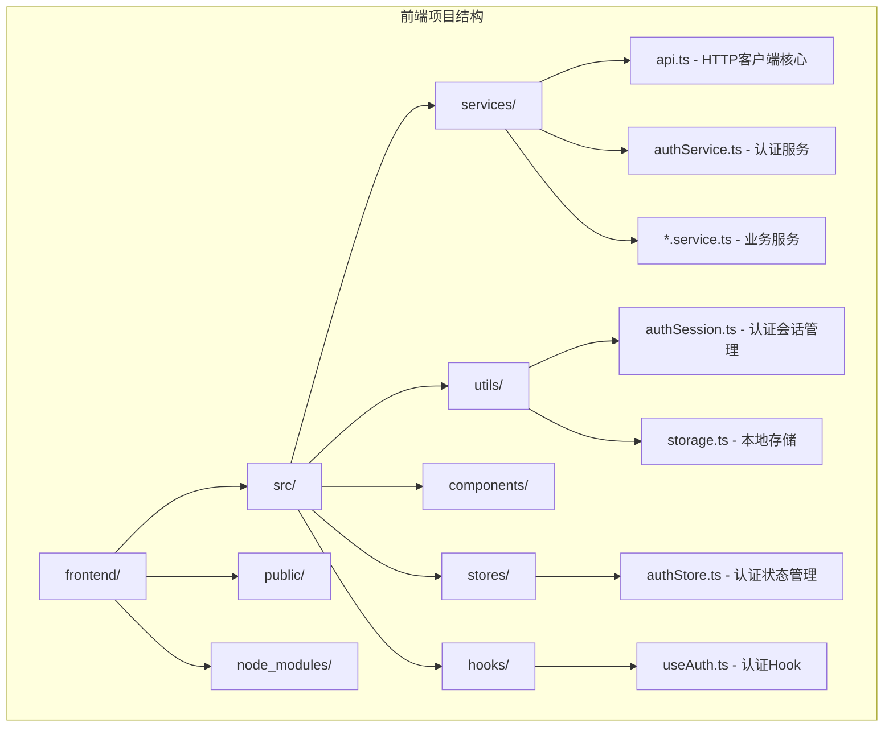
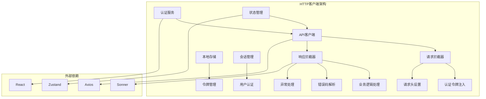
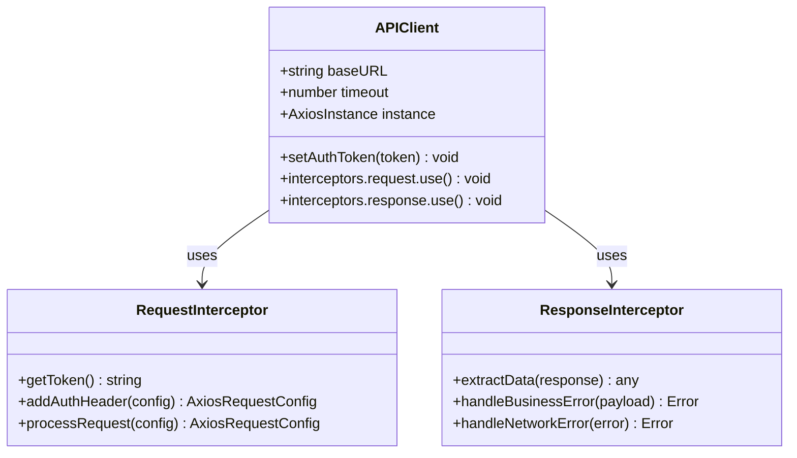
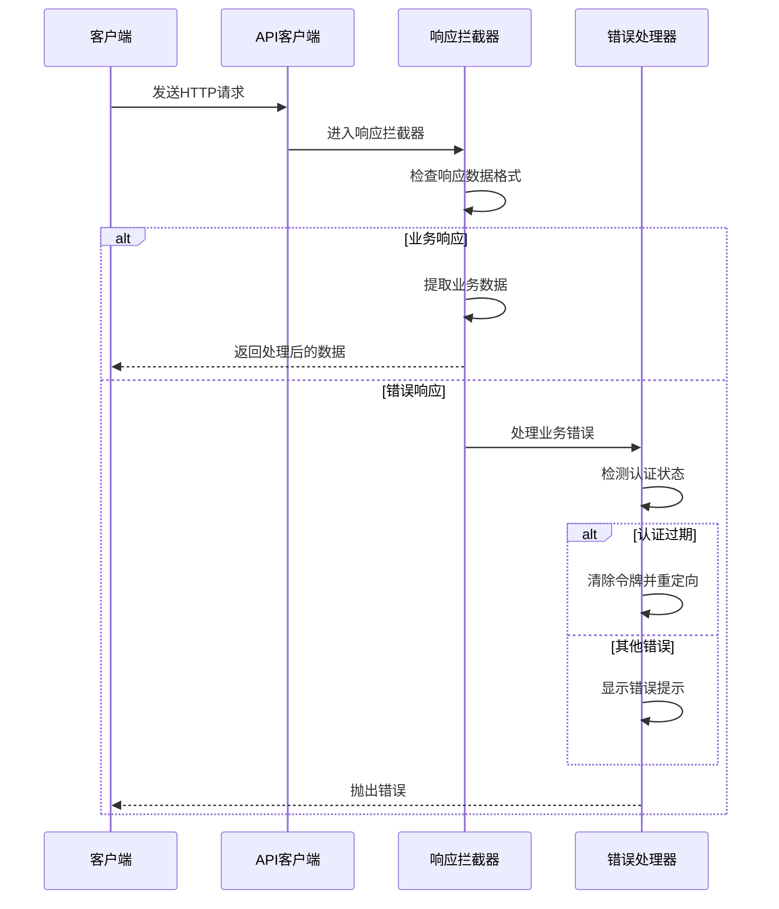
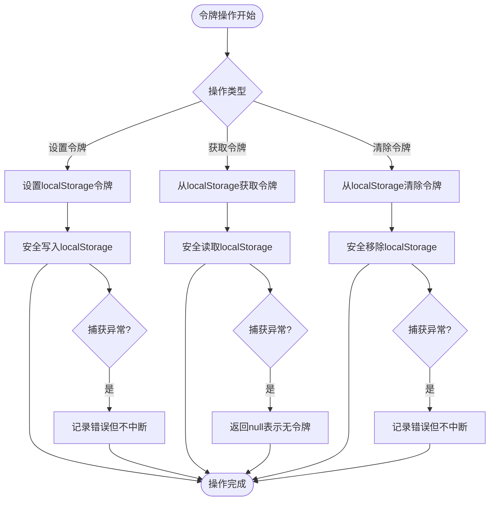
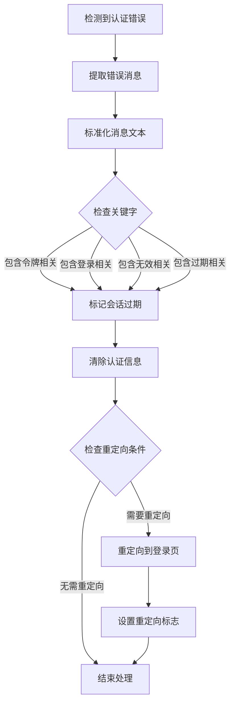
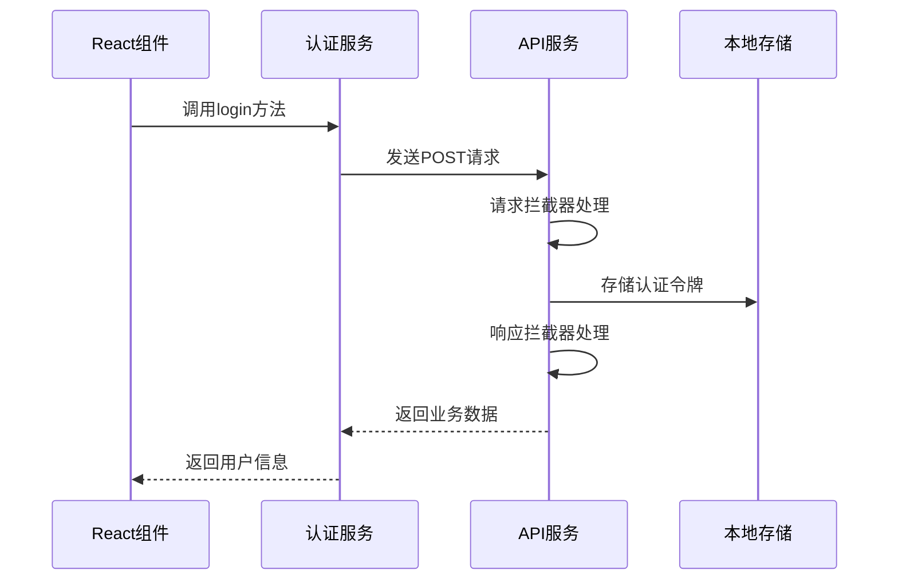
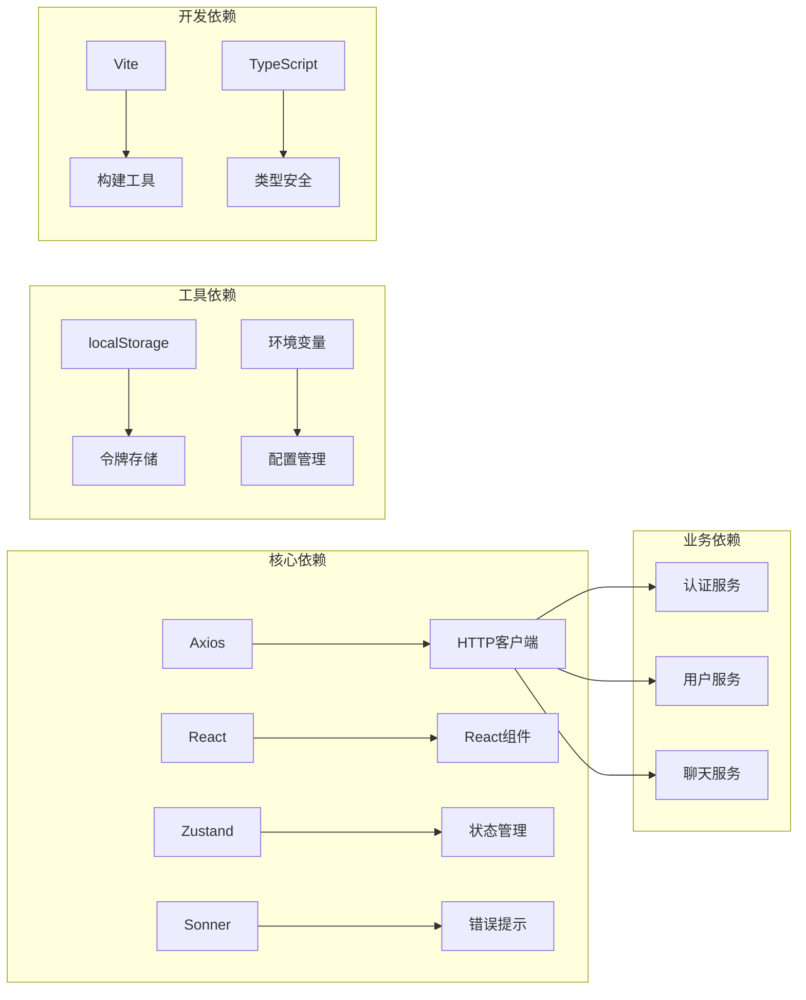

# HTTP客户端配置

<cite>
**本文档引用的文件**
- [frontend/src/services/api.ts](file://frontend/src/services/api.ts)
- [frontend/src/utils/authSession.ts](file://frontend/src/utils/authSession.ts)
- [frontend/src/utils/storage.ts](file://frontend/src/utils/storage.ts)
- [frontend/src/services/authService.ts](file://frontend/src/services/authService.ts)
- [frontend/src/hooks/useAuth.ts](file://frontend/src/hooks/useAuth.ts)
- [frontend/package.json](file://frontend/package.json)
- [frontend/vite.config.ts](file://frontend/vite.config.ts)
- [frontend/src/stores/authStore.ts](file://frontend/src/stores/authStore.ts)
</cite>

## 目录
1. [简介](#简介)
2. [项目结构](#项目结构)
3. [核心组件](#核心组件)
4. [架构概览](#架构概览)
5. [详细组件分析](#详细组件分析)
6. [依赖关系分析](#依赖关系分析)
7. [性能考虑](#性能考虑)
8. [故障排除指南](#故障排除指南)
9. [结论](#结论)
10. [附录](#附录)

## 简介

本文档详细介绍了Seahorse Agent前端项目中基于Axios的HTTP客户端封装架构设计。该HTTP客户端实现了统一的API基础URL配置、超时设置、请求拦截器、响应拦截器以及认证令牌管理机制。

该项目采用现代化的前端技术栈，使用Vite作为构建工具，Axios作为HTTP客户端库，配合React Hook Form进行表单验证，Zustand进行状态管理，Sonner提供通知提示功能。

## 项目结构

前端项目采用模块化组织方式，HTTP客户端相关代码主要集中在以下目录结构中：

**图表来源**
- [frontend/src/services/api.ts:1-68](file://frontend/src/services/api.ts#L1-L68)
- [frontend/src/utils/authSession.ts:1-50](file://frontend/src/utils/authSession.ts#L1-L50)
- [frontend/src/utils/storage.ts:1-67](file://frontend/src/utils/storage.ts#L1-L67)

**章节来源**
- [frontend/src/services/api.ts:1-68](file://frontend/src/services/api.ts#L1-L68)
- [frontend/src/utils/authSession.ts:1-50](file://frontend/src/utils/authSession.ts#L1-L50)
- [frontend/src/utils/storage.ts:1-67](file://frontend/src/utils/storage.ts#L1-L67)

## 核心组件

### HTTP客户端核心配置

HTTP客户端基于Axios创建，实现了统一的基础URL配置和超时设置：

- **基础URL配置**: 通过环境变量VITE_API_BASE_URL动态配置
- **超时设置**: 默认60秒超时时间
- **默认请求头**: 支持认证令牌的自动添加和管理

### 认证令牌管理系统

实现了完整的令牌生命周期管理：

- **令牌存储**: 使用localStorage安全存储JWT令牌
- **令牌设置**: 动态设置和删除Authorization头部
- **令牌刷新**: 自动处理令牌过期和重新认证

### 拦截器机制

实现了双向拦截器来处理请求和响应：

- **请求拦截器**: 自动添加认证信息和请求头
- **响应拦截器**: 统一处理业务逻辑和错误情况

**章节来源**
- [frontend/src/services/api.ts:7-20](file://frontend/src/services/api.ts#L7-L20)
- [frontend/src/services/api.ts:22-28](file://frontend/src/services/api.ts#L22-L28)
- [frontend/src/services/api.ts:30-67](file://frontend/src/services/api.ts#L30-L67)

## 架构概览

整个HTTP客户端架构采用分层设计，确保了代码的可维护性和扩展性：

**图表来源**
- [frontend/src/services/api.ts:1-68](file://frontend/src/services/api.ts#L1-L68)
- [frontend/src/services/authService.ts:1-18](file://frontend/src/services/authService.ts#L1-L18)
- [frontend/src/stores/authStore.ts](file://frontend/src/stores/authStore.ts)

## 详细组件分析

### API客户端核心实现

API客户端是整个HTTP系统的中心，负责所有网络请求的发起和处理。

#### 基础配置分析

API客户端采用工厂模式创建，支持动态配置和扩展：

**图表来源**
- [frontend/src/services/api.ts:9-20](file://frontend/src/services/api.ts#L9-L20)
- [frontend/src/services/api.ts:22-28](file://frontend/src/services/api.ts#L22-L28)
- [frontend/src/services/api.ts:30-67](file://frontend/src/services/api.ts#L30-L67)

#### 请求拦截器实现机制

请求拦截器负责在请求发送前进行预处理：

1. **令牌获取**: 从localStorage获取当前用户的认证令牌
2. **头部设置**: 将令牌添加到Authorization头部
3. **请求增强**: 可扩展其他请求预处理逻辑

#### 响应拦截器设计

响应拦截器提供了强大的数据处理和错误管理能力：

**图表来源**
- [frontend/src/services/api.ts:30-67](file://frontend/src/services/api.ts#L30-L67)
- [frontend/src/utils/authSession.ts:28-49](file://frontend/src/utils/authSession.ts#L28-L49)

**章节来源**
- [frontend/src/services/api.ts:22-28](file://frontend/src/services/api.ts#L22-L28)
- [frontend/src/services/api.ts:30-67](file://frontend/src/services/api.ts#L30-L67)

### 认证令牌管理机制

令牌管理是HTTP客户端的核心功能之一，实现了完整的生命周期管理。

#### 令牌存储策略

令牌存储采用localStorage方案，确保跨页面会话保持：

**图表来源**
- [frontend/src/utils/storage.ts:7-30](file://frontend/src/utils/storage.ts#L7-L30)

#### 令牌设置和更新流程

令牌的设置和更新遵循严格的流程控制：

1. **令牌验证**: 确保令牌格式有效
2. **存储持久化**: 将令牌安全存储到localStorage
3. **头部同步**: 更新Axios实例的默认Authorization头部
4. **状态同步**: 通知相关组件令牌状态变化

**章节来源**
- [frontend/src/utils/storage.ts:31-66](file://frontend/src/utils/storage.ts#L31-L66)
- [frontend/src/services/api.ts:14-20](file://frontend/src/services/api.ts#L14-L20)

### 认证会话管理

认证会话管理负责处理用户登录状态和会话过期情况。

#### 会话过期检测机制

系统实现了智能的会话过期检测，能够识别多种认证失败场景：

**图表来源**
- [frontend/src/utils/authSession.ts:28-49](file://frontend/src/utils/authSession.ts#L28-L49)

#### 用户重定向逻辑

当检测到会话过期时，系统会智能地处理用户重定向：

1. **状态检查**: 避免重复重定向
2. **路径保存**: 保存用户原本访问的页面
3. **原因说明**: 提供清晰的重定向原因
4. **安全重定向**: 确保重定向的安全性

**章节来源**
- [frontend/src/utils/authSession.ts:28-49](file://frontend/src/utils/authSession.ts#L28-L49)

### 业务服务集成

HTTP客户端与各个业务服务紧密集成，提供统一的API访问接口。

#### 认证服务示例

认证服务展示了HTTP客户端的标准使用模式：

**图表来源**
- [frontend/src/services/authService.ts:7-17](file://frontend/src/services/authService.ts#L7-L17)
- [frontend/src/services/api.ts:14-20](file://frontend/src/services/api.ts#L14-L20)

**章节来源**
- [frontend/src/services/authService.ts:1-18](file://frontend/src/services/authService.ts#L1-L18)

## 依赖关系分析

HTTP客户端的依赖关系清晰明确，遵循单一职责原则：

**图表来源**
- [frontend/package.json:15-58](file://frontend/package.json#L15-L58)
- [frontend/src/services/api.ts:1-6](file://frontend/src/services/api.ts#L1-L6)

**章节来源**
- [frontend/package.json:15-58](file://frontend/package.json#L15-L58)

## 性能考虑

### 配置优化建议

1. **超时设置**: 当前60秒超时时间适合大多数场景，可根据网络环境调整
2. **缓存策略**: 对于频繁访问的数据，建议在应用层实现缓存机制
3. **并发控制**: 限制同时进行的请求数量，避免过度消耗资源

### 错误处理优化

1. **重试机制**: 对于临时性错误实现指数退避重试
2. **错误分类**: 区分网络错误、业务错误和认证错误
3. **降级策略**: 在服务不可用时提供优雅降级

### 性能监控

建议实现以下监控指标：
- 请求响应时间分布
- 错误率统计
- 并发请求数监控
- 缓存命中率

## 故障排除指南

### 常见问题诊断

#### 认证问题排查

1. **令牌无效**: 检查localStorage中的令牌是否正确存储
2. **请求被拒绝**: 验证Authorization头部是否正确设置
3. **会话过期**: 查看是否有重定向到登录页面的逻辑

#### 网络问题排查

1. **超时错误**: 检查网络连接和服务器响应时间
2. **跨域问题**: 验证CORS配置和代理设置
3. **SSL证书**: 确认HTTPS证书的有效性

#### 开发环境问题

1. **代理配置**: 确认Vite代理配置正确指向后端服务
2. **环境变量**: 验证VITE_API_BASE_URL设置
3. **热重载**: 检查开发服务器配置

**章节来源**
- [frontend/src/utils/authSession.ts:28-49](file://frontend/src/utils/authSession.ts#L28-L49)
- [frontend/vite.config.ts:13-21](file://frontend/vite.config.ts#L13-L21)

## 结论

Seahorse Agent的HTTP客户端封装展现了现代前端开发的最佳实践。通过合理的架构设计、完善的错误处理机制和灵活的配置选项，该客户端为整个应用提供了稳定可靠的网络通信基础。

关键优势包括：
- **统一的配置管理**: 通过环境变量实现灵活的部署配置
- **完整的认证支持**: 从令牌管理到会话处理的全流程支持
- **强大的错误处理**: 智能的错误检测和用户友好的提示
- **良好的扩展性**: 清晰的架构设计便于功能扩展

建议在生产环境中进一步完善：
- 添加请求重试和断路器机制
- 实现更精细的性能监控
- 增强安全防护措施
- 优化错误恢复策略

## 附录

### 环境变量配置

| 变量名 | 类型 | 默认值 | 描述 |
|--------|------|--------|------|
| VITE_API_BASE_URL | string | "" | 后端API基础URL |
| VITE_APP_NAME | string | "Seahorse Agent" | 应用名称 |

### 依赖版本信息

- **Axios**: ^1.7.5 - HTTP客户端库
- **React**: ^18.3.1 - 用户界面库
- **Zustand**: ^4.5.5 - 状态管理库
- **Sonner**: ^1.5.0 - 通知提示库

### 最佳实践建议

1. **配置管理**: 使用环境变量管理不同环境的配置
2. **错误处理**: 实现统一的错误处理和用户反馈机制
3. **安全性**: 确保令牌的安全存储和传输
4. **性能**: 实现适当的缓存和重试策略
5. **监控**: 添加详细的日志和性能监控