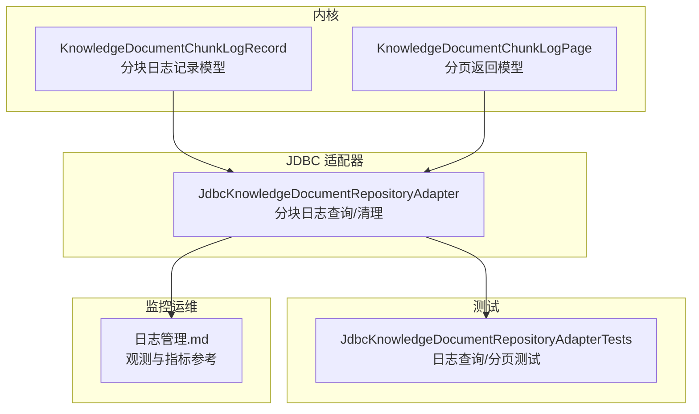
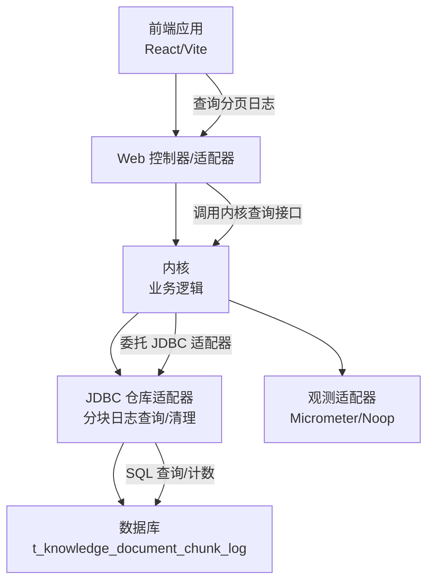
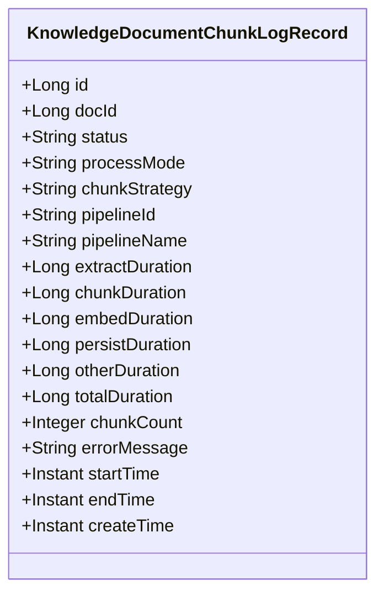
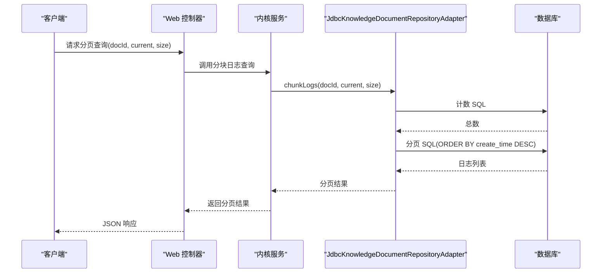
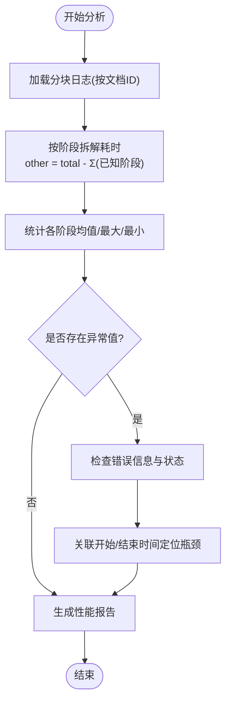
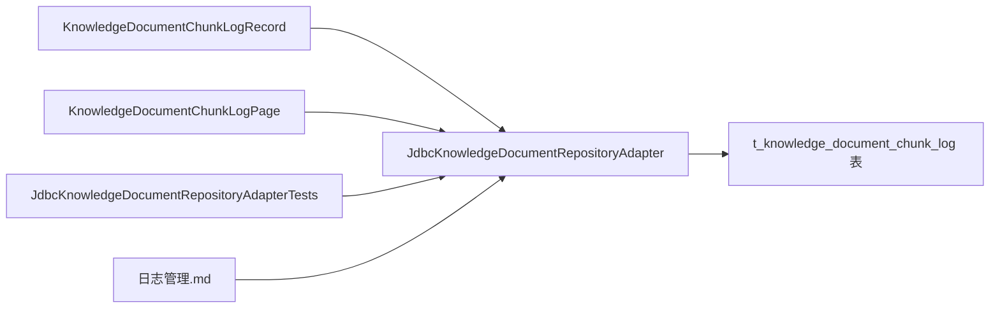

# 分块日志管理

<cite>
**本文引用的文件**
- [JdbcKnowledgeDocumentRepositoryAdapter.java](file://seahorse-agent-adapter-repository-jdbc/src/main/java/com/miracle/ai/seahorse/agent/adapters/repository/jdbc/JdbcKnowledgeDocumentRepositoryAdapter.java)
- [KnowledgeDocumentChunkLogRecord.java](file://seahorse-agent-kernel/src/main/java/com/miracle/ai/seahorse/agent/ports/outbound/knowledge/KnowledgeDocumentChunkLogRecord.java)
- [KnowledgeDocumentChunkLogPage.java](file://seahorse-agent-kernel/src/main/java/com/miracle/ai/seahorse/agent/ports/outbound/knowledge/KnowledgeDocumentChunkLogPage.java)
- [JdbcKnowledgeDocumentRepositoryAdapterTests.java](file://seahorse-agent-adapter-repository-jdbc/src/test/java/com/miracle/ai/seahorse/agent/adapters/repository/jdbc/JdbcKnowledgeDocumentRepositoryAdapterTests.java)
- [日志管理.md](file://docs/zh/content/监控运维/日志管理.md)
- [JdbcKnowledgeDocumentRepositoryAdapter_optimized.java](file://docs/performance/JdbcKnowledgeDocumentRepositoryAdapter_optimized.java)
</cite>

## 目录
1. [简介](#简介)
2. [项目结构](#项目结构)
3. [核心组件](#核心组件)
4. [架构总览](#架构总览)
5. [详细组件分析](#详细组件分析)
6. [依赖分析](#依赖分析)
7. [性能考量](#性能考量)
8. [故障排查指南](#故障排查指南)
9. [结论](#结论)
10. [附录](#附录)

## 简介
本文件面向开发者与运维人员，系统化阐述 Seahorse Agent 的“分块日志管理”能力，覆盖以下主题：
- 分块日志的数据模型与字段语义（处理状态、各阶段耗时、错误信息、时间戳等）
- 日志查询 API 的实现与使用（按文档 ID 查询、分页获取）
- 日志分析与性能监控（处理时长统计、阶段耗时拆解、异常定位）
- 错误日志处理与故障排查方法
- 最佳实践（日志清理策略、性能优化建议）
- 完整的查询 API 示例与监控集成指南

## 项目结构
围绕分块日志管理的关键代码分布在以下模块与文件中：
- JDBC 仓库适配器：负责持久化与查询分块日志，提供分页与计数能力
- 内核数据模型：定义分块日志记录与分页返回对象
- 测试用例：验证日志写入、查询与分页行为
- 监控运维文档：提供观测与指标采集的参考

**图表来源**
- [JdbcKnowledgeDocumentRepositoryAdapter.java:52-565](file://seahorse-agent-adapter-repository-jdbc/src/main/java/com/miracle/ai/seahorse/agent/adapters/repository/jdbc/JdbcKnowledgeDocumentRepositoryAdapter.java#L52-L565)
- [KnowledgeDocumentChunkLogRecord.java:25-189](file://seahorse-agent-kernel/src/main/java/com/miracle/ai/seahorse/agent/ports/outbound/knowledge/KnowledgeDocumentChunkLogRecord.java#L25-L189)
- [KnowledgeDocumentChunkLogPage.java](file://seahorse-agent-kernel/src/main/java/com/miracle/ai/seahorse/agent/ports/outbound/knowledge/KnowledgeDocumentChunkLogPage.java)
- [JdbcKnowledgeDocumentRepositoryAdapterTests.java:225-238](file://seahorse-agent-adapter-repository-jdbc/src/test/java/com/miracle/ai/seahorse/agent/adapters/repository/jdbc/JdbcKnowledgeDocumentRepositoryAdapterTests.java#L225-L238)
- [日志管理.md:42-80](file://docs/zh/content/监控运维/日志管理.md#L42-L80)

**章节来源**
- [JdbcKnowledgeDocumentRepositoryAdapter.java:52-565](file://seahorse-agent-adapter-repository-jdbc/src/main/java/com/miracle/ai/seahorse/agent/adapters/repository/jdbc/JdbcKnowledgeDocumentRepositoryAdapter.java#L52-L565)
- [KnowledgeDocumentChunkLogRecord.java:25-189](file://seahorse-agent-kernel/src/main/java/com/miracle/ai/seahorse/agent/ports/outbound/knowledge/KnowledgeDocumentChunkLogRecord.java#L25-L189)
- [KnowledgeDocumentChunkLogPage.java](file://seahorse-agent-kernel/src/main/java/com/miracle/ai/seahorse/agent/ports/outbound/knowledge/KnowledgeDocumentChunkLogPage.java)
- [JdbcKnowledgeDocumentRepositoryAdapterTests.java:225-238](file://seahorse-agent-adapter-repository-jdbc/src/test/java/com/miracle/ai/seahorse/agent/adapters/repository/jdbc/JdbcKnowledgeDocumentRepositoryAdapterTests.java#L225-L238)
- [日志管理.md:42-80](file://docs/zh/content/监控运维/日志管理.md#L42-L80)

## 核心组件
- 分块日志记录模型（KnowledgeDocumentChunkLogRecord）：承载单条分块处理日志的所有字段，包括状态、处理模式、分块策略、流水线标识、各阶段耗时、总耗时、分块数量、错误信息、起止时间与创建时间等。
- 分页返回模型（KnowledgeDocumentChunkLogPage）：封装分页查询结果，包含记录列表、总数、页码与页大小。
- JDBC 仓库适配器（JdbcKnowledgeDocumentRepositoryAdapter）：提供按文档 ID 查询分块日志并分页的能力，同时支持删除该文档下的所有日志。

**章节来源**
- [KnowledgeDocumentChunkLogRecord.java:25-189](file://seahorse-agent-kernel/src/main/java/com/miracle/ai/seahorse/agent/ports/outbound/knowledge/KnowledgeDocumentChunkLogRecord.java#L25-L189)
- [KnowledgeDocumentChunkLogPage.java](file://seahorse-agent-kernel/src/main/java/com/miracle/ai/seahorse/agent/ports/outbound/knowledge/KnowledgeDocumentChunkLogPage.java)
- [JdbcKnowledgeDocumentRepositoryAdapter.java:100-155](file://seahorse-agent-adapter-repository-jdbc/src/main/java/com/miracle/ai/seahorse/agent/adapters/repository/jdbc/JdbcKnowledgeDocumentRepositoryAdapter.java#L100-L155)

## 架构总览
分块日志管理在系统中的位置如下：

**图表来源**
- [日志管理.md:42-80](file://docs/zh/content/监控运维/日志管理.md#L42-L80)
- [JdbcKnowledgeDocumentRepositoryAdapter.java:100-155](file://seahorse-agent-adapter-repository-jdbc/src/main/java/com/miracle/ai/seahorse/agent/adapters/repository/jdbc/JdbcKnowledgeDocumentRepositoryAdapter.java#L100-L155)

## 详细组件分析

### 数据模型与字段语义
分块日志记录模型包含以下关键字段：
- 标识与关联：日志 ID、所属文档 ID
- 处理元信息：处理状态、处理模式、分块策略、流水线 ID/名称
- 各阶段耗时：抽取耗时、分块耗时、嵌入耗时、持久化耗时、其他耗时、总耗时
- 结果与错误：分块数量、错误信息
- 时间戳：开始时间、结束时间、创建时间

**图表来源**
- [KnowledgeDocumentChunkLogRecord.java:25-189](file://seahorse-agent-kernel/src/main/java/com/miracle/ai/seahorse/agent/ports/outbound/knowledge/KnowledgeDocumentChunkLogRecord.java#L25-L189)

**章节来源**
- [KnowledgeDocumentChunkLogRecord.java:25-189](file://seahorse-agent-kernel/src/main/java/com/miracle/ai/seahorse/agent/ports/outbound/knowledge/KnowledgeDocumentChunkLogRecord.java#L25-L189)

### 日志查询 API 实现
- 查询计数：按文档 ID 统计分块日志总数
- 分页查询：按文档 ID 查询分块日志，按创建时间倒序，支持页码与页大小控制
- 删除日志：按文档 ID 清空该文档下的所有分块日志

**图表来源**
- [JdbcKnowledgeDocumentRepositoryAdapter.java:100-155](file://seahorse-agent-adapter-repository-jdbc/src/main/java/com/miracle/ai/seahorse/agent/adapters/repository/jdbc/JdbcKnowledgeDocumentRepositoryAdapter.java#L100-L155)
- [JdbcKnowledgeDocumentRepositoryAdapter.java:240-249](file://seahorse-agent-adapter-repository-jdbc/src/main/java/com/miracle/ai/seahorse/agent/adapters/repository/jdbc/JdbcKnowledgeDocumentRepositoryAdapter.java#L240-L249)

**章节来源**
- [JdbcKnowledgeDocumentRepositoryAdapter.java:100-155](file://seahorse-agent-adapter-repository-jdbc/src/main/java/com/miracle/ai/seahorse/agent/adapters/repository/jdbc/JdbcKnowledgeDocumentRepositoryAdapter.java#L100-L155)
- [JdbcKnowledgeDocumentRepositoryAdapter.java:240-249](file://seahorse-agent-adapter-repository-jdbc/src/main/java/com/miracle/ai/seahorse/agent/adapters/repository/jdbc/JdbcKnowledgeDocumentRepositoryAdapter.java#L240-L249)

### 日志分析与性能监控
- 阶段耗时拆解：总耗时减去已知阶段耗时可得到“其他耗时”，用于识别未显式统计的环节或异常
- 统计口径：按文档维度聚合分块日志，计算平均/最大/最小各阶段耗时与总耗时
- 异常定位：优先查看错误信息与状态字段，结合开始/结束时间进行时序分析
- 监控集成：通过 Micrometer 观测适配器输出计数器与定时器，统一采集与告警

**图表来源**
- [JdbcKnowledgeDocumentRepositoryAdapter.java:521-534](file://seahorse-agent-adapter-repository-jdbc/src/main/java/com/miracle/ai/seahorse/agent/adapters/repository/jdbc/JdbcKnowledgeDocumentRepositoryAdapter.java#L521-L534)
- [日志管理.md:42-80](file://docs/zh/content/监控运维/日志管理.md#L42-L80)

**章节来源**
- [JdbcKnowledgeDocumentRepositoryAdapter.java:521-534](file://seahorse-agent-adapter-repository-jdbc/src/main/java/com/miracle/ai/seahorse/agent/adapters/repository/jdbc/JdbcKnowledgeDocumentRepositoryAdapter.java#L521-L534)
- [日志管理.md:42-80](file://docs/zh/content/监控运维/日志管理.md#L42-L80)

### 错误日志处理与故障排查
- 错误信息字段：记录分块处理失败时的具体错误描述
- 状态字段：区分 pending/running/success/failed 等状态，便于快速定位
- 时间序列：结合开始/结束时间与各阶段耗时，定位卡顿或超时环节
- 清理策略：当需要重试或重新导入时，可按文档 ID 清空历史日志，避免脏数据干扰

**章节来源**
- [JdbcKnowledgeDocumentRepositoryAdapter.java:155-156](file://seahorse-agent-adapter-repository-jdbc/src/main/java/com/miracle/ai/seahorse/agent/adapters/repository/jdbc/JdbcKnowledgeDocumentRepositoryAdapter.java#L155-L156)
- [JdbcKnowledgeDocumentRepositoryAdapter.java:268-271](file://seahorse-agent-adapter-repository-jdbc/src/main/java/com/miracle/ai/seahorse/agent/adapters/repository/jdbc/JdbcKnowledgeDocumentRepositoryAdapter.java#L268-L271)

### 最佳实践
- 日志清理策略
  - 按文档维度清理：在重试或重新导入前，使用按文档 ID 清空日志的接口
  - 归档保留：对历史成功日志进行归档或定期清理，控制表规模
- 性能优化建议
  - 分页大小控制：服务端限制每页最大条数，避免一次性拉取过多
  - 索引与查询：确保按文档 ID 与创建时间的索引，提升分页与计数性能
  - 监控与告警：启用 Micrometer 指标，关注分页查询耗时与错误率
- API 使用建议
  - 建议前端按需分页加载，避免一次性请求过大页码
  - 对错误日志进行分类统计，形成可视化看板

**章节来源**
- [JdbcKnowledgeDocumentRepositoryAdapter.java:540-545](file://seahorse-agent-adapter-repository-jdbc/src/main/java/com/miracle/ai/seahorse/agent/adapters/repository/jdbc/JdbcKnowledgeDocumentRepositoryAdapter.java#L540-L545)
- [JdbcKnowledgeDocumentRepositoryAdapter.java:155-156](file://seahorse-agent-adapter-repository-jdbc/src/main/java/com/miracle/ai/seahorse/agent/adapters/repository/jdbc/JdbcKnowledgeDocumentRepositoryAdapter.java#L155-L156)
- [日志管理.md:42-80](file://docs/zh/content/监控运维/日志管理.md#L42-L80)

## 依赖分析
分块日志管理涉及的核心依赖关系如下：

**图表来源**
- [JdbcKnowledgeDocumentRepositoryAdapter.java:52-565](file://seahorse-agent-adapter-repository-jdbc/src/main/java/com/miracle/ai/seahorse/agent/adapters/repository/jdbc/JdbcKnowledgeDocumentRepositoryAdapter.java#L52-L565)
- [KnowledgeDocumentChunkLogRecord.java:25-189](file://seahorse-agent-kernel/src/main/java/com/miracle/ai/seahorse/agent/ports/outbound/knowledge/KnowledgeDocumentChunkLogRecord.java#L25-L189)
- [KnowledgeDocumentChunkLogPage.java](file://seahorse-agent-kernel/src/main/java/com/miracle/ai/seahorse/agent/ports/outbound/knowledge/KnowledgeDocumentChunkLogPage.java)
- [JdbcKnowledgeDocumentRepositoryAdapterTests.java:225-238](file://seahorse-agent-adapter-repository-jdbc/src/test/java/com/miracle/ai/seahorse/agent/adapters/repository/jdbc/JdbcKnowledgeDocumentRepositoryAdapterTests.java#L225-L238)
- [日志管理.md:42-80](file://docs/zh/content/监控运维/日志管理.md#L42-L80)

**章节来源**
- [JdbcKnowledgeDocumentRepositoryAdapter.java:52-565](file://seahorse-agent-adapter-repository-jdbc/src/main/java/com/miracle/ai/seahorse/agent/adapters/repository/jdbc/JdbcKnowledgeDocumentRepositoryAdapter.java#L52-L565)
- [KnowledgeDocumentChunkLogRecord.java:25-189](file://seahorse-agent-kernel/src/main/java/com/miracle/ai/seahorse/agent/ports/outbound/knowledge/KnowledgeDocumentChunkLogRecord.java#L25-L189)
- [KnowledgeDocumentChunkLogPage.java](file://seahorse-agent-kernel/src/main/java/com/miracle/ai/seahorse/agent/ports/outbound/knowledge/KnowledgeDocumentChunkLogPage.java)
- [JdbcKnowledgeDocumentRepositoryAdapterTests.java:225-238](file://seahorse-agent-adapter-repository-jdbc/src/test/java/com/miracle/ai/seahorse/agent/adapters/repository/jdbc/JdbcKnowledgeDocumentRepositoryAdapterTests.java#L225-L238)
- [日志管理.md:42-80](file://docs/zh/content/监控运维/日志管理.md#L42-L80)

## 性能考量
- 分页与计数：采用独立的计数 SQL 与分页 SQL，避免重复扫描
- 字段映射：在适配器中将数据库字段映射到模型，并计算“其他耗时”
- 优化参考：可参考性能优化版本文件中的 SQL 与映射策略

**章节来源**
- [JdbcKnowledgeDocumentRepositoryAdapter.java:100-155](file://seahorse-agent-adapter-repository-jdbc/src/main/java/com/miracle/ai/seahorse/agent/adapters/repository/jdbc/JdbcKnowledgeDocumentRepositoryAdapter.java#L100-L155)
- [JdbcKnowledgeDocumentRepositoryAdapter.java:521-534](file://seahorse-agent-adapter-repository-jdbc/src/main/java/com/miracle/ai/seahorse/agent/adapters/repository/jdbc/JdbcKnowledgeDocumentRepositoryAdapter.java#L521-L534)
- [JdbcKnowledgeDocumentRepositoryAdapter_optimized.java:113-127](file://docs/performance/JdbcKnowledgeDocumentRepositoryAdapter_optimized.java#L113-L127)

## 故障排查指南
- 常见问题
  - 查询为空：确认文档 ID 是否正确，检查状态是否为成功或失败
  - 分页异常：检查页码与页大小是否在服务端限制范围内
  - 性能下降：确认索引是否存在，观察 Micrometer 指标
- 排查步骤
  - 通过按文档 ID 查询日志，核对状态与错误信息
  - 使用“其他耗时”字段辅助定位未知环节
  - 在重试前清理历史日志，避免旧数据干扰

**章节来源**
- [JdbcKnowledgeDocumentRepositoryAdapter.java:100-155](file://seahorse-agent-adapter-repository-jdbc/src/main/java/com/miracle/ai/seahorse/agent/adapters/repository/jdbc/JdbcKnowledgeDocumentRepositoryAdapter.java#L100-L155)
- [JdbcKnowledgeDocumentRepositoryAdapter.java:268-271](file://seahorse-agent-adapter-repository-jdbc/src/main/java/com/miracle/ai/seahorse/agent/adapters/repository/jdbc/JdbcKnowledgeDocumentRepositoryAdapter.java#L268-L271)
- [JdbcKnowledgeDocumentRepositoryAdapterTests.java:225-238](file://seahorse-agent-adapter-repository-jdbc/src/test/java/com/miracle/ai/seahorse/agent/adapters/repository/jdbc/JdbcKnowledgeDocumentRepositoryAdapterTests.java#L225-L238)

## 结论
分块日志管理通过清晰的数据模型、稳定的查询 API 与完善的性能监控，为文档分块处理提供了可观测、可分析、可优化的支撑。遵循本文的最佳实践与排查流程，可在保证性能的同时，高效定位问题并持续优化处理链路。

## 附录

### API 使用示例（路径指引）
- 分页查询分块日志
  - 方法：按文档 ID 查询分块日志并分页
  - 参数：文档 ID、当前页、页大小
  - 返回：分页结果对象
  - 参考实现路径：
    - [JdbcKnowledgeDocumentRepositoryAdapter.java:240-249](file://seahorse-agent-adapter-repository-jdbc/src/main/java/com/miracle/ai/seahorse/agent/adapters/repository/jdbc/JdbcKnowledgeDocumentRepositoryAdapter.java#L240-L249)
    - [JdbcKnowledgeDocumentRepositoryAdapter.java:100-155](file://seahorse-agent-adapter-repository-jdbc/src/main/java/com/miracle/ai/seahorse/agent/adapters/repository/jdbc/JdbcKnowledgeDocumentRepositoryAdapter.java#L100-L155)
- 清空分块日志
  - 方法：按文档 ID 删除该文档下的所有分块日志
  - 参考实现路径：
    - [JdbcKnowledgeDocumentRepositoryAdapter.java:155-156](file://seahorse-agent-adapter-repository-jdbc/src/main/java/com/miracle/ai/seahorse/agent/adapters/repository/jdbc/JdbcKnowledgeDocumentRepositoryAdapter.java#L155-L156)
- 单元测试参考
  - 测试插入与查询分块日志样例
  - 参考测试路径：
    - [JdbcKnowledgeDocumentRepositoryAdapterTests.java:225-238](file://seahorse-agent-adapter-repository-jdbc/src/test/java/com/miracle/ai/seahorse/agent/adapters/repository/jdbc/JdbcKnowledgeDocumentRepositoryAdapterTests.java#L225-L238)

### 监控集成指南
- 指标采集：通过 Micrometer 观测适配器输出计数器与定时器，统一采集与告警
- 参考文档：
  - [日志管理.md:42-80](file://docs/zh/content/监控运维/日志管理.md#L42-L80)