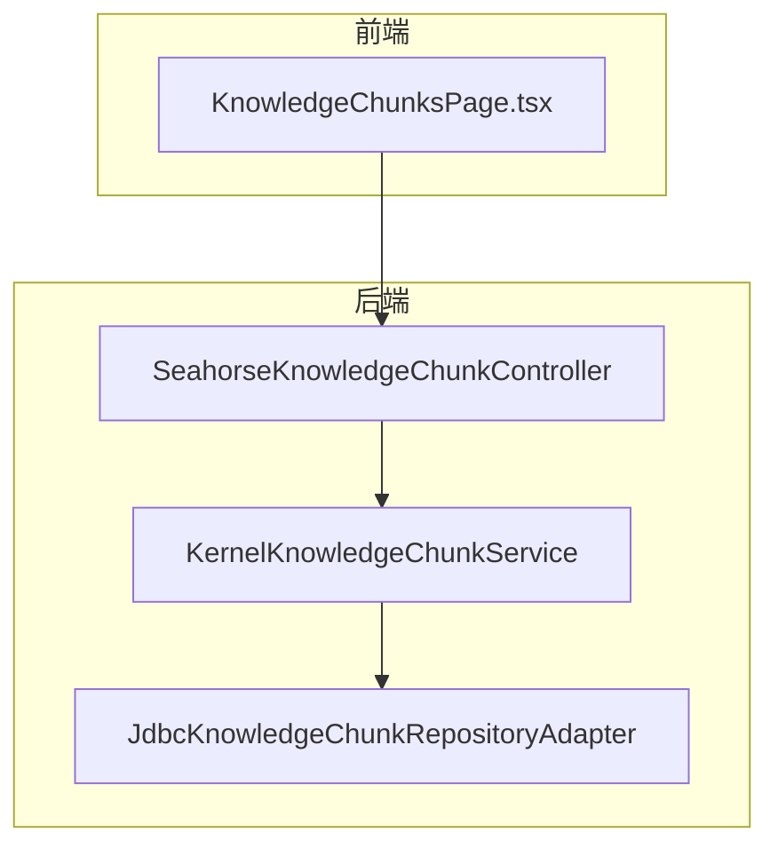
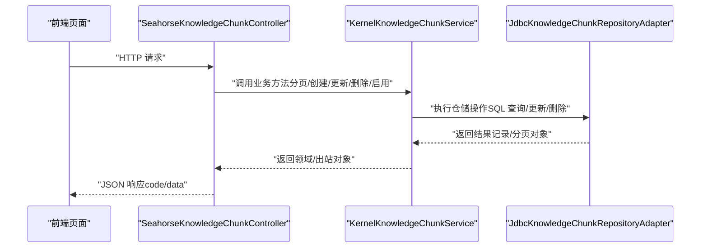
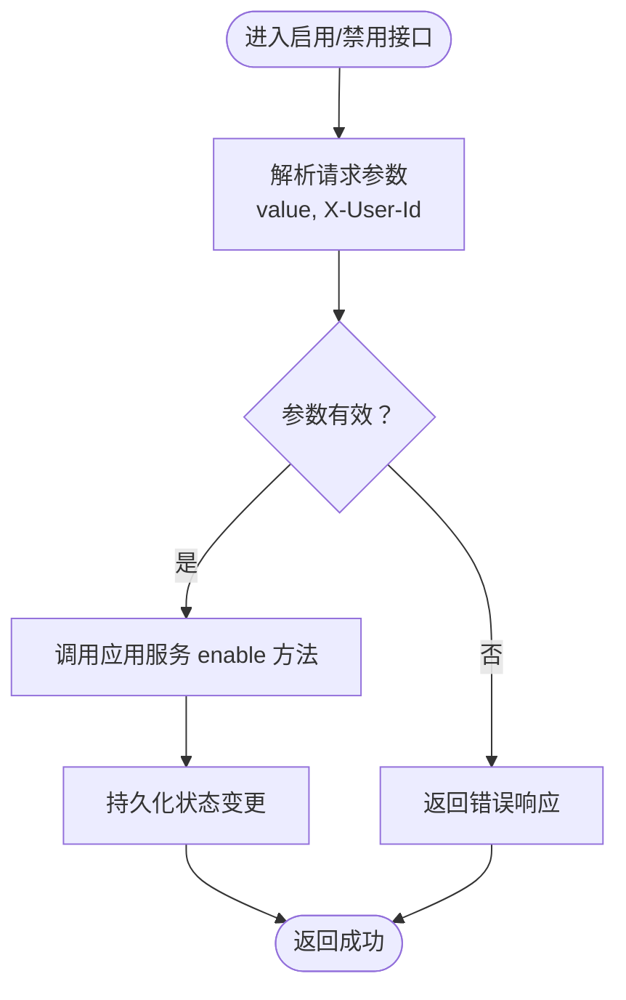
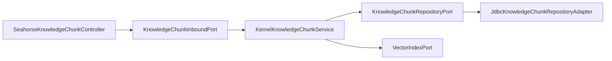

# 文档块管理

<cite>
**本文引用的文件**
- [SeahorseKnowledgeChunkController.java](file://seahorse-agent-adapter-web/src/main/java/com/miracle/ai/seahorse/agent/adapters/web/SeahorseKnowledgeChunkController.java)
- [KernelKnowledgeChunkService.java](file://seahorse-agent-kernel/src/main/java/com/miracle/ai/seahorse/agent/kernel/application/knowledge/KernelKnowledgeChunkService.java)
- [JdbcKnowledgeChunkRepositoryAdapter.java](file://seahorse-agent-adapter-repository-jdbc/src/main/java/com/miracle/ai/seahorse/agent/adapters/repository/jdbc/JdbcKnowledgeChunkRepositoryAdapter.java)
- [KnowledgeChunkInboundPort.java](file://seahorse-agent-kernel/src/main/java/com/miracle/ai/seahorse/agent/ports/inbound/knowledge/KnowledgeChunkInboundPort.java)
- [CreateKnowledgeChunkCommand.java](file://seahorse-agent-kernel/src/main/java/com/miracle/ai/seahorse/agent/ports/inbound/knowledge/CreateKnowledgeChunkCommand.java)
- [UpdateKnowledgeChunkCommand.java](file://seahorse-agent-kernel/src/main/java/com/miracle/ai/seahorse/agent/ports/inbound/knowledge/UpdateKnowledgeChunkCommand.java)
- [KnowledgeChunkPageCommand.java](file://seahorse-agent-kernel/src/main/java/com/miracle/ai/seahorse/agent/ports/inbound/knowledge/KnowledgeChunkPageCommand.java)
- [KnowledgeChunkPage.java](file://seahorse-agent-kernel/src/main/java/com/miracle/ai/seahorse/agent/ports/outbound/knowledge/KnowledgeChunkPage.java)
- [KnowledgeChunkRecord.java](file://seahorse-agent-kernel/src/main/java/com/miracle/ai/seahorse/agent/ports/outbound/knowledge/KnowledgeChunkRecord.java)
- [KnowledgeChunkCreateRequest.java](file://seahorse-agent-adapter-web/src/main/java/com/miracle/ai/seahorse/agent/adapters/web/KnowledgeChunkCreateRequest.java)
- [KnowledgeChunkUpdateRequest.java](file://seahorse-agent-adapter-web/src/main/java/com/miracle/ai/seahorse/agent/adapters/web/KnowledgeChunkUpdateRequest.java)
- [KnowledgeChunkBatchRequest.java](file://seahorse-agent-adapter-web/src/main/java/com/miracle/ai/seahorse/agent/adapters/web/KnowledgeChunkBatchRequest.java)
- [KnowledgeChunkBatchEnableRequest.java](file://seahorse-agent-adapter-web/src/main/java/com/miracle/ai/seahorse/agent/adapters/web/KnowledgeChunkBatchEnableRequest.java)
- [KnowledgeChunkBatchDeleteRequest.java](file://seahorse-agent-adapter-web/src/main/java/com/miracle/ai/seahorse/agent/adapters/web/KnowledgeChunkBatchDeleteRequest.java)
- [KnowledgeBaseQueryPort.md](file://docs/zh/content/后端系统/核心内核/端口接口/出站端口/知识库出站端口.md)
- [知识管理应用服务.md](file://docs/zh/content/后端系统/核心内核/应用服务层/知识管理应用服务.md)
- [KnowledgeChunksPage.tsx](file://frontend/src/pages/admin/knowledge/KnowledgeChunksPage.tsx)
</cite>

## 目录
1. [简介](#简介)
2. [项目结构](#项目结构)
3. [核心组件](#核心组件)
4. [架构总览](#架构总览)
5. [详细组件分析](#详细组件分析)
6. [依赖关系分析](#依赖关系分析)
7. [性能考虑](#性能考虑)
8. [故障排查指南](#故障排查指南)
9. [结论](#结论)
10. [附录](#附录)

## 简介
本文件面向开发者与产品人员，系统性梳理 Seahorse Agent 的“文档块管理”能力，覆盖以下主题：
- 文档块 CRUD 操作的 API 实现与调用流程
- 文档块数据模型（内容、索引、哈希、字符数、token 数等）
- 单个与批量操作支持（启用/禁用、删除）
- 查询能力（分页、过滤）
- 最佳实践（内容组织、索引策略、性能优化）
- 完整的 API 示例与数据校验指南

## 项目结构
围绕文档块管理的关键模块分布如下：
- 控制器层：REST API 入口，负责请求解析、参数校验与响应封装
- 应用服务层：业务编排，协调仓储与向量存储
- 仓储适配层：持久化实现，负责数据读写与分页查询
- 前端页面：提供文档块的增删改查与批量操作界面

图表来源
- [SeahorseKnowledgeChunkController.java:44-73](file://seahorse-agent-adapter-web/src/main/java/com/miracle/ai/seahorse/agent/adapters/web/SeahorseKnowledgeChunkController.java#L44-L73)
- [KernelKnowledgeChunkService.java:40-63](file://seahorse-agent-kernel/src/main/java/com/miracle/ai/seahorse/agent/kernel/application/knowledge/KernelKnowledgeChunkService.java#L40-L63)
- [JdbcKnowledgeChunkRepositoryAdapter.java](file://seahorse-agent-adapter-repository-jdbc/src/main/java/com/miracle/ai/seahorse/agent/adapters/repository/jdbc/JdbcKnowledgeChunkRepositoryAdapter.java)

章节来源
- [SeahorseKnowledgeChunkController.java:44-73](file://seahorse-agent-adapter-web/src/main/java/com/miracle/ai/seahorse/agent/adapters/web/SeahorseKnowledgeChunkController.java#L44-L73)
- [KernelKnowledgeChunkService.java:40-63](file://seahorse-agent-kernel/src/main/java/com/miracle/ai/seahorse/agent/kernel/application/knowledge/KernelKnowledgeChunkService.java#L40-L63)
- [KnowledgeBaseQueryPort.md:53-100](file://docs/zh/content/后端系统/核心内核/端口接口/出站端口/知识库出站端口.md#L53-L100)
- [知识管理应用服务.md:361-379](file://docs/zh/content/后端系统/核心内核/应用服务层/知识管理应用服务.md#L361-L379)

## 核心组件
- 控制器：提供分页查询、创建、更新、删除、启用/禁用、批量启用/删除等接口
- 应用服务：封装业务规则（如分页命令、批量大小限制、状态常量），协调仓储与向量
- 仓储适配：基于 JDBC 的具体实现，负责 SQL 执行与结果映射
- 前端页面：提供交互式 UI，触发上述 API 并展示结果

章节来源
- [SeahorseKnowledgeChunkController.java:44-73](file://seahorse-agent-adapter-web/src/main/java/com/miracle/ai/seahorse/agent/adapters/web/SeahorseKnowledgeChunkController.java#L44-L73)
- [KernelKnowledgeChunkService.java:40-63](file://seahorse-agent-kernel/src/main/java/com/miracle/ai/seahorse/agent/kernel/application/knowledge/KernelKnowledgeChunkService.java#L40-L63)
- [KnowledgeChunksPage.tsx:348-383](file://frontend/src/pages/admin/knowledge/KnowledgeChunksPage.tsx#L348-L383)

## 架构总览
下图展示了从 Web 控制器到应用服务再到仓储适配的完整调用链路。

图表来源
- [SeahorseKnowledgeChunkController.java:58-73](file://seahorse-agent-adapter-web/src/main/java/com/miracle/ai/seahorse/agent/adapters/web/SeahorseKnowledgeChunkController.java#L58-L73)
- [KernelKnowledgeChunkService.java:58-63](file://seahorse-agent-kernel/src/main/java/com/miracle/ai/seahorse/agent/kernel/application/knowledge/KernelKnowledgeChunkService.java#L58-L63)
- [JdbcKnowledgeChunkRepositoryAdapter.java](file://seahorse-agent-adapter-repository-jdbc/src/main/java/com/miracle/ai/seahorse/agent/adapters/repository/jdbc/JdbcKnowledgeChunkRepositoryAdapter.java)

## 详细组件分析

### API 定义与调用流程
- 分页查询
  - 方法：GET /knowledge-base/docs/{doc-id}/chunks
  - 参数：current（默认 1）、size（默认 10）、enabled（可选）
  - 返回：分页对象，包含列表与统计信息
- 创建
  - 方法：POST /knowledge-base/docs/{doc-id}/chunks
  - 请求体：包含 chunkId（可选）、content、index
  - 返回：创建后的记录对象
- 更新
  - 方法：PUT /knowledge-base/docs/{doc-id}/chunks/{chunk-id}
  - 请求体：content（可选）
  - 返回：更新后的记录对象
- 删除
  - 方法：DELETE /knowledge-base/docs/{doc-id}/chunks/{chunk-id}
  - 返回：空或成功标记
- 启用/禁用
  - 方法：PATCH /knowledge-base/docs/{doc-id}/chunks/{chunk-id}/enable
  - 查询参数：value（true/false）
  - 头部：X-User-Id（用于记录操作人）
  - 返回：成功标记
- 批量启用/删除
  - 方法：PATCH /knowledge-base/docs/{doc-id}/chunks/batch-enable 或 DELETE /knowledge-base/docs/{doc-id}/chunks/batch-delete
  - 请求体：包含 chunkId 列表与批量控制参数
  - 返回：批量处理结果

章节来源
- [SeahorseKnowledgeChunkController.java:58-73](file://seahorse-agent-adapter-web/src/main/java/com/miracle/ai/seahorse/agent/adapters/web/SeahorseKnowledgeChunkController.java#L58-L73)
- [SeahorseKnowledgeChunkController.java:20-38](file://seahorse-agent-adapter-web/src/main/java/com/miracle/ai/seahorse/agent/adapters/web/SeahorseKnowledgeChunkController.java#L20-L38)
- [SeahorseKnowledgeChunkControllerTests.java:52-141](file://seahorse-agent-adapter-web/src/test/java/com/miracle/ai/seahorse/agent/adapters/web/SeahorseKnowledgeChunkControllerTests.java#L52-L141)

### 数据模型与字段定义
- 记录对象（出站端口）
  - 字段概览：id、docId、chunkIndex、content、contentHash、charCount、tokenCount、enabled、createTime、updateTime
  - 说明：用于对外返回与跨层传递；包含内容摘要与计数信息
- 分页对象（出站端口）
  - 字段概览：records（列表）、total（总数）、current、size
  - 说明：承载分页查询结果
- 创建/更新命令（入站端口）
  - CreateKnowledgeChunkCommand：chunkId（可选）、content、index
  - UpdateKnowledgeChunkCommand：content（可选）
- 前端请求体
  - KnowledgeChunkCreateRequest：chunkId（可选）、content、index
  - KnowledgeChunkUpdateRequest：content
  - 批量请求：KnowledgeChunkBatchRequest、KnowledgeChunkBatchEnableRequest、KnowledgeChunkBatchDeleteRequest

章节来源
- [KnowledgeChunkPage.java](file://seahorse-agent-kernel/src/main/java/com/miracle/ai/seahorse/agent/ports/outbound/knowledge/KnowledgeChunkPage.java)
- [KnowledgeChunkRecord.java](file://seahorse-agent-kernel/src/main/java/com/miracle/ai/seahorse/agent/ports/outbound/knowledge/KnowledgeChunkRecord.java)
- [CreateKnowledgeChunkCommand.java](file://seahorse-agent-kernel/src/main/java/com/miracle/ai/seahorse/agent/ports/inbound/knowledge/CreateKnowledgeChunkCommand.java)
- [UpdateKnowledgeChunkCommand.java](file://seahorse-agent-kernel/src/main/java/com/miracle/ai/seahorse/agent/ports/inbound/knowledge/UpdateKnowledgeChunkCommand.java)
- [KnowledgeChunkCreateRequest.java](file://seahorse-agent-adapter-web/src/main/java/com/miracle/ai/seahorse/agent/adapters/web/KnowledgeChunkCreateRequest.java)
- [KnowledgeChunkUpdateRequest.java](file://seahorse-agent-adapter-web/src/main/java/com/miracle/ai/seahorse/agent/adapters/web/KnowledgeChunkUpdateRequest.java)
- [KnowledgeChunkBatchRequest.java](file://seahorse-agent-adapter-web/src/main/java/com/miracle/ai/seahorse/agent/adapters/web/KnowledgeChunkBatchRequest.java)

### 处理逻辑与状态管理
- 状态常量
  - STATUS_RUNNING："running"
  - ENABLED_VALUE：1（启用）
- 分页与过滤
  - 支持按 enabled 过滤，结合 current/size 实现分页
- 批量操作
  - 批量启用/删除：通过批量请求体传入 chunkId 列表
  - 批量大小限制：MAX_BATCH_SIZE=500，避免单次操作过大
- 启用/禁用流程
  - PATCH /{doc-id}/chunks/{chunk-id}/enable
  - 校验 value 参数与 X-User-Id 头部
  - 调用应用服务进行状态更新并持久化

图表来源
- [SeahorseKnowledgeChunkController.java:20-38](file://seahorse-agent-adapter-web/src/main/java/com/miracle/ai/seahorse/agent/adapters/web/SeahorseKnowledgeChunkController.java#L20-L38)
- [KernelKnowledgeChunkService.java:42-44](file://seahorse-agent-kernel/src/main/java/com/miracle/ai/seahorse/agent/kernel/application/knowledge/KernelKnowledgeChunkService.java#L42-L44)

章节来源
- [KernelKnowledgeChunkService.java:42-44](file://seahorse-agent-kernel/src/main/java/com/miracle/ai/seahorse/agent/kernel/application/knowledge/KernelKnowledgeChunkService.java#L42-L44)
- [SeahorseKnowledgeChunkController.java:20-38](file://seahorse-agent-adapter-web/src/main/java/com/miracle/ai/seahorse/agent/adapters/web/SeahorseKnowledgeChunkController.java#L20-L38)

### 查询功能与分页
- 分页查询
  - 入参：current（默认 1）、size（默认 10）、enabled（可选）
  - 出参：KnowledgeChunkPage（records、total、current、size）
- 过滤条件
  - enabled：true/false，用于筛选启用/禁用的分块
- 前端集成
  - 页面通过 loadChunks(pageNo, enabledFilter) 触发分页查询，并根据返回结果渲染表格

章节来源
- [SeahorseKnowledgeChunkController.java:58-65](file://seahorse-agent-adapter-web/src/main/java/com/miracle/ai/seahorse/agent/adapters/web/SeahorseKnowledgeChunkController.java#L58-L65)
- [KernelKnowledgeChunkService.java:58-63](file://seahorse-agent-kernel/src/main/java/com/miracle/ai/seahorse/agent/kernel/application/knowledge/KernelKnowledgeChunkService.java#L58-L63)
- [KnowledgeChunksPage.tsx:348-383](file://frontend/src/pages/admin/knowledge/KnowledgeChunksPage.tsx#L348-L383)

### 批量操作
- 批量启用
  - 接口：PATCH /knowledge-base/docs/{doc-id}/chunks/batch-enable
  - 请求体：包含要启用的 chunkId 列表与批量控制参数
  - 应用服务：限制批量大小（MAX_BATCH_SIZE=500），逐批处理
- 批量删除
  - 接口：DELETE /knowledge-base/docs/{doc-id}/chunks/batch-delete
  - 请求体：包含要删除的 chunkId 列表
- 前端交互
  - 提供全选/反选、批量操作按钮，调用对应 API 并刷新列表

章节来源
- [KernelKnowledgeChunkService.java:42-44](file://seahorse-agent-kernel/src/main/java/com/miracle/ai/seahorse/agent/kernel/application/knowledge/KernelKnowledgeChunkService.java#L42-L44)
- [KnowledgeChunkBatchEnableRequest.java](file://seahorse-agent-adapter-web/src/main/java/com/miracle/ai/seahorse/agent/adapters/web/KnowledgeChunkBatchEnableRequest.java)
- [KnowledgeChunkBatchDeleteRequest.java](file://seahorse-agent-adapter-web/src/main/java/com/miracle/ai/seahorse/agent/adapters/web/KnowledgeChunkBatchDeleteRequest.java)

### 前端交互与最佳实践
- 增删改查
  - 创建：弹窗输入 content 与 index，提交后刷新分页
  - 更新：编辑弹窗修改 content，提交后刷新分页
  - 删除：二次确认，删除后清理向量
- 批量操作
  - 使用多选框选择多个分块，执行批量启用/删除
- 最佳实践
  - 内容组织：保持每条分块内容独立语义单元，便于检索与重排
  - 索引策略：chunkIndex 递增有序，避免重复与跳跃
  - 性能优化：合理设置分页 size，避免一次性加载过多数据

章节来源
- [KnowledgeChunksPage.tsx:348-383](file://frontend/src/pages/admin/knowledge/KnowledgeChunksPage.tsx#L348-L383)

## 依赖关系分析
- 控制器依赖应用服务端口（InboundPort）
- 应用服务依赖仓储端口（RepositoryPort）与向量端口（VectorIndexPort）
- 仓储适配实现 JDBC 具体逻辑
- 前端通过控制器提供的 API 进行交互

图表来源
- [KnowledgeBaseQueryPort.md:53-100](file://docs/zh/content/后端系统/核心内核/端口接口/出站端口/知识库出站端口.md#L53-L100)
- [知识管理应用服务.md:361-379](file://docs/zh/content/后端系统/核心内核/应用服务层/知识管理应用服务.md#L361-L379)

章节来源
- [KnowledgeBaseQueryPort.md:53-100](file://docs/zh/content/后端系统/核心内核/端口接口/出站端口/知识库出站端口.md#L53-L100)
- [知识管理应用服务.md:361-379](file://docs/zh/content/后端系统/核心内核/应用服务层/知识管理应用服务.md#L361-L379)

## 性能考虑
- 分页与过滤
  - 使用 enabled 过滤减少无效数据传输
  - 控制 size，避免大页导致内存压力
- 批量操作
  - 严格遵守 MAX_BATCH_SIZE（500），分批提交以降低事务开销
- 向量索引
  - 在应用服务中协调向量存储更新，避免频繁同步造成延迟
- 前端渲染
  - 使用虚拟滚动与懒加载，提升大数据量下的交互体验

## 故障排查指南
- 常见问题
  - 参数缺失：检查请求体与查询参数是否完整（如 content、index、value）
  - 权限不足：确认 X-User-Id 是否正确传递
  - 批量超限：当批量数量超过 500 时需拆分多次请求
- 排查步骤
  - 查看控制器日志：确认请求已到达并完成参数解析
  - 校验应用服务：确认分页命令与批量大小限制生效
  - 检查仓储层：确认 SQL 执行与返回结果符合预期
- 建议
  - 对外统一返回 code/data 结构，便于前端一致化处理
  - 在控制器层增加必要的参数校验与异常捕获

章节来源
- [SeahorseKnowledgeChunkController.java:20-38](file://seahorse-agent-adapter-web/src/main/java/com/miracle/ai/seahorse/agent/adapters/web/SeahorseKnowledgeChunkController.java#L20-L38)
- [KernelKnowledgeChunkService.java:42-44](file://seahorse-agent-kernel/src/main/java/com/miracle/ai/seahorse/agent/kernel/application/knowledge/KernelKnowledgeChunkService.java#L42-L44)

## 结论
文档块管理功能通过清晰的分层架构实现了完整的 CRUD 与批量操作能力，配合分页与过滤提升了查询效率。建议在实际落地中遵循内容组织与索引策略的最佳实践，并结合批量大小限制与分页策略保障系统性能与稳定性。

## 附录

### API 参考清单
- GET /knowledge-base/docs/{doc-id}/chunks
  - 查询参数：current（默认 1）、size（默认 10）、enabled（可选）
  - 返回：分页对象
- POST /knowledge-base/docs/{doc-id}/chunks
  - 请求体：chunkId（可选）、content、index
  - 返回：创建后的记录对象
- PUT /knowledge-base/docs/{doc-id}/chunks/{chunk-id}
  - 请求体：content（可选）
  - 返回：更新后的记录对象
- DELETE /knowledge-base/docs/{doc-id}/chunks/{chunk-id}
  - 返回：成功标记
- PATCH /knowledge-base/docs/{doc-id}/chunks/{chunk-id}/enable
  - 查询参数：value（true/false）
  - 头部：X-User-Id
  - 返回：成功标记
- PATCH /knowledge-base/docs/{doc-id}/chunks/batch-enable
  - 请求体：chunkId 列表与批量控制参数
  - 返回：批量处理结果
- DELETE /knowledge-base/docs/{doc-id}/chunks/batch-delete
  - 请求体：chunkId 列表
  - 返回：批量处理结果

章节来源
- [SeahorseKnowledgeChunkController.java:58-73](file://seahorse-agent-adapter-web/src/main/java/com/miracle/ai/seahorse/agent/adapters/web/SeahorseKnowledgeChunkController.java#L58-L73)
- [SeahorseKnowledgeChunkControllerTests.java:52-141](file://seahorse-agent-adapter-web/src/test/java/com/miracle/ai/seahorse/agent/adapters/web/SeahorseKnowledgeChunkControllerTests.java#L52-L141)