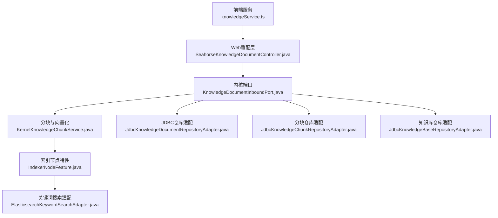
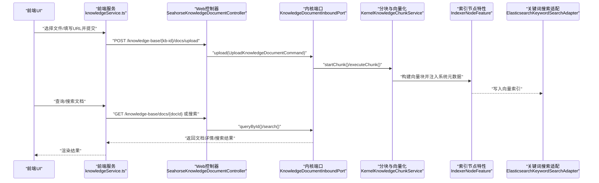
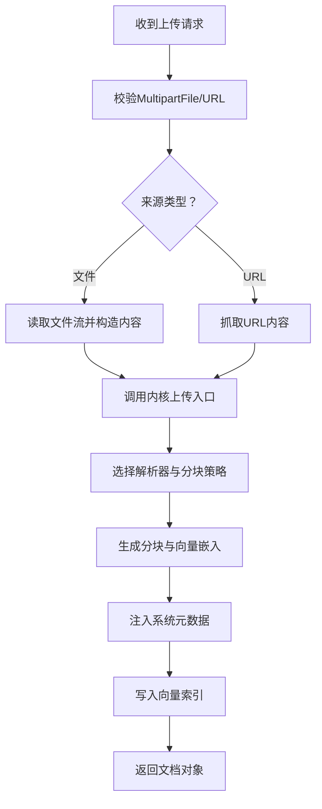
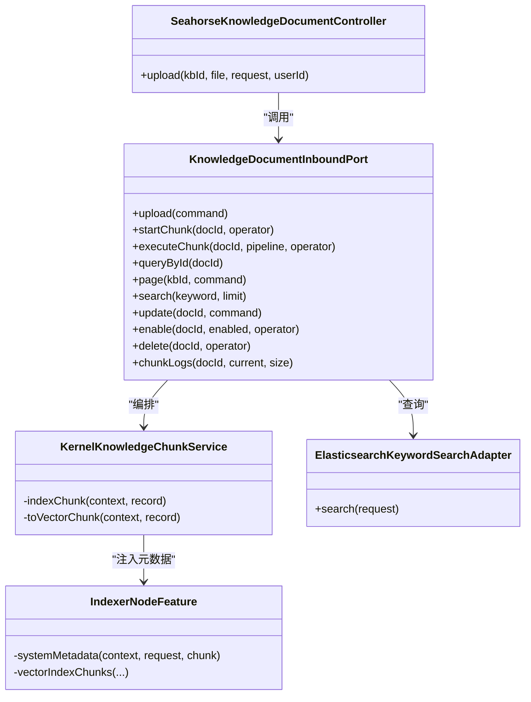

# 文档管理

<cite>
**本文引用的文件**
- [SeahorseKnowledgeDocumentController.java](file://seahorse-agent-adapter-web/src/main/java/com/miracle/ai/seahorse/agent/adapters/web/SeahorseKnowledgeDocumentController.java)
- [KnowledgeDocumentUploadRequest.java](file://seahorse-agent-adapter-web/src/main/java/com/miracle/ai/seahorse/agent/adapters/web/KnowledgeDocumentUploadRequest.java)
- [knowledgeService.ts](file://frontend/src/services/knowledgeService.ts)
- [KnowledgeDocumentInboundPort.java](file://seahorse-agent-kernel/src/main/java/com/miracle/ai/seahorse/agent/ports/inbound/knowledge/KnowledgeDocumentInboundPort.java)
- [KernelKnowledgeChunkService.java](file://seahorse-agent-kernel/src/main/java/com/miracle/ai/seahorse/agent/kernel/application/knowledge/KernelKnowledgeChunkService.java)
- [IndexerNodeFeature.java](file://seahorse-agent-kernel/src/main/java/com/miracle/ai/seahorse/agent/kernel/feature/ingestion/IndexerNodeFeature.java)
- [ElasticsearchKeywordSearchAdapter.java](file://seahorse-agent-adapter-search-elasticsearch/src/main/java/com/miracle/ai/seahorse/agent/adapters/search/elasticsearch/ElasticsearchKeywordSearchAdapter.java)
- [JdbcKnowledgeDocumentRepositoryAdapter.java](file://seahorse-agent-adapter-repository-jdbc/src/main/java/com/miracle/ai/seahorse/agent/adapters/repository/jdbc/JdbcKnowledgeDocumentRepositoryAdapter.java)
- [JdbcKnowledgeChunkRepositoryAdapter.java](file://seahorse-agent-adapter-repository-jdbc/src/main/java/com/miracle/ai/seahorse/agent/adapters/repository/jdbc/JdbcKnowledgeChunkRepositoryAdapter.java)
- [JdbcKnowledgeBaseRepositoryAdapter.java](file://seahorse-agent-adapter-repository-jdbc/src/main/java/com/miracle/ai/seahorse/agent/adapters/repository/jdbc/JdbcKnowledgeBaseRepositoryAdapter.java)
- [JdbcKnowledgeChunkRepositoryAdapterTests.java](file://seahorse-agent-adapter-repository-jdbc/src/test/java/com/miracle/ai/seahorse/agent/adapters/repository/jdbc/JdbcKnowledgeChunkRepositoryAdapterTests.java)
- [JdbcKnowledgeDocumentRepositoryAdapterTests.java](file://seahorse-agent-adapter-repository-jdbc/src/test/java/com/miracle/ai/seahorse/agent/adapters/repository/jdbc/JdbcKnowledgeDocumentRepositoryAdapterTests.java)
- [JdbcKnowledgeBaseRepositoryAdapterTests.java](file://seahorse-agent-adapter-repository-jdbc/src/test/java/com/miracle/ai/seahorse/agent/adapters/repository/jdbc/JdbcKnowledgeBaseRepositoryAdapterTests.java)
</cite>

## 目录
1. [简介](#简介)
2. [项目结构](#项目结构)
3. [核心组件](#核心组件)
4. [架构总览](#架构总览)
5. [详细组件分析](#详细组件分析)
6. [依赖关系分析](#依赖关系分析)
7. [性能考虑](#性能考虑)
8. [故障排除指南](#故障排除指南)
9. [结论](#结论)
10. [附录](#附录)

## 简介
本文件面向开发者与运维人员，系统性梳理 Seahorse Agent 的“文档管理”能力，覆盖文档上传（本地文件与URL导入）、文档状态管理（启用/禁用、调度配置）、文档检索（关键词搜索与结果限制）、以及从内容解析到向量化索引的完整处理链路。文档同时给出关键API接口定义、数据模型说明、处理流程图与时序图，并提供性能优化建议与常见问题排查方法。

## 项目结构
围绕文档管理的关键模块分布于前端服务、Web适配层、内核应用层与基础设施适配层：

- 前端服务：提供知识库与文档的增删改查、分块与启用禁用等操作的HTTP调用封装
- Web适配层：暴露REST API，接收上传请求，转发至内核端口
- 内核应用层：负责文档生命周期编排、分块与向量化索引、元数据注入
- 基础设施适配层：持久化存储（JDBC）、搜索引擎（Elasticsearch/Lucene）、对象存储（Local/S3）

图表来源
- [SeahorseKnowledgeDocumentController.java:65-120](file://seahorse-agent-adapter-web/src/main/java/com/miracle/ai/seahorse/agent/adapters/web/SeahorseKnowledgeDocumentController.java#L65-L120)
- [KnowledgeDocumentInboundPort.java:34-121](file://seahorse-agent-kernel/src/main/java/com/miracle/ai/seahorse/agent/ports/inbound/knowledge/KnowledgeDocumentInboundPort.java#L34-L121)
- [KernelKnowledgeChunkService.java:189-226](file://seahorse-agent-kernel/src/main/java/com/miracle/ai/seahorse/agent/kernel/application/knowledge/KernelKnowledgeChunkService.java#L189-L226)
- [IndexerNodeFeature.java:119-142](file://seahorse-agent-kernel/src/main/java/com/miracle/ai/seahorse/agent/kernel/feature/ingestion/IndexerNodeFeature.java#L119-L142)
- [ElasticsearchKeywordSearchAdapter.java:103-138](file://seahorse-agent-adapter-search-elasticsearch/src/main/java/com/miracle/ai/seahorse/agent/adapters/search/elasticsearch/ElasticsearchKeywordSearchAdapter.java#L103-L138)
- [JdbcKnowledgeDocumentRepositoryAdapter.java](file://seahorse-agent-adapter-repository-jdbc/src/main/java/com/miracle/ai/seahorse/agent/adapters/repository/jdbc/JdbcKnowledgeDocumentRepositoryAdapter.java)
- [JdbcKnowledgeChunkRepositoryAdapter.java](file://seahorse-agent-adapter-repository-jdbc/src/main/java/com/miracle/ai/seahorse/agent/adapters/repository/jdbc/JdbcKnowledgeChunkRepositoryAdapter.java)
- [JdbcKnowledgeBaseRepositoryAdapter.java](file://seahorse-agent-adapter-repository-jdbc/src/main/java/com/miracle/ai/seahorse/agent/adapters/repository/jdbc/JdbcKnowledgeBaseRepositoryAdapter.java)

章节来源
- [SeahorseKnowledgeDocumentController.java:65-120](file://seahorse-agent-adapter-web/src/main/java/com/miracle/ai/seahorse/agent/adapters/web/SeahorseKnowledgeDocumentController.java#L65-L120)
- [knowledgeService.ts:221-264](file://frontend/src/services/knowledgeService.ts#L221-L264)

## 核心组件
- Web控制器：接收上传、更新、启用禁用、分块触发等请求，封装响应
- 内核端口：定义文档管理的业务契约（上传、分页、搜索、更新、启用禁用、删除、分块日志）
- 分块与向量化：将文本切分为块，生成向量嵌入并写入向量索引
- 搜索适配：基于关键词在向量/倒排索引中检索，支持高亮与字段裁剪
- JDBC仓库：持久化文档、分块、知识库元数据
- 前端服务：封装HTTP调用，便于UI交互

章节来源
- [SeahorseKnowledgeDocumentController.java:65-120](file://seahorse-agent-adapter-web/src/main/java/com/miracle/ai/seahorse/agent/adapters/web/SeahorseKnowledgeDocumentController.java#L65-L120)
- [KnowledgeDocumentInboundPort.java:34-121](file://seahorse-agent-kernel/src/main/java/com/miracle/ai/seahorse/agent/ports/inbound/knowledge/KnowledgeDocumentInboundPort.java#L34-L121)
- [KernelKnowledgeChunkService.java:189-226](file://seahorse-agent-kernel/src/main/java/com/miracle/ai/seahorse/agent/kernel/application/knowledge/KernelKnowledgeChunkService.java#L189-L226)
- [ElasticsearchKeywordSearchAdapter.java:103-138](file://seahorse-agent-adapter-search-elasticsearch/src/main/java/com/miracle/ai/seahorse/agent/adapters/search/elasticsearch/ElasticsearchKeywordSearchAdapter.java#L103-L138)
- [JdbcKnowledgeDocumentRepositoryAdapter.java](file://seahorse-agent-adapter-repository-jdbc/src/main/java/com/miracle/ai/seahorse/agent/adapters/repository/jdbc/JdbcKnowledgeDocumentRepositoryAdapter.java)
- [JdbcKnowledgeChunkRepositoryAdapter.java](file://seahorse-agent-adapter-repository-jdbc/src/main/java/com/miracle/ai/seahorse/agent/adapters/repository/jdbc/JdbcKnowledgeChunkRepositoryAdapter.java)
- [JdbcKnowledgeBaseRepositoryAdapter.java](file://seahorse-agent-adapter-repository-jdbc/src/main/java/com/miracle/ai/seahorse/agent/adapters/repository/jdbc/JdbcKnowledgeBaseRepositoryAdapter.java)
- [knowledgeService.ts:221-264](file://frontend/src/services/knowledgeService.ts#L221-L264)

## 架构总览
下图展示从前端到后端的端到端文档管理流程，包括上传、解析、分块、向量化与检索路径。

图表来源
- [SeahorseKnowledgeDocumentController.java:65-120](file://seahorse-agent-adapter-web/src/main/java/com/miracle/ai/seahorse/agent/adapters/web/SeahorseKnowledgeDocumentController.java#L65-L120)
- [KnowledgeDocumentInboundPort.java:34-121](file://seahorse-agent-kernel/src/main/java/com/miracle/ai/seahorse/agent/ports/inbound/knowledge/KnowledgeDocumentInboundPort.java#L34-L121)
- [KernelKnowledgeChunkService.java:189-226](file://seahorse-agent-kernel/src/main/java/com/miracle/ai/seahorse/agent/kernel/application/knowledge/KernelKnowledgeChunkService.java#L189-L226)
- [IndexerNodeFeature.java:119-142](file://seahorse-agent-kernel/src/main/java/com/miracle/ai/seahorse/agent/kernel/feature/ingestion/IndexerNodeFeature.java#L119-L142)
- [ElasticsearchKeywordSearchAdapter.java:103-138](file://seahorse-agent-adapter-search-elasticsearch/src/main/java/com/miracle/ai/seahorse/agent/adapters/search/elasticsearch/ElasticsearchKeywordSearchAdapter.java#L103-L138)

## 详细组件分析

### 1) 文档数据模型
- 文档实体包含：标识、所属知识库、名称、来源类型与位置、启用状态、分块计数、文件信息、处理模式、分块策略与配置、流水线ID、状态、创建/更新信息等
- 分块实体包含：索引、内容、内容哈希、字符/Token计数、启用状态、元数据等

章节来源
- [knowledgeService.ts:14-36](file://frontend/src/services/knowledgeService.ts#L14-L36)
- [JdbcKnowledgeChunkRepositoryAdapter.java](file://seahorse-agent-adapter-repository-jdbc/src/main/java/com/miracle/ai/seahorse/agent/adapters/repository/jdbc/JdbcKnowledgeChunkRepositoryAdapter.java)

### 2) 文档上传与管理API
- 上传接口（文件/URL）：接收multipart表单，支持processMode与pipelineId参数；返回文档对象
- 获取/更新文档：按ID获取详情，支持更新名称、处理模式、分块策略、流水线ID、来源位置、启用禁用与定时调度
- 触发分块：手动启动分块任务
- 启用/禁用：通过PATCH切换文档可用性

章节来源
- [SeahorseKnowledgeDocumentController.java:65-120](file://seahorse-agent-adapter-web/src/main/java/com/miracle/ai/seahorse/agent/adapters/web/SeahorseKnowledgeDocumentController.java#L65-L120)
- [KnowledgeDocumentUploadRequest.java:23-43](file://seahorse-agent-adapter-web/src/main/java/com/miracle/ai/seahorse/agent/adapters/web/KnowledgeDocumentUploadRequest.java#L23-L43)
- [knowledgeService.ts:221-264](file://frontend/src/services/knowledgeService.ts#L221-L264)

### 3) 文档上传流程（文件/URL）
- 文件上传：校验MultipartFile，构造UploadFileContent，调用内核上传入口
- URL导入：通过URL导入器抓取内容，统一走上传入口
- 解析与分块：根据processMode与pipelineId选择解析器与分块策略
- 向量化与索引：生成向量嵌入，注入系统元数据（租户、集合名、知识库、文档、分块ID、索引、启用状态），写入向量索引

图表来源
- [SeahorseKnowledgeDocumentController.java:65-120](file://seahorse-agent-adapter-web/src/main/java/com/miracle/ai/seahorse/agent/adapters/web/SeahorseKnowledgeDocumentController.java#L65-L120)
- [KernelKnowledgeChunkService.java:189-226](file://seahorse-agent-kernel/src/main/java/com/miracle/ai/seahorse/agent/kernel/application/knowledge/KernelKnowledgeChunkService.java#L189-L226)
- [IndexerNodeFeature.java:119-142](file://seahorse-agent-kernel/src/main/java/com/miracle/ai/seahorse/agent/kernel/feature/ingestion/IndexerNodeFeature.java#L119-L142)

### 4) 文档状态管理
- 启用/禁用：通过内核端口切换enabled标志，影响检索与后续处理
- 定时调度：支持开启/关闭与Cron表达式配置，用于周期性刷新
- 处理进度：通过分块日志接口查看执行进度与错误

章节来源
- [knowledgeService.ts:242-264](file://frontend/src/services/knowledgeService.ts#L242-L264)
- [KnowledgeDocumentInboundPort.java:95-121](file://seahorse-agent-kernel/src/main/java/com/miracle/ai/seahorse/agent/ports/inbound/knowledge/KnowledgeDocumentInboundPort.java#L95-L121)

### 5) 文档搜索（关键词与结果限制）
- 搜索适配：构造查询体，设置topK与_source字段，支持高亮片段
- 结果字段：包含chunk_id、kb_id、doc_id、chunk_index、content、metadata、tenant_id、collection_name、ACL字段、file_type、source_type、created_at、updated_at、enabled等
- 限制策略：通过topK限制返回条目数量，结合高亮增强可读性

章节来源
- [ElasticsearchKeywordSearchAdapter.java:103-138](file://seahorse-agent-adapter-search-elasticsearch/src/main/java/com/miracle/ai/seahorse/agent/adapters/search/elasticsearch/ElasticsearchKeywordSearchAdapter.java#L103-L138)

### 6) 数据持久化与一致性
- 文档与分块：通过JDBC仓库持久化，支持分页、查询、更新、删除
- 知识库：维护知识库维度的元数据与配置
- 测试保障：配套单元测试覆盖典型场景

章节来源
- [JdbcKnowledgeDocumentRepositoryAdapter.java](file://seahorse-agent-adapter-repository-jdbc/src/main/java/com/miracle/ai/seahorse/agent/adapters/repository/jdbc/JdbcKnowledgeDocumentRepositoryAdapter.java)
- [JdbcKnowledgeChunkRepositoryAdapter.java](file://seahorse-agent-adapter-repository-jdbc/src/main/java/com/miracle/ai/seahorse/agent/adapters/repository/jdbc/JdbcKnowledgeChunkRepositoryAdapter.java)
- [JdbcKnowledgeBaseRepositoryAdapter.java](file://seahorse-agent-adapter-repository-jdbc/src/main/java/com/miracle/ai/seahorse/agent/adapters/repository/jdbc/JdbcKnowledgeBaseRepositoryAdapter.java)
- [JdbcKnowledgeChunkRepositoryAdapterTests.java](file://seahorse-agent-adapter-repository-jdbc/src/test/java/com/miracle/ai/seahorse/agent/adapters/repository/jdbc/JdbcKnowledgeChunkRepositoryAdapterTests.java)
- [JdbcKnowledgeDocumentRepositoryAdapterTests.java](file://seahorse-agent-adapter-repository-jdbc/src/test/java/com/miracle/ai/seahorse/agent/adapters/repository/jdbc/JdbcKnowledgeDocumentRepositoryAdapterTests.java)
- [JdbcKnowledgeBaseRepositoryAdapterTests.java](file://seahorse-agent-adapter-repository-jdbc/src/test/java/com/miracle/ai/seahorse/agent/adapters/repository/jdbc/JdbcKnowledgeBaseRepositoryAdapterTests.java)

## 依赖关系分析
- 控制器依赖内核端口，端口定义了稳定的业务契约
- 分块与向量化依赖向量索引端口，索引节点特性负责系统元数据注入
- 搜索适配依赖底层搜索引擎实现
- 仓库适配提供持久化能力，支撑文档全生命周期

图表来源
- [SeahorseKnowledgeDocumentController.java:65-120](file://seahorse-agent-adapter-web/src/main/java/com/miracle/ai/seahorse/agent/adapters/web/SeahorseKnowledgeDocumentController.java#L65-L120)
- [KnowledgeDocumentInboundPort.java:34-121](file://seahorse-agent-kernel/src/main/java/com/miracle/ai/seahorse/agent/ports/inbound/knowledge/KnowledgeDocumentInboundPort.java#L34-L121)
- [KernelKnowledgeChunkService.java:189-226](file://seahorse-agent-kernel/src/main/java/com/miracle/ai/seahorse/agent/kernel/application/knowledge/KernelKnowledgeChunkService.java#L189-L226)
- [IndexerNodeFeature.java:119-142](file://seahorse-agent-kernel/src/main/java/com/miracle/ai/seahorse/agent/kernel/feature/ingestion/IndexerNodeFeature.java#L119-L142)
- [ElasticsearchKeywordSearchAdapter.java:103-138](file://seahorse-agent-adapter-search-elasticsearch/src/main/java/com/miracle/ai/seahorse/agent/adapters/search/elasticsearch/ElasticsearchKeywordSearchAdapter.java#L103-L138)

## 性能考虑
- 并发与队列：分块与向量化采用消息队列异步处理，避免阻塞请求线程
- 批量写入：向量索引写入支持批量提交，降低网络与IO开销
- 分片与副本：向量存储与搜索引擎按租户/知识库维度进行集合隔离，提升查询效率
- 缓存与预热：热点文档分块内容可缓存，减少重复解析
- 资源限制：通过限流与并发信号量控制大规模上传/分块的资源占用
- 检索优化：合理设置topK与高亮片段数量，平衡召回与延迟

## 故障排除指南
- 上传失败
  - 检查文件大小与类型是否受限
  - 确认processMode与pipelineId合法
  - 查看分块日志定位具体失败步骤
- 分块异常
  - 核对解析器与分块策略配置
  - 检查向量模型可用性与嵌入长度
- 搜索无结果
  - 确认文档已启用且已完成向量化
  - 检查索引字段映射与高亮配置
- 权限与ACL
  - 校验ACL字段与租户隔离配置
- 数据不一致
  - 对照JDBC仓库与向量索引状态，必要时触发补偿重建

章节来源
- [knowledgeService.ts:242-264](file://frontend/src/services/knowledgeService.ts#L242-L264)
- [KernelKnowledgeChunkService.java:189-226](file://seahorse-agent-kernel/src/main/java/com/miracle/ai/seahorse/agent/kernel/application/knowledge/KernelKnowledgeChunkService.java#L189-L226)
- [ElasticsearchKeywordSearchAdapter.java:103-138](file://seahorse-agent-adapter-search-elasticsearch/src/main/java/com/miracle/ai/seahorse/agent/adapters/search/elasticsearch/ElasticsearchKeywordSearchAdapter.java#L103-L138)

## 结论
本文档系统化地梳理了Seahorse Agent的文档管理能力，从API契约、数据模型、处理流程到搜索与持久化，提供了端到端的技术视图。通过明确的分层架构与适配器模式，系统实现了高扩展性的文档入库与检索能力。建议在生产环境中结合并发控制、批量写入与缓存策略，持续优化吞吐与延迟表现。

## 附录
- API清单（以路径与方法表示）
  - 上传文档：POST /knowledge-base/{kb-id}/docs/upload
  - 获取文档：GET /knowledge-base/docs/{docId}
  - 更新文档：PUT /knowledge-base/docs/{docId}
  - 触发分块：POST /knowledge-base/docs/{docId}/chunk
  - 启用/禁用：PATCH /knowledge-base/docs/{docId}/enable
- 关键参数
  - processMode：处理模式
  - pipelineId：入库流水线ID
  - chunkStrategy/chunkConfig：分块策略与配置
  - scheduleEnabled/scheduleCron：定时调度开关与表达式
  - topK：搜索结果数量限制