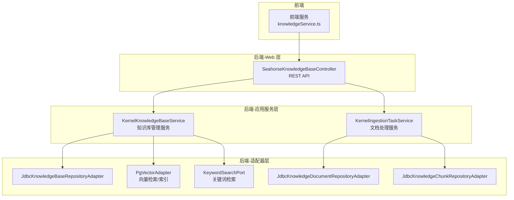
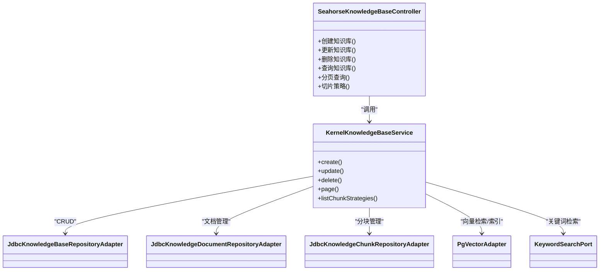
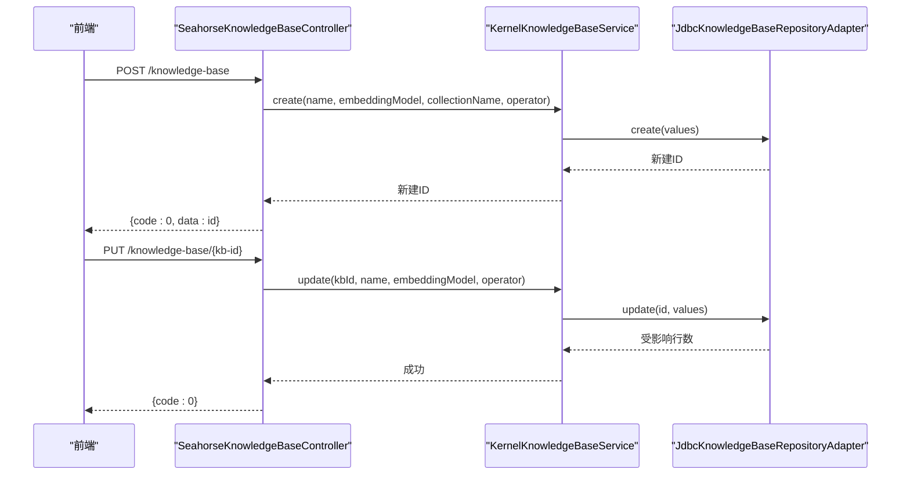
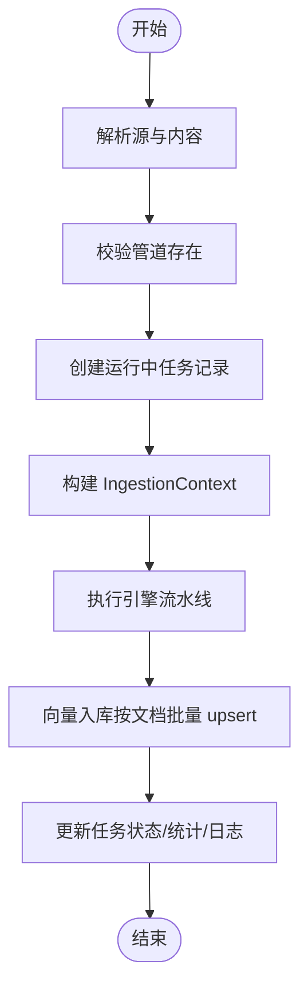
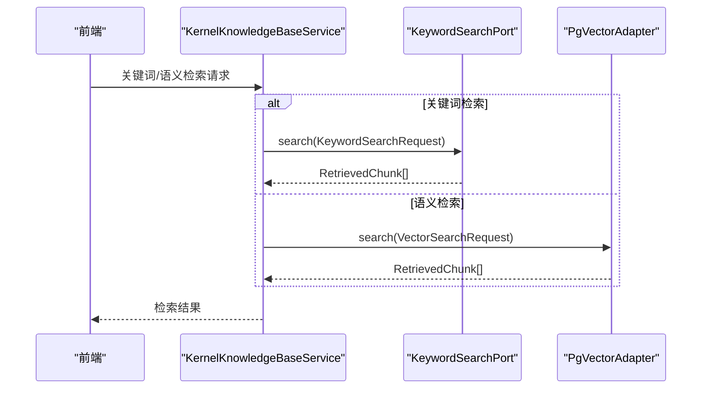
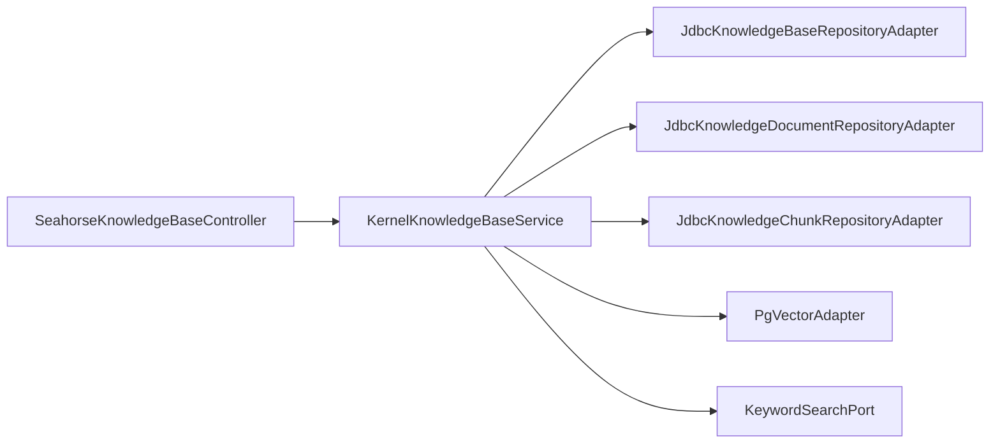

# 知识库服务

<cite>
**本文引用的文件**
- [SeahorseKnowledgeBaseController.java](file://seahorse-agent-adapter-web/src/main/java/com/miracle/ai/seahorse/agent/adapters/web/SeahorseKnowledgeBaseController.java)
- [KernelKnowledgeBaseService.java](file://seahorse-agent-kernel/src/main/java/com/miracle/ai/seahorse/agent/kernel/application/knowledge/KernelKnowledgeBaseService.java)
- [JdbcKnowledgeBaseRepositoryAdapter.java](file://seahorse-agent-adapter-repository-jdbc/src/main/java/com/miracle/ai/seahorse/agent/adapters/repository/jdbc/JdbcKnowledgeBaseRepositoryAdapter.java)
- [JdbcKnowledgeDocumentRepositoryAdapter.java](file://seahorse-agent-adapter-repository-jdbc/src/main/java/com/miracle/ai/seahorse/agent/adapters/repository/jdbc/JdbcKnowledgeDocumentRepositoryAdapter.java)
- [JdbcKnowledgeChunkRepositoryAdapter.java](file://seahorse-agent-adapter-repository-jdbc/src/main/java/com/miracle/ai/seahorse/agent/adapters/repository/jdbc/JdbcKnowledgeChunkRepositoryAdapter.java)
- [KernelIngestionTaskService.java](file://seahorse-agent-kernel/src/main/java/com/miracle/ai/seahorse/agent/kernel/application/ingestion/KernelIngestionTaskService.java)
- [PgVectorAdapter.java](file://seahorse-agent-adapter-vector-pgvector/src/main/java/com/miracle/ai/seahorse/agent/adapters/vector/pgvector/PgVectorAdapter.java)
- [KeywordSearchPort.java](file://seahorse-agent-kernel/src/main/java/com/miracle/ai/seahorse/agent/ports/outbound/keyword/KeywordSearchPort.java)
- [KeywordSearchRequest.java](file://seahorse-agent-kernel/src/main/java/com/miracle/ai/seahorse/agent/ports/outbound/keyword/KeywordSearchRequest.java)
- [knowledgeService.ts](file://frontend/src/services/knowledgeService.ts)
- [Web 适配器.md](file://docs/zh/content/后端系统/适配器模块/Web 适配器.md)
- [核心内核.md](file://docs/zh/content/后端系统/核心内核/核心内核.md)
- [应用服务层.md](file://docs/zh/content/后端系统/核心内核/应用服务层/应用服务层.md)
- [向量出站端口.md](file://docs/zh/content/后端系统/核心内核/端口接口/出站端口/向量出站端口.md)
- [数据库适配器.md](file://docs/zh/content/后端系统/适配器模块/数据库适配器.md)
- [应用监控.md](file://docs/zh/content/监控运维/应用监控.md)
- [seahorse_init.sql](file://resources/database/seahorse_init.sql)
</cite>

## 目录
1. [简介](#简介)
2. [项目结构](#项目结构)
3. [核心组件](#核心组件)
4. [架构总览](#架构总览)
5. [详细组件分析](#详细组件分析)
6. [依赖分析](#依赖分析)
7. [性能考虑](#性能考虑)
8. [故障排查指南](#故障排查指南)
9. [结论](#结论)
10. [附录](#附录)

## 简介
本文件为 Seahorse Agent 知识库服务的技术文档，聚焦知识库管理与文档检索的完整实现。内容涵盖：
- 知识库 CRUD 与分页查询 API 的实现与调用方式
- 文档上传与处理流程：文件上传、格式检测、内容解析、分块与向量化
- 检索功能：关键词检索、语义检索与结果排序
- 文档管理：文档列表、分块管理、元数据编辑与质量评估
- 性能优化：批量操作、缓存与并发控制策略
- 开发者指南：API 使用与最佳实践

## 项目结构
知识库服务涉及三层：Web 控制器层、核心应用服务层、适配器与基础设施层。前端通过服务接口对接后端知识库 API。

**图表来源**
- [SeahorseKnowledgeBaseController.java:56-106](file://seahorse-agent-adapter-web/src/main/java/com/miracle/ai/seahorse/agent/adapters/web/SeahorseKnowledgeBaseController.java#L56-L106)
- [KernelKnowledgeBaseService.java:40-141](file://seahorse-agent-kernel/src/main/java/com/miracle/ai/seahorse/agent/kernel/application/knowledge/KernelKnowledgeBaseService.java#L40-L141)
- [KernelIngestionTaskService.java:53-407](file://seahorse-agent-kernel/src/main/java/com/miracle/ai/seahorse/agent/kernel/application/ingestion/KernelIngestionTaskService.java#L53-L407)
- [JdbcKnowledgeBaseRepositoryAdapter.java:96-168](file://seahorse-agent-adapter-repository-jdbc/src/main/java/com/miracle/ai/seahorse/agent/adapters/repository/jdbc/JdbcKnowledgeBaseRepositoryAdapter.java#L96-L168)
- [JdbcKnowledgeDocumentRepositoryAdapter.java:51-123](file://seahorse-agent-adapter-repository-jdbc/src/main/java/com/miracle/ai/seahorse/agent/adapters/repository/jdbc/JdbcKnowledgeDocumentRepositoryAdapter.java#L51-L123)
- [JdbcKnowledgeChunkRepositoryAdapter.java:1-200](file://seahorse-agent-adapter-repository-jdbc/src/main/java/com/miracle/ai/seahorse/agent/adapters/repository/jdbc/JdbcKnowledgeChunkRepositoryAdapter.java#L1-L200)
- [PgVectorAdapter.java:76-365](file://seahorse-agent-adapter-vector-pgvector/src/main/java/com/miracle/ai/seahorse/agent/adapters/vector/pgvector/PgVectorAdapter.java#L76-L365)
- [KeywordSearchPort.java:1-19](file://seahorse-agent-kernel/src/main/java/com/miracle/ai/seahorse/agent/ports/outbound/keyword/KeywordSearchPort.java#L1-L19)

**章节来源**
- [Web 适配器.md:175-191](file://docs/zh/content/后端系统/适配器模块/Web 适配器.md#L175-L191)
- [核心内核.md:217-230](file://docs/zh/content/后端系统/核心内核/核心内核.md#L217-L230)
- [应用服务层.md:155-173](file://docs/zh/content/后端系统/核心内核/应用服务层/应用服务层.md#L155-L173)

## 核心组件
- Web 控制器：提供知识库 CRUD、分页查询、切片策略查询等 REST API。
- 应用服务：负责知识库生命周期管理、文档处理任务编排与执行。
- 仓库适配器：基于 JDBC 的知识库、文档、分块数据持久化。
- 向量适配器：基于 pgvector 的向量检索、索引与集合管理。
- 关键词检索端口：抽象关键词/BM25 检索，适配多种后端实现。

**章节来源**
- [SeahorseKnowledgeBaseController.java:56-106](file://seahorse-agent-adapter-web/src/main/java/com/miracle/ai/seahorse/agent/adapters/web/SeahorseKnowledgeBaseController.java#L56-L106)
- [KernelKnowledgeBaseService.java:40-141](file://seahorse-agent-kernel/src/main/java/com/miracle/ai/seahorse/agent/kernel/application/knowledge/KernelKnowledgeBaseService.java#L40-L141)
- [JdbcKnowledgeBaseRepositoryAdapter.java:96-168](file://seahorse-agent-adapter-repository-jdbc/src/main/java/com/miracle/ai/seahorse/agent/adapters/repository/jdbc/JdbcKnowledgeBaseRepositoryAdapter.java#L96-L168)
- [PgVectorAdapter.java:76-365](file://seahorse-agent-adapter-vector-pgvector/src/main/java/com/miracle/ai/seahorse/agent/adapters/vector/pgvector/PgVectorAdapter.java#L76-L365)
- [KeywordSearchPort.java:1-19](file://seahorse-agent-kernel/src/main/java/com/miracle/ai/seahorse/agent/ports/outbound/keyword/KeywordSearchPort.java#L1-L19)

## 架构总览
知识库服务采用分层架构与端口适配器模式，实现关注点分离与可替换性：
- 控制器层：暴露统一 API，参数校验与返回结构标准化
- 应用服务层：业务编排与规则校验（如嵌入模型变更限制、删除前置校验）
- 适配器层：对接数据库、对象存储、向量库与搜索引擎
- 前端服务：类型化数据模型与 API 调用封装

**图表来源**
- [SeahorseKnowledgeBaseController.java:56-106](file://seahorse-agent-adapter-web/src/main/java/com/miracle/ai/seahorse/agent/adapters/web/SeahorseKnowledgeBaseController.java#L56-L106)
- [KernelKnowledgeBaseService.java:40-141](file://seahorse-agent-kernel/src/main/java/com/miracle/ai/seahorse/agent/kernel/application/knowledge/KernelKnowledgeBaseService.java#L40-L141)
- [JdbcKnowledgeBaseRepositoryAdapter.java:96-168](file://seahorse-agent-adapter-repository-jdbc/src/main/java/com/miracle/ai/seahorse/agent/adapters/repository/jdbc/JdbcKnowledgeBaseRepositoryAdapter.java#L96-L168)
- [JdbcKnowledgeDocumentRepositoryAdapter.java:51-123](file://seahorse-agent-adapter-repository-jdbc/src/main/java/com/miracle/ai/seahorse/agent/adapters/repository/jdbc/JdbcKnowledgeDocumentRepositoryAdapter.java#L51-L123)
- [JdbcKnowledgeChunkRepositoryAdapter.java:1-200](file://seahorse-agent-adapter-repository-jdbc/src/main/java/com/miracle/ai/seahorse/agent/adapters/repository/jdbc/JdbcKnowledgeChunkRepositoryAdapter.java#L1-L200)
- [PgVectorAdapter.java:76-365](file://seahorse-agent-adapter-vector-pgvector/src/main/java/com/miracle/ai/seahorse/agent/adapters/vector/pgvector/PgVectorAdapter.java#L76-L365)
- [KeywordSearchPort.java:1-19](file://seahorse-agent-kernel/src/main/java/com/miracle/ai/seahorse/agent/ports/outbound/keyword/KeywordSearchPort.java#L1-L19)

## 详细组件分析

### 知识库管理 API 与控制器
- 创建知识库：接收名称、嵌入模型、集合名，返回新建知识库 ID
- 更新知识库：支持名称与嵌入模型变更（存在向量化文档时禁止变更嵌入模型）
- 删除知识库：按 ID 删除，前置校验（存在文档则拒绝）
- 查询详情：按 ID 查询
- 分页查询：支持页码、大小与名称过滤
- 切片策略查询：返回可用切片策略列表
- 操作者标识：从请求头 X-User-Id 获取操作人

**图表来源**
- [SeahorseKnowledgeBaseController.java:56-106](file://seahorse-agent-adapter-web/src/main/java/com/miracle/ai/seahorse/agent/adapters/web/SeahorseKnowledgeBaseController.java#L56-L106)
- [KernelKnowledgeBaseService.java:40-141](file://seahorse-agent-kernel/src/main/java/com/miracle/ai/seahorse/agent/kernel/application/knowledge/KernelKnowledgeBaseService.java#L40-L141)
- [JdbcKnowledgeBaseRepositoryAdapter.java:96-168](file://seahorse-agent-adapter-repository-jdbc/src/main/java/com/miracle/ai/seahorse/agent/adapters/repository/jdbc/JdbcKnowledgeBaseRepositoryAdapter.java#L96-L168)

**章节来源**
- [SeahorseKnowledgeBaseController.java:56-106](file://seahorse-agent-adapter-web/src/main/java/com/miracle/ai/seahorse/agent/adapters/web/SeahorseKnowledgeBaseController.java#L56-L106)
- [Web 适配器.md:175-191](file://docs/zh/content/后端系统/适配器模块/Web 适配器.md#L175-L191)
- [核心内核.md:217-230](file://docs/zh/content/后端系统/核心内核/核心内核.md#L217-L230)

### 文档处理与向量化流程
- 任务创建：解析源与内容，校验管道存在，创建运行中任务记录
- 上下文构建：包含 taskId、pipelineId、原始字节、mimeType、初始元数据、向量空间标识等
- 执行引擎：按拓扑顺序执行节点，记录日志与结果
- 向量入库：将分块内容写入向量集合，支持按文档批量 upsert
- 任务状态：成功/失败/运行中，支持分页查询与节点明细查看

**图表来源**
- [KernelIngestionTaskService.java:53-407](file://seahorse-agent-kernel/src/main/java/com/miracle/ai/seahorse/agent/kernel/application/ingestion/KernelIngestionTaskService.java#L53-L407)
- [PgVectorAdapter.java:76-365](file://seahorse-agent-adapter-vector-pgvector/src/main/java/com/miracle/ai/seahorse/agent/adapters/vector/pgvector/PgVectorAdapter.java#L76-L365)

**章节来源**
- [KernelIngestionTaskService.java:53-407](file://seahorse-agent-kernel/src/main/java/com/miracle/ai/seahorse/agent/kernel/application/ingestion/KernelIngestionTaskService.java#L53-L407)
- [向量出站端口.md:173-204](file://docs/zh/content/后端系统/核心内核/端口接口/出站端口/向量出站端口.md#L173-L204)

### 检索功能 API 与实现
- 关键词检索：支持 topK、过滤条件与检索选项，返回检索块
- 语义检索：基于向量相似度，支持集合管理与索引
- 结果排序：按重要性分数与更新时间排序

**图表来源**
- [KeywordSearchPort.java:1-19](file://seahorse-agent-kernel/src/main/java/com/miracle/ai/seahorse/agent/ports/outbound/keyword/KeywordSearchPort.java#L1-L19)
- [KeywordSearchRequest.java:1-30](file://seahorse-agent-kernel/src/main/java/com/miracle/ai/seahorse/agent/ports/outbound/keyword/KeywordSearchRequest.java#L1-L30)
- [PgVectorAdapter.java:76-365](file://seahorse-agent-adapter-vector-pgvector/src/main/java/com/miracle/ai/seahorse/agent/adapters/vector/pgvector/PgVectorAdapter.java#L76-L365)

**章节来源**
- [KeywordSearchPort.java:1-19](file://seahorse-agent-kernel/src/main/java/com/miracle/ai/seahorse/agent/ports/outbound/keyword/KeywordSearchPort.java#L1-L19)
- [KeywordSearchRequest.java:1-30](file://seahorse-agent-kernel/src/main/java/com/miracle/ai/seahorse/agent/ports/outbound/keyword/KeywordSearchRequest.java#L1-L30)
- [向量出站端口.md:173-204](file://docs/zh/content/后端系统/核心内核/端口接口/出站端口/向量出站端口.md#L173-L204)

### 文档管理与质量评估
- 文档列表：支持状态（待处理/运行中/成功/失败）与分页
- 分块管理：按文档 ID 查询分块，支持启用/禁用与统计
- 元数据编辑：支持编辑文档元数据与处理配置
- 质量评估：提供元数据质量报告与对比差值，支持阈值与可视化

**章节来源**
- [JdbcKnowledgeDocumentRepositoryAdapter.java:51-123](file://seahorse-agent-adapter-repository-jdbc/src/main/java/com/miracle/ai/seahorse/agent/adapters/repository/jdbc/JdbcKnowledgeDocumentRepositoryAdapter.java#L51-L123)
- [JdbcKnowledgeChunkRepositoryAdapter.java:1-200](file://seahorse-agent-adapter-repository-jdbc/src/main/java/com/miracle/ai/seahorse/agent/adapters/repository/jdbc/JdbcKnowledgeChunkRepositoryAdapter.java#L1-L200)
- [MetadataQualityReport.java:36-63](file://seahorse-agent-kernel/src/main/java/com/miracle/ai/seahorse/agent/ports/outbound/metadata/MetadataQualityReport.java#L36-L63)

## 依赖分析
- 控制器依赖应用服务，应用服务依赖仓库与适配器端口
- 知识库服务同时依赖对象存储与向量集合管理端口，确保基础设施就绪
- 检索模块通过端口抽象解耦关键词与向量检索实现

**图表来源**
- [SeahorseKnowledgeBaseController.java:56-106](file://seahorse-agent-adapter-web/src/main/java/com/miracle/ai/seahorse/agent/adapters/web/SeahorseKnowledgeBaseController.java#L56-L106)
- [KernelKnowledgeBaseService.java:40-141](file://seahorse-agent-kernel/src/main/java/com/miracle/ai/seahorse/agent/kernel/application/knowledge/KernelKnowledgeBaseService.java#L40-L141)
- [JdbcKnowledgeBaseRepositoryAdapter.java:96-168](file://seahorse-agent-adapter-repository-jdbc/src/main/java/com/miracle/ai/seahorse/agent/adapters/repository/jdbc/JdbcKnowledgeBaseRepositoryAdapter.java#L96-L168)
- [JdbcKnowledgeDocumentRepositoryAdapter.java:51-123](file://seahorse-agent-adapter-repository-jdbc/src/main/java/com/miracle/ai/seahorse/agent/adapters/repository/jdbc/JdbcKnowledgeDocumentRepositoryAdapter.java#L51-L123)
- [JdbcKnowledgeChunkRepositoryAdapter.java:1-200](file://seahorse-agent-adapter-repository-jdbc/src/main/java/com/miracle/ai/seahorse/agent/adapters/repository/jdbc/JdbcKnowledgeChunkRepositoryAdapter.java#L1-L200)
- [PgVectorAdapter.java:76-365](file://seahorse-agent-adapter-vector-pgvector/src/main/java/com/miracle/ai/seahorse/agent/adapters/vector/pgvector/PgVectorAdapter.java#L76-L365)
- [KeywordSearchPort.java:1-19](file://seahorse-agent-kernel/src/main/java/com/miracle/ai/seahorse/agent/ports/outbound/keyword/KeywordSearchPort.java#L1-L19)

**章节来源**
- [数据库适配器.md:62-427](file://docs/zh/content/后端系统/适配器模块/数据库适配器.md#L62-L427)

## 性能考虑
- 批量操作：向量索引使用批量 upsert，减少网络往返
- 索引优化：pgvector 使用 HNSW 索引与余弦距离，设置 ef_search 提升召回
- 并发控制：应用服务层通过任务状态机与数据库事务保证一致性
- 缓存机制：可结合本地/Redis 缓存热点知识库元数据与切片策略
- 监控埋点：建议对创建/更新/删除等关键操作分别建立观测指标，标注 kbId、operator、embeddingModel 等标签

**章节来源**
- [向量出站端口.md:173-204](file://docs/zh/content/后端系统/核心内核/端口接口/出站端口/向量出站端口.md#L173-L204)
- [应用监控.md:255-263](file://docs/zh/content/监控运维/应用监控.md#L255-L263)

## 故障排查指南
- 连接超时：检查数据库连接池配置与慢查询
- 内存溢出：优化大对象序列化与批量操作内存使用
- 事务冲突：检查长事务与锁竞争 SQL，调整隔离级别
- 向量检索异常：确认集合存在、维度匹配与 ef_search 设置
- 文档处理失败：查看任务节点日志与错误消息，定位具体节点

**章节来源**
- [数据库适配器.md:386-403](file://docs/zh/content/后端系统/适配器模块/数据库适配器.md#L386-L403)
- [KernelIngestionTaskService.java:144-177](file://seahorse-agent-kernel/src/main/java/com/miracle/ai/seahorse/agent/kernel/application/ingestion/KernelIngestionTaskService.java#L144-L177)

## 结论
知识库服务通过清晰的分层与端口抽象，实现了从 API 到数据持久化与向量检索的完整闭环。应用服务层承担业务规则与编排职责，适配器层提供可替换的基础设施实现。建议在生产环境配合缓存、限流与可观测性策略，持续优化分块与向量参数以获得最佳检索效果。

## 附录

### API 使用指南与最佳实践
- API 统一返回结构：code/data 字段，成功时 code=0
- 操作者标识：从请求头 X-User-Id 获取
- 嵌入模型变更限制：已有向量化文档时禁止修改，确保检索一致性
- 切片策略：建议在 UI 层提供策略预览，辅助用户选择
- 前端类型：使用前端服务接口提供的类型化模型进行调用

**章节来源**
- [Web 适配器.md:175-191](file://docs/zh/content/后端系统/适配器模块/Web 适配器.md#L175-L191)
- [knowledgeService.ts:1-55](file://frontend/src/services/knowledgeService.ts#L1-L55)

### 数据库与表结构参考
- 知识库、文档、分块与向量存储表结构与索引
- 建议在部署前执行初始化脚本，确保表结构与索引存在

**章节来源**
- [seahorse_init.sql:379-411](file://resources/database/seahorse_init.sql#L379-L411)