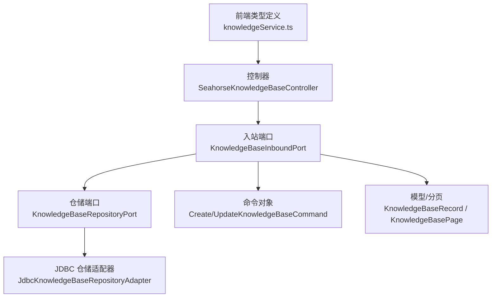
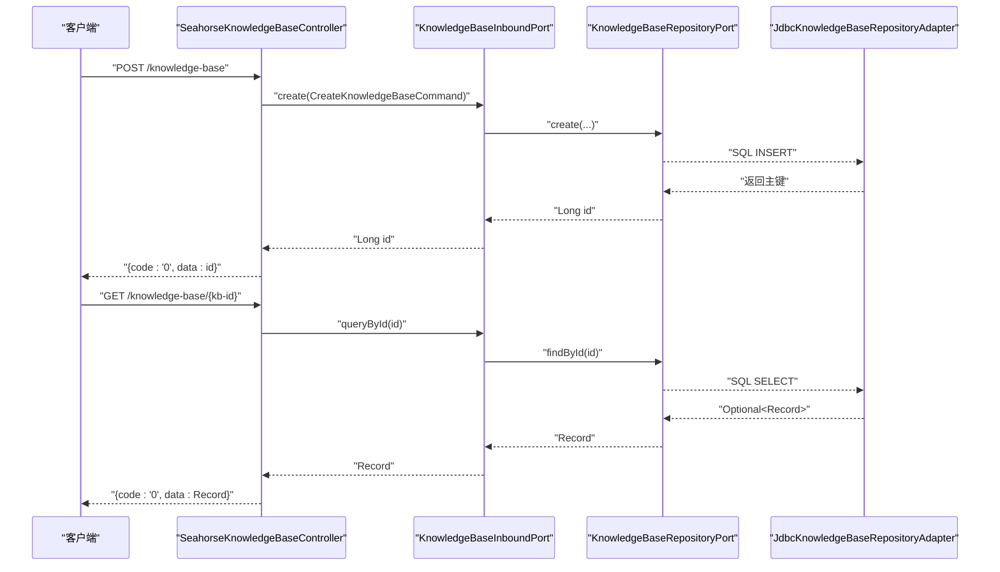
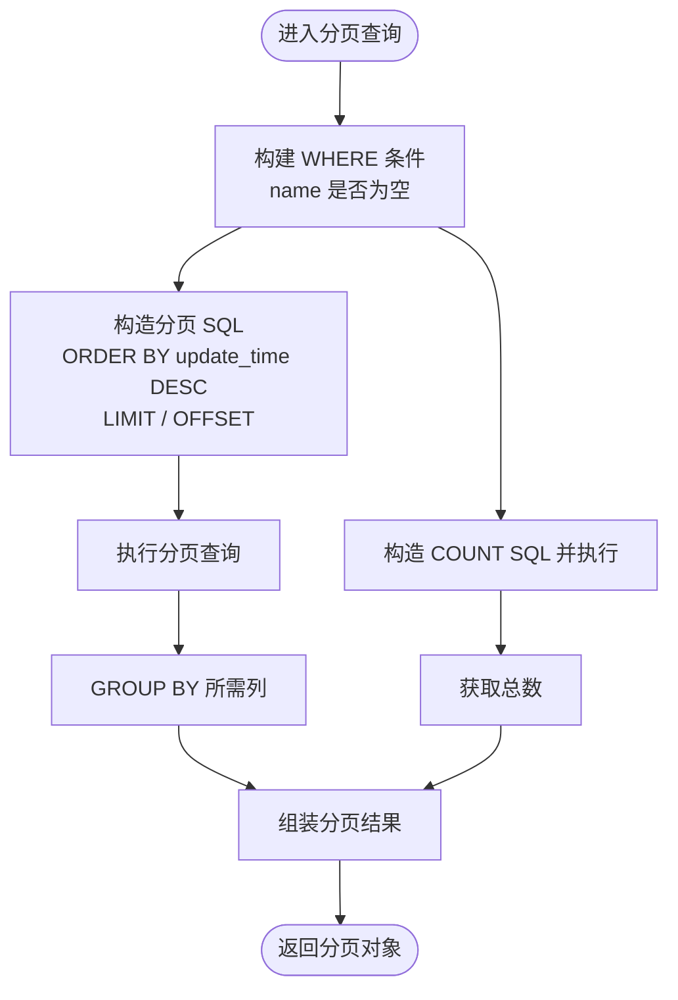
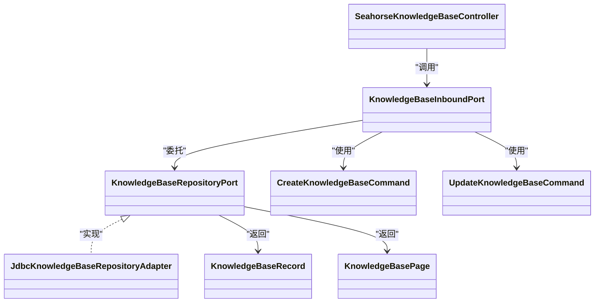

# 知识库管理

<cite>
**本文引用的文件**
- [SeahorseKnowledgeBaseController.java](file://seahorse-agent-adapter-web/src/main/java/com/miracle/ai/seahorse/agent/adapters/web/SeahorseKnowledgeBaseController.java)
- [KnowledgeBaseInboundPort.java](file://seahorse-agent-kernel/src/main/java/com/miracle/ai/seahorse/agent/ports/inbound/knowledge/KnowledgeBaseInboundPort.java)
- [CreateKnowledgeBaseCommand.java](file://seahorse-agent-kernel/src/main/java/com/miracle/ai/seahorse/agent/ports/inbound/knowledge/CreateKnowledgeBaseCommand.java)
- [UpdateKnowledgeBaseCommand.java](file://seahorse-agent-kernel/src/main/java/com/miracle/ai/seahorse/agent/ports/inbound/knowledge/UpdateKnowledgeBaseCommand.java)
- [KnowledgeBaseRepositoryPort.java](file://seahorse-agent-kernel/src/main/java/com/miracle/ai/seahorse/agent/ports/outbound/knowledge/KnowledgeBaseRepositoryPort.java)
- [JdbcKnowledgeBaseRepositoryAdapter.java](file://seahorse-agent-adapter-repository-jdbc/src/main/java/com/miracle/ai/seahorse/agent/adapters/repository/jdbc/JdbcKnowledgeBaseRepositoryAdapter.java)
- [KnowledgeBasePage.java](file://seahorse-agent-kernel/src/main/java/com/miracle/ai/seahorse/agent/ports/outbound/knowledge/KnowledgeBasePage.java)
- [KnowledgeBaseRecord.java](file://seahorse-agent-kernel/src/main/java/com/miracle/ai/seahorse/agent/ports/outbound/knowledge/KnowledgeBaseRecord.java)
- [knowledgeService.ts](file://frontend/src/services/knowledgeService.ts)
- [SeahorseKnowledgeBaseControllerTests.java](file://seahorse-agent-adapter-web/src/test/java/com/miracle/ai/seahorse/agent/adapters/web/SeahorseKnowledgeBaseControllerTests.java)
</cite>

## 目录
1. [简介](#简介)
2. [项目结构](#项目结构)
3. [核心组件](#核心组件)
4. [架构总览](#架构总览)
5. [详细组件分析](#详细组件分析)
6. [依赖关系分析](#依赖关系分析)
7. [性能考量](#性能考量)
8. [故障排查指南](#故障排查指南)
9. [结论](#结论)
10. [附录：API 调用示例与最佳实践](#附录api-调用示例与最佳实践)

## 简介
本文件面向开发者与产品人员，系统化梳理 Seahorse Agent 的“知识库管理”能力，覆盖知识库 CRUD 操作的 API 实现、数据模型定义、分页查询机制、更新操作（重命名与配置修改）、最佳实践与错误处理指引。读者将获得从前端到后端、从接口到数据库的完整视图，并通过图示与路径引用快速定位实现细节。

## 项目结构
围绕知识库管理的关键模块分布于以下层次：
- 控制器层：对外暴露 REST API，负责请求解析与响应封装
- 应用服务端口：定义知识库管理的业务契约（创建、更新、删除、分页、查询）
- 仓储适配器：基于 JDBC 的持久化实现，包含分页查询与记录更新/删除
- 前端类型：定义知识库、文档、分片等数据模型，便于前后端协同

图表来源
- [SeahorseKnowledgeBaseController.java:59-101](file://seahorse-agent-adapter-web/src/main/java/com/miracle/ai/seahorse/agent/adapters/web/SeahorseKnowledgeBaseController.java#L59-L101)
- [KnowledgeBaseInboundPort.java:29-42](file://seahorse-agent-kernel/src/main/java/com/miracle/ai/seahorse/agent/ports/inbound/knowledge/KnowledgeBaseInboundPort.java#L29-L42)
- [KnowledgeBaseRepositoryPort.java:25-42](file://seahorse-agent-kernel/src/main/java/com/miracle/ai/seahorse/agent/ports/outbound/knowledge/KnowledgeBaseRepositoryPort.java#L25-L42)
- [JdbcKnowledgeBaseRepositoryAdapter.java:174-209](file://seahorse-agent-adapter-repository-jdbc/src/main/java/com/miracle/ai/seahorse/agent/adapters/repository/jdbc/JdbcKnowledgeBaseRepositoryAdapter.java#L174-L209)
- [CreateKnowledgeBaseCommand.java](file://seahorse-agent-kernel/src/main/java/com/miracle/ai/seahorse/agent/ports/inbound/knowledge/CreateKnowledgeBaseCommand.java)
- [UpdateKnowledgeBaseCommand.java](file://seahorse-agent-kernel/src/main/java/com/miracle/ai/seahorse/agent/ports/inbound/knowledge/UpdateKnowledgeBaseCommand.java)
- [KnowledgeBaseRecord.java](file://seahorse-agent-kernel/src/main/java/com/miracle/ai/seahorse/agent/ports/outbound/knowledge/KnowledgeBaseRecord.java)
- [KnowledgeBasePage.java](file://seahorse-agent-kernel/src/main/java/com/miracle/ai/seahorse/agent/ports/outbound/knowledge/KnowledgeBasePage.java)
- [knowledgeService.ts:3-12](file://frontend/src/services/knowledgeService.ts#L3-L12)

章节来源
- [SeahorseKnowledgeBaseController.java:59-101](file://seahorse-agent-adapter-web/src/main/java/com/miracle/ai/seahorse/agent/adapters/web/SeahorseKnowledgeBaseController.java#L59-L101)
- [knowledgeService.ts:3-12](file://frontend/src/services/knowledgeService.ts#L3-L12)

## 核心组件
- 控制器：提供知识库的创建、更新、删除、按 ID 查询、分页查询与分片策略列表查询接口
- 入站端口：声明知识库管理的业务契约，屏蔽具体实现
- 仓储端口：抽象知识库的持久化能力，包括创建、查询、分页、更新、删除
- JDBC 适配器：实现分页查询、总数统计、记录更新与删除
- 命令对象：承载创建/更新请求的参数载体
- 模型与分页：定义知识库记录与分页返回结构

章节来源
- [SeahorseKnowledgeBaseController.java:59-101](file://seahorse-agent-adapter-web/src/main/java/com/miracle/ai/seahorse/agent/adapters/web/SeahorseKnowledgeBaseController.java#L59-L101)
- [KnowledgeBaseInboundPort.java:29-42](file://seahorse-agent-kernel/src/main/java/com/miracle/ai/seahorse/agent/ports/inbound/knowledge/KnowledgeBaseInboundPort.java#L29-L42)
- [KnowledgeBaseRepositoryPort.java:25-42](file://seahorse-agent-kernel/src/main/java/com/miracle/ai/seahorse/agent/ports/outbound/knowledge/KnowledgeBaseRepositoryPort.java#L25-L42)
- [JdbcKnowledgeBaseRepositoryAdapter.java:174-209](file://seahorse-agent-adapter-repository-jdbc/src/main/java/com/miracle/ai/seahorse/agent/adapters/repository/jdbc/JdbcKnowledgeBaseRepositoryAdapter.java#L174-L209)
- [CreateKnowledgeBaseCommand.java](file://seahorse-agent-kernel/src/main/java/com/miracle/ai/seahorse/agent/ports/inbound/knowledge/CreateKnowledgeBaseCommand.java)
- [UpdateKnowledgeBaseCommand.java](file://seahorse-agent-kernel/src/main/java/com/miracle/ai/seahorse/agent/ports/inbound/knowledge/UpdateKnowledgeBaseCommand.java)
- [KnowledgeBaseRecord.java](file://seahorse-agent-kernel/src/main/java/com/miracle/ai/seahorse/agent/ports/outbound/knowledge/KnowledgeBaseRecord.java)
- [KnowledgeBasePage.java](file://seahorse-agent-kernel/src/main/java/com/miracle/ai/seahorse/agent/ports/outbound/knowledge/KnowledgeBasePage.java)

## 架构总览
知识库管理遵循“控制器 → 入站端口 → 应用服务/仓储”的分层设计，控制器负责协议与参数校验，入站端口定义业务契约，仓储适配器落地到数据库。

图表来源
- [SeahorseKnowledgeBaseController.java:59-88](file://seahorse-agent-adapter-web/src/main/java/com/miracle/ai/seahorse/agent/adapters/web/SeahorseKnowledgeBaseController.java#L59-L88)
- [KnowledgeBaseInboundPort.java:31-37](file://seahorse-agent-kernel/src/main/java/com/miracle/ai/seahorse/agent/ports/inbound/knowledge/KnowledgeBaseInboundPort.java#L31-L37)
- [KnowledgeBaseRepositoryPort.java:27-31](file://seahorse-agent-kernel/src/main/java/com/miracle/ai/seahorse/agent/ports/outbound/knowledge/KnowledgeBaseRepositoryPort.java#L27-L31)
- [JdbcKnowledgeBaseRepositoryAdapter.java](file://seahorse-agent-adapter-repository-jdbc/src/main/java/com/miracle/ai/seahorse/agent/adapters/repository/jdbc/JdbcKnowledgeBaseRepositoryAdapter.java)

## 详细组件分析

### 控制器：知识库 CRUD 与分页
- 创建：接收名称、嵌入模型、集合名称，返回新创建知识库的主键
- 更新：支持重命名与嵌入模型/集合名称的配置修改
- 删除：按主键删除，返回成功状态
- 查询详情：按主键查询单条记录
- 分页查询：支持页码与大小，可选名称过滤
- 分片策略：列出可用的分片策略供前端展示

章节来源
- [SeahorseKnowledgeBaseController.java:59-101](file://seahorse-agent-adapter-web/src/main/java/com/miracle/ai/seahorse/agent/adapters/web/SeahorseKnowledgeBaseController.java#L59-L101)

### 入站端口：知识库业务契约
- create：创建知识库并返回主键
- update：按主键更新名称与嵌入模型等
- delete：按主键删除
- queryById：按主键查询
- page：分页查询
- listChunkStrategies：列举分片策略

章节来源
- [KnowledgeBaseInboundPort.java:29-42](file://seahorse-agent-kernel/src/main/java/com/miracle/ai/seahorse/agent/ports/inbound/knowledge/KnowledgeBaseInboundPort.java#L29-L42)

### 命令对象：创建与更新参数
- CreateKnowledgeBaseCommand：承载创建时的名称、嵌入模型、集合名称等
- UpdateKnowledgeBaseCommand：承载更新时的名称、嵌入模型等

章节来源
- [CreateKnowledgeBaseCommand.java](file://seahorse-agent-kernel/src/main/java/com/miracle/ai/seahorse/agent/ports/inbound/knowledge/CreateKnowledgeBaseCommand.java)
- [UpdateKnowledgeBaseCommand.java](file://seahorse-agent-kernel/src/main/java/com/miracle/ai/seahorse/agent/ports/inbound/knowledge/UpdateKnowledgeBaseCommand.java)

### 仓储端口：持久化契约
- create：插入记录并返回主键
- nameExists：检查名称是否已存在（可排除某知识库）
- findById：按主键查询
- page：分页查询并返回总数与记录列表
- hasDocuments/hasVectorizedDocuments：用于删除前的前置检查（可选）
- update/delete：更新与删除

章节来源
- [KnowledgeBaseRepositoryPort.java:25-42](file://seahorse-agent-kernel/src/main/java/com/miracle/ai/seahorse/agent/ports/outbound/knowledge/KnowledgeBaseRepositoryPort.java#L25-L42)

### JDBC 仓储适配器：分页与 CRUD 实现
- 删除与更新：基于主键执行 UPDATE，返回受影响行数
- 分页查询：
  - 统计总数：根据条件拼接 WHERE 子句并执行 COUNT
  - 查询记录：按更新时间倒序，使用 LIMIT/OFFSET 实现分页
  - 分组聚合：确保每列在 GROUP BY 中正确呈现
- 记录更新与删除会写入操作人与更新时间

章节来源
- [JdbcKnowledgeBaseRepositoryAdapter.java:174-209](file://seahorse-agent-adapter-repository-jdbc/src/main/java/com/miracle/ai/seahorse/agent/adapters/repository/jdbc/JdbcKnowledgeBaseRepositoryAdapter.java#L174-L209)

### 数据模型与分页结构
- KnowledgeBaseRecord：知识库记录，包含主键、名称、嵌入模型、集合名称、创建者、创建/更新时间等
- KnowledgeBasePage：分页返回对象，包含总条数与记录列表
- 前端类型：前端侧以 TypeScript 接口定义知识库、文档、分片等模型，便于类型安全

章节来源
- [KnowledgeBaseRecord.java](file://seahorse-agent-kernel/src/main/java/com/miracle/ai/seahorse/agent/ports/outbound/knowledge/KnowledgeBaseRecord.java)
- [KnowledgeBasePage.java](file://seahorse-agent-kernel/src/main/java/com/miracle/ai/seahorse/agent/ports/outbound/knowledge/KnowledgeBasePage.java)
- [knowledgeService.ts:3-12](file://frontend/src/services/knowledgeService.ts#L3-L12)

### 分页查询流程（算法）

图表来源
- [JdbcKnowledgeBaseRepositoryAdapter.java:191-209](file://seahorse-agent-adapter-repository-jdbc/src/main/java/com/miracle/ai/seahorse/agent/adapters/repository/jdbc/JdbcKnowledgeBaseRepositoryAdapter.java#L191-L209)

## 依赖关系分析
- 控制器依赖入站端口；入站端口依赖仓储端口；仓储端口由 JDBC 适配器实现
- 命令对象作为输入参数传递给入站端口
- 前端类型与后端模型相互映射，保证契约一致

图表来源
- [SeahorseKnowledgeBaseController.java:59-101](file://seahorse-agent-adapter-web/src/main/java/com/miracle/ai/seahorse/agent/adapters/web/SeahorseKnowledgeBaseController.java#L59-L101)
- [KnowledgeBaseInboundPort.java:29-42](file://seahorse-agent-kernel/src/main/java/com/miracle/ai/seahorse/agent/ports/inbound/knowledge/KnowledgeBaseInboundPort.java#L29-L42)
- [KnowledgeBaseRepositoryPort.java:25-42](file://seahorse-agent-kernel/src/main/java/com/miracle/ai/seahorse/agent/ports/outbound/knowledge/KnowledgeBaseRepositoryPort.java#L25-L42)
- [JdbcKnowledgeBaseRepositoryAdapter.java:174-209](file://seahorse-agent-adapter-repository-jdbc/src/main/java/com/miracle/ai/seahorse/agent/adapters/repository/jdbc/JdbcKnowledgeBaseRepositoryAdapter.java#L174-L209)
- [CreateKnowledgeBaseCommand.java](file://seahorse-agent-kernel/src/main/java/com/miracle/ai/seahorse/agent/ports/inbound/knowledge/CreateKnowledgeBaseCommand.java)
- [UpdateKnowledgeBaseCommand.java](file://seahorse-agent-kernel/src/main/java/com/miracle/ai/seahorse/agent/ports/inbound/knowledge/UpdateKnowledgeBaseCommand.java)
- [KnowledgeBaseRecord.java](file://seahorse-agent-kernel/src/main/java/com/miracle/ai/seahorse/agent/ports/outbound/knowledge/KnowledgeBaseRecord.java)
- [KnowledgeBasePage.java](file://seahorse-agent-kernel/src/main/java/com/miracle/ai/seahorse/agent/ports/outbound/knowledge/KnowledgeBasePage.java)

## 性能考量
- 分页查询
  - 使用 ORDER BY update_time DESC 可利用索引提升排序效率
  - LIMIT/OFFSET 在大数据量下可能产生偏移成本，建议结合游标或基于时间窗口的分页策略
- 统计与分页
  - COUNT 查询建议仅在必要时执行，或采用近似统计
- 更新与删除
  - 更新/删除均写入更新时间与操作人，便于审计与回溯
- 嵌入模型与集合名称
  - 建议在创建时进行合法性校验，避免后续检索异常

[本节为通用指导，不直接分析具体文件]

## 故障排查指南
- 控制器层
  - 参数校验：空请求体、非法 ID、缺失用户标识等应返回明确错误码
  - 响应格式：统一返回 {code, data} 结构，便于前端一致性处理
- 入站端口层
  - 业务规则：如名称唯一性、删除前检查是否有文档等
- 仓储层
  - SQL 异常：关注分页 SQL 的 GROUP BY 与 ORDER BY 是否匹配
  - 主键异常：更新/删除失败时检查主键是否存在
- 单元测试
  - 可参考控制器测试用例验证分页与策略列表接口的行为

章节来源
- [SeahorseKnowledgeBaseControllerTests.java:133-163](file://seahorse-agent-adapter-web/src/test/java/com/miracle/ai/seahorse/agent/adapters/web/SeahorseKnowledgeBaseControllerTests.java#L133-L163)

## 结论
知识库管理模块以清晰的分层与端口契约实现了稳定的 CRUD 与分页能力。通过控制器、入站端口、仓储端口与 JDBC 适配器的协作，系统具备良好的扩展性与可维护性。建议在生产环境中配合索引优化、分页策略与参数校验，持续提升性能与稳定性。

[本节为总结性内容，不直接分析具体文件]

## 附录：API 调用示例与最佳实践

### API 定义概览
- 创建知识库
  - 方法与路径：POST /knowledge-base
  - 请求体字段：名称、嵌入模型、集合名称
  - 返回：{code: "0", data: 新知识库主键}
- 更新知识库
  - 方法与路径：PUT /knowledge-base/{kb-id}
  - 路径参数：kb-id
  - 请求体字段：名称、嵌入模型
  - 返回：{code: "0"}
- 删除知识库
  - 方法与路径：DELETE /knowledge-base/{kb-id}
  - 路径参数：kb-id
  - 返回：{code: "0"}
- 查询知识库详情
  - 方法与路径：GET /knowledge-base/{kb-id}
  - 返回：{code: "0", data: 记录详情}
- 分页查询知识库
  - 方法与路径：GET /knowledge-base
  - 查询参数：current（默认 1）、size（默认 10）、name（可选）
  - 返回：{code: "0", data: {total, records}}
- 获取分片策略列表
  - 方法与路径：GET /knowledge-base/chunk-strategies
  - 返回：{code: "0", data: 策略数组}

章节来源
- [SeahorseKnowledgeBaseController.java:59-101](file://seahorse-agent-adapter-web/src/main/java/com/miracle/ai/seahorse/agent/adapters/web/SeahorseKnowledgeBaseController.java#L59-L101)

### 数据模型与字段说明
- 知识库记录（后端模型）
  - 字段：id、name、embeddingModel、collectionName、createdBy、createTime、updateTime
- 知识库记录（前端类型）
  - 字段：id、name、embeddingModel、collectionName、createdBy、documentCount、createTime、updateTime
- 分页返回
  - 字段：total、records

章节来源
- [KnowledgeBaseRecord.java](file://seahorse-agent-kernel/src/main/java/com/miracle/ai/seahorse/agent/ports/outbound/knowledge/KnowledgeBaseRecord.java)
- [KnowledgeBasePage.java](file://seahorse-agent-kernel/src/main/java/com/miracle/ai/seahorse/agent/ports/outbound/knowledge/KnowledgeBasePage.java)
- [knowledgeService.ts:3-12](file://frontend/src/services/knowledgeService.ts#L3-L12)

### 最佳实践
- 命名规范
  - 名称建议使用语义化且唯一的组合，避免特殊字符
  - 集合名称与嵌入模型需与向量化/检索系统约定保持一致
- 配置选择
  - 嵌入模型与集合名称影响检索质量与性能，建议在创建时明确并审慎变更
- 性能优化
  - 对分页查询添加索引（如按更新时间、名称）
  - 大数据量场景下考虑游标分页或基于时间窗口的分页
- 错误处理
  - 明确错误码与提示信息，前端统一拦截与展示
  - 删除前进行依赖检查（如是否已有文档）

[本节为通用指导，不直接分析具体文件]