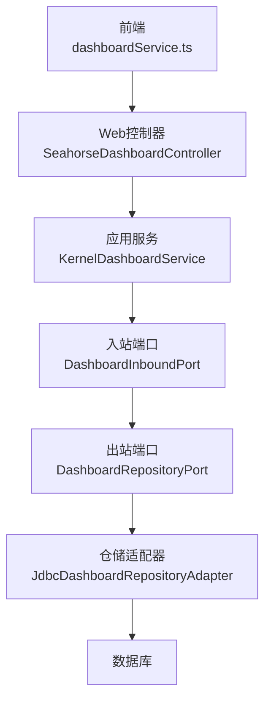
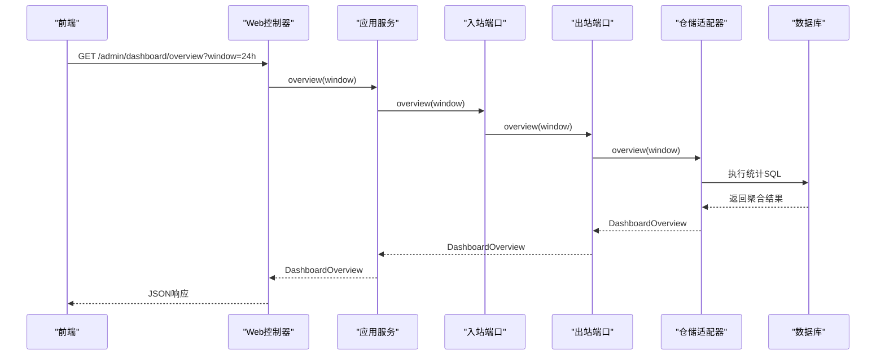
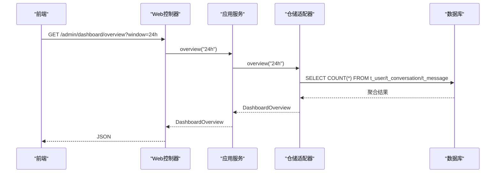
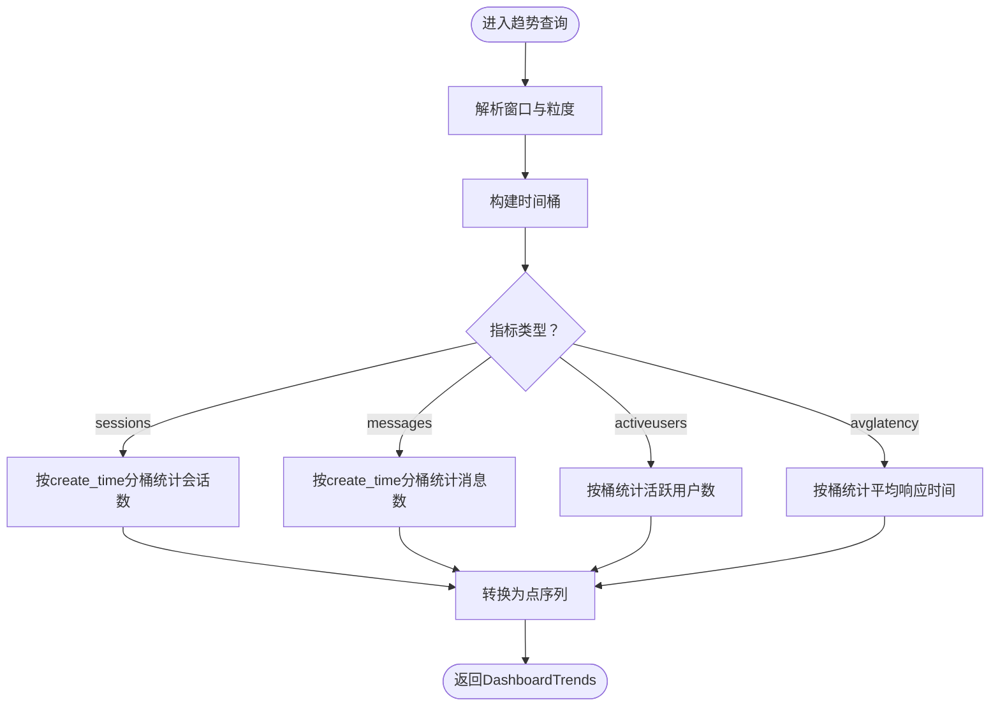
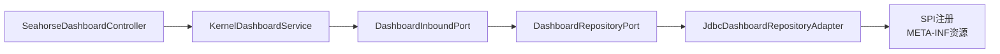

# 仪表盘分析服务

<cite>
**本文引用的文件**
- [JdbcDashboardRepositoryAdapter.java](file://seahorse-agent-adapter-repository-jdbc/src/main/java/com/miracle/ai/seahorse/agent/adapters/repository/jdbc/JdbcDashboardRepositoryAdapter.java)
- [DashboardRepositoryPort.java](file://seahorse-agent-kernel/src/main/java/com/miracle/ai/seahorse/agent/ports/outbound/dashboard/DashboardRepositoryPort.java)
- [DashboardInboundPort.java](file://seahorse-agent-kernel/src/main/java/com/miracle/ai/seahorse/agent/ports/inbound/dashboard/DashboardInboundPort.java)
- [KernelDashboardService.java](file://seahorse-agent-kernel/src/main/java/com/miracle/ai/seahorse/agent/kernel/application/dashboard/KernelDashboardService.java)
- [SeahorseDashboardController.java](file://seahorse-agent-adapter-web/src/main/java/com/miracle/ai/seahorse/agent/adapters/web/SeahorseDashboardController.java)
- [dashboardService.ts](file://frontend/src/services/dashboardService.ts)
- [JdbcDashboardRepositoryAdapterTests.java](file://seahorse-agent-adapter-repository-jdbc/src/test/java/com/miracle/ai/seahorse/agent/adapters/repository/jdbc/JdbcDashboardRepositoryAdapterTests.java)
- [SeahorseDashboardControllerTests.java](file://seahorse-agent-adapter-web/src/test/java/com/miracle/ai/seahorse/agent/adapters/web/SeahorseDashboardControllerTests.java)
- [com.miracle.ai.seahorse.agent.ports.outbound.dashboard.DashboardRepositoryPort](file://seahorse-agent-adapter-repository-jdbc/src/main/resources/META-INF/seahorse-agent/com.miracle.ai.seahorse.agent.ports.outbound.dashboard.DashboardRepositoryPort)
</cite>

## 目录
1. [简介](#简介)
2. [项目结构](#项目结构)
3. [核心组件](#核心组件)
4. [架构总览](#架构总览)
5. [详细组件分析](#详细组件分析)
6. [依赖关系分析](#依赖关系分析)
7. [性能考虑](#性能考虑)
8. [故障排查指南](#故障排查指南)
9. [结论](#结论)
10. [附录](#附录)

## 简介
本文件面向仪表盘分析服务的技术文档，聚焦于系统概览、使用统计、性能指标与趋势分析等能力的后端API实现与前端对接方式。内容涵盖统计数据收集机制（实时聚合、历史查询）、图表数据准备流程（格式转换、时间序列处理）、关键指标计算（用户活跃度、系统负载、资源利用率、业务指标）、实时更新机制（WebSocket/长轮询、数据推送与状态同步）、性能优化策略（分页、增量更新、缓存）以及开发者集成与定制化指南。

## 项目结构
仪表盘分析服务采用分层架构：前端通过HTTP接口调用后端Web适配器；Web适配器将请求委派给内核应用服务；应用服务通过Dashboard入站端口调用Dashboard仓储端口；仓储适配器基于JDBC访问数据库并返回标准化的数据模型。

图示来源
- [SeahorseDashboardController.java:1-33](file://seahorse-agent-adapter-web/src/main/java/com/miracle/ai/seahorse/agent/adapters/web/SeahorseDashboardController.java#L1-L33)
- [KernelDashboardService.java](file://seahorse-agent-kernel/src/main/java/com/miracle/ai/seahorse/agent/kernel/application/dashboard/KernelDashboardService.java)
- [DashboardInboundPort.java:1-34](file://seahorse-agent-kernel/src/main/java/com/miracle/ai/seahorse/agent/ports/inbound/dashboard/DashboardInboundPort.java#L1-L34)
- [DashboardRepositoryPort.java:1-30](file://seahorse-agent-kernel/src/main/java/com/miracle/ai/seahorse/agent/ports/outbound/dashboard/DashboardRepositoryPort.java#L1-L30)
- [JdbcDashboardRepositoryAdapter.java:1-25](file://seahorse-agent-adapter-repository-jdbc/src/main/java/com/miracle/ai/seahorse/agent/adapters/repository/jdbc/JdbcDashboardRepositoryAdapter.java#L1-L25)

章节来源
- [SeahorseDashboardController.java:1-33](file://seahorse-agent-adapter-web/src/main/java/com/miracle/ai/seahorse/agent/adapters/web/SeahorseDashboardController.java#L1-L33)
- [KernelDashboardService.java](file://seahorse-agent-kernel/src/main/java/com/miracle/ai/seahorse/agent/kernel/application/dashboard/KernelDashboardService.java)
- [DashboardInboundPort.java:1-34](file://seahorse-agent-kernel/src/main/java/com/miracle/ai/seahorse/agent/ports/inbound/dashboard/DashboardInboundPort.java#L1-L34)
- [DashboardRepositoryPort.java:1-30](file://seahorse-agent-kernel/src/main/java/com/miracle/ai/seahorse/agent/ports/outbound/dashboard/DashboardRepositoryPort.java#L1-L30)
- [JdbcDashboardRepositoryAdapter.java:1-25](file://seahorse-agent-adapter-repository-jdbc/src/main/java/com/miracle/ai/seahorse/agent/adapters/repository/jdbc/JdbcDashboardRepositoryAdapter.java#L1-L25)

## 核心组件
- 入站端口：定义对外暴露的仪表盘查询接口（概览、性能、趋势）
- 出站端口：定义只读投影仓储接口，供应用服务调用
- 应用服务：编排查询逻辑，组合多个指标与系列数据
- Web控制器：REST接口暴露，参数校验与结果封装
- 仓储适配器：基于JDBC实现具体统计查询与聚合

章节来源
- [DashboardInboundPort.java:1-34](file://seahorse-agent-kernel/src/main/java/com/miracle/ai/seahorse/agent/ports/inbound/dashboard/DashboardInboundPort.java#L1-L34)
- [DashboardRepositoryPort.java:1-30](file://seahorse-agent-kernel/src/main/java/com/miracle/ai/seahorse/agent/ports/outbound/dashboard/DashboardRepositoryPort.java#L1-L30)
- [KernelDashboardService.java](file://seahorse-agent-kernel/src/main/java/com/miracle/ai/seahorse/agent/kernel/application/dashboard/KernelDashboardService.java)
- [SeahorseDashboardController.java:1-33](file://seahorse-agent-adapter-web/src/main/java/com/miracle/ai/seahorse/agent/adapters/web/SeahorseDashboardController.java#L1-L33)
- [JdbcDashboardRepositoryAdapter.java:1-25](file://seahorse-agent-adapter-repository-jdbc/src/main/java/com/miracle/ai/seahorse/agent/adapters/repository/jdbc/JdbcDashboardRepositoryAdapter.java#L1-L25)

## 架构总览
下图展示从HTTP请求到数据库查询再到结果返回的完整链路，以及各组件之间的依赖关系。

图示来源
- [SeahorseDashboardController.java:1-33](file://seahorse-agent-adapter-web/src/main/java/com/miracle/ai/seahorse/agent/adapters/web/SeahorseDashboardController.java#L1-L33)
- [KernelDashboardService.java](file://seahorse-agent-kernel/src/main/java/com/miracle/ai/seahorse/agent/kernel/application/dashboard/KernelDashboardService.java)
- [DashboardInboundPort.java:1-34](file://seahorse-agent-kernel/src/main/java/com/miracle/ai/seahorse/agent/ports/inbound/dashboard/DashboardInboundPort.java#L1-L34)
- [DashboardRepositoryPort.java:1-30](file://seahorse-agent-kernel/src/main/java/com/miracle/ai/seahorse/agent/ports/outbound/dashboard/DashboardRepositoryPort.java#L1-L30)
- [JdbcDashboardRepositoryAdapter.java:65-88](file://seahorse-agent-adapter-repository-jdbc/src/main/java/com/miracle/ai/seahorse/agent/adapters/repository/jdbc/JdbcDashboardRepositoryAdapter.java#L65-L88)

## 详细组件分析

### Web控制器与前端对接
- 控制器路径：/admin/dashboard/{overview|performance|trends}
- 参数：
  - overview：window（窗口时长，默认24小时）
  - performance：window（窗口时长，默认24小时）
  - trends：metric（指标类型）、window（窗口时长，默认7天）、granularity（粒度，默认day）
- 响应：统一包装的JSON对象，包含code、data等字段

章节来源
- [SeahorseDashboardController.java:20-33](file://seahorse-agent-adapter-web/src/main/java/com/miracle/ai/seahorse/agent/adapters/web/SeahorseDashboardController.java#L20-L33)
- [dashboardService.ts:52-70](file://frontend/src/services/dashboardService.ts#L52-L70)

### 应用服务与入站端口
- KernelDashboardService负责协调不同维度的查询，并将结果组装为统一的数据模型
- DashboardInboundPort定义了对外暴露的三个方法：overview、performance、trends

章节来源
- [KernelDashboardService.java](file://seahorse-agent-kernel/src/main/java/com/miracle/ai/seahorse/agent/kernel/application/dashboard/KernelDashboardService.java)
- [DashboardInboundPort.java:27-33](file://seahorse-agent-kernel/src/main/java/com/miracle/ai/seahorse/agent/ports/inbound/dashboard/DashboardInboundPort.java#L27-L33)

### 仓储端口与适配器
- DashboardRepositoryPort定义了三个只读方法，分别对应概览、性能与趋势
- JdbcDashboardRepositoryAdapter实现基于JDBC的统计查询，包括：
  - 概览：用户总数、新增用户、会话总数、消息总数、活跃用户等
  - 性能：平均/95分位延迟、成功率/错误率、无文档回答率、慢请求占比
  - 趋势：按时间桶聚合的会话数、消息数、活跃用户、平均响应时间

章节来源
- [DashboardRepositoryPort.java:23-29](file://seahorse-agent-kernel/src/main/java/com/miracle/ai/seahorse/agent/ports/outbound/dashboard/DashboardRepositoryPort.java#L23-L29)
- [JdbcDashboardRepositoryAdapter.java:65-141](file://seahorse-agent-adapter-repository-jdbc/src/main/java/com/miracle/ai/seahorse/agent/adapters/repository/jdbc/JdbcDashboardRepositoryAdapter.java#L65-L141)

### 数据模型与序列化
- DashboardOverview：包含窗口标签、对比标签、采集时间戳与KPI组
- DashboardPerformance：包含窗口标签与各项性能指标
- DashboardTrends：包含指标名、窗口标签、粒度与趋势系列
- DashboardTrendSeries：包含系列名称与点集合
- DashboardTrendPoint：包含时间戳与数值

章节来源
- [JdbcDashboardRepositoryAdapter.java:65-141](file://seahorse-agent-adapter-repository-jdbc/src/main/java/com/miracle/ai/seahorse/agent/adapters/repository/jdbc/JdbcDashboardRepositoryAdapter.java#L65-L141)

### 统计数据收集机制
- 实时数据聚合：通过JDBC查询在数据库层面进行聚合，避免应用侧大量内存计算
- 历史数据查询：支持按窗口与粒度进行时间序列切片
- 缓存策略：当前实现未见显式缓存层，建议在应用服务或网关层引入轻量缓存以降低热点查询压力

章节来源
- [JdbcDashboardRepositoryAdapter.java:65-141](file://seahorse-agent-adapter-repository-jdbc/src/main/java/com/miracle/ai/seahorse/agent/adapters/repository/jdbc/JdbcDashboardRepositoryAdapter.java#L65-L141)

### 图表数据准备流程
- 时间序列处理：根据粒度（如hour/day/week）构建时间桶，按桶统计并填充缺失时间点
- 数据格式转换：将原始聚合结果映射为前端可消费的点序列
- 可视化数据结构：Series与Point的组合，便于前端渲染多维折线/柱状图

章节来源
- [JdbcDashboardRepositoryAdapter.java:112-141](file://seahorse-agent-adapter-repository-jdbc/src/main/java/com/miracle/ai/seahorse/agent/adapters/repository/jdbc/JdbcDashboardRepositoryAdapter.java#L112-L141)

### 关键指标计算
- 用户活跃度：活跃用户=在窗口内有交互行为的用户数
- 系统负载：成功率/错误率、慢请求占比（以阈值区分）
- 资源利用率：当前未直接暴露资源指标，可通过扩展trace运行记录中的资源字段补充
- 业务指标：会话数、消息数、平均响应时间、95分位延迟

章节来源
- [JdbcDashboardRepositoryAdapter.java:65-109](file://seahorse-agent-adapter-repository-jdbc/src/main/java/com/miracle/ai/seahorse/agent/adapters/repository/jdbc/JdbcDashboardRepositoryAdapter.java#L65-L109)

### 实时更新机制
- 当前实现采用HTTP接口查询，未发现内置WebSocket推送
- 建议：在应用服务层引入事件总线或消息队列，结合前端轮询/长轮询实现近实时更新；或在网关层启用Server-Sent Events

章节来源
- [SeahorseDashboardController.java:20-33](file://seahorse-agent-adapter-web/src/main/java/com/miracle/ai/seahorse/agent/adapters/web/SeahorseDashboardController.java#L20-L33)

### API工作流（概览）

图示来源
- [SeahorseDashboardController.java:44-56](file://seahorse-agent-adapter-web/src/main/java/com/miracle/ai/seahorse/agent/adapters/web/SeahorseDashboardController.java#L44-L56)
- [JdbcDashboardRepositoryAdapter.java:65-88](file://seahorse-agent-adapter-repository-jdbc/src/main/java/com/miracle/ai/seahorse/agent/adapters/repository/jdbc/JdbcDashboardRepositoryAdapter.java#L65-L88)

### 趋势算法流程（按粒度聚合）

图示来源
- [JdbcDashboardRepositoryAdapter.java:112-141](file://seahorse-agent-adapter-repository-jdbc/src/main/java/com/miracle/ai/seahorse/agent/adapters/repository/jdbc/JdbcDashboardRepositoryAdapter.java#L112-L141)

## 依赖关系分析
- 控制器依赖应用服务
- 应用服务依赖入站端口
- 入站端口依赖出站端口
- 出站端口由仓储适配器实现
- 适配器通过Spring SPI注册

图示来源
- [SeahorseDashboardController.java:20-33](file://seahorse-agent-adapter-web/src/main/java/com/miracle/ai/seahorse/agent/adapters/web/SeahorseDashboardController.java#L20-L33)
- [DashboardInboundPort.java:27-33](file://seahorse-agent-kernel/src/main/java/com/miracle/ai/seahorse/agent/ports/inbound/dashboard/DashboardInboundPort.java#L27-L33)
- [DashboardRepositoryPort.java:23-29](file://seahorse-agent-kernel/src/main/java/com/miracle/ai/seahorse/agent/ports/outbound/dashboard/DashboardRepositoryPort.java#L23-L29)
- [JdbcDashboardRepositoryAdapter.java:1-25](file://seahorse-agent-adapter-repository-jdbc/src/main/java/com/miracle/ai/seahorse/agent/adapters/repository/jdbc/JdbcDashboardRepositoryAdapter.java#L1-L25)
- [com.miracle.ai.seahorse.agent.ports.outbound.dashboard.DashboardRepositoryPort](file://seahorse-agent-adapter-repository-jdbc/src/main/resources/META-INF/seahorse-agent/com.miracle.ai.seahorse.agent.ports.outbound.dashboard.DashboardRepositoryPort)

章节来源
- [SeahorseDashboardController.java:20-33](file://seahorse-agent-adapter-web/src/main/java/com/miracle/ai/seahorse/agent/adapters/web/SeahorseDashboardController.java#L20-L33)
- [DashboardInboundPort.java:27-33](file://seahorse-agent-kernel/src/main/java/com/miracle/ai/seahorse/agent/ports/inbound/dashboard/DashboardInboundPort.java#L27-L33)
- [DashboardRepositoryPort.java:23-29](file://seahorse-agent-kernel/src/main/java/com/miracle/ai/seahorse/agent/ports/outbound/dashboard/DashboardRepositoryPort.java#L23-L29)
- [JdbcDashboardRepositoryAdapter.java:1-25](file://seahorse-agent-adapter-repository-jdbc/src/main/java/com/miracle/ai/seahorse/agent/adapters/repository/jdbc/JdbcDashboardRepositoryAdapter.java#L1-L25)
- [com.miracle.ai.seahorse.agent.ports.outbound.dashboard.DashboardRepositoryPort](file://seahorse-agent-adapter-repository-jdbc/src/main/resources/META-INF/seahorse-agent/com.miracle.ai.seahorse.agent.ports.outbound.dashboard.DashboardRepositoryPort)

## 性能考虑
- 查询优化
  - 使用索引覆盖：在create_time、用户标识等字段建立合适索引
  - 分页与限行：对趋势查询增加最大时间跨度限制，避免超大窗口导致的全表扫描
- 计算优化
  - 将平均/百分位等聚合尽量下沉至数据库执行
  - 对重复窗口的指标结果进行短期缓存（建议）
- 网络优化
  - 前端采用合理的轮询间隔与指数退避策略
  - 对热点指标采用压缩传输（如采样、降点）

## 故障排查指南
- 接口测试
  - 控制器单元测试验证路由与参数传递
  - 仓储适配器单元测试验证聚合逻辑与边界条件
- 常见问题
  - 参数非法：window/granularity不合法时应返回明确错误码
  - 数据缺失：时间桶为空时需返回空点序列而非null
  - 性能异常：检查慢查询日志与数据库索引情况

章节来源
- [SeahorseDashboardControllerTests.java:44-56](file://seahorse-agent-adapter-web/src/test/java/com/miracle/ai/seahorse/agent/adapters/web/SeahorseDashboardControllerTests.java#L44-L56)
- [JdbcDashboardRepositoryAdapterTests.java:47-63](file://seahorse-agent-adapter-repository-jdbc/src/test/java/com/miracle/ai/seahorse/agent/adapters/repository/jdbc/JdbcDashboardRepositoryAdapterTests.java#L47-L63)

## 结论
仪表盘分析服务通过清晰的端口分层与JDBC适配器实现了系统概览、性能指标与趋势分析的完整闭环。当前实现以查询为主，具备良好的扩展性；建议后续引入缓存与事件推送机制以提升用户体验与系统吞吐。

## 附录
- 开发者集成步骤
  - 前端：通过dashboardService.ts发起请求，传入window、metric、granularity等参数
  - 后端：确保DashboardRepositoryPort实现已通过SPI注册，控制器路由正确
  - 定制化：可在KernelDashboardService中扩展新的指标或Series，或在JdbcDashboardRepositoryAdapter中添加新的聚合SQL

章节来源
- [dashboardService.ts:52-70](file://frontend/src/services/dashboardService.ts#L52-L70)
- [com.miracle.ai.seahorse.agent.ports.outbound.dashboard.DashboardRepositoryPort](file://seahorse-agent-adapter-repository-jdbc/src/main/resources/META-INF/seahorse-agent/com.miracle.ai.seahorse.agent.ports.outbound.dashboard.DashboardRepositoryPort)