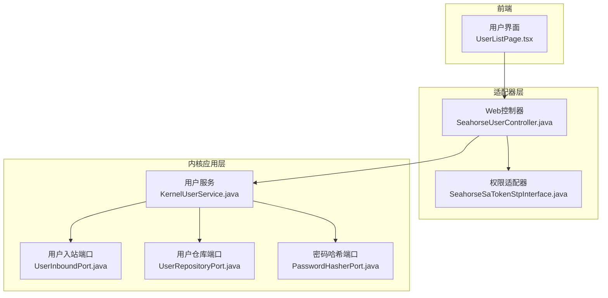
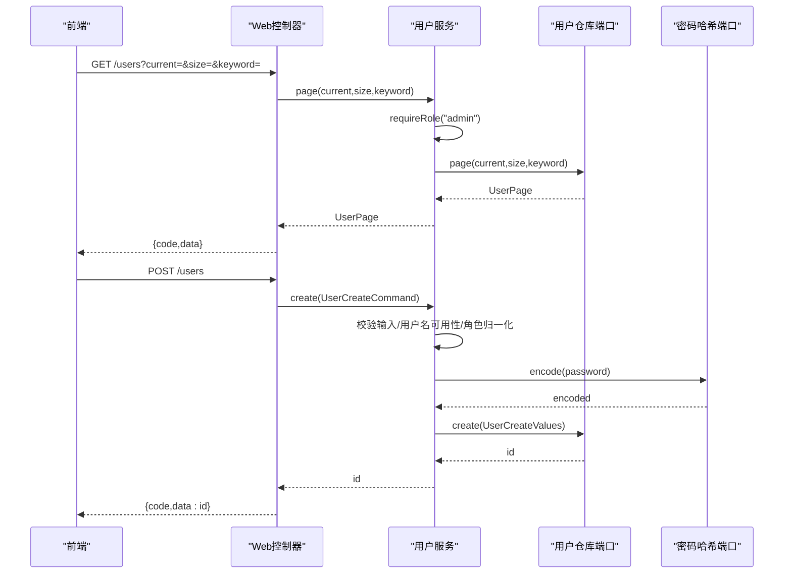
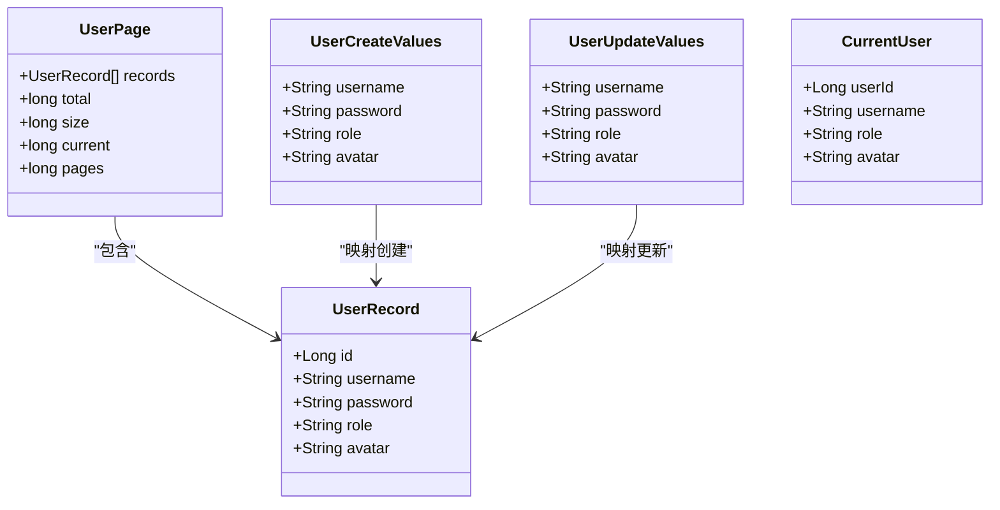
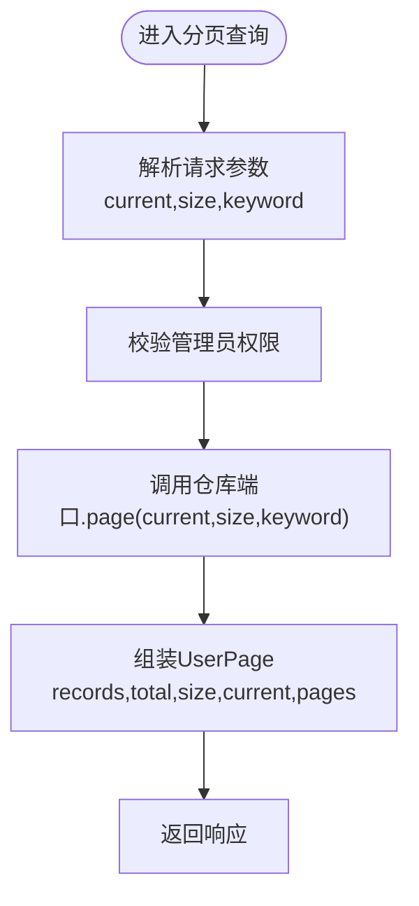
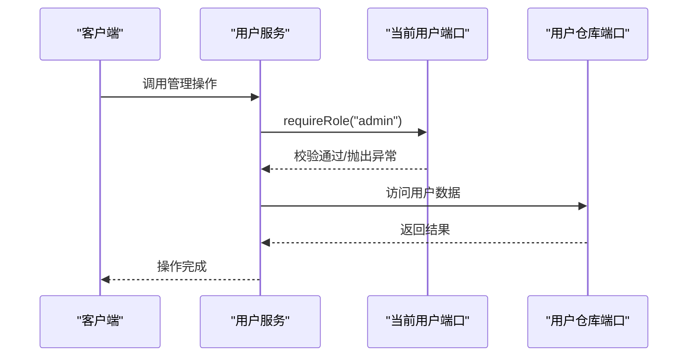
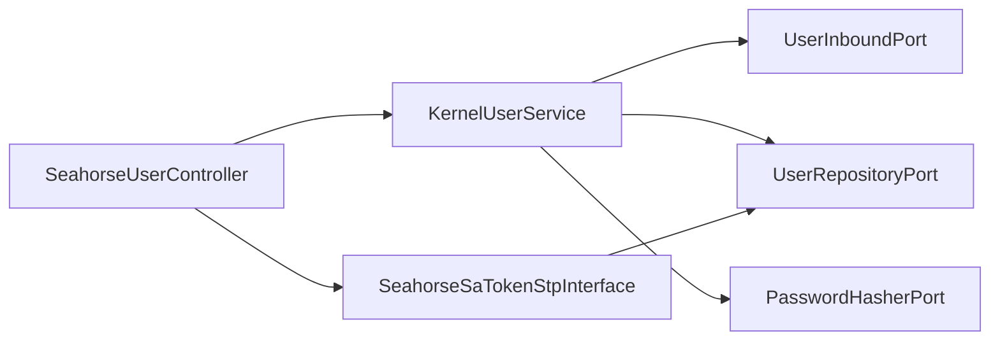

# 用户管理服务

<cite>
**本文引用的文件**
- [KernelUserService.java](file://seahorse-agent-kernel/src/main/java/com/miracle/ai/seahorse/agent/kernel/application/user/KernelUserService.java)
- [SeahorseUserController.java](file://seahorse-agent-adapter-web/src/main/java/com/miracle/ai/seahorse/agent/adapters/web/SeahorseUserController.java)
- [UserInboundPort.java](file://seahorse-agent-kernel/src/main/java/com/miracle/ai/seahorse/agent/ports/inbound/user/UserInboundPort.java)
- [UserRepositoryPort.java](file://seahorse-agent-kernel/src/main/java/com/miracle/ai/seahorse/agent/ports/outbound/auth/UserRepositoryPort.java)
- [PasswordHasherPort.java](file://seahorse-agent-kernel/src/main/java/com/miracle/ai/seahorse/agent/ports/outbound/auth/PasswordHasherPort.java)
- [SeahorseSaTokenStpInterface.java](file://seahorse-agent-adapter-web/src/main/java/com/miracle/ai/seahorse/agent/adapters/web/SeahorseSaTokenStpInterface.java)
- [JdbcUserRepositoryAdapterTests.java](file://seahorse-agent-adapter-repository-jdbc/src/test/java/com/miracle/ai/seahorse/agent/adapters/repository/jdbc/JdbcUserRepositoryAdapterTests.java)
- [UserListPage.tsx](file://frontend/src/pages/admin/users/UserListPage.tsx)
</cite>

## 目录
1. [简介](#简介)
2. [项目结构](#项目结构)
3. [核心组件](#核心组件)
4. [架构总览](#架构总览)
5. [详细组件分析](#详细组件分析)
6. [依赖关系分析](#依赖关系分析)
7. [性能考虑](#性能考虑)
8. [故障排除指南](#故障排除指南)
9. [结论](#结论)
10. [附录](#附录)

## 简介
本文件为用户管理服务的技术文档，面向后端开发者与前端集成人员，系统化阐述用户管理API的实现与使用方法。内容涵盖用户列表查询、用户创建、用户更新、用户删除、密码修改等核心功能；明确用户数据模型（用户ID、用户名、角色、头像等）；说明分页查询机制（当前页码、页面大小、关键词搜索）；介绍权限管理（角色分配与权限验证）；阐述安全性措施（密码加密、访问控制、审计日志）；并提供最佳实践（批量操作、数据校验、错误处理）与完整API使用示例及集成指南。

## 项目结构
用户管理服务采用“内核应用层 + 适配器层 + 外部端口”的分层架构：
- 内核应用层：负责业务规则与流程编排（如用户增删改查、密码修改、权限校验）
- 适配器层：对外暴露Web接口（REST），对内对接数据库等外部存储
- 外部端口：抽象出用户仓库、当前用户、密码哈希等可替换能力

图表来源
- [SeahorseUserController.java:1-92](file://seahorse-agent-adapter-web/src/main/java/com/miracle/ai/seahorse/agent/adapters/web/SeahorseUserController.java#L1-L92)
- [KernelUserService.java:1-184](file://seahorse-agent-kernel/src/main/java/com/miracle/ai/seahorse/agent/kernel/application/user/KernelUserService.java#L1-L184)
- [UserInboundPort.java:1-37](file://seahorse-agent-kernel/src/main/java/com/miracle/ai/seahorse/agent/ports/inbound/user/UserInboundPort.java#L1-L37)
- [UserRepositoryPort.java:1-38](file://seahorse-agent-kernel/src/main/java/com/miracle/ai/seahorse/agent/ports/outbound/auth/UserRepositoryPort.java#L1-L38)
- [PasswordHasherPort.java:1-39](file://seahorse-agent-kernel/src/main/java/com/miracle/ai/seahorse/agent/ports/outbound/auth/PasswordHasherPort.java#L1-L39)
- [SeahorseSaTokenStpInterface.java:1-50](file://seahorse-agent-adapter-web/src/main/java/com/miracle/ai/seahorse/agent/adapters/web/SeahorseSaTokenStpInterface.java#L1-L50)

章节来源
- [SeahorseUserController.java:1-92](file://seahorse-agent-adapter-web/src/main/java/com/miracle/ai/seahorse/agent/adapters/web/SeahorseUserController.java#L1-L92)
- [KernelUserService.java:1-184](file://seahorse-agent-kernel/src/main/java/com/miracle/ai/seahorse/agent/kernel/application/user/KernelUserService.java#L1-L184)

## 核心组件
- 用户服务（KernelUserService）：实现用户管理的核心业务逻辑，包含分页查询、创建、更新、删除、密码修改，并内置权限校验与数据校验
- Web控制器（SeahorseUserController）：提供REST接口，映射HTTP请求到用户服务
- 用户入站端口（UserInboundPort）：定义用户服务对外暴露的业务方法契约
- 用户仓库端口（UserRepositoryPort）：定义用户数据访问的抽象接口
- 密码哈希端口（PasswordHasherPort）：统一密码编码与匹配策略
- 权限适配器（SeahorseSaTokenStpInterface）：基于登录用户ID解析角色，用于权限判定

章节来源
- [KernelUserService.java:35-184](file://seahorse-agent-kernel/src/main/java/com/miracle/ai/seahorse/agent/kernel/application/user/KernelUserService.java#L35-L184)
- [SeahorseUserController.java:37-92](file://seahorse-agent-adapter-web/src/main/java/com/miracle/ai/seahorse/agent/adapters/web/SeahorseUserController.java#L37-L92)
- [UserInboundPort.java:23-36](file://seahorse-agent-kernel/src/main/java/com/miracle/ai/seahorse/agent/ports/inbound/user/UserInboundPort.java#L23-L36)
- [UserRepositoryPort.java:22-37](file://seahorse-agent-kernel/src/main/java/com/miracle/ai/seahorse/agent/ports/outbound/auth/UserRepositoryPort.java#L22-L37)
- [PasswordHasherPort.java:20-39](file://seahorse-agent-kernel/src/main/java/com/miracle/ai/seahorse/agent/ports/outbound/auth/PasswordHasherPort.java#L20-L39)
- [SeahorseSaTokenStpInterface.java:32-50](file://seahorse-agent-adapter-web/src/main/java/com/miracle/ai/seahorse/agent/adapters/web/SeahorseSaTokenStpInterface.java#L32-L50)

## 架构总览
用户管理服务遵循Clean Architecture思想，通过端口与适配器解耦业务逻辑与外部实现。Web控制器作为适配器接收HTTP请求，调用用户服务；用户服务通过仓库端口访问持久层，通过密码哈希端口进行安全处理，通过当前用户端口进行权限校验。

图表来源
- [SeahorseUserController.java:55-60](file://seahorse-agent-adapter-web/src/main/java/com/miracle/ai/seahorse/agent/adapters/web/SeahorseUserController.java#L55-L60)
- [KernelUserService.java:59-77](file://seahorse-agent-kernel/src/main/java/com/miracle/ai/seahorse/agent/kernel/application/user/KernelUserService.java#L59-L77)
- [UserRepositoryPort.java:30](file://seahorse-agent-kernel/src/main/java/com/miracle/ai/seahorse/agent/ports/outbound/auth/UserRepositoryPort.java#L30)
- [PasswordHasherPort.java:24](file://seahorse-agent-kernel/src/main/java/com/miracle/ai/seahorse/agent/ports/outbound/auth/PasswordHasherPort.java#L24)

## 详细组件分析

### 用户数据模型
- 用户记录（UserRecord）：包含用户标识、用户名、密码、角色、头像等字段
- 用户分页结果（UserPage）：包含记录列表、总数、页面大小、当前页、总页数
- 用户创建值（UserCreateValues）：用于创建时的输入参数集合
- 用户更新值（UserUpdateValues）：用于更新时的增量参数集合
- 当前用户（CurrentUser）：表示当前登录用户的身份信息

图表来源
- [KernelUserService.java:24-31](file://seahorse-agent-kernel/src/main/java/com/miracle/ai/seahorse/agent/kernel/application/user/KernelUserService.java#L24-L31)

章节来源
- [KernelUserService.java:24-31](file://seahorse-agent-kernel/src/main/java/com/miracle/ai/seahorse/agent/kernel/application/user/KernelUserService.java#L24-L31)

### 分页查询机制
- 请求参数
  - current：当前页码，默认1
  - size：页面大小，默认10
  - keyword：关键词，支持模糊匹配用户名、昵称等
- 服务端处理
  - 要求调用者具备管理员角色
  - 将请求参数透传至仓库端口，由具体实现负责SQL构建与分页计算
  - 返回UserPage对象，包含records、total、size、current、pages
- 前端交互
  - 前端组件UserListPage.tsx负责维护页码、关键词、加载状态，并调用分页接口

图表来源
- [SeahorseUserController.java:55-60](file://seahorse-agent-adapter-web/src/main/java/com/miracle/ai/seahorse/agent/adapters/web/SeahorseUserController.java#L55-L60)
- [KernelUserService.java:59-62](file://seahorse-agent-kernel/src/main/java/com/miracle/ai/seahorse/agent/kernel/application/user/KernelUserService.java#L59-L62)
- [UserRepositoryPort.java:30](file://seahorse-agent-kernel/src/main/java/com/miracle/ai/seahorse/agent/ports/outbound/auth/UserRepositoryPort.java#L30)

章节来源
- [SeahorseUserController.java:55-60](file://seahorse-agent-adapter-web/src/main/java/com/miracle/ai/seahorse/agent/adapters/web/SeahorseUserController.java#L55-L60)
- [KernelUserService.java:59-62](file://seahorse-agent-kernel/src/main/java/com/miracle/ai/seahorse/agent/kernel/application/user/KernelUserService.java#L59-L62)
- [UserListPage.tsx:48-68](file://frontend/src/pages/admin/users/UserListPage.tsx#L48-L68)

### 用户权限管理
- 角色定义
  - admin：管理员，拥有全部用户管理权限
  - user：普通用户
- 权限校验
  - 所有用户管理操作（分页、创建、更新、删除、密码修改）均要求调用者具备admin角色
  - 默认管理员账户（用户名为admin）不可被修改或删除
- 角色解析
  - 登录成功后，权限适配器根据用户ID从仓库查询角色，返回给认证框架

图表来源
- [KernelUserService.java:37-40](file://seahorse-agent-kernel/src/main/java/com/miracle/ai/seahorse/agent/kernel/application/user/KernelUserService.java#L37-L40)
- [KernelUserService.java:60](file://seahorse-agent-kernel/src/main/java/com/miracle/ai/seahorse/agent/kernel/application/user/KernelUserService.java#L60)
- [KernelUserService.java:130-134](file://seahorse-agent-kernel/src/main/java/com/miracle/ai/seahorse/agent/kernel/application/user/KernelUserService.java#L130-L134)
- [SeahorseSaTokenStpInterface.java:41-49](file://seahorse-agent-adapter-web/src/main/java/com/miracle/ai/seahorse/agent/adapters/web/SeahorseSaTokenStpInterface.java#L41-L49)

章节来源
- [KernelUserService.java:37-40](file://seahorse-agent-kernel/src/main/java/com/miracle/ai/seahorse/agent/kernel/application/user/KernelUserService.java#L37-L40)
- [KernelUserService.java:60](file://seahorse-agent-kernel/src/main/java/com/miracle/ai/seahorse/agent/kernel/application/user/KernelUserService.java#L60)
- [KernelUserService.java:130-134](file://seahorse-agent-kernel/src/main/java/com/miracle/ai/seahorse/agent/kernel/application/user/KernelUserService.java#L130-L134)
- [SeahorseSaTokenStpInterface.java:41-49](file://seahorse-agent-adapter-web/src/main/java/com/miracle/ai/seahorse/agent/adapters/web/SeahorseSaTokenStpInterface.java#L41-L49)

### 安全性措施
- 密码加密
  - 使用PasswordHasherPort对密码进行编码存储，支持明文模式（测试环境）与生产安全模式
- 访问控制
  - 所有管理操作强制requireRole("admin")
  - 默认管理员账户不可被修改或删除
- 审计日志
  - 代码中未直接体现审计日志实现，建议在仓库端口或服务层扩展审计事件记录

章节来源
- [PasswordHasherPort.java:20-39](file://seahorse-agent-kernel/src/main/java/com/miracle/ai/seahorse/agent/ports/outbound/auth/PasswordHasherPort.java#L20-L39)
- [KernelUserService.java:60](file://seahorse-agent-kernel/src/main/java/com/miracle/ai/seahorse/agent/kernel/application/user/KernelUserService.java#L60)
- [KernelUserService.java:130-134](file://seahorse-agent-kernel/src/main/java/com/miracle/ai/seahorse/agent/kernel/application/user/KernelUserService.java#L130-L134)

### API使用示例与集成指南
- 获取当前用户
  - 方法：GET /user/me
  - 返回：包含当前用户信息的对象
- 分页查询用户
  - 方法：GET /users
  - 参数：current（默认1）、size（默认10）、keyword（可选）
  - 返回：包含records、total、size、current、pages的分页对象
- 创建用户
  - 方法：POST /users
  - 请求体：包含username、password、role、avatar
  - 返回：新建用户的id
- 更新用户
  - 方法：PUT /users/{id}
  - 路径参数：id
  - 请求体：可选username、password、role、avatar（password留空表示不修改）
  - 返回：无内容
- 删除用户
  - 方法：DELETE /users/{id}
  - 路径参数：id
  - 返回：无内容
- 修改密码
  - 方法：PUT /user/password
  - 请求体：包含currentPassword、newPassword
  - 返回：无内容

章节来源
- [SeahorseUserController.java:50-90](file://seahorse-agent-adapter-web/src/main/java/com/miracle/ai/seahorse/agent/adapters/web/SeahorseUserController.java#L50-L90)

## 依赖关系分析
- 控制器依赖用户服务（UserInboundPort）
- 用户服务依赖用户仓库端口（UserRepositoryPort）、密码哈希端口（PasswordHasherPort）、当前用户端口（CurrentUserPort）
- 权限适配器依赖用户仓库端口以解析角色

图表来源
- [SeahorseUserController.java:44-48](file://seahorse-agent-adapter-web/src/main/java/com/miracle/ai/seahorse/agent/adapters/web/SeahorseUserController.java#L44-L48)
- [KernelUserService.java:45-51](file://seahorse-agent-kernel/src/main/java/com/miracle/ai/seahorse/agent/kernel/application/user/KernelUserService.java#L45-L51)
- [UserInboundPort.java:23-36](file://seahorse-agent-kernel/src/main/java/com/miracle/ai/seahorse/agent/ports/inbound/user/UserInboundPort.java#L23-L36)
- [UserRepositoryPort.java:22-37](file://seahorse-agent-kernel/src/main/java/com/miracle/ai/seahorse/agent/ports/outbound/auth/UserRepositoryPort.java#L22-L37)
- [PasswordHasherPort.java:20-39](file://seahorse-agent-kernel/src/main/java/com/miracle/ai/seahorse/agent/ports/outbound/auth/PasswordHasherPort.java#L20-L39)
- [SeahorseSaTokenStpInterface.java:32-33](file://seahorse-agent-adapter-web/src/main/java/com/miracle/ai/seahorse/agent/adapters/web/SeahorseSaTokenStpInterface.java#L32-L33)

章节来源
- [SeahorseUserController.java:44-48](file://seahorse-agent-adapter-web/src/main/java/com/miracle/ai/seahorse/agent/adapters/web/SeahorseUserController.java#L44-L48)
- [KernelUserService.java:45-51](file://seahorse-agent-kernel/src/main/java/com/miracle/ai/seahorse/agent/kernel/application/user/KernelUserService.java#L45-L51)

## 性能考虑
- 分页大小限制：建议在仓库实现中对size进行上限控制，避免过大请求影响数据库性能
- 关键词搜索：对模糊查询使用合适的索引与查询条件，避免全表扫描
- 密码哈希成本：生产环境应选择高成本算法，平衡安全与性能
- 并发控制：在高并发场景下，注意用户唯一性检查与事务隔离级别

## 故障排除指南
- 权限不足
  - 现象：调用管理接口抛出“权限不足”异常
  - 原因：当前用户不具备admin角色
  - 处理：确保登录用户具有admin角色
- 用户名冲突
  - 现象：创建/更新用户时报“用户名已存在”
  - 原因：用户名重复或与他人冲突
  - 处理：更换用户名或排除特定用户ID后重试
- 默认管理员不可修改/删除
  - 现象：尝试修改或删除默认管理员账户失败
  - 原因：系统保护默认管理员账户
  - 处理：不要对默认管理员执行危险操作
- 当前密码不正确
  - 现象：修改密码时报“当前密码不正确”
  - 原因：提供的旧密码与存储不符
  - 处理：确认旧密码正确后再提交

章节来源
- [KernelUserService.java:56](file://seahorse-agent-kernel/src/main/java/com/miracle/ai/seahorse/agent/kernel/application/user/KernelUserService.java#L56)
- [KernelUserService.java:150-154](file://seahorse-agent-kernel/src/main/java/com/miracle/ai/seahorse/agent/kernel/application/user/KernelUserService.java#L150-L154)
- [KernelUserService.java:130-134](file://seahorse-agent-kernel/src/main/java/com/miracle/ai/seahorse/agent/kernel/application/user/KernelUserService.java#L130-L134)
- [KernelUserService.java:116-118](file://seahorse-agent-kernel/src/main/java/com/miracle/ai/seahorse/agent/kernel/application/user/KernelUserService.java#L116-L118)

## 结论
用户管理服务通过清晰的分层与端口抽象，实现了稳定的用户生命周期管理与严格的安全控制。Web控制器提供简洁一致的REST接口，内核服务集中处理业务规则与权限校验，仓库端口与密码哈希端口便于替换与扩展。建议在生产环境中完善审计日志、分页大小限制与索引优化，持续提升系统的安全性与性能。

## 附录
- 最佳实践
  - 批量操作：建议通过后台任务或队列异步处理大批量用户导入/导出
  - 数据验证：在入站端口与控制器层进行基础校验，在服务层进行业务规则校验
  - 错误处理：统一异常转换与错误码规范，前端友好提示
  - 安全加固：启用HTTPS、参数过滤、速率限制与最小权限原则