# 管理后台服务

<cite>
**本文引用的文件**
- [SeahorseUserController.java](file://seahorse-agent-adapter-web/src/main/java/com/miracle/ai/seahorse/agent/adapters/web/SeahorseUserController.java)
- [SeahorseDashboardController.java](file://seahorse-agent-adapter-web/src/main/java/com/miracle/ai/seahorse/agent/adapters/web/SeahorseDashboardController.java)
- [SeahorseAuditEventController.java](file://seahorse-agent-adapter-web/src/main/java/com/miracle/ai/seahorse/agent/adapters/web/SeahorseAuditEventController.java)
- [SeahorseCostUsageController.java](file://seahorse-agent-adapter-web/src/main/java/com/miracle/ai/seahorse/agent/adapters/web/SeahorseCostUsageController.java)
- [SeahorseRagSettingsController.java](file://seahorse-agent-adapter-web/src/main/java/com/miracle/ai/seahorse/agent/adapters/web/SeahorseRagSettingsController.java)
- [SeahorseSaTokenStpInterface.java](file://seahorse-agent-adapter-web/src/main/java/com/miracle/ai/seahorse/agent/adapters/web/SeahorseSaTokenStpInterface.java)
- [SeahorseSecurityWebMvcConfiguration.java](file://seahorse-agent-adapter-web/src/main/java/com/miracle/ai/seahorse/agent/adapters/web/SeahorseSecurityWebMvcConfiguration.java)
- [SeahorseAdminUserController.java](file://seahorse-agent-adapter-web/src/main/java/com/miracle/ai/seahorse/agent/adapters/web/SeahorseAdminUserController.java)
- [KernelUserService.java](file://seahorse-agent-kernel/src/main/java/com/miracle/ai/seahorse/agent/kernel/application/user/KernelUserService.java)
- [KernelDashboardService.java](file://seahorse-agent-kernel/src/main/java/com/miracle/ai/seahorse/agent/kernel/application/dashboard/KernelDashboardService.java)
- [KernelMessageFeedbackService.java](file://seahorse-agent-kernel/src/main/java/com/miracle/ai/seahorse/agent/kernel/application/feedback/KernelMessageFeedbackService.java)
- [JdbcUserRepositoryAdapter.java](file://seahorse-agent-adapter-repository-jdbc/src/main/java/com/miracle/ai/seahorse/agent/adapters/repository/jdbc/JdbcUserRepositoryAdapter.java)
- [JdbcDashboardRepositoryAdapter.java](file://seahorse-agent-adapter-repository-jdbc/src/main/java/com/miracle/ai/seahorse/agent/adapters/repository/jdbc/JdbcDashboardRepositoryAdapter.java)
- [JdbcAuditEventRepositoryAdapter.java](file://seahorse-agent-adapter-repository-jdbc/src/main/java/com/miracle/ai/seahorse/agent/adapters/repository/jdbc/JdbcAuditEventRepositoryAdapter.java)
- [JdbcCostUsageRepositoryAdapter.java](file://seahorse-agent-adapter-repository-jdbc/src/main/java/com/miracle/ai/seahorse/agent/adapters/repository/jdbc/JdbcCostUsageRepositoryAdapter.java)
- [JdbcMessageFeedbackRepositoryAdapter.java](file://seahorse-agent-adapter-repository-jdbc/src/main/java/com/miracle/ai/seahorse/agent/adapters/repository/jdbc/JdbcMessageFeedbackRepositoryAdapter.java)
- [adminService.ts](file://frontend/src/services/adminService.ts)
- [dashboardService.ts](file://frontend/src/services/dashboardService.ts)
- [auditCostService.ts](file://frontend/src/services/auditCostService.ts)
- [AdminLayout.tsx](file://frontend/src/pages/admin/AdminLayout.tsx)
- [TenantListPage.tsx](file://frontend/src/pages/admin/tenants/TenantListPage.tsx)
- [UserListPage.tsx](file://frontend/src/pages/admin/users/UserListPage.tsx)
- [AuditLogPage.tsx](file://frontend/src/pages/admin/audit/AuditLogPage.tsx)
- [SystemSettingsPage.tsx](file://frontend/src/pages/admin/settings/SystemSettingsPage.tsx)
- [SeahorseWebApiContractTests.java](file://seahorse-agent-tests/src/test/java/com/miracle/ai/seahorse/agent/adapters/web/SeahorseWebApiContractTests.java)
- [SeahorseUserControllerTests.java](file://seahorse-agent-tests/src/test/java/com/miracle/ai/seahorse/agent/adapters/web/SeahorseUserControllerTests.java)
- [AgentPluginProperties.java](file://seahorse-agent-spring-boot-starter/src/main/java/com/miracle/ai/seahorse/agent/adapters/spring/config/AgentPluginProperties.java)
- [AgentFeatureProperties.java](file://seahorse-agent-kernel/src/main/java/com/miracle/ai/seahorse/agent/kernel/plugin/AgentFeatureProperties.java)
- [2026-05-31-frontend-backend-alignment.md](file://docs/superpowers/plans/2026-05-31-frontend-backend-alignment.md)
- [系统管理接口.md](file://docs/zh/content/API 接口文档/系统管理接口.md)
</cite>

## 更新摘要
**所做更改**
- 新增管理员服务层分析，包括租户管理、用户管理、审计日志查询
- 更新前端集成架构，展示adminService.ts与相关页面组件
- 扩展管理后台功能模块，涵盖SaaS运营、安全治理等新功能
- 增强权限控制与安全配置章节，反映新的管理功能

## 目录
1. [简介](#简介)
2. [项目结构](#项目结构)
3. [核心组件](#核心组件)
4. [架构总览](#架构总览)
5. [详细组件分析](#详细组件分析)
6. [依赖关系分析](#依赖关系分析)
7. [性能考虑](#性能考虑)
8. [故障排查指南](#故障排查指南)
9. [结论](#结论)
10. [附录](#附录)

## 简介
本文件面向Seahorse Agent管理后台服务，系统性梳理并说明管理功能的API服务实现，涵盖用户管理、仪表盘统计、系统配置、审计日志与合规追踪等模块。文档从架构、组件职责、数据流、错误处理与性能优化等维度进行深入解析，并提供前端集成与最佳实践建议，帮助开发者快速理解与扩展管理后台能力。

**更新** 新增管理员服务层，包括租户管理、用户管理、审计日志查询等核心功能模块。

## 项目结构
后端采用Spring MVC控制器层，控制器通过适配器模式对接内核领域服务端口，实现用户、仪表板、RAG设置、认证、插件、审计与成本用量等管理能力。前端通过服务封装调用后端接口，页面组件负责展示与交互。

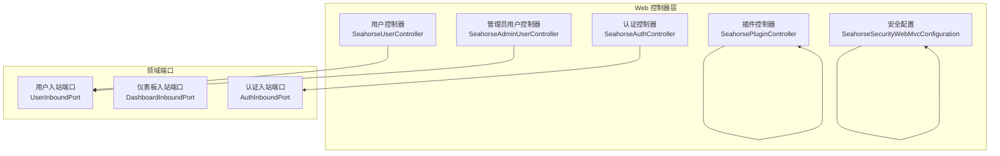

**图表来源**
- [SeahorseUserController.java:37-93](file://seahorse-agent-adapter-web/src/main/java/com/miracle/ai/seahorse/agent/adapters/web/SeahorseUserController.java#L37-L93)
- [SeahorseAdminUserController.java](file://seahorse-agent-adapter-web/src/main/java/com/miracle/ai/seahorse/agent/adapters/web/SeahorseAdminUserController.java)
- [SeahorseSecurityWebMvcConfiguration.java:30-51](file://seahorse-agent-adapter-web/src/main/java/com/miracle/ai/seahorse/agent/adapters/web/SeahorseSecurityWebMvcConfiguration.java#L30-L51)

**章节来源**
- [系统管理接口.md:36-76](file://docs/zh/content/API 接口文档/系统管理接口.md#L36-L76)

## 核心组件
- 用户管理控制器：提供当前用户信息、分页查询、创建、更新、删除、修改密码等接口
- 管理员用户控制器：提供租户管理、用户管理、审计日志查询等高级管理功能
- 仪表板控制器：提供概览、性能、趋势等数据接口
- RAG 设置控制器：以统一结构返回上传、RAG 默认配置、限流、记忆策略以及 AI 模型配置
- 认证控制器：登录、登出接口
- 插件控制器：查询插件健康度、状态、注册表；保存插件状态
- 安全配置：全局拦截器，除特定路径外强制登录校验

**章节来源**
- [系统管理接口.md:77-83](file://docs/zh/content/API 接口文档/系统管理接口.md#L77-L83)

## 架构总览
管理后台服务遵循"控制器-领域服务-持久化适配器"的分层架构。控制器接收HTTP请求，调用领域服务，领域服务通过端口接口与适配器交互，最终完成数据库或外部系统的读写。

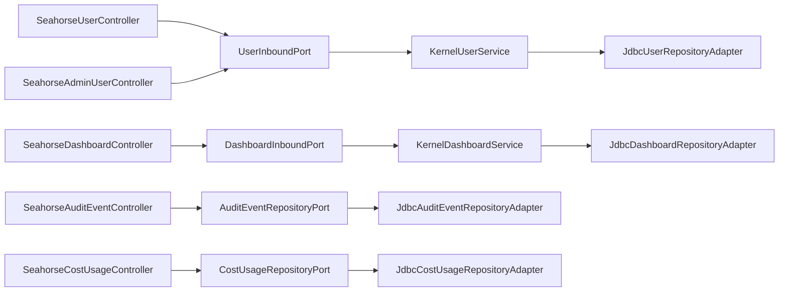

**图表来源**
- [SeahorseUserController.java:37-93](file://seahorse-agent-adapter-web/src/main/java/com/miracle/ai/seahorse/agent/adapters/web/SeahorseUserController.java#L37-L93)
- [SeahorseAdminUserController.java](file://seahorse-agent-adapter-web/src/main/java/com/miracle/ai/seahorse/agent/adapters/web/SeahorseAdminUserController.java)
- [SeahorseDashboardController.java:33-65](file://seahorse-agent-adapter-web/src/main/java/com/miracle/ai/seahorse/agent/adapters/web/SeahorseDashboardController.java#L33-L65)
- [KernelUserService.java:35-51](file://seahorse-agent-kernel/src/main/java/com/miracle/ai/seahorse/agent/kernel/application/user/KernelUserService.java#L35-L51)
- [KernelDashboardService.java:31-37](file://seahorse-agent-kernel/src/main/java/com/miracle/ai/seahorse/agent/kernel/application/dashboard/KernelDashboardService.java#L31-L37)
- [JdbcUserRepositoryAdapter.java](file://seahorse-agent-adapter-repository-jdbc/src/main/java/com/miracle/ai/seahorse/agent/adapters/repository/jdbc/JdbcUserRepositoryAdapter.java)
- [JdbcDashboardRepositoryAdapter.java](file://seahorse-agent-adapter-repository-jdbc/src/main/java/com/miracle/ai/seahorse/agent/adapters/repository/jdbc/JdbcDashboardRepositoryAdapter.java)

## 详细组件分析

### 管理员服务层
**新增** 管理员服务层提供高级管理功能，包括租户管理、用户管理、审计日志查询等核心能力。

#### 租户管理API
- 租户列表查询：GET /api/admin/tenants?page=&size=&status=
- 租户详情查询：GET /api/admin/tenants/{tenantId}
- 暂停租户：PUT /api/admin/tenants/{tenantId}/suspend
- 删除租户：DELETE /api/admin/tenants/{tenantId}?cascade=true
- 租户用户列表：GET /api/admin/tenants/{tenantId}/users?page=&size=

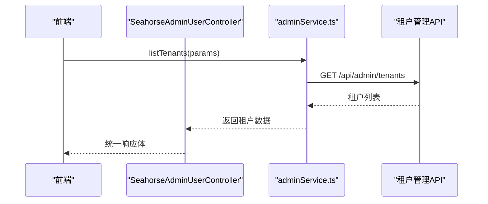

**图表来源**
- [adminService.ts:41-43](file://frontend/src/services/adminService.ts#L41-L43)
- [TenantListPage.tsx:51-66](file://frontend/src/pages/admin/tenants/TenantListPage.tsx#L51-L66)

#### 用户管理API
- 封禁用户：PUT /api/admin/users/{userId}/ban
- 重置密码：PUT /api/admin/users/{userId}/reset-password
- 强制登出：POST /api/admin/users/{userId}/force-logout

#### 审计日志查询API
- 审计日志查询：GET /api/admin/audit-logs?tenantId=&action=&startTime=&endTime=&page=&size=

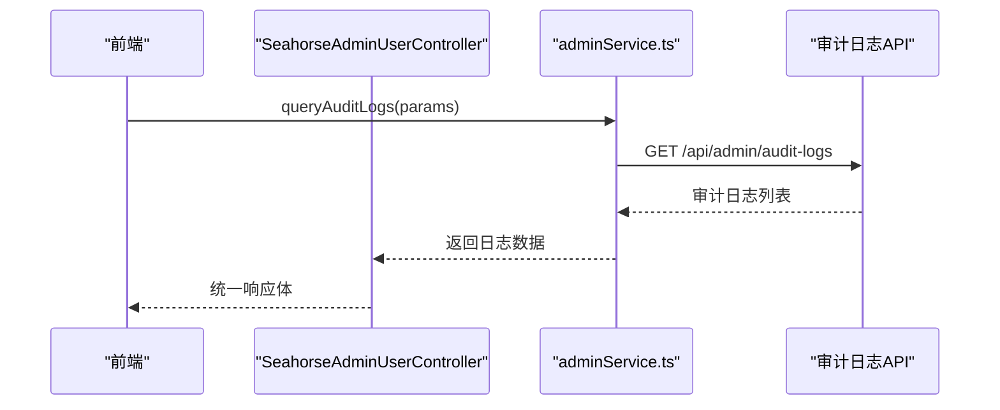

**图表来源**
- [adminService.ts:75-77](file://frontend/src/services/adminService.ts#L75-L77)
- [AuditLogPage.tsx:41-59](file://frontend/src/pages/admin/audit/AuditLogPage.tsx#L41-L59)

**章节来源**
- [adminService.ts:41-77](file://frontend/src/services/adminService.ts#L41-L77)
- [TenantListPage.tsx:51-124](file://frontend/src/pages/admin/tenants/TenantListPage.tsx#L51-L124)
- [AuditLogPage.tsx:41-101](file://frontend/src/pages/admin/audit/AuditLogPage.tsx#L41-L101)

### 用户管理API
- 当前用户信息：GET /user/me
- 用户分页查询：GET /users?current=&size=&keyword=
- 新增用户：POST /users
- 更新用户：PUT /users/{id}
- 删除用户：DELETE /users/{id}
- 修改密码：PUT /user/password

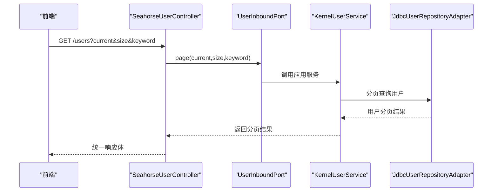

**图表来源**
- [SeahorseUserController.java:55-60](file://seahorse-agent-adapter-web/src/main/java/com/miracle/ai/seahorse/agent/adapters/web/SeahorseUserController.java#L55-L60)
- [KernelUserService.java:35-51](file://seahorse-agent-kernel/src/main/java/com/miracle/ai/seahorse/agent/kernel/application/user/KernelUserService.java#L35-L51)
- [JdbcUserRepositoryAdapter.java](file://seahorse-agent-adapter-repository-jdbc/src/main/java/com/miracle/ai/seahorse/agent/adapters/repository/jdbc/JdbcUserRepositoryAdapter.java)

- 角色与权限：基于Sa-Token的登录态与角色列表获取，角色来源于用户实体，控制器通过自定义的登录认证接口返回角色集合，用于前端路由与菜单的可见性控制。

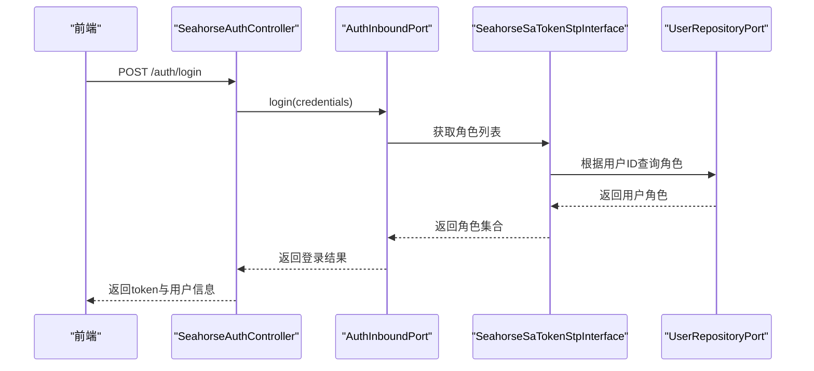

**图表来源**
- [SeahorseAuthController.java:30-57](file://seahorse-agent-adapter-web/src/main/java/com/miracle/ai/seahorse/agent/adapters/web/SeahorseAuthController.java#L30-L57)
- [SeahorseSaTokenStpInterface.java:36-49](file://seahorse-agent-adapter-web/src/main/java/com/miracle/ai/seahorse/agent/adapters/web/SeahorseSaTokenStpInterface.java#L36-L49)
- [JdbcUserRepositoryAdapter.java](file://seahorse-agent-adapter-repository-jdbc/src/main/java/com/miracle/ai/seahorse/agent/adapters/repository/jdbc/JdbcUserRepositoryAdapter.java)

**章节来源**
- [SeahorseUserController.java:50-90](file://seahorse-agent-adapter-web/src/main/java/com/miracle/ai/seahorse/agent/adapters/web/SeahorseUserController.java#L50-L90)
- [SeahorseUserControllerTests.java:46-99](file://seahorse-agent-tests/src/test/java/com/miracle/ai/seahorse/agent/adapters/web/SeahorseUserControllerTests.java#L46-L99)
- [SeahorseWebApiContractTests.java:217-271](file://seahorse-agent-tests/src/test/java/com/miracle/ai/seahorse/agent/adapters/web/SeahorseWebApiContractTests.java#L217-L271)
- [SeahorseSaTokenStpInterface.java:36-49](file://seahorse-agent-adapter-web/src/main/java/com/miracle/ai/seahorse/agent/adapters/web/SeahorseSaTokenStpInterface.java#L36-L49)

### 仪表盘数据获取机制
- 概览数据：GET /admin/dashboard/overview?window=24h
- 性能指标：GET /admin/dashboard/performance?window=24h
- 趋势数据：GET /admin/dashboard/trends?metric=&window=&granularity=

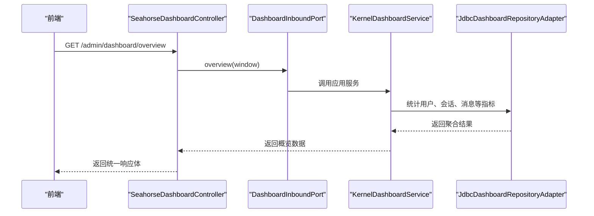

**图表来源**
- [SeahorseDashboardController.java:44-63](file://seahorse-agent-adapter-web/src/main/java/com/miracle/ai/seahorse/agent/adapters/web/SeahorseDashboardController.java#L44-L63)
- [KernelDashboardService.java:31-37](file://seahorse-agent-kernel/src/main/java/com/miracle/ai/seahorse/agent/kernel/application/dashboard/KernelDashboardService.java#L31-L37)
- [JdbcDashboardRepositoryAdapter.java](file://seahorse-agent-adapter-repository-jdbc/src/main/java/com/miracle/ai/seahorse/agent/adapters/repository/jdbc/JdbcDashboardRepositoryAdapter.java)

**章节来源**
- [dashboardService.ts:50-70](file://frontend/src/services/dashboardService.ts#L50-L70)
- [SeahorseDashboardController.java:44-63](file://seahorse-agent-adapter-web/src/main/java/com/miracle/ai/seahorse/agent/adapters/web/SeahorseDashboardController.java#L44-L63)
- [JdbcDashboardRepositoryAdapter.java:78-98](file://seahorse-agent-adapter-repository-jdbc/src/main/java/com/miracle/ai/seahorse/agent/adapters/repository/jdbc/JdbcDashboardRepositoryAdapter.java#L78-L98)

### 系统配置管理
- RAG设置：统一返回上传限制、检索配置、限流、记忆策略与AI模型配置
- 功能开关与参数：通过AgentFeatureProperties与AgentPluginProperties进行集中管理，支持默认启用、按特性启用与透传配置

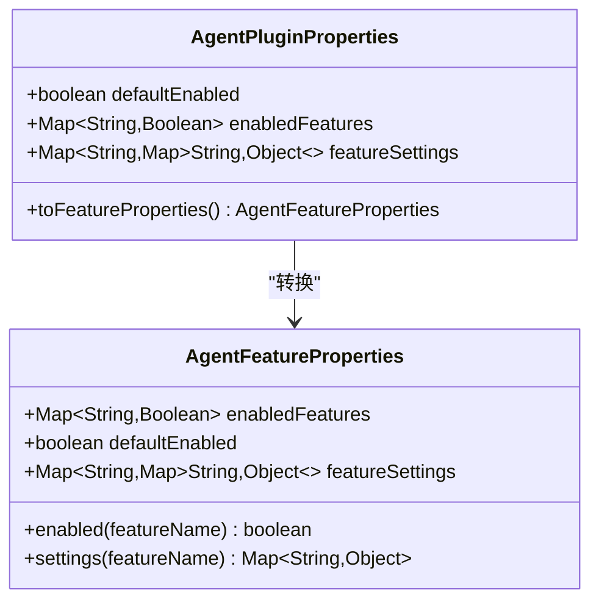

**图表来源**
- [AgentFeatureProperties.java:33-94](file://seahorse-agent-kernel/src/main/java/com/miracle/ai/seahorse/agent/kernel/plugin/AgentFeatureProperties.java#L33-L94)
- [AgentPluginProperties.java:32-64](file://seahorse-agent-spring-boot-starter/src/main/java/com/miracle/ai/seahorse/agent/adapters/spring/config/AgentPluginProperties.java#L32-L64)

**章节来源**
- [SeahorseRagSettingsController.java:35-374](file://seahorse-agent-adapter-web/src/main/java/com/miracle/ai/seahorse/agent/adapters/web/SeahorseRagSettingsController.java#L35-L374)
- [AgentFeatureProperties.java:64-94](file://seahorse-agent-kernel/src/main/java/com/miracle/ai/seahorse/agent/kernel/plugin/AgentFeatureProperties.java#L64-L94)
- [AgentPluginProperties.java:32-64](file://seahorse-agent-spring-boot-starter/src/main/java/com/miracle/ai/seahorse/agent/adapters/spring/config/AgentPluginProperties.java#L32-L64)

### 审计日志与合规追踪
- 审计事件查询：支持按actor、eventType、agentId、runId、tenantId、时间范围等条件分页查询
- 成本用量统计：支持按agent/model/tool/tenant维度聚合与时间分桶统计

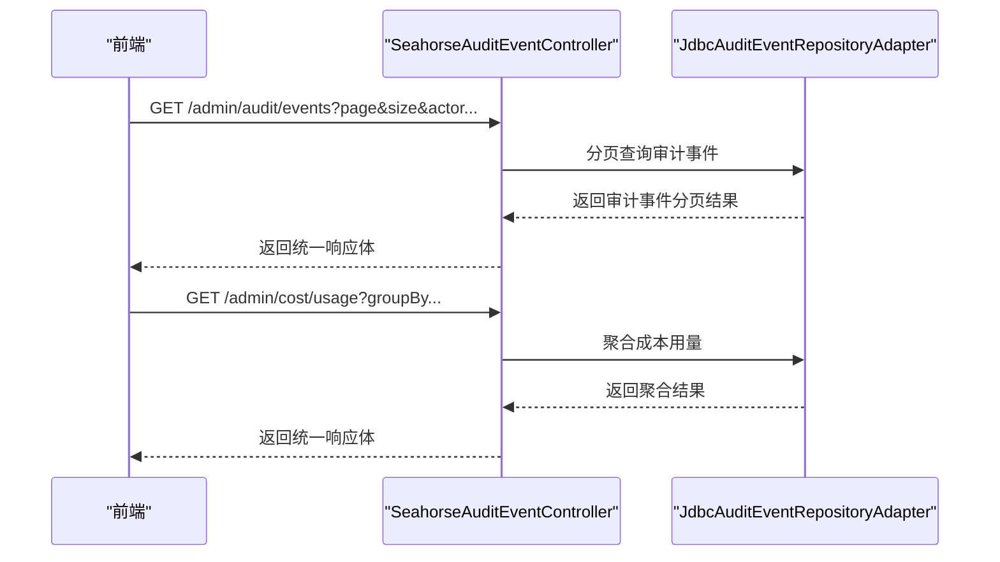

**图表来源**
- [SeahorseAuditEventController.java](file://seahorse-agent-adapter-web/src/main/java/com/miracle/ai/seahorse/agent/adapters/web/SeahorseAuditEventController.java)
- [SeahorseCostUsageController.java](file://seahorse-agent-adapter-web/src/main/java/com/miracle/ai/seahorse/agent/adapters/web/SeahorseCostUsageController.java)
- [JdbcAuditEventRepositoryAdapter.java:38-62](file://seahorse-agent-adapter-repository-jdbc/src/main/java/com/miracle/ai/seahorse/agent/adapters/repository/jdbc/JdbcAuditEventRepositoryAdapter.java#L38-L62)
- [JdbcCostUsageRepositoryAdapter.java](file://seahorse-agent-adapter-repository-jdbc/src/main/java/com/miracle/ai/seahorse/agent/adapters/repository/jdbc/JdbcCostUsageRepositoryAdapter.java)

**章节来源**
- [auditCostService.ts:45-53](file://frontend/src/services/auditCostService.ts#L45-L53)
- [AuditEventPage.tsx:20-26](file://frontend/src/pages/admin/audit/AuditEventPage.tsx#L20-L26)
- [SeahorseAuditEventController.java](file://seahorse-agent-adapter-web/src/main/java/com/miracle/ai/seahorse/agent/adapters/web/SeahorseAuditEventController.java)
- [SeahorseCostUsageController.java](file://seahorse-agent-adapter-web/src/main/java/com/miracle/ai/seahorse/agent/adapters/web/SeahorseCostUsageController.java)

### 权限与安全
- 登录态与角色：通过自定义认证接口返回用户角色，用于前端路由与页面元素的可见性控制
- 全局拦截：除特定放行路径外，所有管理后台接口均需登录态

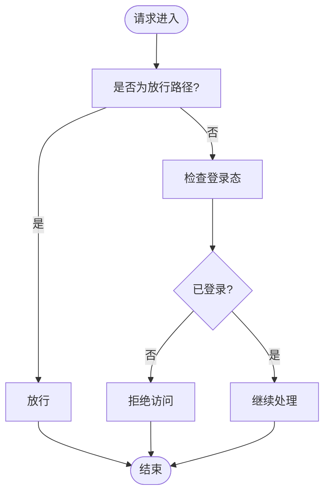

**图表来源**
- [SeahorseSecurityWebMvcConfiguration.java:30-51](file://seahorse-agent-adapter-web/src/main/java/com/miracle/ai/seahorse/agent/adapters/web/SeahorseSecurityWebMvcConfiguration.java#L30-L51)
- [SeahorseSaTokenStpInterface.java:36-49](file://seahorse-agent-adapter-web/src/main/java/com/miracle/ai/seahorse/agent/adapters/web/SeahorseSaTokenStpInterface.java#L36-L49)

**章节来源**
- [SeahorseSecurityWebMvcConfiguration.java:30-51](file://seahorse-agent-adapter-web/src/main/java/com/miracle/ai/seahorse/agent/adapters/web/SeahorseSecurityWebMvcConfiguration.java#L30-L51)
- [SeahorseSaTokenStpInterface.java:36-49](file://seahorse-agent-adapter-web/src/main/java/com/miracle/ai/seahorse/agent/adapters/web/SeahorseSaTokenStpInterface.java#L36-L49)

## 依赖关系分析
- 控制器与领域服务：控制器通过端口接口调用内核应用服务，解耦业务逻辑与传输协议
- 领域服务与持久化：应用服务通过JDBC适配器访问数据库，保证数据一致性与事务控制
- 前端与后端：前端通过服务封装调用后端接口，类型定义与响应结构在前后端保持一致

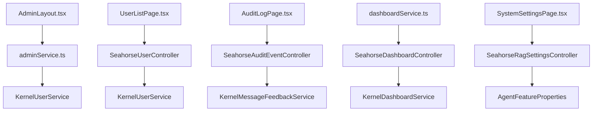

**图表来源**
- [AdminLayout.tsx:93-198](file://frontend/src/pages/admin/AdminLayout.tsx#L93-L198)
- [adminService.ts:41-77](file://frontend/src/services/adminService.ts#L41-L77)
- [UserListPage.tsx:187-296](file://frontend/src/pages/admin/users/UserListPage.tsx#L187-L296)
- [AuditLogPage.tsx:30-105](file://frontend/src/pages/admin/audit/AuditLogPage.tsx#L30-L105)
- [dashboardService.ts:50-70](file://frontend/src/services/dashboardService.ts#L50-L70)
- [SystemSettingsPage.tsx:25-34](file://frontend/src/pages/admin/settings/SystemSettingsPage.tsx#L25-L34)
- [SeahorseUserController.java:37-93](file://seahorse-agent-adapter-web/src/main/java/com/miracle/ai/seahorse/agent/adapters/web/SeahorseUserController.java#L37-L93)
- [SeahorseAuditEventController.java](file://seahorse-agent-adapter-web/src/main/java/com/miracle/ai/seahorse/agent/adapters/web/SeahorseAuditEventController.java)
- [SeahorseDashboardController.java:33-65](file://seahorse-agent-adapter-web/src/main/java/com/miracle/ai/seahorse/agent/adapters/web/SeahorseDashboardController.java#L33-L65)
- [SeahorseRagSettingsController.java:35-374](file://seahorse-agent-adapter-web/src/main/java/com/miracle/ai/seahorse/agent/adapters/web/SeahorseRagSettingsController.java#L35-L374)
- [KernelUserService.java:35-51](file://seahorse-agent-kernel/src/main/java/com/miracle/ai/seahorse/agent/kernel/application/user/KernelUserService.java#L35-L51)
- [KernelDashboardService.java:31-37](file://seahorse-agent-kernel/src/main/java/com/miracle/ai/seahorse/agent/kernel/application/dashboard/KernelDashboardService.java#L31-L37)
- [KernelMessageFeedbackService.java:33-39](file://seahorse-agent-kernel/src/main/java/com/miracle/ai/seahorse/agent/kernel/application/feedback/KernelMessageFeedbackService.java#L33-L39)
- [AgentFeatureProperties.java:33-94](file://seahorse-agent-kernel/src/main/java/com/miracle/ai/seahorse/agent/kernel/plugin/AgentFeatureProperties.java#L33-L94)

**章节来源**
- [2026-05-31-frontend-backend-alignment.md:209-231](file://docs/superpowers/plans/2026-05-31-frontend-backend-alignment.md#L209-L231)

## 性能考虑
- 数据缓存：仪表盘与用户分页查询可引入本地或Redis缓存，针对高频窗口（如24h）设置合理TTL，降低数据库压力
- 批量查询：用户列表与审计事件查询支持分页与条件过滤，建议前端按需加载，后端使用索引列进行高效分页
- 实时更新：趋势图与性能指标建议采用定时刷新策略，结合增量更新减少全量计算开销
- SQL优化：审计与成本统计涉及多维聚合，应确保相关列建立合适索引，避免全表扫描
- 前端分页：前端页面组件已内置分页逻辑，建议与后端分页参数保持一致，避免一次性拉取大量数据
- 管理员功能优化：租户管理、用户管理、审计日志查询等高级功能建议实现智能缓存和批量操作，提升管理效率

## 故障排查指南
- 用户管理接口异常
  - 检查控制器参数绑定与入站端口调用链路
  - 关注测试用例中的断言与Mock行为，定位问题点
- 管理员功能异常
  - 检查adminService.ts接口调用与参数传递
  - 验证租户管理、用户管理、审计日志查询的权限控制
- 仪表盘数据为空
  - 核对时间窗口参数与数据库统计逻辑
  - 检查JDBC适配器的SQL构建与聚合函数
- 审计日志查询失败
  - 确认查询条件与分页参数是否正确传递
  - 检查数据库schema与列映射是否匹配
- 权限控制失效
  - 核对全局拦截配置与放行路径
  - 检查Sa-Token角色返回逻辑与前端路由可见性

**章节来源**
- [SeahorseUserControllerTests.java:60-75](file://seahorse-agent-tests/src/test/java/com/miracle/ai/seahorse/agent/adapters/web/SeahorseUserControllerTests.java#L60-L75)
- [SeahorseWebApiContractTests.java:217-271](file://seahorse-agent-tests/src/test/java/com/miracle/ai/seahorse/agent/adapters/web/SeahorseWebApiContractTests.java#L217-L271)
- [JdbcAuditEventRepositoryAdapter.java:38-62](file://seahorse-agent-adapter-repository-jdbc/src/main/java/com/miracle/ai/seahorse/agent/adapters/repository/jdbc/JdbcAuditEventRepositoryAdapter.java#L38-L62)
- [SeahorseSecurityWebMvcConfiguration.java:30-51](file://seahorse-agent-adapter-web/src/main/java/com/miracle/ai/seahorse/agent/adapters/web/SeahorseSecurityWebMvcConfiguration.java#L30-L51)

## 结论
管理后台服务通过清晰的分层架构与端口接口，实现了用户管理、仪表盘统计、系统配置、审计日志与合规追踪等核心能力。配合前端服务封装与页面组件，形成完整的管理后台解决方案。新增的管理员服务层进一步增强了平台的管理能力，包括租户管理、用户管理、审计日志查询等功能。建议在生产环境中进一步完善缓存策略、SQL优化与前端分页体验，持续提升系统稳定性与用户体验。

## 附录
- API使用指南与最佳实践
  - 统一响应体：所有管理接口返回统一结构，包含状态码与数据载体
  - 参数校验：前端提交参数需满足后端约束，避免无效请求
  - 错误处理：前端捕获错误并友好提示，后端记录异常日志便于排查
  - 权限控制：严格区分管理员与普通用户，避免越权访问
  - 管理员功能：租户管理、用户管理、审计日志查询等高级功能需严格权限控制

**章节来源**
- [系统管理接口.md:27-35](file://docs/zh/content/API 接口文档/系统管理接口.md#L27-L35)
- [UserListPage.tsx:25-34](file://frontend/src/pages/admin/users/UserListPage.tsx#L25-L34)
- [AuditLogPage.tsx:20-26](file://frontend/src/pages/admin/audit/AuditLogPage.tsx#L20-L26)
- [SystemSettingsPage.tsx:25-34](file://frontend/src/pages/admin/settings/SystemSettingsPage.tsx#L25-L34)