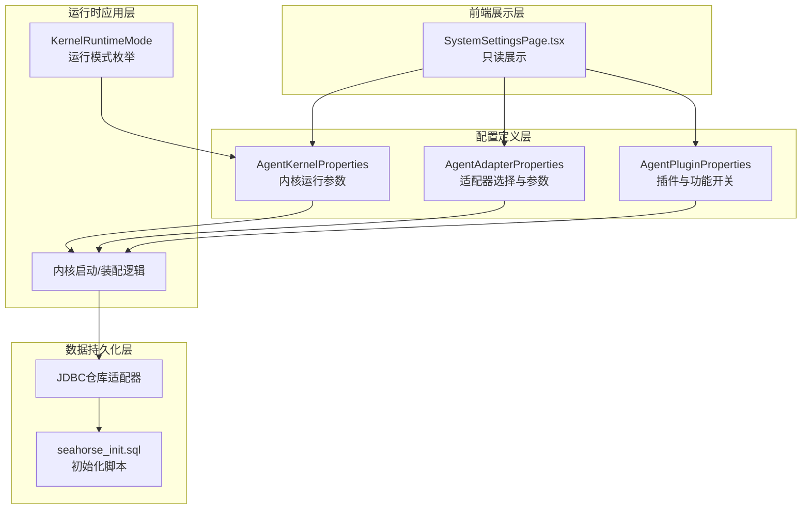
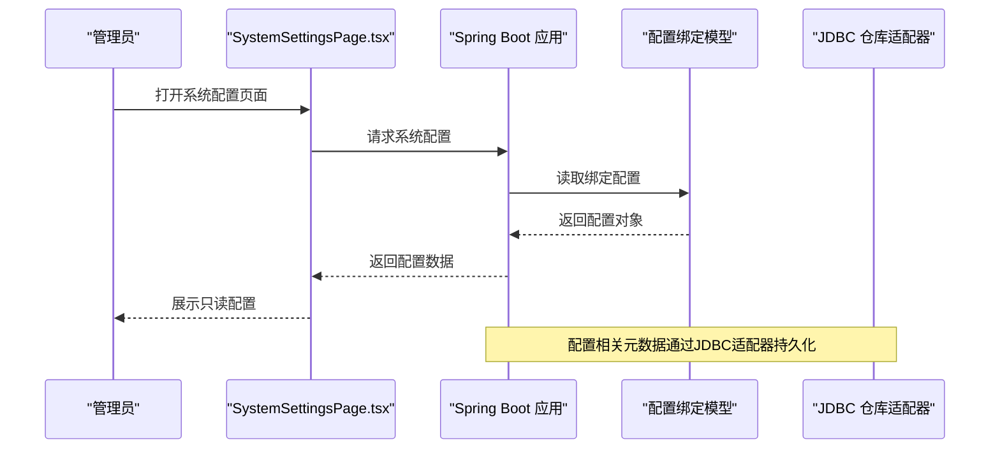
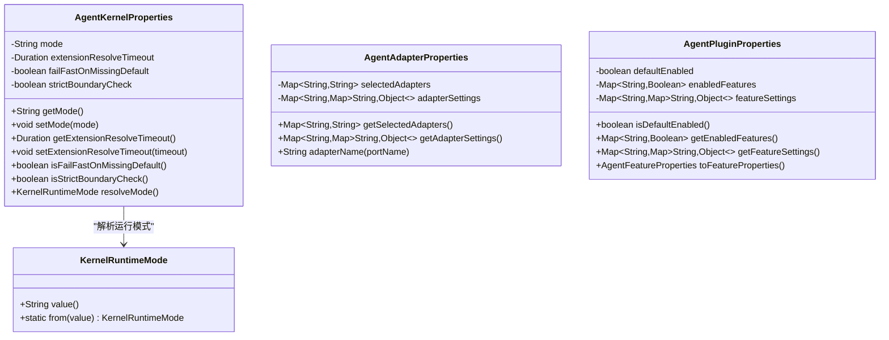
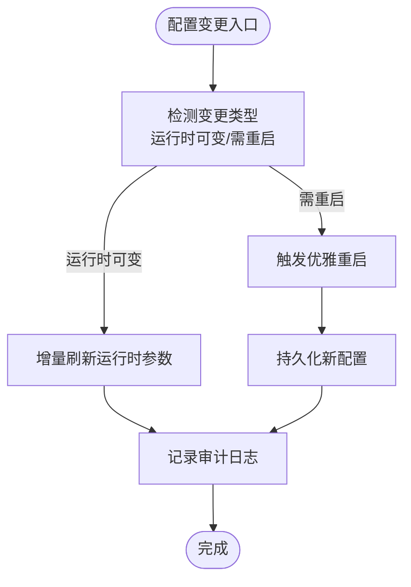
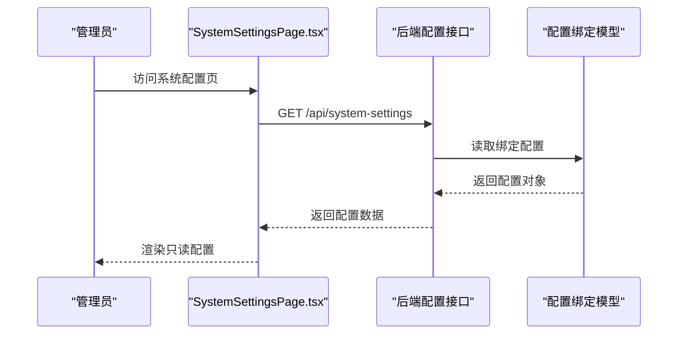
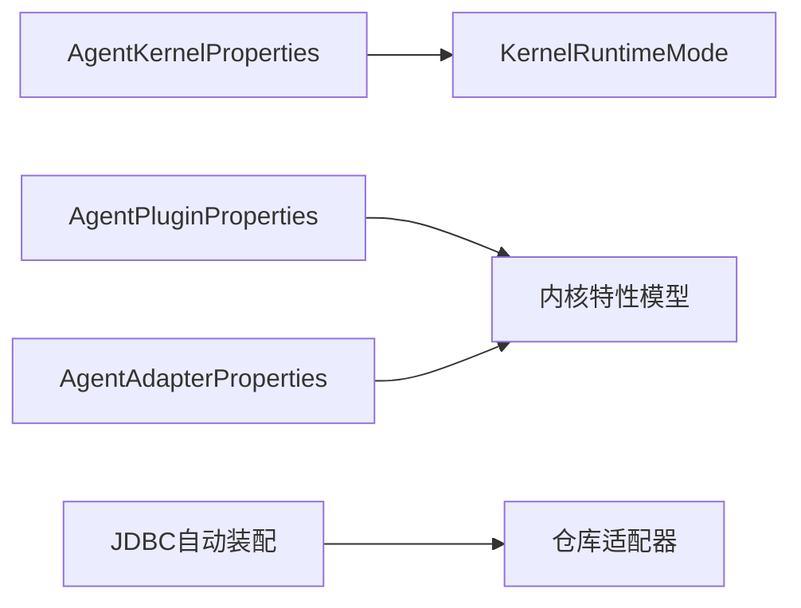

# 系统配置服务

<cite>
**本文引用的文件**
- [KernelRuntimeMode.java](file://seahorse-agent-kernel/src/main/java/com/miracle/ai/seahorse/agent/kernel/config/KernelRuntimeMode.java)
- [AgentKernelProperties.java](file://seahorse-agent-spring-boot-starter/src/main/java/com/miracle/ai/seahorse/agent/adapters/spring/config/AgentKernelProperties.java)
- [AgentAdapterProperties.java](file://seahorse-agent-spring-boot-starter/src/main/java/com/miracle/ai/seahorse/agent/adapters/spring/config/AgentAdapterProperties.java)
- [AgentPluginProperties.java](file://seahorse-agent-spring-boot-starter/src/main/java/com/miracle/ai/seahorse/agent/adapters/spring/config/AgentPluginProperties.java)
- [SystemSettingsPage.tsx](file://frontend/src/pages/admin/settings/SystemSettingsPage.tsx)
- [AiModelConfigRepositoryPort.java](file://seahorse-agent-kernel/src/main/java/com/miracle/ai/seahorse/agent/ports/outbound/config/AiModelConfigRepositoryPort.java)
- [SeahorseAgentMemoryRepositoryAutoConfiguration.java](file://seahorse-agent-spring-boot-starter/src/main/java/com/miracle/ai/seahorse/agent/adapters/spring/SeahorseAgentMemoryRepositoryAutoConfiguration.java)
- [application.properties](file://seahorse-agent-bootstrap/src/main/resources/application.properties)
- [seahorse_init.sql](file://resources/database/seahorse_init.sql)
- [2026-05-20-memory-filtering-architecture.md](file://docs/aegis/specs/2026-05-20-memory-filtering-architecture.md)
- [2026-05-25-gemini-memory-alignment-current-state.md](file://docs/aegis/specs/2026-05-25-gemini-memory-alignment-current-state.md)
</cite>

## 目录
1. [引言](#引言)
2. [项目结构](#项目结构)
3. [核心组件](#核心组件)
4. [架构总览](#架构总览)
5. [详细组件分析](#详细组件分析)
6. [依赖关系分析](#依赖关系分析)
7. [性能考虑](#性能考虑)
8. [故障排除指南](#故障排除指南)
9. [结论](#结论)
10. [附录](#附录)

## 引言
本文件面向系统配置服务，围绕“全局设置、功能开关、参数调整与配置模板”的主题，系统性梳理配置数据模型、配置管理机制（读取、写入、版本与变更历史）、系统参数分类（性能、安全、功能开关、第三方集成）、配置生效机制（热更新/重启生效/回滚）以及安全与审计要点，并提供面向开发者的扩展与自定义指南。本文以后端Spring Boot配置绑定模型为核心，结合前端只读展示页面与数据库初始化脚本，形成从配置定义到运行时应用的完整闭环。

## 项目结构
系统配置服务由以下层次构成：
- 配置定义层：Spring Boot配置属性类，负责将application配置绑定到强类型对象，支持内核运行模式、适配器选择、插件功能开关与参数。
- 运行时应用层：内核在启动或运行期解析配置，决定组件装配与行为边界。
- 数据持久化层：通过JDBC适配器将配置相关元数据落库，配合初始化脚本建立基础表结构。
- 前端展示层：管理员界面只读展示当前运行时配置，来源为部署环境与application配置。

**图表来源**
- [AgentKernelProperties.java:29-76](file://seahorse-agent-spring-boot-starter/src/main/java/com/miracle/ai/seahorse/agent/adapters/spring/config/AgentKernelProperties.java#L29-L76)
- [AgentAdapterProperties.java:29-57](file://seahorse-agent-spring-boot-starter/src/main/java/com/miracle/ai/seahorse/agent/adapters/spring/config/AgentAdapterProperties.java#L29-L57)
- [AgentPluginProperties.java:30-64](file://seahorse-agent-spring-boot-starter/src/main/java/com/miracle/ai/seahorse/agent/adapters/spring/config/AgentPluginProperties.java#L30-L64)
- [KernelRuntimeMode.java:25-46](file://seahorse-agent-kernel/src/main/java/com/miracle/ai/seahorse/agent/kernel/config/KernelRuntimeMode.java#L25-L46)
- [SeahorseAgentMemoryRepositoryAutoConfiguration.java:119-327](file://seahorse-agent-spring-boot-starter/src/main/java/com/miracle/ai/seahorse/agent/adapters/spring/SeahorseAgentMemoryRepositoryAutoConfiguration.java#L119-L327)
- [seahorse_init.sql](file://resources/database/seahorse_init.sql)

**章节来源**
- [AgentKernelProperties.java:29-76](file://seahorse-agent-spring-boot-starter/src/main/java/com/miracle/ai/seahorse/agent/adapters/spring/config/AgentKernelProperties.java#L29-L76)
- [AgentAdapterProperties.java:29-57](file://seahorse-agent-spring-boot-starter/src/main/java/com/miracle/ai/seahorse/agent/adapters/spring/config/AgentAdapterProperties.java#L29-L57)
- [AgentPluginProperties.java:30-64](file://seahorse-agent-spring-boot-starter/src/main/java/com/miracle/ai/seahorse/agent/adapters/spring/config/AgentPluginProperties.java#L30-L64)
- [KernelRuntimeMode.java:25-46](file://seahorse-agent-kernel/src/main/java/com/miracle/ai/seahorse/agent/kernel/config/KernelRuntimeMode.java#L25-L46)
- [SeahorseAgentMemoryRepositoryAutoConfiguration.java:119-327](file://seahorse-agent-spring-boot-starter/src/main/java/com/miracle/ai/seahorse/agent/adapters/spring/SeahorseAgentMemoryRepositoryAutoConfiguration.java#L119-L327)
- [seahorse_init.sql](file://resources/database/seahorse_init.sql)

## 核心组件
- 内核运行模式（KernelRuntimeMode）
  - 定义内核运行模式枚举，支持从字符串解析并归一化，用于控制内核行为边界与兼容性。
- 内核配置属性（AgentKernelProperties）
  - 绑定前缀“seahorse-agent.kernel”，包含运行模式、扩展解析超时、缺失默认失败策略、边界检查严格性等。
- 适配器配置属性（AgentAdapterProperties）
  - 绑定前缀“seahorse-agent.adapters”，包含适配器选择映射与适配器参数字典，支持按端口名选择具体适配器。
- 插件配置属性（AgentPluginProperties）
  - 绑定前缀“seahorse-agent.plugins”，包含默认启用状态、功能开关映射与功能参数字典，并可转换为内核特征属性模型。
- 前端系统配置展示（SystemSettingsPage.tsx）
  - 提供只读展示当前运行时配置，来源于后端配置绑定模型与部署环境变量。

**章节来源**
- [KernelRuntimeMode.java:25-46](file://seahorse-agent-kernel/src/main/java/com/miracle/ai/seahorse/agent/kernel/config/KernelRuntimeMode.java#L25-L46)
- [AgentKernelProperties.java:29-76](file://seahorse-agent-spring-boot-starter/src/main/java/com/miracle/ai/seahorse/agent/adapters/spring/config/AgentKernelProperties.java#L29-L76)
- [AgentAdapterProperties.java:29-57](file://seahorse-agent-spring-boot-starter/src/main/java/com/miracle/ai/seahorse/agent/adapters/spring/config/AgentAdapterProperties.java#L29-L57)
- [AgentPluginProperties.java:30-64](file://seahorse-agent-spring-boot-starter/src/main/java/com/miracle/ai/seahorse/agent/adapters/spring/config/AgentPluginProperties.java#L30-L64)
- [SystemSettingsPage.tsx:25-79](file://frontend/src/pages/admin/settings/SystemSettingsPage.tsx#L25-L79)

## 架构总览
系统配置服务遵循“配置定义—运行时解析—持久化—前端展示”的闭环：
- 配置定义：通过@ConfigurationProperties将application配置绑定到强类型对象。
- 运行时解析：内核在启动或运行期读取配置，决定组件装配与行为。
- 持久化：JDBC适配器将配置相关元数据写入数据库，初始化脚本提供基础表结构。
- 前端展示：管理员界面只读展示当前运行时配置，便于运维与审计。

**图表来源**
- [SystemSettingsPage.tsx:25-79](file://frontend/src/pages/admin/settings/SystemSettingsPage.tsx#L25-L79)
- [AgentKernelProperties.java:29-76](file://seahorse-agent-spring-boot-starter/src/main/java/com/miracle/ai/seahorse/agent/adapters/spring/config/AgentKernelProperties.java#L29-L76)
- [AgentAdapterProperties.java:29-57](file://seahorse-agent-spring-boot-starter/src/main/java/com/miracle/ai/seahorse/agent/adapters/spring/config/AgentAdapterProperties.java#L29-L57)
- [AgentPluginProperties.java:30-64](file://seahorse-agent-spring-boot-starter/src/main/java/com/miracle/ai/seahorse/agent/adapters/spring/config/AgentPluginProperties.java#L30-L64)
- [SeahorseAgentMemoryRepositoryAutoConfiguration.java:119-327](file://seahorse-agent-spring-boot-starter/src/main/java/com/miracle/ai/seahorse/agent/adapters/spring/SeahorseAgentMemoryRepositoryAutoConfiguration.java#L119-L327)

## 详细组件分析

### 配置数据模型
- 内核运行模式（KernelRuntimeMode）
  - 作用：统一内核运行模式，支持字符串到枚举的归一化解析。
  - 关键点：空值与空白值的默认行为、大小写与连字符规范化。
- 内核配置属性（AgentKernelProperties）
  - 字段：mode、extensionResolveTimeout、failFastOnMissingDefault、strictBoundaryCheck。
  - 默认值：运行模式默认kernel；扩展解析超时默认毫秒级阈值。
  - 解析：resolveMode()将字符串模式解析为枚举。
- 适配器配置属性（AgentAdapterProperties）
  - 字段：selectedAdapters（端口名→适配器名）、adapterSettings（适配器参数字典）。
  - 方法：adapterName(portName)按端口名返回选中的适配器名。
- 插件配置属性（AgentPluginProperties）
  - 字段：defaultEnabled、enabledFeatures、featureSettings。
  - 转换：toFeatureProperties()输出内核特征属性模型，便于内核消费。

**图表来源**
- [KernelRuntimeMode.java:25-46](file://seahorse-agent-kernel/src/main/java/com/miracle/ai/seahorse/agent/kernel/config/KernelRuntimeMode.java#L25-L46)
- [AgentKernelProperties.java:29-76](file://seahorse-agent-spring-boot-starter/src/main/java/com/miracle/ai/seahorse/agent/adapters/spring/config/AgentKernelProperties.java#L29-L76)
- [AgentAdapterProperties.java:29-57](file://seahorse-agent-spring-boot-starter/src/main/java/com/miracle/ai/seahorse/agent/adapters/spring/config/AgentAdapterProperties.java#L29-L57)
- [AgentPluginProperties.java:30-64](file://seahorse-agent-spring-boot-starter/src/main/java/com/miracle/ai/seahorse/agent/adapters/spring/config/AgentPluginProperties.java#L30-L64)

**章节来源**
- [KernelRuntimeMode.java:25-46](file://seahorse-agent-kernel/src/main/java/com/miracle/ai/seahorse/agent/kernel/config/KernelRuntimeMode.java#L25-L46)
- [AgentKernelProperties.java:29-76](file://seahorse-agent-spring-boot-starter/src/main/java/com/miracle/ai/seahorse/agent/adapters/spring/config/AgentKernelProperties.java#L29-L76)
- [AgentAdapterProperties.java:29-57](file://seahorse-agent-spring-boot-starter/src/main/java/com/miracle/ai/seahorse/agent/adapters/spring/config/AgentAdapterProperties.java#L29-L57)
- [AgentPluginProperties.java:30-64](file://seahorse-agent-spring-boot-starter/src/main/java/com/miracle/ai/seahorse/agent/adapters/spring/config/AgentPluginProperties.java#L30-L64)

### 配置管理机制
- 配置读取
  - Spring Boot通过@ConfigurationProperties将application配置绑定到上述属性类，支持命名空间分组与默认值处理。
- 配置写入
  - 当前代码库未直接暴露写接口。配置写入通常通过以下路径实现：
    - 运维侧：修改application配置文件或环境变量，重启应用生效。
    - 管理端：若需在线修改，可在后端新增配置写入端点与持久化逻辑（见“扩展与自定义指南”）。
- 版本控制与变更历史
  - 当前未发现版本控制与变更历史记录的实现。建议引入配置版本表与审计日志表，记录变更人、时间、前后值与审批流程。
- 生效机制
  - 运行时读取：通过属性类在启动或运行期读取。
  - 热更新：当前未实现热更新。如需热更新，应区分“运行时可变参数”与“需要重启生效的参数”，并提供增量刷新策略。
  - 回滚策略：建议在写入端点中增加原子性与幂等性保障，失败时回滚至上一个有效版本。

[此图为概念流程图，不直接映射具体源码文件]

**章节来源**
- [AgentKernelProperties.java:29-76](file://seahorse-agent-spring-boot-starter/src/main/java/com/miracle/ai/seahorse/agent/adapters/spring/config/AgentKernelProperties.java#L29-L76)
- [AgentAdapterProperties.java:29-57](file://seahorse-agent-spring-boot-starter/src/main/java/com/miracle/ai/seahorse/agent/adapters/spring/config/AgentAdapterProperties.java#L29-L57)
- [AgentPluginProperties.java:30-64](file://seahorse-agent-spring-boot-starter/src/main/java/com/miracle/ai/seahorse/agent/adapters/spring/config/AgentPluginProperties.java#L30-L64)

### 系统参数分类
- 性能配置
  - 示例：扩展解析超时（extensionResolveTimeout），用于控制内核扩展解析的容忍时间，避免阻塞启动。
- 安全设置
  - 示例：严格边界检查（strictBoundaryCheck），用于在边界校验上采取更严格的策略。
  - 建议：新增凭据与敏感字段保护策略（见“安全考虑”）。
- 功能开关
  - 示例：插件默认启用（defaultEnabled）、功能开关映射（enabledFeatures）、功能参数（featureSettings）。
- 第三方集成参数
  - 示例：适配器选择映射（selectedAdapters）与适配器参数（adapterSettings），用于按端口名选择具体适配器及其参数。

**章节来源**
- [AgentKernelProperties.java:29-76](file://seahorse-agent-spring-boot-starter/src/main/java/com/miracle/ai/seahorse/agent/adapters/spring/config/AgentKernelProperties.java#L29-L76)
- [AgentAdapterProperties.java:29-57](file://seahorse-agent-spring-boot-starter/src/main/java/com/miracle/ai/seahorse/agent/adapters/spring/config/AgentAdapterProperties.java#L29-L57)
- [AgentPluginProperties.java:30-64](file://seahorse-agent-spring-boot-starter/src/main/java/com/miracle/ai/seahorse/agent/adapters/spring/config/AgentPluginProperties.java#L30-L64)

### 配置生效与前端展示
- 前端只读展示
  - SystemSettingsPage.tsx负责拉取系统配置并展示，标签页中包含RAG默认配置与AI提供商列表等只读信息。
- 生效范围
  - 前端展示的数据来源于后端配置绑定模型与部署环境，属于“只读展示”，不改变后端实际配置。

**图表来源**
- [SystemSettingsPage.tsx:25-79](file://frontend/src/pages/admin/settings/SystemSettingsPage.tsx#L25-L79)
- [AgentKernelProperties.java:29-76](file://seahorse-agent-spring-boot-starter/src/main/java/com/miracle/ai/seahorse/agent/adapters/spring/config/AgentKernelProperties.java#L29-L76)
- [AgentAdapterProperties.java:29-57](file://seahorse-agent-spring-boot-starter/src/main/java/com/miracle/ai/seahorse/agent/adapters/spring/config/AgentAdapterProperties.java#L29-L57)
- [AgentPluginProperties.java:30-64](file://seahorse-agent-spring-boot-starter/src/main/java/com/miracle/ai/seahorse/agent/adapters/spring/config/AgentPluginProperties.java#L30-L64)

**章节来源**
- [SystemSettingsPage.tsx:25-79](file://frontend/src/pages/admin/settings/SystemSettingsPage.tsx#L25-L79)

### 配置模板与扩展点
- 配置模板
  - 可基于现有属性类定义模板：内核模板（运行模式、超时、边界检查）、适配器模板（端口名→适配器名映射与参数）、插件模板（默认启用、功能开关与参数）。
- 扩展点
  - 新增配置项：在对应属性类中添加字段与默认值，确保与application命名空间一致。
  - 新增适配器：通过selectedAdapters映射新增端口名与适配器名，配合adapterSettings传参。
  - 新增功能：通过enabledFeatures与featureSettings管理功能开关与参数。

**章节来源**
- [AgentKernelProperties.java:29-76](file://seahorse-agent-spring-boot-starter/src/main/java/com/miracle/ai/seahorse/agent/adapters/spring/config/AgentKernelProperties.java#L29-L76)
- [AgentAdapterProperties.java:29-57](file://seahorse-agent-spring-boot-starter/src/main/java/com/miracle/ai/seahorse/agent/adapters/spring/config/AgentAdapterProperties.java#L29-L57)
- [AgentPluginProperties.java:30-64](file://seahorse-agent-spring-boot-starter/src/main/java/com/miracle/ai/seahorse/agent/adapters/spring/config/AgentPluginProperties.java#L30-L64)

## 依赖关系分析
- 组件耦合
  - AgentKernelProperties依赖KernelRuntimeMode进行模式解析。
  - AgentPluginProperties提供转换方法，便于内核消费。
  - JDBC自动装配根据属性前缀条件装配仓库适配器，体现配置驱动的装配策略。
- 外部依赖
  - Spring Boot配置绑定、Jackson序列化、Spring JDBC与H2（测试）。

**图表来源**
- [AgentKernelProperties.java:29-76](file://seahorse-agent-spring-boot-starter/src/main/java/com/miracle/ai/seahorse/agent/adapters/spring/config/AgentKernelProperties.java#L29-L76)
- [KernelRuntimeMode.java:25-46](file://seahorse-agent-kernel/src/main/java/com/miracle/ai/seahorse/agent/kernel/config/KernelRuntimeMode.java#L25-L46)
- [AgentAdapterProperties.java:29-57](file://seahorse-agent-spring-boot-starter/src/main/java/com/miracle/ai/seahorse/agent/adapters/spring/config/AgentAdapterProperties.java#L29-L57)
- [AgentPluginProperties.java:30-64](file://seahorse-agent-spring-boot-starter/src/main/java/com/miracle/ai/seahorse/agent/adapters/spring/config/AgentPluginProperties.java#L30-L64)
- [SeahorseAgentMemoryRepositoryAutoConfiguration.java:119-327](file://seahorse-agent-spring-boot-starter/src/main/java/com/miracle/ai/seahorse/agent/adapters/spring/SeahorseAgentMemoryRepositoryAutoConfiguration.java#L119-L327)

**章节来源**
- [AgentKernelProperties.java:29-76](file://seahorse-agent-spring-boot-starter/src/main/java/com/miracle/ai/seahorse/agent/adapters/spring/config/AgentKernelProperties.java#L29-L76)
- [AgentAdapterProperties.java:29-57](file://seahorse-agent-spring-boot-starter/src/main/java/com/miracle/ai/seahorse/agent/adapters/spring/config/AgentAdapterProperties.java#L29-L57)
- [AgentPluginProperties.java:30-64](file://seahorse-agent-spring-boot-starter/src/main/java/com/miracle/ai/seahorse/agent/adapters/spring/config/AgentPluginProperties.java#L30-L64)
- [SeahorseAgentMemoryRepositoryAutoConfiguration.java:119-327](file://seahorse-agent-spring-boot-starter/src/main/java/com/miracle/ai/seahorse/agent/adapters/spring/SeahorseAgentMemoryRepositoryAutoConfiguration.java#L119-L327)

## 性能考虑
- 配置读取性能
  - 使用@ConfigurationProperties进行一次性绑定，避免频繁反射开销。
- 运行时解析成本
  - KernelRuntimeMode解析仅涉及字符串归一化与枚举查找，成本极低。
- 适配器与插件装配
  - 通过条件注解按需装配，减少不必要的Bean创建与初始化。

[本节为通用性能讨论，不直接分析具体文件]

## 故障排除指南
- 配置未生效
  - 检查application配置命名空间是否与@ConfigurationProperties前缀一致。
  - 确认属性类字段与默认值设置是否合理。
- 运行模式异常
  - 检查KernelRuntimeMode解析逻辑，确保输入字符串格式正确。
- 适配器选择无效
  - 检查selectedAdapters映射与adapterSettings参数是否匹配端口名与适配器实现。
- 插件功能未启用
  - 检查enabledFeatures与defaultEnabled设置，确认toFeatureProperties转换是否被调用。

**章节来源**
- [AgentKernelProperties.java:29-76](file://seahorse-agent-spring-boot-starter/src/main/java/com/miracle/ai/seahorse/agent/adapters/spring/config/AgentKernelProperties.java#L29-L76)
- [KernelRuntimeMode.java:25-46](file://seahorse-agent-kernel/src/main/java/com/miracle/ai/seahorse/agent/kernel/config/KernelRuntimeMode.java#L25-L46)
- [AgentAdapterProperties.java:29-57](file://seahorse-agent-spring-boot-starter/src/main/java/com/miracle/ai/seahorse/agent/adapters/spring/config/AgentAdapterProperties.java#L29-L57)
- [AgentPluginProperties.java:30-64](file://seahorse-agent-spring-boot-starter/src/main/java/com/miracle/ai/seahorse/agent/adapters/spring/config/AgentPluginProperties.java#L30-L64)

## 结论
系统配置服务以Spring Boot配置绑定为核心，提供了清晰的配置数据模型与运行时解析机制。当前实现侧重于“只读展示”与“按需装配”，尚未覆盖在线写入、版本控制与变更历史。建议在保持现有模型稳定的基础上，逐步引入配置写入端点、版本表与审计日志，完善热更新与回滚能力，并强化敏感信息保护与权限控制，以满足生产环境的治理需求。

[本节为总结性内容，不直接分析具体文件]

## 附录

### 开发者扩展与自定义指南
- 新增配置项
  - 在对应属性类中添加字段与默认值，确保@ConfigurationProperties前缀与application命名空间一致。
- 新增适配器
  - 在selectedAdapters中新增端口名→适配器名映射，在adapterSettings中补充参数。
- 新增功能开关
  - 在enabledFeatures中新增功能标识，默认值由defaultEnabled控制；在featureSettings中补充功能参数。
- 新增配置写入端点
  - 建议：
    - 定义配置写入请求体与响应体。
    - 实现幂等写入与原子性保障，失败时回滚至上一个有效版本。
    - 记录审计日志，包含变更人、时间、前后值与审批流程。
- 新增版本控制与变更历史
  - 建议：
    - 新增配置版本表与变更历史表。
    - 对敏感字段进行脱敏存储与展示。
- 新增热更新策略
  - 将“运行时可变参数”与“需要重启生效的参数”分离，提供增量刷新与优雅重启流程。

**章节来源**
- [AgentKernelProperties.java:29-76](file://seahorse-agent-spring-boot-starter/src/main/java/com/miracle/ai/seahorse/agent/adapters/spring/config/AgentKernelProperties.java#L29-L76)
- [AgentAdapterProperties.java:29-57](file://seahorse-agent-spring-boot-starter/src/main/java/com/miracle/ai/seahorse/agent/adapters/spring/config/AgentAdapterProperties.java#L29-L57)
- [AgentPluginProperties.java:30-64](file://seahorse-agent-spring-boot-starter/src/main/java/com/miracle/ai/seahorse/agent/adapters/spring/config/AgentPluginProperties.java#L30-L64)

### 安全考虑
- 敏感信息保护
  - 对配置中的密钥、令牌等敏感字段进行脱敏存储与展示；仅在必要时以加密形式传输。
- 权限控制
  - 配置写入端点需鉴权与授权，限制可变更范围与审批流程。
- 审计追踪
  - 记录所有配置变更事件，包括变更人、时间、前后值与审批状态，支持回溯与合规审计。

**章节来源**
- [SystemSettingsPage.tsx:25-79](file://frontend/src/pages/admin/settings/SystemSettingsPage.tsx#L25-L79)

### 数据模型与持久化
- 初始化脚本
  - seahorse_init.sql提供基础表结构，可用于承载配置相关元数据与审计日志。
- 仓库适配器
  - JDBC自动装配根据属性前缀条件装配，体现配置驱动的装配策略。

**章节来源**
- [seahorse_init.sql](file://resources/database/seahorse_init.sql)
- [SeahorseAgentMemoryRepositoryAutoConfiguration.java:119-327](file://seahorse-agent-spring-boot-starter/src/main/java/com/miracle/ai/seahorse/agent/adapters/spring/SeahorseAgentMemoryRepositoryAutoConfiguration.java#L119-L327)

### 相关文档与规范
- 内存过滤架构设计
  - 与配置相关的内存处理与过滤策略可参考相关架构文档。
- Gemini对齐现状
  - 配置与模型参数对齐可参考当前状态文档。

**章节来源**
- [2026-05-20-memory-filtering-architecture.md](file://docs/aegis/specs/2026-05-20-memory-filtering-architecture.md)
- [2026-05-25-gemini-memory-alignment-current-state.md](file://docs/aegis/specs/2026-05-25-gemini-memory-alignment-current-state.md)