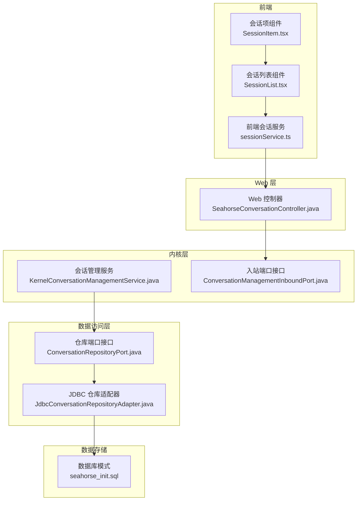
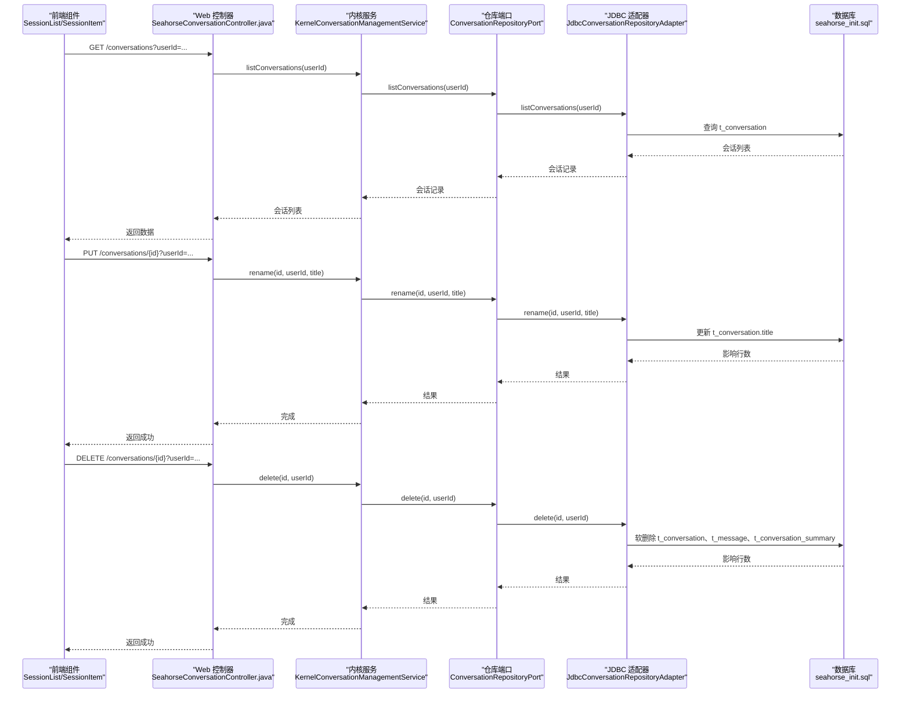
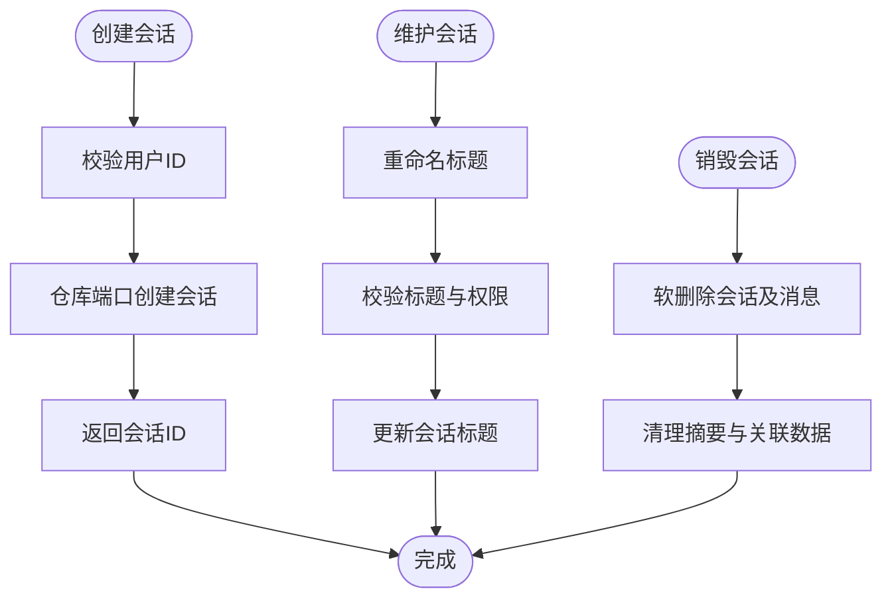
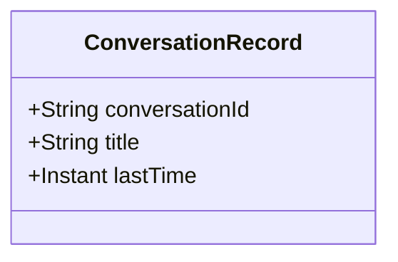
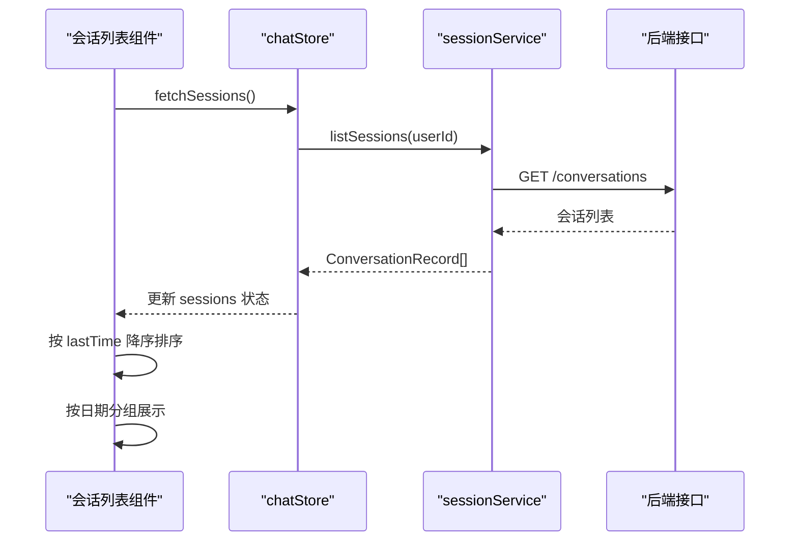
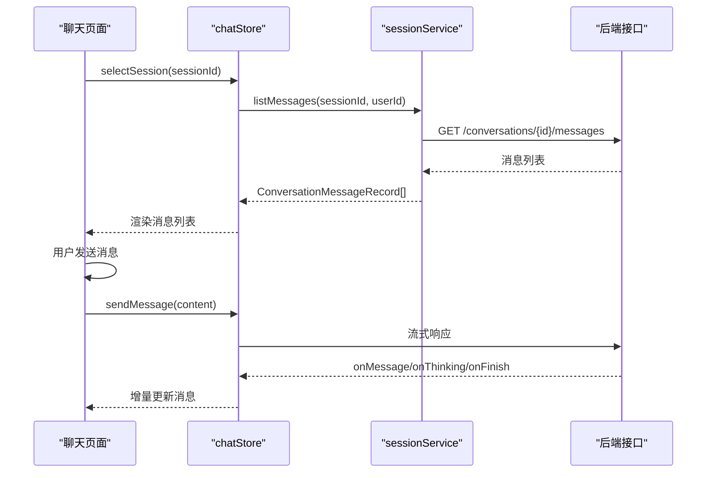
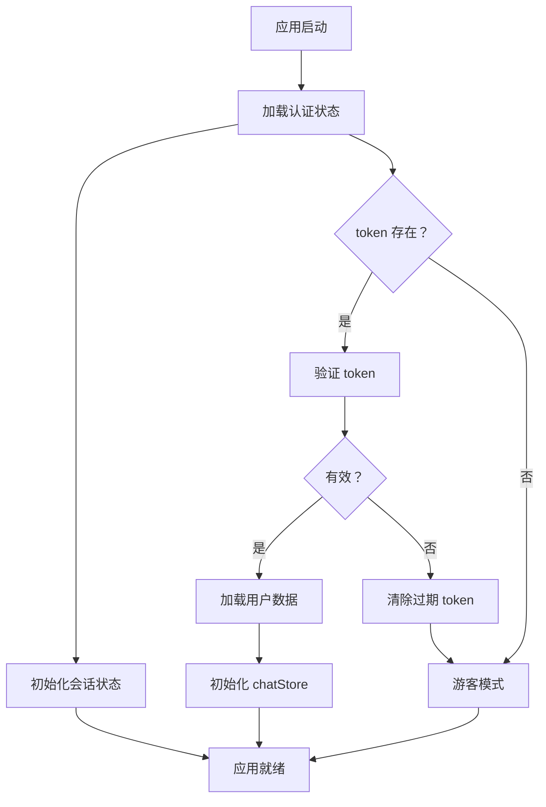
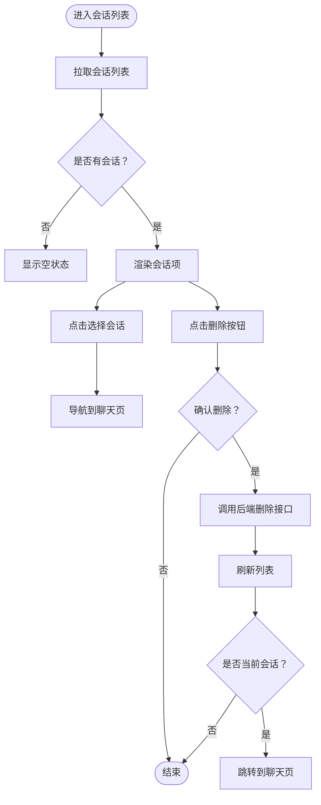
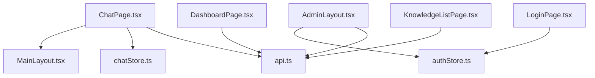

# 会话管理

<cite>
**本文引用的文件**
- [KernelConversationManagementService.java](file://seahorse-agent-kernel/src/main/java/com/miracle/ai/seahorse/agent/kernel/application/conversation/KernelConversationManagementService.java)
- [ConversationManagementInboundPort.java](file://seahorse-agent-kernel/src/main/java/com/miracle/ai/seahorse/agent/ports/inbound/conversation/ConversationManagementInboundPort.java)
- [ConversationRecord.java](file://seahorse-agent-kernel/src/main/java/com/miracle/ai/seahorse/agent/ports/outbound/conversation/ConversationRecord.java)
- [SeahorseAgentKernelOpsAutoConfiguration.java](file://seahorse-agent-spring-boot-starter/src/main/java/com/miracle/ai/seahorse/agent/adapters/spring/SeahorseAgentKernelOpsAutoConfiguration.java)
- [会话管理应用服务.md](file://docs/zh/content/后端系统/核心内核/应用服务层/会话管理应用服务.md)
- [sessionService.ts](file://frontend/src/services/sessionService.ts)
- [SessionList.tsx](file://frontend/src/components/session/SessionList.tsx)
- [SessionItem.tsx](file://frontend/src/components/session/SessionItem.tsx)
- [chatStore.ts](file://frontend/src/stores/chatStore.ts)
- [chatSessionUtils.ts](file://frontend/src/stores/chatSessionUtils.ts)
- [Sidebar.tsx](file://frontend/src/components/layout/Sidebar.tsx)
- [api.ts](file://frontend/src/services/api.ts)
- [storage.ts](file://frontend/src/utils/storage.ts)
- [seahorse_init.sql](file://resources/database/seahorse_init.sql)
</cite>

## 目录
1. [简介](#简介)
2. [项目结构](#项目结构)
3. [核心组件](#核心组件)
4. [架构概览](#架构概览)
5. [详细组件分析](#详细组件分析)
6. [依赖分析](#依赖分析)
7. [性能考虑](#性能考虑)
8. [故障排查指南](#故障排查指南)
9. [结论](#结论)
10. [附录](#附录)

## 简介
本文件面向“会话管理应用服务”的技术实现，围绕 KernelConversationManagementService 的核心职责展开，系统性阐述会话的创建、维护、查询与删除流程；详解会话状态管理、多轮对话上下文保持、消息历史存储与会话元数据管理；明确会话与用户的关联关系、权限控制与访问管理；给出消息持久化、会话清理策略与性能优化建议；并提供可扩展的实现细节与业务场景示例。

## 项目结构
会话管理能力由“内核层应用服务 + 适配器端口 + 数据访问适配器 + Web 控制器 + 前端服务”协同实现，采用分层与端口适配器模式，确保内核逻辑与外部依赖解耦。

**图表来源**
- [会话管理应用服务.md:37-65](file://docs/zh/content/后端系统/核心内核/应用服务层/会话管理应用服务.md#L37-L65)

**章节来源**
- [会话管理应用服务.md:34-65](file://docs/zh/content/后端系统/核心内核/应用服务层/会话管理应用服务.md#L34-L65)

## 核心组件
- 内核服务：KernelConversationManagementService 提供会话创建、查询、重命名、删除与消息列表查询能力
- 入站端口：ConversationManagementInboundPort 定义会话管理的标准接口契约
- 会话记录：ConversationRecord 定义会话摘要的数据结构
- 前端服务：sessionService.ts 提供会话列表、重命名、删除、消息查询等前端接口封装
- 前端状态：chatStore.ts 管理会话列表、当前会话、消息等状态
- 前端组件：SessionList.tsx 和 SessionItem.tsx 实现会话列表与单项的 UI 交互

**章节来源**
- [KernelConversationManagementService.java:31-86](file://seahorse-agent-kernel/src/main/java/com/miracle/ai/seahorse/agent/kernel/application/conversation/KernelConversationManagementService.java#L31-L86)
- [ConversationManagementInboundPort.java:28-37](file://seahorse-agent-kernel/src/main/java/com/miracle/ai/seahorse/agent/ports/inbound/conversation/ConversationManagementInboundPort.java#L28-L37)
- [ConversationRecord.java:22-26](file://seahorse-agent-kernel/src/main/java/com/miracle/ai/seahorse/agent/ports/outbound/conversation/ConversationRecord.java#L22-L26)
- [sessionService.ts:1-35](file://frontend/src/services/sessionService.ts#L1-L35)
- [chatStore.ts:1-528](file://frontend/src/stores/chatStore.ts#L1-L528)

## 架构概览
下图展示了从 Web 控制器到内核服务再到数据访问层的调用链路，以及与数据库表结构的对应关系。

**图表来源**
- [会话管理应用服务.md:104-142](file://docs/zh/content/后端系统/核心内核/应用服务层/会话管理应用服务.md#L104-L142)

**章节来源**
- [会话管理应用服务.md:101-142](file://docs/zh/content/后端系统/核心内核/应用服务层/会话管理应用服务.md#L101-L142)

## 详细组件分析

### 会话生命周期管理
- 创建：内核服务接收用户 ID，委托仓库端口创建新会话并返回会话标识
- 维护：通过重命名接口更新会话标题，支持权限校验与存在性检查
- 销毁：删除接口执行软删除，清理会话及其消息与摘要记录

**图表来源**
- [KernelConversationManagementService.java:41-71](file://seahorse-agent-kernel/src/main/java/com/miracle/ai/seahorse/agent/kernel/application/conversation/KernelConversationManagementService.java#L41-L71)

**章节来源**
- [KernelConversationManagementService.java:41-71](file://seahorse-agent-kernel/src/main/java/com/miracle/ai/seahorse/agent/kernel/application/conversation/KernelConversationManagementService.java#L41-L71)

### 会话数据结构
- 会话标识：String 类型的 conversationId
- 会话标题：String 类型的 title
- 最后活动时间：Instant 类型的 lastTime
- 会话记录对象：ConversationRecord 封装上述字段

**图表来源**
- [ConversationRecord.java:22-26](file://seahorse-agent-kernel/src/main/java/com/miracle/ai/seahorse/agent/ports/outbound/conversation/ConversationRecord.java#L22-L26)

**章节来源**
- [ConversationRecord.java:22-26](file://seahorse-agent-kernel/src/main/java/com/miracle/ai/seahorse/agent/ports/outbound/conversation/ConversationRecord.java#L22-L26)

### 会话列表获取与管理
- 列表查询：前端通过 sessionService.ts 调用后端接口获取会话列表
- 排序规则：前端按最后活动时间降序排列，确保最新会话优先显示
- 分组展示：侧边栏根据最后活动时间分组（今天、7天内、30天内、更早）

**图表来源**
- [SessionList.tsx:12-57](file://frontend/src/components/session/SessionList.tsx#L12-L57)
- [chatStore.ts:1-528](file://frontend/src/stores/chatStore.ts#L1-L528)
- [chatSessionUtils.ts:9-23](file://frontend/src/stores/chatSessionUtils.ts#L9-L23)
- [Sidebar.tsx:87-114](file://frontend/src/components/layout/Sidebar.tsx#L87-L114)

**章节来源**
- [SessionList.tsx:12-57](file://frontend/src/components/session/SessionList.tsx#L12-L57)
- [chatSessionUtils.ts:9-23](file://frontend/src/stores/chatSessionUtils.ts#L9-L23)
- [Sidebar.tsx:87-114](file://frontend/src/components/layout/Sidebar.tsx#L87-L114)

### 会话历史加载与缓存策略
- 历史加载：前端通过 sessionService.ts 的 listMessages 接口获取消息历史
- 本地缓存：chatStore.ts 维护会话与消息的本地状态，支持增量更新
- 增量更新：消息到达时按消息 ID 合并更新，避免全量刷新

**图表来源**
- [sessionService.ts:1-35](file://frontend/src/services/sessionService.ts#L1-L35)
- [chatStore.ts:1-528](file://frontend/src/stores/chatStore.ts#L1-L528)

**章节来源**
- [sessionService.ts:1-35](file://frontend/src/services/sessionService.ts#L1-L35)
- [chatStore.ts:1-528](file://frontend/src/stores/chatStore.ts#L1-L528)

### 会话状态持久化机制
- 会话状态：chatStore.ts 管理当前会话、消息列表、生成状态等
- 用户认证：storage.ts 提供本地存储封装，持久化 token 与用户信息
- 跨设备同步：通过后端会话与消息的统一存储实现跨设备一致性

**图表来源**
- [storage.ts:31-66](file://frontend/src/utils/storage.ts#L31-L66)
- [chatStore.ts:1-528](file://frontend/src/stores/chatStore.ts#L1-L528)

**章节来源**
- [storage.ts:31-66](file://frontend/src/utils/storage.ts#L31-L66)
- [chatStore.ts:1-528](file://frontend/src/stores/chatStore.ts#L1-L528)

### 前端集成与用户交互
- 会话服务：listSessions、renameSession、deleteSession、listMessages
- 会话列表组件：自动拉取会话列表，支持选择与删除
- 会话项组件：支持删除确认弹窗，删除后若为当前会话则跳转至聊天页

**图表来源**
- [会话管理应用服务.md:282-298](file://docs/zh/content/后端系统/核心内核/应用服务层/会话管理应用服务.md#L282-L298)

**章节来源**
- [会话管理应用服务.md:274-298](file://docs/zh/content/后端系统/核心内核/应用服务层/会话管理应用服务.md#L274-L298)

## 依赖分析
- 组件耦合
  - 页面组件依赖布局组件与状态存储，布局组件依赖状态存储中的用户与会话信息
  - 管理后台页面共享 AdminLayout，内部通过 Outlet 渲染子页面
- 外部依赖
  - 路由：react-router-dom
  - 状态：zustand
  - 网络：axios + 自定义拦截器
  - UI：项目内组件库（Button、Input、Dialog、Table 等）

**图表来源**
- [会话管理应用服务.md:399-419](file://docs/zh/content/后端系统/核心内核/应用服务层/会话管理应用服务.md#L399-L419)

**章节来源**
- [会话管理应用服务.md:399-419](file://docs/zh/content/后端系统/核心内核/应用服务层/会话管理应用服务.md#L399-L419)

## 性能考虑
- 代码分割与懒加载
  - 建议对大型页面与图表组件（如 SimpleLineChart）采用动态导入以减少首屏体积
- 路由级懒加载
  - 将路由组件通过 React.lazy 与 Suspense 包裹，结合 React Router v6 的懒加载能力
- 图表与虚拟滚动
  - 已引入 Recharts 与 react-virtuoso，建议在大数据表格/列表中启用虚拟化
- 缓存与去抖
  - 对频繁请求的接口（如会话列表）增加节流/去抖与本地缓存策略
- 构建优化
  - 合理拆分 vendor chunk，利用浏览器缓存
  - Tailwind 生产构建时配合 Purge/Tree-shaking 减少 CSS 体积
- 流式渲染优化
  - MessageList 使用 react-virtuoso 进行虚拟滚动，结合 followOutput 与高度变化回调，减少大列表重排开销
- 状态更新粒度
  - chatStore 在流式过程中仅对目标消息进行局部更新，避免全量重渲染
- 会话与消息懒加载
  - ChatPage 在 sessionsReady 之后再选择或创建会话，避免重复请求
- 深度思考耗时
  - 通过 thinkingStartAt 与 computeThinkingDuration 计算思考耗时，避免重复计算与不必要渲染
- 重试与取消
  - useStreamResponse 提供指数退避与 AbortController，降低网络波动影响与资源占用

**章节来源**
- [会话管理应用服务.md:378-401](file://docs/zh/content/后端系统/核心内核/应用服务层/会话管理应用服务.md#L378-L401)
- [会话管理应用服务.md:371-381](file://docs/zh/content/后端系统/核心内核/应用服务层/会话管理应用服务.md#L371-L381)

## 故障排查指南
- 登录后 401 或被重定向到登录页
  - 检查响应拦截器对 401 与“未登录”字符串的处理逻辑
  - 确认本地存储中的令牌是否正确写入与传递
- 接口请求失败但无提示
  - 检查响应拦截器对非“成功” code 的处理与 toast 提示
- 主题切换无效
  - 确认 themeStore.initialize 是否在 main.tsx 中执行
  - 检查 html 根元素类名是否正确添加/移除
- 聊天页会话不一致
  - 检查 ChatPage 的路由同步逻辑与会话选择流程
- 会话列表异常
  - 确认后端接口返回的会话记录包含正确的 lastTime 字段
  - 检查前端排序逻辑是否按时间降序排列
- 删除会话失败
  - 确认用户权限与会话归属关系
  - 检查后端软删除逻辑是否正确执行

**章节来源**
- [会话管理应用服务.md:391-401](file://docs/zh/content/后端系统/核心内核/应用服务层/会话管理应用服务.md#L391-L401)

## 结论
本会话管理系统采用清晰的分层架构与端口适配器模式，实现了会话的完整生命周期管理。前端通过状态管理与组件化设计提供了良好的用户体验，后端通过内核服务与数据访问层确保了数据的一致性与可靠性。整体方案具备良好的扩展性与性能表现，能够满足企业级应用的需求。

## 附录
- 数据库表结构参考：seahorse_init.sql 中的 t_conversation、t_message、t_conversation_summary 表
- 自动配置：SeahorseAgentKernelOpsAutoConfiguration 中的会话管理服务 Bean 注册
- 前端类型定义：index.ts 中的 Session、ConversationMessageRecord 等类型

**章节来源**
- [seahorse_init.sql](file://resources/database/seahorse_init.sql)
- [SeahorseAgentKernelOpsAutoConfiguration.java:84-90](file://seahorse-agent-spring-boot-starter/src/main/java/com/miracle/ai/seahorse/agent/adapters/spring/SeahorseAgentKernelOpsAutoConfiguration.java#L84-L90)
- [会话管理应用服务.md:368-401](file://docs/zh/content/后端系统/核心内核/应用服务层/会话管理应用服务.md#L368-L401)