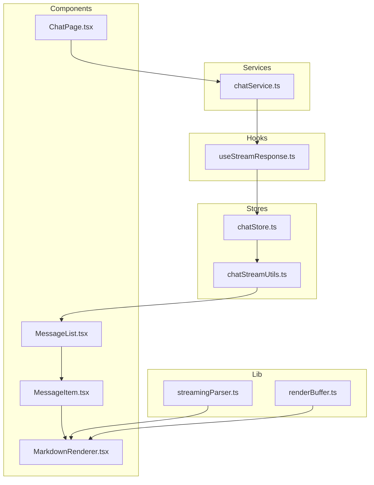
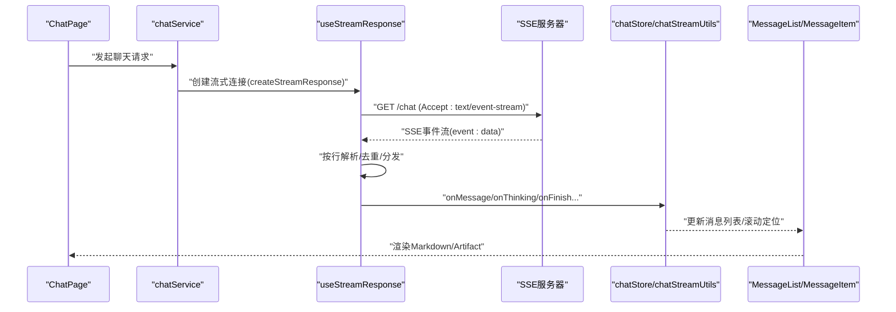
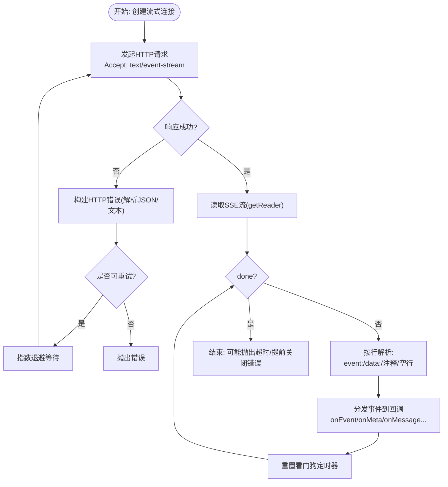
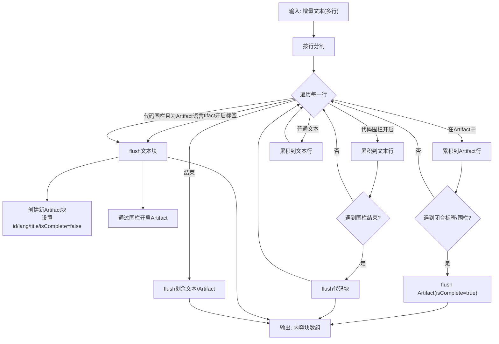
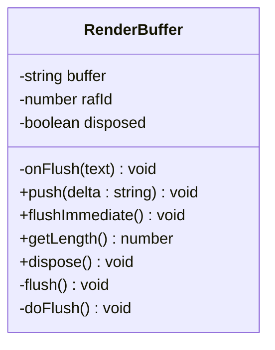
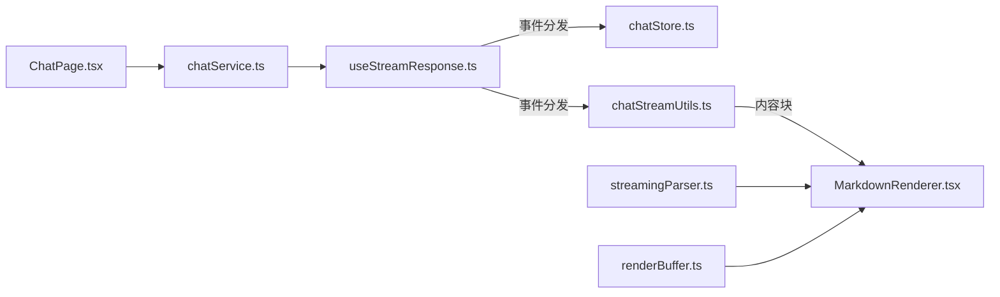

# 流式响应处理

<cite>
**本文引用的文件**
- [useStreamResponse.ts](file://frontend/src/hooks/useStreamResponse.ts)
- [streamingParser.ts](file://frontend/src/lib/parser/streamingParser.ts)
- [renderBuffer.ts](file://frontend/src/lib/stream/renderBuffer.ts)
- [chatStore.ts](file://frontend/src/stores/chatStore.ts)
- [chatStreamUtils.ts](file://frontend/src/stores/chatStreamUtils.ts)
- [chatService.ts](file://frontend/src/services/chatService.ts)
- [ChatPage.tsx](file://frontend/src/pages/ChatPage.tsx)
- [MessageList.tsx](file://frontend/src/components/chat/MessageList.tsx)
- [MessageItem.tsx](file://frontend/src/components/chat/MessageItem.tsx)
- [MarkdownRenderer.tsx](file://frontend/src/components/chat/MarkdownRenderer.tsx)
</cite>

## 目录
1. [简介](#简介)
2. [项目结构](#项目结构)
3. [核心组件](#核心组件)
4. [架构总览](#架构总览)
5. [详细组件分析](#详细组件分析)
6. [依赖关系分析](#依赖关系分析)
7. [性能考虑](#性能考虑)
8. [故障排查指南](#故障排查指南)
9. [结论](#结论)

## 简介
本文件面向Seahorse Agent前端的流式响应处理机制，围绕SSE（服务器发送事件）连接的建立与管理、事件解析与去重、增量渲染与滚动控制、错误处理与重试、性能优化与调试等维度进行系统化技术说明。目标是帮助开发者快速理解并高效扩展流式对话能力。

## 项目结构
前端流式响应相关代码主要分布在以下模块：
- hooks层：统一的SSE流式处理与重试逻辑
- lib层：流式文本解析（支持代码围栏与Artifact标签）
- lib/stream：渲染缓冲与节流刷新
- stores层：会话状态与流式事件处理工具
- services层：与后端交互的聊天服务
- components层：消息列表、消息项、Markdown渲染等UI组件



图表来源
- [useStreamResponse.ts:1-321](file://frontend/src/hooks/useStreamResponse.ts#L1-L321)
- [streamingParser.ts:1-136](file://frontend/src/lib/parser/streamingParser.ts#L1-L136)
- [renderBuffer.ts:1-53](file://frontend/src/lib/stream/renderBuffer.ts#L1-L53)
- [chatStore.ts](file://frontend/src/stores/chatStore.ts)
- [chatStreamUtils.ts](file://frontend/src/stores/chatStreamUtils.ts)
- [chatService.ts](file://frontend/src/services/chatService.ts)
- [ChatPage.tsx](file://frontend/src/pages/ChatPage.tsx)
- [MessageList.tsx](file://frontend/src/components/chat/MessageList.tsx)
- [MessageItem.tsx](file://frontend/src/components/chat/MessageItem.tsx)
- [MarkdownRenderer.tsx](file://frontend/src/components/chat/MarkdownRenderer.tsx)

章节来源
- [useStreamResponse.ts:1-321](file://frontend/src/hooks/useStreamResponse.ts#L1-L321)
- [streamingParser.ts:1-136](file://frontend/src/lib/parser/streamingParser.ts#L1-L136)
- [renderBuffer.ts:1-53](file://frontend/src/lib/stream/renderBuffer.ts#L1-L53)

## 核心组件
- 流式连接与事件解析：负责建立SSE连接、按行解析事件、去重与分发到上层回调
- 流式文本解析：将增量文本解析为内容块（文本/代码/Artifact），支持围栏与标签混合场景
- 渲染缓冲：使用requestAnimationFrame合并多次增量，降低渲染压力
- 会话状态与事件工具：维护消息列表、事件序列、标题生成、取消/完成等状态
- 聊天服务：封装HTTP请求，触发流式连接与事件处理
- UI组件：消息列表、消息项、Markdown渲染器

章节来源
- [useStreamResponse.ts:1-321](file://frontend/src/hooks/useStreamResponse.ts#L1-L321)
- [streamingParser.ts:1-136](file://frontend/src/lib/parser/streamingParser.ts#L1-L136)
- [renderBuffer.ts:1-53](file://frontend/src/lib/stream/renderBuffer.ts#L1-L53)

## 架构总览
下图展示从页面到后端的完整流式响应路径，包括连接建立、事件解析、状态更新与渲染。



图表来源
- [ChatPage.tsx](file://frontend/src/pages/ChatPage.tsx)
- [chatService.ts](file://frontend/src/services/chatService.ts)
- [useStreamResponse.ts:77-230](file://frontend/src/hooks/useStreamResponse.ts#L77-L230)
- [chatStore.ts](file://frontend/src/stores/chatStore.ts)
- [chatStreamUtils.ts](file://frontend/src/stores/chatStreamUtils.ts)
- [MessageList.tsx](file://frontend/src/components/chat/MessageList.tsx)
- [MessageItem.tsx](file://frontend/src/components/chat/MessageItem.tsx)

## 详细组件分析

### 组件A：SSE流式连接与事件解析（useStreamResponse）
- 连接参数配置
  - 支持URL、自定义Headers、AbortSignal、最大重试次数、重试延迟、看门狗超时、断点续传回调
  - 断点续传：通过resume回调返回runId与lastEventSeq，自动拼接resumeRunId与lastEventSeq查询参数
- 事件解析与分发
  - 基于SSE协议逐行解析event与data字段，支持注释行（以:开头）、空行分隔事件
  - 对于特殊事件类型（meta/message/finish/done/cancel/reject/title/error）进行定向分发
  - 对通用事件（eventType为“stream_event”）进行Envelope解包与二次派发，并记录payloadKey用于去重
- 去重与幂等
  - 使用pendingDuplicate记录上一次Envelope的事件名与payloadKey，若当前事件与之完全一致则跳过
- 错误处理与超时
  - 看门狗：每收到一次数据即重置定时器；超时则主动cancel读取器并抛出错误
  - 非正常关闭：在未收到终止事件且未被中断时抛出“连接提前关闭”错误
  - HTTP错误：根据Content-Type解析JSON或纯文本错误信息，附带HTTP状态码
- 重试机制
  - 指数退避重试，最多retryCount次；首次失败不视为可续传，后续失败才尝试续传
  - 中断信号优先：AbortSignal被触发时立即停止并抛出错误



图表来源
- [useStreamResponse.ts:77-230](file://frontend/src/hooks/useStreamResponse.ts#L77-L230)
- [useStreamResponse.ts:257-307](file://frontend/src/hooks/useStreamResponse.ts#L257-L307)
- [useStreamResponse.ts:322-255](file://frontend/src/hooks/useStreamResponse.ts#L322-L255)

章节来源
- [useStreamResponse.ts:17-26](file://frontend/src/hooks/useStreamResponse.ts#L17-L26)
- [useStreamResponse.ts:67-75](file://frontend/src/hooks/useStreamResponse.ts#L67-L75)
- [useStreamResponse.ts:77-230](file://frontend/src/hooks/useStreamResponse.ts#L77-L230)
- [useStreamResponse.ts:257-307](file://frontend/src/hooks/useStreamResponse.ts#L257-L307)
- [useStreamResponse.ts:322-255](file://frontend/src/hooks/useStreamResponse.ts#L322-L255)

### 组件B：流式文本解析（streamingParser）
- 功能目标
  - 将服务器推送的增量文本解析为内容块集合，支持：
    - 普通文本块
    - 代码围栏块（含语言）
    - Artifact块（支持标签与代码围栏两种开启方式）
- 解析规则
  - Artifact标签：以<artifact language="..." title="...">开头，</artifact>结尾；若通过代码围栏开启，则以围栏结束作为Artifact结束
  - 代码围栏：以```语言开头，```结束；Artifact语言集合包含html/css/javascript/js/tsx/vue
  - 文本块：其余普通行累积为文本块
- 确定性ID
  - Artifact块ID基于消息ID与出现顺序生成，保证UI渲染稳定性
- 边界处理
  - 最后一行未闭合时按“未完成”Artifact处理，确保渲染一致性



图表来源
- [streamingParser.ts:15-135](file://frontend/src/lib/parser/streamingParser.ts#L15-L135)

章节来源
- [streamingParser.ts:1-L136](file://frontend/src/lib/parser/streamingParser.ts#L1-L136)

### 组件C：渲染缓冲与节流（renderBuffer）
- 设计目的
  - 将多次增量文本合并，使用requestAnimationFrame批量刷新，避免频繁DOM操作
- 关键行为
  - push：追加增量到缓冲区，若无动画帧调度则注册下一帧flush
  - flushImmediate：立即取消待执行帧并一次性刷新缓冲区
  - dispose：释放资源，取消待执行帧，清空缓冲
  - getLength：返回缓冲长度，便于外部做节流/限速判断



图表来源
- [renderBuffer.ts:1-53](file://frontend/src/lib/stream/renderBuffer.ts#L1-L53)

章节来源
- [renderBuffer.ts:1-L53](file://frontend/src/lib/stream/renderBuffer.ts#L1-L53)

### 组件D：会话状态与事件工具（chatStore/chatStreamUtils）
- 作用
  - 维护消息列表、事件序列号、标题生成、取消/完成标记
  - 在onMessage/onFinish/onCancel/onError等事件到达时更新UI状态
- 与渲染的关系
  - chatStreamUtils负责将事件转换为UI可见的消息项，结合MessageList/MessageItem进行渲染
  - MarkdownRenderer消费内容块数组，渲染文本、代码与Artifact

章节来源
- [chatStore.ts](file://frontend/src/stores/chatStore.ts)
- [chatStreamUtils.ts](file://frontend/src/stores/chatStreamUtils.ts)
- [MessageList.tsx](file://frontend/src/components/chat/MessageList.tsx)
- [MessageItem.tsx](file://frontend/src/components/chat/MessageItem.tsx)
- [MarkdownRenderer.tsx](file://frontend/src/components/chat/MarkdownRenderer.tsx)

### 组件E：聊天服务（chatService）
- 角色
  - 页面调用入口，封装与后端的交互，触发useStreamResponse建立SSE连接
- 典型流程
  - 构造请求参数（URL、Headers、AbortSignal）
  - 注册事件回调（onMessage/onFinish/onError等）
  - 调用createStreamResponse.start()启动流式处理

章节来源
- [chatService.ts](file://frontend/src/services/chatService.ts)
- [ChatPage.tsx](file://frontend/src/pages/ChatPage.tsx)

## 依赖关系分析
- useStreamResponse依赖浏览器ReadableStream API与fetch，向上提供统一的事件分发接口
- streamingParser独立于SSE实现，专注于文本解析，可复用到其他流式场景
- renderBuffer与UI渲染解耦，便于替换渲染策略
- chatStore/chatStreamUtils与UI组件松耦合，通过事件驱动更新



图表来源
- [useStreamResponse.ts:1-321](file://frontend/src/hooks/useStreamResponse.ts#L1-L321)
- [streamingParser.ts:1-136](file://frontend/src/lib/parser/streamingParser.ts#L1-L136)
- [renderBuffer.ts:1-53](file://frontend/src/lib/stream/renderBuffer.ts#L1-L53)
- [chatStore.ts](file://frontend/src/stores/chatStore.ts)
- [chatStreamUtils.ts](file://frontend/src/stores/chatStreamUtils.ts)
- [chatService.ts](file://frontend/src/services/chatService.ts)
- [ChatPage.tsx](file://frontend/src/pages/ChatPage.tsx)
- [MarkdownRenderer.tsx](file://frontend/src/components/chat/MarkdownRenderer.tsx)

## 性能考虑
- 内存管理
  - 使用RenderBuffer合并增量，减少中间字符串对象数量
  - 事件去重避免重复渲染相同内容
  - 终止时及时dispose RenderBuffer与clearTimeout/raf
- 渲染节流
  - requestAnimationFrame批量刷新，避免高频小块渲染
  - flushImmediate用于需要即时可见的场景（如用户中断）
- 资源清理
  - AbortController统一管理取消，防止悬挂请求
  - 看门狗超时主动cancel，避免长时间占用资源
- UI滚动优化
  - 通过chatStreamUtils计算滚动位置，避免频繁滚动抖动
  - 在大量增量时采用“延迟滚动到底部”的策略

## 故障排查指南
- 常见问题与定位
  - “连接提前关闭”：检查后端是否在消息未完成前关闭SSE；确认onFinish/onCancel等终止事件是否到达
  - “看门狗超时”：检查网络延迟、后端事件发送频率；适当增大timeoutMs
  - “重复事件”：确认事件去重逻辑是否生效；检查事件序列号与payloadKey
  - “文本解析异常”：检查Artifact标签/代码围栏格式；确保语言名称在支持集合内
- 调试建议
  - 打开onEvent/onStreamEvent回调，打印事件名与载荷，核对事件序列
  - 使用AbortController在测试中主动中断，验证清理逻辑
  - 在MarkdownRenderer处增加日志，观察内容块生成与渲染时机
- 错误处理策略
  - HTTP错误：解析JSON错误体或纯文本，保留HTTP状态码
  - 网络异常：指数退避重试，超过上限后提示用户重试
  - 数据完整性：在onFinish中校验消息完整性，必要时触发续传

章节来源
- [useStreamResponse.ts:232-255](file://frontend/src/hooks/useStreamResponse.ts#L232-L255)
- [useStreamResponse.ts:292-306](file://frontend/src/hooks/useStreamResponse.ts#L292-L306)
- [streamingParser.ts:15-135](file://frontend/src/lib/parser/streamingParser.ts#L15-L135)

## 结论
Seahorse Agent前端的流式响应处理以useStreamResponse为核心，结合streamingParser与renderBuffer实现了高可靠、低开销的增量渲染链路。通过事件去重、看门狗超时、指数退避重试与AbortController统一管理，系统在复杂网络环境下仍能保持良好的用户体验。建议在实际部署中根据业务场景调整超时与重试参数，并持续完善事件日志与UI滚动策略。