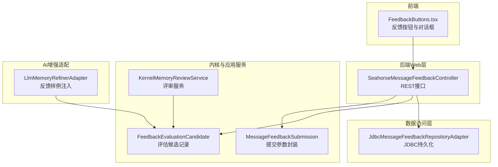
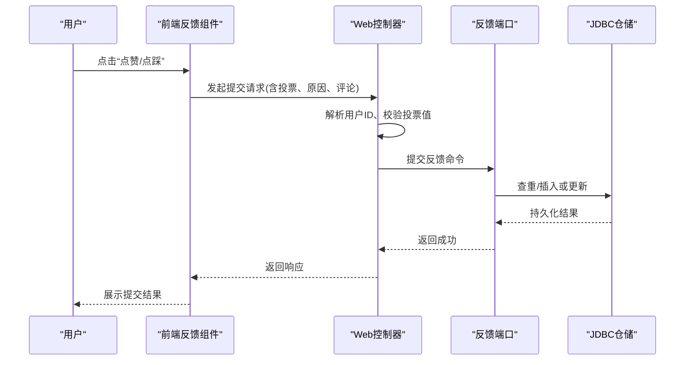
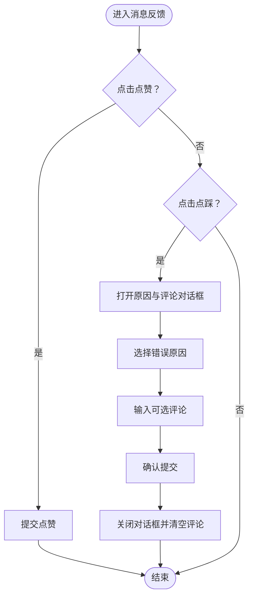
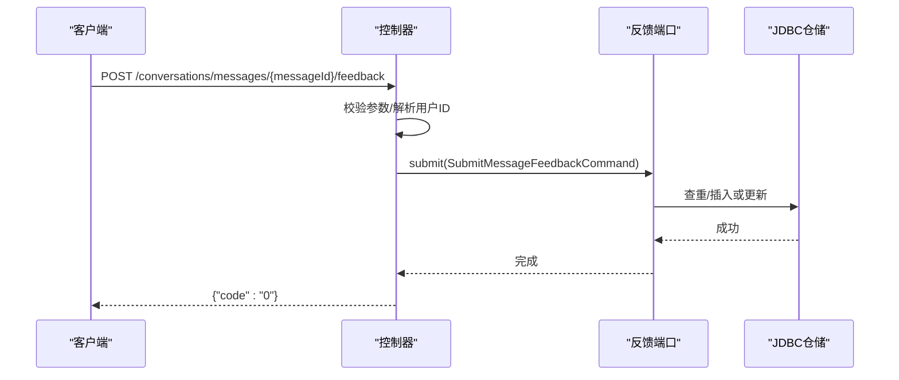
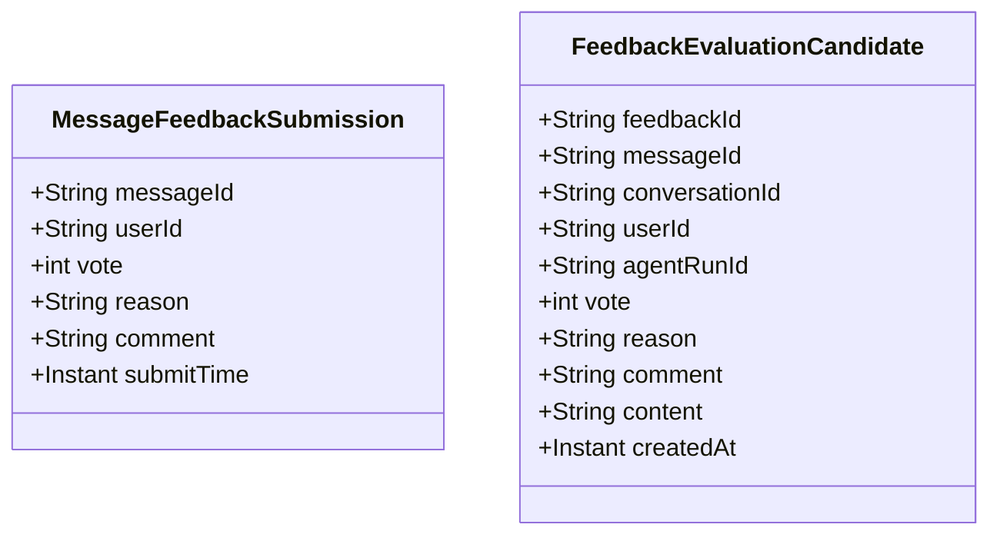
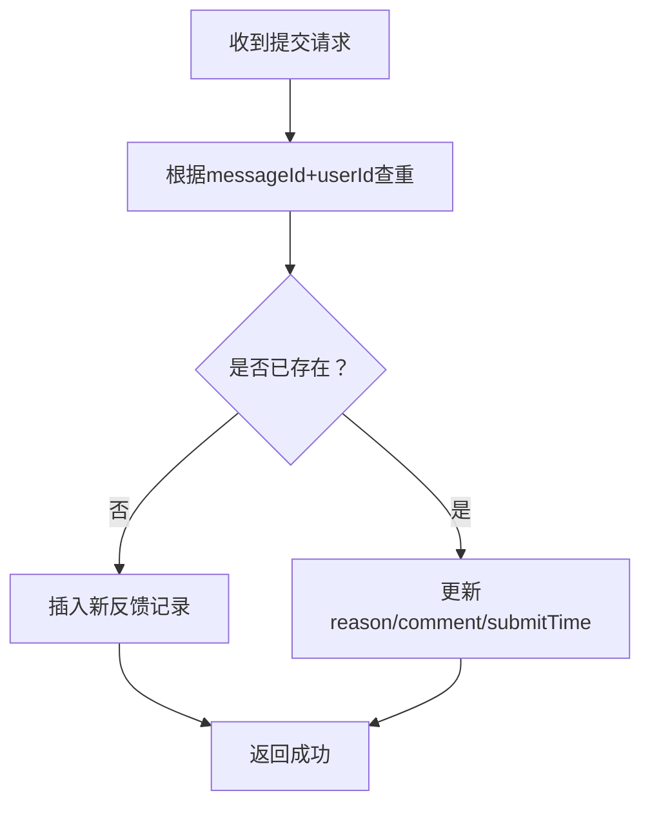
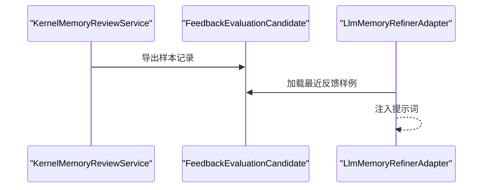
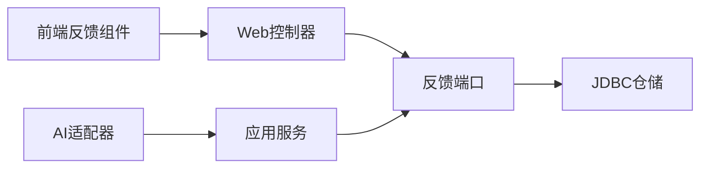

# 消息反馈系统

<cite>
**本文引用的文件**
- [SeahorseMessageFeedbackController.java](file://seahorse-agent-adapter-web/src/main/java/com/miracle/ai/seahorse/agent/adapters/web/SeahorseMessageFeedbackController.java)
- [MessageFeedbackSubmission.java](file://seahorse-agent-kernel/src/main/java/com/miracle/ai/seahorse/agent/ports/outbound/feedback/MessageFeedbackSubmission.java)
- [FeedbackEvaluationCandidate.java](file://seahorse-agent-kernel/src/main/java/com/miracle/ai/seahorse/agent/ports/outbound/feedback/FeedbackEvaluationCandidate.java)
- [JdbcMessageFeedbackRepositoryAdapter.java](file://seahorse-agent-adapter-repository-jdbc/src/main/java/com/miracle/ai/seahorse/agent/adapters/repository/jdbc/JdbcMessageFeedbackRepositoryAdapter.java)
- [FeedbackButtons.tsx](file://frontend/src/components/chat/FeedbackButtons.tsx)
- [FeedbackButtons.tsx（别名）](file://frontend/src/components/ai-elements/feedback/FeedbackButtons.tsx)
- [LlmMemoryRefinerAdapter.java](file://seahorse-agent-adapter-ai-openai-compatible/src/main/java/com/miracle/ai/seahorse/agent/adapters/ai/openai/LlmMemoryRefinerAdapter.java)
- [KernelMemoryReviewService.java](file://seahorse-agent-kernel/src/main/java/com/miracle/ai/seahorse/agent/kernel/application/memory/KernelMemoryReviewService.java)
- [SeahorseMessageFeedbackControllerTests.java](file://seahorse-agent-adapter-web/src/test/java/com/miracle/ai/seahorse/agent/adapters/web/SeahorseMessageFeedbackControllerTests.java)
</cite>

## 目录
1. [简介](#简介)
2. [项目结构](#项目结构)
3. [核心组件](#核心组件)
4. [架构总览](#架构总览)
5. [详细组件分析](#详细组件分析)
6. [依赖关系分析](#依赖关系分析)
7. [性能考虑](#性能考虑)
8. [故障排查指南](#故障排查指南)
9. [结论](#结论)
10. [附录](#附录)

## 简介
本文件为 Seahorse Agent 消息反馈系统的技术文档，围绕“消息反馈”的完整闭环进行系统性梳理：从前端反馈按钮的显示与交互、到后端接口的数据提交与校验、再到存储层的持久化与查询、以及面向未来的扩展与隐私保护策略。文档同时覆盖反馈类型的定义（满意度评分、错误分类、改进建议）、数据收集与验证、结果处理与统计、以及与知识增强流程的衔接。

## 项目结构
消息反馈系统横跨前端与后端两大侧，涉及控制器、领域模型、仓储适配器、前端组件与状态管理等模块。下图给出与反馈系统相关的关键文件与职责映射：

图表来源
- [FeedbackButtons.tsx:1-179](file://frontend/src/components/chat/FeedbackButtons.tsx#L1-L179)
- [SeahorseMessageFeedbackController.java:54-73](file://seahorse-agent-adapter-web/src/main/java/com/miracle/ai/seahorse/agent/adapters/web/SeahorseMessageFeedbackController.java#L54-L73)
- [MessageFeedbackSubmission.java:35-59](file://seahorse-agent-kernel/src/main/java/com/miracle/ai/seahorse/agent/ports/outbound/feedback/MessageFeedbackSubmission.java#L35-L59)
- [FeedbackEvaluationCandidate.java:22-32](file://seahorse-agent-kernel/src/main/java/com/miracle/ai/seahorse/agent/ports/outbound/feedback/FeedbackEvaluationCandidate.java#L22-L32)
- [JdbcMessageFeedbackRepositoryAdapter.java:159-196](file://seahorse-agent-adapter-repository-jdbc/src/main/java/com/miracle/ai/seahorse/agent/adapters/repository/jdbc/JdbcMessageFeedbackRepositoryAdapter.java#L159-L196)
- [LlmMemoryRefinerAdapter.java:292-318](file://seahorse-agent-adapter-ai-openai-compatible/src/main/java/com/miracle/ai/seahorse/agent/adapters/ai/openai/LlmMemoryRefinerAdapter.java#L292-L318)
- [KernelMemoryReviewService.java:493-526](file://seahorse-agent-kernel/src/main/java/com/miracle/ai/seahorse/agent/kernel/application/memory/KernelMemoryReviewService.java#L493-L526)

章节来源
- [FeedbackButtons.tsx:1-179](file://frontend/src/components/chat/FeedbackButtons.tsx#L1-L179)
- [SeahorseMessageFeedbackController.java:54-73](file://seahorse-agent-adapter-web/src/main/java/com/miracle/ai/seahorse/agent/adapters/web/SeahorseMessageFeedbackController.java#L54-L73)
- [MessageFeedbackSubmission.java:35-59](file://seahorse-agent-kernel/src/main/java/com/miracle/ai/seahorse/agent/ports/outbound/feedback/MessageFeedbackSubmission.java#L35-L59)
- [FeedbackEvaluationCandidate.java:22-32](file://seahorse-agent-kernel/src/main/java/com/miracle/ai/seahorse/agent/ports/outbound/feedback/FeedbackEvaluationCandidate.java#L22-L32)
- [JdbcMessageFeedbackRepositoryAdapter.java:159-196](file://seahorse-agent-adapter-repository-jdbc/src/main/java/com/miracle/ai/seahorse/agent/adapters/repository/jdbc/JdbcMessageFeedbackRepositoryAdapter.java#L159-L196)
- [LlmMemoryRefinerAdapter.java:292-318](file://seahorse-agent-adapter-ai-openai-compatible/src/main/java/com/miracle/ai/seahorse/agent/adapters/ai/openai/LlmMemoryRefinerAdapter.java#L292-L318)
- [KernelMemoryReviewService.java:493-526](file://seahorse-agent-kernel/src/main/java/com/miracle/ai/seahorse/agent/kernel/application/memory/KernelMemoryReviewService.java#L493-L526)

## 核心组件
- 前端反馈按钮组件：负责渲染“点赞/点踩”按钮、错误原因选择与评论输入、复制内容等交互，并通过全局状态管理提交反馈。
- Web 控制器：暴露 REST 接口用于提交消息反馈；解析用户标识、校验投票值、封装提交命令并调用领域端口。
- 领域模型：MessageFeedbackSubmission 封装提交参数并内置基础校验；FeedbackEvaluationCandidate 表示评估候选记录。
- 数据访问层：JdbcMessageFeedbackRepositoryAdapter 负责查找重复反馈、插入或更新反馈记录。
- 应用服务：KernelMemoryReviewService 提供评审样本导出与元数据合并等能力，支撑反馈闭环。
- AI 增强适配：LlmMemoryRefinerAdapter 可从反馈样本中抽取样例注入提示词，提升记忆精炼质量。

章节来源
- [FeedbackButtons.tsx:1-179](file://frontend/src/components/chat/FeedbackButtons.tsx#L1-L179)
- [SeahorseMessageFeedbackController.java:54-73](file://seahorse-agent-adapter-web/src/main/java/com/miracle/ai/seahorse/agent/adapters/web/SeahorseMessageFeedbackController.java#L54-L73)
- [MessageFeedbackSubmission.java:35-59](file://seahorse-agent-kernel/src/main/java/com/miracle/ai/seahorse/agent/ports/outbound/feedback/MessageFeedbackSubmission.java#L35-L59)
- [FeedbackEvaluationCandidate.java:22-32](file://seahorse-agent-kernel/src/main/java/com/miracle/ai/seahorse/agent/ports/outbound/feedback/FeedbackEvaluationCandidate.java#L22-L32)
- [JdbcMessageFeedbackRepositoryAdapter.java:159-196](file://seahorse-agent-adapter-repository-jdbc/src/main/java/com/miracle/ai/seahorse/agent/adapters/repository/jdbc/JdbcMessageFeedbackRepositoryAdapter.java#L159-L196)
- [KernelMemoryReviewService.java:493-526](file://seahorse-agent-kernel/src/main/java/com/miracle/ai/seahorse/agent/kernel/application/memory/KernelMemoryReviewService.java#L493-L526)
- [LlmMemoryRefinerAdapter.java:292-318](file://seahorse-agent-adapter-ai-openai-compatible/src/main/java/com/miracle/ai/seahorse/agent/adapters/ai/openai/LlmMemoryRefinerAdapter.java#L292-L318)

## 架构总览
消息反馈系统采用分层架构：前端通过控制器提交反馈，控制器将请求转换为领域命令并调用反馈端口；仓储适配器负责持久化；应用服务与 AI 适配器在更高层参与样本导出与提示词增强。

图表来源
- [FeedbackButtons.tsx:46-77](file://frontend/src/components/chat/FeedbackButtons.tsx#L46-L77)
- [SeahorseMessageFeedbackController.java:54-68](file://seahorse-agent-adapter-web/src/main/java/com/miracle/ai/seahorse/agent/adapters/web/SeahorseMessageFeedbackController.java#L54-L68)
- [JdbcMessageFeedbackRepositoryAdapter.java:164-196](file://seahorse-agent-adapter-repository-jdbc/src/main/java/com/miracle/ai/seahorse/agent/adapters/repository/jdbc/JdbcMessageFeedbackRepositoryAdapter.java#L164-L196)

## 详细组件分析

### 前端反馈按钮组件（FeedbackButtons）
- 功能要点
  - 渲染“点赞/点踩”按钮，支持切换与清空反馈。
  - “点踩”时弹出对话框，允许选择错误原因与填写可选评论。
  - 支持复制消息内容到剪贴板。
  - 通过全局状态管理提交反馈，包含消息ID、投票值与附加信息。
- 错误原因与文案
  - 包含“事实错误、缺少引用、过期来源、响应过慢、格式差、任务不完整、不安全、其他”等选项。
- 交互流程
  - 点赞：直接提交；点踩：打开对话框，确认后提交。
  - 提交成功后关闭对话框并清空评论。

图表来源
- [FeedbackButtons.tsx:46-77](file://frontend/src/components/chat/FeedbackButtons.tsx#L46-L77)

章节来源
- [FeedbackButtons.tsx:1-179](file://frontend/src/components/chat/FeedbackButtons.tsx#L1-L179)
- [FeedbackButtons.tsx（别名）:1-1](file://frontend/src/components/ai-elements/feedback/FeedbackButtons.tsx#L1-L1)

### Web 控制器（SeahorseMessageFeedbackController）
- 接口定义
  - POST /conversations/messages/{messageId}/feedback：提交消息反馈。
  - GET /api/feedback/evaluation-candidates：查询评估候选记录（用于后续分析与展示）。
- 处理逻辑
  - 解析用户ID（优先路径参数，其次请求头）。
  - 校验投票值必须为 1 或 -1。
  - 封装提交命令并调用反馈入站端口执行。
  - 返回统一响应码。

图表来源
- [SeahorseMessageFeedbackController.java:54-68](file://seahorse-agent-adapter-web/src/main/java/com/miracle/ai/seahorse/agent/adapters/web/SeahorseMessageFeedbackController.java#L54-L68)
- [JdbcMessageFeedbackRepositoryAdapter.java:164-196](file://seahorse-agent-adapter-repository-jdbc/src/main/java/com/miracle/ai/seahorse/agent/adapters/repository/jdbc/JdbcMessageFeedbackRepositoryAdapter.java#L164-L196)

章节来源
- [SeahorseMessageFeedbackController.java:54-73](file://seahorse-agent-adapter-web/src/main/java/com/miracle/ai/seahorse/agent/adapters/web/SeahorseMessageFeedbackController.java#L54-L73)

### 领域模型与数据校验
- MessageFeedbackSubmission
  - 必填字段：messageId、userId。
  - 投票值：仅允许 1（点赞）或 -1（点踩），否则抛出异常。
  - 其他字段：reason、comment 默认为空字符串；submitTime 默认当前时间。
- FeedbackEvaluationCandidate
  - 用于评估候选记录，包含反馈ID、消息ID、会话ID、用户ID、运行ID、投票、原因、评论、内容与创建时间等字段。

图表来源
- [MessageFeedbackSubmission.java:35-59](file://seahorse-agent-kernel/src/main/java/com/miracle/ai/seahorse/agent/ports/outbound/feedback/MessageFeedbackSubmission.java#L35-L59)
- [FeedbackEvaluationCandidate.java:22-32](file://seahorse-agent-kernel/src/main/java/com/miracle/ai/seahorse/agent/ports/outbound/feedback/FeedbackEvaluationCandidate.java#L22-L32)

章节来源
- [MessageFeedbackSubmission.java:35-59](file://seahorse-agent-kernel/src/main/java/com/miracle/ai/seahorse/agent/ports/outbound/feedback/MessageFeedbackSubmission.java#L35-L59)
- [FeedbackEvaluationCandidate.java:22-32](file://seahorse-agent-kernel/src/main/java/com/miracle/ai/seahorse/agent/ports/outbound/feedback/FeedbackEvaluationCandidate.java#L22-L32)

### 数据持久化与查重
- 查重逻辑：根据 messageId 与 userId 查询是否存在已存在反馈。
- 插入或更新：若无重复则插入新记录，否则按最新提交时间更新 reason、comment 等字段。
- 时间戳：统一使用提交时间作为创建与更新时间。

图表来源
- [JdbcMessageFeedbackRepositoryAdapter.java:164-196](file://seahorse-agent-adapter-repository-jdbc/src/main/java/com/miracle/ai/seahorse/agent/adapters/repository/jdbc/JdbcMessageFeedbackRepositoryAdapter.java#L164-L196)

章节来源
- [JdbcMessageFeedbackRepositoryAdapter.java:159-196](file://seahorse-agent-adapter-repository-jdbc/src/main/java/com/miracle/ai/seahorse/agent/adapters/repository/jdbc/JdbcMessageFeedbackRepositoryAdapter.java#L159-L196)

### 评估候选与样本导出
- 评估候选：FeedbackEvaluationCandidate 用于展示与分析，包含投票、原因、评论、内容与时间等。
- 样本导出：KernelMemoryReviewService 提供导出记录能力，便于生成训练/微调数据。
- AI 注入：LlmMemoryRefinerAdapter 可从反馈样本中抽取样例注入提示词，提升记忆精炼质量。

图表来源
- [KernelMemoryReviewService.java:493-526](file://seahorse-agent-kernel/src/main/java/com/miracle/ai/seahorse/agent/kernel/application/memory/KernelMemoryReviewService.java#L493-L526)
- [FeedbackEvaluationCandidate.java:22-32](file://seahorse-agent-kernel/src/main/java/com/miracle/ai/seahorse/agent/ports/outbound/feedback/FeedbackEvaluationCandidate.java#L22-L32)
- [LlmMemoryRefinerAdapter.java:292-318](file://seahorse-agent-adapter-ai-openai-compatible/src/main/java/com/miracle/ai/seahorse/agent/adapters/ai/openai/LlmMemoryRefinerAdapter.java#L292-L318)

章节来源
- [KernelMemoryReviewService.java:493-526](file://seahorse-agent-kernel/src/main/java/com/miracle/ai/seahorse/agent/kernel/application/memory/KernelMemoryReviewService.java#L493-L526)
- [LlmMemoryRefinerAdapter.java:292-318](file://seahorse-agent-adapter-ai-openai-compatible/src/main/java/com/miracle/ai/seahorse/agent/adapters/ai/openai/LlmMemoryRefinerAdapter.java#L292-L318)

### 反馈类型设计
- 满意度评分：1 表示点赞，-1 表示点踩。
- 错误分类：包含“事实错误、缺少引用、过期来源、响应过慢、格式差、任务不完整、不安全、其他”等预设原因。
- 改进建议：通过可选评论字段收集用户补充意见。
- 一致性保障：控制器与领域模型均对投票值进行严格校验，确保数据完整性。

章节来源
- [SeahorseMessageFeedbackController.java:54-68](file://seahorse-agent-adapter-web/src/main/java/com/miracle/ai/seahorse/agent/adapters/web/SeahorseMessageFeedbackController.java#L54-L68)
- [MessageFeedbackSubmission.java:42-51](file://seahorse-agent-kernel/src/main/java/com/miracle/ai/seahorse/agent/ports/outbound/feedback/MessageFeedbackSubmission.java#L42-L51)
- [FeedbackButtons.tsx:28-37](file://frontend/src/components/chat/FeedbackButtons.tsx#L28-L37)

### 数据收集与验证
- 必填字段：messageId、userId。
- 格式检查：投票值仅允许 1 或 -1；reason、comment 默认空字符串；submitTime 默认当前时间。
- 数据完整性：控制器与仓储层均进行非空与范围校验，避免脏数据入库。

章节来源
- [MessageFeedbackSubmission.java:42-51](file://seahorse-agent-kernel/src/main/java/com/miracle/ai/seahorse/agent/ports/outbound/feedback/MessageFeedbackSubmission.java#L42-L51)
- [SeahorseMessageFeedbackController.java:54-68](file://seahorse-agent-adapter-web/src/main/java/com/miracle/ai/seahorse/agent/adapters/web/SeahorseMessageFeedbackController.java#L54-L68)

### 结果处理与统计
- 实时显示：前端在提交成功后关闭对话框并清空评论，实现即时反馈。
- 历史记录：通过评估候选接口查询历史记录，支持分页与筛选。
- 数据分析：结合导出记录与样本加载，可用于训练/微调与趋势分析。

章节来源
- [FeedbackButtons.tsx:72-77](file://frontend/src/components/chat/FeedbackButtons.tsx#L72-L77)
- [SeahorseMessageFeedbackController.java:70-73](file://seahorse-agent-adapter-web/src/main/java/com/miracle/ai/seahorse/agent/adapters/web/SeahorseMessageFeedbackController.java#L70-L73)
- [KernelMemoryReviewService.java:493-526](file://seahorse-agent-kernel/src/main/java/com/miracle/ai/seahorse/agent/kernel/application/memory/KernelMemoryReviewService.java#L493-L526)

### 隐私保护与脱敏
- 用户标识：控制器支持从路径参数或请求头解析用户ID，避免在请求体中携带敏感信息。
- 最小化原则：提交时仅传递必要字段（投票、原因、评论），减少数据暴露面。
- 建议实践：可在网关或中间件层对用户ID进行匿名化处理或令牌化，确保最终落库前不可直接关联到真实身份。

章节来源
- [SeahorseMessageFeedbackController.java:57-63](file://seahorse-agent-adapter-web/src/main/java/com/miracle/ai/seahorse/agent/adapters/web/SeahorseMessageFeedbackController.java#L57-L63)

### 扩展机制与第三方集成
- 自定义反馈类型：可在前端新增原因枚举与文案映射，并在控制器与仓储层保持兼容。
- 第三方评价系统：可通过评估候选接口输出标准化数据格式，对接外部分析平台或评价系统。
- 样本驱动优化：利用 LlmMemoryRefinerAdapter 的样本注入能力，持续迭代提示词以提升质量。

章节来源
- [FeedbackButtons.tsx:28-37](file://frontend/src/components/chat/FeedbackButtons.tsx#L28-L37)
- [FeedbackEvaluationCandidate.java:22-32](file://seahorse-agent-kernel/src/main/java/com/miracle/ai/seahorse/agent/ports/outbound/feedback/FeedbackEvaluationCandidate.java#L22-L32)
- [LlmMemoryRefinerAdapter.java:292-318](file://seahorse-agent-adapter-ai-openai-compatible/src/main/java/com/miracle/ai/seahorse/agent/adapters/ai/openai/LlmMemoryRefinerAdapter.java#L292-L318)

### 集成指南与定制化开发
- 前端集成
  - 在消息气泡右侧渲染反馈按钮组件，传入 messageId、feedback 状态与消息内容。
  - 绑定提交回调，处理提交状态与错误提示。
- 后端集成
  - 确保控制器路径与参数命名一致，遵循统一响应格式。
  - 在仓储层实现查重与插入/更新逻辑，保证幂等性。
- 定制化
  - 新增原因类型：修改前端枚举与文案映射，控制器与仓储层保持兼容。
  - 扩展字段：在领域模型与仓储层增加可选字段，注意向后兼容与默认值处理。

章节来源
- [FeedbackButtons.tsx:1-179](file://frontend/src/components/chat/FeedbackButtons.tsx#L1-L179)
- [SeahorseMessageFeedbackController.java:54-73](file://seahorse-agent-adapter-web/src/main/java/com/miracle/ai/seahorse/agent/adapters/web/SeahorseMessageFeedbackController.java#L54-L73)
- [JdbcMessageFeedbackRepositoryAdapter.java:164-196](file://seahorse-agent-adapter-repository-jdbc/src/main/java/com/miracle/ai/seahorse/agent/adapters/repository/jdbc/JdbcMessageFeedbackRepositoryAdapter.java#L164-L196)

## 依赖关系分析
- 前端依赖后端控制器提供的接口；控制器依赖反馈端口与仓储适配器。
- 应用服务与 AI 适配器通过评估候选记录参与反馈闭环。
- 仓储层与数据库表结构解耦于控制器与前端，便于替换实现。

图表来源
- [FeedbackButtons.tsx:46-77](file://frontend/src/components/chat/FeedbackButtons.tsx#L46-L77)
- [SeahorseMessageFeedbackController.java:54-68](file://seahorse-agent-adapter-web/src/main/java/com/miracle/ai/seahorse/agent/adapters/web/SeahorseMessageFeedbackController.java#L54-L68)
- [JdbcMessageFeedbackRepositoryAdapter.java:164-196](file://seahorse-agent-adapter-repository-jdbc/src/main/java/com/miracle/ai/seahorse/agent/adapters/repository/jdbc/JdbcMessageFeedbackRepositoryAdapter.java#L164-L196)
- [KernelMemoryReviewService.java:493-526](file://seahorse-agent-kernel/src/main/java/com/miracle/ai/seahorse/agent/kernel/application/memory/KernelMemoryReviewService.java#L493-L526)
- [LlmMemoryRefinerAdapter.java:292-318](file://seahorse-agent-adapter-ai-openai-compatible/src/main/java/com/miracle/ai/seahorse/agent/adapters/ai/openai/LlmMemoryRefinerAdapter.java#L292-L318)

章节来源
- [SeahorseMessageFeedbackController.java:54-73](file://seahorse-agent-adapter-web/src/main/java/com/miracle/ai/seahorse/agent/adapters/web/SeahorseMessageFeedbackController.java#L54-L73)
- [JdbcMessageFeedbackRepositoryAdapter.java:159-196](file://seahorse-agent-adapter-repository-jdbc/src/main/java/com/miracle/ai/seahorse/agent/adapters/repository/jdbc/JdbcMessageFeedbackRepositoryAdapter.java#L159-L196)

## 性能考虑
- 幂等写入：基于 messageId 与 userId 的查重避免重复写入，降低写放大。
- 批量查询：评估候选接口支持分页与筛选，建议前端按需加载，避免一次性拉取过多数据。
- 提示词注入：样本数量限制与异常兜底，避免因样本加载失败影响主流程。

## 故障排查指南
- 提交失败
  - 检查控制器参数校验日志与异常信息。
  - 确认用户ID解析是否正确（路径参数或请求头）。
- 重复提交
  - 确认仓储层查重逻辑是否生效，避免覆盖旧数据。
- 样本加载异常
  - 观察 AI 适配器的日志，确认样本查询与序列化过程是否抛错。

章节来源
- [SeahorseMessageFeedbackController.java:54-68](file://seahorse-agent-adapter-web/src/main/java/com/miracle/ai/seahorse/agent/adapters/web/SeahorseMessageFeedbackController.java#L54-L68)
- [JdbcMessageFeedbackRepositoryAdapter.java:164-196](file://seahorse-agent-adapter-repository-jdbc/src/main/java/com/miracle/ai/seahorse/agent/adapters/repository/jdbc/JdbcMessageFeedbackRepositoryAdapter.java#L164-L196)
- [LlmMemoryRefinerAdapter.java:314-317](file://seahorse-agent-adapter-ai-openai-compatible/src/main/java/com/miracle/ai/seahorse/agent/adapters/ai/openai/LlmMemoryRefinerAdapter.java#L314-L317)
- [SeahorseMessageFeedbackControllerTests.java:51-79](file://seahorse-agent-adapter-web/src/test/java/com/miracle/ai/seahorse/agent/adapters/web/SeahorseMessageFeedbackControllerTests.java#L51-L79)

## 结论
消息反馈系统通过清晰的前后端分工与严格的参数校验，实现了从用户交互到数据持久化的完整闭环。结合评估候选与样本导出能力，系统既满足实时反馈需求，又为后续的数据分析与模型优化提供了基础。建议在生产环境中进一步完善隐私策略与监控告警，并通过评估候选接口与第三方系统对接，实现更广泛的反馈生态。

## 附录
- 统一响应格式：控制器返回统一响应码，前端据此更新 UI。
- 测试参考：控制器测试覆盖了评估候选查询接口的行为，可作为集成测试的参考。

章节来源
- [SeahorseMessageFeedbackController.java:70-73](file://seahorse-agent-adapter-web/src/main/java/com/miracle/ai/seahorse/agent/adapters/web/SeahorseMessageFeedbackController.java#L70-L73)
- [SeahorseMessageFeedbackControllerTests.java:51-79](file://seahorse-agent-adapter-web/src/test/java/com/miracle/ai/seahorse/agent/adapters/web/SeahorseMessageFeedbackControllerTests.java#L51-L79)