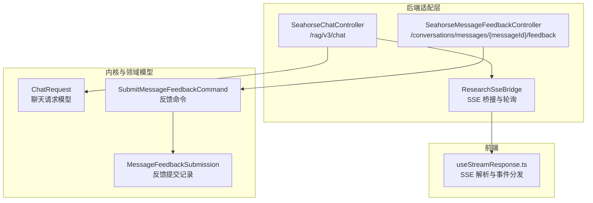
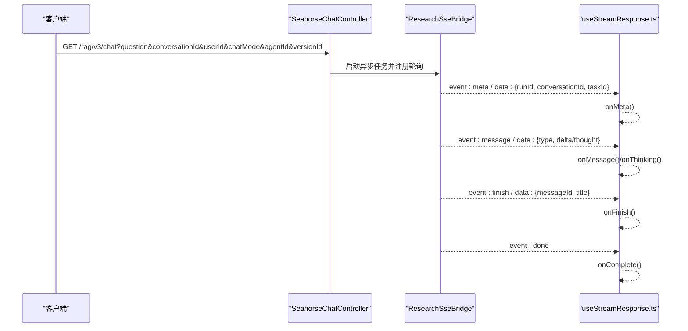
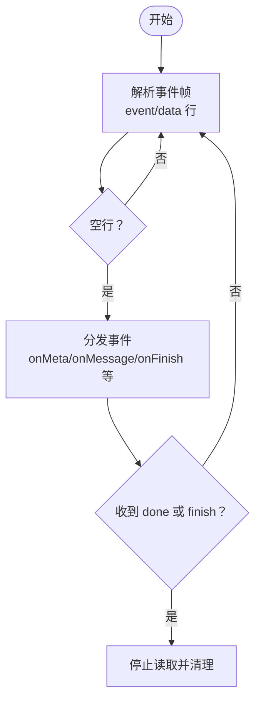
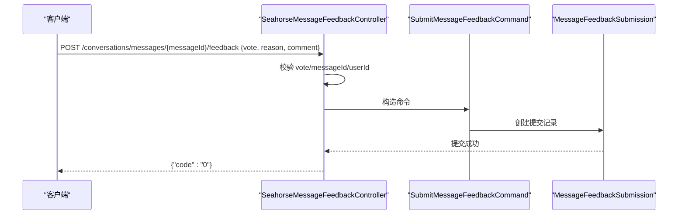
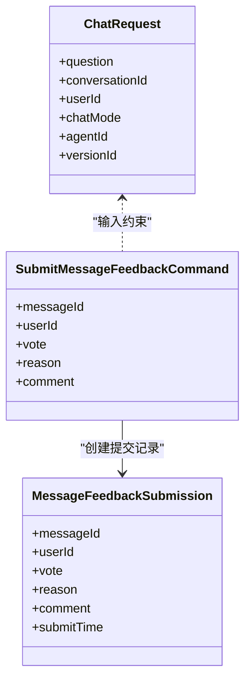

# 聊天API接口

<cite>
**本文引用的文件**
- [SeahorseChatController.java](file://seahorse-agent-adapter-web/src/main/java/com/miracle/ai/seahorse/agent/adapters/web/SeahorseChatController.java)
- [SeahorseMessageFeedbackController.java](file://seahorse-agent-adapter-web/src/main/java/com/miracle/ai/seahorse/agent/adapters/web/SeahorseMessageFeedbackController.java)
- [ResearchSseBridge.java](file://seahorse-agent-adapter-web/src/main/java/com/miracle/ai/seahorse/agent/adapters/web/ResearchSseBridge.java)
- [useStreamResponse.ts](file://frontend/src/hooks/useStreamResponse.ts)
- [OpenAiCompatibleModelAdapter.java](file://seahorse-agent-adapter-ai-openai-compatible/src/main/java/com/miracle/ai/seahorse/agent/adapters/ai/openai/OpenAiCompatibleModelAdapter.java)
- [ChatRequest.java](file://seahorse-agent-kernel/src/main/java/com/miracle/ai/seahorse/agent/kernel/domain/chat/ChatRequest.java)
- [SubmitMessageFeedbackCommand.java](file://seahorse-agent-kernel/src/main/java/com/miracle/ai/seahorse/agent/ports/inbound/feedback/SubmitMessageFeedbackCommand.java)
- [MessageFeedbackSubmission.java](file://seahorse-agent-kernel/src/main/java/com/miracle/ai/seahorse/agent/ports/outbound/feedback/MessageFeedbackSubmission.java)
- [聊天接口.md](file://docs/zh/content/API 接口文档/聊天接口.md)
- [流式处理领域模型.md](file://docs/zh/content/后端系统/核心内核/领域模型/流式处理领域模型.md)
- [SeahorseWebApiContractTests.java](file://seahorse-agent-tests/src/test/java/com/miracle/ai/seahorse/agent/adapters/web/SeahorseWebApiContractTests.java)
</cite>

## 目录
1. [简介](#简介)
2. [项目结构](#项目结构)
3. [核心组件](#核心组件)
4. [架构总览](#架构总览)
5. [详细组件分析](#详细组件分析)
6. [依赖关系分析](#依赖关系分析)
7. [性能考量](#性能考量)
8. [故障排查指南](#故障排查指南)
9. [结论](#结论)
10. [附录](#附录)

## 简介
本文件面向开发者，系统化梳理 Seahorse Agent 的聊天相关 RESTful API，覆盖以下能力：
- 消息发送与会话管理（查询参数驱动的对话启动）
- 流式响应（Server-Sent Events，SSE）的连接建立、事件类型与载荷、连接生命周期管理
- 消息反馈（投票与评论）提交流程与校验规则
- 请求与响应格式、错误码说明、最佳实践与常见问题

## 项目结构
聊天API主要由后端控制器、SSE桥接器、前端流式解析器以及内核领域模型构成。下图展示与聊天API直接相关的模块与文件：

图表来源
- [SeahorseChatController.java:178-181](file://seahorse-agent-adapter-web/src/main/java/com/miracle/ai/seahorse/agent/adapters/web/SeahorseChatController.java#L178-L181)
- [SeahorseMessageFeedbackController.java:54-68](file://seahorse-agent-adapter-web/src/main/java/com/miracle/ai/seahorse/agent/adapters/web/SeahorseMessageFeedbackController.java#L54-L68)
- [ResearchSseBridge.java:110-144](file://seahorse-agent-adapter-web/src/main/java/com/miracle/ai/seahorse/agent/adapters/web/ResearchSseBridge.java#L110-L144)
- [useStreamResponse.ts:77-237](file://frontend/src/hooks/useStreamResponse.ts#L77-L237)
- [ChatRequest.java](file://seahorse-agent-kernel/src/main/java/com/miracle/ai/seahorse/agent/kernel/domain/chat/ChatRequest.java)
- [SubmitMessageFeedbackCommand.java:34-55](file://seahorse-agent-kernel/src/main/java/com/miracle/ai/seahorse/agent/ports/inbound/feedback/SubmitMessageFeedbackCommand.java#L34-L55)
- [MessageFeedbackSubmission.java:35-59](file://seahorse-agent-kernel/src/main/java/com/miracle/ai/seahorse/agent/ports/outbound/feedback/MessageFeedbackSubmission.java#L35-L59)

章节来源
- [SeahorseChatController.java:178-181](file://seahorse-agent-adapter-web/src/main/java/com/miracle/ai/seahorse/agent/adapters/web/SeahorseChatController.java#L178-L181)
- [SeahorseMessageFeedbackController.java:54-68](file://seahorse-agent-adapter-web/src/main/java/com/miracle/ai/seahorse/agent/adapters/web/SeahorseMessageFeedbackController.java#L54-L68)
- [ResearchSseBridge.java:110-144](file://seahorse-agent-adapter-web/src/main/java/com/miracle/ai/seahorse/agent/adapters/web/ResearchSseBridge.java#L110-L144)
- [useStreamResponse.ts:77-237](file://frontend/src/hooks/useStreamResponse.ts#L77-L237)
- [ChatRequest.java](file://seahorse-agent-kernel/src/main/java/com/miracle/ai/seahorse/agent/kernel/domain/chat/ChatRequest.java)
- [SubmitMessageFeedbackCommand.java:34-55](file://seahorse-agent-kernel/src/main/java/com/miracle/ai/seahorse/agent/ports/inbound/feedback/SubmitMessageFeedbackCommand.java#L34-L55)
- [MessageFeedbackSubmission.java:35-59](file://seahorse-agent-kernel/src/main/java/com/miracle/ai/seahorse/agent/ports/outbound/feedback/MessageFeedbackSubmission.java#L35-L59)

## 核心组件
- 聊天控制器：提供 SSE 流式聊天端点，接收会话与用户标识等参数，启动对话并以事件流形式返回结果。
- 反馈控制器：提供消息反馈提交端点，接收投票、原因与评论，并进行参数校验与落库。
- SSE 桥接器：负责将后台任务轮询结果转换为标准 SSE 事件，统一处理完成/超时/错误回调。
- 前端流式解析器：负责解析服务端事件帧，按事件类型分发到对应回调，内置看门狗超时保护。
- 内核领域模型：定义聊天请求、反馈命令与提交记录的数据结构与约束。

章节来源
- [SeahorseChatController.java:178-181](file://seahorse-agent-adapter-web/src/main/java/com/miracle/ai/seahorse/agent/adapters/web/SeahorseChatController.java#L178-L181)
- [SeahorseMessageFeedbackController.java:54-68](file://seahorse-agent-adapter-web/src/main/java/com/miracle/ai/seahorse/agent/adapters/web/SeahorseMessageFeedbackController.java#L54-L68)
- [ResearchSseBridge.java:110-144](file://seahorse-agent-adapter-web/src/main/java/com/miracle/ai/seahorse/agent/adapters/web/ResearchSseBridge.java#L110-L144)
- [useStreamResponse.ts:77-237](file://frontend/src/hooks/useStreamResponse.ts#L77-L237)
- [ChatRequest.java](file://seahorse-agent-kernel/src/main/java/com/miracle/ai/seahorse/agent/kernel/domain/chat/ChatRequest.java)
- [SubmitMessageFeedbackCommand.java:34-55](file://seahorse-agent-kernel/src/main/java/com/miracle/ai/seahorse/agent/ports/inbound/feedback/SubmitMessageFeedbackCommand.java#L34-L55)
- [MessageFeedbackSubmission.java:35-59](file://seahorse-agent-kernel/src/main/java/com/miracle/ai/seahorse/agent/ports/outbound/feedback/MessageFeedbackSubmission.java#L35-L59)

## 架构总览
下图展示从客户端到后端控制器、SSE桥接与前端解析的整体交互流程：

图表来源
- [SeahorseChatController.java:178-181](file://seahorse-agent-adapter-web/src/main/java/com/miracle/ai/seahorse/agent/adapters/web/SeahorseChatController.java#L178-L181)
- [ResearchSseBridge.java:110-144](file://seahorse-agent-adapter-web/src/main/java/com/miracle/ai/seahorse/agent/adapters/web/ResearchSseBridge.java#L110-L144)
- [useStreamResponse.ts:77-237](file://frontend/src/hooks/useStreamResponse.ts#L77-L237)

## 详细组件分析

### 聊天消息发送与会话管理
- 端点与方法
  - 方法：GET
  - 路径：/rag/v3/chat
  - 协议：text/event-stream；UTF-8
- 请求参数
  - question：用户问题文本（可选）
  - conversationId：会话标识（可选）
  - userId：用户标识（可选）
  - chatMode：聊天模式（可选，如 agent 等）
  - agentId：智能体标识（可选）
  - versionId：版本标识（可选）
- 响应格式
  - 成功：SSE 流，事件类型与载荷见“SSE 事件格式与连接维护”
  - 异常：HTTP 错误码，前端解析器会捕获并抛出相应错误
- 控制器行为
  - 参数校验与默认值处理
  - 启动异步任务并通过 SSE 桥接器推送事件
  - 注册完成/超时/错误回调，确保资源释放
- 典型调用示例（请求）
  - GET /rag/v3/chat?question=你好&conversationId=c1&userId=u1&chatMode=agent&agentId=agent-1&versionId=agent-1-v2
- 典型调用示例（响应）
  - 事件序列：meta → message × N → finish → done

章节来源
- [SeahorseChatController.java:178-181](file://seahorse-agent-adapter-web/src/main/java/com/miracle/ai/seahorse/agent/adapters/web/SeahorseChatController.java#L178-L181)
- [SeahorseWebApiContractTests.java:288-316](file://seahorse-agent-tests/src/test/java/com/miracle/ai/seahorse/agent/adapters/web/SeahorseWebApiContractTests.java#L288-L316)

### 流式响应（SSE）事件与载荷
- 事件类型（StreamEventType）
  - meta：会话与任务元信息（runId、conversationId、taskId）
  - message：模型增量消息（type/response 或 type/think）
  - finish：任务完成（携带 messageId/title）
  - done：SSE 流结束标记
  - cancel/reject：任务取消/请求被拒
- 载荷结构
  - StreamMetaPayload：包含 runId、conversationId、taskId
  - StreamMessageDelta：包含 type 与 delta 字段
  - StreamCompletionPayload：完成/取消时携带 messageId/title
- 连接维护
  - 超时时间由 sse-timeout-ms 配置
  - onCompletion/onTimeout/onError 统一标记关闭状态
  - 完成/错误时自动清理资源
- 前端解析要点
  - 基于 ReadableStream 逐行解析 event 与 data
  - 遇到空行触发一次事件分发
  - 支持看门狗超时（默认约 30 秒），超时或提前关闭会抛出错误

图表来源
- [useStreamResponse.ts:77-237](file://frontend/src/hooks/useStreamResponse.ts#L77-L237)
- [ResearchSseBridge.java:110-144](file://seahorse-agent-adapter-web/src/main/java/com/miracle/ai/seahorse/agent/adapters/web/ResearchSseBridge.java#L110-L144)
- [聊天接口.md:180-223](file://docs/zh/content/API 接口文档/聊天接口.md#L180-L223)

章节来源
- [聊天接口.md:180-223](file://docs/zh/content/API 接口文档/聊天接口.md#L180-L223)
- [流式处理领域模型.md:192-207](file://docs/zh/content/后端系统/核心内核/领域模型/流式处理领域模型.md#L192-L207)
- [useStreamResponse.ts:77-237](file://frontend/src/hooks/useStreamResponse.ts#L77-L237)
- [ResearchSseBridge.java:110-144](file://seahorse-agent-adapter-web/src/main/java/com/miracle/ai/seahorse/agent/adapters/web/ResearchSseBridge.java#L110-L144)

### 消息反馈（投票与评论）
- 端点与方法
  - 方法：POST
  - 路径：/conversations/messages/{messageId}/feedback
- 请求体字段
  - vote：投票值，仅允许 1 或 -1
  - reason：反馈原因（可选）
  - comment：补充评论（可选）
- 用户标识解析
  - 支持通过请求参数 userId 或请求头 Web-User-Id 解析当前用户
- 处理流程
  - 参数校验（vote 必须为 1/-1，messageId/userId 非空）
  - 将反馈命令投递至内核处理，生成反馈提交记录并持久化
- 响应
  - 成功：返回 {"code":"0"}

图表来源
- [SeahorseMessageFeedbackController.java:54-68](file://seahorse-agent-adapter-web/src/main/java/com/miracle/ai/seahorse/agent/adapters/web/SeahorseMessageFeedbackController.java#L54-L68)
- [SubmitMessageFeedbackCommand.java:34-55](file://seahorse-agent-kernel/src/main/java/com/miracle/ai/seahorse/agent/ports/inbound/feedback/SubmitMessageFeedbackCommand.java#L34-L55)
- [MessageFeedbackSubmission.java:35-59](file://seahorse-agent-kernel/src/main/java/com/miracle/ai/seahorse/agent/ports/outbound/feedback/MessageFeedbackSubmission.java#L35-L59)

章节来源
- [SeahorseMessageFeedbackController.java:54-68](file://seahorse-agent-adapter-web/src/main/java/com/miracle/ai/seahorse/agent/adapters/web/SeahorseMessageFeedbackController.java#L54-L68)
- [SubmitMessageFeedbackCommand.java:34-55](file://seahorse-agent-kernel/src/main/java/com/miracle/ai/seahorse/agent/ports/inbound/feedback/SubmitMessageFeedbackCommand.java#L34-L55)
- [MessageFeedbackSubmission.java:35-59](file://seahorse-agent-kernel/src/main/java/com/miracle/ai/seahorse/agent/ports/outbound/feedback/MessageFeedbackSubmission.java#L35-L59)

### 会话与消息管理（契约测试参考）
- 获取会话列表
  - GET /conversations?userId={userId}
- 更新会话标题
  - PUT /conversations/{conversationId}
- 查询会话消息
  - GET /conversations/{conversationId}/messages?userId={userId}
- 删除会话
  - DELETE /conversations/{conversationId}
- 提交消息反馈
  - POST /conversations/messages/{messageId}/feedback

章节来源
- [SeahorseWebApiContractTests.java:616-635](file://seahorse-agent-tests/src/test/java/com/miracle/ai/seahorse/agent/adapters/web/SeahorseWebApiContractTests.java#L616-L635)

## 依赖关系分析
- 控制器依赖
  - 聊天控制器依赖 SSE 桥接器与流式任务端口，负责将后台任务转换为标准 SSE 事件
  - 反馈控制器依赖内核反馈端口，负责参数校验与命令投递
- 前后端交互
  - 前端通过 useStreamResponse.ts 解析后端事件，按事件类型调用回调
  - 前端内置看门狗，避免长时间无数据导致的阻塞
- 领域模型约束
  - ChatRequest：定义聊天请求的输入结构
  - SubmitMessageFeedbackCommand：定义反馈命令的输入结构与校验
  - MessageFeedbackSubmission：定义反馈提交记录的持久化结构

图表来源
- [ChatRequest.java](file://seahorse-agent-kernel/src/main/java/com/miracle/ai/seahorse/agent/kernel/domain/chat/ChatRequest.java)
- [SubmitMessageFeedbackCommand.java:34-55](file://seahorse-agent-kernel/src/main/java/com/miracle/ai/seahorse/agent/ports/inbound/feedback/SubmitMessageFeedbackCommand.java#L34-L55)
- [MessageFeedbackSubmission.java:35-59](file://seahorse-agent-kernel/src/main/java/com/miracle/ai/seahorse/agent/ports/outbound/feedback/MessageFeedbackSubmission.java#L35-L59)

章节来源
- [ChatRequest.java](file://seahorse-agent-kernel/src/main/java/com/miracle/ai/seahorse/agent/kernel/domain/chat/ChatRequest.java)
- [SubmitMessageFeedbackCommand.java:34-55](file://seahorse-agent-kernel/src/main/java/com/miracle/ai/seahorse/agent/ports/inbound/feedback/SubmitMessageFeedbackCommand.java#L34-L55)
- [MessageFeedbackSubmission.java:35-59](file://seahorse-agent-kernel/src/main/java/com/miracle/ai/seahorse/agent/ports/outbound/feedback/MessageFeedbackSubmission.java#L35-L59)

## 性能考量
- SSE 轮询与节流
  - SSE 桥接器采用固定频率轮询后台任务，超过最大持续时间或达到阈值时刷新并结束流
- 连接超时与看门狗
  - 后端与前端均设置超时保护，避免长时间占用连接
- 流式传输优化
  - 事件分片与增量推送，减少一次性大包开销
- 并发与限流
  - 控制器支持速率限制窗口与许可数配置，防止突发流量冲击

章节来源
- [ResearchSseBridge.java:110-144](file://seahorse-agent-adapter-web/src/main/java/com/miracle/ai/seahorse/agent/adapters/web/ResearchSseBridge.java#L110-L144)
- [useStreamResponse.ts:77-237](file://frontend/src/hooks/useStreamResponse.ts#L77-L237)

## 故障排查指南
- 常见错误与定位
  - SSE 连接提前关闭：检查后端是否提前完成或发生异常，确认 onCompletion/onTimeout/onError 回调是否触发
  - 前端看门狗超时：确认服务端是否持续推送事件，检查网络与代理配置
  - 反馈提交失败：检查 vote 是否为 1/-1，messageId/userId 是否非空
- 建议排查步骤
  - 后端：查看 SSE 桥接器日志与任务状态
  - 前端：启用事件回调日志，观察事件序列与最终状态
  - 接口契约：参考契约测试中的请求与响应样例，确保参数与格式一致

章节来源
- [useStreamResponse.ts:77-237](file://frontend/src/hooks/useStreamResponse.ts#L77-L237)
- [SeahorseWebApiContractTests.java:288-316](file://seahorse-agent-tests/src/test/java/com/miracle/ai/seahorse/agent/adapters/web/SeahorseWebApiContractTests.java#L288-L316)

## 结论
本文档系统性地梳理了 Seahorse Agent 的聊天 API，涵盖消息发送、SSE 流式响应与消息反馈三大能力。通过清晰的端点定义、事件模型与前后端协作流程，开发者可快速集成并稳定运行聊天功能。建议在生产环境中结合速率限制、超时与重试策略，确保用户体验与系统稳定性。

## 附录
- API 调用示例（请求/响应与错误码）
  - 聊天流式请求：GET /rag/v3/chat?question=...&conversationId=...&userId=...
  - 反馈提交：POST /conversations/messages/{messageId}/feedback {vote, reason, comment}
  - 会话管理：GET/PUT/DELETE /conversations/* 与 GET /conversations/{conversationId}/messages
- 最佳实践
  - 前端：实现事件回调与看门狗超时，优雅处理取消与错误
  - 后端：合理设置 SSE 超时与轮询间隔，保证资源及时回收
  - 参数校验：严格校验 vote/messageId/userId，避免非法输入