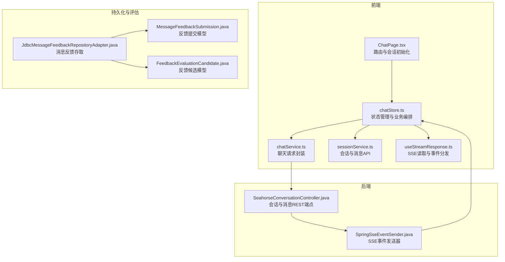
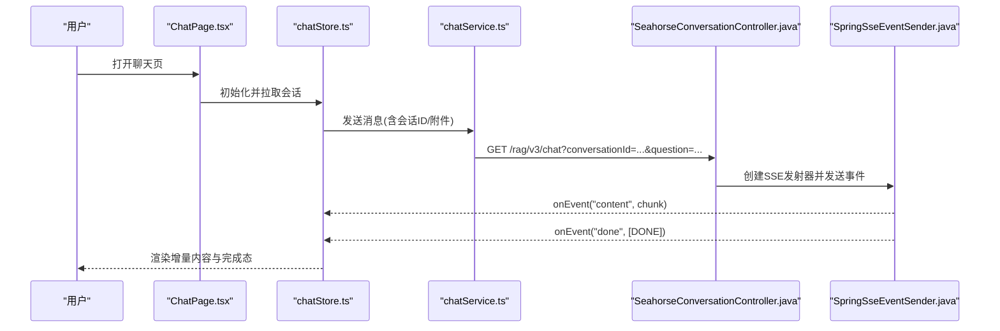
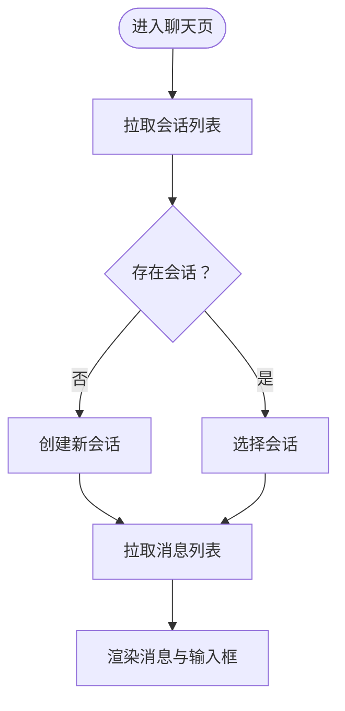
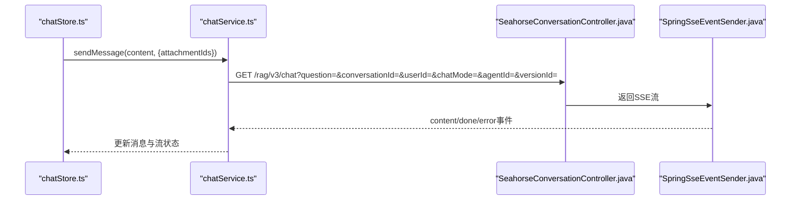
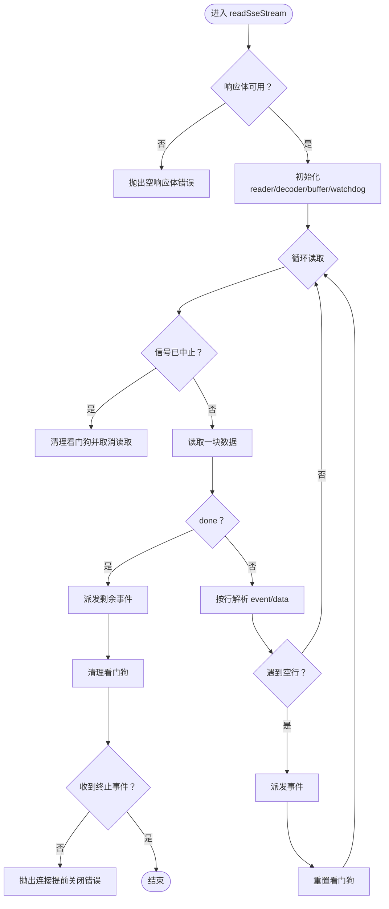
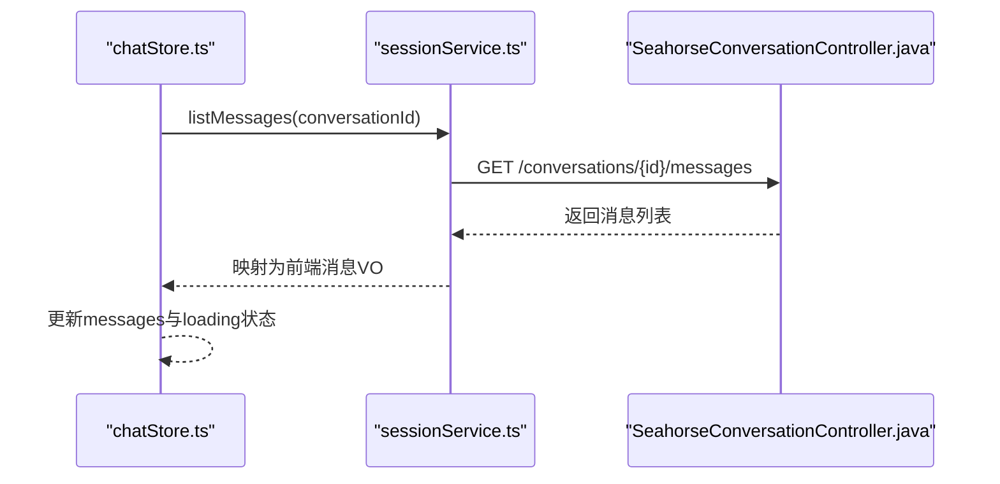
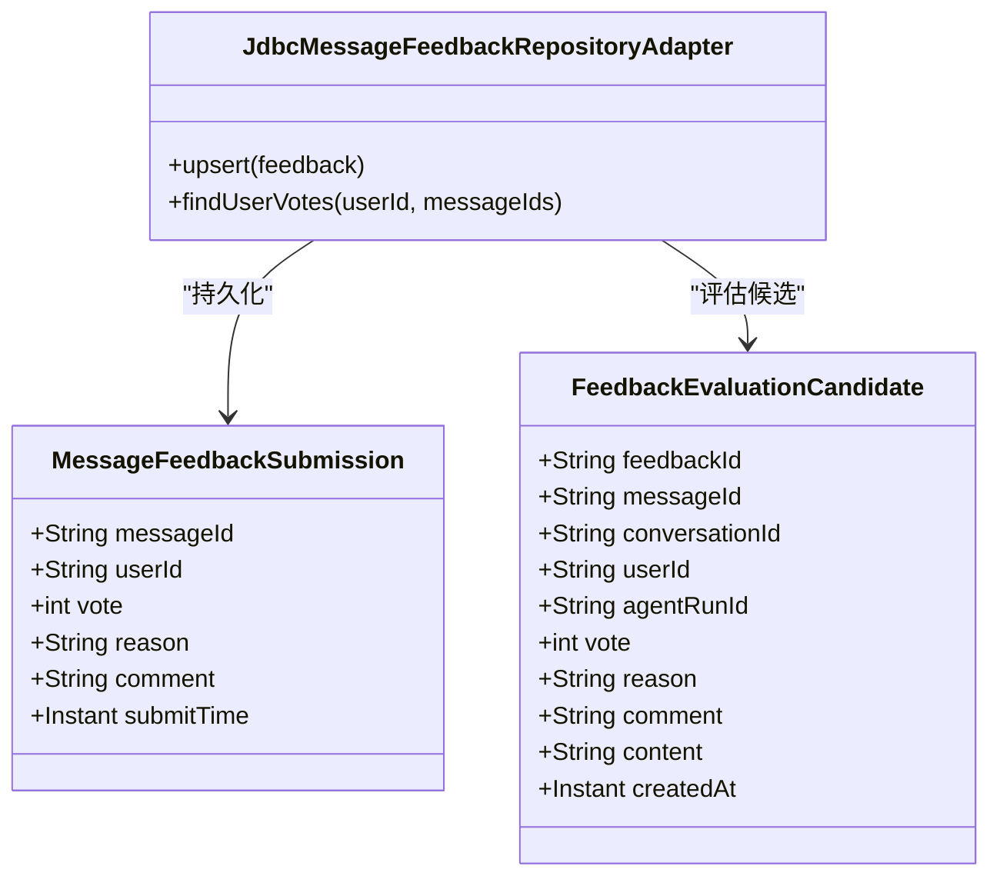
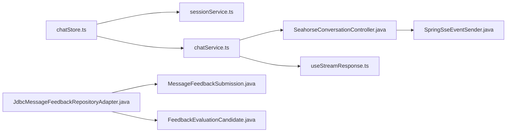

# 聊天服务

<cite>
**本文引用的文件**
- [chatService.ts](file://frontend/src/services/chatService.ts)
- [sessionService.ts](file://frontend/src/services/sessionService.ts)
- [useStreamResponse.ts](file://frontend/src/hooks/useStreamResponse.ts)
- [chatStore.ts](file://frontend/src/stores/chatStore.ts)
- [ChatPage.tsx](file://frontend/src/pages/ChatPage.tsx)
- [SeahorseConversationController.java](file://seahorse-agent-adapter-web/src/main/java/com/miracle/ai/seahorse/agent/adapters/web/SeahorseConversationController.java)
- [SpringSseEventSender.java](file://seahorse-agent-adapter-web/src/main/java/com/miracle/ai/seahorse/agent/adapters/local/SpringSseEventSender.java)
- [JdbcMessageFeedbackRepositoryAdapter.java](file://seahorse-agent-adapter-repository-jdbc/src/main/java/com/miracle/ai/seahorse/agent/adapters/repository/jdbc/JdbcMessageFeedbackRepositoryAdapter.java)
- [MessageFeedbackSubmission.java](file://seahorse-agent-kernel/src/main/java/com/miracle/ai/seahorse/agent/ports/outbound/feedback/MessageFeedbackSubmission.java)
- [FeedbackEvaluationCandidate.java](file://seahorse-agent-kernel/src/main/java/com/miracle/ai/seahorse/agent/ports/outbound/feedback/FeedbackEvaluationCandidate.java)
- [SeahorseWebApiContractTests.java](file://seahorse-agent-tests/src/test/java/com/miracle/ai/seahorse/agent/adapters/web/SeahorseWebApiContractTests.java)
</cite>

## 目录
1. [简介](#简介)
2. [项目结构](#项目结构)
3. [核心组件](#核心组件)
4. [架构总览](#架构总览)
5. [详细组件分析](#详细组件分析)
6. [依赖关系分析](#依赖关系分析)
7. [性能考量](#性能考量)
8. [故障排查指南](#故障排查指南)
9. [结论](#结论)
10. [附录](#附录)

## 简介
本文件面向开发者与产品团队，系统性梳理 Seahorse Agent 的聊天服务实现，覆盖以下方面：
- API 服务与会话管理：会话创建、重命名、删除、消息列表查询
- 实时通信：基于 SSE 的流式响应处理（连接建立、事件分发、消息拼接）
- 会话历史管理：消息列表获取、历史记录加载、会话状态维护
- 消息反馈机制：满意度评分、错误反馈与改进建议收集
- 错误处理策略：网络中断恢复、消息重发、状态同步
- 最佳实践与使用指南

## 项目结构
聊天能力由前端 Store/Service/Hook 与后端 Web 控制器共同构成，结合本地 SSE 发送器与 JDBC 反馈存储，形成端到端的聊天体验。

**图表来源**
- [ChatPage.tsx:37-96](file://frontend/src/pages/ChatPage.tsx#L37-L96)
- [chatStore.ts:45-191](file://frontend/src/stores/chatStore.ts#L45-L191)
- [chatService.ts](file://frontend/src/services/chatService.ts)
- [sessionService.ts:1-41](file://frontend/src/services/sessionService.ts#L1-L41)
- [useStreamResponse.ts:77-237](file://frontend/src/hooks/useStreamResponse.ts#L77-L237)
- [SeahorseConversationController.java:1-94](file://seahorse-agent-adapter-web/src/main/java/com/miracle/ai/seahorse/agent/adapters/web/SeahorseConversationController.java#L1-L94)
- [SpringSseEventSender.java:70-95](file://seahorse-agent-adapter-web/src/main/java/com/miracle/ai/seahorse/agent/adapters/local/SpringSseEventSender.java#L70-L95)
- [JdbcMessageFeedbackRepositoryAdapter.java:159-196](file://seahorse-agent-adapter-repository-jdbc/src/main/java/com/miracle/ai/seahorse/agent/adapters/repository/jdbc/JdbcMessageFeedbackRepositoryAdapter.java#L159-L196)
- [MessageFeedbackSubmission.java:35-59](file://seahorse-agent-kernel/src/main/java/com/miracle/ai/seahorse/agent/ports/outbound/feedback/MessageFeedbackSubmission.java#L35-L59)
- [FeedbackEvaluationCandidate.java:22-32](file://seahorse-agent-kernel/src/main/java/com/miracle/ai/seahorse/agent/ports/outbound/feedback/FeedbackEvaluationCandidate.java#L22-L32)

**章节来源**
- [ChatPage.tsx:37-96](file://frontend/src/pages/ChatPage.tsx#L37-L96)
- [chatStore.ts:45-191](file://frontend/src/stores/chatStore.ts#L45-L191)
- [sessionService.ts:1-41](file://frontend/src/services/sessionService.ts#L1-L41)
- [useStreamResponse.ts:77-237](file://frontend/src/hooks/useStreamResponse.ts#L77-L237)
- [SeahorseConversationController.java:1-94](file://seahorse-agent-adapter-web/src/main/java/com/miracle/ai/seahorse/agent/adapters/web/SeahorseConversationController.java#L1-L94)
- [SpringSseEventSender.java:70-95](file://seahorse-agent-adapter-web/src/main/java/com/miracle/ai/seahorse/agent/adapters/local/SpringSseEventSender.java#L70-L95)
- [JdbcMessageFeedbackRepositoryAdapter.java:159-196](file://seahorse-agent-adapter-repository-jdbc/src/main/java/com/miracle/ai/seahorse/agent/adapters/repository/jdbc/JdbcMessageFeedbackRepositoryAdapter.java#L159-L196)
- [MessageFeedbackSubmission.java:35-59](file://seahorse-agent-kernel/src/main/java/com/miracle/ai/seahorse/agent/ports/outbound/feedback/MessageFeedbackSubmission.java#L35-L59)
- [FeedbackEvaluationCandidate.java:22-32](file://seahorse-agent-kernel/src/main/java/com/miracle/ai/seahorse/agent/ports/outbound/feedback/FeedbackEvaluationCandidate.java#L22-L32)

## 核心组件
- 前端状态与业务编排：chatStore 统一管理会话、消息、流式状态、输入焦点等
- 会话与消息 API：sessionService 提供会话 CRUD 与消息列表查询
- 聊天请求封装：chatService 将消息发送、附件上传、流式响应读取整合
- SSE 读取与事件分发：useStreamResponse 解析 event/data 行，触发回调并处理看门狗超时
- 后端控制器：SeahorseConversationController 提供会话与消息 REST 端点
- SSE 发送器：SpringSseEventSender 负责事件名称与数据发送，并在异常时发送 error 与 DONE 事件
- 反馈存储与模型：JdbcMessageFeedbackRepositoryAdapter 存取消息反馈；MessageFeedbackSubmission/FeedbackEvaluationCandidate 定义反馈数据结构

**章节来源**
- [chatStore.ts:45-191](file://frontend/src/stores/chatStore.ts#L45-L191)
- [sessionService.ts:1-41](file://frontend/src/services/sessionService.ts#L1-L41)
- [chatService.ts](file://frontend/src/services/chatService.ts)
- [useStreamResponse.ts:77-237](file://frontend/src/hooks/useStreamResponse.ts#L77-L237)
- [SeahorseConversationController.java:1-94](file://seahorse-agent-adapter-web/src/main/java/com/miracle/ai/seahorse/agent/adapters/web/SeahorseConversationController.java#L1-L94)
- [SpringSseEventSender.java:70-95](file://seahorse-agent-adapter-web/src/main/java/com/miracle/ai/seahorse/agent/adapters/local/SpringSseEventSender.java#L70-L95)
- [JdbcMessageFeedbackRepositoryAdapter.java:159-196](file://seahorse-agent-adapter-repository-jdbc/src/main/java/com/miracle/ai/seahorse/agent/adapters/repository/jdbc/JdbcMessageFeedbackRepositoryAdapter.java#L159-L196)
- [MessageFeedbackSubmission.java:35-59](file://seahorse-agent-kernel/src/main/java/com/miracle/ai/seahorse/agent/ports/outbound/feedback/MessageFeedbackSubmission.java#L35-L59)
- [FeedbackEvaluationCandidate.java:22-32](file://seahorse-agent-kernel/src/main/java/com/miracle/ai/seahorse/agent/ports/outbound/feedback/FeedbackEvaluationCandidate.java#L22-L32)

## 架构总览
聊天服务采用“前端 Store/Service/Hook + 后端 REST + SSE”的分层架构。前端通过 chatStore 统一调度，调用 chatService 发起聊天请求，后端控制器转发到领域/适配器层，最终以 SSE 事件流返回给前端。反馈通过 JDBC 适配器持久化。

**图表来源**
- [ChatPage.tsx:37-96](file://frontend/src/pages/ChatPage.tsx#L37-L96)
- [chatStore.ts:188-250](file://frontend/src/stores/chatStore.ts#L188-L250)
- [chatService.ts](file://frontend/src/services/chatService.ts)
- [SeahorseConversationController.java:1-94](file://seahorse-agent-adapter-web/src/main/java/com/miracle/ai/seahorse/agent/adapters/web/SeahorseConversationController.java#L1-L94)
- [SpringSseEventSender.java:70-95](file://seahorse-agent-adapter-web/src/main/java/com/miracle/ai/seahorse/agent/adapters/local/SpringSseEventSender.java#L70-L95)

## 详细组件分析

### 会话管理与消息历史
- 会话生命周期
  - 创建：前端调用会话创建接口，后端返回会话ID；前端更新当前会话与会话列表
  - 重命名/删除：通过会话管理端点完成
  - 列表与详情：前端拉取会话列表，选择会话后拉取消息列表并渲染
- 数据模型
  - 会话 VO：包含会话ID、标题、最后时间
  - 消息 VO：包含消息ID、角色、内容、思考内容、投票、创建时间等

**图表来源**
- [ChatPage.tsx:56-96](file://frontend/src/pages/ChatPage.tsx#L56-L96)
- [chatStore.ts:64-191](file://frontend/src/stores/chatStore.ts#L64-L191)
- [sessionService.ts:22-41](file://frontend/src/services/sessionService.ts#L22-L41)

**章节来源**
- [sessionService.ts:1-41](file://frontend/src/services/sessionService.ts#L1-L41)
- [chatStore.ts:64-191](file://frontend/src/stores/chatStore.ts#L64-L191)
- [ChatPage.tsx:37-96](file://frontend/src/pages/ChatPage.tsx#L37-L96)

### 聊天请求构建与发送
- 请求参数
  - 必填：问题文本、会话ID、用户ID
  - 可选：聊天模式、代理ID/版本ID、附件ID数组
- 前端编排
  - chatStore 在发送前校验输入，设置流式状态与任务ID
  - chatService 调用后端 SSE 端点，使用 AbortSignal 控制取消
- 后端端点
  - 控制器提供会话消息查询端点，测试覆盖了异步启动与参数组合

**图表来源**
- [chatStore.ts:188-250](file://frontend/src/stores/chatStore.ts#L188-L250)
- [chatService.ts](file://frontend/src/services/chatService.ts)
- [SeahorseConversationController.java:89-101](file://seahorse-agent-adapter-web/src/main/java/com/miracle/ai/seahorse/agent/adapters/web/SeahorseConversationController.java#L89-L101)
- [SeahorseWebApiContractTests.java:288-317](file://seahorse-agent-tests/src/test/java/com/miracle/ai/seahorse/agent/adapters/web/SeahorseWebApiContractTests.java#L288-L317)

**章节来源**
- [chatStore.ts:188-250](file://frontend/src/stores/chatStore.ts#L188-L250)
- [SeahorseConversationController.java:89-101](file://seahorse-agent-adapter-web/src/main/java/com/miracle/ai/seahorse/agent/adapters/web/SeahorseConversationController.java#L89-L101)
- [SeahorseWebApiContractTests.java:288-317](file://seahorse-agent-tests/src/test/java/com/miracle/ai/seahorse/agent/adapters/web/SeahorseWebApiContractTests.java#L288-L317)

### 流式响应处理（SSE）
- 连接建立
  - 前端发起 GET 请求，后端以 SSE 返回
- 事件解析
  - useStreamResponse 逐行解析 event 与 data，合并同名事件的数据块
  - 支持去重：避免重复事件被多次派发
  - 终止事件：识别终止事件后标记完成
- 超时与取消
  - 看门狗定时器：每收到一次数据重置计时器，超时抛出错误
  - AbortSignal：支持主动取消，释放资源
- 错误处理
  - 连接提前关闭：在未收到终止事件时抛出错误
  - HTTP 错误：尝试解析 JSON 错误体，构造可读信息

**图表来源**
- [useStreamResponse.ts:77-237](file://frontend/src/hooks/useStreamResponse.ts#L77-L237)

**章节来源**
- [useStreamResponse.ts:77-237](file://frontend/src/hooks/useStreamResponse.ts#L77-L237)

### 会话历史管理
- 加载与渲染
  - 选择会话后，前端调用消息列表接口，将后端返回映射为前端消息结构
  - 支持思考内容、思考耗时、反馈状态等字段的展示
- 状态维护
  - chatStore 统一维护当前会话ID、消息列表、加载与流式状态
  - 会话操作（创建/删除/重命名）后同步更新会话列表与当前会话

**图表来源**
- [chatStore.ts:151-186](file://frontend/src/stores/chatStore.ts#L151-L186)
- [sessionService.ts:39-41](file://frontend/src/services/sessionService.ts#L39-L41)
- [SeahorseConversationController.java:89-96](file://seahorse-agent-adapter-web/src/main/java/com/miracle/ai/seahorse/agent/adapters/web/SeahorseConversationController.java#L89-L96)

**章节来源**
- [chatStore.ts:151-186](file://frontend/src/stores/chatStore.ts#L151-L186)
- [sessionService.ts:39-41](file://frontend/src/services/sessionService.ts#L39-L41)
- [SeahorseConversationController.java:89-96](file://seahorse-agent-adapter-web/src/main/java/com/miracle/ai/seahorse/agent/adapters/web/SeahorseConversationController.java#L89-L96)

### 消息反馈机制
- 反馈类型
  - 赞/踩：1/-1
  - 原因与评论：用于改进评估与审计
- 前端交互
  - FeedbackButtons 弹窗收集原因与评论，提交后更新消息反馈状态
- 后端存储
  - JDBC 适配器根据消息ID与用户ID查找或插入反馈记录，支持更新
  - Kernel 层定义反馈提交与候选模型，确保数据一致性

**图表来源**
- [MessageFeedbackSubmission.java:35-59](file://seahorse-agent-kernel/src/main/java/com/miracle/ai/seahorse/agent/ports/outbound/feedback/MessageFeedbackSubmission.java#L35-L59)
- [FeedbackEvaluationCandidate.java:22-32](file://seahorse-agent-kernel/src/main/java/com/miracle/ai/seahorse/agent/ports/outbound/feedback/FeedbackEvaluationCandidate.java#L22-L32)
- [JdbcMessageFeedbackRepositoryAdapter.java:159-196](file://seahorse-agent-adapter-repository-jdbc/src/main/java/com/miracle/ai/seahorse/agent/adapters/repository/jdbc/JdbcMessageFeedbackRepositoryAdapter.java#L159-L196)

**章节来源**
- [JdbcMessageFeedbackRepositoryAdapter.java:159-196](file://seahorse-agent-adapter-repository-jdbc/src/main/java/com/miracle/ai/seahorse/agent/adapters/repository/jdbc/JdbcMessageFeedbackRepositoryAdapter.java#L159-L196)
- [MessageFeedbackSubmission.java:35-59](file://seahorse-agent-kernel/src/main/java/com/miracle/ai/seahorse/agent/ports/outbound/feedback/MessageFeedbackSubmission.java#L35-L59)
- [FeedbackEvaluationCandidate.java:22-32](file://seahorse-agent-kernel/src/main/java/com/miracle/ai/seahorse/agent/ports/outbound/feedback/FeedbackEvaluationCandidate.java#L22-L32)

## 依赖关系分析
- 前端依赖
  - chatStore 依赖 sessionService 与 chatService
  - chatService 依赖后端 SSE 端点
  - useStreamResponse 作为通用 SSE 读取器被 chatService 复用
- 后端依赖
  - 控制器依赖会话管理入站端口，实际实现由适配器提供
  - SSE 发送器负责事件序列化与异常兜底
- 反馈依赖
  - JDBC 适配器依赖数据库访问层，Kernel 模型约束数据完整性

**图表来源**
- [chatStore.ts:45-191](file://frontend/src/stores/chatStore.ts#L45-L191)
- [sessionService.ts:1-41](file://frontend/src/services/sessionService.ts#L1-L41)
- [chatService.ts](file://frontend/src/services/chatService.ts)
- [SeahorseConversationController.java:1-94](file://seahorse-agent-adapter-web/src/main/java/com/miracle/ai/seahorse/agent/adapters/web/SeahorseConversationController.java#L1-L94)
- [SpringSseEventSender.java:70-95](file://seahorse-agent-adapter-web/src/main/java/com/miracle/ai/seahorse/agent/adapters/local/SpringSseEventSender.java#L70-L95)
- [useStreamResponse.ts:77-237](file://frontend/src/hooks/useStreamResponse.ts#L77-L237)
- [JdbcMessageFeedbackRepositoryAdapter.java:159-196](file://seahorse-agent-adapter-repository-jdbc/src/main/java/com/miracle/ai/seahorse/agent/adapters/repository/jdbc/JdbcMessageFeedbackRepositoryAdapter.java#L159-L196)
- [MessageFeedbackSubmission.java:35-59](file://seahorse-agent-kernel/src/main/java/com/miracle/ai/seahorse/agent/ports/outbound/feedback/MessageFeedbackSubmission.java#L35-L59)
- [FeedbackEvaluationCandidate.java:22-32](file://seahorse-agent-kernel/src/main/java/com/miracle/ai/seahorse/agent/ports/outbound/feedback/FeedbackEvaluationCandidate.java#L22-L32)

**章节来源**
- [chatStore.ts:45-191](file://frontend/src/stores/chatStore.ts#L45-L191)
- [sessionService.ts:1-41](file://frontend/src/services/sessionService.ts#L1-L41)
- [chatService.ts](file://frontend/src/services/chatService.ts)
- [SeahorseConversationController.java:1-94](file://seahorse-agent-adapter-web/src/main/java/com/miracle/ai/seahorse/agent/adapters/web/SeahorseConversationController.java#L1-L94)
- [SpringSseEventSender.java:70-95](file://seahorse-agent-adapter-web/src/main/java/com/miracle/ai/seahorse/agent/adapters/local/SpringSseEventSender.java#L70-L95)
- [useStreamResponse.ts:77-237](file://frontend/src/hooks/useStreamResponse.ts#L77-L237)
- [JdbcMessageFeedbackRepositoryAdapter.java:159-196](file://seahorse-agent-adapter-repository-jdbc/src/main/java/com/miracle/ai/seahorse/agent/adapters/repository/jdbc/JdbcMessageFeedbackRepositoryAdapter.java#L159-L196)
- [MessageFeedbackSubmission.java:35-59](file://seahorse-agent-kernel/src/main/java/com/miracle/ai/seahorse/agent/ports/outbound/feedback/MessageFeedbackSubmission.java#L35-L59)
- [FeedbackEvaluationCandidate.java:22-32](file://seahorse-agent-kernel/src/main/java/com/miracle/ai/seahorse/agent/ports/outbound/feedback/FeedbackEvaluationCandidate.java#L22-L32)

## 性能考量
- SSE 连接与背压
  - 建议前端在收到大量增量内容时进行节流渲染，避免 UI 抖动
  - 合理设置看门狗超时，平衡稳定性与延迟
- 并发与取消
  - 使用 AbortSignal 取消上一次生成任务，防止资源浪费
  - 后端应尽快释放 SSE 连接，避免长连接堆积
- 数据映射与缓存
  - chatStore 对消息映射为统一结构，减少渲染层计算
  - 会话列表与消息列表建议做轻量缓存，减少重复请求

## 故障排查指南
- SSE 连接问题
  - 看门狗超时：检查网络状况与后端处理耗时
  - 连接提前关闭：确认后端是否正确发送终止事件
  - 异常事件：后端在异常时会发送 error 与 DONE 事件，前端应捕获并提示
- 会话与消息异常
  - 会话创建失败：检查用户身份与权限解析
  - 消息列表为空：确认会话ID与用户ID匹配
- 反馈提交失败
  - 用户消息不可反馈：仅允许对助手消息提交反馈
  - 重复提交：后端根据消息ID与用户ID去重，避免重复计票

**章节来源**
- [useStreamResponse.ts:77-237](file://frontend/src/hooks/useStreamResponse.ts#L77-L237)
- [SpringSseEventSender.java:70-95](file://seahorse-agent-adapter-web/src/main/java/com/miracle/ai/seahorse/agent/adapters/local/SpringSseEventSender.java#L70-L95)
- [JdbcMessageFeedbackRepositoryAdapter.java:159-196](file://seahorse-agent-adapter-repository-jdbc/src/main/java/com/miracle/ai/seahorse/agent/adapters/repository/jdbc/JdbcMessageFeedbackRepositoryAdapter.java#L159-L196)

## 结论
本聊天服务通过清晰的前后端职责划分与 SSE 流式传输，实现了从会话管理到实时对话再到反馈闭环的完整链路。建议在生产环境中重点关注连接稳定性、事件去重与取消控制、以及反馈数据的合规性与可审计性。

## 附录
- API 使用要点
  - 会话管理：创建、重命名、删除、消息列表查询
  - 聊天请求：携带会话ID、问题文本、可选附件与代理参数
  - SSE 事件：content 用于增量内容，done 用于结束，error 用于异常
  - 反馈：仅对助手消息提交，支持原因与评论