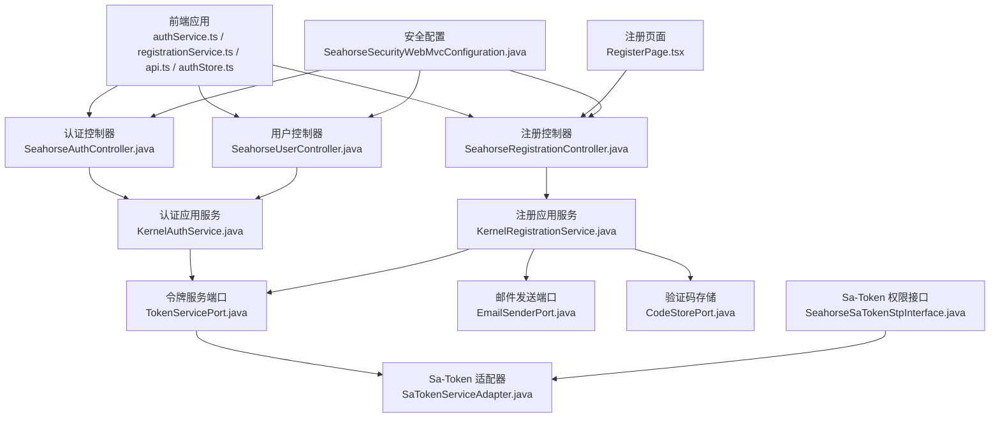
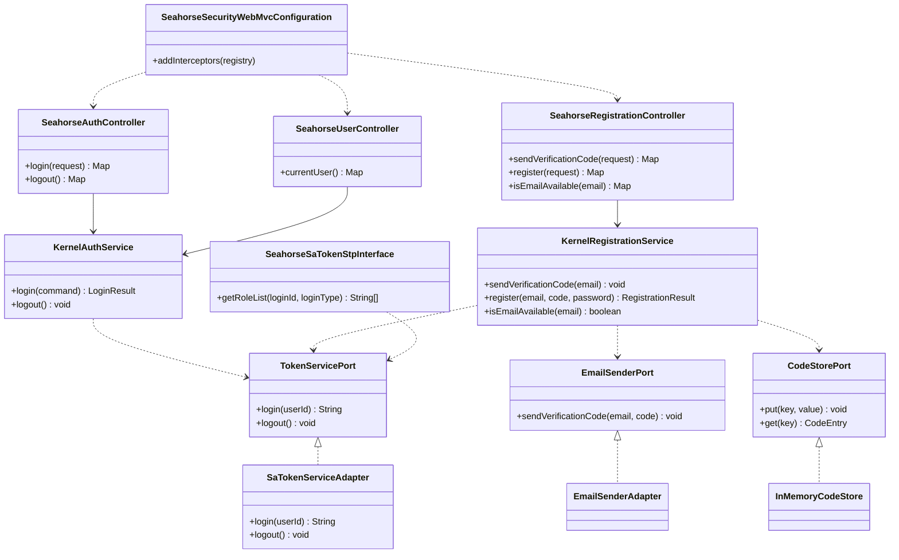
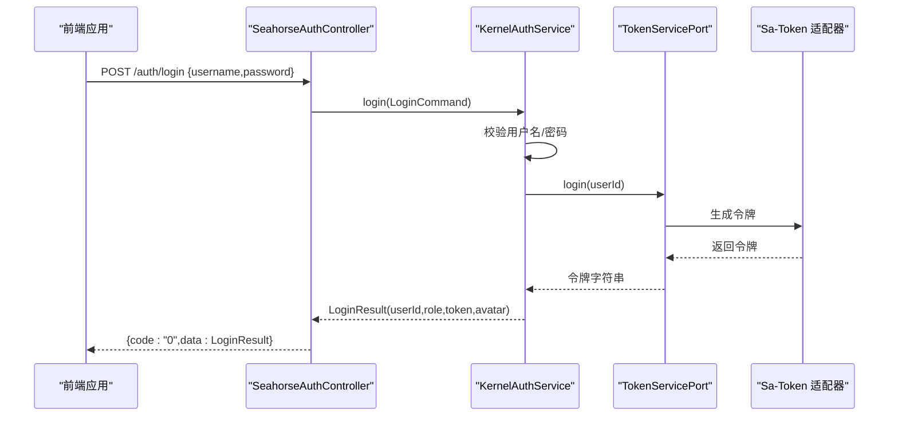
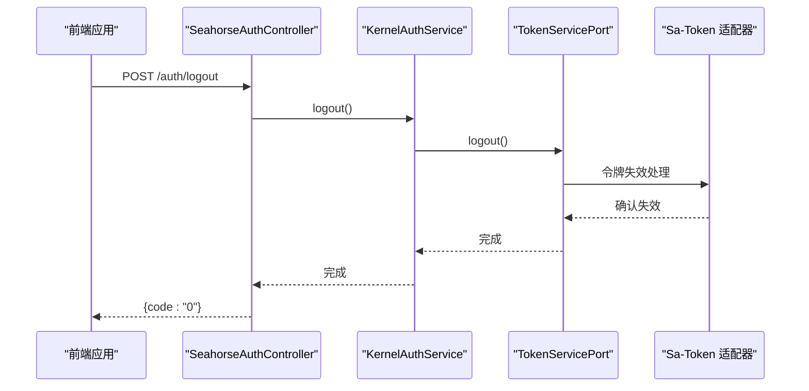
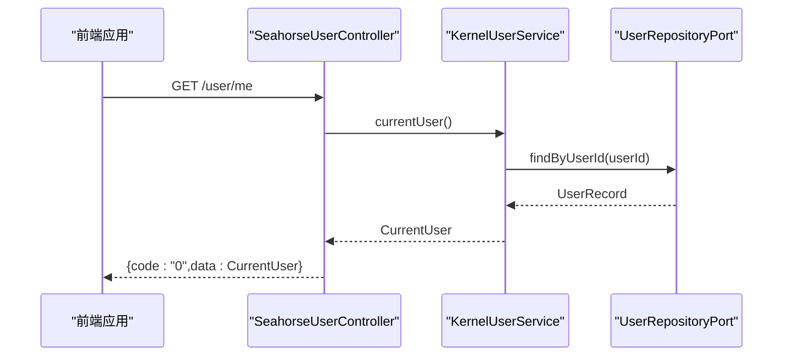
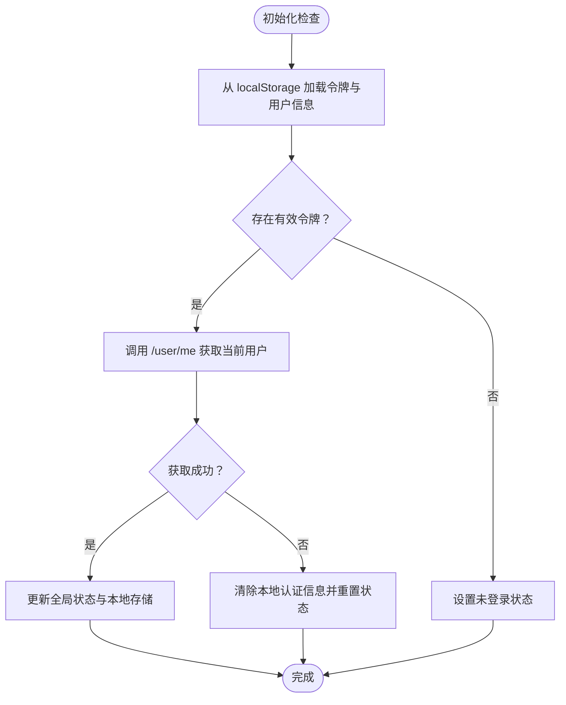
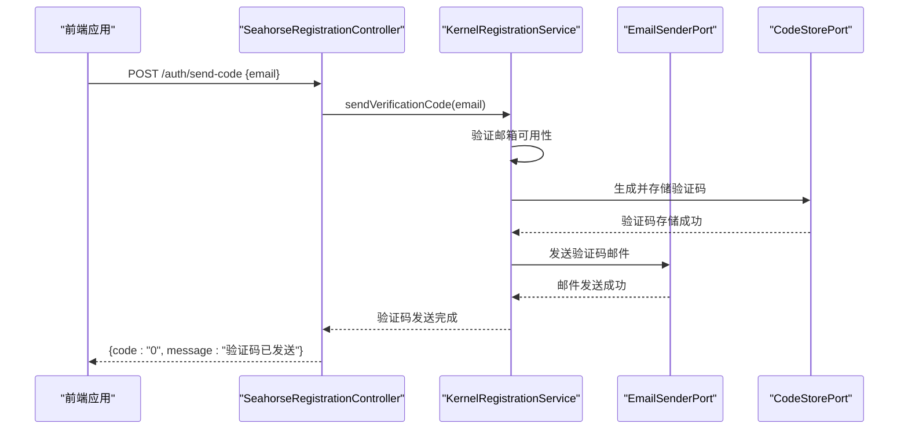
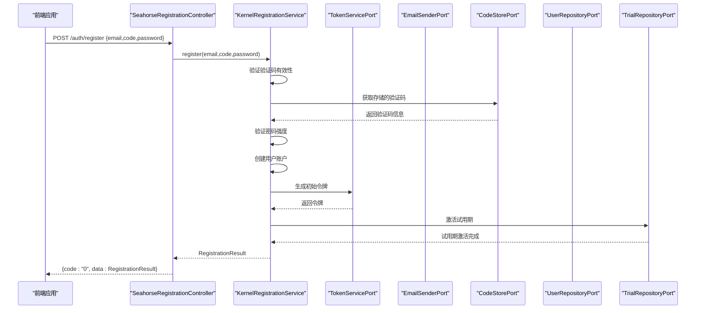
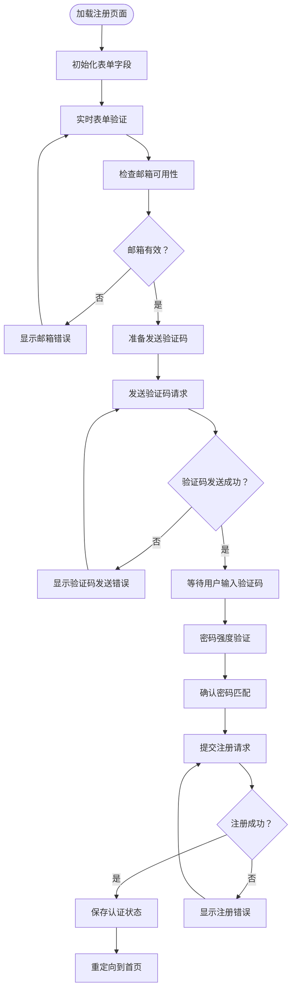
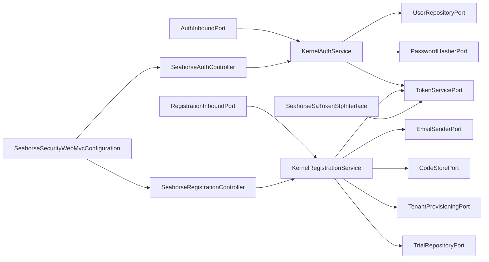

# 认证服务

<cite>
**本文引用的文件**
- [KernelAuthService.java](file://seahorse-agent-kernel/src/main/java/com/miracle/ai/seahorse/agent/kernel/application/auth/KernelAuthService.java)
- [KernelRegistrationService.java](file://seahorse-agent-kernel/src/main/java/com/miracle/ai/seahorse/agent/kernel/application/auth/KernelRegistrationService.java)
- [AuthInboundPort.java](file://seahorse-agent-kernel/src/main/java/com/miracle/ai/seahorse/agent/ports/inbound/auth/AuthInboundPort.java)
- [RegistrationInboundPort.java](file://seahorse-agent-kernel/src/main/java/com/miracle/ai/seahorse/agent/ports/inbound/auth/RegistrationInboundPort.java)
- [TokenServicePort.java](file://seahorse-agent-kernel/src/main/java/com/miracle/ai/seahorse/agent/ports/outbound/auth/TokenServicePort.java)
- [SeahorseAuthController.java](file://seahorse-agent-adapter-web/src/main/java/com/miracle/ai/seahorse/agent/adapters/web/SeahorseAuthController.java)
- [SeahorseRegistrationController.java](file://seahorse-agent-adapter-web/src/main/java/com/miracle/ai/seahorse/agent/adapters/web/SeahorseRegistrationController.java)
- [SeahorseUserController.java](file://seahorse-agent-adapter-web/src/main/java/com/miracle/ai/seahorse/agent/adapters/web/SeahorseUserController.java)
- [authService.ts](file://frontend/src/services/authService.ts)
- [registrationService.ts](file://frontend/src/services/registrationService.ts)
- [authStore.ts](file://frontend/src/stores/authStore.ts)
- [api.ts](file://frontend/src/services/api.ts)
- [authSession.ts](file://frontend/src/utils/authSession.ts)
- [storage.ts](file://frontend/src/utils/storage.ts)
- [RegisterPage.tsx](file://frontend/src/pages/RegisterPage.tsx)
- [认证接口.md](file://docs/zh/content/API 接口文档/认证接口.md)
</cite>

## 更新摘要
**所做更改**
- 新增注册功能章节，涵盖邮箱验证、验证码发送和密码创建流程
- 更新架构图以包含注册控制器和相关组件
- 添加注册API接口文档和前端注册页面实现
- 扩展认证服务功能，支持基于邮箱的用户注册
- 更新依赖关系图以反映新增的注册服务组件

## 目录
1. [简介](#简介)
2. [项目结构](#项目结构)
3. [核心组件](#核心组件)
4. [架构总览](#架构总览)
5. [详细组件分析](#详细组件分析)
6. [注册功能](#注册功能)
7. [依赖分析](#依赖分析)
8. [性能考虑](#性能考虑)
9. [故障排除指南](#故障排除指南)
10. [结论](#结论)
11. [附录](#附录)

## 简介
本文件为 Seahorse Agent 认证服务的完整技术文档，覆盖用户登录、登出、当前用户查询、权限验证以及用户注册的完整工作原理。内容包括：
- 登录接口：请求参数、响应格式、认证令牌生成与返回
- 登出接口：处理流程与令牌失效机制
- 权限验证：基于 Sa-Token 的登录拦截与角色权限检查
- 注册功能：邮箱验证、验证码发送、密码创建与账户激活
- 前端集成：认证中间件（Axios）配置、状态管理与路由守卫
- 完整请求/响应示例：成功与失败场景
- 安全最佳实践与常见问题解决方案

## 项目结构
认证相关能力由后端 Web 适配层、内核应用层与前端共同协作完成：
- 后端
  - 控制器：提供 /auth/login、/auth/logout、/auth/register、/auth/send-code 接口
  - 应用服务：内核认证服务负责校验凭据、生成令牌；内核注册服务负责邮箱验证与账户创建
  - 安全配置：全局拦截器强制登录校验
  - 适配器：Sa-Token 令牌服务与当前用户适配
- 前端
  - Axios 请求拦截器自动附加 Authorization 头
  - 认证状态管理与路由守卫
  - 登录/登出/注册/获取当前用户的服务封装

**图表来源**
- [认证接口.md:53-72](file://docs/zh/content/API 接口文档/认证接口.md#L53-L72)

**章节来源**
- [认证接口.md:41-51](file://docs/zh/content/API 接口文档/认证接口.md#L41-L51)

## 核心组件
- 内核认证服务：负责用户名密码校验、令牌签发与登出处理
- 内核注册服务：负责邮箱验证、验证码生成与用户注册
- 认证控制器：暴露 /auth/login 与 /auth/logout REST 接口
- 注册控制器：暴露 /auth/register、/auth/send-code、/auth/email-available 接口
- 用户控制器：提供 /user/me 查询当前用户信息
- 令牌服务端口：抽象令牌生成与失效机制
- 邮件发送端口：负责验证码邮件发送
- 验证码存储端口：管理验证码的存储与过期处理
- 前端认证服务：封装登录、登出、当前用户查询
- 前端注册服务：封装邮箱验证、验证码发送、用户注册
- 前端状态管理：维护用户会话状态与本地存储

**章节来源**
- [KernelAuthService.java:30-81](file://seahorse-agent-kernel/src/main/java/com/miracle/ai/seahorse/agent/kernel/application/auth/KernelAuthService.java#L30-L81)
- [KernelRegistrationService.java:78-102](file://seahorse-agent-kernel/src/main/java/com/miracle/ai/seahorse/agent/kernel/application/auth/KernelRegistrationService.java#L78-L102)
- [SeahorseAuthController.java:30-55](file://seahorse-agent-adapter-web/src/main/java/com/miracle/ai/seahorse/agent/adapters/web/SeahorseAuthController.java#L30-L55)
- [SeahorseRegistrationController.java:59-80](file://seahorse-agent-adapter-web/src/main/java/com/miracle/ai/seahorse/agent/adapters/web/SeahorseRegistrationController.java#L59-L80)
- [SeahorseUserController.java:37-91](file://seahorse-agent-adapter-web/src/main/java/com/miracle/ai/seahorse/agent/adapters/web/SeahorseUserController.java#L37-L91)

## 架构总览
认证服务采用分层架构，通过端口适配器模式实现关注点分离：
- 入站端口定义业务契约（AuthInboundPort、RegistrationInboundPort）
- 出站端口抽象外部依赖（TokenServicePort、EmailSenderPort、CodeStorePort）
- Web 适配器实现 HTTP 接口与 Spring MVC 控制器
- 前端通过 Axios 封装统一的认证 API 调用

**图表来源**
- [认证接口.md:312-344](file://docs/zh/content/API 接口文档/认证接口.md#L312-L344)

**章节来源**
- [认证接口.md:310-345](file://docs/zh/content/API 接口文档/认证接口.md#L310-L345)

## 详细组件分析

### 登录认证流程
登录流程包含用户名密码验证、令牌生成与会话建立三个关键步骤：

**图表来源**
- [SeahorseAuthController.java:43-48](file://seahorse-agent-adapter-web/src/main/java/com/miracle/ai/seahorse/agent/adapters/web/SeahorseAuthController.java#L43-L48)
- [KernelAuthService.java:46-64](file://seahorse-agent-kernel/src/main/java/com/miracle/ai/seahorse/agent/kernel/application/auth/KernelAuthService.java#L46-L64)
- [TokenServicePort.java:20-25](file://seahorse-agent-kernel/src/main/java/com/miracle/ai/seahorse/agent/ports/outbound/auth/TokenServicePort.java#L20-L25)

登录流程的关键处理逻辑：
- 输入参数验证：用户名与密码均不能为空
- 用户查找与密码校验：通过 UserRepositoryPort 查找用户并验证密码哈希
- 令牌生成：调用 TokenServicePort.login 生成认证令牌
- 响应构建：返回用户标识、角色、令牌与头像信息

**章节来源**
- [KernelAuthService.java:46-64](file://seahorse-agent-kernel/src/main/java/com/miracle/ai/seahorse/agent/kernel/application/auth/KernelAuthService.java#L46-L64)
- [SeahorseAuthController.java:43-48](file://seahorse-agent-adapter-web/src/main/java/com/miracle/ai/seahorse/agent/adapters/web/SeahorseAuthController.java#L43-L48)

### 登出与会话失效
登出流程负责清理客户端会话并使服务端令牌失效：

**图表来源**
- [SeahorseAuthController.java:50-54](file://seahorse-agent-adapter-web/src/main/java/com/miracle/ai/seahorse/agent/adapters/web/SeahorseAuthController.java#L50-L54)
- [KernelAuthService.java:66-69](file://seahorse-agent-kernel/src/main/java/com/miracle/ai/seahorse/agent/kernel/application/auth/KernelAuthService.java#L66-L69)

登出处理要点：
- 调用 TokenServicePort.logout 清理服务端会话
- 前端清除本地存储的令牌与用户信息
- 重置 Axios 默认 Authorization 头

**章节来源**
- [KernelAuthService.java:66-69](file://seahorse-agent-kernel/src/main/java/com/miracle/ai/seahorse/agent/kernel/application/auth/KernelAuthService.java#L66-L69)
- [SeahorseAuthController.java:50-54](file://seahorse-agent-adapter-web/src/main/java/com/miracle/ai/seahorse/agent/adapters/web/SeahorseAuthController.java#L50-L54)

### 当前用户查询
当前用户查询接口用于获取已登录用户的详细信息：

**图表来源**
- [SeahorseUserController.java:50-53](file://seahorse-agent-adapter-web/src/main/java/com/miracle/ai/seahorse/agent/adapters/web/SeahorseUserController.java#L50-L53)

**章节来源**
- [SeahorseUserController.java:50-53](file://seahorse-agent-adapter-web/src/main/java/com/miracle/ai/seahorse/agent/adapters/web/SeahorseUserController.java#L50-L53)

### 前端认证状态管理
前端通过 Zustand 状态管理器维护认证状态与本地存储：

**图表来源**
- [authStore.ts:94-118](file://frontend/src/stores/authStore.ts#L94-L118)
- [storage.ts:31-59](file://frontend/src/utils/storage.ts#L31-L59)

**章节来源**
- [authStore.ts:24-118](file://frontend/src/stores/authStore.ts#L24-L118)
- [storage.ts:31-66](file://frontend/src/utils/storage.ts#L31-L66)

### 权限验证机制
系统采用 Sa-Token 框架实现基于角色的权限控制：
- 登录拦截：全局安全配置强制要求登录态
- 角色检查：通过 SeahorseSaTokenStpInterface 获取用户角色列表
- 资源访问控制：结合业务端口进行细粒度权限验证

**章节来源**
- [认证接口.md:333-344](file://docs/zh/content/API 接口文档/认证接口.md#L333-L344)

## 注册功能

### 邮箱验证与验证码发送
注册功能支持基于邮箱的用户认证，包含邮箱验证、验证码发送和密码创建三个主要步骤：

**图表来源**
- [SeahorseRegistrationController.java:62-61](file://seahorse-agent-adapter-web/src/main/java/com/miracle/ai/seahorse/agent/adapters/web/SeahorseRegistrationController.java#L62-L61)
- [KernelRegistrationService.java:86-95](file://seahorse-agent-kernel/src/main/java/com/miracle/ai/seahorse/agent/kernel/application/auth/KernelRegistrationService.java#L86-L95)

注册流程的关键处理逻辑：
- 邮箱验证：检查邮箱格式和唯一性
- 验证码生成：生成6位数字验证码并设置过期时间
- 存储管理：将验证码存储到CodeStorePort，设置TTL
- 邮件发送：通过EmailSenderPort发送验证码邮件

**章节来源**
- [KernelRegistrationService.java:86-95](file://seahorse-agent-kernel/src/main/java/com/miracle/ai/seahorse/agent/kernel/application/auth/KernelRegistrationService.java#L86-L95)
- [SeahorseRegistrationController.java:62-61](file://seahorse-agent-adapter-web/src/main/java/com/miracle/ai/seahorse/agent/adapters/web/SeahorseRegistrationController.java#L62-L61)

### 用户注册与账户创建
用户注册流程包含验证码验证、密码创建和租户激活等步骤：

**图表来源**
- [SeahorseRegistrationController.java:65-71](file://seahorse-agent-adapter-web/src/main/java/com/miracle/ai/seahorse/agent/adapters/web/SeahorseRegistrationController.java#L65-71)
- [KernelRegistrationService.java:98-102](file://seahorse-agent-kernel/src/main/java/com/miracle/ai/seahorse/agent/kernel/application/auth/KernelRegistrationService.java#L98-102)

注册流程的关键处理逻辑：
- 验证码验证：检查验证码是否匹配且未过期
- 密码验证：验证密码长度和复杂度要求
- 用户创建：通过UserRepositoryPort创建新用户
- 令牌生成：调用TokenServicePort生成认证令牌
- 试用激活：通过TrialRepositoryPort激活用户试用期

**章节来源**
- [KernelRegistrationService.java:98-102](file://seahorse-agent-kernel/src/main/java/com/miracle/ai/seahorse/agent/kernel/application/auth/KernelRegistrationService.java#L98-L102)
- [SeahorseRegistrationController.java:65-71](file://seahorse-agent-adapter-web/src/main/java/com/miracle/ai/seahorse/agent/adapters/web/SeahorseRegistrationController.java#L65-71)

### 前端注册页面实现
前端注册页面提供完整的用户注册体验，包含表单验证、验证码发送和注册提交功能：

**图表来源**
- [RegisterPage.tsx:112-156](file://frontend/src/pages/RegisterPage.tsx#L112-L156)

**章节来源**
- [RegisterPage.tsx:112-156](file://frontend/src/pages/RegisterPage.tsx#L112-L156)

## 依赖分析
认证模块的依赖关系清晰，遵循端口适配器模式：

**图表来源**
- [AuthInboundPort.java:20-25](file://seahorse-agent-kernel/src/main/java/com/miracle/ai/seahorse/agent/ports/inbound/auth/AuthInboundPort.java#L20-L25)
- [RegistrationInboundPort.java:20-25](file://seahorse-agent-kernel/src/main/java/com/miracle/ai/seahorse/agent/ports/inbound/auth/RegistrationInboundPort.java#L20-L25)
- [KernelAuthService.java:34-44](file://seahorse-agent-kernel/src/main/java/com/miracle/ai/seahorse/agent/kernel/application/auth/KernelAuthService.java#L34-L44)
- [KernelRegistrationService.java:78-83](file://seahorse-agent-kernel/src/main/java/com/miracle/ai/seahorse/agent/kernel/application/auth/KernelRegistrationService.java#L78-L83)
- [SeahorseAuthController.java:37-41](file://seahorse-agent-adapter-web/src/main/java/com/miracle/ai/seahorse/agent/adapters/web/SeahorseAuthController.java#L37-L41)
- [SeahorseRegistrationController.java:59-61](file://seahorse-agent-adapter-web/src/main/java/com/miracle/ai/seahorse/agent/adapters/web/SeahorseRegistrationController.java#L59-L61)

**章节来源**
- [AuthInboundPort.java:20-25](file://seahorse-agent-kernel/src/main/java/com/miracle/ai/seahorse/agent/ports/inbound/auth/AuthInboundPort.java#L20-L25)
- [RegistrationInboundPort.java:20-25](file://seahorse-agent-kernel/src/main/java/com/miracle/ai/seahorse/agent/ports/inbound/auth/RegistrationInboundPort.java#L20-L25)
- [TokenServicePort.java:20-25](file://seahorse-agent-kernel/src/main/java/com/miracle/ai/seahorse/agent/ports/outbound/auth/TokenServicePort.java#L20-L25)

## 性能考虑
- 密码哈希成本：合理配置密码哈希算法的成本参数，平衡安全性与性能
- 令牌缓存：在高并发场景下考虑令牌缓存与分布式锁
- 验证码存储：验证码采用内存存储时需考虑内存使用和过期清理
- 邮件发送：异步发送验证码邮件，避免阻塞注册流程
- 连接池优化：数据库连接池与外部服务调用的超时配置
- 前端状态同步：避免重复的 /user/me 请求，利用本地存储进行状态缓存

## 故障排除指南
常见认证问题与解决方案：

### 登录失败
- 检查用户名与密码是否为空
- 确认用户是否存在且密码正确
- 验证 TokenServicePort 实现是否正常工作

### 注册相关问题
- 验证码发送失败：检查邮件服务器配置和网络连接
- 验证码过期：验证码默认TTL为5分钟，需重新发送
- 邮箱已被注册：检查邮箱唯一性约束
- 密码不符合要求：密码长度至少8位，需包含字母和数字

### 会话过期
- 前端自动检测：Axios 响应拦截器识别未登录状态
- 自动跳转：authSession.ts 将用户重定向到登录页
- 状态清理：确保 localStorage 中的令牌与用户信息被清除

### 权限拒绝
- 检查用户角色配置
- 验证 Sa-Token 权限接口实现
- 确认全局安全配置生效

**章节来源**
- [api.ts:30-67](file://frontend/src/services/api.ts#L30-L67)
- [authSession.ts:28-49](file://frontend/src/utils/authSession.ts#L28-L49)
- [authStore.ts:68-93](file://frontend/src/stores/authStore.ts#L68-L93)
- [KernelRegistrationService.java:86-102](file://seahorse-agent-kernel/src/main/java/com/miracle/ai/seahorse/agent/kernel/application/auth/KernelRegistrationService.java#L86-L102)

## 结论
Seahorse Agent 认证服务通过清晰的分层架构与端口适配器模式实现了可扩展的认证能力。系统现已支持完整的用户认证流程，包括传统的用户名密码登录和基于邮箱的用户注册功能。后端提供标准的 REST 接口，前端通过统一的状态管理与拦截器实现无缝的用户体验。结合 Sa-Token 的权限控制，系统能够满足企业级应用的安全需求。

## 附录

### API 使用指南
- 登录：POST /auth/login {username,password}
- 登出：POST /auth/logout
- 获取当前用户：GET /user/me
- 发送验证码：POST /auth/send-code {email}
- 用户注册：POST /auth/register {email,code,password}
- 检查邮箱可用性：GET /auth/email-available?email={email}

### 安全最佳实践
- 令牌保护：使用 HTTPS 传输，限制令牌有效期
- CSRF 防护：在表单中添加 CSRF token
- 安全传输：启用 HSTS，配置安全的 Cookie 属性
- 输入验证：对所有用户输入进行严格的验证与清理
- 验证码安全：验证码采用一次性使用，设置合理的过期时间
- 密码安全：强制密码复杂度要求，定期更换密码策略
- 邮件安全：使用加密连接发送验证码邮件，防止中间人攻击

### 注册流程说明
- 邮箱验证：确保邮箱格式正确且未被注册
- 验证码机制：6位数字验证码，5分钟有效期
- 密码要求：至少8位字符，包含字母和数字
- 试用激活：新用户自动激活试用期服务
- 错误处理：详细的错误提示和重试机制