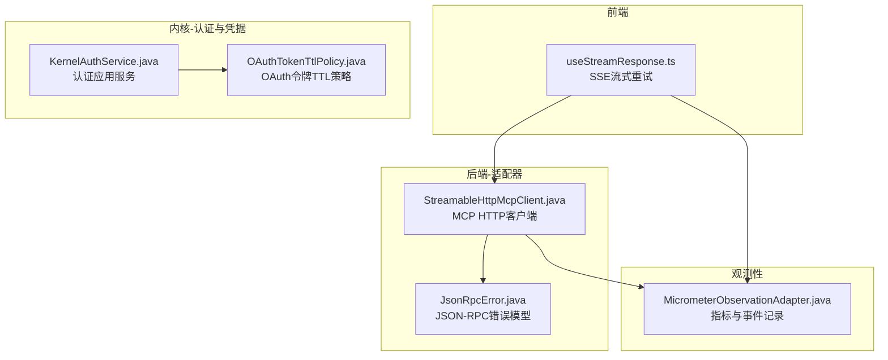
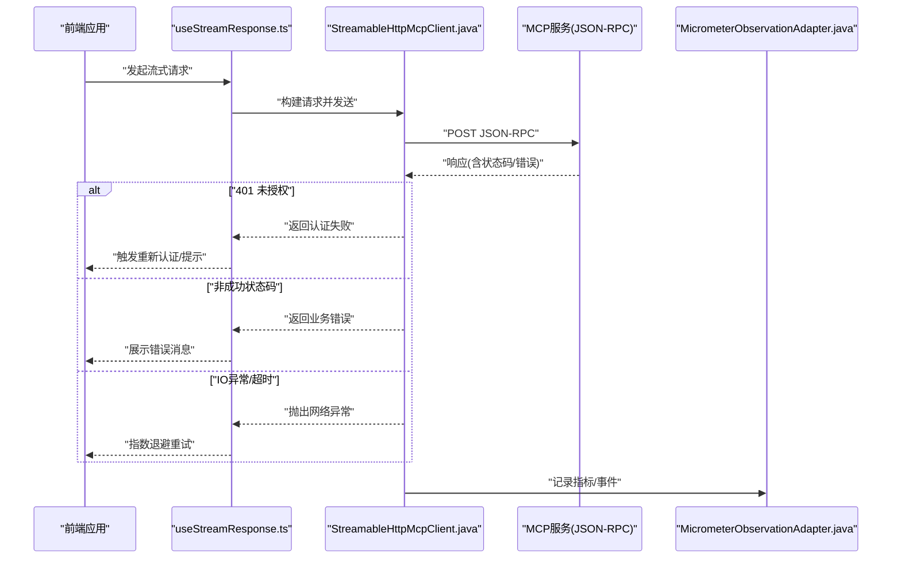
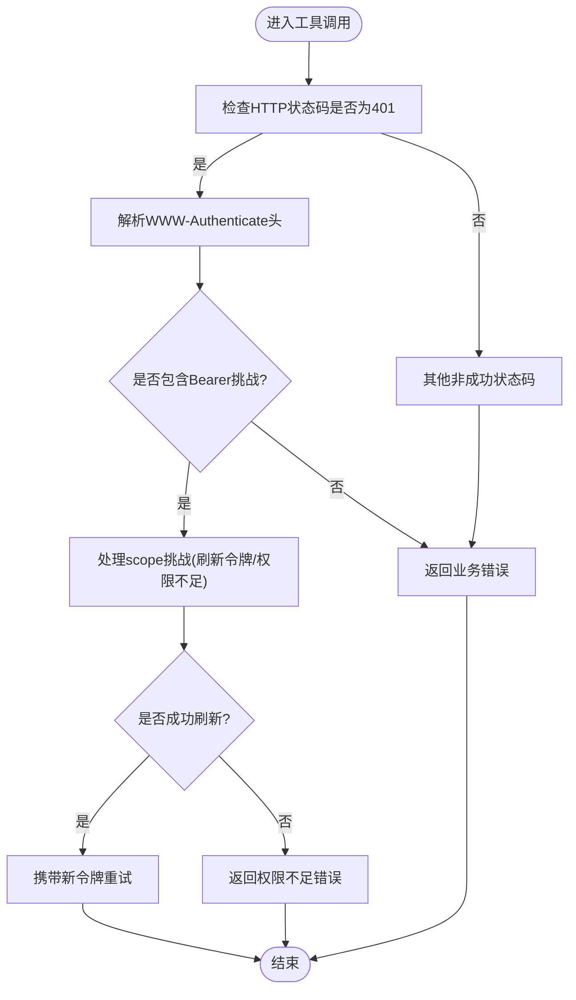
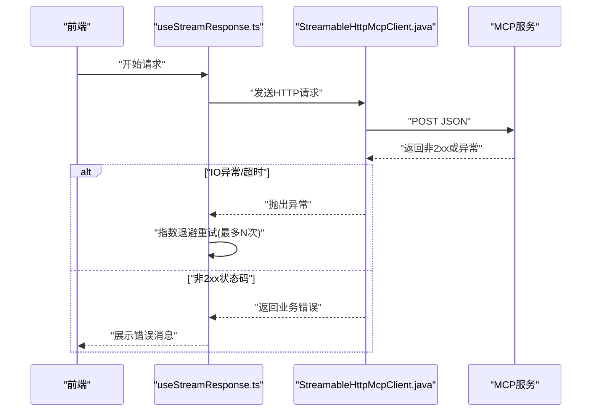
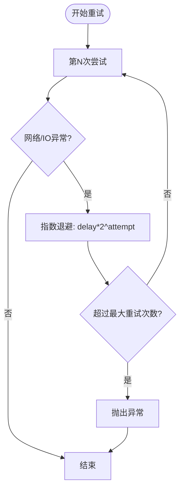
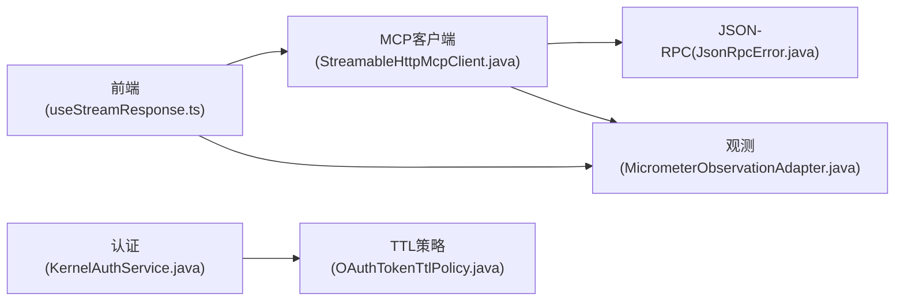

# 错误处理机制

<cite>
**本文引用的文件**
- [KernelAuthService.java](file://seahorse-agent-kernel/src/main/java/com/miracle/ai/seahorse/agent/kernel/application/auth/KernelAuthService.java)
- [AuthInboundPort.java](file://seahorse-agent-kernel/src/main/java/com/miracle/ai/seahorse/agent/ports/inbound/auth/AuthInboundPort.java)
- [LoginCommand.java](file://seahorse-agent-kernel/src/main/java/com/miracle/ai/seahorse/agent/ports/inbound/auth/LoginCommand.java)
- [LoginResult.java](file://seahorse-agent-kernel/src/main/java/com/miracle/ai/seahorse/agent/ports/inbound/auth/LoginResult.java)
- [CurrentUserPort.java](file://seahorse-agent-kernel/src/main/java/com/miracle/ai/seahorse/agent/ports/outbound/auth/CurrentUserPort.java)
- [TokenServicePort.java](file://seahorse-agent-kernel/src/main/java/com/miracle/ai/seahorse/agent/ports/outbound/auth/TokenServicePort.java)
- [OAuthTokenTtlPolicy.java](file://seahorse-agent-kernel/src/main/java/com/miracle/ai/seahorse/agent/ports/outbound/credential/OAuthTokenTtlPolicy.java)
- [OAuthCredentialProviderTests.java](file://seahorse-agent-kernel/src/test/java/com/miracle/ai/seahorse/agent/ports/outbound/credential/OAuthCredentialProviderTests.java)
- [SeahorseAgentCredentialAutoConfigurationTests.java](file://seahorse-agent-spring-boot-starter/src/test/java/com/miracle/ai/seahorse/agent/adapters/spring/SeahorseAgentCredentialAutoConfigurationTests.java)
- [01-MCP-OAuth2-安全增强设计.md](file://docs/zh/content/架构设计/未实现功能详细设计/01-MCP-OAuth2-安全增强设计.md)
- [JsonRpcError.java](file://seahorse-agent-mcp-server/src/main/java/com/miracle/ai/seahorse/agent/adapters/mcp/server/protocol/JsonRpcError.java)
- [StreamableHttpMcpClient.java](file://seahorse-agent-adapter-mcp-http/src/main/java/com/miracle/ai/seahorse/agent/adapters/mcp/http/StreamableHttpMcpClient.java)
- [useStreamResponse.ts](file://frontend/src/hooks/useStreamResponse.ts)
- [MicrometerObservationAdapter.java](file://seahorse-agent-adapter-observation-micrometer/src/main/java/com/miracle/ai/seahorse/agent/adapters/observation/micrometer/MicrometerObservationAdapter.java)
- [KernelAgentRunServiceTests.java](file://seahorse-agent-kernel/src/test/java/com/miracle/ai/seahorse/agent/kernel/application/agent/runtime/KernelAgentRunServiceTests.java)
- [KernelMetadataQuarantineServiceTests.java](file://seahorse-agent-tests/src/test/java/com/miracle/ai/seahorse/agent/kernel/application/metadata/KernelMetadataQuarantineServiceTests.java)
- [KernelMemoryManagementService.java](file://seahorse-agent-kernel/src/main/java/com/miracle/ai/seahorse/agent/kernel/application/memory/KernelMemoryManagementService.java)
</cite>

## 目录
1. [引言](#引言)
2. [项目结构](#项目结构)
3. [核心组件](#核心组件)
4. [架构总览](#架构总览)
5. [详细组件分析](#详细组件分析)
6. [依赖关系分析](#依赖关系分析)
7. [性能考量](#性能考量)
8. [故障排查指南](#故障排查指南)
9. [结论](#结论)
10. [附录](#附录)

## 引言
本文件系统性梳理 Seahorse Agent 的错误处理机制，覆盖 API 调用中的错误策略与实现：HTTP 错误（网络错误、服务器错误、超时）、业务错误（API 返回码解析、错误消息展示与用户提示）、认证错误（401 未授权、令牌过期与会话失效）、错误重试（自动重试策略、指数退避、最大重试次数）、以及错误监控与上报（日志、指标与告警）。文档同时提供最佳实践与调试技巧，帮助开发者快速定位与修复问题。

## 项目结构
围绕错误处理的关键模块分布如下：
- 认证与凭据：内核应用层认证服务、凭据 TTL 策略、Spring 自动装配测试
- MCP 客户端与协议：HTTP MCP 客户端、JSON-RPC 错误模型
- 前端流式响应与重试：SSE 流式响应钩子与指数退避重试
- 观测性与监控：Micrometer 指标适配器
- 运行时与元数据重试：Agent 运行重试、元数据隔离重试与阈值告警

图表来源
- [useStreamResponse.ts:289-320](file://frontend/src/hooks/useStreamResponse.ts#L289-L320)
- [StreamableHttpMcpClient.java:185-199](file://seahorse-agent-adapter-mcp-http/src/main/java/com/miracle/ai/seahorse/agent/adapters/mcp/http/StreamableHttpMcpClient.java#L185-L199)
- [JsonRpcError.java:30-56](file://seahorse-agent-mcp-server/src/main/java/com/miracle/ai/seahorse/agent/adapters/mcp/server/protocol/JsonRpcError.java#L30-L56)
- [KernelAuthService.java](file://seahorse-agent-kernel/src/main/java/com/miracle/ai/seahorse/agent/kernel/application/auth/KernelAuthService.java)
- [OAuthTokenTtlPolicy.java:34-40](file://seahorse-agent-kernel/src/main/java/com/miracle/ai/seahorse/agent/ports/outbound/credential/OAuthTokenTtlPolicy.java#L34-L40)
- [MicrometerObservationAdapter.java:56-142](file://seahorse-agent-adapter-observation-micrometer/src/main/java/com/miracle/ai/seahorse/agent/adapters/observation/micrometer/MicrometerObservationAdapter.java#L56-L142)

章节来源
- [useStreamResponse.ts:289-320](file://frontend/src/hooks/useStreamResponse.ts#L289-L320)
- [StreamableHttpMcpClient.java:185-199](file://seahorse-agent-adapter-mcp-http/src/main/java/com/miracle/ai/seahorse/agent/adapters/mcp/http/StreamableHttpMcpClient.java#L185-L199)
- [JsonRpcError.java:30-56](file://seahorse-agent-mcp-server/src/main/java/com/miracle/ai/seahorse/agent/adapters/mcp/server/protocol/JsonRpcError.java#L30-L56)
- [KernelAuthService.java](file://seahorse-agent-kernel/src/main/java/com/miracle/ai/seahorse/agent/kernel/application/auth/KernelAuthService.java)
- [OAuthTokenTtlPolicy.java:34-40](file://seahorse-agent-kernel/src/main/java/com/miracle/ai/seahorse/agent/ports/outbound/credential/OAuthTokenTtlPolicy.java#L34-L40)
- [MicrometerObservationAdapter.java:56-142](file://seahorse-agent-adapter-observation-micrometer/src/main/java/com/miracle/ai/seahorse/agent/adapters/observation/micrometer/MicrometerObservationAdapter.java#L56-L142)

## 核心组件
- 认证与会话管理：内核认证应用服务负责登录、令牌签发与当前用户上下文；凭据 TTL 策略用于计算缓存有效期，避免过期或刚过期的令牌被使用。
- MCP HTTP 客户端：封装 OkHttp 请求，统一处理 401、非成功状态码与 IO 异常，返回标准化结果。
- JSON-RPC 错误模型：定义标准错误码与消息，便于前后端一致解析。
- 前端流式响应与重试：基于 SSE 的流式响应，内置指数退避重试与取消控制。
- 观测性指标：通过 Micrometer 统计事件、持续时间等，支持告警与趋势分析。

章节来源
- [KernelAuthService.java](file://seahorse-agent-kernel/src/main/java/com/miracle/ai/seahorse/agent/kernel/application/auth/KernelAuthService.java)
- [OAuthTokenTtlPolicy.java:34-40](file://seahorse-agent-kernel/src/main/java/com/miracle/ai/seahorse/agent/ports/outbound/credential/OAuthTokenTtlPolicy.java#L34-L40)
- [StreamableHttpMcpClient.java:185-199](file://seahorse-agent-adapter-mcp-http/src/main/java/com/miracle/ai/seahorse/agent/adapters/mcp/http/StreamableHttpMcpClient.java#L185-L199)
- [JsonRpcError.java:30-56](file://seahorse-agent-mcp-server/src/main/java/com/miracle/ai/seahorse/agent/adapters/mcp/server/protocol/JsonRpcError.java#L30-L56)
- [useStreamResponse.ts:289-320](file://frontend/src/hooks/useStreamResponse.ts#L289-L320)
- [MicrometerObservationAdapter.java:56-142](file://seahorse-agent-adapter-observation-micrometer/src/main/java/com/miracle/ai/seahorse/agent/adapters/observation/micrometer/MicrometerObservationAdapter.java#L56-L142)

## 架构总览
下图展示从前端到后端 MCP 服务的典型调用链路及错误处理要点：

图表来源
- [useStreamResponse.ts:289-320](file://frontend/src/hooks/useStreamResponse.ts#L289-L320)
- [StreamableHttpMcpClient.java:185-199](file://seahorse-agent-adapter-mcp-http/src/main/java/com/miracle/ai/seahorse/agent/adapters/mcp/http/StreamableHttpMcpClient.java#L185-L199)
- [MicrometerObservationAdapter.java:56-142](file://seahorse-agent-adapter-observation-micrometer/src/main/java/com/miracle/ai/seahorse/agent/adapters/observation/micrometer/MicrometerObservationAdapter.java#L56-L142)

## 详细组件分析

### 认证与会话错误处理
- 401 未授权与权限不足：MCP 工具适配器在收到 401 且包含 Bearer WWW-Authenticate 时，解析作用域挑战并尝试刷新令牌或提示权限不足。
- 令牌过期与缓存 TTL：通过 TTL 策略在获取令牌后计算可安全使用的剩余时间，避免使用即将过期的令牌。
- 登录与当前用户上下文：认证应用服务与入站/出站认证端口协同，确保登录成功后的用户信息与令牌可用。

图表来源
- [01-MCP-OAuth2-安全增强设计.md:419-450](file://docs/zh/content/架构设计/未实现功能详细设计/01-MCP-OAuth2-安全增强设计.md#L419-L450)
- [OAuthTokenTtlPolicy.java:34-40](file://seahorse-agent-kernel/src/main/java/com/miracle/ai/seahorse/agent/ports/outbound/credential/OAuthTokenTtlPolicy.java#L34-L40)

章节来源
- [01-MCP-OAuth2-安全增强设计.md:419-450](file://docs/zh/content/架构设计/未实现功能详细设计/01-MCP-OAuth2-安全增强设计.md#L419-L450)
- [OAuthTokenTtlPolicy.java:34-40](file://seahorse-agent-kernel/src/main/java/com/miracle/ai/seahorse/agent/ports/outbound/credential/OAuthTokenTtlPolicy.java#L34-L40)
- [KernelAuthService.java](file://seahorse-agent-kernel/src/main/java/com/miracle/ai/seahorse/agent/kernel/application/auth/KernelAuthService.java)
- [AuthInboundPort.java](file://seahorse-agent-kernel/src/main/java/com/miracle/ai/seahorse/agent/ports/inbound/auth/AuthInboundPort.java)
- [LoginCommand.java](file://seahorse-agent-kernel/src/main/java/com/miracle/ai/seahorse/agent/ports/inbound/auth/LoginCommand.java)
- [LoginResult.java](file://seahorse-agent-kernel/src/main/java/com/miracle/ai/seahorse/agent/ports/inbound/auth/LoginResult.java)
- [CurrentUserPort.java](file://seahorse-agent-kernel/src/main/java/com/miracle/ai/seahorse/agent/ports/outbound/auth/CurrentUserPort.java)
- [TokenServicePort.java](file://seahorse-agent-kernel/src/main/java/com/miracle/ai/seahorse/agent/ports/outbound/auth/TokenServicePort.java)

### HTTP 错误处理（网络、服务器、超时）
- 非成功状态码：客户端统一转换为业务错误，包含状态码与描述，便于前端展示。
- IO 异常与超时：捕获网络异常，前端进行指数退避重试，支持取消与最大重试次数限制。
- JSON-RPC 错误：服务端返回标准错误码与消息，便于客户端一致解析。

图表来源
- [useStreamResponse.ts:289-320](file://frontend/src/hooks/useStreamResponse.ts#L289-L320)
- [StreamableHttpMcpClient.java:185-199](file://seahorse-agent-adapter-mcp-http/src/main/java/com/miracle/ai/seahorse/agent/adapters/mcp/http/StreamableHttpMcpClient.java#L185-L199)
- [JsonRpcError.java:30-56](file://seahorse-agent-mcp-server/src/main/java/com/miracle/ai/seahorse/agent/adapters/mcp/server/protocol/JsonRpcError.java#L30-L56)

章节来源
- [useStreamResponse.ts:289-320](file://frontend/src/hooks/useStreamResponse.ts#L289-L320)
- [StreamableHttpMcpClient.java:185-199](file://seahorse-agent-adapter-mcp-http/src/main/java/com/miracle/ai/seahorse/agent/adapters/mcp/http/StreamableHttpMcpClient.java#L185-L199)
- [JsonRpcError.java:30-56](file://seahorse-agent-mcp-server/src/main/java/com/miracle/ai/seahorse/agent/adapters/mcp/server/protocol/JsonRpcError.java#L30-L56)

### 业务错误处理（返回码解析、消息展示、用户提示）
- 标准化错误：MCP 工具适配器将非 2xx 状态码映射为业务错误，包含错误代码与消息。
- 前端展示：根据错误类型与消息，向用户展示清晰提示；对于权限不足场景，引导用户确认权限或重新认证。
- JSON-RPC 错误：服务端返回标准错误码与消息，便于统一解析与展示。

章节来源
- [01-MCP-OAuth2-安全增强设计.md:438-443](file://docs/zh/content/架构设计/未实现功能详细设计/01-MCP-OAuth2-安全增强设计.md#L438-L443)
- [JsonRpcError.java:30-56](file://seahorse-agent-mcp-server/src/main/java/com/miracle/ai/seahorse/agent/adapters/mcp/server/protocol/JsonRpcError.java#L30-L56)

### 认证错误处理（401、令牌过期、会话失效）
- 401 未授权：检测 401 并解析 WWW-Authenticate，区分 scope 挑战与无效凭证，分别走刷新令牌或提示权限不足。
- 令牌过期：TTL 策略在缓存中避免使用即将过期的令牌，降低 401 风险。
- 会话失效：结合前端取消控制器与重试逻辑，避免无意义的重试；必要时引导用户重新登录。

章节来源
- [01-MCP-OAuth2-安全增强设计.md:419-436](file://docs/zh/content/架构设计/未实现功能详细设计/01-MCP-OAuth2-安全增强设计.md#L419-L436)
- [OAuthTokenTtlPolicy.java:34-40](file://seahorse-agent-kernel/src/main/java/com/miracle/ai/seahorse/agent/ports/outbound/credential/OAuthTokenTtlPolicy.java#L34-L40)
- [useStreamResponse.ts:289-320](file://frontend/src/hooks/useStreamResponse.ts#L289-L320)

### 错误重试机制（自动重试、指数退避、最大重试次数）
- 前端重试：SSE 流式响应钩子内置指数退避与最大重试次数控制，支持取消与恢复运行 ID。
- 运行时重试：Agent 运行服务支持在失败状态下进行重试，清理错误码与消息，保持幂等。
- 元数据隔离重试：当达到最大重试次数时，抛出异常并阻止继续重试，避免无限循环。

图表来源
- [useStreamResponse.ts:289-320](file://frontend/src/hooks/useStreamResponse.ts#L289-L320)
- [KernelAgentRunServiceTests.java:217-245](file://seahorse-agent-kernel/src/test/java/com/miracle/ai/seahorse/agent/kernel/application/agent/runtime/KernelAgentRunServiceTests.java#L217-L245)
- [KernelMetadataQuarantineServiceTests.java:74-105](file://seahorse-agent-tests/src/test/java/com/miracle/ai/seahorse/agent/kernel/application/metadata/KernelMetadataQuarantineServiceTests.java#L74-L105)

章节来源
- [useStreamResponse.ts:289-320](file://frontend/src/hooks/useStreamResponse.ts#L289-L320)
- [KernelAgentRunServiceTests.java:217-245](file://seahorse-agent-kernel/src/test/java/com/miracle/ai/seahorse/agent/kernel/application/agent/runtime/KernelAgentRunServiceTests.java#L217-L245)
- [KernelMetadataQuarantineServiceTests.java:74-105](file://seahorse-agent-tests/src/test/java/com/miracle/ai/seahorse/agent/kernel/application/metadata/KernelMetadataQuarantineServiceTests.java#L74-L105)

### 错误监控与上报（日志、指标、告警）
- 指标采集：Micrometer 适配器记录观测命令与事件，统计持续时间与事件数量，支持按租户与属性打标签。
- 告警阈值：内存管理服务根据队列积压、模式失败数与画像完整性等指标生成告警键，驱动告警策略。
- 日志记录：MCP 客户端在 IO 异常时记录错误日志，便于定位网络与超时问题。

章节来源
- [MicrometerObservationAdapter.java:56-142](file://seahorse-agent-adapter-observation-micrometer/src/main/java/com/miracle/ai/seahorse/agent/adapters/observation/micrometer/MicrometerObservationAdapter.java#L56-L142)
- [KernelMemoryManagementService.java:566-581](file://seahorse-agent-kernel/src/main/java/com/miracle/ai/seahorse/agent/kernel/application/memory/KernelMemoryManagementService.java#L566-L581)
- [StreamableHttpMcpClient.java:197-199](file://seahorse-agent-adapter-mcp-http/src/main/java/com/miracle/ai/seahorse/agent/adapters/mcp/http/StreamableHttpMcpClient.java#L197-L199)

## 依赖关系分析
- 前端与适配器：前端通过流式钩子与 MCP 客户端交互，MCP 客户端依赖 OkHttp 与 JSON 解析。
- 认证与凭据：认证应用服务依赖凭据提供者与令牌服务，TTL 策略保障令牌安全使用。
- 观测性：所有关键路径均接入 Micrometer，形成统一的可观测性视图。

图表来源
- [useStreamResponse.ts:289-320](file://frontend/src/hooks/useStreamResponse.ts#L289-L320)
- [StreamableHttpMcpClient.java:185-199](file://seahorse-agent-adapter-mcp-http/src/main/java/com/miracle/ai/seahorse/agent/adapters/mcp/http/StreamableHttpMcpClient.java#L185-L199)
- [JsonRpcError.java:30-56](file://seahorse-agent-mcp-server/src/main/java/com/miracle/ai/seahorse/agent/adapters/mcp/server/protocol/JsonRpcError.java#L30-L56)
- [KernelAuthService.java](file://seahorse-agent-kernel/src/main/java/com/miracle/ai/seahorse/agent/kernel/application/auth/KernelAuthService.java)
- [OAuthTokenTtlPolicy.java:34-40](file://seahorse-agent-kernel/src/main/java/com/miracle/ai/seahorse/agent/ports/outbound/credential/OAuthTokenTtlPolicy.java#L34-L40)
- [MicrometerObservationAdapter.java:56-142](file://seahorse-agent-adapter-observation-micrometer/src/main/java/com/miracle/ai/seahorse/agent/adapters/observation/micrometer/MicrometerObservationAdapter.java#L56-L142)

章节来源
- [useStreamResponse.ts:289-320](file://frontend/src/hooks/useStreamResponse.ts#L289-L320)
- [StreamableHttpMcpClient.java:185-199](file://seahorse-agent-adapter-mcp-http/src/main/java/com/miracle/ai/seahorse/agent/adapters/mcp/http/StreamableHttpMcpClient.java#L185-L199)
- [JsonRpcError.java:30-56](file://seahorse-agent-mcp-server/src/main/java/com/miracle/ai/seahorse/agent/adapters/mcp/server/protocol/JsonRpcError.java#L30-L56)
- [KernelAuthService.java](file://seahorse-agent-kernel/src/main/java/com/miracle/ai/seahorse/agent/kernel/application/auth/KernelAuthService.java)
- [OAuthTokenTtlPolicy.java:34-40](file://seahorse-agent-kernel/src/main/java/com/miracle/ai/seahorse/agent/ports/outbound/credential/OAuthTokenTtlPolicy.java#L34-L40)
- [MicrometerObservationAdapter.java:56-142](file://seahorse-agent-adapter-observation-micrometer/src/main/java/com/miracle/ai/seahorse/agent/adapters/observation/micrometer/MicrometerObservationAdapter.java#L56-L142)

## 性能考量
- 指数退避：前端重试采用指数退避，减少对下游的压力，提升整体成功率。
- 观测性指标：通过 Micrometer 收集延迟、事件计数与错误率，支撑容量规划与性能优化。
- 令牌缓存与 TTL：合理设置令牌缓存 TTL，减少频繁刷新带来的额外开销。

## 故障排查指南
- 401 未授权
  - 检查 WWW-Authenticate 头与 scope 挑战，确认权限范围是否满足。
  - 若为权限不足，引导用户调整权限或重新授权。
- 网络/IO 异常
  - 查看前端重试日志与最大重试次数，确认是否已达到上限。
  - 结合 MCP 客户端日志定位超时或连接失败。
- 业务错误
  - 解析 JSON-RPC 错误码与消息，区分方法不存在、参数非法与服务器内部错误。
- 重试失败
  - Agent 运行与元数据隔离重试均有最大次数限制，超过后应人工介入。
- 监控告警
  - 关注内存队列积压、模式失败数与画像完整性等阈值，及时扩容或修复。

章节来源
- [01-MCP-OAuth2-安全增强设计.md:419-450](file://docs/zh/content/架构设计/未实现功能详细设计/01-MCP-OAuth2-安全增强设计.md#L419-L450)
- [useStreamResponse.ts:289-320](file://frontend/src/hooks/useStreamResponse.ts#L289-L320)
- [StreamableHttpMcpClient.java:197-199](file://seahorse-agent-adapter-mcp-http/src/main/java/com/miracle/ai/seahorse/agent/adapters/mcp/http/StreamableHttpMcpClient.java#L197-L199)
- [JsonRpcError.java:30-56](file://seahorse-agent-mcp-server/src/main/java/com/miracle/ai/seahorse/agent/adapters/mcp/server/protocol/JsonRpcError.java#L30-L56)
- [KernelAgentRunServiceTests.java:217-245](file://seahorse-agent-kernel/src/test/java/com/miracle/ai/seahorse/agent/kernel/application/agent/runtime/KernelAgentRunServiceTests.java#L217-L245)
- [KernelMetadataQuarantineServiceTests.java:74-105](file://seahorse-agent-tests/src/test/java/com/miracle/ai/seahorse/agent/kernel/application/metadata/KernelMetadataQuarantineServiceTests.java#L74-L105)
- [KernelMemoryManagementService.java:566-581](file://seahorse-agent-kernel/src/main/java/com/miracle/ai/seahorse/agent/kernel/application/memory/KernelMemoryManagementService.java#L566-L581)

## 结论
Seahorse Agent 的错误处理机制以“标准化、可观测、可恢复”为核心：前端统一的流式重试与指数退避、后端 MCP 客户端的统一错误映射、认证层的 TTL 策略与权限挑战处理、以及 Micrometer 的指标与事件采集，共同构成了完整的错误处理闭环。配合明确的告警阈值与测试用例，能够有效提升系统的稳定性与可维护性。

## 附录
- 最佳实践
  - 对外接口统一返回标准化错误码与消息，前端一致展示。
  - 重试策略遵循指数退避与最大次数限制，避免雪崩效应。
  - 认证失败时优先处理权限挑战，其次再考虑刷新令牌。
  - 所有关键路径接入观测性，建立延迟、错误率与事件计数的监控。
- 调试技巧
  - 使用 AbortController 控制重试生命周期，便于测试与定位。
  - 在 MCP 客户端与前端钩子中增加日志输出，区分网络异常与业务错误。
  - 利用 Micrometer 指标仪表盘观察趋势变化，提前发现异常。