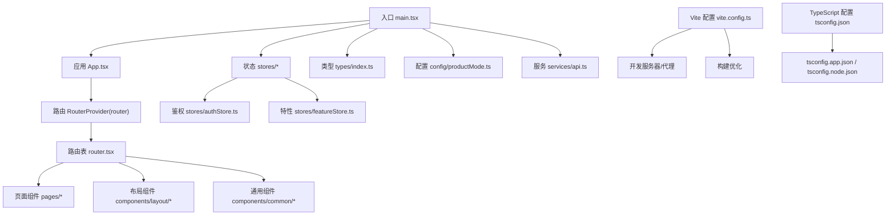
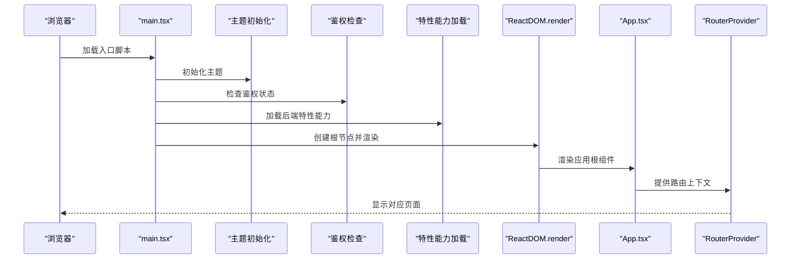
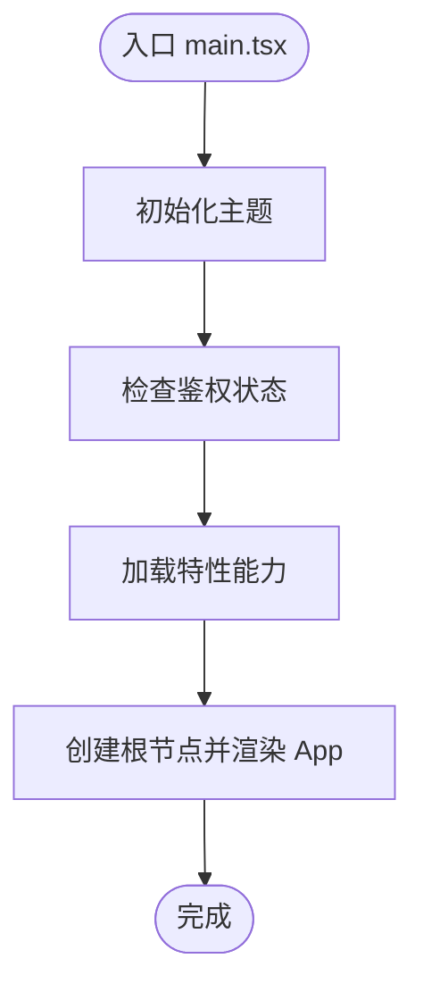
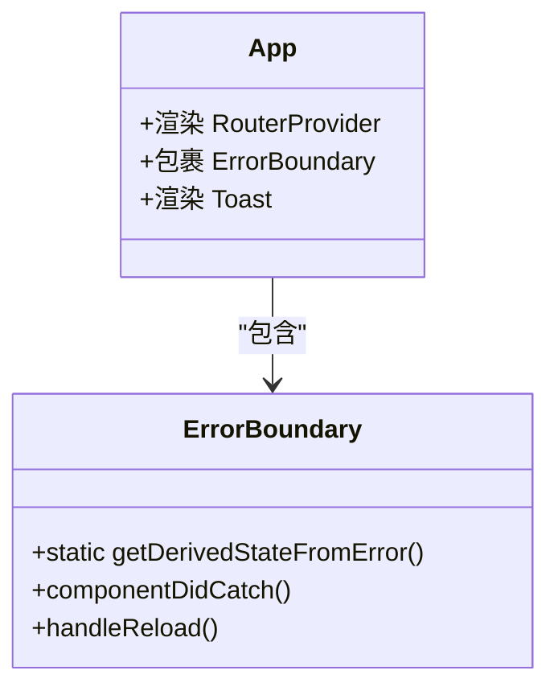
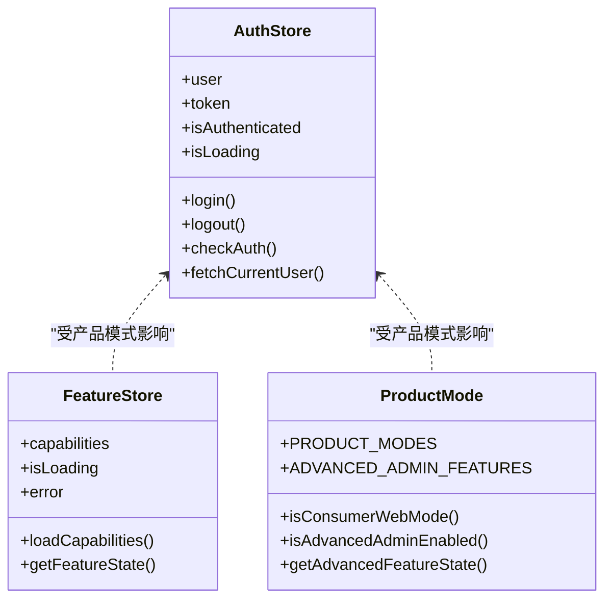
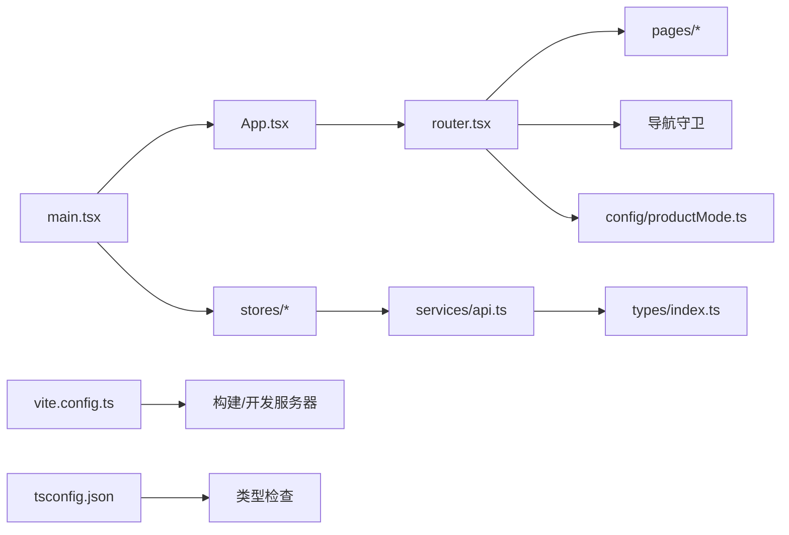

# React应用结构

<cite>
**本文引用的文件**
- [frontend/src/main.tsx](file://frontend/src/main.tsx)
- [frontend/src/App.tsx](file://frontend/src/App.tsx)
- [frontend/src/router.tsx](file://frontend/src/router.tsx)
- [frontend/vite.config.ts](file://frontend/vite.config.ts)
- [frontend/package.json](file://frontend/package.json)
- [frontend/tsconfig.json](file://frontend/tsconfig.json)
- [frontend/src/stores/authStore.ts](file://frontend/src/stores/authStore.ts)
- [frontend/src/stores/featureStore.ts](file://frontend/src/stores/featureStore.ts)
- [frontend/src/config/productMode.ts](file://frontend/src/config/productMode.ts)
- [frontend/src/types/index.ts](file://frontend/src/types/index.ts)
- [frontend/src/pages/ChatPage.tsx](file://frontend/src/pages/ChatPage.tsx)
- [frontend/src/services/api.ts](file://frontend/src/services/api.ts)
- [frontend/postcss.config.cjs](file://frontend/postcss.config.cjs)
- [frontend/tailwind.config.cjs](file://frontend/tailwind.config.cjs)
- [frontend/src/components/common/ErrorBoundary.tsx](file://frontend/src/components/common/ErrorBoundary.tsx)
</cite>

## 目录
1. [简介](#简介)
2. [项目结构](#项目结构)
3. [核心组件](#核心组件)
4. [架构总览](#架构总览)
5. [详细组件分析](#详细组件分析)
6. [依赖关系分析](#依赖关系分析)
7. [性能考虑](#性能考虑)
8. [故障排查指南](#故障排查指南)
9. [结论](#结论)
10. [附录](#附录)

## 简介
本文件面向Seahorse Agent前端（React 18.3.1 + Vite）应用，提供从入口初始化到路由系统、状态管理、类型系统、构建与开发配置的完整技术文档。重点覆盖以下方面：
- 应用入口点App.tsx与main.tsx的初始化流程与依赖注入顺序
- 路由系统设计：路由配置、嵌套路由、导航守卫与功能开关
- Vite构建配置与开发服务器代理设置
- TypeScript多项目引用配置与类型定义
- 启动流程：主题、鉴权、特性能力加载与渲染
- 开发与生产环境配置建议
- 可扩展的定制化指南

## 项目结构
前端采用Vite + React 18.3.1 + TypeScript + Zustand + Radix UI + TailwindCSS的现代化组合。核心目录与职责如下：
- src：源代码根目录
  - components：可复用UI与通用组件（如ErrorBoundary）
  - pages：页面级组件（如ChatPage、LoginPage等）
  - services：HTTP服务封装与Axios拦截器
  - stores：状态管理（Zustand）
  - config：产品模式与功能开关常量
  - types：全局类型定义
  - styles：主题与全局样式
  - hooks：自定义Hook
  - utils：工具函数与本地存储
- vite.config.*：Vite构建与开发服务器配置
- tsconfig.*：TypeScript多项目引用配置
- package.json：脚本、依赖与开发依赖

图表来源
- [frontend/src/main.tsx:1-20](file://frontend/src/main.tsx#L1-L20)
- [frontend/src/App.tsx:1-15](file://frontend/src/App.tsx#L1-L15)
- [frontend/src/router.tsx:1-235](file://frontend/src/router.tsx#L1-L235)
- [frontend/vite.config.ts:1-29](file://frontend/vite.config.ts#L1-L29)
- [frontend/tsconfig.json:1-8](file://frontend/tsconfig.json#L1-L8)

章节来源
- [frontend/src/main.tsx:1-20](file://frontend/src/main.tsx#L1-L20)
- [frontend/src/App.tsx:1-15](file://frontend/src/App.tsx#L1-L15)
- [frontend/src/router.tsx:1-235](file://frontend/src/router.tsx#L1-L235)
- [frontend/vite.config.ts:1-29](file://frontend/vite.config.ts#L1-L29)
- [frontend/tsconfig.json:1-8](file://frontend/tsconfig.json#L1-L8)

## 核心组件
- 入口与初始化：main.tsx负责主题初始化、鉴权检查、特性能力加载，并挂载App
- 应用根组件：App.tsx包裹RouterProvider与全局错误边界、通知组件
- 路由系统：router.tsx集中定义路由、嵌套路由与多种导航守卫
- 状态管理：Zustand stores（鉴权、特性、主题等），通过Hook在组件中使用
- 类型系统：全局类型定义集中在types/index.ts，统一消息、会话、Agent运行时数据结构
- 服务层：Axios实例与拦截器封装，统一处理鉴权头、错误提示与未授权会话处理
- 构建与样式：Vite配置、PostCSS/TailwindCSS主题与动画变量

章节来源
- [frontend/src/main.tsx:1-20](file://frontend/src/main.tsx#L1-L20)
- [frontend/src/App.tsx:1-15](file://frontend/src/App.tsx#L1-L15)
- [frontend/src/router.tsx:1-235](file://frontend/src/router.tsx#L1-L235)
- [frontend/src/stores/authStore.ts:1-120](file://frontend/src/stores/authStore.ts#L1-L120)
- [frontend/src/stores/featureStore.ts:1-42](file://frontend/src/stores/featureStore.ts#L1-L42)
- [frontend/src/types/index.ts:1-379](file://frontend/src/types/index.ts#L1-L379)
- [frontend/src/services/api.ts:1-68](file://frontend/src/services/api.ts#L1-L68)

## 架构总览
下图展示从浏览器加载到页面渲染的关键路径，以及状态初始化顺序。

图表来源
- [frontend/src/main.tsx:11-19](file://frontend/src/main.tsx#L11-L19)
- [frontend/src/App.tsx:7-14](file://frontend/src/App.tsx#L7-L14)
- [frontend/src/router.tsx:163-234](file://frontend/src/router.tsx#L163-L234)

## 详细组件分析

### 入口与初始化流程（main.tsx）
- 主题初始化：读取并初始化主题状态
- 鉴权检查：从本地存储恢复token与用户信息，设置全局Authorization头
- 特性能力加载：异步拉取后端能力清单，用于功能开关控制
- 渲染应用：StrictMode包裹，挂载App根组件

图表来源
- [frontend/src/main.tsx:11-19](file://frontend/src/main.tsx#L11-L19)

章节来源
- [frontend/src/main.tsx:1-20](file://frontend/src/main.tsx#L1-L20)

### 应用根组件（App.tsx）
- 包裹RouterProvider，提供路由上下文
- 错误边界：捕获子树异常并引导用户刷新
- 通知组件：全局Toast提示

图表来源
- [frontend/src/App.tsx:7-14](file://frontend/src/App.tsx#L7-L14)
- [frontend/src/components/common/ErrorBoundary.tsx:10-45](file://frontend/src/components/common/ErrorBoundary.tsx#L10-L45)

章节来源
- [frontend/src/App.tsx:1-15](file://frontend/src/App.tsx#L1-L15)
- [frontend/src/components/common/ErrorBoundary.tsx:1-46](file://frontend/src/components/common/ErrorBoundary.tsx#L1-L46)

### 路由系统（router.tsx）
- 路由配置：使用createBrowserRouter集中定义
- 导航守卫：
  - RequireAuth：未登录重定向至登录页
  - RequireAdmin：非管理员跳转聊天或登录
  - RedirectIfAuth：已登录用户禁止访问登录页
  - FeatureGuard：根据后端能力动态启用/禁用功能
- 嵌套路由：/admin下多级子路由，支持仪表盘、知识库、意图树、Agent管理、安全与集成等模块
- 功能开关：withFeature高阶函数包装子路由元素，结合产品模式与后端能力决定可见性与可用性

```mermaid
flowchart TD
Root["根路由('/')"] --> HomeRedirect["重定向到 /chat 或 /login"]
Login["/login"] --> RedirectIfAuth["已登录则重定向到 /chat"]
Chat["/chat(/:sessionId)"] --> RequireAuth["鉴权守卫"]
Admin["/admin"] --> RequireAdmin["管理员守卫"]
Admin --> AdminChildren["嵌套路由组"]
AdminChildren --> Dashboard["/admin/dashboard"]
AdminChildren --> Knowledge["/admin/knowledge(/:kbId)(/:docId)"]
AdminChildren --> Intent["/admin/intent-tree(/list/:id/edit)"]
AdminChildren --> Agents["/admin/agents(/new/:agentId/edit/rollout/eval)"]
AdminChildren --> Tools["/admin/tools(/:toolId)"]
AdminChildren --> Approvals["/admin/approvals"]
AdminChildren --> Security["/admin/security(resource-acl/access-decisions/quotas)"]
AdminChildren --> Integrations["/admin/integrations(connectors/:id)"]
AdminChildren --> Memory["/admin/memory-governance"]
AdminChildren --> Plugins["/admin/plugins"]
AdminChildren --> Audit["/admin/audit"]
AdminChildren --> Cost["/admin/cost"]
AdminChildren --> Sandbox["/admin/sandbox"]
NotFound["/*"] --> NotFoundPage["404 页面"]
```

图表来源
- [frontend/src/router.tsx:163-234](file://frontend/src/router.tsx#L163-L234)
- [frontend/src/router.tsx:59-88](file://frontend/src/router.tsx#L59-L88)
- [frontend/src/router.tsx:95-125](file://frontend/src/router.tsx#L95-L125)

章节来源
- [frontend/src/router.tsx:1-235](file://frontend/src/router.tsx#L1-L235)

### 状态管理（Zustand）
- 鉴权状态（authStore）：登录、登出、检查鉴权、获取当前用户；与本地存储与聊天状态联动
- 特性状态（featureStore）：拉取后端能力清单，查询某功能状态
- 产品模式（productMode）：消费端/企业平台模式切换，高级管理功能开关

图表来源
- [frontend/src/stores/authStore.ts:24-119](file://frontend/src/stores/authStore.ts#L24-L119)
- [frontend/src/stores/featureStore.ts:23-41](file://frontend/src/stores/featureStore.ts#L23-L41)
- [frontend/src/config/productMode.ts:3-89](file://frontend/src/config/productMode.ts#L3-L89)

章节来源
- [frontend/src/stores/authStore.ts:1-120](file://frontend/src/stores/authStore.ts#L1-L120)
- [frontend/src/stores/featureStore.ts:1-42](file://frontend/src/stores/featureStore.ts#L1-L42)
- [frontend/src/config/productMode.ts:1-90](file://frontend/src/config/productMode.ts#L1-L90)

### 类型系统（types/index.ts）
- 用户、会话、消息、Agent运行时事件、工件、内存、配额等核心类型
- 统一消息内容块（文本/工件）、反馈原因、Agent事件枚举
- 任务模板、配额摘要、用户记忆等扩展类型

章节来源
- [frontend/src/types/index.ts:1-379](file://frontend/src/types/index.ts#L1-L379)

### 页面组件示例（ChatPage）
- 会话管理：根据URL参数选择或创建会话，确保会话存在性与一致性
- 布局：可调整面板分栏，移动端/桌面端工作台侧栏
- 依赖：useChatStore、useWorkbenchStore、MainLayout

章节来源
- [frontend/src/pages/ChatPage.tsx:1-165](file://frontend/src/pages/ChatPage.tsx#L1-L165)

### 服务层（Axios封装与拦截器）
- 基础URL与超时配置
- 请求拦截：自动附加Authorization头
- 响应拦截：统一错误码校验、未授权处理、错误提示Toast
- 工具：handleUnauthorizedSession、setAuthToken

章节来源
- [frontend/src/services/api.ts:1-68](file://frontend/src/services/api.ts#L1-L68)

### 构建与开发配置（Vite）
- 插件：@vitejs/plugin-react
- 路径别名：@ -> src
- 开发服务器：端口5173，/api代理到后端9090
- 测试：jsdom环境、setupFiles、全局测试配置

章节来源
- [frontend/vite.config.ts:1-29](file://frontend/vite.config.ts#L1-L29)

### TypeScript配置
- 多项目引用：tsconfig.json引用app与node两个配置文件
- app配置：React TS项目
- node配置：Vite/TS Node工具链

章节来源
- [frontend/tsconfig.json:1-8](file://frontend/tsconfig.json#L1-L8)

### 样式与主题（TailwindCSS）
- PostCSS：tailwindcss + autoprefixer
- Tailwind：深色模式、颜色系统、字体、阴影、动画、渐变背景
- 与主题变量配合，实现暗/亮主题切换与品牌色彩体系

章节来源
- [frontend/postcss.config.cjs:1-7](file://frontend/postcss.config.cjs#L1-L7)
- [frontend/tailwind.config.cjs:1-93](file://frontend/tailwind.config.cjs#L1-L93)

## 依赖关系分析
- 入口依赖：main.tsx依赖stores（主题、鉴权、特性）、App、ReactDOM
- App依赖：RouterProvider、ErrorBoundary、Toast
- 路由依赖：各页面组件、AdminLayout、导航守卫、产品模式与特性状态
- 服务依赖：Axios实例、拦截器、本地存储与鉴权工具
- 构建依赖：Vite、React插件、TypeScript类型检查与测试框架

图表来源
- [frontend/src/main.tsx:1-20](file://frontend/src/main.tsx#L1-L20)
- [frontend/src/App.tsx:1-15](file://frontend/src/App.tsx#L1-L15)
- [frontend/src/router.tsx:1-235](file://frontend/src/router.tsx#L1-L235)
- [frontend/src/services/api.ts:1-68](file://frontend/src/services/api.ts#L1-L68)
- [frontend/vite.config.ts:1-29](file://frontend/vite.config.ts#L1-L29)
- [frontend/tsconfig.json:1-8](file://frontend/tsconfig.json#L1-L8)

## 性能考虑
- 路由懒加载：可结合React.lazy与Suspense进一步拆分页面bundle
- 图片与媒体：使用现代格式与按需加载策略
- 样式：Tailwind按需扫描content范围，避免无用类导致体积膨胀
- 构建优化：生产环境启用压缩、分包与资源内联策略
- 状态粒度：Zustand按域拆分store，避免不必要的重渲染
- 缓存：Axios响应缓存与本地存储合理利用，减少重复请求

## 故障排查指南
- 登录后无法进入聊天页
  - 检查鉴权状态是否正确写入本地存储与全局Authorization头
  - 确认后端返回的令牌有效性与过期时间
- 功能按钮不可见或不可用
  - 检查后端特性能力返回与产品模式配置
  - 确认FeatureGuard逻辑与getAdvancedFeatureState结果
- 401未授权频繁弹窗
  - 检查响应拦截器对未授权的处理逻辑与handleUnauthorizedSession行为
  - 确认Axios默认头是否被正确设置/清除
- 开发代理无效
  - 检查Vite代理配置与后端服务端口
  - 确认代理rewrite规则与跨域配置

章节来源
- [frontend/src/stores/authStore.ts:94-118](file://frontend/src/stores/authStore.ts#L94-L118)
- [frontend/src/services/api.ts:30-67](file://frontend/src/services/api.ts#L30-L67)
- [frontend/src/config/productMode.ts:70-89](file://frontend/src/config/productMode.ts#L70-L89)
- [frontend/vite.config.ts:14-21](file://frontend/vite.config.ts#L14-L21)

## 结论
本应用以Vite为构建基石，结合React 18.3.1与Zustand实现轻量高效的状态管理，路由系统通过导航守卫与功能开关实现灵活的产品化能力控制。入口初始化流程清晰，依赖注入顺序明确，便于扩展与维护。建议在后续迭代中引入路由懒加载、更细粒度的样式与状态拆分，以及完善的监控埋点与错误上报机制。

## 附录
- 开发环境
  - 使用Vite开发服务器，端口5173，/api代理至后端9090
  - 支持热更新与快速调试
- 生产环境
  - 使用Vite构建，启用压缩与分包
  - Tailwind按需生成，确保最小化样式体积
- 定制指南
  - 新增页面：在router.tsx中注册路由与守卫
  - 新增功能：在config/productMode.ts中声明特性键值，在featureStore中拉取能力
  - 新增组件：遵循Radix UI与Tailwind约定，保持一致的交互与视觉风格