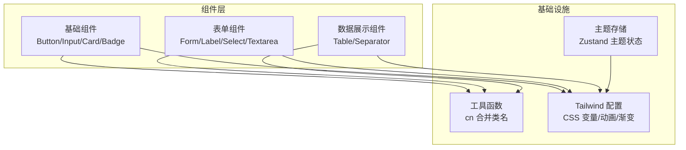
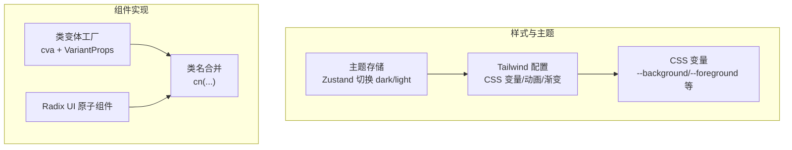
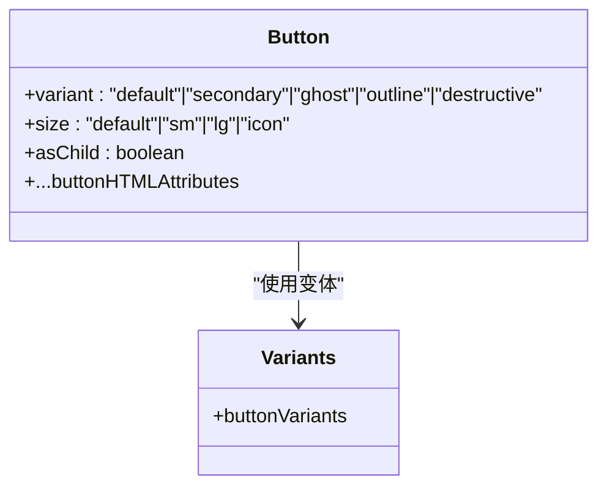
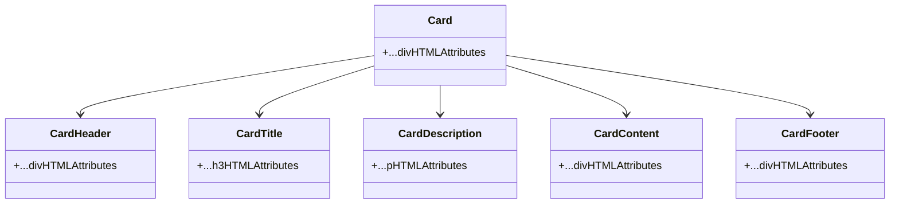
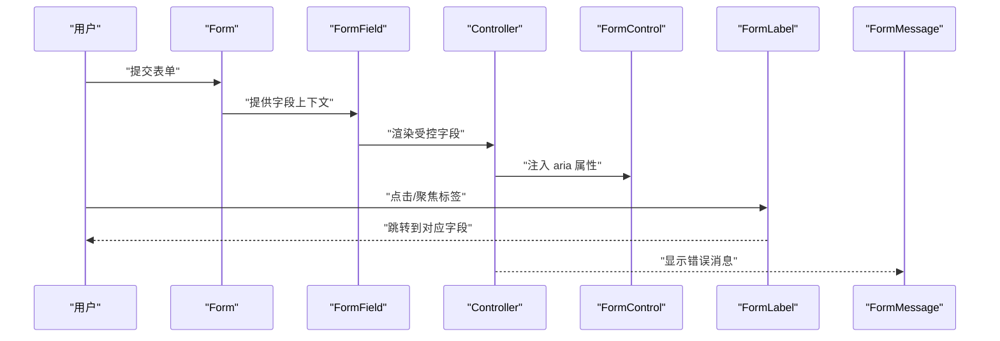
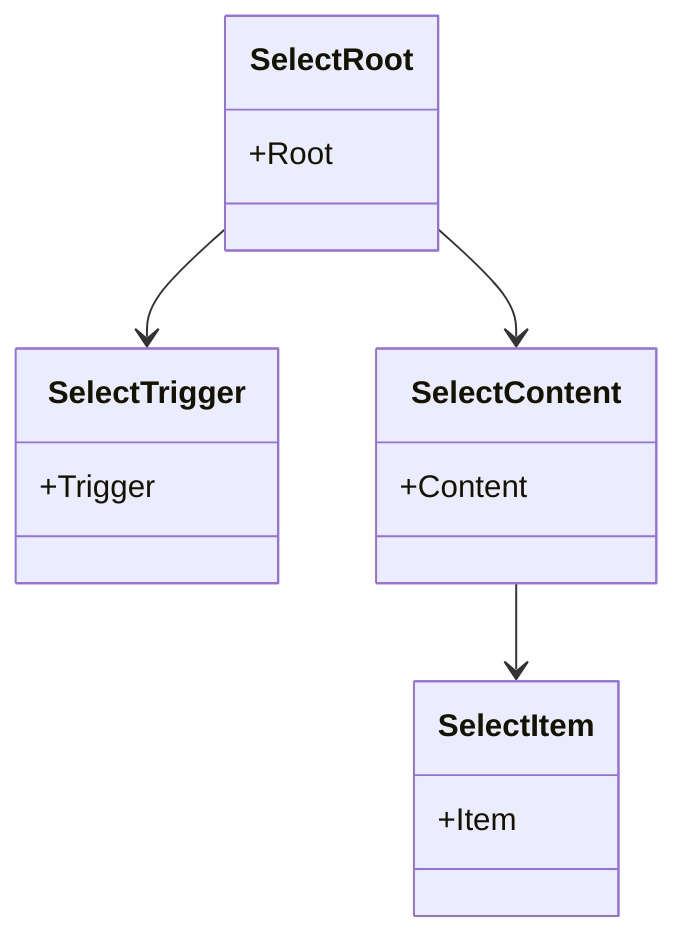
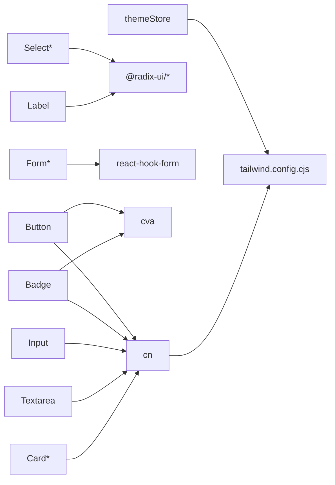
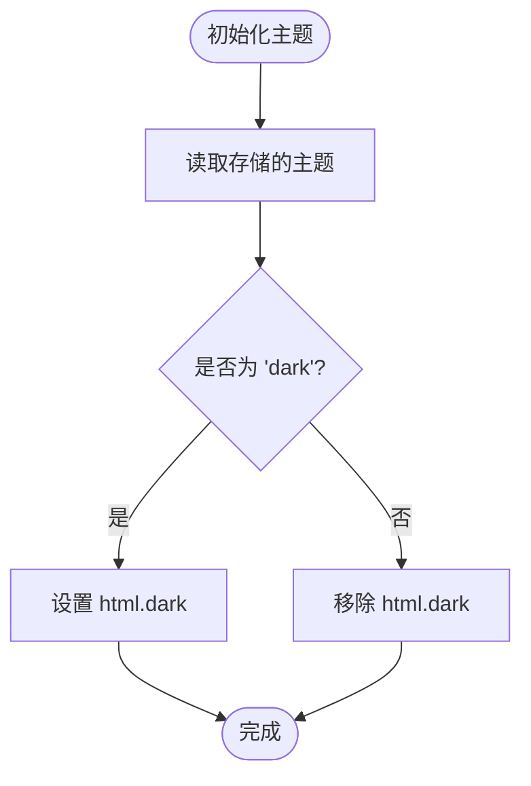

# UI 组件库

<cite>
**本文引用的文件**
- [button.tsx](file://frontend/src/components/ui/button.tsx)
- [input.tsx](file://frontend/src/components/ui/input.tsx)
- [card.tsx](file://frontend/src/components/ui/card.tsx)
- [badge.tsx](file://frontend/src/components/ui/badge.tsx)
- [form.tsx](file://frontend/src/components/ui/form.tsx)
- [label.tsx](file://frontend/src/components/ui/label.tsx)
- [select.tsx](file://frontend/src/components/ui/select.tsx)
- [textarea.tsx](file://frontend/src/components/ui/textarea.tsx)
- [table.tsx](file://frontend/src/components/ui/table.tsx)
- [separator.tsx](file://frontend/src/components/ui/separator.tsx)
- [utils.ts](file://frontend/src/lib/utils.ts)
- [tailwind.config.cjs](file://frontend/tailwind.config.cjs)
- [package.json](file://frontend/package.json)
- [components.json](file://frontend/components.json)
- [themeStore.ts](file://frontend/src/stores/themeStore.ts)
</cite>

## 目录
1. [简介](#简介)
2. [项目结构](#项目结构)
3. [核心组件](#核心组件)
4. [架构总览](#架构总览)
5. [组件详解](#组件详解)
6. [依赖关系分析](#依赖关系分析)
7. [性能考量](#性能考量)
8. [可访问性设计](#可访问性设计)
9. [主题与样式定制](#主题与样式定制)
10. [测试策略与维护指南](#测试策略与维护指南)
11. [结论](#结论)

## 简介
本文件为 Seahorse Agent 前端 UI 组件库的综合文档，聚焦于基于 Radix UI 与自定义样式的组件体系，覆盖基础组件（Button、Input、Card、Badge）、表单组件（Form、Label、Select、Textarea）、数据展示组件（Table、Separator）等。文档从设计理念、属性接口、事件处理、样式定制、可访问性、主题与暗色模式、到测试与维护进行系统化梳理，并提供使用示例与最佳实践路径。

## 项目结构
前端采用按功能域组织的目录结构，UI 组件集中位于 src/components/ui 与 @components/ui 两处，便于复用与统一管理；样式通过 Tailwind CSS 与 CSS 变量扩展实现，主题状态由 Zustand 管理，全局样式在 src/styles/globals.css 中引入。

**图表来源**
- [button.tsx:1-55](file://frontend/src/components/ui/button.tsx#L1-L55)
- [input.tsx:1-25](file://frontend/src/components/ui/input.tsx#L1-L25)
- [card.tsx:1-80](file://frontend/src/components/ui/card.tsx#L1-L80)
- [badge.tsx:1-42](file://frontend/src/components/ui/badge.tsx#L1-L42)
- [form.tsx:1-177](file://frontend/src/components/ui/form.tsx#L1-L177)
- [label.tsx:1-25](file://frontend/src/components/ui/label.tsx#L1-L25)
- [select.tsx:1-159](file://frontend/src/components/ui/select.tsx#L1-L159)
- [textarea.tsx:1-24](file://frontend/src/components/ui/textarea.tsx#L1-L24)
- [table.tsx:1-118](file://frontend/src/components/ui/table.tsx#L1-L118)
- [separator.tsx:1-30](file://frontend/src/components/ui/separator.tsx#L1-L30)
- [utils.ts:1-7](file://frontend/src/lib/utils.ts#L1-L7)
- [tailwind.config.cjs:1-83](file://frontend/tailwind.config.cjs#L1-L83)
- [themeStore.ts:1-36](file://frontend/src/stores/themeStore.ts#L1-L36)

**章节来源**
- [package.json:1-70](file://frontend/package.json#L1-L70)
- [components.json:1-17](file://frontend/components.json#L1-L17)

## 核心组件
本节概览各组件的职责与典型用法，后续章节将深入每个组件的接口、行为与最佳实践。

- Button：语义化按钮，支持变体与尺寸，可透传原生 button 属性，支持 asChild 渲染为任意元素。
- Input：输入框，内置焦点态与占位符样式，支持 type 与原生属性透传。
- Card：卡片容器，包含头部、标题、描述、内容、底部等子组件，便于布局与语义化。
- Badge：标签徽标，支持多变体，用于状态或分类标识。
- Form：基于 react-hook-form 的表单上下文，提供 Form、FormField、FormItem、FormLabel、FormControl、FormDescription、FormMessage 等组合。
- Label：与表单字段关联的标签，继承 Radix UI Label 并结合表单错误状态。
- Select：下拉选择，包含触发器、内容、滚动按钮、选项、分隔线等子组件，支持滚动与多选场景。
- Textarea：多行文本输入，内置圆角与焦点态样式。
- Table：表格容器与子组件，包含表头、表体、表尾、行、单元格、标题单元格、摘要等。
- Separator：分隔线，支持水平/垂直方向与装饰性属性。

**章节来源**
- [button.tsx:32-55](file://frontend/src/components/ui/button.tsx#L32-L55)
- [input.tsx:5-25](file://frontend/src/components/ui/input.tsx#L5-L25)
- [card.tsx:5-80](file://frontend/src/components/ui/card.tsx#L5-L80)
- [badge.tsx:26-42](file://frontend/src/components/ui/badge.tsx#L26-L42)
- [form.tsx:16-177](file://frontend/src/components/ui/form.tsx#L16-L177)
- [label.tsx:7-25](file://frontend/src/components/ui/label.tsx#L7-L25)
- [select.tsx:7-159](file://frontend/src/components/ui/select.tsx#L7-L159)
- [textarea.tsx:5-24](file://frontend/src/components/ui/textarea.tsx#L5-L24)
- [table.tsx:5-118](file://frontend/src/components/ui/table.tsx#L5-L118)
- [separator.tsx:6-30](file://frontend/src/components/ui/separator.tsx#L6-L30)

## 架构总览
组件库以“原子化样式 + 组合式上下文”的方式组织，Radix UI 提供可访问性与交互基元，cn 工具负责类名合并与 Tailwind 冲突修复，CSS 变量与 Tailwind 扩展提供一致的主题与动效。

**图表来源**
- [tailwind.config.cjs:1-83](file://frontend/tailwind.config.cjs#L1-L83)
- [utils.ts:1-7](file://frontend/src/lib/utils.ts#L1-L7)
- [themeStore.ts:1-36](file://frontend/src/stores/themeStore.ts#L1-L36)

## 组件详解

### Button 组件
- 设计理念：通过类变体工厂提供多种变体与尺寸，支持 asChild 将渲染节点降级为任意元素，保持语义与可访问性。
- 关键属性：variant（default/secondary/ghost/outline/destructive）、size（default/sm/lg/icon）、asChild、原生 button 属性透传。
- 事件与可访问性：保留原生 button 行为，自动注入焦点环与禁用态；通过 data-variant 标注当前变体，便于样式与测试定位。
- 样式定制：通过 Tailwind 类名与 CSS 变量组合，支持阴影发光、过渡与尺寸微调。

**图表来源**
- [button.tsx:7-30](file://frontend/src/components/ui/button.tsx#L7-L30)

**章节来源**
- [button.tsx:32-55](file://frontend/src/components/ui/button.tsx#L32-L55)

### Input 组件
- 设计理念：简洁输入框，内置边框、背景、圆角、阴影与焦点态，支持 type 与原生属性透传。
- 关键属性：type、原生 input 属性透传。
- 样式定制：通过 Tailwind 类名组合，可覆盖默认尺寸与内边距。

**章节来源**
- [input.tsx:5-25](file://frontend/src/components/ui/input.tsx#L5-L25)

### Card 组件族
- 设计理念：卡片容器与语义化子组件组合，便于复杂卡片布局与可访问性标注。
- 子组件：Card、CardHeader、CardTitle、CardDescription、CardContent、CardFooter。
- 使用建议：配合 Grid/Stack 布局，标题与描述使用语义化标签，内容区放置表单或列表。

**图表来源**
- [card.tsx:5-77](file://frontend/src/components/ui/card.tsx#L5-L77)

**章节来源**
- [card.tsx:1-80](file://frontend/src/components/ui/card.tsx#L1-L80)

### Badge 组件
- 设计理念：轻量状态/分类标识，支持多变体与边框样式。
- 关键属性：variant（default/secondary/destructive/outline）。
- 样式定制：通过变体类名与 CSS 变量控制前景/背景色。

**章节来源**
- [badge.tsx:26-42](file://frontend/src/components/ui/badge.tsx#L26-L42)

### Form 组件族
- 设计理念：基于 react-hook-form 的声明式表单，提供上下文与钩子，自动管理字段 ID、aria 描述与错误状态。
- 组合组件：Form、FormField、FormItem、FormLabel、FormControl、FormDescription、FormMessage。
- 可访问性：自动注入 aria-invalid、aria-describedby，错误时合并描述与消息 ID。
- 使用流程：在 Form 中包裹 Field，使用 FormField 包裹 Controller，通过 useFormField 获取字段状态与 ID。

**图表来源**
- [form.tsx:16-177](file://frontend/src/components/ui/form.tsx#L16-L177)

**章节来源**
- [form.tsx:16-177](file://frontend/src/components/ui/form.tsx#L16-L177)
- [label.tsx:7-25](file://frontend/src/components/ui/label.tsx#L7-L25)

### Label 组件
- 设计理念：与表单字段配对的标签，继承 Radix UI Label，结合表单错误状态动态切换样式。
- 关键属性：原生 Label 属性透传，内部根据 useFormField 注入 htmlFor。

**章节来源**
- [label.tsx:7-25](file://frontend/src/components/ui/label.tsx#L7-L25)

### Select 组件族
- 设计理念：下拉选择，支持滚动按钮、分组、标签、选项与指示器，基于 Radix UI Select。
- 子组件：Select、SelectGroup、SelectValue、SelectTrigger、SelectContent、SelectLabel、SelectItem、SelectSeparator、SelectScrollUpButton、SelectScrollDownButton。
- 动画与定位：使用 Portal 渲染内容，支持 popper 定位偏移，内置开合动画类。
- 可访问性：选项具备焦点态与禁用态，指示器显示当前值。

**图表来源**
- [select.tsx:7-159](file://frontend/src/components/ui/select.tsx#L7-L159)

**章节来源**
- [select.tsx:1-159](file://frontend/src/components/ui/select.tsx#L1-L159)

### Textarea 组件
- 设计理念：多行文本输入，内置圆角、边框与焦点态，支持原生 textarea 属性透传。
- 样式定制：可通过 Tailwind 类名调整最小高度、内边距与字体大小。

**章节来源**
- [textarea.tsx:5-24](file://frontend/src/components/ui/textarea.tsx#L5-L24)

### Table 组件族
- 设计理念：响应式表格容器，外层包裹溢出滚动，子组件提供语义化结构与 hover/选中态。
- 子组件：Table、TableHeader、TableBody、TableFooter、TableHead、TableRow、TableCell、TableCaption。
- 使用建议：配合 @tanstack/react-table 进行排序、分页与虚拟滚动优化。

**章节来源**
- [table.tsx:5-118](file://frontend/src/components/ui/table.tsx#L5-L118)

### Separator 组件
- 设计理念：分隔线，支持水平/垂直方向与装饰性属性，常用于菜单、表单与卡片内部分割。
- 关键属性：orientation（horizontal/vertical）、decorative、原生属性透传。

**章节来源**
- [separator.tsx:6-30](file://frontend/src/components/ui/separator.tsx#L6-L30)

## 依赖关系分析
- 组件间依赖：所有组件均依赖 cn 工具进行类名合并；Button、Badge 使用类变体工厂；Form 依赖 react-hook-form 上下文；Select/Label/Textarea 等依赖 Radix UI 原子组件。
- 外部依赖：@radix-ui/*、react-hook-form、class-variance-authority、tailwind-merge、clsx、lucide-react 等。
- 主题与样式：Tailwind 配置通过 CSS 变量映射主题色，Zustand 主题存储负责切换 html 元素的 dark 类名。

**图表来源**
- [button.tsx:1-6](file://frontend/src/components/ui/button.tsx#L1-L6)
- [badge.tsx:1-5](file://frontend/src/components/ui/badge.tsx#L1-L5)
- [input.tsx:1-4](file://frontend/src/components/ui/input.tsx#L1-L4)
- [textarea.tsx:1-4](file://frontend/src/components/ui/textarea.tsx#L1-L4)
- [card.tsx:1-4](file://frontend/src/components/ui/card.tsx#L1-L4)
- [select.tsx:1-6](file://frontend/src/components/ui/select.tsx#L1-L6)
- [label.tsx:1-4](file://frontend/src/components/ui/label.tsx#L1-L4)
- [form.tsx:1-14](file://frontend/src/components/ui/form.tsx#L1-L14)
- [utils.ts:1-7](file://frontend/src/lib/utils.ts#L1-L7)
- [tailwind.config.cjs:1-83](file://frontend/tailwind.config.cjs#L1-L83)
- [themeStore.ts:1-36](file://frontend/src/stores/themeStore.ts#L1-L36)

**章节来源**
- [package.json:13-46](file://frontend/package.json#L13-L46)

## 性能考量
- 渲染优化：优先使用 asChild 与 Slot 降低多余 DOM 层级；Select 使用 Portal 减少布局抖动。
- 样式合并：通过 cn 合并类名，避免重复与冲突，减少重绘。
- 表格性能：Table 外层容器支持溢出滚动；建议配合 @tanstack/react-table 的虚拟滚动与列固定。
- 主题切换：主题切换仅操作 html 元素类名，避免全量重绘。

[本节为通用指导，无需具体文件分析]

## 可访问性设计
- 键盘导航：Select、Form 控件均基于 Radix UI，天然支持键盘打开、选项遍历与回车选择。
- 屏幕阅读器：FormLabel 与 FormControl 自动建立 aria 关联；FormMessage 在错误时提供可读消息。
- 颜色对比度：Tailwind 配置提供语义化颜色变量，建议在自定义主题中确保对比度满足 WCAG AA/AAA。
- 焦点可见性：Button、Input、Textarea 默认聚焦环与高亮，避免隐藏焦点状态。

[本节为通用指导，无需具体文件分析]

## 主题与样式定制
- CSS 变量：Tailwind 配置将常用颜色映射为 CSS 变量，如 --background、--foreground、--primary 等，便于跨组件一致性。
- Tailwind 扩展：提供字体、阴影、动画、渐变等扩展，组件通过类名直接使用。
- 暗色模式：themeStore 切换 html 的 dark 类名，Tailwind 配置启用基于类名的深色模式。
- 组件样式：Button、Badge、Input、Textarea 等组件通过类名与 CSS 变量组合实现主题化。

**图表来源**
- [themeStore.ts:14-35](file://frontend/src/stores/themeStore.ts#L14-L35)
- [tailwind.config.cjs:3-29](file://frontend/tailwind.config.cjs#L3-L29)

**章节来源**
- [tailwind.config.cjs:1-83](file://frontend/tailwind.config.cjs#L1-L83)
- [components.json:6-11](file://frontend/components.json#L6-L11)
- [themeStore.ts:1-36](file://frontend/src/stores/themeStore.ts#L1-L36)

## 测试策略与维护指南
- 单元测试：针对组件属性（variant/size/asChild、aria 属性、类名组合）编写断言，验证渲染结果与可访问性标记。
- 集成测试：Form 场景下验证 useFormField 返回的 ID、aria-invalid、aria-describedby 是否正确拼接。
- 可访问性测试：使用自动化工具（如 axe）与手动键盘导航检查，确保焦点顺序与提示信息完整。
- 维护建议：遵循“最小变更原则”，新增变体时同步更新 CSS 变量与 Tailwind 扩展；组件命名与类名前缀保持一致，便于搜索与重构。

[本节为通用指导，无需具体文件分析]

## 结论
Seahorse Agent UI 组件库以 Radix UI 为基础，结合 class-variance-authority 与 Tailwind CSS 实现高内聚、低耦合的组件体系。通过 cn 工具与 CSS 变量，组件在样式上保持一致与可定制；借助 react-hook-form 与主题存储，表单与主题切换具备良好的可访问性与用户体验。建议在实际业务中遵循本文档的接口约定、组合模式与最佳实践，持续完善测试与可访问性保障。