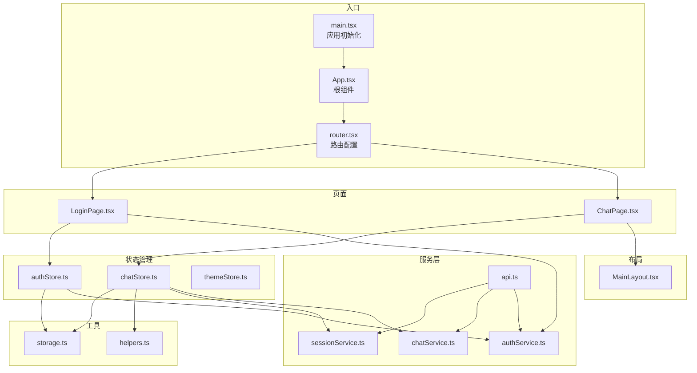
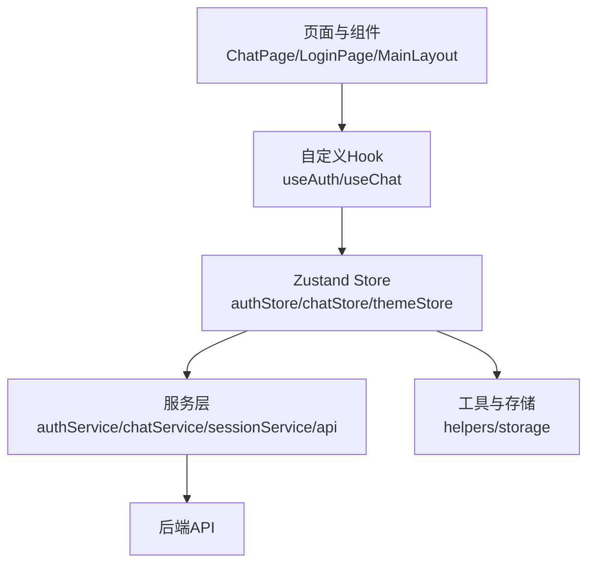
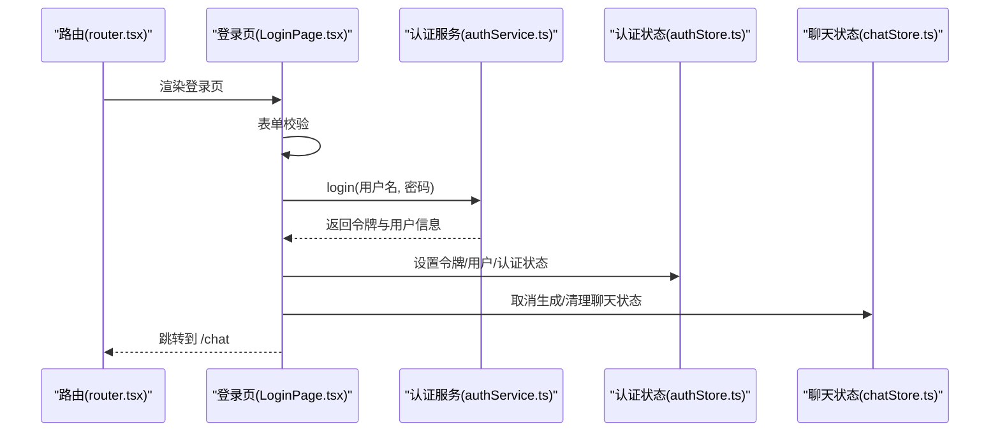
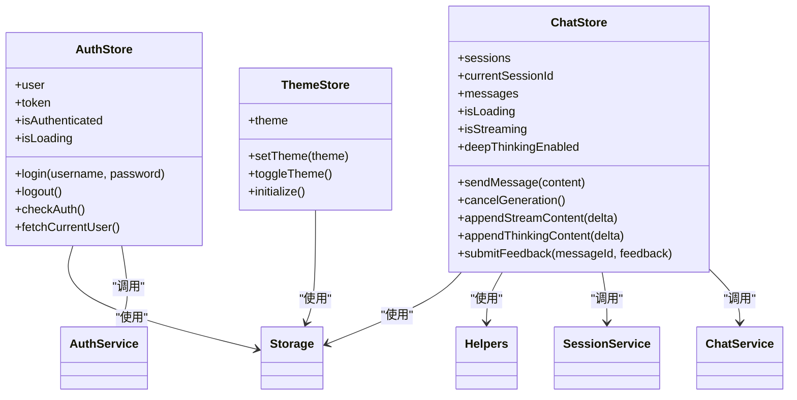
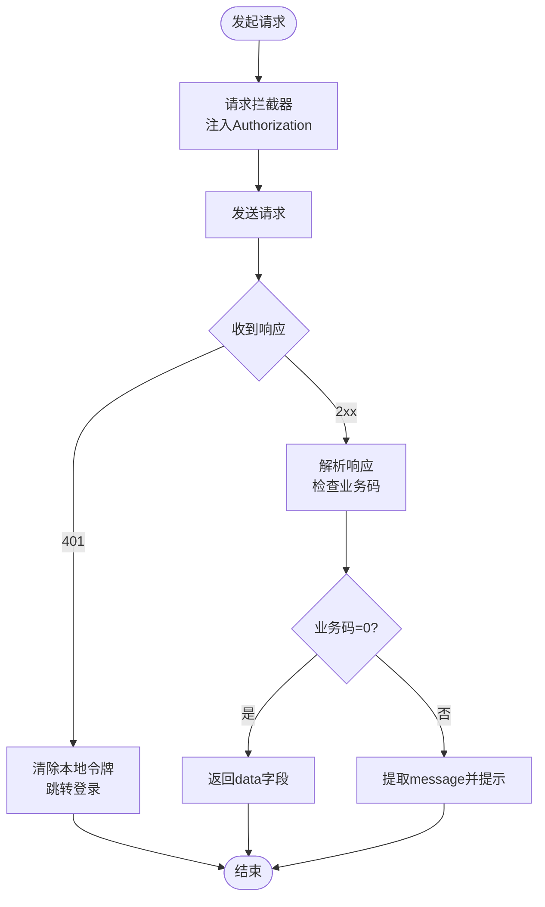
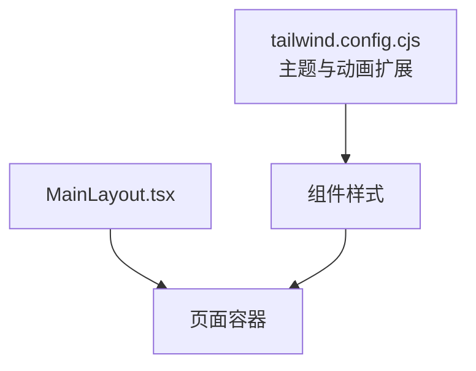
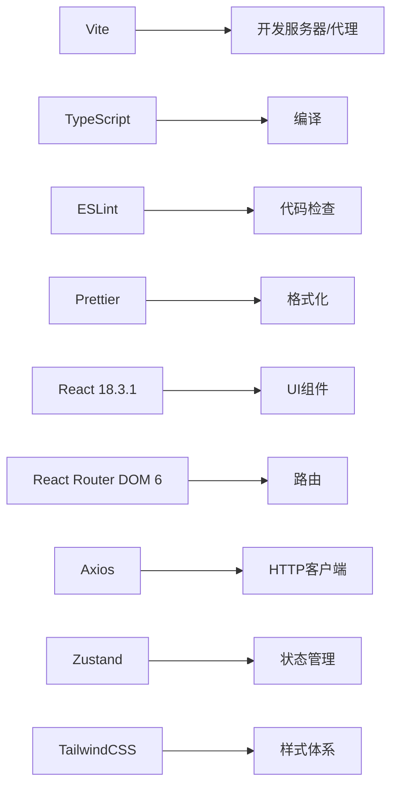

# 前端系统

<cite>
**本文引用的文件**
- [package.json](file://frontend/package.json)
- [vite.config.ts](file://frontend/vite.config.ts)
- [main.tsx](file://frontend/src/main.tsx)
- [App.tsx](file://frontend/src/App.tsx)
- [router.tsx](file://frontend/src/router.tsx)
- [authStore.ts](file://frontend/src/stores/authStore.ts)
- [chatStore.ts](file://frontend/src/stores/chatStore.ts)
- [themeStore.ts](file://frontend/src/stores/themeStore.ts)
- [api.ts](file://frontend/src/services/api.ts)
- [authService.ts](file://frontend/src/services/authService.ts)
- [chatService.ts](file://frontend/src/services/chatService.ts)
- [sessionService.ts](file://frontend/src/services/sessionService.ts)
- [helpers.ts](file://frontend/src/utils/helpers.ts)
- [storage.ts](file://frontend/src/utils/storage.ts)
- [ChatPage.tsx](file://frontend/src/pages/ChatPage.tsx)
- [LoginPage.tsx](file://frontend/src/pages/LoginPage.tsx)
- [MainLayout.tsx](file://frontend/src/components/layout/MainLayout.tsx)
- [tailwind.config.cjs](file://frontend/tailwind.config.cjs)
- [useAuth.ts](file://frontend/src/hooks/useAuth.ts)
- [useChat.ts](file://frontend/src/hooks/useChat.ts)
</cite>

## 目录
1. [简介](#简介)
2. [项目结构](#项目结构)
3. [核心组件](#核心组件)
4. [架构总览](#架构总览)
5. [详细组件分析](#详细组件分析)
6. [依赖关系分析](#依赖关系分析)
7. [性能考虑](#性能考虑)
8. [故障排查指南](#故障排查指南)
9. [结论](#结论)
10. [附录](#附录)

## 简介
本文件为 Seahorse Agent 前端系统的详细技术文档，基于 React 18.3.1 + TypeScript 5.5.4 构建，采用 Vite 作为构建工具与开发服务器，TailwindCSS 提供样式体系，Zustand 实现轻量级状态管理，Axios 进行 API 请求与拦截，Radix UI 与自研 UI 组件库组合提供一致的交互体验。系统包含聊天页面、管理后台页面、登录页面等核心页面，围绕认证、聊天、主题三大状态域进行组织。

## 项目结构
前端代码位于 frontend 目录，采用按功能分层的组织方式：
- src/pages：页面级组件，如聊天页、登录页、管理后台各子页面
- src/components：可复用的业务组件，如聊天消息列表、输入框、布局组件等
- src/services：API 服务封装，统一调用后端接口
- src/stores：Zustand 状态存储，分别管理认证、聊天、主题状态
- src/hooks：自定义 Hook，简化状态与服务的使用
- src/utils：通用工具函数与本地存储封装
- src/types：类型定义
- vite.config.ts：开发服务器与代理配置
- tailwind.config.cjs：Tailwind 主题与动画扩展

**图表来源**
- [main.tsx:1-17](file://frontend/src/main.tsx#L1-L17)
- [App.tsx:1-15](file://frontend/src/App.tsx#L1-L15)
- [router.tsx:1-163](file://frontend/src/router.tsx#L1-L163)
- [ChatPage.tsx:1-103](file://frontend/src/pages/ChatPage.tsx#L1-L103)
- [LoginPage.tsx:1-102](file://frontend/src/pages/LoginPage.tsx#L1-L102)
- [MainLayout.tsx:1-25](file://frontend/src/components/layout/MainLayout.tsx#L1-L25)
- [authStore.ts:1-116](file://frontend/src/stores/authStore.ts#L1-L116)
- [chatStore.ts:1-528](file://frontend/src/stores/chatStore.ts#L1-L528)
- [themeStore.ts:1-36](file://frontend/src/stores/themeStore.ts#L1-L36)
- [api.ts:1-66](file://frontend/src/services/api.ts#L1-L66)
- [authService.ts](file://frontend/src/services/authService.ts)
- [chatService.ts](file://frontend/src/services/chatService.ts)
- [sessionService.ts](file://frontend/src/services/sessionService.ts)
- [helpers.ts](file://frontend/src/utils/helpers.ts)
- [storage.ts](file://frontend/src/utils/storage.ts)

**章节来源**
- [package.json:1-70](file://frontend/package.json#L1-L70)
- [vite.config.ts:1-23](file://frontend/vite.config.ts#L1-L23)
- [tailwind.config.cjs:1-83](file://frontend/tailwind.config.cjs#L1-L83)

## 核心组件
- 应用入口与初始化
  - 在入口文件中完成主题与认证状态的初始化，并挂载根组件与路由提供器。
- 路由与权限控制
  - 使用 React Router v6 的路由配置，提供登录拦截、管理员权限校验、自动跳转等策略。
- 状态管理
  - 认证状态：用户信息、令牌、登录/登出、当前用户拉取
  - 聊天状态：会话列表、消息流式渲染、深思模式、反馈提交、任务取消
  - 主题状态：明暗主题切换与持久化
- 服务层
  - Axios 封装与拦截器：统一设置 Authorization、错误提示与鉴权失效处理
  - 各领域服务：认证、聊天、会话等 API 封装
- 工具与类型
  - 查询参数构建、本地存储封装、通用帮助函数

**章节来源**
- [main.tsx:1-17](file://frontend/src/main.tsx#L1-L17)
- [App.tsx:1-15](file://frontend/src/App.tsx#L1-L15)
- [router.tsx:1-163](file://frontend/src/router.tsx#L1-L163)
- [authStore.ts:1-116](file://frontend/src/stores/authStore.ts#L1-L116)
- [chatStore.ts:1-528](file://frontend/src/stores/chatStore.ts#L1-L528)
- [themeStore.ts:1-36](file://frontend/src/stores/themeStore.ts#L1-L36)
- [api.ts:1-66](file://frontend/src/services/api.ts#L1-L66)

## 架构总览
前端采用“页面-组件-服务-状态”的分层架构：
- 页面负责生命周期与路由参数处理
- 组件负责 UI 与交互
- 服务负责与后端 API 通信
- 状态管理负责跨组件共享的数据与行为

**图表来源**
- [ChatPage.tsx:1-103](file://frontend/src/pages/ChatPage.tsx#L1-L103)
- [LoginPage.tsx:1-102](file://frontend/src/pages/LoginPage.tsx#L1-L102)
- [MainLayout.tsx:1-25](file://frontend/src/components/layout/MainLayout.tsx#L1-L25)
- [useAuth.ts:1-6](file://frontend/src/hooks/useAuth.ts#L1-L6)
- [useChat.ts:1-6](file://frontend/src/hooks/useChat.ts#L1-L6)
- [authStore.ts:1-116](file://frontend/src/stores/authStore.ts#L1-L116)
- [chatStore.ts:1-528](file://frontend/src/stores/chatStore.ts#L1-L528)
- [themeStore.ts:1-36](file://frontend/src/stores/themeStore.ts#L1-L36)
- [authService.ts](file://frontend/src/services/authService.ts)
- [chatService.ts](file://frontend/src/services/chatService.ts)
- [sessionService.ts](file://frontend/src/services/sessionService.ts)
- [api.ts:1-66](file://frontend/src/services/api.ts#L1-L66)
- [helpers.ts](file://frontend/src/utils/helpers.ts)
- [storage.ts](file://frontend/src/utils/storage.ts)

## 详细组件分析

### 路由与页面组织
- 路由策略
  - 根路径自动跳转到登录或聊天页
  - 登录页支持已登录用户重定向
  - 聊天页需要认证
  - 管理后台页需要管理员角色
- 页面职责
  - 登录页：表单校验、登录调用、错误提示
  - 聊天页：会话加载、消息渲染、输入框交互、欢迎屏控制

**图表来源**
- [router.tsx:1-163](file://frontend/src/router.tsx#L1-L163)
- [LoginPage.tsx:1-102](file://frontend/src/pages/LoginPage.tsx#L1-L102)
- [authService.ts](file://frontend/src/services/authService.ts)
- [authStore.ts:1-116](file://frontend/src/stores/authStore.ts#L1-L116)
- [chatStore.ts:1-528](file://frontend/src/stores/chatStore.ts#L1-L528)

**章节来源**
- [router.tsx:1-163](file://frontend/src/router.tsx#L1-L163)
- [ChatPage.tsx:1-103](file://frontend/src/pages/ChatPage.tsx#L1-L103)
- [LoginPage.tsx:1-102](file://frontend/src/pages/LoginPage.tsx#L1-L102)

### 状态管理：Zustand 设计
- 认证状态
  - 字段：用户、令牌、是否认证、加载状态
  - 方法：登录、登出、检查认证、获取当前用户
  - 与服务与存储的协作：设置令牌、持久化用户与令牌、清理聊天状态
- 聊天状态
  - 字段：会话列表、当前会话、消息、加载/流式状态、深思模式、任务标识与取消回调
  - 方法：加载会话、创建/删除/重命名会话、选择会话、发送消息、取消生成、追加流式内容、提交反馈
  - 与服务与工具的协作：查询参数构建、流式响应处理、错误提示
- 主题状态
  - 字段：主题模式
  - 方法：设置主题、切换主题、初始化
  - 与 DOM 的协作：应用暗色类名

**图表来源**
- [authStore.ts:1-116](file://frontend/src/stores/authStore.ts#L1-L116)
- [chatStore.ts:1-528](file://frontend/src/stores/chatStore.ts#L1-L528)
- [themeStore.ts:1-36](file://frontend/src/stores/themeStore.ts#L1-L36)
- [authService.ts](file://frontend/src/services/authService.ts)
- [chatService.ts](file://frontend/src/services/chatService.ts)
- [sessionService.ts](file://frontend/src/services/sessionService.ts)
- [helpers.ts](file://frontend/src/utils/helpers.ts)
- [storage.ts](file://frontend/src/utils/storage.ts)

**章节来源**
- [authStore.ts:1-116](file://frontend/src/stores/authStore.ts#L1-L116)
- [chatStore.ts:1-528](file://frontend/src/stores/chatStore.ts#L1-L528)
- [themeStore.ts:1-36](file://frontend/src/stores/themeStore.ts#L1-L36)

### API 集成与错误处理
- Axios 配置
  - 基础 URL 来源于环境变量
  - 默认超时时间
  - 请求拦截器：从本地存储读取令牌并注入 Authorization
  - 响应拦截器：统一处理业务返回码、鉴权过期跳转、错误提示
- 错误处理策略
  - 401 强制登出并跳转登录
  - 业务错误码非 0 时提取 message 并提示
  - 网络错误统一提示

**图表来源**
- [api.ts:1-66](file://frontend/src/services/api.ts#L1-L66)

**章节来源**
- [api.ts:1-66](file://frontend/src/services/api.ts#L1-L66)

### UI 组件与样式体系
- Tailwind 扩展
  - 支持深色模式 class
  - 自定义颜色变量、字体族、阴影、关键帧与动画
  - 背景图案与渐变
- 布局组件
  - MainLayout：侧边栏与头部容器，统一页面骨架
- 页面组件
  - ChatPage：消息列表、输入框、会话选择与创建
  - LoginPage：表单、密码可见性切换、记住我、错误提示

**图表来源**
- [tailwind.config.cjs:1-83](file://frontend/tailwind.config.cjs#L1-L83)
- [MainLayout.tsx:1-25](file://frontend/src/components/layout/MainLayout.tsx#L1-L25)

**章节来源**
- [tailwind.config.cjs:1-83](file://frontend/tailwind.config.cjs#L1-L83)
- [MainLayout.tsx:1-25](file://frontend/src/components/layout/MainLayout.tsx#L1-L25)
- [ChatPage.tsx:1-103](file://frontend/src/pages/ChatPage.tsx#L1-L103)
- [LoginPage.tsx:1-102](file://frontend/src/pages/LoginPage.tsx#L1-L102)

## 依赖关系分析
- 构建与开发
  - Vite 提供开发服务器与代理，代理将 /api 转发至后端服务
  - TypeScript 与 ESLint/Prettier 规范代码质量
- 运行时依赖
  - React 18.3.1 + React Router DOM 6：页面与路由
  - Axios：HTTP 客户端
  - Radix UI：基础无障碍 UI 组件
  - Zod、React Hook Form：表单校验与表单处理
  - Recharts、TanStack React Table：可视化与表格
  - Zustand：轻量状态管理
  - TailwindCSS、Lucide React：样式与图标
- 开发依赖
  - Vite、React 插件、TailwindCSS、ESLint、Prettier

**图表来源**
- [vite.config.ts:1-23](file://frontend/vite.config.ts#L1-L23)
- [package.json:1-70](file://frontend/package.json#L1-L70)

**章节来源**
- [vite.config.ts:1-23](file://frontend/vite.config.ts#L1-L23)
- [package.json:1-70](file://frontend/package.json#L1-L70)

## 性能考虑
- 状态粒度与订阅范围
  - 将认证、聊天、主题拆分为独立 store，避免无关组件重复渲染
- 流式渲染与虚拟滚动
  - 使用虚拟滚动组件提升长消息列表的渲染性能
- 图片与资源懒加载
  - 对非首屏资源采用懒加载策略
- 缓存与去抖
  - 对高频请求进行防抖与缓存
- 构建优化
  - 合理拆包、Tree Shaking、按需引入第三方库
- 无障碍与可访问性
  - 使用语义化标签、键盘导航、ARIA 属性
- 响应式设计
  - 使用 Tailwind 断点与弹性布局适配多设备

## 故障排查指南
- 登录失败
  - 检查后端接口连通性与代理配置
  - 查看响应拦截器中的业务码与 message
- 鉴权过期
  - 响应拦截器会自动清除本地令牌并跳转登录
  - 确认 Authorization 头是否正确注入
- 聊天无响应
  - 检查流式响应处理回调是否被正确注册
  - 确认当前会话 ID 与消息流标识一致
- 主题不生效
  - 确认主题初始化与 DOM 类名切换逻辑
  - 检查本地存储的主题值

**章节来源**
- [api.ts:1-66](file://frontend/src/services/api.ts#L1-L66)
- [authStore.ts:1-116](file://frontend/src/stores/authStore.ts#L1-L116)
- [chatStore.ts:1-528](file://frontend/src/stores/chatStore.ts#L1-L528)
- [themeStore.ts:1-36](file://frontend/src/stores/themeStore.ts#L1-L36)

## 结论
本前端系统以 React + TypeScript 为基础，结合 Zustand、Axios、Radix UI 与 TailwindCSS，实现了清晰的分层架构与良好的可维护性。通过路由守卫与状态管理，系统在认证、聊天、主题等方面提供了稳定的能力；通过 Axios 拦截器与统一错误处理，提升了用户体验与健壮性。建议在后续迭代中持续完善无障碍与性能优化，并补充单元测试与集成测试覆盖。

## 附录
- 开发环境搭建
  - 安装依赖：使用包管理器安装项目依赖
  - 启动开发服务器：运行开发脚本，访问本地端口
  - 代理配置：确保 /api 前缀代理到后端服务地址
  - 构建与预览：打包构建并本地预览
- 代码规范
  - 使用 ESLint 与 Prettier 统一风格
  - TypeScript 类型约束与严格模式
- 部署建议
  - 静态资源部署于 CDN 或静态服务器
  - 后端接口域名与 TLS 配置
  - 环境变量区分开发/生产

**章节来源**
- [package.json:1-70](file://frontend/package.json#L1-L70)
- [vite.config.ts:1-23](file://frontend/vite.config.ts#L1-L23)