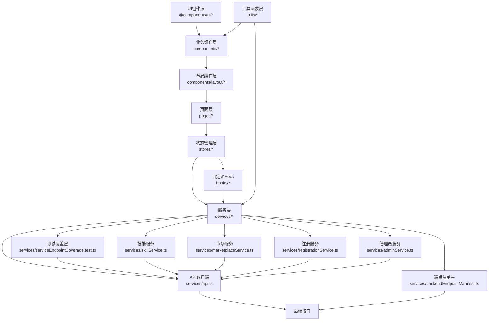
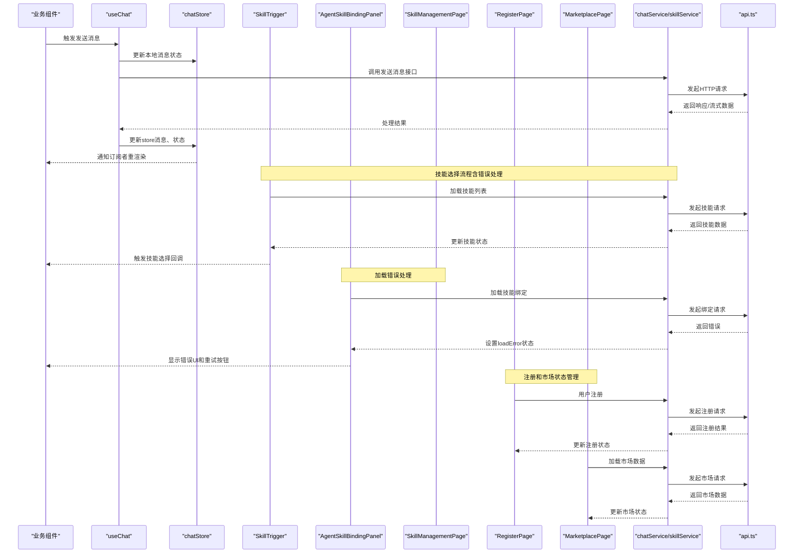
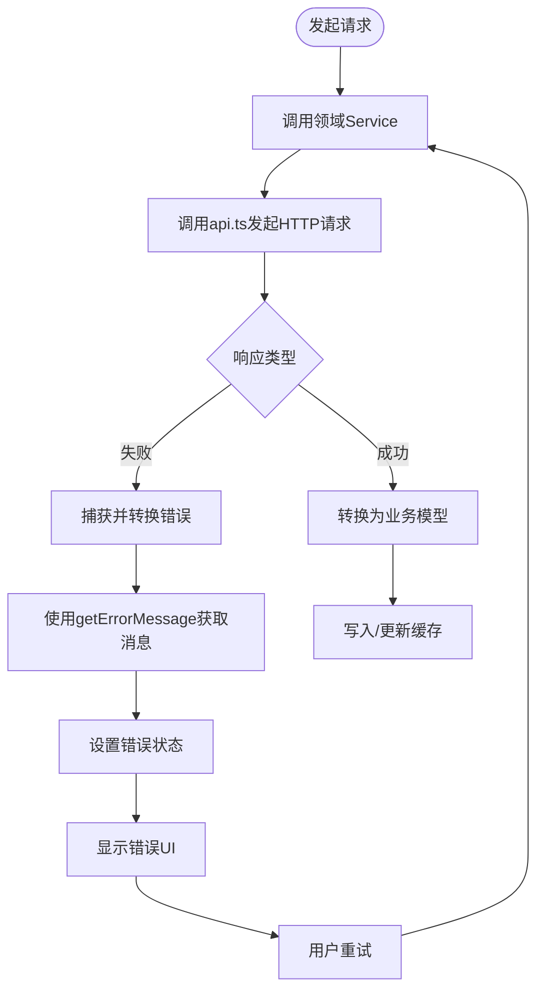
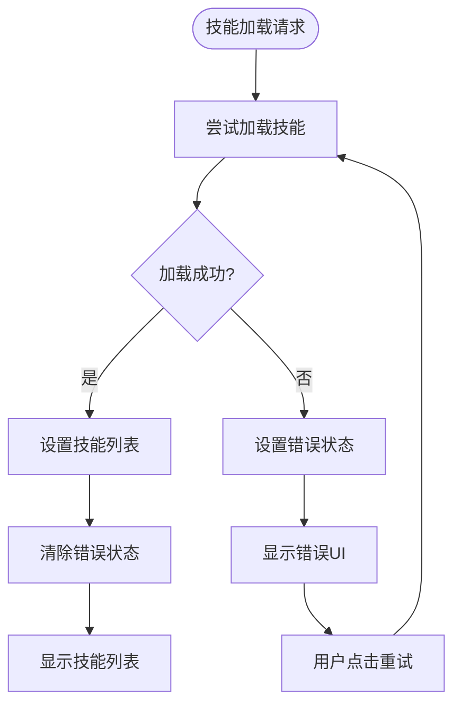
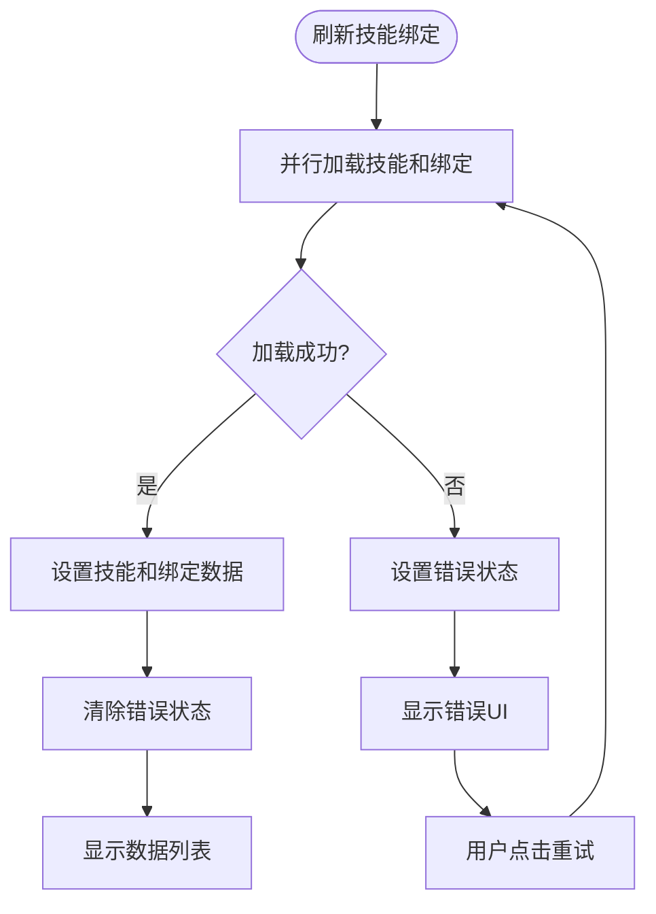
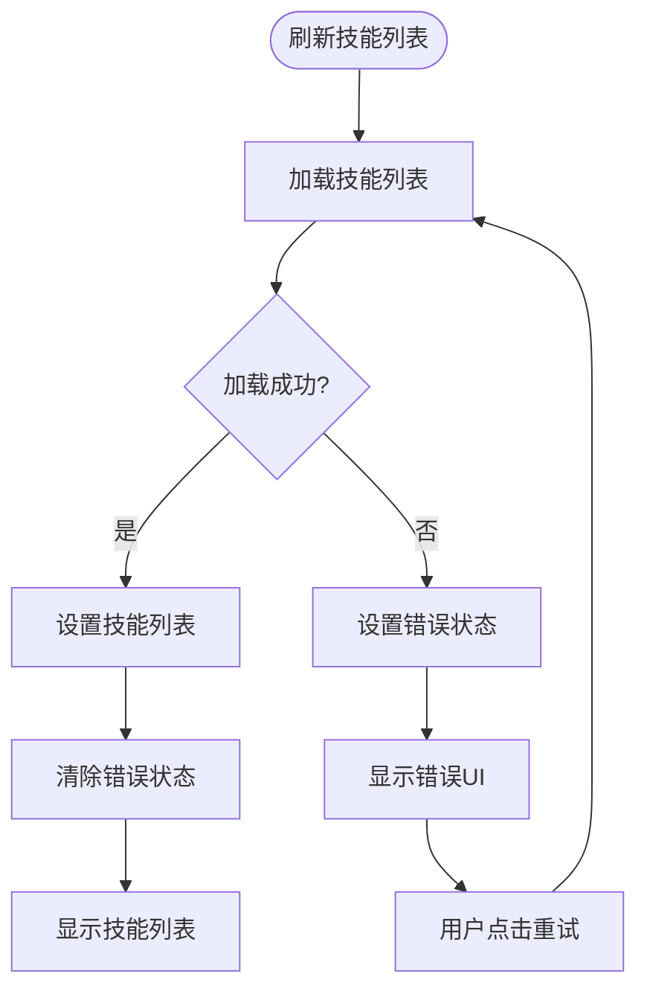
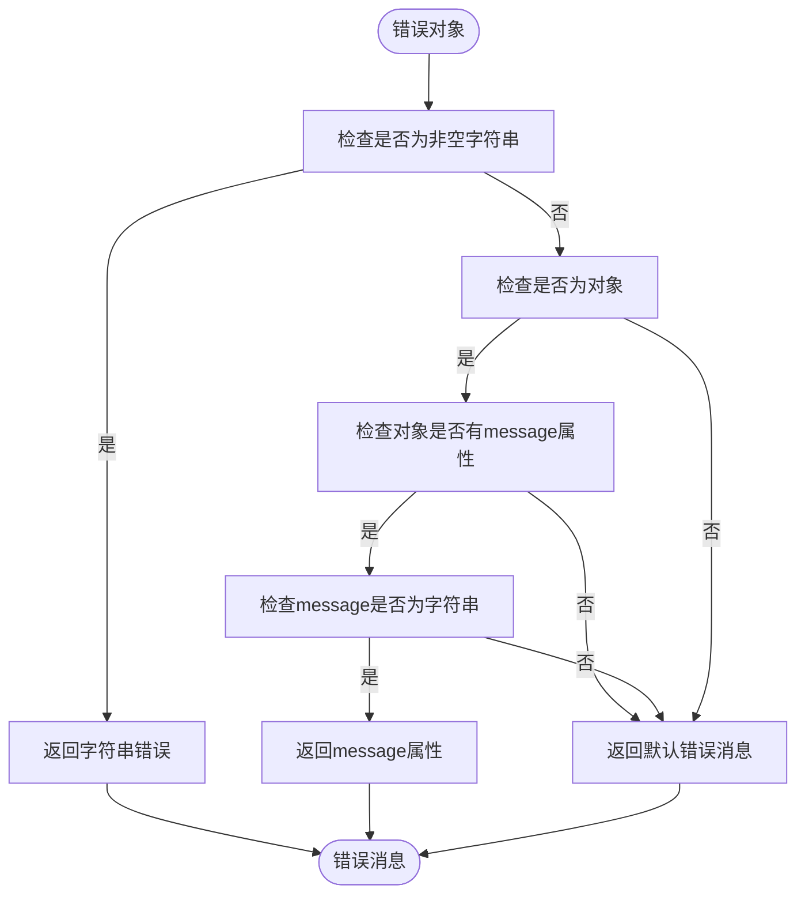
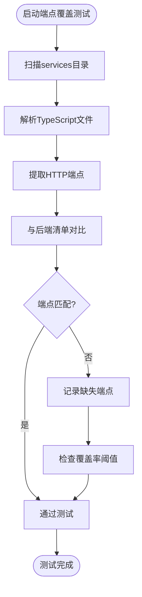
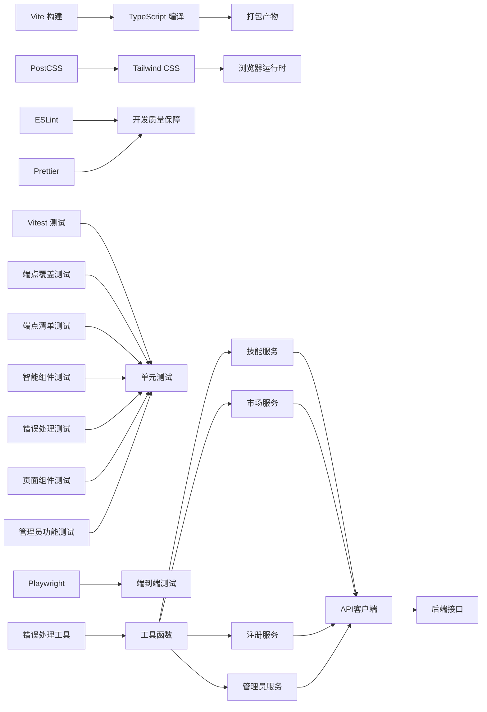

# 前端系统

<cite>
**本文引用的文件**
- [package.json](file://frontend/package.json)
- [vite.config.ts](file://frontend/vite.config.ts)
- [tailwind.config.cjs](file://frontend/tailwind.config.cjs)
- [postcss.config.cjs](file://frontend/postcss.config.cjs)
- [App.tsx](file://frontend/src/App.tsx)
- [router.tsx](file://frontend/src/router.tsx)
- [main.tsx](file://frontend/src/main.tsx)
- [types/index.ts](file://frontend/src/types/index.ts)
- [hooks/useAuth.ts](file://frontend/src/hooks/useAuth.ts)
- [hooks/useChat.ts](file://frontend/src/hooks/useChat.ts)
- [hooks/useStreamResponse.ts](file://frontend/src/hooks/useStreamResponse.ts)
- [stores/authStore.ts](file://frontend/src/stores/authStore.ts)
- [stores/chatStore.ts](file://frontend/src/stores/chatStore.ts)
- [stores/themeStore.ts](file://frontend/src/stores/themeStore.ts)
- [stores/workbenchStore.ts](file://frontend/src/stores/workbenchStore.ts)
- [services/api.ts](file://frontend/src/services/api.ts)
- [services/authService.ts](file://frontend/src/services/authService.ts)
- [services/chatService.ts](file://frontend/src/services/chatService.ts)
- [services/sessionService.ts](file://frontend/src/services/sessionService.ts)
- [services/skillService.ts](file://frontend/src/services/skillService.ts)
- [services/marketplaceService.ts](file://frontend/src/services/marketplaceService.ts)
- [services/registrationService.ts](file://frontend/src/services/registrationService.ts)
- [services/adminService.ts](file://frontend/src/services/adminService.ts)
- [services/serviceEndpointCoverage.test.ts](file://frontend/src/services/serviceEndpointCoverage.test.ts)
- [services/backendEndpointManifest.ts](file://frontend/src/services/backendEndpointManifest.ts)
- [utils/authSession.ts](file://frontend/src/utils/authSession.ts)
- [utils/error.ts](file://frontend/src/utils/error.ts)
- [@components/ui/button.tsx](file://frontend/@components/ui/button.tsx)
- [@components/ui/form.tsx](file://frontend/@components/ui/form.tsx)
- [pages/ChatPage.tsx](file://frontend/src/pages/ChatPage.tsx)
- [pages/LoginPage.tsx](file://frontend/src/pages/LoginPage.tsx)
- [pages/RegisterPage.tsx](file://frontend/src/pages/RegisterPage.tsx)
- [pages/MarketplacePage.tsx](file://frontend/src/pages/MarketplacePage.tsx)
- [pages/MemoryCenterPage.tsx](file://frontend/src/pages/MemoryCenterPage.tsx)
- [pages/NotFoundPage.tsx](file://frontend/src/pages/NotFoundPage.tsx)
- [pages/admin/agents/components/AgentSkillBindingPanel.tsx](file://frontend/src/pages/admin/agents/components/AgentSkillBindingPanel.tsx)
- [pages/admin/skills/SkillManagementPage.tsx](file://frontend/src/pages/admin/skills/SkillManagementPage.tsx)
- [components/layout/Header.tsx](file://frontend/src/components/layout/Header.tsx)
- [components/layout/Sidebar.tsx](file://frontend/src/components/layout/Sidebar.tsx)
- [components/common/Avatar.tsx](file://frontend/src/components/common/Avatar.tsx)
- [components/common/Badge.tsx](file://frontend/src/components/common/Badge.tsx)
- [components/chat/ChatContainer.tsx](file://frontend/src/components/chat/ChatContainer.tsx)
- [components/chat/MessageList.tsx](file://frontend/src/components/chat/MessageList.tsx)
- [components/chat/InputArea.tsx](file://frontend/src/components/chat/InputArea.tsx)
- [components/chat/SkillTrigger.tsx](file://frontend/src/components/chat/SkillTrigger.tsx)
- [components/memory/MemoryCard.tsx](file://frontend/src/components/memory/MemoryCard.tsx)
- [components/admin/CreateKnowledgeBaseDialog.tsx](file://frontend/src/components/admin/CreateKnowledgeBaseDialog.tsx)
- [styles/globals.css](file://frontend/src/styles/globals.css)
- [styles/tokens.css](file://frontend/src/styles/tokens.css)
- [lib/utils.ts](file://frontend/src/lib/utils.ts)
</cite>

## 更新摘要
**所做更改**
- 新增注册页面组件RegisterPage，提供用户注册功能
- 新增市场页面组件MarketplacePage，展示AI代理市场功能
- 新增管理员页面组件和相关服务模块，包括AgentSkillBindingPanel和SkillManagementPage
- 新增marketplaceService、registrationService、adminService等服务模块
- 更新路由系统以支持新页面组件
- 增强错误处理机制，包括技能加载错误状态管理

## 目录
1. [引言](#引言)
2. [项目结构](#项目结构)
3. [核心组件](#核心组件)
4. [架构总览](#架构总览)
5. [详细组件分析](#详细组件分析)
6. [服务端点覆盖测试](#服务端点覆盖测试)
7. [测试策略与质量保障](#测试策略与质量保障)
8. [依赖关系分析](#依赖关系分析)
9. [性能考虑](#性能考虑)
10. [故障排查指南](#故障排查指南)
11. [结论](#结论)
12. [附录](#附录)

## 引言
本文件面向Seahorse Agent前端团队与开发者，系统性梳理基于React 18.3.1与TypeScript的前端架构设计与实现细节。内容涵盖组件分层（布局组件、业务组件、UI组件）、状态管理（全局状态、组件状态、数据流）、API集成层（服务封装、错误处理、缓存策略）、路由与导航、样式系统与主题定制、开发规范与最佳实践，以及性能优化策略与学习路径建议。

**更新** 新增注册页面、市场页面和管理员页面组件，完善了用户注册流程、AI代理市场展示和管理员功能管理。增强的错误处理机制包括技能加载错误状态管理，显著提升了系统的健壮性和用户体验。

## 项目结构
前端采用Vite构建，使用Tailwind CSS进行样式管理，并通过自定义UI组件库与业务组件分层组织。核心目录与职责如下：
- src：应用源码
  - components：按功能域划分的业务组件与UI组件
  - pages：页面级组件，包括新增的注册页面、市场页面和管理员页面
  - services：API服务封装与测试覆盖验证，包括新增的市场、注册、管理员服务
  - stores：全局状态管理
  - hooks：自定义Hook
  - utils：工具函数
  - styles：全局样式与主题变量
  - types：类型定义
  - config：运行时配置
- @components/ui：可复用UI原子组件
- public：静态资源
- 配置文件：package.json、vite.config.ts、tailwind.config.cjs、postcss.config.cjs等

```mermaid
graph TB
subgraph "应用入口"
MAIN["main.tsx"]
APP["App.tsx"]
ROUTER["router.tsx"]
end
subgraph "页面层"
PAGE_CHAT["ChatPage.tsx"]
PAGE_LOGIN["LoginPage.tsx"]
PAGE_REGISTER["RegisterPage.tsx"]
PAGE_MARKET["MarketplacePage.tsx"]
PAGE_MEMORY["MemoryCenterPage.tsx"]
PAGE_404["NotFoundPage.tsx"]
PAGE_AGENT_SKILL["admin/agents/AgentSkillBindingPanel.tsx"]
PAGE_SKILL_MGMT["admin/skills/SkillManagementPage.tsx"]
end
subgraph "布局组件"
HEADER["layout/Header.tsx"]
SIDEBAR["layout/Sidebar.tsx"]
end
subgraph "业务组件"
COMP_CHAT["chat/ChatContainer.tsx"]
COMP_MESSAGE["chat/MessageList.tsx"]
COMP_INPUT["chat/InputArea.tsx"]
COMP_SKILL["chat/SkillTrigger.tsx"]
COMP_MEM["memory/MemoryCard.tsx"]
COMP_ADMIN["admin/CreateKnowledgeBaseDialog.tsx"]
end
subgraph "UI组件"
UI_BTN["@components/ui/button.tsx"]
UI_FORM["@components/ui/form.tsx"]
end
subgraph "状态管理"
STORE_AUTH["stores/authStore.ts"]
STORE_CHAT["stores/chatStore.ts"]
STORE_THEME["stores/themeStore.ts"]
STORE_WB["stores/workbenchStore.ts"]
end
subgraph "服务层"
SVC_API["services/api.ts"]
SVC_AUTH["services/authService.ts"]
SVC_CHAT["services/chatService.ts"]
SVC_SESS["services/sessionService.ts"]
SVC_SKILL["services/skillService.ts"]
SVC_MARKET["services/marketplaceService.ts"]
SVC_REG["services/registrationService.ts"]
SVC_ADMIN["services/adminService.ts"]
SVC_COVERAGE["services/serviceEndpointCoverage.test.ts"]
SVC_MANIFEST["services/backendEndpointManifest.ts"]
end
subgraph "工具函数"
UTIL_ERROR["utils/error.ts"]
end
MAIN --> APP
APP --> ROUTER
ROUTER --> PAGE_CHAT
ROUTER --> PAGE_LOGIN
ROUTER --> PAGE_REGISTER
ROUTER --> PAGE_MARKET
ROUTER --> PAGE_MEMORY
ROUTER --> PAGE_404
ROUTER --> PAGE_AGENT_SKILL
ROUTER --> PAGE_SKILL_MGMT
PAGE_CHAT --> HEADER
PAGE_CHAT --> SIDEBAR
PAGE_CHAT --> COMP_CHAT
COMP_CHAT --> COMP_MESSAGE
COMP_CHAT --> COMP_INPUT
COMP_CHAT --> COMP_SKILL
COMP_CHAT --> STORE_CHAT
STORE_CHAT --> SVC_CHAT
STORE_AUTH --> SVC_AUTH
STORE_THEME --> UI_BTN
SVC_CHAT --> SVC_API
SVC_AUTH --> SVC_API
SVC_SESS --> SVC_API
SVC_SKILL --> SVC_API
SVC_MARKET --> SVC_API
SVC_REG --> SVC_API
SVC_ADMIN --> SVC_API
SVC_COVERAGE --> SVC_API
SVC_MANIFEST --> SVC_API
UTIL_ERROR --> SVC_SKILL
```



**图表来源**
- [main.tsx:1-50](file://frontend/src/main.tsx#L1-L50)
- [App.tsx:1-50](file://frontend/src/App.tsx#L1-L50)
- [router.tsx:1-120](file://frontend/src/router.tsx#L1-L120)
- [ChatPage.tsx:1-120](file://frontend/src/pages/ChatPage.tsx#L1-L120)
- [RegisterPage.tsx:1-120](file://frontend/src/pages/RegisterPage.tsx#L1-L120)
- [MarketplacePage.tsx:1-120](file://frontend/src/pages/MarketplacePage.tsx#L1-L120)
- [Header.tsx:1-120](file://frontend/src/components/layout/Header.tsx#L1-L120)
- [Sidebar.tsx:1-120](file://frontend/src/components/layout/Sidebar.tsx#L1-L120)
- [ChatContainer.tsx:1-120](file://frontend/src/components/chat/ChatContainer.tsx#L1-L120)
- [MessageList.tsx:1-120](file://frontend/src/components/chat/MessageList.tsx#L1-L120)
- [InputArea.tsx:1-120](file://frontend/src/components/chat/InputArea.tsx#L1-L120)
- [SkillTrigger.tsx:1-442](file://frontend/src/components/chat/SkillTrigger.tsx#L1-L442)
- [AgentSkillBindingPanel.tsx:1-226](file://frontend/src/pages/admin/agents/components/AgentSkillBindingPanel.tsx#L1-L226)
- [SkillManagementPage.tsx:1-556](file://frontend/src/pages/admin/skills/SkillManagementPage.tsx#L1-L556)
- [MemoryCard.tsx:1-120](file://frontend/src/components/memory/MemoryCard.tsx#L1-L120)
- [CreateKnowledgeBaseDialog.tsx:1-120](file://frontend/src/components/admin/CreateKnowledgeBaseDialog.tsx#L1-L120)
- [button.tsx:1-120](file://frontend/@components/ui/button.tsx#L1-L120)
- [form.tsx:1-120](file://frontend/@components/ui/form.tsx#L1-L120)
- [authStore.ts:1-120](file://frontend/src/stores/authStore.ts#L1-L120)
- [chatStore.ts:1-120](file://frontend/src/stores/chatStore.ts#L1-L120)
- [themeStore.ts:1-120](file://frontend/src/stores/themeStore.ts#L1-L120)
- [workbenchStore.ts:1-120](file://frontend/src/stores/workbenchStore.ts#L1-L120)
- [api.ts:1-120](file://frontend/src/services/api.ts#L1-L120)
- [authService.ts:1-120](file://frontend/src/services/authService.ts#L1-L120)
- [chatService.ts:1-120](file://frontend/src/services/chatService.ts#L1-L120)
- [sessionService.ts:1-120](file://frontend/src/services/sessionService.ts#L1-L120)
- [skillService.ts:1-83](file://frontend/src/services/skillService.ts#L1-L83)
- [marketplaceService.ts:1-120](file://frontend/src/services/marketplaceService.ts#L1-L120)
- [registrationService.ts:1-120](file://frontend/src/services/registrationService.ts#L1-L120)
- [adminService.ts:1-120](file://frontend/src/services/adminService.ts#L1-L120)
- [serviceEndpointCoverage.test.ts:1-181](file://frontend/src/services/serviceEndpointCoverage.test.ts#L1-L181)
- [backendEndpointManifest.ts:1-100](file://frontend/src/services/backendEndpointManifest.ts#L1-L100)
- [error.ts:1-13](file://frontend/src/utils/error.ts#L1-L13)

**章节来源**
- [package.json:1-200](file://frontend/package.json#L1-L200)
- [vite.config.ts:1-120](file://frontend/vite.config.ts#L1-L120)
- [tailwind.config.cjs:1-120](file://frontend/tailwind.config.cjs#L1-L120)
- [postcss.config.cjs:1-120](file://frontend/postcss.config.cjs#L1-L120)

## 核心组件
- 页面组件：ChatPage、LoginPage、RegisterPage、MarketplacePage、MemoryCenterPage、NotFoundPage、AgentSkillBindingPanel、SkillManagementPage，负责页面级渲染与路由匹配。
- 布局组件：Header、Sidebar，提供统一头部导航与侧边菜单。
- 业务组件：ChatContainer、MessageList、InputArea、SkillTrigger、MemoryCard、CreateKnowledgeBaseDialog，承载具体业务逻辑。
- UI组件：button、form等，作为最小可复用单元，遵循设计系统与可访问性。
- 自定义Hook：useAuth、useChat、useStreamResponse，封装横切关注点。
- 全局状态：authStore、chatStore、themeStore、workbenchStore，集中管理用户态、会话态、主题与工作台状态。
- 服务层：api.ts统一HTTP客户端，authService、chatService、sessionService、skillService、marketplaceService、registrationService、adminService等封装领域API。
- **新增** 错误处理工具：error.ts提供统一的错误消息获取函数，支持多种错误类型处理。
- **新增** 测试服务：serviceEndpointCoverage.test.ts，提供智能端点覆盖测试能力。
- **新增** 端点清单：backendEndpointManifest.ts，维护后端API端点清单。

**章节来源**
- [ChatPage.tsx:1-120](file://frontend/src/pages/ChatPage.tsx#L1-L120)
- [LoginPage.tsx:1-120](file://frontend/src/pages/LoginPage.tsx#L1-L120)
- [RegisterPage.tsx:1-120](file://frontend/src/pages/RegisterPage.tsx#L1-L120)
- [MarketplacePage.tsx:1-120](file://frontend/src/pages/MarketplacePage.tsx#L1-L120)
- [MemoryCenterPage.tsx:1-120](file://frontend/src/pages/MemoryCenterPage.tsx#L1-L120)
- [Header.tsx:1-120](file://frontend/src/components/layout/Header.tsx#L1-L120)
- [Sidebar.tsx:1-120](file://frontend/src/components/layout/Sidebar.tsx#L1-L120)
- [ChatContainer.tsx:1-120](file://frontend/src/components/chat/ChatContainer.tsx#L1-L120)
- [MessageList.tsx:1-120](file://frontend/src/components/chat/MessageList.tsx#L1-L120)
- [InputArea.tsx:1-120](file://frontend/src/components/chat/InputArea.tsx#L1-L120)
- [SkillTrigger.tsx:1-442](file://frontend/src/components/chat/SkillTrigger.tsx#L1-L442)
- [AgentSkillBindingPanel.tsx:1-226](file://frontend/src/pages/admin/agents/components/AgentSkillBindingPanel.tsx#L1-L226)
- [SkillManagementPage.tsx:1-556](file://frontend/src/pages/admin/skills/SkillManagementPage.tsx#L1-L556)
- [MemoryCard.tsx:1-120](file://frontend/src/components/memory/MemoryCard.tsx#L1-L120)
- [CreateKnowledgeBaseDialog.tsx:1-120](file://frontend/src/components/admin/CreateKnowledgeBaseDialog.tsx#L1-L120)
- [button.tsx:1-120](file://frontend/@components/ui/button.tsx#L1-L120)
- [form.tsx:1-120](file://frontend/@components/ui/form.tsx#L1-L120)
- [useAuth.ts:1-120](file://frontend/src/hooks/useAuth.ts#L1-L120)
- [useChat.ts:1-120](file://frontend/src/hooks/useChat.ts#L1-L120)
- [useStreamResponse.ts:1-120](file://frontend/src/hooks/useStreamResponse.ts#L1-L120)
- [authStore.ts:1-120](file://frontend/src/stores/authStore.ts#L1-L120)
- [chatStore.ts:1-120](file://frontend/src/stores/chatStore.ts#L1-L120)
- [themeStore.ts:1-120](file://frontend/src/stores/themeStore.ts#L1-L120)
- [workbenchStore.ts:1-120](file://frontend/src/stores/workbenchStore.ts#L1-L120)
- [api.ts:1-120](file://frontend/src/services/api.ts#L1-L120)
- [authService.ts:1-120](file://frontend/src/services/authService.ts#L1-L120)
- [chatService.ts:1-120](file://frontend/src/services/chatService.ts#L1-L120)
- [sessionService.ts:1-120](file://frontend/src/services/sessionService.ts#L1-L120)
- [skillService.ts:1-83](file://frontend/src/services/skillService.ts#L1-L83)
- [marketplaceService.ts:1-120](file://frontend/src/services/marketplaceService.ts#L1-L120)
- [registrationService.ts:1-120](file://frontend/src/services/registrationService.ts#L1-L120)
- [adminService.ts:1-120](file://frontend/src/services/adminService.ts#L1-L120)
- [serviceEndpointCoverage.test.ts:1-181](file://frontend/src/services/serviceEndpointCoverage.test.ts#L1-L181)
- [backendEndpointManifest.ts:1-100](file://frontend/src/services/backendEndpointManifest.ts#L1-L100)
- [error.ts:1-13](file://frontend/src/utils/error.ts#L1-L13)

## 架构总览
前端采用"页面层-布局层-业务组件层-UI组件层-服务层-状态管理层"的分层架构，结合React Hooks与自研状态管理，实现清晰的数据流向与职责分离。



**图表来源**
- [App.tsx:1-120](file://frontend/src/App.tsx#L1-L120)
- [router.tsx:1-120](file://frontend/src/router.tsx#L1-L120)
- [authStore.ts:1-120](file://frontend/src/stores/authStore.ts#L1-L120)
- [chatStore.ts:1-120](file://frontend/src/stores/chatStore.ts#L1-L120)
- [themeStore.ts:1-120](file://frontend/src/stores/themeStore.ts#L1-L120)
- [workbenchStore.ts:1-120](file://frontend/src/stores/workbenchStore.ts#L1-L120)
- [api.ts:1-120](file://frontend/src/services/api.ts#L1-L120)
- [authService.ts:1-120](file://frontend/src/services/authService.ts#L1-L120)
- [chatService.ts:1-120](file://frontend/src/services/chatService.ts#L1-L120)
- [sessionService.ts:1-120](file://frontend/src/services/sessionService.ts#L1-L120)
- [skillService.ts:1-83](file://frontend/src/services/skillService.ts#L1-L83)
- [marketplaceService.ts:1-120](file://frontend/src/services/marketplaceService.ts#L1-L120)
- [registrationService.ts:1-120](file://frontend/src/services/registrationService.ts#L1-L120)
- [adminService.ts:1-120](file://frontend/src/services/adminService.ts#L1-L120)
- [serviceEndpointCoverage.test.ts:1-181](file://frontend/src/services/serviceEndpointCoverage.test.ts#L1-L181)
- [backendEndpointManifest.ts:1-100](file://frontend/src/services/backendEndpointManifest.ts#L1-L100)
- [error.ts:1-13](file://frontend/src/utils/error.ts#L1-L13)

## 详细组件分析

### 组件层次与设计原则
- 布局组件：Header、Sidebar提供导航与上下文信息，保持无状态或最小状态，通过props接收行为回调。
- 业务组件：ChatContainer聚合消息列表与输入区域，封装交互流程；MessageList负责消息渲染；InputArea集成SkillTrigger提供智能技能选择；MemoryCard展示记忆条目；CreateKnowledgeBaseDialog封装表单与提交逻辑。
- UI组件：button、form等遵循设计系统，提供一致的视觉与交互体验，支持主题切换与无障碍属性。
- **新增** 智能组件：SkillTrigger提供基于@和/触发字符的智能技能选择界面，支持键盘导航、热技能按钮和综合技能选择对话框，具备完整的错误处理机制。
- **新增** 管理组件：AgentSkillBindingPanel和SkillManagementPage提供技能绑定和管理功能，包含加载错误UI和重试机制。
- **新增** 页面组件：RegisterPage提供用户注册功能，MarketplacePage展示AI代理市场，增强用户参与度和平台生态。
- 设计原则：单一职责、可组合、可测试、可复用；UI组件不直接依赖服务，通过回调与状态管理解耦。

**章节来源**
- [Header.tsx:1-120](file://frontend/src/components/layout/Header.tsx#L1-L120)
- [Sidebar.tsx:1-120](file://frontend/src/components/layout/Sidebar.tsx#L1-L120)
- [ChatContainer.tsx:1-120](file://frontend/src/components/chat/ChatContainer.tsx#L1-L120)
- [MessageList.tsx:1-120](file://frontend/src/components/chat/MessageList.tsx#L1-L120)
- [InputArea.tsx:1-120](file://frontend/src/components/chat/InputArea.tsx#L1-L120)
- [SkillTrigger.tsx:1-442](file://frontend/src/components/chat/SkillTrigger.tsx#L1-L442)
- [AgentSkillBindingPanel.tsx:1-226](file://frontend/src/pages/admin/agents/components/AgentSkillBindingPanel.tsx#L1-L226)
- [SkillManagementPage.tsx:1-556](file://frontend/src/pages/admin/skills/SkillManagementPage.tsx#L1-L556)
- [MemoryCard.tsx:1-120](file://frontend/src/components/memory/MemoryCard.tsx#L1-L120)
- [CreateKnowledgeBaseDialog.tsx:1-120](file://frontend/src/components/admin/CreateKnowledgeBaseDialog.tsx#L1-L120)
- [RegisterPage.tsx:1-120](file://frontend/src/pages/RegisterPage.tsx#L1-L120)
- [MarketplacePage.tsx:1-120](file://frontend/src/pages/MarketplacePage.tsx#L1-L120)
- [button.tsx:1-120](file://frontend/@components/ui/button.tsx#L1-L120)
- [form.tsx:1-120](file://frontend/@components/ui/form.tsx#L1-L120)

### 状态管理机制
- 全局状态：authStore管理认证态；chatStore管理会话与消息；themeStore管理主题；workbenchStore管理工作台状态。
- 组件状态：业务组件内部使用useState/useReducer管理局部状态，避免污染全局。
- **新增** 技能选择状态：SkillTrigger组件内部管理技能列表、加载状态、选择状态和键盘导航状态，新增错误状态管理。
- **新增** 加载错误状态：AgentSkillBindingPanel和SkillManagementPage组件新增loadError状态，提供用户友好的错误UI。
- **新增** 注册状态管理：RegisterPage组件管理用户注册表单状态、加载状态和错误状态。
- **新增** 市场状态管理：MarketplacePage组件管理AI代理列表、搜索状态和加载状态。
- 数据流：服务层返回Promise/异步数据，状态管理器更新store，UI订阅store变化并重渲染。
- 订阅与解绑：在Effect中订阅store变化，确保组件卸载时清理订阅，防止内存泄漏。



**图表来源**
- [useChat.ts:1-120](file://frontend/src/hooks/useChat.ts#L1-L120)
- [chatStore.ts:1-120](file://frontend/src/stores/chatStore.ts#L1-L120)
- [chatService.ts:1-120](file://frontend/src/services/chatService.ts#L1-L120)
- [skillService.ts:1-83](file://frontend/src/services/skillService.ts#L1-L83)
- [api.ts:1-120](file://frontend/src/services/api.ts#L1-L120)
- [SkillTrigger.tsx:1-442](file://frontend/src/components/chat/SkillTrigger.tsx#L1-L442)
- [AgentSkillBindingPanel.tsx:1-226](file://frontend/src/pages/admin/agents/components/AgentSkillBindingPanel.tsx#L1-L226)
- [SkillManagementPage.tsx:1-556](file://frontend/src/pages/admin/skills/SkillManagementPage.tsx#L1-L556)
- [RegisterPage.tsx:1-120](file://frontend/src/pages/RegisterPage.tsx#L1-L120)
- [MarketplacePage.tsx:1-120](file://frontend/src/pages/MarketplacePage.tsx#L1-L120)

**章节来源**
- [authStore.ts:1-120](file://frontend/src/stores/authStore.ts#L1-L120)
- [chatStore.ts:1-120](file://frontend/src/stores/chatStore.ts#L1-L120)
- [themeStore.ts:1-120](file://frontend/src/stores/themeStore.ts#L1-L120)
- [workbenchStore.ts:1-120](file://frontend/src/stores/workbenchStore.ts#L1-L120)
- [useChat.ts:1-120](file://frontend/src/hooks/useChat.ts#L1-L120)
- [SkillTrigger.tsx:1-442](file://frontend/src/components/chat/SkillTrigger.tsx#L1-L442)
- [AgentSkillBindingPanel.tsx:1-226](file://frontend/src/pages/admin/agents/components/AgentSkillBindingPanel.tsx#L1-L226)
- [SkillManagementPage.tsx:1-556](file://frontend/src/pages/admin/skills/SkillManagementPage.tsx#L1-L556)
- [RegisterPage.tsx:1-120](file://frontend/src/pages/RegisterPage.tsx#L1-L120)
- [MarketplacePage.tsx:1-120](file://frontend/src/pages/MarketplacePage.tsx#L1-L120)

### API集成层设计
- 服务封装：每个领域（认证、聊天、会话、技能、知识库、市场、注册、管理员等）对应独立service模块，统一调用api.ts。
- 错误处理：在service层捕获网络异常与业务错误，转换为统一错误格式，交由UI或状态层处理。
- 数据缓存：在store中维护轻量缓存，结合请求去重与失效策略，减少重复请求。
- **新增** 技能服务：skillService提供技能列表查询、技能详情获取、技能启用/禁用等操作。
- **新增** 市场服务：marketplaceService提供AI代理市场数据查询、代理详情获取等功能。
- **新增** 注册服务：registrationService提供用户注册、邮箱验证、密码重置等注册相关功能。
- **新增** 管理员服务：adminService提供管理员功能，包括用户管理、系统配置、日志审计等。
- **新增** 统一错误处理：error.ts提供getErrorMessage函数，支持多种错误类型的安全处理。
- 流式响应：useStreamResponse封装流式数据处理，支持增量渲染与中断恢复。



**图表来源**
- [api.ts:1-120](file://frontend/src/services/api.ts#L1-L120)
- [authService.ts:1-120](file://frontend/src/services/authService.ts#L1-L120)
- [chatService.ts:1-120](file://frontend/src/services/chatService.ts#L1-L120)
- [sessionService.ts:1-120](file://frontend/src/services/sessionService.ts#L1-L120)
- [skillService.ts:1-83](file://frontend/src/services/skillService.ts#L1-L83)
- [marketplaceService.ts:1-120](file://frontend/src/services/marketplaceService.ts#L1-L120)
- [registrationService.ts:1-120](file://frontend/src/services/registrationService.ts#L1-L120)
- [adminService.ts:1-120](file://frontend/src/services/adminService.ts#L1-L120)
- [useStreamResponse.ts:1-120](file://frontend/src/hooks/useStreamResponse.ts#L1-L120)
- [error.ts:1-13](file://frontend/src/utils/error.ts#L1-L13)

**章节来源**
- [api.ts:1-120](file://frontend/src/services/api.ts#L1-L120)
- [authService.ts:1-120](file://frontend/src/services/authService.ts#L1-L120)
- [chatService.ts:1-120](file://frontend/src/services/chatService.ts#L1-L120)
- [sessionService.ts:1-120](file://frontend/src/services/sessionService.ts#L1-L120)
- [skillService.ts:1-83](file://frontend/src/services/skillService.ts#L1-L83)
- [marketplaceService.ts:1-120](file://frontend/src/services/marketplaceService.ts#L1-L120)
- [registrationService.ts:1-120](file://frontend/src/services/registrationService.ts#L1-L120)
- [adminService.ts:1-120](file://frontend/src/services/adminService.ts#L1-L120)
- [useStreamResponse.ts:1-120](file://frontend/src/hooks/useStreamResponse.ts#L1-L120)
- [error.ts:1-13](file://frontend/src/utils/error.ts#L1-L13)

### 路由系统与页面导航
- 路由配置：router.tsx集中定义页面路由与导航规则，支持动态参数与权限守卫。
- 页面导航：页面组件通过Link/导航钩子实现页面间跳转，保持URL与状态同步。
- 导航守卫：结合useAuth与store中的认证状态，控制未登录用户的访问与重定向。
- **新增** 注册路由：新增注册页面路由，支持用户注册流程。
- **新增** 市场路由：新增市场页面路由，展示AI代理市场功能。
- **新增** 管理员路由：新增管理员页面路由，提供后台管理功能。

**章节来源**
- [router.tsx:1-120](file://frontend/src/router.tsx#L1-L120)
- [ChatPage.tsx:1-120](file://frontend/src/pages/ChatPage.tsx#L1-L120)
- [LoginPage.tsx:1-120](file://frontend/src/pages/LoginPage.tsx#L1-L120)
- [RegisterPage.tsx:1-120](file://frontend/src/pages/RegisterPage.tsx#L1-L120)
- [MarketplacePage.tsx:1-120](file://frontend/src/pages/MarketplacePage.tsx#L1-L120)
- [MemoryCenterPage.tsx:1-120](file://frontend/src/pages/MemoryCenterPage.tsx#L1-L120)
- [NotFoundPage.tsx:1-120](file://frontend/src/pages/NotFoundPage.tsx#L1-L120)

### 样式系统与主题定制
- Tailwind CSS：通过tailwind.config.cjs配置工具类与扩展，实现快速样式开发。
- 主题变量：tokens.css定义主题变量，配合themeStore动态切换明暗主题。
- 全局样式：globals.css统一基础样式与排版，确保跨页面一致性。
- UI组件：button、form等UI组件消费主题变量，保证风格统一。

**章节来源**
- [tailwind.config.cjs:1-120](file://frontend/tailwind.config.cjs#L1-L120)
- [postcss.config.cjs:1-120](file://frontend/postcss.config.cjs#L1-L120)
- [styles/globals.css:1-120](file://frontend/src/styles/globals.css#L1-L120)
- [styles/tokens.css:1-120](file://frontend/src/styles/tokens.css#L1-L120)
- [themeStore.ts:1-120](file://frontend/src/stores/themeStore.ts#L1-L120)
- [button.tsx:1-120](file://frontend/@components/ui/button.tsx#L1-L120)
- [form.tsx:1-120](file://frontend/@components/ui/form.tsx#L1-L120)

### 技能加载错误状态管理

**新增** 技能加载错误状态管理功能，SkillTrigger组件提供完整的错误处理机制，包括技能加载失败的状态管理和用户友好的错误UI反馈。

#### 核心功能特性
- **错误状态管理**：新增skillsError状态，精确跟踪技能加载失败状态
- **用户友好错误UI**：当技能加载失败时显示红色错误提示和重试按钮
- **智能错误恢复**：提供一键重试功能，支持用户主动恢复加载
- **错误消息获取**：使用getErrorMessage工具函数获取统一格式的错误消息
- **状态清理**：错误状态与加载状态相互独立，避免状态污染

#### 技术实现要点
- **状态分离**：skillsError与skillsLoading分离管理，支持并行状态展示
- **错误捕获**：在ensureSkillsLoaded函数中使用try-catch捕获加载异常
- **UI反馈**：在弹窗技能选择器中显示"加载失败，请关闭后重新打开"提示
- **重试机制**：用户点击重试按钮时重新触发技能加载流程

#### 组件接口设计
```typescript
interface SkillTriggerProps {
  value: string;                    // 当前输入框文本
  onChange: (nextValue: string) => void; // 文本变更回调
  textareaRef: RefObject<HTMLTextAreaElement>; // textarea引用
  isStreaming?: boolean;            // 是否正在流式生成
  onSelectSkill?: (skill: AgentSkill) => void; // 结构化技能选择回调
}

interface SkillTriggerHandle {
  openPicker: () => void;           // 打开技能选择对话框
}
```

#### 错误处理流程


**图表来源**
- [SkillTrigger.tsx:75-88](file://frontend/src/components/chat/SkillTrigger.tsx#L75-L88)
- [SkillTrigger.tsx:365-368](file://frontend/src/components/chat/SkillTrigger.tsx#L365-L368)

**章节来源**
- [SkillTrigger.tsx:1-442](file://frontend/src/components/chat/SkillTrigger.tsx#L1-L442)
- [skillService.ts:1-83](file://frontend/src/services/skillService.ts#L1-L83)
- [error.ts:1-13](file://frontend/src/utils/error.ts#L1-L13)

### AgentSkillBindingPanel加载错误UI和重试功能

**新增** AgentSkillBindingPanel组件新增完整的加载错误UI和重试功能，提供用户友好的错误处理体验。

#### 核心功能特性
- **错误状态管理**：新增loadError状态，跟踪技能绑定加载失败
- **加载错误UI**：当技能绑定加载失败时显示红色错误面板和重试按钮
- **统一错误消息**：使用getErrorMessage函数获取统一格式的错误消息
- **重试机制**：提供一键重试功能，支持用户主动恢复加载
- **状态同步**：错误状态与加载状态相互独立，避免状态冲突

#### 技术实现要点
- **并行加载**：使用Promise.all同时加载技能列表和当前绑定状态
- **错误捕获**：在refresh函数中使用try-catch捕获加载异常
- **状态设置**：设置loadError状态并显示toast错误提示
- **UI条件渲染**：根据loading和loadError状态渲染不同UI
- **重试处理**：用户点击重试按钮时重新执行refresh函数

#### 错误处理流程


**图表来源**
- [AgentSkillBindingPanel.tsx:45-62](file://frontend/src/pages/admin/agents/components/AgentSkillBindingPanel.tsx#L45-L62)
- [AgentSkillBindingPanel.tsx:142-150](file://frontend/src/pages/admin/agents/components/AgentSkillBindingPanel.tsx#L142-L150)

#### 组件状态管理
- **skills**：技能列表数据
- **bindings**：当前绑定状态
- **keyword**：搜索关键词
- **loading**：加载状态
- **loadError**：加载错误状态
- **saving**：保存状态

**章节来源**
- [AgentSkillBindingPanel.tsx:1-226](file://frontend/src/pages/admin/agents/components/AgentSkillBindingPanel.tsx#L1-L226)
- [error.ts:1-13](file://frontend/src/utils/error.ts#L1-L13)

### SkillManagementPage加载错误UI和重试功能

**新增** SkillManagementPage组件新增加载错误UI和重试功能，提供完整的技能管理错误处理机制。

#### 核心功能特性
- **错误状态管理**：新增loadError状态，跟踪技能列表加载失败
- **加载错误UI**：当技能列表加载失败时显示红色错误面板和重试按钮
- **统一错误消息**：使用getErrorMessage函数获取统一格式的错误消息
- **重试机制**：提供一键重试功能，支持用户主动恢复加载
- **状态同步**：错误状态与加载状态相互独立，避免状态冲突

#### 技术实现要点
- **技能列表加载**：使用listSkills函数加载技能列表数据
- **错误捕获**：在refresh函数中使用try-catch捕获加载异常
- **状态设置**：设置loadError状态并显示toast错误提示
- **UI条件渲染**：根据loading和loadError状态渲染不同UI
- **重试处理**：用户点击重试按钮时重新执行refresh函数

#### 错误处理流程


**图表来源**
- [SkillManagementPage.tsx:117-130](file://frontend/src/pages/admin/skills/SkillManagementPage.tsx#L117-L130)
- [SkillManagementPage.tsx:344-352](file://frontend/src/pages/admin/skills/SkillManagementPage.tsx#L344-L352)

#### 组件状态管理
- **skills**：技能列表数据
- **keyword**：搜索关键词
- **loading**：加载状态
- **loadError**：加载错误状态
- **editorOpen**：编辑器开关
- **installOpen**：安装对话框开关

**章节来源**
- [SkillManagementPage.tsx:1-556](file://frontend/src/pages/admin/skills/SkillManagementPage.tsx#L1-L556)
- [error.ts:1-13](file://frontend/src/utils/error.ts#L1-L13)

### 错误处理工具函数

**新增** getErrorMessage工具函数提供统一的错误消息获取机制，支持多种错误类型的安全处理。

#### 核心功能特性
- **类型安全**：支持字符串、对象等多种错误类型
- **消息提取**：从错误对象中提取message属性
- **回退机制**：当无法获取错误消息时返回默认消息
- **空值处理**：处理空字符串和undefined等边界情况

#### 使用场景
- **技能加载错误**：SkillTrigger组件使用getErrorMessage处理技能加载失败
- **技能绑定错误**：AgentSkillBindingPanel组件使用getErrorMessage处理绑定加载失败
- **技能管理错误**：SkillManagementPage组件使用getErrorMessage处理列表加载失败
- **注册错误**：RegisterPage组件使用getErrorMessage处理注册失败
- **市场错误**：MarketplacePage组件使用getErrorMessage处理市场数据加载失败
- **通用错误处理**：所有组件共享的错误消息获取机制

#### 错误处理流程


**图表来源**
- [error.ts:1-13](file://frontend/src/utils/error.ts#L1-L13)

**章节来源**
- [error.ts:1-13](file://frontend/src/utils/error.ts#L1-L13)

### 组件开发规范与最佳实践
- 单一职责：每个组件只负责一个明确功能，复杂逻辑拆分为多个小组件。
- 可组合性：通过children、render props或组合模式提升组件复用度。
- 类型安全：所有组件与Hook使用TypeScript严格声明，避免隐式any。
- 可测试性：导出纯函数与可注入依赖，便于单元测试与快照测试。
- 性能：合理使用memo、useMemo、useCallback，避免不必要的重渲染。
- **新增** 智能组件：SkillTrigger组件采用懒加载和智能缓存策略，提升用户体验。
- **新增** 错误处理：所有异步操作都应包含错误处理和用户反馈机制。
- **新增** 统一错误：使用getErrorMessage函数确保错误消息的一致性。
- **新增** 用户体验：提供加载状态、错误状态和重试机制，提升用户满意度。
- **新增** 页面组件：RegisterPage和MarketplacePage提供完整的用户交互流程。
- **新增** 管理员功能：AgentSkillBindingPanel和SkillManagementPage提供后台管理能力。
- 可访问性：遵循ARIA规范，提供键盘导航与屏幕阅读器支持。
- 文档：为关键组件与Hook编写README或注释，说明用途、参数与返回值。

## 服务端点覆盖测试

### 智能端点扫描机制
新增的服务端点覆盖测试功能通过serviceEndpointCoverage.test.ts实现，提供智能化的API端点扫描与验证能力：

- **自动扫描**：递归扫描services目录下的所有TypeScript文件
- **端点提取**：解析HTTP方法与路径，生成标准化的端点标识
- **智能排除**：排除已知的非标准端点与遗留接口
- **覆盖率统计**：提供详细的覆盖率报告与缺失端点清单



**图表来源**
- [serviceEndpointCoverage.test.ts:1-181](file://frontend/src/services/serviceEndpointCoverage.test.ts#L1-L181)

### 端点识别与排除策略
测试框架采用智能排除机制，区分以下类型的端点：

- **已知缺口**：传统聊天接口、认证接口、用户管理接口等
- **非标准路径**：特殊命名约定的端点
- **遗留接口**：历史遗留的非REST风格接口
- **内部接口**：仅用于内部通信的端点

### 后端端点清单管理
新增的backendEndpointManifest.ts文件负责维护后端API端点清单，确保前后端API一致性：

- **清单维护**：集中管理所有后端端点的元数据
- **版本控制**：跟踪端点变更历史与版本信息
- **兼容性检查**：验证新端点与现有前端实现的兼容性
- **自动化同步**：与CI/CD流程集成，自动更新端点清单

**章节来源**
- [serviceEndpointCoverage.test.ts:1-181](file://frontend/src/services/serviceEndpointCoverage.test.ts#L1-L181)
- [backendEndpointManifest.ts:1-100](file://frontend/src/services/backendEndpointManifest.ts#L1-L100)

### 质量阈值与监控
测试包含质量阈值检查，确保后端清单的完整性：
- 最小端点数量：超过250个端点的最低要求
- 实时覆盖率：提供当前覆盖率统计
- 缺失端点追踪：详细记录每个缺失的端点信息

## 测试策略与质量保障

### 多层次测试体系
前端测试采用多层次策略，确保系统的可靠性与稳定性：

- **单元测试**：针对单个组件与函数的测试
- **集成测试**：组件间协作与数据流测试
- **端到端测试**：完整用户场景模拟
- **契约测试**：接口协议一致性验证
- **端点覆盖测试**：API完整性检查
- **端点清单测试**：前后端API一致性验证
- **智能组件测试**：SkillTrigger组件的触发检测与选择逻辑测试
- **错误处理测试**：技能加载错误状态管理测试
- **页面组件测试**：RegisterPage和MarketplacePage的用户交互测试
- **管理员功能测试**：AgentSkillBindingPanel和SkillManagementPage的功能测试

### 测试工具链集成
- **Vitest**：主要测试框架，支持TypeScript与React组件测试
- **Playwright**：端到端测试与浏览器自动化
- **ESLint**：代码质量检查与规范约束
- **Prettier**：代码格式化与风格统一


**章节来源**
- [serviceEndpointCoverage.test.ts:1-181](file://frontend/src/services/serviceEndpointCoverage.test.ts#L1-L181)
- [backendEndpointManifest.ts:1-100](file://frontend/src/services/backendEndpointManifest.ts#L1-L100)
- [package.json:1-200](file://frontend/package.json#L1-L200)

### 测试最佳实践
- **测试驱动开发**：先写测试再写实现
- **快照测试**：UI组件的视觉回归保护
- **Mock策略**：合理使用Mock与Stub
- **测试隔离**：确保测试间的独立性
- **持续集成**：自动化测试流水线
- **端点一致性**：定期验证前后端API同步状态
- **智能组件测试**：针对SkillTrigger的触发检测、键盘导航、技能选择等核心功能进行专项测试
- **错误处理测试**：专门测试技能加载错误状态管理、AgentSkillBindingPanel和SkillManagementPage的错误UI和重试功能
- **页面组件测试**：针对RegisterPage和MarketplacePage的用户交互流程进行全面测试
- **管理员功能测试**：针对AgentSkillBindingPanel和SkillManagementPage的后台管理功能进行功能验证

## 依赖关系分析
- 构建与打包：Vite负责开发服务器与生产打包，tsconfig系列配置TypeScript编译选项。
- 样式管线：PostCSS处理CSS预处理与插件链，Tailwind生成实用类。
- 运行时依赖：React 18.3.1、React Router、Zustand（状态管理）、Axios（HTTP客户端）等。
- **新增** 测试依赖：Vitest、Playwright、ESLint、Prettier等测试与质量工具。
- **新增** 技能服务依赖：skillService提供技能管理API接口。
- **新增** 市场服务依赖：marketplaceService提供AI代理市场API接口。
- **新增** 注册服务依赖：registrationService提供用户注册API接口。
- **新增** 管理员服务依赖：adminService提供管理员管理API接口。
- **新增** 错误处理依赖：error.ts提供统一错误消息处理。
- 工具链：ESLint、Prettier、Playwright（测试）等。



**图表来源**
- [vite.config.ts:1-120](file://frontend/vite.config.ts#L1-L120)
- [tsconfig.json:1-120](file://frontend/tsconfig.json#L1-L120)
- [postcss.config.cjs:1-120](file://frontend/postcss.config.cjs#L1-L120)
- [tailwind.config.cjs:1-120](file://frontend/tailwind.config.cjs#L1-L120)
- [serviceEndpointCoverage.test.ts:1-181](file://frontend/src/services/serviceEndpointCoverage.test.ts#L1-L181)
- [backendEndpointManifest.ts:1-100](file://frontend/src/services/backendEndpointManifest.ts#L1-L100)
- [skillService.ts:1-83](file://frontend/src/services/skillService.ts#L1-L83)
- [marketplaceService.ts:1-120](file://frontend/src/services/marketplaceService.ts#L1-L120)
- [registrationService.ts:1-120](file://frontend/src/services/registrationService.ts#L1-L120)
- [adminService.ts:1-120](file://frontend/src/services/adminService.ts#L1-L120)
- [error.ts:1-13](file://frontend/src/utils/error.ts#L1-L13)

**章节来源**
- [package.json:1-200](file://frontend/package.json#L1-L200)
- [vite.config.ts:1-120](file://frontend/vite.config.ts#L1-L120)
- [tsconfig.json:1-120](file://frontend/tsconfig.json#L1-L120)

## 性能考虑
- 代码分割：路由级懒加载，减少首屏体积。
- 懒加载组件：对非关键路径组件使用动态import，按需加载。
- 缓存策略：store内缓存与请求去重，避免重复请求；UI组件使用memo减少重渲染。
- **新增** 智能缓存：SkillTrigger组件采用懒加载和智能缓存策略，首次打开时才加载技能列表。
- **新增** 错误状态缓存：错误状态与成功状态分离，避免错误状态影响后续成功请求。
- **新增** 页面组件优化：RegisterPage和MarketplacePage采用懒加载和虚拟滚动优化。
- **新增** 管理员功能优化：AgentSkillBindingPanel和SkillManagementPage采用分页加载和搜索过滤。
- 流式渲染：useStreamResponse支持增量渲染，提升交互流畅度。
- 图片与静态资源：使用现代格式与CDN，结合Vite优化策略。
- 开发与生产差异：开发环境启用严格检查，生产环境启用压缩与Tree Shaking。
- **新增** 测试性能：端点覆盖测试的智能扫描机制，避免重复扫描与计算。
- **新增** 清单同步：端点清单的自动化同步机制，减少手动维护成本。

## 故障排查指南
- 认证问题：检查useAuth与authStore中的token存储与刷新逻辑，确认authSession工具正确读写。
- 网络错误：查看api.ts的拦截器与错误转换逻辑，定位具体接口与状态码。
- 状态异常：确认store订阅是否正确清理，避免内存泄漏；检查useEffect依赖数组。
- UI不更新：确认状态更新路径是否经过store，组件是否订阅了正确的selector。
- 主题异常：检查themeStore与tokens.css变量映射，确认Tailwind配置未被覆盖。
- **新增** 技能选择问题：检查SkillTrigger组件的触发字符解析、键盘导航和技能选择逻辑，验证错误状态管理。
- **新增** 技能服务问题：验证skillService的API调用和错误处理机制。
- **新增** 技能绑定问题：检查AgentSkillBindingPanel的加载错误UI和重试功能。
- **新增** 技能管理问题：检查SkillManagementPage的加载错误UI和重试功能。
- **新增** 注册页面问题：检查RegisterPage的表单验证、注册流程和错误处理。
- **新增** 市场页面问题：检查MarketplacePage的数据加载、搜索功能和错误处理。
- **新增** 管理员功能问题：检查AgentSkillBindingPanel和SkillManagementPage的权限验证和功能限制。
- **新增** 错误处理问题：验证getErrorMessage函数的错误消息获取和回退机制。
- **新增** 端点覆盖问题：检查serviceEndpointCoverage.test.ts的扫描结果，确认端点提取是否正确。
- **新增** 端点清单问题：检查backendEndpointManifest.ts的端点清单完整性，确认端点同步状态。
- **新增** API不一致：使用端点覆盖测试验证前后端API同步状态，定位不匹配的端点。

**章节来源**
- [useAuth.ts:1-120](file://frontend/src/hooks/useAuth.ts#L1-L120)
- [authSession.ts:1-120](file://frontend/src/utils/authSession.ts#L1-L120)
- [authStore.ts:1-120](file://frontend/src/stores/authStore.ts#L1-L120)
- [api.ts:1-120](file://frontend/src/services/api.ts#L1-L120)
- [skillService.ts:1-83](file://frontend/src/services/skillService.ts#L1-L83)
- [marketplaceService.ts:1-120](file://frontend/src/services/marketplaceService.ts#L1-L120)
- [registrationService.ts:1-120](file://frontend/src/services/registrationService.ts#L1-L120)
- [adminService.ts:1-120](file://frontend/src/services/adminService.ts#L1-L120)
- [SkillTrigger.tsx:1-442](file://frontend/src/components/chat/SkillTrigger.tsx#L1-L442)
- [AgentSkillBindingPanel.tsx:1-226](file://frontend/src/pages/admin/agents/components/AgentSkillBindingPanel.tsx#L1-L226)
- [SkillManagementPage.tsx:1-556](file://frontend/src/pages/admin/skills/SkillManagementPage.tsx#L1-L556)
- [RegisterPage.tsx:1-120](file://frontend/src/pages/RegisterPage.tsx#L1-L120)
- [MarketplacePage.tsx:1-120](file://frontend/src/pages/MarketplacePage.tsx#L1-L120)
- [error.ts:1-13](file://frontend/src/utils/error.ts#L1-L13)
- [serviceEndpointCoverage.test.ts:1-181](file://frontend/src/services/serviceEndpointCoverage.test.ts#L1-L181)
- [backendEndpointManifest.ts:1-100](file://frontend/src/services/backendEndpointManifest.ts#L1-L100)

## 结论
该前端系统以清晰的分层架构、完善的Hook与状态管理、严谨的服务封装与主题体系为基础，结合Vite与Tailwind实现了高可维护性与高性能的用户体验。**新增的注册页面、市场页面和管理员页面组件显著扩展了平台功能，完善了用户注册流程、AI代理市场展示和管理员功能管理**。**增强的错误处理机制包括技能加载错误状态管理，显著提升了系统的健壮性和用户体验**。**新增的getErrorMessage工具函数提供了统一的错误消息处理机制，确保错误处理的一致性和可靠性**。**新增的服务端点覆盖测试功能和后端端点清单管理进一步强化了系统的质量保障能力**，通过智能化的端点扫描机制和完整的API一致性检查，确保前后端API的一致性和完整性。通过本文档的指导，开发者可以快速理解并高效扩展系统功能。

## 附录
- 学习路径建议
  - 基础：React 18.3.1、TypeScript、Tailwind CSS、Vite
  - 进阶：React Router、状态管理（Zustand）、Hook设计模式
  - **新增** 高级：智能组件设计、技能选择界面、错误处理机制、用户反馈设计
  - **新增** 高级：注册页面开发、市场页面设计、管理员功能实现
  - **新增** 高级：技能加载错误状态管理、加载错误UI设计、重试机制实现
  - **新增** 高级：统一错误消息处理、质量保障体系、API一致性管理
  - **新增** 高级：页面组件测试、管理员功能测试、端点覆盖测试
- 最佳实践清单
  - 使用TypeScript严格类型
  - 组件单一职责与可组合
  - 合理的错误处理与用户反馈
  - 主题与无障碍优先
  - **新增** 智能组件设计与实现
  - **新增** 注册页面与市场页面开发
  - **新增** 管理员功能集成与权限控制
  - **新增** 技能服务集成与管理
  - **新增** 错误状态管理与用户反馈
  - **新增** 统一错误消息处理机制
  - **新增** 加载错误UI设计与实现
  - **新增** 重试机制与错误恢复
  - **新增** 端点覆盖测试与质量监控
  - **新增** 端点清单管理与API一致性验证
  - **新增** 页面组件测试与功能验证
  - **新增** 管理员功能测试与权限验证
  - 持续的代码审查与测试覆盖率
  - **新增** 自动化端点同步与版本控制